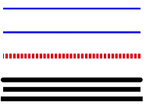

# line


>  **NOTE**
>
>  This component is supported since API version 7. Updates will be marked with a superscript to indicate their earliest API version.

The **\<line>** component is used to draw a line.

## Required Permissions

None


## Child Components

The following are supported: [animate](js-components-svg-animate.md), [animateMotion](js-components-svg-animatemotion.md), and [animateTransform](js-components-svg-animatetransform.md).


## Attributes

The [universal attributes](js-components-svg-common-attributes.md) and the attributes listed below are supported.

| Name| Type| Default Value| Mandatory| Description|
| -------- | -------- | -------- | -------- | -------- |
| id | string | - | No| Unique ID of the component.|
| x1 | &lt;length&gt;\|&lt;percentage&gt; | - | No| X-coordinate of the start point of the line. Attribute animations are supported.|
| y1 | &lt;length&gt;\|&lt;percentage&gt; | - | No| Y-coordinate of the start point of the line. Attribute animations are supported.|
| x2 | &lt;length&gt;\|&lt;percentage&gt; | - | No| X-coordinate of the end point of the line. Attribute animations are supported.|
| y2 | &lt;length&gt;\|&lt;percentage&gt; | - | No| Y-coordinate of the end point of the line. Attribute animations are supported.|


## Example

```html
<!-- xxx.hml -->
<div class="container">
    <svg width="400" height="400">
        <line x1="10" x2="300" y1="50" y2="50" stroke-width="4" fill="white" stroke="blue"></line>
        <line x1="10" x2="300" y1="100" y2="100" stroke-width="4" fill="white" stroke="blue"></line>
        <line x1="10" x2="300" y1="150" y2="150" stroke-width="10" stroke="red" stroke-dasharray="5 3"
            stroke-dashoffset="3"></line>
        <!--round: At the end of each path the stroke is extended by a half circle with a diameter equal to the stroke width. -->
        <line x1="10" x2="300" y1="200" y2="200" stroke-width="10" stroke="black" stroke-linecap="round"></line>
        <!--butt: The stroke for each path does not extend beyond its two endpoints. -->
        <line x1="10" x2="300" y1="220" y2="220" stroke-width="10" stroke="black" stroke-linecap="butt"></line>
        <!-- square: At the end of each path the stroke is extended by a half circle, with the width being equal to half of the stroke width, and the height being equal to the stroke width. -->
        <line x1="10" x2="300" y1="240" y2="240" stroke-width="10" stroke="black" stroke-linecap="square"></line>
    </svg>
</div>
```



