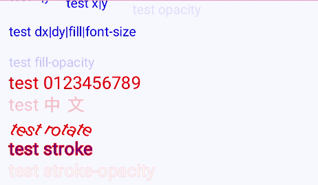
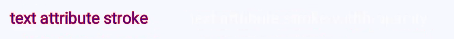

# text


>  **NOTE**
>
>  - This component is supported since API version 7. Updates will be marked with a superscript to indicate their earliest API version.
>
>  - The text content must be written in the content area. The **tspan** sub-element label can be nested to segment the text content. The **textPath** sub-element label can be nested to draw the text content based on the specified path.
>
>  - **\<text>** can be nested only by the parent element label **svg**.
>
>  - Only the default font **sans-serif** is supported.

The **\<text>** component is used to display a piece of textual information.

## Required Permissions

None


## Child Components

The following are supported: [\<tspan>](js-components-svg-tspan.md), [\<textpath>](js-components-svg-textpath.md), [\<animate>](js-components-svg-animate.md), and [\<animateTransform>](js-components-svg-animatetransform.md).


## Attributes

The attributes in the following table are supported.

| Name            | Type                                | Default Value  | Mandatory  | Description                                      |
| -------------- | ---------------------------------- | ----- | ---- | ---------------------------------------- |
| id             | string                             | -     | No   | Unique ID of the component.                                |
| x              | &lt;length&gt; \| &lt;percentage&gt; | 0     | No   | X-coordinate of the upper left corner of the component.                             |
| y              | &lt;length&gt; \| &lt;percentage&gt; | 0     | No   | Y-coordinate of the upper left corner of the component.                             |
| dx             | &lt;length&gt; \| &lt;percentage&gt; | 0     | No   | Offset of the text on the x-axis.                                |
| dy             | &lt;length&gt; \| &lt;percentage&gt; | 0     | No   | Offset of the text on the y-axis.                                |
| rotate         | number                             | 0     | No   | Rotation of the text around its lower left corner. A positive number indicates clockwise rotation, and a negative number indicates counterclockwise rotation.               |
| font-size      | &lt;length&gt;                     | 30px  | No   | Font size.                                |
| fill           | &lt;color&gt;                      | black | No   | Fill color of the text.                                  |
| fill-opacity   | number                             | 1.0   | No   | Fill opacity of the text.                                 |
| opacity        | number                             | 1     | No   | Opacity of an element. The value ranges from **0** to **1**. The value **1** means opaque, and **0** means completely transparent. Attribute animations are supported.|
| stroke         | &lt;color&gt;                      | black | No   | Stroke color.                             |
| stroke-width   | number                             | 1px   | No   | Stroke width.                                  |
| stroke-opacity | number                             | 1.0   | No   | Stroke opacity.                                 |


## Example

```css
/* xxx.css */
.container {    
    flex-direction: row;
    justify-content: flex-start;
    align-items: flex-start;
    height: 1000px;
    width: 1080px;
}
```

```html
<!-- xxx.hml -->
<div class="container">
  <svg>
    <text x="20px" y="0px" font-size="30" fill="blue">test x|y</text>
    <text x="150" y="15" font-size="30" fill="blue">test x|y</text>
    <text x="300" y="30" font-size="30" fill="blue" opacity="0.1">test opacity</text>
    <text dx="20" y="30" dy="50" fill="blue" font-size="30">test dx|dy|fill|font-size</text>
    <text x="20" y="150" fill="blue" font-size="30" fill-opacity="0.2">test fill-opacity</text>
    <text x="20" y="200" fill="red" font-size="40">test 0123456789</text>
    <text x="20" y="250" fill="red" font-size="40" fill-opacity="0.2">Test</text>
    <text x="20" y="300" rotate="30" fill="red" font-size="40">test rotate</text>
    <text x="20" y="350" fill="blue" font-size="40" stroke="red" stroke-width="2">test stroke</text>
    <text x="20" y="400" fill="white" font-size="40" stroke="red" stroke-width="2" stroke-opacity="0.5">test stroke-opacity</text>
  </svg>
</div>
```



Attribute animation example

```css
/* xxx.css  */
.container {
    flex-direction: row;
    justify-content: flex-start;
    align-items: flex-start;
    height: 3000px;
    width: 1080px;
}
```

```html
<!-- xxx.hml -->
<div class="container">
  <svg>
    <text y="50" font-size="30" fill="blue">
        text attribute x|opacity|rotate
      <animate attributeName="x" from="100" by="400" dur="3s" repeatCount="indefinite"></animate>
      <animate attributeName="opacity" from="0.01" to="0.99" dur="3s" repeatCount="indefinite"></animate>
      <animate attributeName="rotate" from="0" to="360" dur="3s" repeatCount="indefinite"></animate>
    </text>
  </svg>
</div>
```


```html
<!-- xxx.hml -->
<div class="container">
  <svg>
    <text x="20" y="200" fill="blue">
      text attribute font-size
      <animate attributeName="font-size" from="10" to="50" dur="3s" repeatCount="indefinite">
      </animate>
    </text>
  </svg>
</div>
```


```html
<!-- xxx.hml -->
<div class="container">
  <svg>
    <text x="20" y="250" font-size="25" fill="blue" stroke="red">
      text attribute stroke
      <animate attributeName="stroke" from="red" to="#00FF00" dur="3s" repeatCount="indefinite"></animate>
    </text>
    <text x="300" y="250" font-size="25" fill="white" stroke="red">
      text attribute stroke-width-opacity
      <animate attributeName="stroke-width" from="1" to="5" dur="3s" repeatCount="indefinite"></animate>
      <animate attributeName="stroke-opacity" from="0.01" to="0.99" dur="3s" repeatCount="indefinite"></animate>
    </text>
  </svg>
</div>
```


