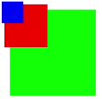

# svg

The **\<svg>** component is a basic container. It can be used as the root node of an SVG document or be used to nest an SVG fragment into an SVG document.


>  **NOTE**
>  - This component is supported since API version 7. Updates will be marked with a superscript to indicate their earliest API version.
>
>  - The width and height must be defined for the **\<svg>** parent component or **\<svg>** component. Otherwise, the component is not drawn.

## Required Permissions

None


## Child Components

The following are supported: [\<svg>](js-components-svg.md), [\<rect>](js-components-svg-rect.md), [\<circle>](js-components-svg-circle.md), [\<ellipse>](js-components-svg-ellipse.md), [\<path>](js-components-svg-path.md), [\<line](js-components-svg-line.md), [\<polygon>](js-components-svg-polygon.md), [\<polyline>](js-components-svg-polyline.md), [\<text>](js-components-svg-text.md), [\<animate>](js-components-svg-animate.md), and [\<animateTransform>](js-components-svg-animatetransform.md).


## Attributes

The [universal attributes](js-components-svg-common-attributes.md) and the attributes listed below are supported. The configured universal attributes are passed to the child components.

| Name    | Type                               | Default Value | Mandatory | Description                              |
| ------- | ---------------------------------- | ------------- | --------- | ---------------------------------------- |
| id      | string                             | -             | No        | Unique ID of the component.              |
| width   | &lt;length&gt;\|&lt;percentage&gt; | -             | No        | Component width.                         |
| height  | &lt;length&gt;\|&lt;percentage&gt; | -             | No        | Component height.                        |
| x       | &lt;length&gt;\|&lt;percentage&gt; | -             | No        | X-coordinate of the current **\<svg>** component. The settings do not work for the root **\<svg>** node. |
| y       | &lt;length&gt;\|&lt;percentage&gt; |               | No        | Y-coordinate of the current **\<svg>** component. The settings do not work for the root **\<svg>** node. |
| viewBox | string                             | -             | No        | View box of the current **\<svg>** component. The supported format is \<number number number number>. The four parameters indicate **min-x**, **min-y**, **width**, and **height**, respectively. The width and height of the view box are different from those of the **\<svg>** component. The view box is scaled in center-aligned mode. |


## Example

```html
<!-- xxx.hml -->
<div class="container">
  <svg width="400" height="400">
    <svg width="200" height="200" viewBox="0 0 100 100">
      <rect x="10" y="10" width="80" height="80" fill="#00FF00"></rect>
    </svg>
    <rect x="10" y="10" width="80" height="80" fill="red" ></rect>
    <svg x="0" y="0" width="200" height="200" viewBox="0 0 200 200">
      <rect x="10" y="10" width="80" height="80" fill="red"></rect>
    </svg>
    <svg x="0" y="0" width="200" height="200" viewBox="0 0 400 400">
      <rect x="10" y="10" width="80" height="80" fill="blue"></rect>
    </svg>
  </svg>
</div>
```



