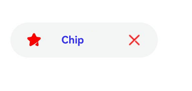
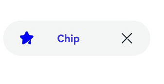
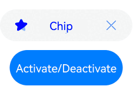

# Chip

The chip component is typically used in the search box history or email address list.

> **NOTE**
>
> This component is supported since API version 11. Updates will be marked with a superscript to indicate their earliest API version.

## Child Components

Not supported

## Chip

Chip({options:ChipOptions})

**Decorator**: @Builder

**Atomic service API**: This API can be used in atomic services since API version 12.

**System capability**: SystemCapability.ArkUI.ArkUI.Full

**Parameters**

| Name   | Type                       | Mandatory| Decorator| Description                |
| ------- | --------------------------- | ---- | ---------- | -------------------- |
| options | [ChipOptions](#chipoptions) | Yes  | @Builder   | Parameters of the chip.|

## ChipOptions

Defines the type and style parameters of the chip.

**Atomic service API**: This API can be used in atomic services since API version 12.

**System capability**: SystemCapability.ArkUI.ArkUI.Full

| Name           | Type                                                        | Mandatory| Description                                                        |
| --------------- | ------------------------------------------------------------ | ---- | ------------------------------------------------------------ |
| size            | [ChipSize](#chipsize) \| [SizeOptions](ts-types.md#sizeoptions) | No  | Size of the chip.<br>Default value: **ChipSize**: **ChipSize.NORMAL**<br>   If of the SizeOptions type, this parameter cannot be set in percentage.|
| enabled         | boolean                                                      | No  | Whether the chip can be selected.<br>Default value: **true**|
| activated<sup>12+</sup>       | boolean                                        | No  | Whether the chip is activated.<br>Default value: **false**                     |
| prefixIcon      | [PrefixIconOptions](#prefixiconoptions)                      | No  | Prefix icon of the chip.|
| prefixSymbol<sup>12+</sup>    | [ChipSymbolGlyphOptions](#chipsymbolglyphoptions12)              | No  | Symbol-type prefix icon of the chip.|
| label           | [LabelOptions](#labeloptions)                                | Yes  | Text of the chip.  |
| suffixIcon      | [SuffixIconOptions](#suffixiconoptions)                      | No  | Suffix icon of the chip.|
| suffixSymbol<sup>12+</sup>    | [ChipSymbolGlyphOptions](#chipsymbolglyphoptions12)              | No  | Symbol-type suffix icon of the chip.|
| backgroundColor | [ResourceColor](ts-types.md#resourcecolor)                   | No  | Background color of the chip.<br>Default value: **$r('sys.color.ohos_id_color_button_normal').**|
| activatedBackgroundColor<sup>12+</sup> | [ResourceColor](ts-types.md#resourcecolor)          | No  | Background color of the chip when it is activated.<br>Default value: **$r('sys.color.ohos_id_color_emphasize').**|
| borderRadius    | [Dimension](ts-types.md#dimension10)                         | No  | Border radius of the chip. This parameter cannot be set in percentage.<br>Default value: **$r('sys.float.ohos_id_corner_radius_button')**|
| allowClose      | boolean                                                      | No  | Whether to show the close icon.<br>Default value: **true** |
| onClose         | ()=>void                                                     | No  | Event triggered when the close icon is clicked.|
| onClicked<sup>12+</sup>       | ()=>void                                       | No  | Event triggered when the chip is clicked.                                      |
| direction<sup>12+</sup> | [Direction](ts-appendix-enums.md#direction) | No| Layout direction.<br>Default value: **Direction.Auto**|

> **NOTE**
>
> 1. When **suffixSymbol** is provided with an argument, **suffixIcon** and **allowClose** will not take effect. If **suffixSymbol** is not provided, but **suffixIcon** is, **allowClose** still will not take effect. When neither **suffixSymbol** nor **suffixIcon** is provided with arguments, **allowClose** determines whether the deletion icon is displayed.
>
> 2. If **undefined** is assigned to **backgroundColor** or **activatedBackgroundColor**, the default background color is used. If an invalid value is specified, the background color is transparent.
>
> 3. Default font colors for **prefixSymbol** and **suffixSymbol**: **normalFontColor**: **[$r('sys.color.ohos_id_color_primary')]**; **activatedFontColor**: **[$r('sys.color.ohos_id_color_text_primary_contrary')]**. The default value of **fontColor** is **16**.
>
> 4. The default value of **fillColor** is **$r('sys.color.ohos_id_color_secondary')** for **prefixIcon** and **$r('sys.color.ohos_id_color_primary')** for **suffixIcon**. The color parsing of **fillColor** is the same as that of the **Image** component.
>
> 5. The default value of **activatedFillColor** is **$r('sys.color.ohos_id_color_text_primary_contrary')** for **prefixIcon** and **$r('sys.color.ohos_id_color_text_primary_contrary')** for **suffixIcon**. The color parsing of **activatedFillColor** is the same as that of the **Image** component.

## ChipSize

Enumerates the size types of the chip.

**Atomic service API**: This API can be used in atomic services since API version 12.

**System capability**: SystemCapability.ArkUI.ArkUI.Full

| Name  | Value      | Description              |
| ------ | -------- | ------------------ |
| NORMAL | "NORMAL" | Normal size.|
| SMALL  | "SMALL"  | Small size. |

## IconCommonOptions

Defines the common icon options of the chip.

**Atomic service API**: This API can be used in atomic services since API version 12.

**System capability**: SystemCapability.ArkUI.ArkUI.Full

| Name     | Type                                      | Mandatory| Description                                                        |
| --------- | ------------------------------------------ | ---- | ------------------------------------------------------------ |
| src       | [ResourceStr](ts-types.md#resourcestr)     | Yes  | Icon source, which can be a specific image path or an image reference.|
| size      | [SizeOptions](ts-types.md#sizeoptions)     | No  | Icon size. This parameter cannot be set in percentage.<br>Default value: **{width: 16,height: 16}**|
| fillColor | [ResourceColor](ts-types.md#resourcecolor) | No  | Icon fill color.|
| activatedFillColor<sup>12+</sup> | [ResourceColor](ts-types.md#resourcecolor) | No  | Icon fill color when the chip is activated.                           |

> **NOTE**
>
> **fillColor** and **activatedFillColor** take effect only when the icon format is SVG.
>

## PrefixIconOptions

Defines the prefix icon options.

Inherits [IconCommonOptions](#iconcommonoptions).

**Atomic service API**: This API can be used in atomic services since API version 12.

**System capability**: SystemCapability.ArkUI.ArkUI.Full

## SuffixIconOptions

Defines the suffix icon options.

Inherits [IconCommonOptions](#iconcommonoptions).

**Atomic service API**: This API can be used in atomic services since API version 12.

**System capability**: SystemCapability.ArkUI.ArkUI.Full

| Name  | Type      | Mandatory| Description              |
| ------ | ---------- | ---- | ------------------ |
| action | () => void | No  | Action of the suffix icon.|

## ChipSymbolGlyphOptions<sup>12+</sup>

Defines the prefix and suffix icon options.

**Atomic service API**: This API can be used in atomic services since API version 12.

**System capability**: SystemCapability.ArkUI.ArkUI.Full

| Name  | Type      | Mandatory| Description              |
| ------ | ---------- | ---- | ------------------ |
| normal | [SymbolGlyphModifier](ts-universal-attributes-attribute-modifier.md) | No  | Icon setup event.|
| activated | [SymbolGlyphModifier](ts-universal-attributes-attribute-modifier.md) | No  | Icon setup event when the icon is activated.|

> **NOTE**
>
> Modifying the animation type with **symbolEffect** and setting the animation with **effectStrategy** are not supported.
>

## LabelOptions

Defines the label options of the chip.

**Atomic service API**: This API can be used in atomic services since API version 12.

**System capability**: SystemCapability.ArkUI.ArkUI.Full

| Name       | Type                                      | Mandatory| Description                                                        |
| ----------- | ------------------------------------------ | ---- | ------------------------------------------------------------ |
| text        | string                                     | Yes  | Text content.|
| fontSize    | [Dimension](ts-types.md#dimension10)       | No  | Font size. This parameter cannot be set in percentage.<br>Default value: **$r('sys.float.ohos_id_text_size_button2')**|
| fontColor   | [ResourceColor](ts-types.md#resourcecolor) | No  | Font color.<br>Default value: **$r('sys.color.ohos_id_color_text_primary')**|
| activatedFontColor<sup>12+</sup>   | [ResourceColor](ts-types.md#resourcecolor) | No  | Font color when the chip is activated.<br>Default value: **$r('sys.color.ohos_id_color_text_primary_contrary').**|
| fontFamily  | string                                     | No  | Font family.<br>Default value: **"HarmonyOS Sans"**|
| labelMargin | [LabelMarginOptions](#labelmarginoptions)  | No  | Spacing between the text and the left and right icons.|
| localizedLabelMargin<sup>12+</sup> | [LocalizedLabelMarginOptions](#localizedlabelmarginoptions12) | No| Spacing between the localized text and the left and right icons.<br>Default value: {<br>start:  LengthMetrics.vp(6), end: LengthMetrics.vp(6)<br>} |

## LabelMarginOptions

Defines the spacing between the text and the left and right icons.

**Atomic service API**: This API can be used in atomic services since API version 12.

**System capability**: SystemCapability.ArkUI.ArkUI.Full

| Name | Type                                | Mandatory| Description                                  |
| ----- | ------------------------------------ | ---- | -------------------------------------- |
| left  | [Dimension](ts-types.md#dimension10) | No  | Spacing between the text and the left icon. This parameter cannot be set in percentage.|
| right | [Dimension](ts-types.md#dimension10) | No  | Spacing between the text and the right icon. This parameter cannot be set in percentage.|

## LocalizedLabelMarginOptions<sup>12+</sup>

Defines the spacing between the localized text and the left and right icons.

**Atomic service API**: This API can be used in atomic services since API version 12.

**System capability**: SystemCapability.ArkUI.ArkUI.Full

| Name | Type                                                        | Mandatory| Description                                  |
| ----- | ------------------------------------------------------------ | ---- | -------------------------------------- |
| start | [LengthMetrics](../js-apis-arkui-graphics.md#lengthmetrics12) | No  | Spacing between the text and the left icon. This parameter cannot be set in percentage.|
| end   | [LengthMetrics](../js-apis-arkui-graphics.md#lengthmetrics12) | No  | Spacing between the text and the right icon. This parameter cannot be set in percentage.|

## Example

### Example 1

This example defines a custom chip for the deletion icon.

```ts
import { Chip, ChipSize } from '@kit.ArkUI';

@Entry
@Component
struct Index {
  build() {
    Column({ space: 10 }) {
      Chip({
        prefixIcon: {
          src: $r('app.media.chips'),
          size: { width: 16, height: 16 },
          fillColor: Color.Red
        },
        label: {
          text: "Chip",
          fontSize: 12,
          fontColor: Color.Blue,
          fontFamily: "HarmonyOS Sans",
          labelMargin: { left: 20, right: 30 }
        },
        suffixIcon: {
          src: $r('app.media.close'),
          size: { width: 16, height: 16 },
          fillColor: Color.Red
        },
        size: ChipSize.NORMAL,
        allowClose: false,
        enabled: true,
        backgroundColor: $r('sys.color.ohos_id_color_button_normal'),
        borderRadius: $r('sys.float.ohos_id_corner_radius_button')
      })
    }
  }
}
```




### Example 2

This example implements the default chip for the deletion icon.

```ts
import { Chip, ChipSize } from '@kit.ArkUI';

@Entry
@Component
struct Index {
  build() {
    Column({ space: 10 }) {
      Chip({
        prefixIcon: {
          src: $r('app.media.chips'),
          size: { width: 16, height: 16 },
          fillColor: Color.Blue
        },
        label: {
          text: "Chip",
          fontSize: 12,
          fontColor: Color.Blue,
          fontFamily: "HarmonyOS Sans",
          labelMargin: { left: 20, right: 30 }
        },
        size: ChipSize.NORMAL,
        allowClose: true,
        enabled: true,
        backgroundColor: $r('sys.color.ohos_id_color_button_normal'),
        borderRadius: $r('sys.float.ohos_id_corner_radius_button')
      })
    }
  }
}
```




### Example 3

This example shows how to hide the chip for the deletion icon.

```ts
import { Chip, ChipSize } from '@kit.ArkUI';

@Entry
@Component
struct Index {
  build() {
    Column({ space: 10 }) {
      Chip({
        prefixIcon: {
          src: $r('app.media.chips'),
          size: { width: 16, height: 16 },
          fillColor: Color.Blue
        },
        label: {
          text: "Chip",
          fontSize: 12,
          fontColor: Color.Blue,
          fontFamily: "HarmonyOS Sans",
          labelMargin: { left: 20, right: 30 }
        },
        size: ChipSize.SMALL,
        allowClose: false,
        enabled: true,
        backgroundColor: $r('sys.color.ohos_id_color_button_normal'),
        borderRadius: $r('sys.float.ohos_id_corner_radius_button'),
        onClose:()=>{
          console.log("chip on close")
      }
      })
    }
  }
}
```


### Example 4

This example implements a chip in the activated state.

```ts
import { Chip, ChipSize } from '@kit.ArkUI';

@Entry
@Component
struct Index {
  @State isActivated: boolean = false

  build() {
    Column({ space: 10 }) {
      Chip({
        prefixIcon: {
          src: $r('app.media.chips'),
          size: { width: 16, height: 16 },
          fillColor: Color.Blue,
          activatedFillColor: $r('sys.color.ohos_id_color_text_primary_contrary')
        },
        label: {
          text: "Chip",
          fontSize: 12,
          fontColor: Color.Blue,
          activatedFontColor: $r('sys.color.ohos_id_color_text_primary_contrary'),
          fontFamily: "HarmonyOS Sans",
          labelMargin: { left: 20, right: 30 }
        },
        size: ChipSize.NORMAL,
        allowClose: true,
        enabled: true,
        activated: this.isActivated,
        backgroundColor: $r('sys.color.ohos_id_color_button_normal'),
        activatedBackgroundColor: $r('sys.color.ohos_id_color_emphasize'),
        borderRadius: $r('sys.float.ohos_id_corner_radius_button'),
        onClose:()=>{
          console.log("chip on close")
        },
        onClicked:()=>{
          console.log("chip on clicked")
        }
      })

      Button('Activate/Deactivate').onClick(()=>{
        this.isActivated = !this.isActivated
      })
    }
  }
}
```




### Example 5

This example implements symbol-type prefix and suffix icons for the **Chip** component.

```ts
import { Chip, ChipSize, SymbolGlyphModifier } from '@kit.ArkUI';

@Entry
@Component
struct Index {
  @State isActivated: boolean = false

  build() {
    Column({ space: 10 }) {
      Chip({
        prefixIcon: {
          src: $r('app.media.chips'),
          size: { width: 16, height: 16 },
          fillColor: Color.Blue,
          activatedFillColor: $r('sys.color.ohos_id_color_text_primary_contrary')
        },
		prefixSymbol: {
          normal: new SymbolGlyphModifier($r('sys.symbol.ohos_star')).fontSize(16).fontColor([Color.Green]),
          activated: new SymbolGlyphModifier($r('sys.symbol.ohos_star')).fontSize(16).fontColor([Color.Red]),
		},
        label: {
          text: "Chip",
          fontSize: 12,
          fontColor: Color.Blue,
          activatedFontColor: $r('sys.color.ohos_id_color_text_primary_contrary'),
          fontFamily: "HarmonyOS Sans",
          labelMargin: { left: 20, right: 30 },
        },
        size: ChipSize.NORMAL,
        allowClose: true,
        enabled: true,
        activated: this.isActivated,
        backgroundColor: $r('sys.color.ohos_id_color_button_normal'),
        activatedBackgroundColor: $r('sys.color.ohos_id_color_emphasize'),
        borderRadius: $r('sys.float.ohos_id_corner_radius_button'),
        onClose:()=>{
          console.log("chip on close")
        },
        onClicked:()=>{
          console.log("chip on clicked")
        }
      })

      Button('Activate/Deactivate').onClick(()=>{
        this.isActivated = !this.isActivated
      })
    }
  }
}
```


### Example 6

This example mirrors the layout of the **Chip** component.

```ts

import { Chip, ChipSize,LengthMetrics } from '@kit.ArkUI';

@Entry
@Component
struct ChipPage {

  build() {
    Column() {
      Chip({
        direction: Direction.Rtl,
        prefixIcon: {
          src: $r('app.media.chips'),
          size: { width: 16, height: 16 },
          fillColor: Color.Red,
        },
        label: {
          text: "Chip",
          fontSize: 12,
          fontColor: Color.Blue,
          fontFamily: "HarmonyOS Sans",
          localizedLabelMargin: { start: LengthMetrics.vp(20), end: LengthMetrics.vp(20) },
        },
        suffixIcon: {
          src: $r('app.media.close'),
          size: { width: 16, height: 16 },
          fillColor: Color.Red,
        },
        size: ChipSize.NORMAL,
        allowClose: false,
        enabled: true,
        backgroundColor: $r('sys.color.ohos_id_color_button_normal'),
        borderRadius: $r('sys.float.ohos_id_corner_radius_button')
      })
    }.justifyContent(FlexAlign.Center)
    .width('100%')
    .height('100%')
  }
}
```


