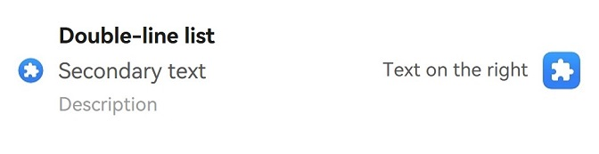
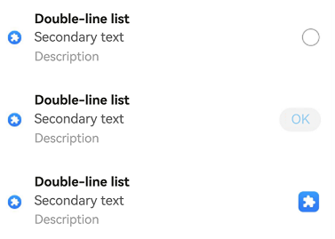
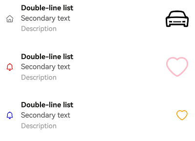

# ComposeListItem


The **ComposeListItem** component is a container that presents a series of items arranged in a column with the same width. You can use it to present data of the same type in a multiple and coherent row style, for example, images or text.


> **NOTE**
>
> This component is supported since API version 10. Updates will be marked with a superscript to indicate their earliest API version.
>
> This component is not supported on wearables.


## Modules to Import

```
import { ComposeListItem } from "@kit.ArkUI";
```


## Child Components

Not supported

## Attributes
The [universal attributes](ts-component-general-attributes.md) are not supported.


## ComposeListItem

ComposeListItem({contentItem?: ContentItem, operateItem?: OperateItem})

Creates a **ComposeListItem** component that allows customization of the left, center, and right content areas.

**Decorator**: @Component

**System capability**: SystemCapability.ArkUI.ArkUI.Full


| Name| Type| Mandatory| Decorator| Description|
| -------- | -------- | -------- | -------- | -------- |
| contentItem | [ContentItem](#contentitem) | No| \@Prop | Elements on the left and in the center.<br>**Atomic service API**: This API can be used in atomic services since API version 11.|
| operateItem | [OperateItem](#operateitem) | No| \@Prop | Element on the right.<br>**Atomic service API**: This API can be used in atomic services since API version 11.|

## ContentItem

Defines elements for the left and center areas of the **ComposeListItem** component.

**System capability**: SystemCapability.ArkUI.ArkUI.Full


| Name| Type| Mandatory| Description|
| -------- | -------- | -------- | -------- |
| iconStyle | [IconType](#icontype) | No| Icon style of the element on the left.<br>**Atomic service API**: This API can be used in atomic services since API version 11.|
| icon | [ResourceStr](ts-types.md#resourcestr) | No| Icon resource of the element on the left.<br>**Atomic service API**: This API can be used in atomic services since API version 11.|
| symbolStyle<sup>18+</sup> | [SymbolGlyphModifier](ts-universal-attributes-attribute-modifier.md) | No| Symbol icon resource of the element on the left, which has higher priority than **icon**.<br>**Atomic service API**: This API can be used in atomic services since API version 18.|
| primaryText | [ResourceStr](ts-types.md#resourcestr) | No| Primary text of the element in the center.<br>**Text processing rules**: Text will wrap to a new line when it exceeds the length limit.<br>**Atomic service API**: This API can be used in atomic services since API version 11. |
| secondaryText | [ResourceStr](ts-types.md#resourcestr) | No| Secondary text of the element in the center.<br>**Text processing rules**: Text will wrap to a new line when it exceeds the length limit.<br>**Atomic service API**: This API can be used in atomic services since API version 11.|
| description | [ResourceStr](ts-types.md#resourcestr) | No| Description of the element in the center.<br>**Text processing rules**: Text will wrap to a new line when it exceeds the length limit.<br>**Atomic service API**: This API can be used in atomic services since API version 11. |

## IconType

Defines the icon type of the element on the left of the **ComposeListItem** component.

**Atomic service API**: This API can be used in atomic services since API version 11.

**System capability**: SystemCapability.ArkUI.ArkUI.Full

| Name| Value| Description|
| -------- | -------- | -------- |
| BADGE | 1 | Badge with an icon size of 8 x 8 vp.|
| NORMAL_ICON | 2 | Small icon with an icon size of 16 x 16 vp.|
| SYSTEM_ICON | 3 | System icon with an icon size of 24 x 24 vp.|
| HEAD_SCULPTURE | 4 | Profile picture with an icon size of 40 x 40 vp.|
| APP_ICON | 5 | Application icon with an icon size of 64 x 64 vp.|
| PREVIEW | 6 | Preview image with an icon size of 96 x 96 vp.|
| LONGITUDINAL | 7 | Icon with a horizontal special ratio (width is greater than height), keeping the longest side at 96 vp.|
| VERTICAL | 8 | Icon with a vertical special ratio (height is greater than width), keeping the longest side at 96 vp.|

## OperateItem

Defines the element type and text content on the right of the **ComposeListItem** component.

**System capability**: SystemCapability.ArkUI.ArkUI.Full

| Name| Type| Mandatory| Description|
| -------- | -------- | -------- | -------- |
| arrow | [OperateIcon](#operateicon) | No| Arrow with a size of 12 x 24 vp.<br>**Atomic service API**: This API can be used in atomic services since API version 11. |
| icon | [OperateIcon](#operateicon) | No| First icon with a size of 24 x 24 vp.<br>**Atomic service API**: This API can be used in atomic services since API version 11. |
| subIcon | [OperateIcon](#operateicon) | No| Second icon with a size of 24 x 24 vp.<br>**Atomic service API**: This API can be used in atomic services since API version 11. |
| button | [OperateButton](#operatebutton) | No| Button.<br>**Atomic service API**: This API can be used in atomic services since API version 11. |
| switch | [OperateCheck](#operatecheck) | No| Switch.<br>**Atomic service API**: This API can be used in atomic services since API version 11. |
| checkbox | [OperateCheck](#operatecheck) | No| Check box with a size of 24 x 24 vp.<br>**Atomic service API**: This API can be used in atomic services since API version 11. |
| radio | [OperateCheck](#operatecheck) | No| Radio button with a size of 24 x 24 vp.<br>**Atomic service API**: This API can be used in atomic services since API version 11. |
| image | [ResourceStr](ts-types.md#resourcestr) | No| Image with a size of 48 x 48 vp.<br>**Atomic service API**: This API can be used in atomic services since API version 11. |
| symbolStyle<sup>18+</sup> | [SymbolGlyphModifier](ts-universal-attributes-attribute-modifier.md) | No| Symbol with a size of 48 x 48 vp.<br>**Atomic service API**: This API can be used in atomic services since API version 18.|
| text | [ResourceStr](ts-types.md#resourcestr) | No| Text.<br>**Atomic service API**: This API can be used in atomic services since API version 11.|

## OperateIcon

Provides configuration options for icon elements on the right of the **ComposeListItem** component.

**System capability**: SystemCapability.ArkUI.ArkUI.Full

| Name| Type| Mandatory| Description                                                                                                                                                                                                                                                  |
| -------- | -------- | -------- |------------------------------------------------------------------------------------------------------------------------------------------------------------------------------------------------------------------------------------------------------|
| value | [ResourceStr](ts-types.md#resourcestr) | Yes| Resource of the icon or arrow on the right.<br>**Atomic service API**: This API can be used in atomic services since API version 11.                                                                                                                                                                                                                                          |
| symbolStyle<sup>18+</sup> | [SymbolGlyphModifier](ts-universal-attributes-attribute-modifier.md) | No| Resource of the symbol icon or arrow on the right, which has higher priority than **value**.<br>**Atomic service API**: This API can be used in atomic services since API version 18.|
| action | ()=&gt;void | No| Click event of the icon or arrow on the right.<br>**Atomic service API**: This API can be used in atomic services since API version 11.                                                                                                                                                                                                                                       |
| accessibilityText<sup>18+</sup>        | [ResourceStr](ts-types.md#resourcestr)                    | No| Accessibility text, that is, accessible label name, of the icon or arrow on the right. If a component does not contain text information, it will not be announced by the screen reader when selected. In this case, the screen reader user cannot know which component is selected. To solve this problem, you can set accessibility text for components without text information. When such a component is selected, the screen reader announces the specified accessibility text, informing the user which component is selected.<br>Default value: **""**<br>**Atomic service API**: This API can be used in atomic services since API version 18.                                         |
| accessibilityDescription<sup>18+</sup> | [ResourceStr](ts-types.md#resourcestr)                    | No| Accessible description of the icon or arrow on the right. You can provide comprehensive text explanations to help users understand the operation they are about to perform and its potential consequences, especially when these cannot be inferred from the component's attributes and accessibility text alone. If a component contains both text information and the accessible description, the text is announced first and then the accessible description, when the component is selected.<br>Default value: **"Double-tap to activate"**<br>**Atomic service API**: This API can be used in atomic services since API version 18.   |
| accessibilityLevel<sup>18+</sup>       | string                                                    | No| Accessibility level of the icon or arrow on the right. It determines whether the component can be recognized by accessibility services.<br>The options are as follows:<br>**"auto"**: It is treated as "no" by the system.<br>**"yes"**: The component can be recognized by accessibility services.<br>**"no"**: The component cannot be recognized by accessibility services.<br>**"no-hide-descendants"**: Neither the component nor its child components can be recognized by accessibility services.<br>Default value: **"auto"**.<br>**Atomic service API**: This API can be used in atomic services since API version 18.|

## OperateButton

Provides configuration options for button-based elements on the right of the **ComposeListItem** component.

**System capability**: SystemCapability.ArkUI.ArkUI.Full

| Name| Type| Mandatory| Description|
| -------- | -------- | -------- | -------- |
| text | [ResourceStr](ts-types.md#resourcestr) | No| Text of the button on the right.<br>**Atomic service API**: This API can be used in atomic services since API version 11.|
| accessibilityText<sup>18+</sup>        | [ResourceStr](ts-types.md#resourcestr)                    | No| Accessibility text, that is, accessible label name, of the button on the right. If a component does not contain text information, it will not be announced by the screen reader when selected. In this case, the screen reader user cannot know which component is selected. To solve this problem, you can set accessibility text for components without text information. When such a component is selected, the screen reader announces the specified accessibility text, informing the user which component is selected.<br>**Atomic service API**: This API can be used in atomic services since API version 18.                                 |
| accessibilityDescription<sup>18+</sup> | [ResourceStr](ts-types.md#resourcestr)                    | No| Accessible description of the button on the right. You can provide comprehensive text explanations to help users understand the operation they are about to perform and its potential consequences, especially when these cannot be inferred from the component's attributes and accessibility text alone. If a component contains both text information and the accessible description, the text is announced first and then the accessible description, when the component is selected.<br>**Atomic service API**: This API can be used in atomic services since API version 18.         |
| accessibilityLevel<sup>18+</sup>       | string                                                    | No| Accessibility level of the button on the right. It determines whether the component can be recognized by accessibility services.<br>The options are as follows:<br>**"auto"**: It is treated as "no" by the system.<br>**"yes"**: The component can be recognized by accessibility services.<br>**"no"**: The component cannot be recognized by accessibility services.<br>**"no-hide-descendants"**: Neither the component nor its child components can be recognized by accessibility services.<br>Default value: **"auto"**.<br>**Atomic service API**: This API can be used in atomic services since API version 18.|

## OperateCheck

Provides configuration options for switch, check box, or radio button elements on the right of the **ComposeListItem** component.

**System capability**: SystemCapability.ArkUI.ArkUI.Full

| Name| Type| Mandatory| Description                                                                                                                                                                                                                                                                                  |
| -------- | -------- | -------- |--------------------------------------------------------------------------------------------------------------------------------------------------------------------------------------------------------------------------------------------------------------------------------------|
| isCheck | boolean | No| Whether the switch, check box, or radio button on the right is selected.<br> Default value: **false**.<br> **true**: selected.<br> **false**: not selected.<br>**Atomic service API**: This API can be used in atomic services since API version 11.                                                                                                                                                                         |
| onChange | (value: boolean)=&gt;void | No| Callback invoked when the selected state of the switch, check box, or radio button on the right is changed.<br> **true**: from not selected to selected<br> **false**: from selected to not selected<br>**Atomic service API**: This API can be used in atomic services since API version 11.                                                                                                                                                                                       |
| accessibilityText<sup>18+</sup>        | [ResourceStr](ts-types.md#resourcestr)                    | No| Accessibility text, that is, accessible label name, of the switch, check box, or radio button on the right. If a component does not contain text information, it will not be announced by the screen reader when selected. In this case, the screen reader user cannot know which component is selected. To solve this problem, you can set accessibility text for components without text information. When such a component is selected, the screen reader announces the specified accessibility text, informing the user which component is selected.<br>**Atomic service API**: This API can be used in atomic services since API version 18.                                                                   |
| accessibilityDescription<sup>18+</sup> | [ResourceStr](ts-types.md#resourcestr)                    | No| Accessible description of the switch, check box, or radio button on the right. You can provide comprehensive text explanations to help users understand the operation they are about to perform and its potential consequences, especially when these cannot be inferred from the component's attributes and accessibility text alone. If a component contains both text information and the accessible description, the text is announced first and then the accessible description, when the component is selected.<br>By default, the announcement rules for the basic components **Switch**, **CheckBox**, and **Radio** are applied.<br>**Atomic service API**: This API can be used in atomic services since API version 18.|
| accessibilityLevel<sup>18+</sup>       | string                                                    | No| Accessibility level of the switch, check box, or radio button on the right. It determines whether the component can be recognized by accessibility services.<br>The options are as follows:<br>**"auto"**: It is treated as "no" by the system.<br>**"yes"**: The component can be recognized by accessibility services.<br>**"no"**: The component cannot be recognized by accessibility services.<br>**"no-hide-descendants"**: Neither the component nor its child components can be recognized by accessibility services.<br>Default value: **"auto"**.<br>**Atomic service API**: This API can be used in atomic services since API version 18.             |

## Events
The [universal events](ts-component-general-events.md) are not supported.

## Example

### Example 1: Configuring a Simple List Item
This example demonstrates how to create a simple list item that includes a primary text, a secondary text, a description, and a button with accompanying text on the right.
```ts
// This example demonstrates the basic functionality of the component, including the use of elements on the left and right.
import { IconType, ComposeListItem } from '@kit.ArkUI';

@Entry
@Component
struct ComposeListItemExample {
  build() {
    Column() {
      List() {
        ListItem() {
          ComposeListItem({
            contentItem: ({
              iconStyle: IconType.NORMAL_ICON,
              icon: $r('sys.media.ohos_app_icon'),
              primaryText: 'Double-line list',
              secondaryText: 'Secondary text',
              description: 'Description'
            }),
            operateItem: ({
              icon: {
                value: $r('sys.media.ohos_app_icon'),
                action: () => {
                  this.getUIContext().getPromptAction().showToast({
                    message: 'icon'
                  });
                } },
              text: 'Text on the right'
            })
          })
        }
      }
    }
  }
}
```


### Example 2: Implementing Screen Reader Announcement for Right-Side Elements
This example shows how to use the **accessibilityText**, **accessibilityDescription**, and **accessibilityLevel** properties to customize the screen reader announcements for different right-side elements such as icons, buttons, and radio buttons in a list item. This functionality is supported since API version 18.
```ts
import { IconType, ComposeListItem } from '@kit.ArkUI';
@Entry
@Component
struct ComposeListItemExample {
  build() {
    Column() {
      List() {
        ListItem() {
          ComposeListItem({
            contentItem: ({
              iconStyle: IconType.NORMAL_ICON,
              icon: $r('sys.media.ohos_app_icon'),
              primaryText: 'Double-line list',
              secondaryText: 'Secondary text',
              description: 'Description'
            }),
            operateItem: ({
              radio: {
                accessibilityText: 'Radio button', // Screen reader announcement for the radio button.
                accessibilityDescription: 'Unselected', // Description read by screen reader when the radio button is unselected.
                accessibilityLevel: 'yes'  // Configure this element to be focused by accessibility screen readers.
              }
            })
          })
        }

        ListItem() {
          ComposeListItem({
            contentItem: ({
              iconStyle: IconType.NORMAL_ICON,
              icon: $r('sys.media.ohos_app_icon'),
              primaryText: 'Double-line list',
              secondaryText: 'Secondary text',
              description: 'Description'
            }),
            operateItem: ({
              button: {
                text: 'OK',
                accessibilityText: 'This is a button',
                accessibilityDescription: 'Double tap to activate',
                accessibilityLevel: 'no'  // Configure this button to be not recognizable by screen readers.
              }
            })
          })
        }

        ListItem() {
          ComposeListItem({
            contentItem: ({
              iconStyle: IconType.NORMAL_ICON,
              icon: $r('sys.media.ohos_app_icon'),
              primaryText: 'Double-line list',
              secondaryText: 'Secondary text',
              description: 'Description'
            }),
            operateItem: ({
              icon: {
                value: $r('sys.media.ohos_app_icon'),
                action: () => {
                this.getUIContext().getPromptAction().showToast({
                    message: 'icon'
                  });
                },
                accessibilityText: 'This is an icon', // Screen reader announcement for the icon.
                accessibilityDescription: 'Double-tap to show the toast', // Description read by screen reader for the icon action.
                accessibilityLevel: 'yes'  // Configure this element to be focused by  screen readers.
              }
            })
          })
        }
      }
    }
  }
}
```


### Example 3: Setting the Symbol Icon

This example demonstrates how to use **symbolStyle** in **ContentItem**, **OperateItem**, and **OperateIcon** to set custom symbol icons. This functionality is supported since API version 18.

```ts
import { IconType, ComposeListItem, SymbolGlyphModifier } from '@kit.ArkUI';
@Entry
@Component
struct ComposeListItemExample {
  build() {
    Column() {
      List() {
        ListItem() {
          ComposeListItem({
            contentItem: ({
              iconStyle: IconType.NORMAL_ICON,
              icon: $r('sys.symbol.house'),
              primaryText: 'Double-line list',
              secondaryText: 'Secondary text',
              description: 'Description'
            }),
            operateItem: ({
              image: $r('sys.symbol.car'),
            })
          })
        }

        ListItem() {
          ComposeListItem({
            contentItem: ({
              iconStyle: IconType.NORMAL_ICON,
              icon: $r('sys.symbol.house'),
              symbolStyle: new SymbolGlyphModifier($r('sys.symbol.bell')).fontColor([Color.Red]),
              primaryText: 'Double-line list',
              secondaryText: 'Secondary text',
              description: 'Description'
            }),
            operateItem: ({
              image: $r('sys.symbol.car'),
              symbolStyle: new SymbolGlyphModifier($r('sys.symbol.heart')).fontColor([Color.Pink]),
            })
          })
        }

        ListItem() {
          ComposeListItem({
            contentItem: ({
              iconStyle: IconType.NORMAL_ICON,
              icon: $r('sys.symbol.house'),
              symbolStyle: new SymbolGlyphModifier($r('sys.symbol.bell')).fontColor([Color.Blue]),
              primaryText: 'Double-line list',
              secondaryText: 'Secondary text',
              description: 'Description'
            }),
            operateItem: ({
              icon: {
                value: $r('sys.symbol.car'),
                symbolStyle: new SymbolGlyphModifier($r('sys.symbol.heart')).fontColor([Color.Orange]),
                action: () => {
                  this.getUIContext().getPromptAction().showToast({
                    message: 'icon'
                  });
                }
              }
            })
          })
        }
      }
    }
  }
}
```


