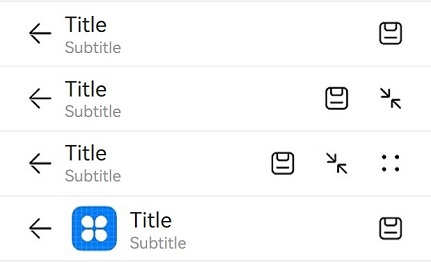

# ComposeTitleBar


A one- or two-row title bar with profile picture is a common title bar that contains a title, subtitle (optional), and profile picture (optional). It can come with a Back button for switching between pages of different levels.


> **NOTE**
>
> This component is supported since API version 10. Updates will be marked with a superscript to indicate their earliest API version.


## Modules to Import

```
import { ComposeTitleBar } from '@kit.ArkUI'
```


## Child Components

Not supported

## Attributes
The [universal attributes](ts-universal-attributes-size.md) are not supported.

## ComposeTitleBar

ComposeTitleBar({item?: ComposeTitleBarMenuItem, title: ResourceStr, subtitle?: ResourceStr, menuItems?: Array&lt;ComposeTitleBarMenuItem&gt;})

**Decorator**: @Component

**Atomic service API**: This API can be used in atomic services since API version 11.

**System capability**: SystemCapability.ArkUI.ArkUI.Full

| Name| Type| Mandatory| Description|
| -------- | -------- | -------- | -------- |
| item | [ComposeTitleBarMenuItem](#composetitlebarmenuitem) | No| A single menu item for the profile picture on the left.|
| title | [ResourceStr](ts-types.md#resourcestr) | Yes| Title.|
| subtitle | [ResourceStr](ts-types.md#resourcestr) | No| Subtitle.|
| menuItems | Array&lt;[ComposeTitleBarMenuItem](#composetitlebarmenuitem)&gt; | No| List of menu items on the right.|

> **NOTE**
> 
> The input parameter cannot be **undefined**, that is, calling **ComposeTitleBar(undefined)** is not allowed.

## ComposeTitleBarMenuItem

**System capability**: SystemCapability.ArkUI.ArkUI.Full

| Name| Type| Mandatory| Description|
| -------- | -------- | -------- | -------- |
| value | [ResourceStr](ts-types.md#resourcestr) | Yes| Icon resource.<br>**Atomic service API**: This API can be used in atomic services since API version 11.|
| label<sup>13+</sup> | [ResourceStr](ts-types.md#resourcestr) | No| Icon label.<br>**Atomic service API**: This API can be used in atomic services since API version 13.|
| isEnabled | boolean | No| Whether to enable the item.<br>Default value: **false**<br> **true**: The item is enabled.<br> **false**: The item is disabled.<br>This property cannot be triggered by the **item** property.<br>**Atomic service API**: This API can be used in atomic services since API version 11.|
| action | () =&gt; void | No| Action to perform. This parameter is not available for the item attribute.<br>**Atomic service API**: This API can be used in atomic services since API version 11.|

## Events
The [universal events](ts-universal-events-click.md) are not supported.

## Example

This example showcases how to implement a simple title bar, a title bar with a back arrow, and a title bar with a list of menu items on the right side.
```ts
import { ComposeTitleBar, promptAction, ComposeTitleBarMenuItem } from '@kit.ArkUI'

@Entry
@Component
struct Index {
  // Define an array of menu items for the right side of the title bar.
  private menuItems: Array<ComposeTitleBarMenuItem> = [
    {
      // Resource for the menu icon
      value: $r('app.media.ic_public_save'),
      // Enable the icon.
      isEnabled: true,
      // Action triggered when the menu item is clicked.
      action: () => promptAction.showToast({ message: "show toast index 1" })
    },
    {
      value: $r('app.media.ic_public_reduce'),
      isEnabled: true,
      action: () => promptAction.showToast({ message: "show toast index 1" })
    },
    {
      value: $r('app.media.ic_public_edit'),
      isEnabled: true,
      action: () => promptAction.showToast({ message: "show toast index 1" })
    },
    {
      value: $r('app.media.ic_public_remove'),
      isEnabled: true,
      action: () => promptAction.showToast({ message: "show toast index 1" })
    },
  ]

  build() {
    Row() {
      Column() {
        // Divider.
        Divider().height(2).color(0xCCCCCC)
        ComposeTitleBar({
          title: "Title",
          subtitle: "Subtitle",
          menuItems: this.menuItems.slice(0, 1),
        })
        Divider().height(2).color(0xCCCCCC)
        ComposeTitleBar({
          title: "Title",
          subtitle: "Subtitle",
          menuItems: this.menuItems.slice(0, 2),
        })
        Divider().height(2).color(0xCCCCCC)
        ComposeTitleBar({
          title: "Title",
          subtitle: "Subtitle",
          menuItems: this.menuItems,
        })
        Divider().height(2).color(0xCCCCCC)
        // Define the title bar with a profile picture.
        ComposeTitleBar({
          menuItems: [{ isEnabled: true, value: $r('app.media.ic_public_save'),
            action: () => promptAction.showToast({ message: "show toast index 1" })
          }],
          title: "Title",
          subtitle: "Subtitle",
          item: { isEnabled: true, value: $r('app.media.app_icon') }
        })
        Divider().height(2).color(0xCCCCCC)
      }
    }.height('100%')
  }
}
```


