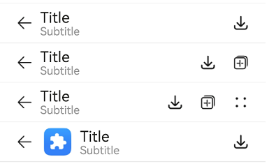
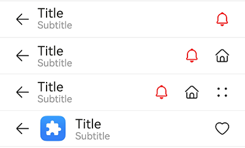

# ComposeTitleBar


**ComposeTitleBar** represents a common title bar that contains a title, subtitle (optional), and profile picture (optional). It can come with a Back button for switching between pages of different levels.


> **NOTE**
>
> This component is supported since API version 10. Updates will be marked with a superscript to indicate their earliest API version.
>
> This component is not supported on wearables.


## Modules to Import

```
import { ComposeTitleBar } from '@kit.ArkUI';
```


## Child Components

Not supported

## Attributes
The [universal attributes](ts-component-general-attributes.md) are not supported.

## ComposeTitleBar

ComposeTitleBar({item?: ComposeTitleBarMenuItem, title: ResourceStr, subtitle?: ResourceStr, menuItems?: Array&lt;ComposeTitleBarMenuItem&gt;})

**Decorator**: @Component

**Atomic service API**: This API can be used in atomic services since API version 11.

**System capability**: SystemCapability.ArkUI.ArkUI.Full

| Name| Type| Mandatory| Description|
| -------- | -------- | -------- | -------- |
| item | [ComposeTitleBarMenuItem](#composetitlebarmenuitem) | No| A single menu item for the profile picture on the left.|
| title | [ResourceStr](ts-types.md#resourcestr) | Yes| Title.|
| subtitle | [ResourceStr](ts-types.md#resourcestr) | No| Subtitle.|
| menuItems | Array&lt;[ComposeTitleBarMenuItem](#composetitlebarmenuitem)&gt; | No| List of menu items on the right.|

> **NOTE**
> 
> The input parameter cannot be **undefined**, that is, calling **ComposeTitleBar(undefined)** is not allowed.

## ComposeTitleBarMenuItem

**System capability**: SystemCapability.ArkUI.ArkUI.Full

| Name| Type| Mandatory| Description|
| -------- | -------- | -------- | -------- |
| value | [ResourceStr](ts-types.md#resourcestr) | Yes| Icon resource.<br>**Atomic service API**: This API can be used in atomic services since API version 11.|
| symbolStyle<sup>18+</sup> | [SymbolGlyphModifier](ts-universal-attributes-attribute-modifier.md) | No| Symbol icon resource, which has higher priority than **value**. <br>**Atomic service API**: This API can be used in atomic services since API version 18.|
| label<sup>13+</sup> | [ResourceStr](ts-types.md#resourcestr) | No| Icon label.<br>**Atomic service API**: This API can be used in atomic services since API version 13.|
| isEnabled | boolean | No| Whether to enable the item.<br>Default value: **false**<br> **true**: The item is enabled.<br> **false**: The item is disabled.<br>This property cannot be triggered by the **item** property.<br>**Atomic service API**: This API can be used in atomic services since API version 11.|
| action | () =&gt; void | No| Action to perform. This parameter is not available for the item attribute.<br>**Atomic service API**: This API can be used in atomic services since API version 11.|
| accessibilityLevel<sup>18+<sup>       | string  | No| Accessibility level. It determines whether the component can be recognized by accessibility services.<br>The options are as follows:<br>**"auto"**: It is treated as "yes" by the system.<br>**"yes"**: The component can be recognized by accessibility services.<br>**"no"**: The component cannot be recognized by accessibility services.<br>**"no-hide-descendants"**: Neither the component nor its child components can be recognized by accessibility services.<br>Default value: **"auto"**<br>**Atomic service API**: This API can be used in atomic services since API version 18.|
| accessibilityText<sup>18+<sup>        | ResourceStr | No| Accessibility text, that is, accessible label name. If a component does not contain text information, it will not be announced by the screen reader when selected. In this case, the screen reader user cannot know which component is selected. To solve this problem, you can set accessibility text for components without text information. When such a component is selected, the screen reader announces the specified accessibility text, informing the user which component is selected.<br>Default value: value of the **label** property if it is set and an empty string otherwise.<br>**Atomic service API**: This API can be used in atomic services since API version 18.                                    |
| accessibilityDescription<sup>18+<sup> | ResourceStr | No| Accessible description. You can provide comprehensive text explanations to help users understand the operation they are about to perform and its potential consequences, especially when these cannot be inferred from the component's attributes and accessibility text alone. If a component contains both text information and the accessible description, the text is announced first and then the accessible description, when the component is selected.<br>Default value: **"Double-tap to activate"**<br>**Atomic service API**: This API can be used in atomic services since API version 18.          |

## Events
The [universal events](ts-component-general-events.md) are not supported.

## Example

### Example 1: Implementing a Simple Title Bar
This example showcases how to implement a simple title bar, a title bar with a back arrow, and a title bar with a list of menu items on the right side.
```ts
import { ComposeTitleBar, Prompt, ComposeTitleBarMenuItem } from '@kit.ArkUI';

@Entry
@Component
struct Index {
  // Define an array of menu items for the right side of the title bar.
  private menuItems: Array<ComposeTitleBarMenuItem> = [
    {
      // Resource for the menu icon
      value: $r('sys.media.ohos_save_button_filled'),
      // Enable the icon.
      isEnabled: true,
      // Action triggered when the menu item is clicked.
      action: () => Prompt.showToast({ message: 'icon 1' }),
    },
    {
      value: $r('sys.media.ohos_ic_public_copy'),
      isEnabled: true,
      action: () => Prompt.showToast({ message: 'icon 2' }),
    },
    {
      value: $r('sys.media.ohos_ic_public_edit'),
      isEnabled: true,
      action: () => Prompt.showToast({ message: 'icon 3' }),
    },
    {
      value: $r('sys.media.ohos_ic_public_remove'),
      isEnabled: true,
      action: () => Prompt.showToast({ message: 'icon 4' }),
    },
  ]

  build() {
    Row() {
      Column() {
        // Divider.
        Divider().height(2).color(0xCCCCCC)
        ComposeTitleBar({
          title: 'Title',
          subtitle: 'Subtitle',
          menuItems: this.menuItems.slice(0, 1),
        })
        Divider().height(2).color(0xCCCCCC)
        ComposeTitleBar({
          title: 'Title',
          subtitle: 'Subtitle',
          menuItems: this.menuItems.slice(0, 2),
        })
        Divider().height(2).color(0xCCCCCC)
        ComposeTitleBar({
          title: 'Title',
          subtitle: 'Subtitle',
          menuItems: this.menuItems,
        })
        Divider().height(2).color(0xCCCCCC)
        // Define the title bar with a profile picture.
        ComposeTitleBar({
          menuItems: [{
            isEnabled: true, value: $r('sys.media.ohos_save_button_filled'),
            action: () => Prompt.showToast({ message: 'icon' }),
          }],
          title: 'Title',
          subtitle: 'Subtitle',
          item: { isEnabled: true, value: $r('sys.media.ohos_app_icon') }
        })
        Divider().height(2).color(0xCCCCCC)
      }
    }.height('100%')
  }
}
```


### Example 2: Implementing Screen Reader Announcement for the Custom Button on the Right Side
This example customizes the screen reader announcement text by setting the **accessibilityText**, **accessibilityDescription**, and **accessibilityLevel** properties of the custom button on the right side of the title bar. This functionality is supported since API version 18.
```ts
import { ComposeTitleBar, Prompt, ComposeTitleBarMenuItem } from '@kit.ArkUI';

@Entry
@Component
struct Index {
  // Define an array of menu items for the right side of the title bar.
  private menuItems: Array<ComposeTitleBarMenuItem> = [
    {
      // Resource for the menu icon
      value: $r('sys.media.ohos_save_button_filled'),
      // Enable the icon.
      isEnabled: true,
      // Action triggered when the menu item is clicked.
      action: () => Prompt.showToast({ message: 'icon 1' }),
      // The screen reader will prioritize this text over the label.
      accessibilityText: 'Save',
      // The screen reader can focus on this item.
      accessibilityLevel: 'yes',
      // The screen reader will ultimately announce this text.
      accessibilityDescription: 'Tap to save the current content',
    },
    {
      value: $r('sys.media.ohos_ic_public_copy'),
      isEnabled: true,
      action: () => Prompt.showToast({ message: 'icon 2' }),
      accessibilityText: 'Copy',
      // The screen reader will not focus on this item.
      accessibilityLevel: 'no',
      accessibilityDescription: 'Tap to copy the current content',
    },
    {
      value: $r('sys.media.ohos_ic_public_edit'),
      isEnabled: true,
      action: () => Prompt.showToast({ message: 'icon 3' }),
      accessibilityText: 'Edit',
      accessibilityLevel: 'yes',
      accessibilityDescription: 'Tap to edit the current content',
    },
    {
      value: $r('sys.media.ohos_ic_public_remove'),
      isEnabled: true,
      action: () => Prompt.showToast({ message: 'icon 4' }),
      accessibilityText: 'Remove',
      accessibilityLevel: 'yes',
      accessibilityDescription: 'Tap to remove the selected item',
    },
  ]

  build() {
    Row() {
      Column() {
        // Divider.
        Divider().height(2).color(0xCCCCCC)
        ComposeTitleBar({
          title: 'Title',
          subtitle: 'Subtitle',
          menuItems: this.menuItems.slice(0, 1),
        })
        Divider().height(2).color(0xCCCCCC)
        ComposeTitleBar({
          title: 'Title',
          subtitle: 'Subtitle',
          menuItems: this.menuItems.slice(0, 2),
        })
        Divider().height(2).color(0xCCCCCC)
        ComposeTitleBar({
          title: 'Title',
          subtitle: 'Subtitle',
          menuItems: this.menuItems,
        })
        Divider().height(2).color(0xCCCCCC)
        // Define the title bar with a profile picture.
        ComposeTitleBar({
          menuItems: [{
            isEnabled: true, value: $r('sys.media.ohos_save_button_filled'),
            action: () => Prompt.showToast({ message: 'icon' }),
          }],
          title: 'Title',
          subtitle: 'Subtitle',
          item: { isEnabled: true, value: $r('sys.media.ohos_app_icon') },
        })
        Divider().height(2).color(0xCCCCCC)
      }
    }.height('100%')
  }
}
```



### Example 3: Setting the Symbol Icon

This example demonstrates how to use **symbolStyle** in **ComposeTitleBarMenuItem** to set custom symbol icons. This functionality is supported since API version 18.

```ts
import { ComposeTitleBar, Prompt, ComposeTitleBarMenuItem, SymbolGlyphModifier } from '@kit.ArkUI';

@Entry
@Component
struct Index {
  // Define an array of menu items for the right side of the title bar.
  private menuItems: Array<ComposeTitleBarMenuItem> = [
    {
      // Resource for the menu icon
      value: $r('sys.symbol.house'),
      // Menu symbol icon
      symbolStyle: new SymbolGlyphModifier($r('sys.symbol.bell')).fontColor([Color.Red]),
      // Enable the icon.
      isEnabled: true,
      // Action triggered when the menu item is clicked.
      action: () => Prompt.showToast({ message: 'symbol icon 1' }),
    },
    {
      value: $r('sys.symbol.house'),
      isEnabled: true,
      action: () => Prompt.showToast({ message: 'symbol icon 2' }),
    },
    {
      value: $r('sys.symbol.car'),
      symbolStyle: new SymbolGlyphModifier($r('sys.symbol.heart')).fontColor([Color.Pink]),
      isEnabled: true,
      action: () => Prompt.showToast({ message: 'symbol icon 3' }),
    },
    {
      value: $r('sys.symbol.car'),
      isEnabled: true,
      action: () => Prompt.showToast({ message: 'symbol icon 4' }),
    },
  ]

  build() {
    Row() {
      Column() {
        // Divider.
        Divider().height(2).color(0xCCCCCC)
        ComposeTitleBar({
          title: 'Title',
          subtitle: 'Subtitle',
          menuItems: this.menuItems.slice(0, 1),
        })
        Divider().height(2).color(0xCCCCCC)
        ComposeTitleBar({
          title: 'Title',
          subtitle: 'Subtitle',
          menuItems: this.menuItems.slice(0, 2),
        })
        Divider().height(2).color(0xCCCCCC)
        ComposeTitleBar({
          title: 'Title',
          subtitle: 'Subtitle',
          menuItems: this.menuItems,
        })
        Divider().height(2).color(0xCCCCCC)
        // Define the title bar with a profile picture.
        ComposeTitleBar({
          menuItems: [{
            isEnabled: true, value: $r('sys.symbol.heart'),
            action: () => Prompt.showToast({ message: 'symbol icon 1' }),
          }],
          title: 'Title',
          subtitle: 'Subtitle',
          item: { isEnabled: true, value: $r('sys.media.ohos_app_icon') },
        })
        Divider().height(2).color(0xCCCCCC)
      }
    }.height('100%')
  }
}
```


