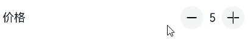
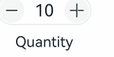
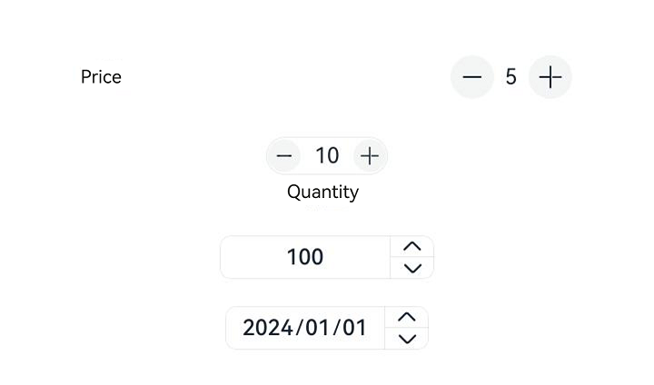

# advanced.Counter

A counter is a component used to accurately adjust values.

>  **NOTE**
>
>  This component is supported since API version 11. Updates will be marked with a superscript to indicate their earliest API version.

## Modules to Import

```
import { CounterType, CounterComponent, CounterOptions, DateData } from '@kit.ArkUI';
```

##  Child Components

Not supported

## CounterComponent

CounterComponent({ options: CounterOptions })

Defines a counter.

**Decorator**: @Component

**Atomic service API**: This API can be used in atomic services since API version 12.

**System capability**: SystemCapability.ArkUI.ArkUI.Full

**Parameters**

| Name   | Type                             | Mandatory| Decorator| Description                   |
| ------- | --------------------------------- | ---- | ---------- | ----------------------- |
| options | [CounterOptions](#counteroptions) | Yes  | @Prop      | Parameters of the counter.|

## CounterOptions

Defines the type and style parameters of the counter.

**Atomic service API**: This API can be used in atomic services since API version 12.

**System capability**: SystemCapability.ArkUI.ArkUI.Full

| Name       | Type      | Mandatory       | Description                           |
| ----------- | ---------- | ------| --------------------------------- |
| type | [CounterType](#countertype) | Yes  | Type of the current counter.|
| direction<sup>12+</sup> | [Direction](ts-appendix-enums.md#direction) | No| Layout direction.<br>Default value: **Direction.Auto**|
| numberOptions | [NumberStyleOptions](#numberstyleoptions) | No   | Parameters of the number style counter.|
| inlineOptions | [InlineStyleOptions](#inlinestyleoptions) | No| Parameters of the inline number style counter.|
| dateOptions | [DateStyleOptions](#datestyleoptions) | No| Parameters of the inline date style counter.|

A counter type must go with parameters of the matching counter style. Below is a mapping between the counter types and counter styles.

| Counter Type            | Counter Style       |
| ----------------------- | ------------------ |
| CounterType.LIST        | NumberStyleOptions |
| CounterType.COMPACT     | NumberStyleOptions |
| CounterType.INLINE      | InlineStyleOptions |
| CounterType.INLINE_DATE | DateStyleOptions   |

## CounterType

Enumerates the counter types.

**Atomic service API**: This API can be used in atomic services since API version 12.

**System capability**: SystemCapability.ArkUI.ArkUI.Full

| Name       | Description                       |
| ----------- | --------------------------- |
| LIST        | List counter.            |
| COMPACT     | Compact counter.            |
| INLINE      | Inline number counter.|
| INLINE_DATE | Inline date counter.      |

## CommonOptions

Defines common attributes and events of counters.

**Atomic service API**: This API can be used in atomic services since API version 12.

**System capability**: SystemCapability.ArkUI.ArkUI.Full


| Name           | Type                     | Mandatory| Default Value| Description                                                        |
| --------------- | ------------------------- | ---- | ------ | ------------------------------------------------------------ |
| focusable       | boolean                   | No  | true   | Whether the counter is focusable.<br>**NOTE**<br>This attribute takes effect for the number style counter.|
| step            | number                    | No  | 1      | Step of the counter.<br>Value range: an integer greater than or equal to 1.         |
| onHoverIncrease | (isHover: boolean) =>void | No  | -      | Callback invoked when the mouse pointer is moved over or away from the Increase button of the counter.<br>**isHover**: whether the mouse pointer hovers over the component. The value **true** means that the mouse pointer enters the component, and the value **false** means that the mouse pointer leaves the component.|
| onHoverDecrease | (isHover: boolean) =>void | No  | -      | Callback invoked when the mouse pointer is moved over or away from the Decrease button of the counter.<br>**isHover**: whether the mouse pointer hovers over the component. The value **true** means that the mouse pointer enters the component, and the value **false** means that the mouse pointer leaves the component.|

##  InlineStyleOptions

Defines the attributes and events of the inline number style counter.

Inherits from [CommonOptions](#commonoptions).

**Atomic service API**: This API can be used in atomic services since API version 12.

**System capability**: SystemCapability.ArkUI.ArkUI.Full

| Name     | Type                  | Mandatory| Default Value| Description                                                  |
| --------- | ---------------------- | ---- | ------ | ------------------------------------------------------ |
| value     | number                 | No  | 0      | Initial value of the counter.                                 |
| min       | number                 | No  | 0      | Minimum value of the counter.                                 |
| max       | number                 | No  | 999    | Maximum value of the counter.                                 |
| textWidth | number                 | No  | 0      | Text width of the counter.                                  |
| onChange  | (value: number) =>void | No  | -      | Callback invoked when the value changes. The current value is returned.<br>**value**: current value.|

## NumberStyleOptions

Defines the attributes and events of the number style counter.

Inherits from [InlineStyleOptions](#inlinestyleoptions).

**Atomic service API**: This API can be used in atomic services since API version 12.

**System capability**: SystemCapability.ArkUI.ArkUI.Full

| Name           | Type                                                        | Mandatory| Default Value| Description                                         |
| --------------- | ------------------------------------------------------------ | ---- | ------ | --------------------------------------------- |
| label           | [ResourceStr](ts-types.md#resourcestr) | No  | -      | Label of the counter.                      |
| onFocusIncrease | () =>void                                                    | No  | -      | Callback invoked when the Increase button of the counter gains focus.|
| onFocusDecrease | () =>void                                                    | No  | -      | Callback invoked when the Decrease button of the counter gains focus.|
| onBlurIncrease  | () =>void                                                    | No  | -      | Callback invoked when the Increase button of the counter loses focus.|
| onBlurDecrease  | () =>void                                                    | No  | -      | Callback invoked when the Decrease button of the counter loses focus.|

## DateStyleOptions

Defines the attributes and events of the inline date style counter.

Inherits from [CommonOptions](#commonoptions).

**Atomic service API**: This API can be used in atomic services since API version 12.

**System capability**: SystemCapability.ArkUI.ArkUI.Full

| Name        | Type                               | Mandatory| Default Value| Description                                                     |
| ------------ | ----------------------------------- | ---- | ------ | --------------------------------------------------------- |
| year         | number                              | No  | 1      | Initial year of the counter.                                 |
| month        | number                              | No  | 1      | Initial month of the counter.                                 |
| day          | number                              | No  | 1      | Initial day of the counter.                                   |
| onDateChange | (date: [DateData](#datedata))=>void | No  | -      | Callback invoked when the date changes. The current date is returned.<br>**date**: current date.|

## DateData

Defines common date attributes and methods.

**Atomic service API**: This API can be used in atomic services since API version 12.

**System capability**: SystemCapability.ArkUI.ArkUI.Full

| Name      | Type  | Description                        |
| ---------- | ------ | ---------------------------- |
| year       | number | Initial year of the counter.    |
| month      | number | Initial month of the counter.    |
| day        | number | Initial day of the counter.      |

### constructor

constructor(year: number, month: number, day: number)

A constructor used to create a **DateData** object.

**Atomic service API**: This API can be used in atomic services since API version 12.

**System capability**: SystemCapability.ArkUI.ArkUI.Full

| Name| Type| Description|
| ---------- | ------ | ---------------------------- |
| year       | number | Initial year of the counter.    |
| month      | number | Initial month of the counter.    |
| day        | number | Initial day of the counter.      |

### toString

toString(): string

Current date.

**Atomic service API**: This API can be used in atomic services since API version 12.

**System capability**: SystemCapability.ArkUI.ArkUI.Full

**Return value**

| Type| Description|
| -------- | -------- |
| string | Current date.|

## Example  

### Example 1

```ts
import { CounterType, CounterComponent } from '@kit.ArkUI';

@Entry
@Component
struct ListCounterExample {
  build() {
    Column() {
      // List counter
      CounterComponent({
        options: {
          type: CounterType.LIST,
          numberOptions: {
            label: "Price",
            min: 0,
            value: 5,
            max: 10
          }
        }
      })
    }
  }
}
```


### Example 2
```ts
import { CounterType, CounterComponent } from '@kit.ArkUI';

@Entry
@Component
struct CompactCounterExample {
  build() {
    Column() {
      // Compact counter
      CounterComponent({
        options: {
          type: CounterType.COMPACT,
          numberOptions: {
            label: "Quantity",
            value: 10,
            min: 0,
            max: 100,
            step: 10
          }
        }
      })
    }
  }
}
```

### Example 3
```ts
import { CounterType, CounterComponent } from '@kit.ArkUI';

@Entry
@Component
struct NumberStyleExample {
  build() {
    Column() {
      // Inline number counter
      CounterComponent({
        options: {
          type: CounterType.INLINE,
          inlineOptions: {
            value: 100,
            min: 10,
            step: 2,
            max: 1000,
            textWidth: 100,
            onChange: (value: number) => {
              console.log("onDateChange Date: " + value.toString());
            }
          }
        }
      })
    }
  }
}
```

### Example 4
```ts
import { CounterType, CounterComponent, DateData } from '@kit.ArkUI';

@Entry
@Component
struct DataStyleExample {
  build() {
    Column() {
      // Inline date counter
      CounterComponent({
        options: {
          type: CounterType.INLINE_DATE,
          dateOptions: {
            year: 2016,
            onDateChange: (date: DateData) => {
              console.log("onDateChange Date: " + date.toString());
            }
          }
        }
      })
    }
  }
}
```


### Example 5
This example shows a mirrored layout of different types of counters.

```ts
// xxx.ets
import { CounterType, CounterComponent, DateData } from '@kit.ArkUI';

@Entry
@Component
struct CounterPage {
  @State currentDirection: Direction = Direction.Rtl

  build() {
    Column({}) {

      // List counter
      CounterComponent({
        options: {
          direction: this.currentDirection,
          type: CounterType.LIST,
          numberOptions: {
            label: "Price",
            min: 0,
            value: 5,
            max: 10,
          }
        }
      })
        .width('80%')

      // Compact counter
      CounterComponent({
        options: {
          direction: this.currentDirection,
          type: CounterType.COMPACT,
          numberOptions: {
            label: "Quantity",
            value: 10,
            min: 0,
            max: 100,
            step: 10
          }
        }
      }).margin({ top: 20 })

      // Inline number counter
      CounterComponent({
        options: {
          type: CounterType.INLINE,
          direction: this.currentDirection,
          inlineOptions: {
            value: 100,
            min: 10,
            step: 2,
            max: 1000,
            textWidth: 100,
            onChange: (value: number) => {
              console.log("onDateChange Date: " + value.toString());
            }
          }
        }
      }).margin({ top: 20 })
      // Inline date counter
      CounterComponent({
        options: {
          direction: this.currentDirection,
          type: CounterType.INLINE_DATE,
          dateOptions: {
            year: 2024,
            onDateChange: (date: DateData) => {
              console.log("onDateChange Date: " + date.toString());
            }
          }
        }
      }).margin({ top: 20 })
    }
    .width('100%')
    .height('100%')
    .justifyContent(FlexAlign.Center)
    .alignItems(HorizontalAlign.Center)
  }
}
```

