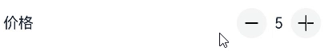
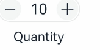
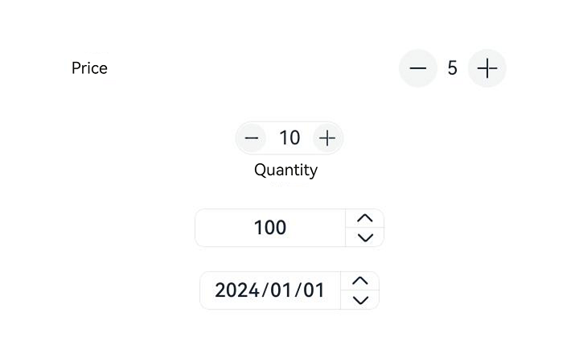

# CounterV2

<!--Kit: ArkUI-->
<!--Subsystem: ArkUI-->
<!--Owner: @song-song-song-->
<!--Designer: @fenglinbailu-->
<!--Tester: @weixin_45530366-->
<!--Adviser: @Brilliantry_Rui-->
<!-- md-trans-meta sourceCommit=e3759c69d65e24a59d611c9befe1266734e11881 translatedAt=2026-07-27T11:05:57.539Z pushedAt=2026-07-28T03:23:51.374Z -->

The **CounterV2** component enables precise numeric value adjustment. It provides four types: list, compact, inline number, and inline date, which are applicable to scenarios such as shopping cart quantity adjustment and date selection.

This component is implemented based on [state management V2](../../../ui/state-management/arkts-state-management-overview.md#state-management-v2). Compared with [state management V1](../../../ui/state-management/arkts-state-management-overview.md#state-management-v1), state management V2 delivers enhanced capabilities for deep observation and management of data objects, and is no longer limited to the component level. With state management V2, you can more flexibly control the data and state of **CounterV2** through this component, achieving more efficient UI refresh.

> **NOTE**
>
> - If [universal attributes](ts-component-general-attributes.md) and [universal events](ts-component-general-events.md) are set for **CounterV2**, the compilation toolchain generates an additional node __Common__ and attaches the universal attributes or universal events to __Common__, rather than directly applying them to **CounterV2** itself. This may cause the universal attributes or universal events you set to not take effect or behave unexpectedly. Therefore, setting universal attributes and universal events for **CounterV2** is not recommended.
>
> - This component API can only be used in the stage model.

**Since:** 26.0.0

## Modules to Import

```ts
import { CounterV2Type, CounterV2Component, CounterV2Options, CounterV2DateData } from '@kit.ArkUI';
```

## Child Components

None.

## CounterV2Component

CounterV2Component({&nbsp;options:&nbsp;CounterV2Options&nbsp;})

Defines the **CounterV2** component.

**Since:** 26.0.0

**Decorator:** @ComponentV2

**Atomic service API:** This API can be used in atomic services since API version 26.0.0.

**System capability:** SystemCapability.ArkUI.ArkUI.Full

| Name   | Type                                | Mandatory | Decorator Type | Description                        |
| ------- | ----------------------------------- | ---- | ---------- | --------------------------- |
| options | [CounterV2Options](#counterv2options) | Yes   | @Param   | Defines the type and style of the **CounterV2** component. |

## CounterV2Options

Defines the type and style of the **CounterV2** component.

**Since:** 26.0.0

**Atomic service API:** This API can be used in atomic services since API version 26.0.0.

**System capability:** SystemCapability.ArkUI.ArkUI.Full

| Name          | Type         | Read-Only | Optional | Description                            |
| ------------- | ------------ | ---- | ---- | ------------------------------- |
| type | [CounterV2Type](#counterv2type) | No  | No  | Type of the **CounterV2**. It must be used with the corresponding style parameter. For details about the mapping, see the table below. |
| direction | [Direction](ts-appendix-enums.md#direction) | No | Yes | Layout direction.<br>Default value: **Direction.Auto**<br>If the value is **undefined**, the default value is used. |
| numberOptions | [CounterV2NumberStyleOptions](#counterv2numberstyleoptions) | No   | Yes   | Style of the list and compact **CounterV2**.<br>Default value: **undefined**, which displays a list or compact **CounterV2** with the value **0**.<br>Pass this parameter when you need to customize attributes such as the label, initial value, range, and step of the list or compact **CounterV2**. If the initial value of the counter is **0** and no custom configuration is required, you can skip this parameter to use the default style.<br>If the value is **undefined**, the default value is used. |
| inlineOptions | [CounterV2InlineStyleOptions](#counterv2inlinestyleoptions) | No | Yes | Style of the inline number **CounterV2**.<br>Default value: **undefined**, which displays an inline number **CounterV2** with the value **0**.<br>Pass this parameter when you need to customize attributes such as the initial value, range, step, text width, and change callback of the inline number **CounterV2**. If the initial value of the counter is **0** and no custom configuration is required, you can skip this parameter to use the default style.<br>If the value is **undefined**, the default value is used. |
| dateOptions | [CounterV2DateStyleOptions](#counterv2datestyleoptions) | No | Yes | Style of the inline date **CounterV2**.<br>Default value: **undefined**, which displays an inline date **CounterV2** with the date **0001/01/01**.<br>Pass this parameter when you need to customize attributes such as the initial date and date change callback of the inline date **CounterV2**. If the default date **0001/01/01** needs to be displayed and no custom configuration is required, you can skip this parameter to use the default style.<br>If the value is **undefined**, the default value is used. |

When you select a **CounterV2** type, you must select the corresponding **CounterV2** style. If the style parameter does not match the type, the default style of that type is used.

| CounterV2 Type             | CounterV2 Style        |
| ----------------------- | ------------------ |
| CounterV2Type.LIST        | CounterV2NumberStyleOptions |
| CounterV2Type.COMPACT     | CounterV2NumberStyleOptions |
| CounterV2Type.INLINE      | CounterV2InlineStyleOptions |
| CounterV2Type.INLINE_DATE | CounterV2DateStyleOptions   |

## CounterV2Type

Specifies the **CounterV2** type.

**Since:** 26.0.0

**Atomic service API:** This API can be used in atomic services since API version 26.0.0.

**System capability:** SystemCapability.ArkUI.ArkUI.Full

| Name        | Value | Description                        |
| ----------- | ---- | --------------------------- |
| LIST        | 0    | List **CounterV2**.             |
| COMPACT     | 1    | Compact **CounterV2**.             |
| INLINE      | 2    | Inline number **CounterV2**. |
| INLINE_DATE | 3    | Inline date **CounterV2**.       |

For the display effect of each **CounterV2** component type, see [Example 1: List CounterV2](#example-1-list-counterv2), [Example 2: Compact CounterV2](#example-2-compact-counterv2), [Example 3: Inline Number CounterV2](#example-3-inline-number-counterv2), and [Example 4: Inline Date CounterV2](#example-4-inline-date-counterv2).

## OnCounterV2HoverCallback

type OnCounterV2HoverCallback = (isHover: boolean) => void

Defines the mouse hover callback type for the **CounterV2** component.

**Since:** 26.0.0

**Atomic service API:** This API can be used in atomic services since API version 26.0.0.

**System capability:** SystemCapability.ArkUI.ArkUI.Full

**Parameters**

| Name    | Type    | Mandatory | Description                                                        |
| ------- | ------- | --------- | ------------------------------------------------------------------ |
| isHover | boolean | Yes       | Whether the mouse is hovering over the component.<br>The value is **true** when the mouse enters and **false** when it leaves. |

## CounterV2CommonOptions

Defines the common attributes and events of the **CounterV2** component.

**Since:** 26.0.0

**Atomic service API:** This API can be used in atomic services since API version 26.0.0.

**System capability:** SystemCapability.ArkUI.ArkUI.Full

| Name            | Type                      | Read-Only | Optional | Description                                                         |
| --------------- | ------------------------- | ---- | ---- | ------------------------------------------------------------ |
| focusable       | boolean                   | No  | Yes  | Whether **CounterV2** can obtain focus.<br>**NOTE**<br>This attribute takes effect for the list and compact **CounterV2**, but not for the inline number and inline date **CounterV2**.<br>Default value: **true**<br>**true**: **CounterV2** can obtain focus; **false**: **CounterV2** cannot obtain focus.<br>When the value is **undefined**, the default value is used. |
| step            | number                    | No  | Yes  | Step of **CounterV2**.<br>**NOTE**<br>This attribute takes effect for the list, compact Type, and inline number **CounterV2**, but not for the inline date **CounterV2**.<br>Value range: an integer greater than or equal to 1.<br>Default value: **1**<br>If the value is out of the value range, the default value is used.<br>When the value is **undefined**, the default value is used. |
| onHoverIncrease | [OnCounterV2HoverCallback](#oncounterv2hovercallback) | No  | Yes  | Callback triggered when the mouse enters or leaves the increase button of the **CounterV2** component.<br>Use scenario: Pass in this callback when you need to perform custom operations (such as changing button styles and displaying tooltips) when hovering over the increase button.<br>**NOTE**<br>This attribute takes effect for the list, compact, and inline number **CounterV2**, but not for the inline date **CounterV2**.<br>Default value: **undefined**, indicating that this callback is not triggered.<br>When the value is **undefined**, the default value is used. |
| onHoverDecrease | [OnCounterV2HoverCallback](#oncounterv2hovercallback) | No  | Yes  | Callback triggered when the mouse enters or leaves the decrease button of the **CounterV2** component.<br>Use scenario: Pass in this callback when you need to perform custom operations (such as changing button styles and displaying tooltips) when hovering over the decrease button.<br>**NOTE**<br>This attribute takes effect for the list, compact, and inline number **CounterV2**, but not for the inline date **CounterV2**.<br>Default value: **undefined**, indicating that this callback is not triggered.<br>When the value is **undefined**, the default value is used. |

## OnInlineCounterV2Change

type OnInlineCounterV2Change = (value: number) => void

Defines the callback for the value change of the inline number **CounterV2**.

**Since:** 26.0.0

**Atomic service API:** This API can be used in atomic services since API version 26.0.0.

**System capability:** SystemCapability.ArkUI.ArkUI.Full

**Parameters**

| Name | Type  | Mandatory | Description |
| ------ | ------ | ---- | ------------------ |
| value  | number | Yes  | Current value.<br>Value range: [min, max], where **min** and **max** correspond to the minimum and maximum values of **CounterV2**, respectively. |

## CounterV2InlineStyleOptions

Defines the attributes and events of the inline number **CounterV2**.

This API inherits from [CounterV2CommonOptions](#counterv2commonoptions) and contains all attributes of the parent API. This topic only shows the newly added attributes. For inherited attributes, see the parent API.

**Since:** 26.0.0

**Atomic service API:** This API can be used in atomic services since API version 26.0.0.

**System capability:** SystemCapability.ArkUI.ArkUI.Full

| Name      | Type                   | Read-Only | Optional | Description                                                   |
| --------- | ---------------------- | ---- | ---- | ------------------------------------------------------ |
| value     | number                 | No  | Yes  | Initial value of **CounterV2**.<br>Default value: **0**<br>Valid value range: [min, max], where **min** and **max** correspond to the minimum and maximum values of **CounterV2**, respectively.<br>If the value is **undefined**, the default value is used.<br>Boundary handling: If value is less than **min**, **min** is used. If value is greater than **max**, **max** is used. |
| min       | number                 | No  | Yes  | Minimum value of **CounterV2**.<br>Default value: **0**<br>Value range: (-∞, max]<br>If the value exceeds the range (that is, the set value is greater than **max**), **max** is used.<br>If the value is **undefined**, the default value is used. |
| max       | number                 | No  | Yes  | Maximum value of **CounterV2**.<br>Default value: **999**<br>Value range: [min, +∞)<br>If the value exceeds the range (that is, the set value is less than **min**), **min** is used.<br>If the value is **undefined**, the default value is used. |
| textWidth | number                 | No  | Yes  | Width of the number text.<br>Default value: adaptive text width.<br>Value range: [0, +∞)<br>Unit: vp<br>If the value exceeds the range (that is, the set value is less than 0), **0** is used.<br>If the value is **undefined**, the default value is used. |
| onChange  | [OnInlineCounterV2Change](#oninlinecounterv2change) | No  | Yes  | Callback triggered when the value changes. The callback parameter **value** indicates the currently displayed value.<br>Use scenario: Pass in this callback when you need to perform custom operations upon value changes (such as updating associated data, triggering service logic, or logging).<br>Default value: **undefined**, indicating that the callback is not triggered when the value changes.<br>If the value is **undefined**, the default value is used. |

> **NOTE**
>
> 1. **min** must be less than or equal to **max**. If **min** is greater than **max**, **max** is used.

## CounterV2NumberStyleOptions

Defines the attributes and events of the list and compact **CounterV2**.

This API inherits from [CounterV2InlineStyleOptions](#counterv2inlinestyleoptions) and contains all attributes of the parent API and [CounterV2CommonOptions](#counterv2commonoptions). This topic only describes the newly added attributes. For inherited attributes, see the parent API.

**Since:** 26.0.0

**Atomic service API:** This API can be used in atomic services since API version 26.0.0.

**System capability:** SystemCapability.ArkUI.ArkUI.Full

| Name            | Type                                   | Read-Only | Optional | Description                                                         |
| --------------- | -------------------------------------- | ---- | ---- | ------------------------------------------------------------ |
| label           | [ResourceStr](ts-types.md#resourcestr) | No   | Yes   | Description text of **CounterV2**.<br>Default value: ''<br>Note: Pass this parameter when description text (such as price and quantity) needs to be displayed next to **CounterV2**.<br>When the value is **undefined**, the default value is used. |
| onFocusIncrease | [VoidCallback](ts-types.md#voidcallback12)                             | No   | Yes   | Callback triggered when the increase button of the **CounterV2** component gains focus.<br>Use scenario: Pass this callback when custom operations (such as changing styles and logging) need to be performed when the increase button gains focus.<br>Default value: **undefined**, indicating that this callback is not triggered.<br>When the value is **undefined**, the default value is used. |
| onFocusDecrease | [VoidCallback](ts-types.md#voidcallback12)                             | No   | Yes   | Callback triggered when the decrease button of the **CounterV2** component gains focus.<br>Use scenario: Pass this callback when custom operations (such as changing styles and logging) need to be performed when the decrease button gains focus.<br>Default value: **undefined**, indicating that this callback is not triggered.<br>When the value is **undefined**, the default value is used. |
| onBlurIncrease  | [VoidCallback](ts-types.md#voidcallback12)                             | No   | Yes   | Callback triggered when the increase button of the **CounterV2** component loses focus.<br>Use scenario: Pass this callback when custom operations (such as validating input and saving state) need to be performed when the increase button loses focus.<br>Default value: **undefined**, indicating that this callback is not triggered.<br>When the value is **undefined**, the default value is used. |
| onBlurDecrease  | [VoidCallback](ts-types.md#voidcallback12)                             | No   | Yes   | Callback triggered when the decrease button of the **CounterV2** component loses focus.<br>Use scenario: Pass this callback when custom operations (such as validating input and saving state) need to be performed when the decrease button loses focus.<br>Default value: **undefined**, indicating that this callback is not triggered.<br>When the value is **undefined**, the default value is used. |

## CounterV2DateData

Defines common date attributes and methods, including year, month, and day.

### Attributes

**Since:** 26.0.0

**Atomic service API:** This API can be used in atomic services since API version 26.0.0.

**System capability:** SystemCapability.ArkUI.ArkUI.Full

| Name  | Type   | Read-Only | Optional | Description |
| ----- | ---------- | ------ |  ------ | ---------------------------- |
| year       | number |  No | No | Year of the inline date type. |
| month      | number |  No | No | Month of the inline date type. |
| day        | number |  No | No | Day of the inline date type. |

### constructor

constructor(year: number, month: number, day: number)

Constructor of **CounterV2DateData**, used to initialize a date object.

**Since:** 26.0.0

**Atomic service API:** This API can be used in atomic services since API version 26.0.0.

**System capability:** SystemCapability.ArkUI.ArkUI.Full

**Parameters**

| Name | Type | Mandatory | Description |
| ---------- | ------ |  ------ | ---------------------------- |
| year       | number |  Yes | Year of the inline date type. Value range: [1, 5000]. If the value is out of the range, the default value is used. |
| month      | number |  Yes | Month of the inline date type. Value range: [1, 12]. If the value is out of the range, the default value is used. |
| day        | number |  Yes | Day of the inline date type. Value range: [1, 31]. It must be a valid date. For example, if **month** is **2**, passing **30** for **day** is treated as an invalid value and the default value will be used. If the value is out of the range, the default value is used. |

### toString

toString(): string

Returns the current date value in the string format, which is **YYYY-MM-DD**.

**Since:** 26.0.0

**Atomic service API:** This API can be used in atomic services since API version 26.0.0.

**System capability:** SystemCapability.ArkUI.ArkUI.Full

**Return value**

| Type | Description |
| -------- | -------- |
| string | Date string in the **YYYY-MM-DD** format, for example, **2024-01-15**. |

## OnDateCounterV2ChangeCallback

type OnDateCounterV2ChangeCallback = (date: CounterV2DateData) => void

Defines the callback for date changes of the inline date **CounterV2**.

**Since:** 26.0.0

**Atomic service API:** This API can be used in atomic services since API version 26.0.0.

**System capability:** SystemCapability.ArkUI.ArkUI.Full

**Parameters**

| Name | Type                                  | Mandatory | Description               |
| ------ | ------------------------------------- | --------- | ------------------------- |
| date   | [CounterV2DateData](#counterv2datedata) | Yes       | Current date value. |

## CounterV2DateStyleOptions

Defines the attributes and events of the inline date **CounterV2**.

This API inherits from [CounterV2CommonOptions](#counterv2commonoptions) and contains all attributes of the parent API. This topic only lists the newly added attributes. For inherited attributes, see the parent API.

**Since:** 26.0.0

**Atomic service API:** This API can be used in atomic services since API version 26.0.0.

**System capability:** SystemCapability.ArkUI.ArkUI.Full

| Name         | Type                                | Read-Only | Optional | Description                                                      |
| ------------ | ----------------------------------- | ---- | ---- | --------------------------------------------------------- |
| year         | number                              | No  | Yes  | Initial year of the inline date type.<br>Default value: **1**<br>Value range: [1, 5000]<br>If the value is out of the range, the default value is used.<br>If the value is **undefined**, the default value is used. |
| month        | number                              | No  | Yes  | Initial month of the inline date type.<br>Default value: **1**<br>Value range: [1, 12]<br>If the value is out of the range, the default value is used.<br>If the value is **undefined**, the default value is used. |
| day          | number                              | No  | Yes  | Initial day of the inline date type.<br>Default value: **1**<br>Value range: [1, 31]<br>It must be a valid date. For example, if **month** is **2**, passing **30** for **day** is treated as an invalid value and the default value will be used.<br>If the value is out of the range, the default value is used.<br>If the value is **undefined**, the default value is used. |
| onDateChange | [OnDateCounterV2ChangeCallback](#ondatecounterv2changecallback) | No  | Yes  | Callback invoked when the date changes. The parameter **date** indicates the currently displayed date value.<br>Use scenario: Pass in this callback when you need to perform custom operations (such as updating associated data, triggering business logic, and logging) when the date changes.<br>Default value: **undefined**, indicating that this callback is not triggered.<br>If the value is **undefined**, the default value is used. |

## Attributes

[Universal attributes](ts-component-general-attributes.md) are not supported.

## Events

[Universal events](ts-component-general-events.md) are not supported.

## Examples

### Example 1: List CounterV2

This example implements a list **CounterV2** by setting [CounterV2Type](#counterv2type).LIST and the numberOptions attribute of [CounterV2Options](#counterv2options).

Since API version 26.0.0, [CounterV2Options](#counterv2options) supports the **numberOptions** attributes.

```ts
import { CounterV2Type, CounterV2Component } from '@kit.ArkUI';

@Entry
@ComponentV2
struct ListCounterExample {
  build() {
    Column() {
      // List CounterV2
      CounterV2Component({
        options: {
          type: CounterV2Type.LIST,
          numberOptions: {
            label: 'Price',
            min: 0,
            value: 5,
            max: 10,
          }
        }
      })
    }
  }
}
```



### Example 2: Compact CounterV2

This example implements a compact **CounterV2** by setting [CounterV2Type](#counterv2type).COMPACT and the **numberOptions** attributes of [CounterV2Options](#counterv2options).

Since API version 26.0.0, [CounterV2Options](#counterv2options) supports the **numberOptions** attribute.

```ts
import { CounterV2Type, CounterV2Component } from '@kit.ArkUI';

@Entry
@ComponentV2
struct CompactCounterExample {
  build() {
    Column() {
      // Compact CounterV2
      CounterV2Component({
        options: {
          type: CounterV2Type.COMPACT,
          numberOptions: {
            label: 'Quantity',
            value: 10,
            min: 0,
            max: 100,
            step: 10
          }
        }
      })
    }
  }
}
```



### Example 3: Inline Number CounterV2

This example implements an inline number **CounterV2** by setting [CounterV2Type](#counterv2type).INLINE and the **inlineOptions** attribute of [CounterV2Options](#counterv2options).

Since API version 26.0.0, [CounterV2Options](#counterv2options) supports the **inlineOptions** attribute.

```ts
import { CounterV2Type, CounterV2Component } from '@kit.ArkUI';

@Entry
@ComponentV2
struct NumberStyleExample {
  build() {
    Column() {
      // Inline number CounterV2
      CounterV2Component({
        options: {
          type: CounterV2Type.INLINE,
          inlineOptions: {
            value: 100,
            min: 10,
            step: 2,
            max: 1000,
            textWidth: 100,
            onChange: (value: number) => {
              console.info('onCounterV2Change Counter: ' + value.toString());
            }
          }
        }
      })
    }
  }
}
```


### Example 4: Inline Date CounterV2

This example implements an inline date **CounterV2** by setting [CounterV2Type](#counterv2type).INLINE_DATE and the **dateOptions** attribute of [CounterV2Options](#counterv2options).

Since API version 26.0.0, [CounterV2Options](#counterv2options) supports the **dateOptions** attribute.

```ts
import { CounterV2Type, CounterV2Component, CounterV2DateData } from '@kit.ArkUI';

@Entry
@ComponentV2
struct DateStyleExample {
  build() {
    Column() {
      // Inline date CounterV2
      CounterV2Component({
        options: {
          type: CounterV2Type.INLINE_DATE,
          dateOptions: {
            year: 2016,
            onDateChange: (date: CounterV2DateData) => {
              console.info('onDateChange Date: ' + date.toString());
            }
          }
        }
      })
    }
  }
}
```


### Example 5: Mirrored Layout Display

This example uses the **direction** attribute of [CounterV2Options](#counterv2options) to implement mirrored layouts for the list, compact, inline number, and inline date **CounterV2** components.

Since API version 26.0.0, [CounterV2Options](#counterv2options) supports the **direction** attribute.

```ts
import { CounterV2Type, CounterV2Component, CounterV2DateData } from '@kit.ArkUI';

@Entry
@ComponentV2
struct CounterPage {
  @Local currentDirection: Direction = Direction.Rtl

  build() {
    Column({space: 20}) {

      // List CounterV2
      CounterV2Component({
        options: {
          direction: this.currentDirection,
          type: CounterV2Type.LIST,
          numberOptions: {
            label: 'Price',
            min: 0,
            value: 5,
            max: 10,
          }
        }
      })

      // Compact CounterV2
      CounterV2Component({
        options: {
          direction: this.currentDirection,
          type: CounterV2Type.COMPACT,
          numberOptions: {
            label: 'Quantity',
            value: 10,
            min: 0,
            max: 100,
            step: 10
          }
        }
      })

      // Inline number CounterV2
      CounterV2Component({
        options: {
          type: CounterV2Type.INLINE,
          direction: this.currentDirection,
          inlineOptions: {
            value: 100,
            min: 10,
            step: 2,
            max: 1000,
            textWidth: 100,
            onChange: (value: number) => {
              console.info('onCounterV2Change Counter: ' + value.toString());
            }
          }
        }
      })

      // Inline date CounterV2
      CounterV2Component({
        options: {
          direction: this.currentDirection,
          type: CounterV2Type.INLINE_DATE,
          dateOptions: {
            year: 2024,
            onDateChange: (date: CounterV2DateData) => {
              console.info('onDateChange Date: ' + date.toString());
            }
          }
        }
      })
    }
    .width('100%')
    .height('100%')
    .justifyContent(FlexAlign.Center)
    .alignItems(HorizontalAlign.Center)
  }
}
```

