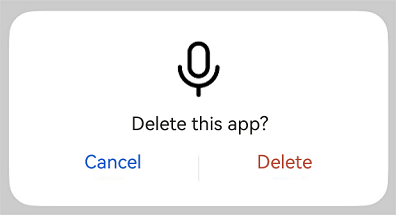
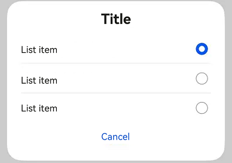
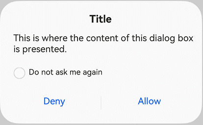
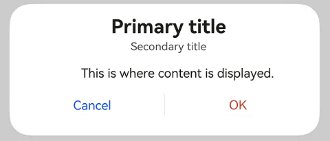
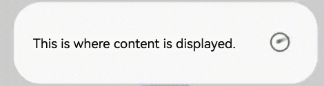
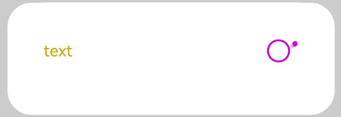
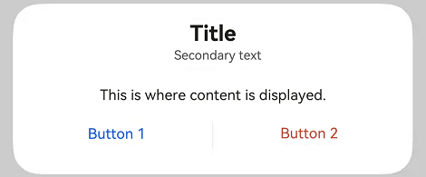
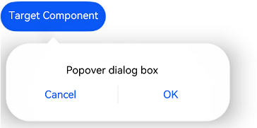

# DialogV2

The dialog box is a modal window that commands attention while retaining the current context. It is frequently used to draw the user's attention to vital information or prompt the user to complete a specific task. As all modal windows, this component requires the user to interact before exiting.

This component is implemented based on [state management V2](../../../ui/state-management/arkts-state-management-overview.md#state-management-v2). Compared with [state management V1](../../../ui/state-management/arkts-state-management-overview.md#state-management-v1), V2 offers a higher level of observation and management over data objects beyond the component level. You can now more easily manage dialog box data and states with greater flexibility, leading to faster UI updates.

> **NOTE**
>
> This component is supported since API version 18. Updates will be marked with a superscript to indicate their earliest API version.

## Modules to Import

    import { TipsDialogV2, SelectDialogV2, ConfirmDialogV2, AlertDialogV2, LoadingDialogV2, CustomContentDialogV2, PopoverDialogV2 } from '@kit.ArkUI';

## Child Components

Not supported

## TipsDialogV2

TipsDialogV2({imageRes: ResourceStr, imageSize?: SizeOptions, imageBorderColor: ColorMetrics, imageBorderWidth: LengthMetrics, title?: ResourceStr, content?: ResourceStr, checkTips?: ResourceStr, checked?: boolean, onCheckedChange?: AdvancedDialogV2OnCheckedChange, primaryButton?: AdvancedDialogV2Button, secondaryButton?: AdvancedDialogV2Button})

Displays an image-attached confirmation dialog box.

**Decorator**: @ComponentV2

**Atomic service API**: This API can be used in atomic services since API version 18.

**System capability**: SystemCapability.ArkUI.ArkUI.Full

| Name              | Type                                                                                                   | Mandatory| Decorator               | Description                                                                |
|------------------|-------------------------------------------------------------------------------------------------------|----|----------------------|--------------------------------------------------------------------|
| imageRes         | [ResourceStr](ts-types.md#resourcestr) \| [PixelMap](../../apis-image-kit/js-apis-image.md#pixelmap7) | Yes | @Param<br>@Require | Image to be displayed.                                                            |
| imageSize        | [SizeOptions](ts-types.md#sizeoptions)                                                                | No | @Param               | Size of the image.<br>Default value: **64\*64vp**                                       |
| imageBorderColor | [ColorMetrics](../js-apis-arkui-graphics.md#colormetrics12)                                                              | No | @Param               | Stroke color of the image.<br>Default value: **Color.Black**                                      |
| imageBorderWidth | [LengthMetrics](../js-apis-arkui-graphics.md#lengthmetrics12)                                                            | No | @Param               | Stroke width of the image.<br>By default, there is no stroke effect.                                              |
| title            | [ResourceStr](ts-types.md#resourcestr)                                                                | No | @Param               | Title of the dialog box.<br>It is not displayed by default.                                         |
| content          | [ResourceStr](ts-types.md#resourcestr)                                                                | No | @Param               | Content of the dialog box.<br>It is not displayed by default.                                         |
| checkTips        | [ResourceStr](ts-types.md#resourcestr)                                                                | No | @Param               | Content of the check box.<br>It is not displayed by default.                                        |
| checked          | boolean                                                                                               | No | @Param               | Whether to select the check box. The value **true** means to select the check box, and **false** means the opposite.<br>Default value: **false**|
| onCheckedChange  | [AdvancedDialogV2OnCheckedChange](#advanceddialogv2oncheckedchange)                                   | No | @Param               | Event triggered when the selected status of the check box changes.<br>By default, there is no event.                               |
| primaryButton    | [AdvancedDialogV2Button](#advanceddialogv2button)                                                     | No | @Param               | Left button of the dialog box.<br>It is not displayed by default.                                         |
| secondaryButton  | [AdvancedDialogV2Button](#advanceddialogv2button)                                                     | No | @Param               | Right button of the dialog box.<br>It is not displayed by default.                                         |

## AdvancedDialogV2OnCheckedChange

type AdvancedDialogV2OnCheckedChange = (checked: boolean) => void

Defines the event triggered when the selected status of the check box changes.

**Atomic service API**: This API can be used in atomic services since API version 18.

**System capability**: SystemCapability.ArkUI.ArkUI.Full

| Name    | Type     | Mandatory| Description                                                 |
| :------ |:--------| :- | :-------------------------------------------------- |
| checked | boolean | Yes | Whether to select the check box.<br> |

## SelectDialogV2

SelectDialogV2({title: ResourceStr, content?: ResourceStr, selectedIndex?: number, confirm?: AdvancedDialogV2Button, radioContent: SheetInfo\[]})

Displays a dialog box from which the user can select items presented in a list or grid.

**Decorator**: @ComponentV2

**Atomic service API**: This API can be used in atomic services since API version 18.

**System capability**: SystemCapability.ArkUI.ArkUI.Full

| Name           | Type                                                      | Mandatory| Decorator              | Description                                                 |
| ------------- | -------------------------------------------------------- | -- |---------------------|-----------------------------------------------------|
| title         | [ResourceStr](ts-types.md#resourcestr)                   | Yes | @Param<br>@Require | Title of the dialog box.                                           |
| content       | [ResourceStr](ts-types.md#resourcestr)                   | No | @Param              | Content of the dialog box. It is not displayed by default.                                     |
| selectedIndex | number                                                   | No | @Param              | Index of the selected item in the dialog box.<br>Default value: **-1**<br>Value range: less than the length of the length of **radioContent**|
| confirm       | [AdvancedDialogV2Button](#advanceddialogv2button)        | No | @Param              | Button at the bottom of the dialog box.<br>It is not displayed by default.                        |
| radioContent  | [SheetInfo](ts-methods-action-sheet.md#sheetinfo)\[] | Yes | @Param<br>@Require | List of items displayed in the dialog box. You can set text and a selection callback for each item.                  |

## ConfirmDialogV2

ConfirmDialogV2({title: ResourceStr, content?: ResourceStr, checkTips?: ResourceStr, ischecked?: boolean, onCheckedChange: AdvancedDialogV2OnCheckedChange, primaryButton?: AdvancedDialogV2Button, secondaryButton?: AdvancedDialogV2Button})

Displays an error dialog box that informs the user of an operational error (for example, a network error or low battery level) or an incorrect operation (for example, fingerprint enrollment).

**Decorator**: @ComponentV2

**Atomic service API**: This API can be used in atomic services since API version 18.

**System capability**: SystemCapability.ArkUI.ArkUI.Full

| Name             | Type                                                                 | Mandatory| Decorator | Description                                                        |
|-----------------| ------------------------------------------------------------------- | -- | ------ |------------------------------------------------------------|
| title           | [ResourceStr](ts-types.md#resourcestr)                              | Yes | @Param<br>@Require | Title of the dialog box.                                                  |
| content         | [ResourceStr](ts-types.md#resourcestr)                              | No | @Param | Content of the dialog box.<br>It is not displayed by default.                                 |
| checkTips       | [ResourceStr](ts-types.md#resourcestr)                              | No | @Param | Content of the check box.<br>It is not displayed by default.                           |
| checked         | boolean                                                             | No | @Param | Whether to select the check box. The value **true** means to select the check box, and **false** means the opposite.<br>Default value: **false**|
| onCheckedChange | [AdvancedDialogV2OnCheckedChange](#advanceddialogv2oncheckedchange) | No | @Param | Event triggered when the selected status of the check box changes.<br>By default, there is no event.                       |
| primaryButton   | [AdvancedDialogV2Button](#advanceddialogv2button)                   | No | @Param | Left button of the dialog box.<br>It is not displayed by default.                                 |
| secondaryButton | [AdvancedDialogV2Button](#advanceddialogv2button)                   | No | @Param | Right button of the dialog box.<br>It is not displayed by default.                                 |

## AlertDialogV2

AlertDialogV2({primaryTitle?: ResourceStr, secondaryTitle?: ResourceStr, content: ResourceStr, primaryButton?: AdvancedDialogV2Button, secondaryButton?: AdvancedDialogV2Button})

Displays an alert dialog box to prompt the user to confirm an action that is irreversible and may cause serious consequences, such as deletion, reset, editing cancellation, and stop.

**Decorator**: @ComponentV2

**Atomic service API**: This API can be used in atomic services since API version 18.

**System capability**: SystemCapability.ArkUI.ArkUI.Full

| Name             | Type                                               | Mandatory| Decorator               | Description                  |
| --------------- | ------------------------------------------------- | -- | :------------------- | -------------------- |
| primaryTitle    | [ResourceStr](ts-types.md#resourcestr)            | No | @Param               | Primary title of the dialog box.<br>It is not displayed by default. |
| secondaryTitle  | [ResourceStr](ts-types.md#resourcestr)            | No | @Param               | Secondary title of the dialog box.<br>It is not displayed by default.      |
| content         | [ResourceStr](ts-types.md#resourcestr)            | Yes | @Param<br>@Require | Content of the dialog box.<br>      |
| primaryButton   | [AdvancedDialogV2Button](#advanceddialogv2button) | No | @Param               | Left button of the dialog box.<br>It is not displayed by default.|
| secondaryButton | [AdvancedDialogV2Button](#advanceddialogv2button) | No | @Param               | Right button of the dialog box.<br>It is not displayed by default.|

## LoadingDialogV2

LoadingDialogV2({content?: ResourceStr})

Displays a loading dialog box to inform the user of the operation progress.

**Decorator**: @ComponentV2

**Atomic service API**: This API can be used in atomic services since API version 18.

**System capability**: SystemCapability.ArkUI.ArkUI.Full

| Name     | Type                                    | Mandatory| Decorator | Description                 |
| ------- | -------------------------------------- | -- | :----- |---------------------|
| content | [ResourceStr](ts-types.md#resourcestr) | No | @Param | Content of the dialog box.<br>It is empty by default.|

## CustomContentDialogV2

CustomContentDialogV2({contentBuilder: () => void, primaryTitle?: ResourceStr, secondaryTitle?: ResourceStr, contentAreaPadding?: LocalizedPadding, buttons?: AdvancedDialogV2Button\[]})

Displays a dialog box that contains custom content and operation area.

**Decorator**: @ComponentV2

**Atomic service API**: This API can be used in atomic services since API version 18.

**System capability**: SystemCapability.ArkUI.ArkUI.Full

| Name                | Type                                                  | Mandatory| Decorator        | Description                      |
| ------------------ | ---------------------------------------------------- | -- | ------------- | ------------------------ |
| contentBuilder     | [CustomBuilder](ts-types.md#custombuilder8)          | Yes | @BuilderParam | Content of the dialog box.                  |
| primaryTitle       | [ResourceStr](ts-types.md#resourcestr)               | No | @Param        | Primary title of the dialog box.<br>It is not displayed by default.            |
| secondaryTitle     | [ResourceStr](ts-types.md#resourcestr)               | No | @Param        | Secondary title of the dialog box.<br>It is not displayed by default.          |
| contentAreaPadding | [LocalizedPadding](ts-types.md#localizedpadding12)     | No | @Param        | Padding of the content area of the dialog box.<br>It is not displayed by default.        |
| buttons            | [AdvancedDialogV2Button](#advanceddialogv2button)\[] | No | @Param        | Buttons in the operation area of the dialog box. A maximum of four buttons are allowed.<br>It is not displayed by default.|

## PopoverDialogV2OnVisibleChange

type PopoverDialogV2OnVisibleChange = (visible: boolean) => void

Defines the event triggered when the visibility of the popover dialog box changes.

**Atomic service API**: This API can be used in atomic services since API version 18.

**System capability**: SystemCapability.ArkUI.ArkUI.Full

| Name    | Type     | Mandatory| Description                                                                    |
| :------ | :------ | :- |:-----------------------------------------------------------------------|
| visible | boolean | Yes | Visibility of the popover dialog box.<br>**true**: The popover dialog box is displayed.<br> **false**: The popover dialog box is hidden.|

## PopoverDialogV2

PopoverDialogV2({visible: boolean, \$visible: PopoverDialogV2OnVisibleChange, popover: PopoverDialogV2Options, targetBuilder: CustomBuilder})

Displays a popover dialog box that is positioned relative to the target component. This dialog box can contain a variety of content types, including: TipsDialogV2, SelectDialogV2, ConfirmDialogV2, AlertDialogV2, LoadingDialogV2, and CustomContentDialogV2.

**Decorator**: @ComponentV2

**Atomic service API**: This API can be used in atomic services since API version 18.

**System capability**: SystemCapability.ArkUI.ArkUI.Full

| Name           | Type                                                               | Mandatory| Decorator              | Description                                                |
| ------------- |-------------------------------------------------------------------| -- |---------------------| -------------------------------------------------- |
| visible       | boolean                                                           | Yes | @Param<br>@Require | Whether the popover dialog box is visible.                                        |
| \$visible     | [PopoverDialogV2OnVisibleChange](#popoverdialogv2onvisiblechange) | No | @Event              | Callback invoked when the visibility of the dialog box changes. Use the **!!** syntax for two-way binding with **visible**.<br>By default, there is no callback.|
| popover       | [PopoverDialogV2Options](#popoverdialogv2options)                 | Yes | @Param<br>@Require | Options of the popover dialog box.                                        |
| targetBuilder | [CustomBuilder](ts-types.md#custombuilder8)                       | Yes | @BuilderParam       | Target component relative to which the popover dialog box is positioned.                                     |

## PopoverDialogV2Options

Defines a set of options used to configure the popover dialog box, including its content and position.

Inherits [CustomPopupOptions](../arkui-ts/ts-universal-attributes-popup.md#custompopupoptions8).

> **NOTE**
>
> The default value of **radius** is **32vp**.

**Atomic service API**: This API can be used in atomic services since API version 18.

**System capability**: SystemCapability.ArkUI.ArkUI.Full

## AdvancedDialogV2ButtonAction

type AdvancedDialogV2ButtonAction = () => void

Defines the event triggered when a button in the popover dialog is clicked.

**Atomic service API**: This API can be used in atomic services since API version 18.

**System capability**: SystemCapability.ArkUI.ArkUI.Full

## AdvancedDialogV2Button

Defines the button used in a dialog box to perform actions.

**Decorator type**: @ObservedV2

**Atomic service API**: This API can be used in atomic services since API version 18.

**System capability**: SystemCapability.ArkUI.ArkUI.Full

| Name          | Type                                                                    | Mandatory| Decorator | Description                                                                         |
|:-------------|:-----------------------------------------------------------------------|:---|:-------|:----------------------------------------------------------------------------|
| content      | [ResourceStr](ts-types.md#resourcestr)                                 | Yes | @Trace | Content of the button.                                                                     |
| action       | [AdvancedDialogV2ButtonAction](#advanceddialogv2buttonaction)          | No | @Trace | Action triggered when the button is clicked.<br>By default, there is no action.                                                       |
| background   | [ColorMetrics](../js-apis-arkui-graphics.md#colormetrics12)                                | No | @Trace | Background of the button.<br>The setting follows **buttonStyle** by default.                                              |
| fontColor    | [ColorMetrics](../js-apis-arkui-graphics.md#colormetrics12)                                | No | @Trace | Font color of the button.<br>The setting follows **buttonStyle** by default.                                            |
| buttonStyle  | [ButtonStyleMode](ts-basic-components-button.md#buttonstylemode11) | No | @Trace | Style of the button.<br>Default value: **ButtonStyleMode.NORMAL** for 2-in-1 devices and **ButtonStyleMode.TEXTUAL** for other devices|
| role         | [ButtonRole](ts-basic-components-button.md#buttonrole12)           | No | @Trace | Role of the button.<br>Default value: **ButtonRole.NORMAL**                                         |
| defaultFocus | boolean                                                                | No | @Trace | Whether the button is the default focus.<br>Default value: **false**                                                   |
| enabled       | boolean                                                                | No | @Trace | Whether the button is enabled.<br>Default value: **true**                                                 |

> **NOTE**
>
> The priority of **buttonStyle** and **role** is higher than that of **fontColor** and **background**. If **buttonStyle** and **role** are at the default values, the settings of **fontColor** and **background** take effect.
>
> If **defaultFocus** is set for multiple buttons, the default focus is the first button in the display order that has **defaultFocus** set to **true**.

### constructor

constructor(options: AdvancedDialogV2ButtonOptions)

A constructor used to create an **AdvancedDialogV2Button** instance.

**Atomic service API**: This API can be used in atomic services since API version 18.

**System capability**: SystemCapability.ArkUI.ArkUI.Full

| Name     | Type                                                             | Mandatory| Description     |
| :------ | :-------------------------------------------------------------- | :- | :------ |
| options | [AdvancedDialogV2ButtonOptions](#advanceddialogv2buttonoptions) | Yes | Configuration options of the button.|

## AdvancedDialogV2ButtonOptions

Provides options used to initialize an **AdvancedDialogV2Button** object.

**Atomic service API**: This API can be used in atomic services since API version 18.

**System capability**: SystemCapability.ArkUI.ArkUI.Full

| Name          | Type                                                                    | Mandatory| Description                                                                               |
|:-------------|:-----------------------------------------------------------------------|:---|:----------------------------------------------------------------------------------|
| content      | [ResourceStr](ts-types.md#resourcestr)                                 | Yes | Content of the button.                                                                           |
| action       | [AdvancedDialogV2ButtonAction](#advanceddialogv2buttonaction)          | No | Action triggered when the button is clicked.<br>By default, there is no action.                                                                   |
| background   | [ColorMetrics](../js-apis-arkui-graphics.md#colormetrics12)                              | No | Background of the button.<br> The setting follows **buttonStyle** by default.                                                   |
| fontColor    | [ColorMetrics](../js-apis-arkui-graphics.md#colormetrics12)                              | No | Font color of the button.<br>The setting follows **buttonStyle** by default.                                                        |
| buttonStyle  | [ButtonStyleMode](ts-basic-components-button.md#buttonstylemode11) | No | Style of the button.<br>Default value: **ButtonStyleMode.NORMAL** for 2-in-1 devices and **ButtonStyleMode.TEXTUAL** for other devices|
| role         | [ButtonRole](ts-basic-components-button.md#buttonrole12)           | No | Role of the button.<br>Default value: **ButtonRole.NORMAL**                                         |
| defaultFocus | boolean                                                                | No | Whether the button is the default focus.<br>Default value: **false**                                                               |
| enabled       | boolean                                                                | No | Whether the button is enabled.<br>Default value: **true**                                                              |

## Example

### Example 1: Dialog Box with an Image Above Text

This example implements a dialog box with an image above the text content, through the use of **imageRes**, **content**, and other properties.

```ts
import { TipsDialogV2, AdvancedDialogV2Button, promptAction } from '@kit.ArkUI';

@Entry
@ComponentV2
struct Index {
  @Local checked: boolean = false;

  @Builder
  dialogBuilder(): void {
    TipsDialogV2({
      imageRes: $r('sys.media.ohos_ic_public_voice'),
      content: 'Delete this app?',
      title: 'TipsDialogV2',
      checkTips: 'Don't show again',
      checked: this.checked,
      primaryButton: new AdvancedDialogV2Button({
        content: 'Cancel',
        action: () => {
          console.info('Callback when the first button is clicked');
        },
      }),
      secondaryButton: new AdvancedDialogV2Button({
        content: 'Delete',
        role: ButtonRole.ERROR,
        action: () => {
          console.info('Callback when the second button is clicked');
        }
      }),
      onCheckedChange: (checked: boolean) => {
        console.info('Callback when the checkbox is clicked');
        this.checked = checked;
      }
    })
  }

  build() {
    Row() {
      Stack() {
        Column() {
          Button("Open TipsDialogV2")
            .width(96)
            .height(40)
            .onClick(() => {
              promptAction.openCustomDialog({
                builder: () => {
                  this.dialogBuilder();
                },
              });
            })
        }.margin({ bottom: 300 })
      }.align(Alignment.Bottom)
      .width('100%').height('100%')
    }
    .backgroundImageSize({ width: '100%', height: '100%' })
    .height('100%')
  }
}
```



### Example 2: List-only Dialog Box

This example presents a dialog box consisting solely of a list defined with **selectedIndex** and **radioContent**.

```ts
import { SelectDialogV2, AdvancedDialogV2Button ,promptAction } from '@kit.ArkUI';

@Entry
@ComponentV2
struct Index {
  @Local radioIndex: number = 0;
  @Builder
  dialogBuilder(): void {
    SelectDialogV2({
      title:'Title',
      selectedIndex: this.radioIndex,
      confirm: new AdvancedDialogV2Button({
        content: 'Cancel',
        action: () => {},
      }),
      radioContent: [
        {
          title: 'List item',
          action: () => {
            this.radioIndex = 0
          }
        },
        {
          title: 'List item',
          action: () => {
            this.radioIndex = 1
          }
        },
        {
          title: 'List item',
          action: () => {
            this.radioIndex = 2
          }
        },
      ]
    })
  }
  build() {
    Row() {
      Stack() {
        Column() {
          Button("List Dialog Box")
            .width(96)
            .height(40)
            .onClick(() => {
              promptAction.openCustomDialog({
                builder: () => {
                  this.dialogBuilder();
                }
              })
            })
        }.margin({ bottom: 300 })
      }.align(Alignment.Bottom)
      .width('100%').height('100%')
    }
    .backgroundImageSize({ width: '100%', height: '100%' })
    .height('100%')
  }
}
```



### Example 3: Dialog Box with Text and Check Boxes

This example illustrates a dialog box that combines text content with check boxes defined with **content** and **checkTips**.

```ts
import { ConfirmDialogV2, AdvancedDialogV2Button, promptAction } from '@kit.ArkUI';

@Entry
@ComponentV2
struct Index {
  @Local checked: boolean = false;

  @Builder
  dialogBuilder(): void {
    ConfirmDialogV2({
      title:'Title',
      content: 'This is where content is displayed. This is where content is displayed.',
      checked: this.checked,
      checkTips: 'Don't ask again after denying',
      primaryButton: new AdvancedDialogV2Button({
        content: 'Deny',
        action: () => {
        },
      }),
      secondaryButton: new AdvancedDialogV2Button({
        content: 'Allow',
        action: () => {
          this.checked = false
          console.info('Callback when the second button is clicked');
        }
      }),
      onCheckedChange: (checked: boolean) => {
        console.info('Callback when the checkbox is clicked');
        this.checked = checked;
      },
    })
  }

  build() {
    Row() {
      Stack() {
        Column() {
          Button("Open ConfirmDialogV2")
            .width(96)
            .height(40)
            .onClick(() => {
              promptAction.openCustomDialog({
                builder: () => {
                  this.dialogBuilder();
                },
                alignment: DialogAlignment.Bottom
              });
            })
        }.margin({ bottom: 300 })
      }.align(Alignment.Bottom)
      .width('100%').height('100%')
    }
    .backgroundImageSize({ width: '100%', height: '100%' })
    .height('100%')
  }
}
```



### Example 4: Text-only Dialog Box

This example demonstrates a simple text-only dialog box defined with **primaryTitle**, **secondaryTitle**, and **content**.

```ts
import { AlertDialogV2, AdvancedDialogV2Button, promptAction } from '@kit.ArkUI';

@Entry
@ComponentV2
struct Index {
  @Builder
  dialogBuilder(): void {
    AlertDialogV2({
      primaryTitle: 'Primary title',
      secondaryTitle: 'Secondary title',
      content: 'This is where content is displayed.',
      primaryButton: new AdvancedDialogV2Button({
        content: 'Cancel',
        action: () => {
        },
      }),
      secondaryButton: new AdvancedDialogV2Button({
        content: 'OK',
        role: ButtonRole.ERROR,
        action: () => {
          console.info('Callback when the second button is clicked');
        }
      }),
    })
  }

  build() {
    Row() {
      Stack() {
        Column() {
          Button("Open AlertDialogV2")
            .width(96)
            .height(40)
            .onClick(() => {
              promptAction.openCustomDialog({
                builder: () => {
                  this.dialogBuilder();
                }
              });
            })
        }.margin({ bottom: 300 })
      }.align(Alignment.Bottom)
      .width('100%').height('100%')
    }
    .backgroundImageSize({ width: '100%', height: '100%' })
    .height('100%')
  }
}
```



### Example 5: Loading Dialog Box

This example implements a loading dialog box that contains a progress indicator.

```ts
import { LoadingDialogV2, promptAction } from '@kit.ArkUI';

@Entry
@ComponentV2
struct Index {
  @Builder
  dialogBuilder(): void {
    LoadingDialogV2({
      content: 'This is where content is displayed.',
    })
  }

  build() {
    Row() {
      Stack() {
        Column() {
          Button("Open LoadingDialogV2")
            .width(96)
            .height(40)
            .onClick(() => {
              promptAction.openCustomDialog({
                builder: () => {
                  this.dialogBuilder();
                }
              });
            })
        }.margin({ bottom: 300 })
      }.align(Alignment.Bottom)
      .width('100%').height('100%')
    }
    .backgroundImageSize({ width: '100%', height: '100%' })
    .height('100%')
  }
}
```



### Example 6: Dialog Box with a Custom Theme

This example presents a dialog box with a custom theme, through the use of **content**, **theme**, and other properties.

```ts
import { CustomColors, CustomTheme, LoadingDialogV2, promptAction } from '@kit.ArkUI';

class CustomThemeImpl implements CustomTheme {
  colors?: CustomColors;

  constructor(colors: CustomColors) {
    this.colors = colors;
  }
}

class CustomThemeColors implements CustomColors {
  fontPrimary = '#ffd0a300';
  iconSecondary = '#ffd000cd';
}

@Entry
@ComponentV2
struct Index {
  @Builder
  dialogBuilder(): void {
    WithTheme({ theme: new CustomThemeImpl(new CustomThemeColors()) }) {
      LoadingDialogV2({
        content: 'This is where content is displayed.',
      })
    }
  }

  build() {
    Row() {
      Stack() {
        Column() {
          Button("Open LoadingDialogV2")
            .width(96)
            .height(40)
            .onClick(() => {
              promptAction.openCustomDialog({
                builder: () => {
                  this.dialogBuilder();
                }
              });
            })
        }.margin({ bottom: 300 })
      }.align(Alignment.Bottom)
      .width('100%').height('100%')
    }
    .backgroundImageSize({ width: '100%', height: '100%' })
    .height('100%')
  }
}
```



### Example 7: Dialog Box with Custom Content

This example implements a dialog box with custom content defined with **contentBuilder** and **buttons**.

```ts
import { CustomContentDialogV2, AdvancedDialogV2Button, promptAction } from '@kit.ArkUI';

@Entry
@ComponentV2
struct Index {
  @Builder
  dialogBuilder(): void {
    CustomContentDialogV2({
      primaryTitle: 'Primary title',
      secondaryTitle: 'Secondary title',
      contentBuilder: () => {
        this.buildContent();
      },
      buttons: [
        new AdvancedDialogV2Button({
          content: 'Button 1', buttonStyle: ButtonStyleMode.TEXTUAL,
          action: () => {
            console.info('Callback when the button is clicked');
          }
        }),
        new AdvancedDialogV2Button({
          content: 'Button 2', buttonStyle: ButtonStyleMode.TEXTUAL, role: ButtonRole.ERROR,
        })
      ],
    })
  }

  build() {
    Column() {
      Button("Open CustomContentDialogV2")
        .onClick(() => {
          promptAction.openCustomDialog({
            builder: () => {
              this.dialogBuilder();
            }
          })
        })
    }
    .width('100%')
    .height('100%')
    .justifyContent(FlexAlign.Center)
  }

  @Builder
  buildContent(): void {
    Column() {
      Text('Content area')
    }
  }
}
```



### Example 8: Popover Dialog Box

This example demonstrates a popover dialog box for alert purposes, through the use of **visible**, **popover**, **targetBuilder**, and other properties.

```ts
import { AlertDialogV2, PopoverDialogV2, PopoverDialogV2Options, AdvancedDialogV2Button} from '@kit.ArkUI';

@Entry
@ComponentV2
struct Index {
  @Local isShow: boolean = false;
  @Local popoverOptions: PopoverDialogV2Options = {
    builder: () => {
      this.dialogBuilder();
    }
  }

  @Builder dialogBuilder() {
    AlertDialogV2({
      content: 'Popover dialog box',
      primaryButton: new AdvancedDialogV2Button({
        content: 'Cancel',
        action: () => {
          this.isShow = false;
        },
      }),
      secondaryButton: new AdvancedDialogV2Button({
        content: 'OK',
        action: () => {
          this.isShow = false;
        },
      }),
    });
  }

  @Builder buttonBuilder() {
    Button('Target Component').onClick(() => {
      this.isShow = true;
    });
  }

  build() {
    Column() {
      PopoverDialogV2({
        visible: this.isShow!!,
        popover: this.popoverOptions,
        targetBuilder: () => {
          this.buttonBuilder();
        },
      })
    }
  }
}
```


