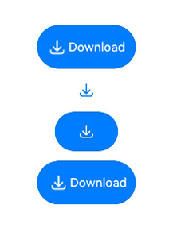

# DownloadFileButton

**DownloadFileButton** is a download button that, when clicked, allows you to obtain the storage location of the current application in the public **Download** directory.


> **NOTE**
>
> This component is supported since API version 12. Updates will be marked with a superscript to indicate their earliest API version.

##  Modules to Import

```
import { DownloadFileButton } from '@kit.ArkUI'
```

## Child Components

Not supported

## Attributes

The [universal attributes](ts-universal-attributes-size.md) are supported.

## DownloadFileButton

Downloadbutton(contentOptions?:DownloadContentOptions, styleOptions?:DownloadStyleOptions)

Creates a download file button, which by default displays both an icon and text.

**Decorator**: @Component

**Atomic service API**: This API can be used in atomic services since API version 12.

**System capability**: SystemCapability.ArkUI.ArkUI.Full

**Parameters**

| Name          | Type                                                        | Mandatory| Decorator| Description                            |
| -------------- | ------------------------------------------------------------ | ---- | ---------- | -------------------------------- |
| contentOptions | [DownloadContentOptions](#downloadcontentoptions) | No  | @State     | Content options for creating the download file button.|
| styleOptions   | [DownloadStyleOptions](#downloadstyleoptions) | No  | @State     | Style options for creating the download file button.|

## DownloadContentOptions

Defines the content displayed in the download file button.

**Atomic service API**: This API can be used in atomic services since API version 12.

**System capability**: SystemCapability.ArkUI.ArkUI.Full

| Name| Type                                                        | Mandatory| Description                                                        |
| ---- | ------------------------------------------------------------ | ---- | ------------------------------------------------------------ |
| icon | [DownloadIconStyle](#downloadiconstyle) | No  | Icon style of the download file button.<br>If this parameter is not specified, no icon is contained. Either **icon** or **text**, or both, must be set.|
| text | [DownloadDescription](#downloaddescription) | No  | Text on the download file button.<br>If this parameter is not specified, no text is contained. Either **icon** or **text**, or both, must be set.|

## DownloadStyleOptions

Defines the style of the icon and text in the download file button.

**Atomic service API**: This API can be used in atomic services since API version 12.

**System capability**: SystemCapability.ArkUI.ArkUI.Full

| Name           | Type                                                        | Mandatory| Description                                                        |
| --------------- | ------------------------------------------------------------ | ---- | ------------------------------------------------------------ |
| iconSize        | Dimension                                                    | No  | Icon size of the download file button.<br>Default value: **16vp**                     |
| layoutDirection | [DownloadLayoutDirection](#downloadlayoutdirection) | No  | Direction of the icon and text on the download file button.<br>Default value: **DownloadLayoutDirection.HORIZONTAL**|
| fontSize        | Dimension                                                    | No  | Font size of the download file button.<br>Default value: **16fp**                     |
| fontStyle       | FontStyle                                                    | No  | Font style of the download file button.<br>Default value: **FontStyle.Normal**         |
| fontWeight      | number \| FontWeight \| string                               | No  | Font weight of the download file button.<br>Default value: **FontWeight.Medium**          |
| fontFamily      | string \| Resource                                           | No  | Font family of the download file button.<br>Default font: **'HarmonyOS Sans'**       |
| fontColor       | ResourceColor                                                | No  | Font color of the download file button.<br>Default value: **#ffffffff**                |
| iconColor       | ResourceColor                                                | No  | Icon color of the download file button.<br>Default value: **#ffffffff**                |
| textIconSpace   | Dimension                                                    | No  | Space between the icon and text on the download file button.<br>Default value: **4vp**                |

## DownloadIconStyle

Defines the icon style of the download file button.

**Atomic service API**: This API can be used in atomic services since API version 12.

**System capability**: SystemCapability.ArkUI.ArkUI.Full

| Name       | Value  | Description                      |
| ----------- | ---- | -------------------------- |
| FULL_FILLED | 1    | Filled style icon.|
| LINES       | 2    | Line style icon.|


## DownloadDescription

Defines the text on the download file button.

**Atomic service API**: This API can be used in atomic services since API version 12.

**System capability**: SystemCapability.ArkUI.ArkUI.Full

| Name               | Value  | Description                            |
| ------------------- | ---- | -------------------------------- |
| DOWNLOAD            | 1    | The text on the download file button is **Download**.    |
| DOWNLOAD_FILE       | 2    | The text on the download file button is **Download File**.|
| SAVE                | 3    | The text on the download file button is **Save**.    |
| SAVE_IMAGE          | 4    | The text on the download file button is **Save Image**.|
| SAVE_FILE           | 5    | The text on the download file button is **Save File**.|
| DOWNLOAD_AND_SHARE  | 6    | The text on the download file button is **Download and Share**.|
| RECEIVE             | 7    | The text on the download file button is **Receive**.    |
| CONTINUE_TO_RECEIVE | 8    | The text on the download file button is **Continue**.|


## DownloadLayoutDirection

Defines the direction of the icon and text in the download file button.

**Atomic service API**: This API can be used in atomic services since API version 12.

**System capability**: SystemCapability.ArkUI.ArkUI.Full

| Name      | Value  | Description                                      |
| ---------- | ---- | ------------------------------------------ |
| HORIZONTAL | 0    | The icon and text on the download file button are horizontally arranged.|
| VERTICAL   | 1    | The icon and text on the download file button are vertically arranged.|

## Events

The [universal events](ts-universal-events-click.md) are supported.

##  Example

```
import { picker } from '@kit.CoreFileKit';
import { BusinessError } from '@kit.BasicServicesKit';
import { DownloadFileButton, DownloadLayoutDirection } from '@kit.ArkUI';

@Entry
@Component
struct Index {
  build() {
    Column() {
      DownloadFileButton({
        contentOptions: {
          // icon: DownloadIconStyle.FULL_FILLED,
          // text: DownloadDescription.DOWNLOAD
        },
        styleOptions: {
          iconSize: '16vp',
          layoutDirection: DownloadLayoutDirection.HORIZONTAL,
          fontSize: '16vp',
          fontStyle: FontStyle.Normal,
          fontWeight: FontWeight.Medium,
          fontFamily: 'HarmonyOS Sans',
          fontColor: '#ffffffff',
          iconColor: '#ffffffff',
          textIconSpace: '4vp'
        }
      })
        .backgroundColor('#007dff')
        .borderStyle(BorderStyle.Dotted)
        .borderWidth(0)
        .borderColor('')
        .borderRadius('24vp')
        .position({ x: 0, y: 0 })
        .markAnchor({ x: 0, y: 0 })
        .offset({ x: 0, y: 0 })
        .constraintSize({})
        .padding({
          top: '12vp',
          bottom: '12vp',
          left: '24vp',
          right: '24vp'
        })
        .onClick(() => {
          this.downloadAction();
        })
    }
  }

  downloadAction() {
    try {
      const document = new picker.DocumentSaveOptions();
      document.pickerMode = picker.DocumentPickerMode.DOWNLOAD;
      new picker.DocumentViewPicker().save(document, (err: BusinessError, result: Array<string>) => {
        if (err) {
          return;
        }
        console.info(`downloadAction result:  ${JSON.stringify(result)}`);
      });
    } catch (e) {
    }
  }
}
```


