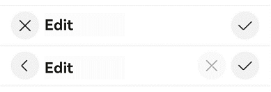
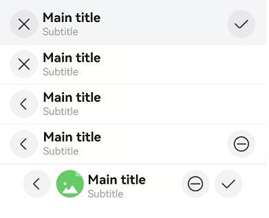
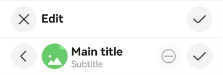
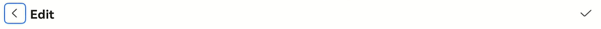
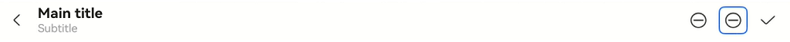
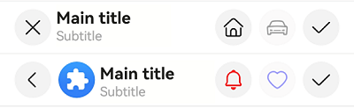

# EditableTitleBar


The editable title bar is a title bar that comes with button icons, typically **Cancel** on the left and **Confirm** on the right, on a multi-select or editing page.


> **NOTE**
>
> This component is supported since API version 10. Updates will be marked with a superscript to indicate their earliest API version.
>
> This component is not supported on wearables.


## Modules to Import

```
import { EditableTitleBar } from '@kit.ArkUI';
```


## Child Components

Not supported

## Attributes
The [universal attributes](ts-component-general-attributes.md) are not supported.


## EditableTitleBar

EditableTitleBar({leftIconStyle: EditableLeftIconType, imageItem?: EditableTitleBarItem, title: ResourceStr, subtitle?: ResourceStr, menuItems?: Array&lt;EditableTitleBarMenuItem&gt;, isSaveIconRequired: boolean, onSave?: () =&gt; void, onCancel?: () =&gt;void, options: EditableTitleBarOptions, contentMargin?: LocalizedMargin, leftIconDefaultFocus?: boolean, saveIconDefaultFocus?: boolean})

**Decorator**: @Component

**System capability**: SystemCapability.ArkUI.ArkUI.Full

| Name| Type| Mandatory| Decorator| Description                                                                                                                                                                                                                                            |
| -------- | -------- | -------- | -------- |------------------------------------------------------------------------------------------------------------------------------------------------------------------------------------------------------------------------------------------------|
| leftIconStyle | [EditableLeftIconType](#editablelefticontype) | Yes| - | Type of the icon on the left.<br>Default value: **EditableLeftIconType.Back**<br>**Atomic service API**: This API can be used in atomic services since API version 11.                                                                                                                                          |
| imageItem<sup>12+</sup> | [EditableTitleBarItem](#editabletitlebaritem12) | No| - | A single menu item for the profile picture on the left.<br>Default value: **undefined**.<br>**NOTE**<br>Accessibility properties not supported.<br>**Atomic service API**: This API can be used in atomic services since API version 12.                                                                                                                            |
| title | [ResourceStr](ts-types.md#resourcestr) | Yes| - | Title.<br>Default value: **''**, indicating that the title is empty<br>**Atomic service API**: This API can be used in atomic services since API version 11.                                                                                                                                                                 |
| subtitle<sup>12+</sup> | [ResourceStr](ts-types.md#resourcestr) | No| - | Subtitle.<br>Default value: **''**, indicating that the subtitle is empty<br>**Atomic service API**: This API can be used in atomic services since API version 12.                                                                                                                                                               |
| menuItems | Array&lt;[EditableTitleBarMenuItem](#editabletitlebarmenuitem)&gt; | No| - | List of menu items on the right.<br>Default value: **undefined**.<br>**Atomic service API**: This API can be used in atomic services since API version 11.                                                                                                                                                             |
| isSaveIconRequired<sup>12+</sup> | boolean | Yes| - | Whether the save button on the right is required.<br>Default value: **true**, indicating that the save button on the right is required.<br>**NOTE**<br>If not decorated by @Require, this parameter is not subject to mandatory validation during construction.<br>**Atomic service API**: This API can be used in atomic services since API version 12.                                                                                                             |
| onSave | () =&gt; void | No| - | Callback invoked when the Save icon is clicked.<br>Default value: **() => void**<br>**Atomic service API**: This API can be used in atomic services since API version 11.                                                                                                                                                            |
| onCancel | () =&gt; void | No| - | Callback that is triggered when the cancel action is performed with the left Cancel icon.<br>Default value: **() => void**<br>Since API version 12: Callback that is triggered when the back action is performed with the left Back icon.<br>**Atomic service API**: This API can be used in atomic services since API version 11.                                                                               |
| options<sup>12+</sup> | [EditableTitleBarOptions](#editabletitlebaroptions12) | Yes| - | Title style.<br>Default value:<br>{<br>safeAreaTypes: [SafeAreaType.SYSTEM],<br>safeAreaEdges: [SafeAreaEdge.TOP], <br>backgroundColor: '#00000000'<br>}<br>**NOTE**<br>If not decorated by @Require, this parameter is not subject to mandatory validation during construction.<br>**Atomic service API**: This API can be used in atomic services since API version 12.|
| contentMargin<sup>12+</sup> | [LocalizedMargin](ts-types.md#localizedmargin12) | No| @Prop | Margin of the content. Negative numbers are not supported.<br>Default value:<br> {start: LengthMetrics.resource(*$r('sys.float.margin_left')*), end: LengthMetrics.resource(*$r('sys.float.margin_right')*)}<br>**Atomic service API**: This API can be used in atomic services since API version 12.                              |
| leftIconDefaultFocus<sup>18+</sup> | boolean  | No| - | Whether the left icon is the default focus.<br>Default value: **false**, indicating that the left icon is not the default focus.<br>**Atomic service API**: This API can be used in atomic services since API version 18.                                                                                                                                                    |
| saveIconDefaultFocus<sup>18+</sup> | boolean  | No| - | Whether the save icon is the default focus.<br>Default value: **false**, indicating that the save icon is not the default focus.<br>**Atomic service API**: This API can be used in atomic services since API version 18.                                                                                                                                                              |

> **NOTE**
> 
> The input parameter cannot be **undefined**, that is, calling **EditableTitleBar(undefined)** is not allowed.
> If multiple operable areas are set as default focus, the first one in the display order that is set as the default focus will be the default focus.

## EditableLeftIconType

**Atomic service API**: This API can be used in atomic services since API version 11.

**System capability**: SystemCapability.ArkUI.ArkUI.Full

| Name| Value| Description|
| -------- | -------- | -------- |
| Back | 0 | Back.|
| Cancel | 1 | Cancel.|

## EditableTitleBarMenuItem

**System capability**: SystemCapability.ArkUI.ArkUI.Full

| Name| Type| Mandatory| Description                                                                                                                                                                                                                                                         |
| -------- | -------- | -------- |-------------------------------------------------------------------------------------------------------------------------------------------------------------------------------------------------------------------------------------------------------------|
| value | [ResourceStr](ts-types.md#resourcestr) | Yes| Icon resource.<br>**Atomic service API**: This API can be used in atomic services since API version 11.                                                                                                                                                                                                  |
| symbolStyle<sup>18+</sup> | [SymbolGlyphModifier](ts-universal-attributes-attribute-modifier.md) | No| Symbol icon resource, which has higher priority than **value**.<br>**Atomic service API**: This API can be used in atomic services since API version 18.|
| label<sup>12+</sup> | [ResourceStr](ts-types.md#resourcestr) | No| Icon label.<br>**Atomic service API**: This API can be used in atomic services since API version 12.                                                                                                                                                                                                |
| isEnabled | boolean | No| Whether to enable the item.<br>Default value: **true**<br><br> **true**: The item is enabled.<br> **false**: The item is disabled.<br>**Atomic service API**: This API can be used in atomic services since API version 11.                                                                                                                                      |
| action | () =&gt; void | No| Action to perform.<br>**Atomic service API**: This API can be used in atomic services since API version 11.                                                                                                                                                                                              |
| accessibilityLevel<sup>18+<sup>       | string  | No| Accessibility level. It determines whether the component can be recognized by accessibility services.<br>The options are as follows:<br>**"auto"**: It is treated as "yes" by the system.<br>**"yes"**: The component can be recognized by accessibility services.<br>**"no"**: The component cannot be recognized by accessibility services.<br>**"no-hide-descendants"**: Neither the component nor its child components can be recognized by accessibility services.<br>Default value: **"auto"**<br>**Atomic service API**: This API can be used in atomic services since API version 18.|
| accessibilityText<sup>18+<sup>        | ResourceStr | No| Accessibility text, that is, accessible label name. If a component does not contain text information, it will not be announced by the screen reader when selected. In this case, the screen reader user cannot know which component is selected. To solve this problem, you can set accessibility text for components without text information. When such a component is selected, the screen reader announces the specified accessibility text, informing the user which component is selected.<br>Default value: value of the **label** property if it is set and an empty string otherwise.<br>**Atomic service API**: This API can be used in atomic services since API version 18.                                    |
| accessibilityDescription<sup>18+<sup> | ResourceStr | No| Accessible description. You can provide comprehensive text explanations to help users understand the operation they are about to perform and its potential consequences, especially when these cannot be inferred from the component's attributes and accessibility text alone. If a component contains both text information and the accessible description, the text is announced first and then the accessible description, when the component is selected.<br>Default value: **"Double-tap to activate"**<br>**Atomic service API**: This API can be used in atomic services since API version 18.          |
| defaultFocus<sup>18+<sup>             | boolean | No| Whether to set the item as the default focus.<br>**true**: Set the item as the default focus.<br>**false**: Do not set the item as the default focus.<br>Default value: **false**<br>**Atomic service API**: This API can be used in atomic services since API version 18.                                                                                                                                                |

## EditableTitleBarItem<sup>12+</sup>

type EditableTitleBarItem = EditableTitleBarMenuItem

**Atomic service API**: This API can be used in atomic services since API version 12.

**System capability**: SystemCapability.ArkUI.ArkUI.Full

| Type| Description|
| -------- | -------- |
| [EditableTitleBarMenuItem](#editabletitlebarmenuitem) | A single menu item for the profile picture on the left.|

## EditableTitleBarOptions<sup>12+</sup>

**Atomic service API**: This API can be used in atomic services since API version 12.

**System capability**: SystemCapability.ArkUI.ArkUI.Full

| Name| Type| Mandatory| Description|
| -------- | -------- | -------- | -------- |
| backgroundColor | [ResourceColor](ts-types.md#resourcecolor) | No| Background color of the title bar.<br>Default value: **'#00000000'**|
| backgroundBlurStyle | [BlurStyle](ts-universal-attributes-background.md#blurstyle9) | No| Background blur style of the title bar.<br>Default value: **[BlurStyle.NONE]**|
| safeAreaTypes | Array <[SafeAreaType](ts-types.md#safeareatype10)> | No  | Types of the expanded safe areas.<br>Default value: **[SafeAreaType.SYSTEM]**|
| safeAreaEdges  | Array <[SafeAreaEdge](ts-types.md#safeareaedge10)> | No  | Edges for expanding the safe area.<br>Default value: **[SafeAreaEdge.TOP]**|

## Events
The [universal events](ts-component-general-events.md) are not supported.

## Example

### Example 1: Implementing an Editable Title Bar with a Custom Right Icon
 This example demonstrates how to implement an editable title bar with a left icon, main title, and custom right icon area.

```ts
import { EditableLeftIconType, EditableTitleBar, Prompt } from '@kit.ArkUI';

@Entry
@Component
struct Index {
  build() {
    Row() {
      Column() {
        Divider().height(2).color(0xCCCCCC)
        // Cancel button on the left and save button on the right.
        EditableTitleBar({
          leftIconStyle: EditableLeftIconType.Cancel,
          title: 'Edit',
          menuItems: [],
          onCancel: () => {
            Prompt.showToast({ message: 'on cancel' });
          },
          onSave: () => {
            Prompt.showToast({ message: 'on save' });
          }
        })
        Divider().height(2).color(0xCCCCCC)
        // Back button on the left, and custom cancel (disabled) and save buttons on the right.
        EditableTitleBar({
          leftIconStyle: EditableLeftIconType.Back,
          title: 'Edit',
          menuItems: [
            {
              value: $r('sys.media.ohos_ic_public_cancel'),
              isEnabled: false,
              action: () => {
                Prompt.showToast({ message: 'show toast index 2' });
              }
            }
          ],
          onSave: () => {
            Prompt.showToast({ message: 'on save' })
          }
        })
        Divider().height(2).color(0xCCCCCC)
      }.width('100%')
    }.height('100%')
  }
}
```



### Example 2: Implementing an Editable Title Bar with Background Blur and a Profile Picture
This example shows how to implement an editable title bar with background blur, a profile picture, and custom margins.

```ts
import { EditableLeftIconType, EditableTitleBar, LengthMetrics, Prompt } from '@kit.ArkUI';

@Entry
@Component
struct Index {
  @State titleBarMargin: LocalizedMargin = {
    start: LengthMetrics.vp(35),
    end: LengthMetrics.vp(35),
  };

  build() {
    Row() {
      Column() {
        EditableTitleBar({
          leftIconStyle: EditableLeftIconType.Cancel,
          title: 'Main title',
          subtitle: 'Subtitle',
          // Set the background blur effect.
          options: {
            backgroundBlurStyle: BlurStyle.COMPONENT_THICK,
          },
          onSave: () => {
            Prompt.showToast({ message: "on save" });
          },
        })
        Divider().height(2).color(0xCCCCCC);
        EditableTitleBar({
          leftIconStyle: EditableLeftIconType.Cancel,
          title: 'Main title',
          subtitle: 'Subtitle',
          // Remove the save button on the right.
          isSaveIconRequired: false,
        })
        Divider().height(2).color(0xCCCCCC);
        EditableTitleBar({
          leftIconStyle: EditableLeftIconType.Back,
          title: 'Main title',
          subtitle: 'Subtitle',
          isSaveIconRequired: false,
          onCancel: () => {
            this.getUIContext()?.getRouter()?.back();
          },
        })
        Divider().height(2).color(0xCCCCCC);
        EditableTitleBar({
          leftIconStyle: EditableLeftIconType.Back,
          title: 'Main title',
          subtitle: 'Subtitle',
          menuItems: [
            {
              value: $r('sys.media.ohos_ic_public_remove'),
              isEnabled: true,
              action: () => {
                Prompt.showToast({ message: "show toast index 1" });
              }
            }
          ],
          isSaveIconRequired: false,
          // Action triggered when the Back icon on the left is clicked.
          onCancel: () => {
            this.getUIContext()?.getRouter()?.back();
          },
        })
        Divider().height(2).color(0xCCCCCC);
        EditableTitleBar({
          leftIconStyle: EditableLeftIconType.Back,
          title: 'Main title',
          subtitle: 'Subtitle',
          // Set a clickable profile picture.
          imageItem: {
            value: $r('sys.media.ohos_ic_normal_white_grid_image'),
            isEnabled: true,
            action: () => {
              Prompt.showToast({ message: "show toast index 2" });
            }
          },
          // Set the content margin of the title bar.
          contentMargin: this.titleBarMargin,
          // Configure the icon on the right.
          menuItems: [
            {
              value: $r('sys.media.ohos_ic_public_remove'),
              isEnabled: true,
              action: () => {
                Prompt.showToast({ message: "show toast index 3" });
              }
            }
          ],
          onCancel: () => {
            this.getUIContext()?.getRouter()?.back();
          },
        })
      }
    }
  }
}
```



### Example 3: Implementing Screen Reader Announcement for the Custom Button on the Right Side
This example customizes the screen reader announcement text by setting the **accessibilityText**, **accessibilityDescription**, and **accessibilityLevel** properties of the custom button on the right side of the title bar. This functionality is supported since API version 18.
```ts

import { Prompt, EditableLeftIconType, EditableTitleBar } from '@kit.ArkUI';

@Entry
@Component
struct Index1 {
  build() {
    Row() {
      Column() {
        Divider().height(2).color(0xCCCCCC)
        EditableTitleBar({
          leftIconStyle: EditableLeftIconType.Cancel,
          title: 'Edit',
          menuItems: [],
          onCancel: () => {
            Prompt.showToast({ message: 'on cancel' });
          },
          onSave: () => {
            Prompt.showToast({ message: 'on save' });
          }
        })
        Divider().height(2).color(0xCCCCCC)
        EditableTitleBar({
          // The profile picture and custom buttons are unavailable.
          leftIconStyle: EditableLeftIconType.Back,
          title: 'Main title',
          subtitle: 'Subtitle',
          imageItem: {
            value: $r('sys.media.ohos_ic_normal_white_grid_image'),
            isEnabled: true,
            action: () => {
              Prompt.showToast({ message: "show toast index 1" });
            }
          },
          menuItems: [
            {
              value: $r('sys.media.ohos_ic_public_remove'),
              label: 'Cancel',
              isEnabled: false,
              accessibilityText: 'Delete',
              accessibilityDescription: 'Tap to delete',
              action: () => {
                Prompt.showToast({ message: "show toast index 2" });
              }
            }
          ],
          onCancel: () => {
            this.getUIContext()?.getRouter()?.back();
          },
        })
        Divider().height(2).color(0xCCCCCC)
      }
    }
  }
}
```


### Example 4: Setting the Left Icon as the Default Focus
This example demonstrates how to set the left icon as the default focus using **leftIconDefaultFocus**. This functionality is supported since API version 18.
```ts

import { Prompt, EditableLeftIconType, EditableTitleBar } from '@kit.ArkUI';

@Entry
@Component
struct Index {
  build() {
    Column() {
      EditableTitleBar({
        leftIconStyle: EditableLeftIconType.Back,
        leftIconDefaultFocus: true, // Set the left icon as the default focus.
        title: 'Edit',
        menuItems: [],
        onSave: () => {
          Prompt.showToast({ message: 'on save' });
        }
      })
    }
    .height('100%')
    .width('100%')
  }
}
```


### Example 5: Setting a Custom Right Icon as the Default Focus
This example demonstrates how to set a custom right icon as the default focus using **defaultFocus**. This functionality is supported since API version 18.
```ts

import { Prompt, EditableLeftIconType, EditableTitleBar } from '@kit.ArkUI';

@Entry
@Component
struct Index {
  build() {
    Column() {
      EditableTitleBar({
        leftIconStyle: EditableLeftIconType.Back,
        title: 'Main title',
        subtitle: 'Subtitle',
        // Configure the icon on the right.
        menuItems: [
          {
            value: $r('sys.media.ohos_ic_public_remove'),
            isEnabled: true,
            action: () => {
              Prompt.showToast({ message: "show toast index 1" });
            }
          },
          {
            value: $r('sys.media.ohos_ic_public_remove'),
            isEnabled: true,
            defaultFocus: true,
            action: () => {
              Prompt.showToast({ message: "show toast index 2" });
            }
          }
        ],
        onCancel: () => {
          this.getUIContext()?.getRouter()?.back();
        },
      })
    }
    .height('100%')
    .width('100%')
  }
}
```


### Example 6: Setting the Symbol Icon

This example demonstrates how to use **symbolStyle** in **EditableTitleBarMenuItem** to set custom symbol icons. This functionality is supported since API version 18.

```ts
import { EditableLeftIconType, EditableTitleBar, Prompt, SymbolGlyphModifier } from '@kit.ArkUI';

@Entry
@Component
struct Index {
  build() {
    Row() {
      Column() {
        Divider().height(2).color(0xCCCCCC)
        EditableTitleBar({
          leftIconStyle: EditableLeftIconType.Cancel,
          title: 'Main title',
          subtitle: 'Subtitle',
          menuItems: [
            {
              value: $r('sys.symbol.house'),
              isEnabled: true,
              action: () => {
                Prompt.showToast({ message: 'show toast index 2' });
              }
            },
            {
              value: $r('sys.symbol.car'),
              isEnabled: false,
            }
          ],
        })
        Divider().height(2).color(0xCCCCCC)
        EditableTitleBar({
          leftIconStyle: EditableLeftIconType.Back,
          title: 'Main title',
          subtitle: 'Subtitle',
          imageItem: {
            value: $r('sys.media.ohos_app_icon'),
            isEnabled: true,
            action: () => {
              Prompt.showToast({ message: "show toast index 1" });
            }
          },
          menuItems: [
            {
              value: $r('sys.symbol.house'),
              symbolStyle: new SymbolGlyphModifier($r('sys.symbol.bell')).fontColor([Color.Red]),
              isEnabled: true,
              action: () => {
                Prompt.showToast({ message: 'show toast index 2' });
              }
            },
            {
              value: $r('sys.symbol.car'),
              symbolStyle: new SymbolGlyphModifier($r('sys.symbol.heart')).fontColor([Color.Blue]),
              isEnabled: false,
            }
          ],
        })
        Divider().height(2).color(0xCCCCCC)
      }.width('100%')
    }.height('100%')
  }
}
```


