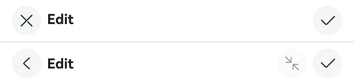
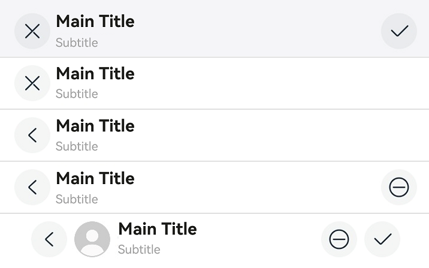

# EditableTitleBar


The editable title bar is a title bar that comes with button icons, typically **Cancel** on the left and **Confirm** on the right, on a multi-select or editing page.


> **NOTE**
>
> This component is supported since API version 10. Updates will be marked with a superscript to indicate their earliest API version.


## Modules to Import

```
import { EditableTitleBar } from '@kit.ArkUI'
```


## Child Components

Not supported

## Attributes
The [universal attributes](ts-universal-attributes-size.md) are not supported.


## EditableTitleBar

EditableTitleBar({leftIconStyle: EditableLeftIconType, imageItem?: EditableTitleBarItem, title: ResourceStr, subtitle?: ResourceStr, menuItems?: Array&lt;EditableTitleBarMenuItem&gt;, isSaveIconRequired?: boolean, onSave?: () =&gt; void, onCancel?: () =&gt;void, options?: EditableTitleBarOptions, contentMargin?: LocalizedMargin})

**Decorator**: @Component

**System capability**: SystemCapability.ArkUI.ArkUI.Full

**Parameters**

| Name| Type| Mandatory| Decorator| Description|
| -------- | -------- | -------- | -------- | -------- |
| leftIconStyle | [EditableLeftIconType](#editablelefticontype) | Yes| - | Type of the icon on the left.<br>**Atomic service API**: This API can be used in atomic services since API version 11.|
| imageItem<sup>12+</sup> | [EditableTitleBarItem](#editabletitlebaritem12) | No| - | A single menu item for the profile picture on the left.<br>**Atomic service API**: This API can be used in atomic services since API version 12.|
| title | [ResourceStr](ts-types.md#resourcestr) | Yes| - | Title.<br>**Atomic service API**: This API can be used in atomic services since API version 11.|
| subtitle<sup>12+</sup> | [ResourceStr](ts-types.md#resourcestr) | No| - | Subtitle.<br>**Atomic service API**: This API can be used in atomic services since API version 12.|
| menuItems | Array&lt;[EditableTitleBarMenuItem](#editabletitlebarmenuitem)&gt; | No| - | List of menu items on the right.<br>**Atomic service API**: This API can be used in atomic services since API version 11.|
| isSaveIconRequired<sup>12+</sup> | boolean | No| - | Whether the save button on the right is required.<br>Default value: **true**, indicating that the save button on the right is required.<br>**Atomic service API**: This API can be used in atomic services since API version 12.|
| onSave | () =&gt; void | No| - | Callback invoked when the Save icon is clicked.<br>**Atomic service API**: This API can be used in atomic services since API version 11.|
| onCancel | () =&gt; void | No| - | Callback that is triggered when the cancel action is performed with the left Cancel icon.<br>Since API version 12: Callback that is triggered when the back action is performed with the left Back icon.<br>**Atomic service API**: This API can be used in atomic services since API version 11.|
| options<sup>12+</sup> | [EditableTitleBarOptions](#editabletitlebaroptions12) | No| - | Title style.<br>**Atomic service API**: This API can be used in atomic services since API version 12.|
| contentMargin<sup>12+</sup> | [LocalizedMargin](ts-types.md#localizedmargin12) | No| @Prop | Margin of the content. Negative numbers are not supported.<br>Default value:<br> {start: LengthMetrics.resource(*$r('sys.float.margin_left')*), end: LengthMetrics.resource(*$r('sys.float.margin_right')*)}<br>**Atomic service API**: This API can be used in atomic services since API version 12.|

## EditableLeftIconType

**Atomic service API**: This API can be used in atomic services since API version 11.

| Name| Value| Description|
| -------- | -------- | -------- |
| Back | 0 | Back.|
| Cancel | 1 | Cancel.|

## EditableTitleBarMenuItem

**Atomic service API**: This API can be used in atomic services since API version 11.

| Name| Type| Mandatory| Description|
| -------- | -------- | -------- | -------- |
| value | [ResourceStr](ts-types.md#resourcestr) | Yes| Icon resource.|
| label<sup>12+</sup> | [ResourceStr](ts-types.md#resourcestr) | No| Icon label.|
| isEnabled | boolean | No| Whether to enable the item.<br>Default value: **false**<br> **true**: The item is enabled.<br> **false**: The item is disabled.|
| action | () =&gt; void | No| Action to perform.|

## EditableTitleBarItem<sup>12+</sup>

**Atomic service API**: This API can be used in atomic services since API version 12.

| Type| Description|
| -------- | -------- |
| [EditableTitleBarMenuItem](#editabletitlebarmenuitem) | A single menu item for the profile picture on the left.|

## EditableTitleBarOptions<sup>12+</sup>

**Atomic service API**: This API can be used in atomic services since API version 12.

| Name| Type| Mandatory| Description|
| -------- | -------- | -------- | -------- |
| backgroundColor | [ResourceStr](ts-types.md#resourcestr) | No| Background color of the title bar.|
| backgroundBlurstyle | [BlurStyle](ts-universal-attributes-background.md#blurstyle9) | No| Background blur style of the title bar.|
| safeAreaTypes | Array <[SafeAreaType](ts-types.md#safeareatype10)> | No  | Types of the expanded safe areas.<br>Default value: **[SafeAreaType.SYSTEM]**|
| safeAreaEdges  | Array <[SafeAreaEdge](ts-types.md#safeareaedge10)> | No  | Edges for expanding the safe area.<br>Default value: **[SafeAreaEdge.TOP]**|

## Events
The [universal events](ts-universal-events-click.md) are not supported.

## Example

### Example 1

```ts
// This example demonstrates the effects of setting the left icon, the main title, and a custom right icon area in the editable title bar.
import { EditableLeftIconType, EditableTitleBar, promptAction } from '@kit.ArkUI';

@Entry
@Component
struct Index {
  build() {
    Row() {
      Column() {
        Divider().height(2).color(0xCCCCCC)
        EditableTitleBar({
          leftIconStyle: EditableLeftIconType.Cancel,
          title: 'Edit',
          menuItems: [],
          onCancel: () => {
            promptAction.showToast({ message: 'on cancel' });
          },
          onSave: () => {
            promptAction.showToast({ message: 'on save' });
          }
        })
        Divider().height(2).color(0xCCCCCC)
        EditableTitleBar({
          leftIconStyle: EditableLeftIconType.Back,
          title: 'Edit',
          menuItems: [
            {
              value: $r('app.media.ic_public_reduce'),
              isEnabled: false,
              action: () => {
                promptAction.showToast({ message: 'show toast index 2' });
              }
            }
          ],
          onSave: () => {
            promptAction.showToast({ message: 'on save' })
          }
        })
        Divider().height(2).color(0xCCCCCC)
      }.width('100%')
    }.height('100%')
  }
}
```



### Example 2

```ts
// This example demonstrates how to configure an editable title bar with a blurred background, profile picture, removal of the save icon on the right, and custom content margins.
import { EditableLeftIconType, EditableTitleBar, LengthMetrics, promptAction, router } from '@kit.ArkUI';

@Entry
@Component
struct Index {
  @State titlebarMargin: LocalizedMargin = {
    start: LengthMetrics.vp(35),
    end: LengthMetrics.vp(35),
  };

  build() {
    Row() {
      Column() {
        EditableTitleBar({
          leftIconStyle: EditableLeftIconType.Cancel,
          title: 'Main Title',
          subtitle: 'Subtitle',
          // Set the background blur effect.
          options: {
            backgroundBlurStyle: BlurStyle.COMPONENT_THICK,
          },
          onSave: () => {
            promptAction.showToast({ message: "on save" });
          },
        })

        Divider().height(2).color(0xCCCCCC);

        EditableTitleBar({
          leftIconStyle: EditableLeftIconType.Cancel,
          title: 'Main Title',
          subtitle: 'Subtitle',
          // Remove the save button on the right.
          isSaveIconRequired: false,
        })

        Divider().height(2).color(0xCCCCCC);

        EditableTitleBar({
          leftIconStyle: EditableLeftIconType.Back,
          title: 'Main Title',
          subtitle: 'Subtitle',
          isSaveIconRequired: false,
          onCancel: () => {
            router.back();
          },
        })

        Divider().height(2).color(0xCCCCCC);

        EditableTitleBar({
          leftIconStyle: EditableLeftIconType.Back,
          title: 'Main Title',
          subtitle: 'Subtitle',
          menuItems: [
            {
              value: $r('sys.media.ohos_ic_public_remove'),
              isEnabled: true,
              action: () => {
                promptAction.showToast({ message: "show toast index 1" });
              }
            }
          ],
          isSaveIconRequired: false,
          // Action triggered when the Back icon on the left is clicked.
          onCancel: () => {
            router.back();
          },
        })

        Divider().height(2).color(0xCCCCCC);

        EditableTitleBar({
          leftIconStyle: EditableLeftIconType.Back,
          title: 'Main Title',
          subtitle: 'Subtitle',
          // Set a clickable profile picture.
          imageItem: {
            value: $r('app.media.img'),
            isEnabled: true,
            action: () => {
              promptAction.showToast({ message: "show toast index 2" });
            }
          },
          // Set the content margin of the title bar.
          contentMargin: this.titlebarMargin,
          // Configure the icon on the right.
          menuItems: [
            {
              value: $r('sys.media.ohos_ic_public_remove'),
              isEnabled: true,
              action: () => {
                promptAction.showToast({ message: "show toast index 3" });
              }
            }
          ],
          onCancel: () => {
            router.back();
          },
        })
      }
    }
  }
}
```


