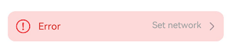

# ExceptionPrompt


The exception prompt component is used to show an error message when an error arises.


> **NOTE**
>
> This component is supported since API version 11. Updates will be marked with a superscript to indicate their earliest API version.


## Modules to Import

```ts
import { ExceptionPrompt, PromptOptions, MarginType } from '@kit.ArkUI'
```


## Child Components

Not supported

## Attributes

The [universal attributes](ts-universal-attributes-size.md) are not supported.

## ExceptionPrompt

ExceptionPrompt({ options: PromptOptions, onTipClick?: ()=>void, onActionTextClick?: ()=>void })

**Decorator**: @Component

**Atomic service API**: This API can be used in atomic services since API version 12.

**System capability**: SystemCapability.ArkUI.ArkUI.Full

**Parameters**


| Name| Type| Mandatory| Decorator| Description|
| -------- | -------- | -------- | -------- | -------- |
| options | [PromptOptions](#promptoptions) | Yes| \@Prop | Exception prompt configuration.|
| onTipClick | ()=>void | No| - | Callback invoked when the prompt text on the left is clicked.|
| onActionTextClick | ()=>void | No| - | Callback invoked when the icon on the right is clicked.|

## PromptOptions

Defines the exception prompt options.

**Atomic service API**: This API can be used in atomic services since API version 12.

**System capability**: SystemCapability.ArkUI.ArkUI.Full

| Name| Type| Mandatory| Description|
| -------- | -------- | -------- | -------- |
| icon | [ResourceStr](ts-types.md#resourcestr) | No| Icon of the exception prompt.|
| tip | [ResourceStr](ts-types.md#resourcestr) | No| Text content of the exception prompt.<br>By default, the following text resources are provided:<br>1. **ohos_network_not_connected**: displayed when no Internet connection.<br>2. **ohos_network_connected_unstable**: displayed when the Internet connection is unstable.<br>3. **ohos_unstable_connect_server**: displayed when the server fails to be connected.<br>4. **ohos_custom_network_tips_left**: displayed when an Internet connection is available but the location fails to be obtained.|
| marginType | [MarginType](#margintype) | Yes| Margin type of the exception prompt.|
| actionText | [ResourceStr](ts-types.md#resourcestr) | No| Text of the icon on the right of the exception prompt.|
| marginTop | [Dimension](ts-types.md#dimension10) | Yes| Top margin of the exception prompt.|
| isShown | boolean | No| Whether the exception prompt is displayed.<br>**true**: The exception prompt is displayed.<br>**false**: The exception prompt is displayed.|

## MarginType

Defines the margin type.

**Atomic service API**: This API can be used in atomic services since API version 12.

**System capability**: SystemCapability.ArkUI.ArkUI.Full

| Name| Value| Description|
| -------- | -------- | -------- |
| DEFAULT_MARGIN | 0 | Default margin:<br>Margin 1: referenced from **ohos_id_card_margin_start**.<br>Margin 2: referenced from **ohos_id_card_margin_end**.|
| FIT_MARGIN | 1 | Adaptable margin:<br> Margin 1: referenced from **ohos_id_max_padding_start**.<br> Margin 2: referenced from **ohos_id_max_padding_end**.|

## Events
The [universal events](ts-universal-events-click.md) are supported.

## Example
### Example 1: Configuring an Exception Prompt

This example demonstrates how to configure an exception prompt, including the exception icon, text, margin, and the text content of the right-side icon button.

```ts
import { ExceptionPrompt, PromptOptions, MarginType } from '@kit.ArkUI'

@Entry
@Component
struct Index {
  @State options: PromptOptions = {
    icon: $r('sys.media.ohos_ic_public_fail'),
    tip: 'Error',
    marginType: MarginType.DEFAULT_MARGIN,
    actionText: 'Set network',
    marginTop: 80,
    isShown:true
  }

  build() {
    Column() {
      ExceptionPrompt({
        options: this.options,
        onTipClick: () => {
            // Click the text on the left to switch to the connecting state.
        },
        onActionTextClick: () => {
            // Click Set network to open the Set network dialog box.
        },
      })
    }
  }
}
```



### Example 2: Setting a Dialog-Type Exception Prompt

This example uses a custom dialog box to set a dialog-type exception prompt.

```ts
import { ExceptionPrompt, PromptOptions, MarginType } from '@kit.ArkUI'

@CustomDialog
struct CustomDialogExample {
  @Link textValue: string
  @Link inputValue: string
  @State options: PromptOptions = {
    icon: $r('app.media.ic_public_fail'),
    tip: 'Error',
    marginType: MarginType.DEFAULT_MARGIN,
    actionText: 'Settings',
    marginTop: 5,
    isShown: true
  }
  cancel: () => void = () => {}
  confirm: () => void = () => {}
  controller: CustomDialogController
  // You can pass in multiple other controllers in the CustomDialog to open one or more other CustomDialogs in the CustomDialog. In this case, you must place the controller pointing to the self behind all controllers.
  build() {
    Column() {
      ExceptionPrompt({
        options: this.options,
      })
      TextInput({ placeholder: '', text: this.textValue }).margin({top:70}).height(60).width('90%')
        .onChange((value: string) => {
          this.textValue = value
        })
      Text('Are you sure you want to change the text?').fontSize(16).margin({ bottom: 10 })
      Flex({ justifyContent: FlexAlign.SpaceAround }) {
        Button('No')
          .onClick(() => {
            this.controller.close()
            this.cancel()
          }).backgroundColor(0xffffff).fontColor(Color.Black)
        Button('OK')
          .onClick(() => {
            this.inputValue = this.textValue
            this.controller.close()
            this.confirm()
          }).backgroundColor(0xffffff).fontColor(Color.Red)
      }.margin({ bottom: 10 })
    }
  }
}
@Entry
@Component
struct Index1 {
  @State ButtonText: string = ''
  @State MAP_HEIGHT: string = '30%'
  @State duration: number = 2500
  @State tips: string = ''
  @State actionText: string = ''
  controller: TextInputController = new TextInputController()
  cancel: () => void = () => {}
  confirm: () => void = () => {}
  @State options: PromptOptions = {
    icon: $r('app.media.ic_public_fail'),
    tip: '',
    marginType: MarginType.DEFAULT_MARGIN,
    actionText: '',
    marginTop: 80,
    isShown: true
  }
  @State textValue: string = ''
  @State inputValue: string = 'click me'
  dialogController: CustomDialogController | undefined = new CustomDialogController({
    builder: CustomDialogExample({
      cancel: this.onCancel,
      confirm: this.onAccept,
      textValue: $textValue,
      inputValue: $inputValue
    }),
    cancel: this.existApp,
    autoCancel: true,
    alignment: DialogAlignment.Bottom,
    offset: { dx: 0, dy: -20 },
    gridCount: 4,
    customStyle: false
  })

  aboutToDisappear() {
    this.dialogController = undefined // Set dialogController to undefined.
  }

  onCancel() {
    console.info('Callback when the first button is clicked')
  }

  onAccept() {
    console.info('Callback when the second button is clicked')
  }

  existApp() {
    console.info('Click the callback in the blank area')
  }

  build() {
    Column() {
      Button('Click Me')
        .width('30%')
        .margin({top:420})
        .zIndex(999)
        .onClick(()=>{
          if (this.dialogController != undefined) {
            this.dialogController.open()
          }
        })
    }
    .height('100%')
    .width('100%')

  }
}
```


