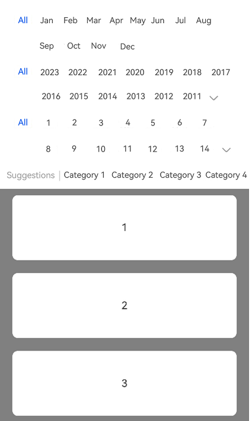

# Filter


The advanced filter component allows users to filter data with multiple criteria combined. It consists of a floating bar and filters therein. The floating bar can be expanded to reveal the filters, which come in a multi-line collapsible or multi-line list style. For added convenience, you can append an additional quick filter.


> **NOTE**
>
> This component is supported since API version 10. Updates will be marked with a superscript to indicate their earliest API version.


## Modules to Import

```
import { Filter } from '@kit.ArkUI'
```


## Child Components

Not supported

## Attributes
The [universal attributes](ts-component-general-attributes.md) are not supported.

## Filter

Filter({ multiFilters: Array&lt;FilterParams&gt;,  additionFilters?: FilterParams, filterType?: FilterType, onFilterChanged: (Array&lt;FilterResult&gt;) =&gt; void, container: ()=&gt; void })

**Decorator**: @Component

**Atomic service API**: This API can be used in atomic services since API version 11.

**System capability**: SystemCapability.ArkUI.ArkUI.Full

**Parameters**


| Name| Type| Mandatory | Decorator| Description|
| -------- | -------- | -------- | -------- | -------- |
| multiFilters | Array&lt;[FilterParams](#filterparams)&gt; | Yes  | \@Prop | List of filter criteria.|
| additionFilters | [FilterParams](#filterparams) | No  | \@Prop | Additional quick filter.|
| filterType | [FilterType](#filtertype) | No  | \@Prop | Filter type.|
| onFilterChanged | (filterResults: Array&lt;[FilterResult](#filterresult)&gt;) =&gt; void | Yes  | - | Callback invoked when the filter criteria is changed. The input parameter is the list of selected filter criteria.|
| container | ()=&gt;void | Yes  | \@BuilderParam | Custom content of the filtering result display area, which is passed in a trailing closure.|

## FilterParams

**Atomic service API**: This API can be used in atomic services since API version 11.

**System capability**: SystemCapability.ArkUI.ArkUI.Full

| Name| Type| Mandatory| Description                                                             |
| -------- | -------- | -------- |-----------------------------------------------------------------|
| name | [ResourceStr](ts-types.md#resourcestr) | Yes| Name of the filter criterion.<br>The default value is an empty string.<br>**NOTE**<br>If the text is longer than the column width, it will be truncated.             |
| options | Array&lt;[ResourceStr](ts-types.md#resourcestr)&gt; | Yes| Options of the filter criterion.<br>The default value is an empty string.<br>**NOTE**<br>The text is truncated with an ellipsis (...) if it is too long.|

## FilterType

**Atomic service API**: This API can be used in atomic services since API version 11.

**System capability**: SystemCapability.ArkUI.ArkUI.Full

| Name| Value| Description|
| -------- | -------- | -------- |
| MULTI_LINE_FILTER | 0 | Multi-line collapsible.|
| LIST_FILTER | 1 | Multi-line list.|

## FilterResult

**Atomic service API**: This API can be used in atomic services since API version 11.

**System capability**: SystemCapability.ArkUI.ArkUI.Full

| Name| Type| Mandatory| Description                                                                      |
| -------- | -------- | -------- |--------------------------------------------------------------------------|
| name | [ResourceStr](ts-types.md#resourcestr) | Yes| Name of the filter criterion.<br>The default value is an empty string.<br>**NOTE**<br>If the text is longer than the column width, it will be truncated.                      |
| index | number | Yes| Index of the selected option of the filter criterion.<br>Value range: an integer no less than -1<br>The default value is **-1**, indicating that there is no selected option. Values less than -1 are treated as no selected option.|
| value | [ResourceStr](ts-types.md#resourcestr) | Yes| Value of the selected option of the filter criterion.<br>The default value is an empty string.<br>**NOTE**<br>If the text is longer than the column width, it will be truncated.                 |

## Events
The [universal events](ts-component-general-events.md) are not supported.

## Example

This example shows how to implement a multi-line collapsible filter by setting **FilterType** to **MULTI_LINE_FILTER**.

```ts
import { Filter, FilterParams, FilterResult, FilterType } from '@kit.ArkUI';

@Entry
@Component
struct Index {
  private filterParam: Array<FilterParams> = [{
    name: 'Month',
    options: ['All', 'Jan', 'Feb', 'Mar', 'Apr', 'May', 'Jun', 'Jul', 'Aug', 'Sep', 'Oct', 'Nov', 'Dec'],
  },
    {
      name: 'Year',
      options: ['All', '2023', '2022', '2021', '2020', '2019', '2018', '2017', '2016', '2015', '2014', '2013', '2012',
        '2011', '2010', '2009', '2008'],
    },
    {
      name: 'Day',
      options: ['All', '1', '2', '3', '4', '5',' 6', '7','8', '9','10', '11', '12',
        '13','14', '15', '16', '17', '18','19','20','21','22', '23'],
    }];
  // Addition filter parameter. The name of the filter dimension must be specified. Otherwise, the entire filter dimension is not displayed.
  private additionParam: FilterParams =
    { name: 'Suggestions', options: ['Category 1', 'Category 2', 'Category 3', 'Category 4', 'Category 5', 'Category 6'] };
  private arr: number[] = [1, 2, 3, 4, 5, 6, 7, 8, 9, 10, 1, 2, 3, 4, 5, 6, 7, 8, 9, 10];

  build() {
    Column() {
      Filter({
        multiFilters: this.filterParam,
        additionFilters: this.additionParam,
        filterType: FilterType.MULTI_LINE_FILTER,
        onFilterChanged: (select: Array<FilterResult>) => {
          console.log('rec filter change');
          for (let filter of select) {
            console.log('name:' + filter.name + ',index:' + filter.index + ',value:' + filter.value);
          }
        }
      }) {
        List({ initialIndex: 0 }) {
          ForEach(this.arr, (item: string, index: number) => {
            ListItem() {
              Text(item.toString())
                .width('100%')
                .height(100)
                .fontSize(16)
                .textAlign(TextAlign.Center)
                .borderRadius(10)
                .backgroundColor(Color.White)
                .margin({ top: 10, bottom: 10 })
            }
          })
        }.backgroundColor(Color.Gray)
        .padding({ left: 20, right: 20 })
      }
    }
    .height('100%')
    .width('100%')
  }
}
```


