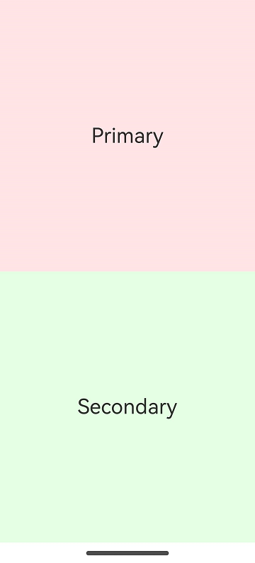
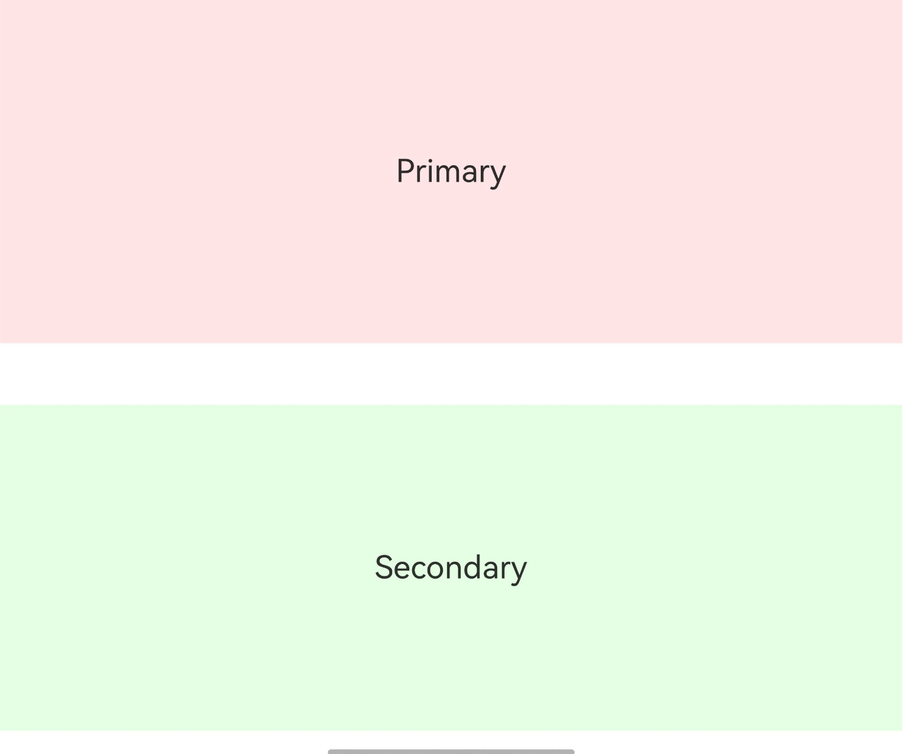
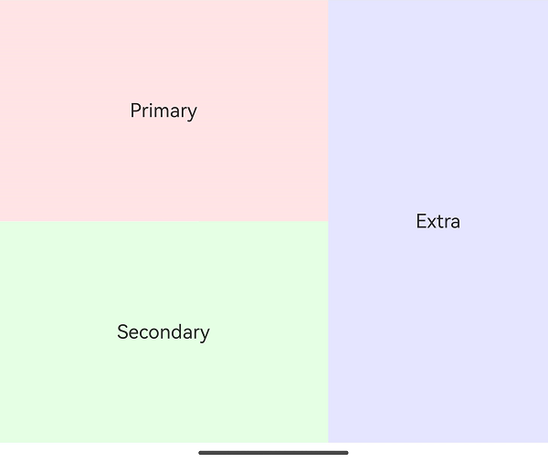
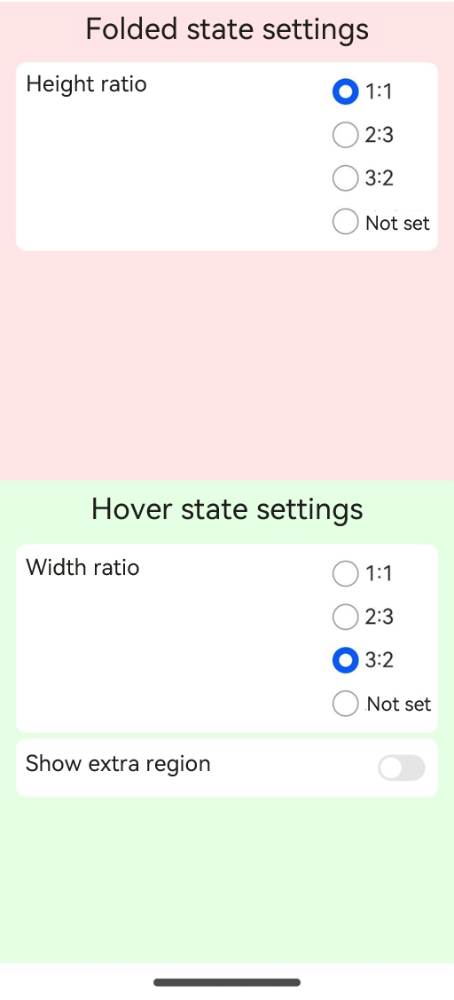
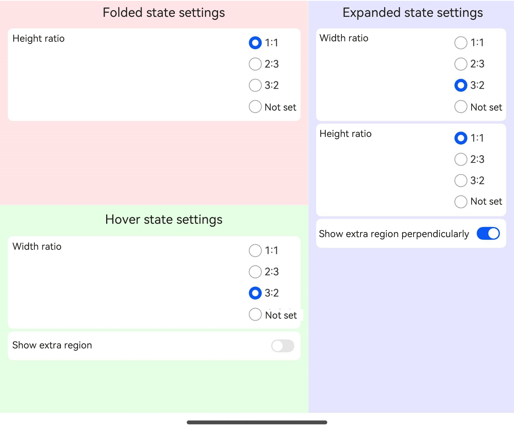
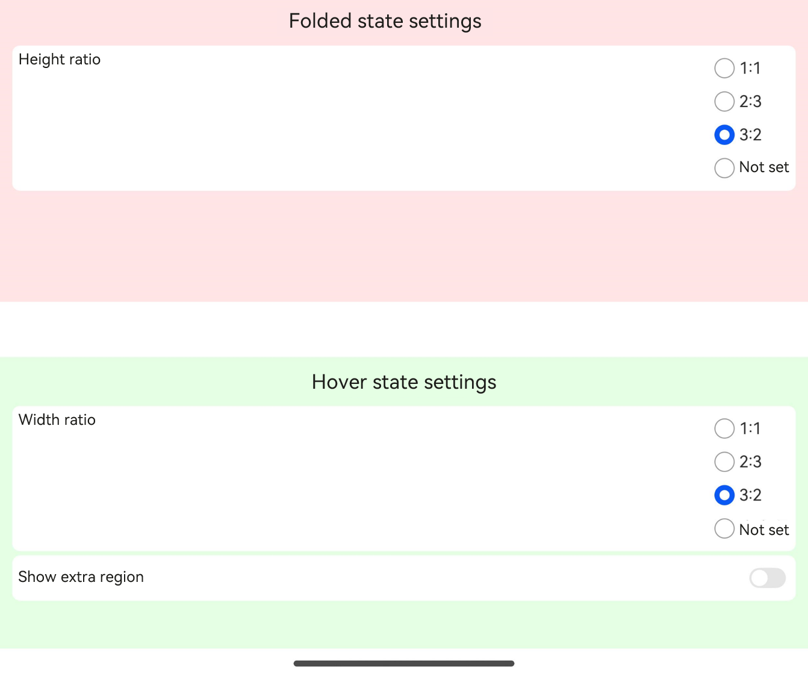
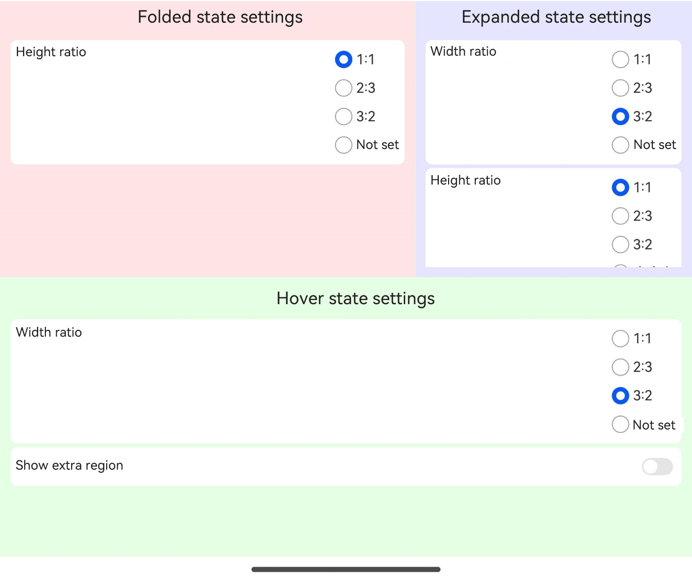
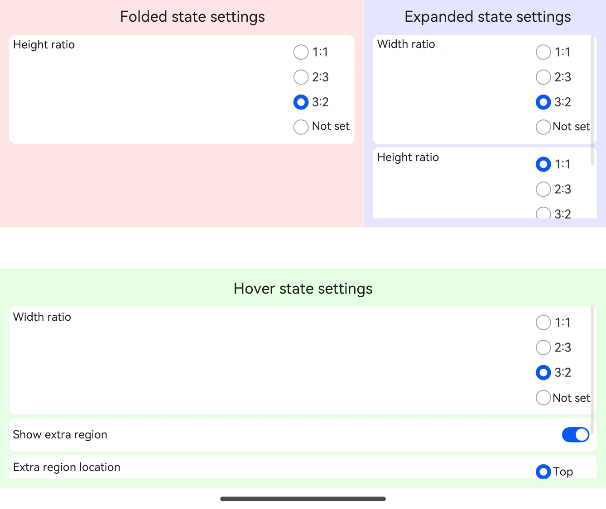
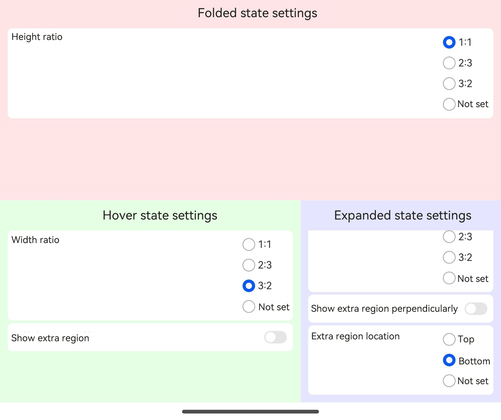
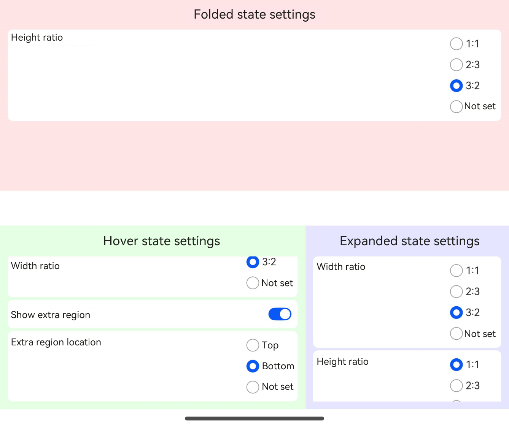

# FoldSplitContainer


**FoldSplitContainer** is a layout container designed to manage regions for two-panel and three-panel arrangements on a foldable device across various states, including the expanded state, the hover state, and the folded state.


> **NOTE**
>
> This component is supported since API version 12. Updates will be marked with a superscript to indicate their earliest API version.

## Modules to Import

```ts
import { FoldSplitContainer } from '@kit.ArkUI';
```

## Child Components

Not supported

## FoldSplitContainer

FoldSplitContainer({
  primary: Callback&lt;void&gt;,
  secondary: Callback&lt;void&gt;,
  extra?: Callback&lt;void&gt;,
  expandedLayoutOptions: ExpandedRegionLayoutOptions,
  hoverModeLayoutOptions: HoverModeRegionLayoutOptions,
  foldedLayoutOptions: FoldedRegionLayoutOptions,
  animationOptions?: AnimateParam,
  onHoverStatusChange?: OnHoverStatusChangeHandler
})

Creates a **FoldSplitContainer** component to manage regions for two-panel and three-panel arrangements on a foldable device across various states, including the expanded state, the hover state, and the folded state.

**Decorator**: \@Component

**Atomic service API**: This API can be used in atomic services since API version 12.

**System capability**: SystemCapability.ArkUI.ArkUI.Full

| Name| Type| Mandatory| Decorator| Description|
| -------- | -------- | -------- | -------- | -------- |
| primary | ()=>void | Yes| @BuilderParam | Callback function for the primary region.|
| secondary | ()=>void | Yes| @BuilderParam | Callback function for the secondary region.|
| extra | ()=>void | No| @BuilderParam | Callback function for the extra region. If this parameter is not provided, there is no corresponding region.|
| expandedLayoutOptions | [ExpandedRegionLayoutOptions](#expandedregionlayoutoptions) | Yes| @Prop | Layout information for the expanded state.|
| hoverModeLayoutOptions | [HoverModeRegionLayoutOptions](#hovermoderegionlayoutoptions) | Yes| @Prop | Layout information for the hover state.|
| foldedLayoutOptions | [FoldedRegionLayoutOptions](#foldedregionlayoutoptions) | Yes| @Prop | Layout information for the folded state.|
| animationOptions | [AnimateParam](ts-explicit-animation.md#animateparam) \| null | No| @Prop | Animation settings. The value **null** indicates that the animation is disabled.|
| onHoverStatusChange | [OnHoverStatusChangeHandler](#onhoverstatuschangehandler) | No| - | Callback function triggered when the foldable device enters or exits the hover state.|

## ExpandedRegionLayoutOptions

Defines the layout information for the expanded state.

**Atomic service API**: This API can be used in atomic services since API version 12.

**System capability**: SystemCapability.ArkUI.ArkUI.Full

| Name| Type| Mandatory| Description|
| -------- | -------- | -------- | -------- |
| isExtraRegionPerpendicular | boolean | No| Whether the extra region extends perpendicularly through the entire component from top to bottom. This setting takes effect only when **extra** is effective. Default value: **true**|
| verticalSplitRatio | number | No| Height ratio between the primary and secondary regions. Default value: **PresetSplitRatio.LAYOUT_1V1**|
| horizontalSplitRatio | number | No| Width ratio between the primary and extra regions. This setting takes effect only when **extra** is effective. Default value: **PresetSplitRatio.LAYOUT_3V2**|
| extraRegionPosition | [ExtraRegionPosition](#extraregionposition) | No| Position information of the extra region. This setting takes effect only when **isExtraRegionPerpendicular** is **false**. Default value: **ExtraRegionPosition.top**|

## HoverModeRegionLayoutOptions

Defines the layout information for the hover state.

**Atomic service API**: This API can be used in atomic services since API version 12.

**System capability**: SystemCapability.ArkUI.ArkUI.Full

| Name| Type| Mandatory| Description|
| -------- | -------- | -------- | -------- |
| showExtraRegion | boolean | No| Whether to display the extra region in the half-folded state. Default value: **false**|
| horizontalSplitRatio | number | No| Width ratio between the primary and extra regions. This setting takes effect only when **extra** is effective. Default value: **PresetSplitRatio.LAYOUT_3V2**|
| extraRegionPosition | [ExtraRegionPosition](#extraregionposition) | No| Position information of the extra region. This setting takes effect only when **showExtraRegion** is set. Default value: **ExtraRegionPosition.top**|

> **NOTE**
>
> 1. When the device is in the hover state, there is an avoid area, and layout calculations need to account for the impact of the avoid area on the layout.
> 2 In the hover state, the upper half screen is used for display, and the lower half is used for interaction.

## FoldedRegionLayoutOptions

Defines the layout information for the folded state.

**Atomic service API**: This API can be used in atomic services since API version 12.

**System capability**: SystemCapability.ArkUI.ArkUI.Full

| Name| Type| Mandatory| Description|
| -------- | -------- | -------- | -------- |
| verticalSplitRatio | number | No| Height ratio between the primary and secondary regions. Default value: **PresetSplitRatio.LAYOUT_1V1**|

## OnHoverStatusChangeHandler

type OnHoverStatusChangeHandler = (status: HoverModeStatus) => void

Implements a handler for the **onHoverStatusChange** event.

**Atomic service API**: This API can be used in atomic services since API version 12.

**System capability**: SystemCapability.ArkUI.ArkUI.Full

**Parameters**

| Name| Type| Mandatory| Description|
| -------- | -------- | -------- | -------- |
| status | [HoverModeStatus](#hovermodestatus) | Yes| Callback function triggered when the foldable device enters or exits the hover state.|

## HoverModeStatus

Provides information about the device or application's folding, rotation, and window state.

**Atomic service API**: This API can be used in atomic services since API version 12.

**System capability**: SystemCapability.ArkUI.ArkUI.Full

| Name| Type| Mandatory| Description|
| -------- | -------- | -------- | -------- |
| foldStatus | [display.FoldStatus](../js-apis-display.md#foldstatus10) | Yes| Fold status of the device.|
| isHoverMode | boolean | Yes| Whether the application is in the hover state.|
| appRotation | number | Yes| Rotation angle of the application.|
| windowStatusType | [window.WindowStatusType](../js-apis-window.md#windowstatustype11) | Yes| Window mode.|

## ExtraRegionPosition

Provides the position information of the extra region.

**Atomic service API**: This API can be used in atomic services since API version 12.

**System capability**: SystemCapability.ArkUI.ArkUI.Full

| Name| Value| Description|
| -------- | -------- | -------- |
| TOP | 1 | The extra region is in the upper half of the component.|
| BOTTOM | 2 | The extra region is in the lower half of the component.|

## PresetSplitRatio

Enumerates the split ratios.

**Atomic service API**: This API can be used in atomic services since API version 12.

**System capability**: SystemCapability.ArkUI.ArkUI.Full

| Name| Value| Description|
| -------- | -------- | -------- |
| LAYOUT_1V1 | 1 | 1:1.|
| LAYOUT_3V2 | 1.5 | 3:2.|
| LAYOUT_2V3 | 0.6666666666666666 | 2:3.|

## Example

### Example 1: Setting Up a Two-Panel Layout

This example demonstrates how to control the region for a two-panel layout on a foldable screen across different states: folded, expanded, and hover.

```ts
import { FoldSplitContainer } from '@kit.ArkUI';

@Entry
@Component
struct TwoColumns {
  @Builder
  privateRegion() {
    Text("Primary")
      .backgroundColor('rgba(255, 0, 0, 0.1)')
      .fontSize(28)
      .textAlign(TextAlign.Center)
      .height('100%')
      .width('100%')
  }

  @Builder
  secondaryRegion() {
    Text("Secondary")
      .backgroundColor('rgba(0, 255, 0, 0.1)')
      .fontSize(28)
      .textAlign(TextAlign.Center)
      .height('100%')
      .width('100%')
  }

  build() {
    RelativeContainer() {
      FoldSplitContainer({
        primary: () => {
          this.privateRegion()
        },
        secondary: () => {
          this.secondaryRegion()
        }
      })
    }
    .height('100%')
    .width('100%')
  }
}
```

| Folded| Expanded| Hover|
| ----- | ------ | ------ |
|  |  |  |

### Example 2: Setting Up a Three-Panel Layout

This example demonstrates how to control the region for a three-panel layout on a foldable screen across different states: folded, expanded, and hover.

```ts
import { FoldSplitContainer } from '@kit.ArkUI';

@Entry
@Component
struct ThreeColumns {
  @Builder
  privateRegion() {
    Text("Primary")
      .backgroundColor('rgba(255, 0, 0, 0.1)')
      .fontSize(28)
      .textAlign(TextAlign.Center)
      .height('100%')
      .width('100%')
  }

  @Builder
  secondaryRegion() {
    Text("Secondary")
      .backgroundColor('rgba(0, 255, 0, 0.1)')
      .fontSize(28)
      .textAlign(TextAlign.Center)
      .height('100%')
      .width('100%')
  }

  @Builder
  extraRegion() {
    Text("Extra")
      .backgroundColor('rgba(0, 0, 255, 0.1)')
      .fontSize(28)
      .textAlign(TextAlign.Center)
      .height('100%')
      .width('100%')
  }

  build() {
    RelativeContainer() {
      FoldSplitContainer({
        primary: () => {
          this.privateRegion()
        },
        secondary: () => {
          this.secondaryRegion()
        },
        extra: () => {
          this.extraRegion()
        }
      })
    }
    .height('100%')
    .width('100%')
  }
}
```

| Folded| Expanded| Hover|
| ----- | ------ | ------ |
|  |  |  |

### Example 3: Setting Layout Information in Expanded State

This example illustrates how to configure **ExpandedRegionLayoutOptions** to set the layout information for a foldable screen when it is in the expanded state.

```ts
import {
  FoldSplitContainer,
  PresetSplitRatio,
  ExtraRegionPosition,
  ExpandedRegionLayoutOptions,
  HoverModeRegionLayoutOptions,
  FoldedRegionLayoutOptions
} from '@kit.ArkUI';

@Component
struct Region {
  @Prop title: string;
  @BuilderParam content: () => void;
  @Prop compBackgroundColor: string;

  build() {
    Column({ space: 8 }) {
      Text(this.title)
        .fontSize("24fp")
        .fontWeight(600)

      Scroll() {
        this.content()
      }
      .layoutWeight(1)
      .width("100%")
    }
    .backgroundColor(this.compBackgroundColor)
    .width("100%")
    .height("100%")
    .padding(12)
  }
}

const noop = () => {
};

@Component
struct SwitchOption {
  @Prop label: string = ""
  @Prop value: boolean = false
  public onChange: (checked: boolean) => void = noop;

  build() {
    Row() {
      Text(this.label)
      Blank()
      Toggle({ type: ToggleType.Switch, isOn: this.value })
        .onChange((isOn) => {
          this.onChange(isOn);
        })
    }
    .backgroundColor(Color.White)
    .borderRadius(8)
    .padding(8)
    .width("100%")
  }
}

interface RadioOptions {
  label: string;
  value: Object | undefined | null;
  onChecked: () => void;
}

@Component
struct RadioOption {
  @Prop label: string;
  @Prop value: Object | undefined | null;
  @Prop options: Array<RadioOptions>;

  build() {
    Row() {
      Text(this.label)
      Blank()
      Column({ space: 4 }) {
        ForEach(this.options, (option: RadioOptions) => {
          Row() {
            Radio({
              group: this.label,
              value: JSON.stringify(option.value),
            })
              .checked(this.value === option.value)
              .onChange((checked) => {
                if (checked) {
                  option.onChecked();
                }
              })
            Text(option.label)
          }
        })
      }
      .alignItems(HorizontalAlign.Start)
    }
    .alignItems(VerticalAlign.Top)
    .backgroundColor(Color.White)
    .borderRadius(8)
    .padding(8)
    .width("100%")
  }
}

@Entry
@Component
struct Index {
  @State expandedRegionLayoutOptions: ExpandedRegionLayoutOptions = {
    horizontalSplitRatio: PresetSplitRatio.LAYOUT_3V2,
    verticalSplitRatio: PresetSplitRatio.LAYOUT_1V1,
    isExtraRegionPerpendicular: true,
    extraRegionPosition: ExtraRegionPosition.TOP
  };
  @State foldingRegionLayoutOptions: HoverModeRegionLayoutOptions = {
    horizontalSplitRatio: PresetSplitRatio.LAYOUT_3V2,
    showExtraRegion: false,
    extraRegionPosition: ExtraRegionPosition.TOP
  };
  @State foldedRegionLayoutOptions: FoldedRegionLayoutOptions = {
    verticalSplitRatio: PresetSplitRatio.LAYOUT_1V1
  };

  @Builder
  MajorRegion() {
    Region({
      title: "Folded state settings",
      compBackgroundColor: "rgba(255, 0, 0, 0.1)",
    }) {
      Column({ space: 4 }) {
        RadioOption({
          label: "Height ratio",
          value: this.foldedRegionLayoutOptions.verticalSplitRatio,
          options: [
            {
              label: "1:1",
              value: PresetSplitRatio.LAYOUT_1V1,
              onChecked: () => {
                this.foldedRegionLayoutOptions.verticalSplitRatio = PresetSplitRatio.LAYOUT_1V1
              }
            },
            {
              label: "2:3",
              value: PresetSplitRatio.LAYOUT_2V3,
              onChecked: () => {
                this.foldedRegionLayoutOptions.verticalSplitRatio = PresetSplitRatio.LAYOUT_2V3
              }
            },
            {
              label: "3:2",
              value: PresetSplitRatio.LAYOUT_3V2,
              onChecked: () => {
                this.foldedRegionLayoutOptions.verticalSplitRatio = PresetSplitRatio.LAYOUT_3V2
              }
            },
            {
              label: "Not set",
              value: undefined,
              onChecked: () => {
                this.foldedRegionLayoutOptions.verticalSplitRatio = undefined
              }
            }
          ]
        })
      }
      .constraintSize({ minHeight: "100%" })
    }
  }

  @Builder
  MinorRegion() {
    Region({
      title: "Hover state settings",
      compBackgroundColor: "rgba(0, 255, 0, 0.1)"
    }) {
      Column({ space: 4 }) {
        RadioOption({
          label: "Width ratio",
          value: this.foldingRegionLayoutOptions.horizontalSplitRatio,
          options: [
            {
              label: "1:1",
              value: PresetSplitRatio.LAYOUT_1V1,
              onChecked: () => {
                this.foldingRegionLayoutOptions.horizontalSplitRatio = PresetSplitRatio.LAYOUT_1V1
              }
            },
            {
              label: "2:3",
              value: PresetSplitRatio.LAYOUT_2V3,
              onChecked: () => {
                this.foldingRegionLayoutOptions.horizontalSplitRatio = PresetSplitRatio.LAYOUT_2V3
              }
            },
            {
              label: "3:2",
              value: PresetSplitRatio.LAYOUT_3V2,
              onChecked: () => {
                this.foldingRegionLayoutOptions.horizontalSplitRatio = PresetSplitRatio.LAYOUT_3V2
              }
            },
            {
              label: "Not set",
              value: undefined,
              onChecked: () => {
                this.foldingRegionLayoutOptions.horizontalSplitRatio = undefined
              }
            },
          ]
        })

        SwitchOption({
          label: "Show extra region",
          value: this.foldingRegionLayoutOptions.showExtraRegion,
          onChange: (checked) => {
            this.foldingRegionLayoutOptions.showExtraRegion = checked;
          }
        })

        if (this.foldingRegionLayoutOptions.showExtraRegion) {
          RadioOption({
            label: "Extra region location,"
            value: this.foldingRegionLayoutOptions.extraRegionPosition,
            options: [
              {
                label: "Top,"
                value: ExtraRegionPosition.TOP,
                onChecked: () => {
                  this.foldingRegionLayoutOptions.extraRegionPosition = ExtraRegionPosition.TOP
                }
              },
              {
                label: "Bottom,"
                value: ExtraRegionPosition.BOTTOM,
                onChecked: () => {
                  this.foldingRegionLayoutOptions.extraRegionPosition = ExtraRegionPosition.BOTTOM
                }
              },
              {
                label: "Not set",
                value: undefined,
                onChecked: () => {
                  this.foldingRegionLayoutOptions.extraRegionPosition = undefined
                }
              },
            ]
          })
        }
      }
      .constraintSize({ minHeight: "100%" })
    }
  }

  @Builder
  ExtraRegion() {
    Region({
      title: "Expanded state settings,"
      compBackgroundColor: "rgba(0, 0, 255, 0.1)"
    }) {
      Column({ space: 4 }) {
        RadioOption({
          label: "Width ratio,"
          value: this.expandedRegionLayoutOptions.horizontalSplitRatio,
          options: [
            {
              label: "1:1",
              value: PresetSplitRatio.LAYOUT_1V1,
              onChecked: () => {
                this.expandedRegionLayoutOptions.horizontalSplitRatio = PresetSplitRatio.LAYOUT_1V1
              }
            },
            {
              label: "2:3",
              value: PresetSplitRatio.LAYOUT_2V3,
              onChecked: () => {
                this.expandedRegionLayoutOptions.horizontalSplitRatio = PresetSplitRatio.LAYOUT_2V3
              }
            },
            {
              label: "3:2",
              value: PresetSplitRatio.LAYOUT_3V2,
              onChecked: () => {
                this.expandedRegionLayoutOptions.horizontalSplitRatio = PresetSplitRatio.LAYOUT_3V2
              }
            },
            {
              label: "Not set",
              value: undefined,
              onChecked: () => {
                this.expandedRegionLayoutOptions.horizontalSplitRatio = undefined
              }
            },
          ]
        })

        RadioOption({
          label: "Height ratio",
          value: this.expandedRegionLayoutOptions.verticalSplitRatio,
          options: [
            {
              label: "1:1",
              value: PresetSplitRatio.LAYOUT_1V1,
              onChecked: () => {
                this.expandedRegionLayoutOptions.verticalSplitRatio = PresetSplitRatio.LAYOUT_1V1
              }
            },
            {
              label: "2:3",
              value: PresetSplitRatio.LAYOUT_2V3,
              onChecked: () => {
                this.expandedRegionLayoutOptions.verticalSplitRatio = PresetSplitRatio.LAYOUT_2V3
              }
            },
            {
              label: "3:2",
              value: PresetSplitRatio.LAYOUT_3V2,
              onChecked: () => {
                this.expandedRegionLayoutOptions.verticalSplitRatio = PresetSplitRatio.LAYOUT_3V2
              }
            },
            {
              label: "Not set",
              value: undefined,
              onChecked: () => {
                this.expandedRegionLayoutOptions.verticalSplitRatio = undefined
              }
            }
          ]
        })

        SwitchOption({
          label: "Show extra region perpendicularly,"
          value: this.expandedRegionLayoutOptions.isExtraRegionPerpendicular,
          onChange: (checked) => {
            this.expandedRegionLayoutOptions.isExtraRegionPerpendicular = checked;
          }
        })

        if (!this.expandedRegionLayoutOptions.isExtraRegionPerpendicular) {
          RadioOption({
            label: "Extra region location,"
            value: this.expandedRegionLayoutOptions.extraRegionPosition,
            options: [
              {
                label: "Top,"
                value: ExtraRegionPosition.TOP,
                onChecked: () => {
                  this.expandedRegionLayoutOptions.extraRegionPosition = ExtraRegionPosition.TOP
                }
              },
              {
                label: "Bottom,"
                value: ExtraRegionPosition.BOTTOM,
                onChecked: () => {
                  this.expandedRegionLayoutOptions.extraRegionPosition = ExtraRegionPosition.BOTTOM
                }
              },
              {
                label: "Not set",
                value: undefined,
                onChecked: () => {
                  this.expandedRegionLayoutOptions.extraRegionPosition = undefined
                }
              },
            ]
          })
        }
      }
      .constraintSize({ minHeight: "100%" })
    }
  }

  build() {
    Column() {
      FoldSplitContainer({
        primary: () => {
          this.MajorRegion()
        },
        secondary: () => {
          this.MinorRegion()
        },
        extra: () => {
          this.ExtraRegion()
        },
        expandedLayoutOptions: this.expandedRegionLayoutOptions,
        hoverModeLayoutOptions: this.foldingRegionLayoutOptions,
        foldedLayoutOptions: this.foldedRegionLayoutOptions,
      })
    }
    .width("100%")
    .height("100%")
  }
}
```

| Folded| Expanded| Hover|
| ----- | ------ | ------ |
|  |  |  |
|                                       |  |  |
|                                       |  |  |
