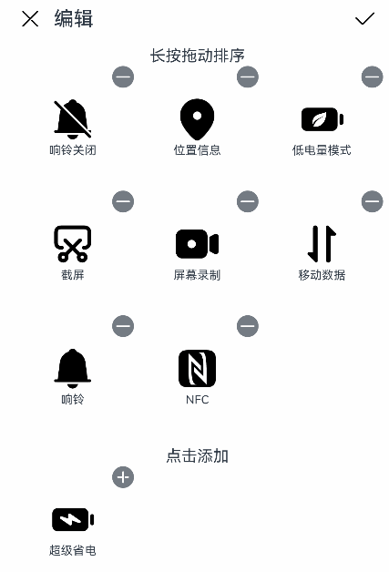

# GridObjectSortComponent


**GridObjectSortComponent** is a grid object organizer that you can use to edit, drag to sort, add, and delete grid objects.


>  **NOTE**
>
>  This component is supported since API version 11. Updates will be marked with a superscript to indicate their earliest API version.
>
>  This component is not supported on wearables.


## Modules to Import

```ts
import { GridObjectSortComponent, GridObjectSortComponentItem, GridObjectSortComponentOptions, GridObjectSortComponentType , SymbolGlyphModifier } from '@kit.ArkUI';
```

##  Child Components

Not supported

## Attributes

The [universal attributes](ts-component-general-attributes.md) are not supported.

## GridObjectSortComponent

GridObjectSortComponent({options: GridObjectSortComponentOptions, dataList: Array\<GridObjectSortComponentItem>, onSave: (select: Array\<GridObjectSortComponentItem>, unselect: Array\<GridObjectSortComponentItem>) => void, onCancel: () => void })

Creates a **GridObjectSortComponent** component.

**Decorator**: @Component

**Atomic service API**: This API can be used in atomic services since API version 12.

**System capability**: SystemCapability.ArkUI.ArkUI.Full


| Name    | Type                            | Mandatory| Decorator| Description        |
| -------- | -------------------------------- | ---------- | ---- | ---- |
| options  | [GridObjectSortComponentOptions](#gridobjectsortcomponentoptions) | Yes    | @Prop      | Component configuration.|
| dataList | Array<[GridObjectSortComponentItem](#gridobjectsortcomponentitem)> | Yes   | -     | Data to pass. The maximum data length is 50 characters. If it is exceeded, only the first 50 characters are used.|
| onSave | (select: Array<[GridObjectSortComponentItem](#gridobjectsortcomponentitem)>, unselect: Array<[GridObjectSortComponentItem](#gridobjectsortcomponentitem)>)  => void | Yes| - | Callback invoked when changes are saved. The data after the changes is returned.|
| onCancel | () => void | Yes| - | Callback invoked when changes are canceled.|

##  GridObjectSortComponentOptions

Provides configuration options for the **GridObjectSortComponent** component.

**Atomic service API**: This API can be used in atomic services since API version 12.

**System capability**: SystemCapability.ArkUI.ArkUI.Full

| Name          | Type                     | Mandatory| Description                                                         |
| -------------- | ------------------------- | ---- |-------------------------------------------------------------|
| type           | [GridObjectSortComponentType](#gridobjectsortcomponenttype) | No  | Component display type: text only or image with text.<br>Default value: **GridObjectSortComponentType.text**. |
| imageSize      | number \| [Resource](ts-types.md#resource) | No  | Image size, in vp.<br>The value must be greater than or equal to 0.<br>Default value: **56vp**.                |
| normalTitle | [ResourceStr](ts-types.md#resourcestr)     | No  | Title displayed in the non-editing state.<br>Default value: **Channel**                                  |
| showAreaTitle | [ResourceStr](ts-types.md#resourcestr)     | No  | First subtitle of the display area.<br>Default value: **Drag to sort**                             |
| addAreaTitle | [ResourceStr](ts-types.md#resourcestr)     | No  | Second subtitle of the display area.<br>Default value: **Tap to add**                               |
| editTitle      | [ResourceStr](ts-types.md#resourcestr)     | No  | Title displayed in the editing state.<br>Default value: **Edit**                                   |

## GridObjectSortComponentType

Enumerates display types for nodes in the **GridObjectSortComponent** component.

**Atomic service API**: This API can be used in atomic services since API version 12.

**System capability**: SystemCapability.ArkUI.ArkUI.Full

| Name    | Value   | Description          |
| -------- | ----- | -------------- |
| IMAGE_TEXT | 'image_text' | Image with text.|
| TEXT     | 'text'       | Text only.    |

## GridObjectSortComponentItem

Provides data item configuration for the **GridObjectSortComponent** component.

**System capability**: SystemCapability.ArkUI.ArkUI.Full

| Name    | Type                                  | Mandatory| Description                                                                                                                      |
| -------- | -------------------------------------- | ---- |--------------------------------------------------------------------------------------------------------------------------|
| id       | number \| string             | Yes  | Data ID, which must be unique.<br>The default value is an empty string.<br>**Atomic service API**: This API can be used in atomic services since API version 12.                                         |
| text     | [ResourceStr](ts-types.md#resourcestr) | Yes  | Text information.<br>**Atomic service API**: This API can be used in atomic services since API version 12.                                                             |
| selected | boolean                                | Yes  | Whether the grid object has been added. The value **true** means that the grid object has been added, and **false** means the opposite.<br>**Atomic service API**: This API can be used in atomic services since API version 12.                                          |
| url      | [ResourceStr](ts-types.md#resourcestr) | No  | URL of the image. Required when **GridObjectSortComponentType** is set to **IMAGE_TEXT**.<br>**Atomic service API**: This API can be used in atomic services since API version 12.                 |
| symbolStyle<sup>18+</sup> | [SymbolGlyphModifier](ts-universal-attributes-attribute-modifier.md) | No  | Symbol resource of the image. Required when **GridObjectSortComponentType** is set to **IMAGE_TEXT**. The priority of this property is higher than that of **url**.<br>**Atomic service API**: This API can be used in atomic services since API version 18.|
| order    | number                                 | Yes  | Sequence number.<br>The value must be greater than or equal to 0.<br>Default value: **0**.<br>**Atomic service API**: This API can be used in atomic services since API version 12.                                  |

## Events

The [universal events](ts-component-general-events.md) are not supported.

## Example
This example illustrates the basic usage of the **GridObjectSortComponent** component, involving component configuration initialization, data initialization, and the use of the save and cancel APIs.

```ts
import { GridObjectSortComponent, GridObjectSortComponentItem, GridObjectSortComponentOptions, GridObjectSortComponentType, SymbolGlyphModifier } from '@kit.ArkUI';

@Entry
@Component
struct Index {
  // Initialize the component data.
  @State dataList: GridObjectSortComponentItem[] = [
    {
      id: 0,
      url: $r('sys.media.ohos_save_button_filled'),
      text: 'Download',
      selected: true,
      order: 3
    },
    {
      id: 1,
      url: $r('sys.media.ohos_ic_public_web'),
      text: 'Network',
      selected: true,
      order: 9
    },
    {
      id: 2,
      url: $r('sys.media.ohos_ic_public_video'),
      text: 'Video',
      selected: false,
      order: 1
    },
    {
      id: 3,
      symbolStyle: new SymbolGlyphModifier($r('sys.symbol.record_circle')),
      text: 'Recording',
      selected: false,
      order: 4
    }
  ]

  // Initialize the component configuration information.
  @State option: GridObjectSortComponentOptions = {
    type: GridObjectSortComponentType.IMAGE_TEXT,
    imageSize: 45,
    normalTitle: 'Menu',
    editTitle: 'Edit',
    showAreaTitle: 'Drag to sort',
    addAreaTitle: 'Touch to add'
  }

  build() {
    Column() {
      GridObjectSortComponent({
        options: this.option,
        dataList: this.dataList,
        // Callback invoked when changes are saved. The data after the changes is returned.
        onSave: (
          select: Array<GridObjectSortComponentItem>,
          unselect: Array<GridObjectSortComponentItem>
        ) => {
          // save ToDo
        },
        // Callback invoked when changes are canceled.
        onCancel: () =>{
          // cancel ToDo
        }
      })
    }
  }
}
```


