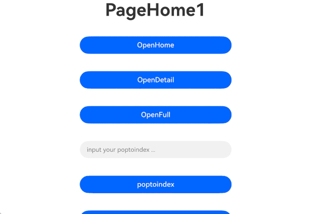
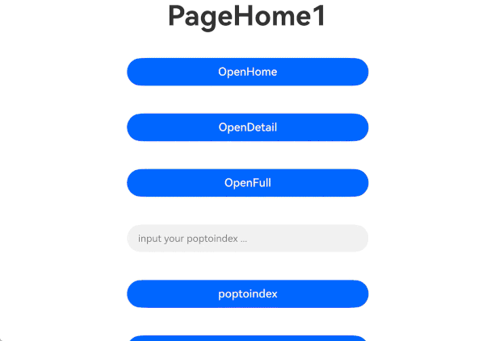

# MultiNavigation

**MultiNavigation** is a component designed for multi-column display and routing navigation on large-screen devices.

> **NOTE**
>
> This component is supported since API version 14. Updates will be marked with a superscript to indicate their earliest API version.
>
> Due to the nested stack structure of **MultiNavigation**, calling APIs explicitly stated as unsupported in this document or APIs not listed in the supported API list (such as **getParent**, **setInterception**, and **pushDestination**) may lead to unpredictable issues.
>
> In scenarios with deep nesting, **MultiNavigation** may encounter routing animation issues.

## Modules to Import

```
import { MultiNavigation, MultiNavPathStack, SplitPolicy } from '@kit.ArkUI';
```

## Child Components

Not supported

## MultiNavigation

MultiNavigation({navDestination: navDestination, multiStack: MultiNavPathStack, onNavigationModeChange?: OnNavigationModeChangeCallback, onHomeShowOnTop?: OnHomeShowOnTopCallback})

Creates and initializes a **MultiNavigation** component.

The **MultiNavigation** component follows the default left-to-right stack clearing rule. This means that a click from the home page on the left triggers the loading of the detail page and simultaneously clears all other detail pages on the right, ensuring that only the most recently loaded detail page is displayed on the right. However, if a detail page loading operation is performed again on the right detail page, the system will not perform the stack clearing action. For visual reference, see [Home-to-Detail Page Transition Demo](#example).

**Decorator**: @Component

**Atomic service API**: This API can be used in atomic services since API version 14.

**System capability**: SystemCapability.ArkUI.ArkUI.Full

|   Name  |          Type         | Mandatory | Decorator| Description|
|:---------:|:----------------------:|-----| ------ |-----------|
| multiStack | [MultiNavPathStack](#multinavpathstack) | Yes  | @State | Navigation stack.|
| navDestination | [NavDestinationBuildFunction](#navdestinationbuildfunction) | Yes| @BuilderParam | Routing rules for loading the target page.|
| onNavigationModeChange | [OnNavigationModeChangeCallback](#onnavigationmodechangecallback) | No| - | Callback invoked when the mode of the **MultiNavigation** component changes.|
| onHomeShowOnTop | [OnHomeShowOnTopCallback](#onhomeshowontopcallback) | No| - | Callback invoked when the home page is on the top of the navigation stack.|

## MultiNavPathStack

Implements a navigation stack of the **MultiNavigation** component. Currently, this stack can be created only by the user and cannot be obtained through callbacks. Do not use events or APIs such as **onReady** of **NavDestination** to obtain the navigation stack and perform stack operations, as this may lead to unpredictable issues.

### constructor

constructor()

**Atomic service API**: This API can be used in atomic services since API version 14.

**System capability**: SystemCapability.ArkUI.ArkUI.Full

### pushPath

pushPath(info: NavPathInfo, animated?: boolean, policy?: SplitPolicy): void

Pushes the specified navigation destination page to the navigation stack.

**Atomic service API**: This API can be used in atomic services since API version 14.

**System capability**: SystemCapability.ArkUI.ArkUI.Full

**Parameters**

|  Name  |                             Type                            | Mandatory| Description                                      |
| :------: | :----------------------------------------------------------: | :--: | ----------------------------------------- |
|   info   | [NavPathInfo](./ts-basic-components-navigation.md#navpathinfo10) |  Yes | Information about the navigation destination page.               |
| animated |                           boolean                            |  No | Whether to support the transition animation.<br>Default value: **true**.<br>**true**: The transition animation is supported.<br>**false**: The transition animation is not supported.         |
|  policy  |               [SplitPolicy](#splitpolicy)                |  No | Policy for the current page being pushed. Default value: **DETAIL_PAGE**.|

### pushPath

pushPath(info: NavPathInfo, options?: NavigationOptions, policy?: SplitPolicy): void

Pushes the specified navigation destination page to the navigation stack, with stack operation settings through **NavigationOptions**.

**Atomic service API**: This API can be used in atomic services since API version 14.

**System capability**: SystemCapability.ArkUI.ArkUI.Full

**Parameters**

|  Name  |                             Type                            | Mandatory| Description                                      |
| :-----: | :----------------------------------------------------------: | :--: | ------------------------------------------ |
|  info   | [NavPathInfo](./ts-basic-components-navigation.md#navpathinfo10) |  Yes | Information about the navigation destination page.                |
| options | [NavigationOptions](./ts-basic-components-navigation.md#navigationoptions12) |  No | Stack operation settings. Only the **animated** field is supported.|
| policy  |               [SplitPolicy](#splitpolicy)                |  No | Policy for the current page being pushed. Default value: **DETAIL_PAGE**.   |

### pushPathByName

pushPathByName(name: string, param: Object, animated?: boolean, policy?: SplitPolicy): void

Pushes the navigation destination page specified by **name** to the navigation stack, passing the data specified by **param**.

**Atomic service API**: This API can be used in atomic services since API version 14.

**System capability**: SystemCapability.ArkUI.ArkUI.Full

**Parameters**

|  Name  |             Type             | Mandatory| Description          |
|:---------------------:|:------------:|:------:| --------------------- |
|         name          |    string    |   Yes   | Name of the navigation destination page.  |
|         param         |   Object    |   Yes   | Detailed parameters of the navigation destination page.|
|       animated        |   boolean    |   No   | Whether to support the transition animation.<br>Default value: **true**.<br>**true**: The transition animation is supported.<br>**false**: The transition animation is not supported.|
|        policy         | [SplitPolicy](#splitpolicy)  |   No   | Policy for the current page being pushed. Default value: **DETAIL_PAGE**.      |

### pushPathByName

pushPathByName(name: string, param: Object, onPop?: base.Callback\<PopInfo>, animated?: boolean, policy?: SplitPolicy): void

Pushes the navigation destination page specified by **name** to the navigation stack, passing the data specified by **param**. This API uses the **onPop** callback to handle the result returned when the page is popped out of the stack.

**Atomic service API**: This API can be used in atomic services since API version 14.

**System capability**: SystemCapability.ArkUI.ArkUI.Full

**Parameters**

|  Name  |             Type               | Mandatory| Description          |
|:---------:|:-------------------------------------------------------------:|:------:|------|
|   name    |                            string                             |   Yes   | Name of the navigation destination page.  |
|   param   |                            Object                             |   Yes   | Detailed parameters of the navigation destination page.|
|   onPop   | base.[Callback](../../apis-basic-services-kit/js-apis-base.md#callback)\<[PopInfo](ts-basic-components-navigation.md#popinfo11)>  |   No   | Callback used to handle the return result.|
| animated  |                            boolean                            |   No   | Whether to support the transition animation.<br>Default value: **true**.<br>**true**: The transition animation is supported.<br>**false**: The transition animation is not supported.|
|  policy   |                          [SplitPolicy](#splitpolicy)                          |   No   | Policy for the current page being pushed. Default value: **DETAIL_PAGE**.      |

### replacePath

replacePath(info: NavPathInfo, animated?: boolean): void

Replaces the current top page on the stack with the specified navigation destination page. The new page inherits the split policy of the original top page.

**Atomic service API**: This API can be used in atomic services since API version 14.

**System capability**: SystemCapability.ArkUI.ArkUI.Full

**Parameters**

|  Name  |             Type               | Mandatory| Description          |
| :------: | :----------------------------------------------------------: | :--: | -------------------------------- |
|   info   | [NavPathInfo](./ts-basic-components-navigation.md#navpathinfo10) |  Yes | Information about the navigation destination page.      |
| animated |                           boolean                            |  No | Whether to support the transition animation.<br>Default value: **true**.<br>**true**: The transition animation is supported.<br>**false**: The transition animation is not supported.|

### replacePath

replacePath(info: NavPathInfo, options?: NavigationOptions): void

Replaces the current top page on the stack with the specified navigation destination page, with stack operation settings through **NavigationOptions**. The new page inherits the split policy of the original top page.

**Atomic service API**: This API can be used in atomic services since API version 14.

**System capability**: SystemCapability.ArkUI.ArkUI.Full

**Parameters**

|  Name  |             Type               | Mandatory| Description          |
| :-----: | :----------------------------------------------------------: | :--: | ------------------------------------------ |
|  info   | [NavPathInfo](./ts-basic-components-navigation.md#navpathinfo10) |  Yes | Information about the navigation destination page.                |
| options | [NavigationOptions](./ts-basic-components-navigation.md#navigationoptions12) |  No | Stack operation settings. Only the **animated** field is supported.|

### replacePathByName

replacePathByName(name: string, param: Object, animated?: boolean): void

Replaces the current top page on the stack with the navigation destination page specified by **name**. The new page inherits the split policy of the original top page.

**Atomic service API**: This API can be used in atomic services since API version 14.

**System capability**: SystemCapability.ArkUI.ArkUI.Full

**Parameters**

|  Name  |             Type               | Mandatory| Description          |
|:--------:|:---------:|:------:|----------------------|
|   name   |  string   |   Yes   | Name of the navigation destination page. |
|  param   |  Object   |   Yes   | Detailed parameters of the navigation destination page.|
| animated |  boolean  |   No   | Whether to support the transition animation.<br>Default value: **true**.<br>**true**: The transition animation is supported.<br>**false**: The transition animation is not supported.  |

### removeByIndexes

removeByIndexes(indexes: Array<number\>): number

Removes the navigation destination pages specified by **indexes** from the navigation stack.

**Atomic service API**: This API can be used in atomic services since API version 14.

**System capability**: SystemCapability.ArkUI.ArkUI.Full

**Parameters**

|  Name  |             Type               | Mandatory| Description          |
|:--------:|:---------------:|:------:| --------------------- |
| indexes  | Array<number\>  |   Yes   | Array of indexes of the navigation destination pages to remove.<br>Value range of the number type: [0, +∞).|

**Return value**

|      Type      | Description                      |
|:-------------:| ------------------------ |
|    number     | Number of the navigation destination pages removed.|

### removeByName

removeByName(name: string): number

Removes the navigation destination page specified by **name** from the navigation stack.

**Atomic service API**: This API can be used in atomic services since API version 14.

**System capability**: SystemCapability.ArkUI.ArkUI.Full

**Parameters**

|  Name  |             Type               | Mandatory| Description          |
|:-------:| ------- | ---- | --------------------- |
|  name   | string  | Yes   | Name of the navigation destination page to be removed.|

**Return value**

|      Type      | Description                      |
|:-------------:| ------------------------ |
|    number     | Number of the navigation destination pages removed.|

### pop

pop(animated?: boolean): NavPathInfo | undefined

Pops the top element out of the navigation stack.

> **NOTE**
>
> If [keepBottomPage](#keepbottompage) is called with **true**, the bottom page of the navigation stack is retained.

**Atomic service API**: This API can be used in atomic services since API version 14.

**System capability**: SystemCapability.ArkUI.ArkUI.Full

**Parameters**

|  Name  |             Type               | Mandatory| Description          |
|:-----------:|:--------:|:------:| -------------------- |
|  animated   | boolean  |   No   | Whether to support the transition animation.<br>Default value: **true**.<br>**true**: The transition animation is supported.<br>**false**: The transition animation is not supported.|

**Return value**

| Type         | Description                      |
| ----------- | ------------------------ |
| [NavPathInfo](./ts-basic-components-navigation.md#navpathinfo10) \| undefined | Information about the navigation destination page at the top of the stack.|

### pop

pop(result?: Object, animated?: boolean): NavPathInfo | undefined

Pops the top element out of the navigation stack and invokes the **onPop** callback to pass the page processing result.

> **NOTE**
>
> If [keepBottomPage](#keepbottompage) is called with **true**, the bottom page of the navigation stack is retained.

**Atomic service API**: This API can be used in atomic services since API version 14.

**System capability**: SystemCapability.ArkUI.ArkUI.Full

**Parameters**

|  Name  |             Type               | Mandatory| Description          |
|:---------:|:-------------------------------:|:------:| -------------------- |
|  result   |             Object              |   No   | Custom processing result on the page.|
| animated  |             boolean             |   No   | Whether to support the transition animation.<br>Default value: **true**.<br>**true**: The transition animation is supported.<br>**false**: The transition animation is not supported.|

**Return value**

| Type         | Description                      |
| ----------- | ------------------------ |
| [NavPathInfo](./ts-basic-components-navigation.md#navpathinfo10) \| undefined | Information about the navigation destination page at the top of the stack.|

### popToName

popToName(name: string, animated?: boolean): number

Pops pages until the first navigation destination page that matches **name** from the bottom of the navigation stack is at the top of the stack.

**Atomic service API**: This API can be used in atomic services since API version 14.

**System capability**: SystemCapability.ArkUI.ArkUI.Full

**Parameters**

|  Name  |             Type               | Mandatory| Description          |
|:----------:|:--------:|:------:| ------------------- |
|    name    |  string  |   Yes   | Name of the navigation destination page.|
|  animated  | boolean  |   No   | Whether to support the transition animation.<br>Default value: **true**.<br>**true**: The transition animation is supported.<br>**false**: The transition animation is not supported.|

**Return value**

| Type    | Description                                      |
| ------ | ---------------------------------------- |
| number | Returns the index of the first navigation destination page that matches **name** from the bottom of the navigation stack; returns **-1** if no such a page is found.<br>Value range: [-1, +∞).|

### popToName

popToName(name: string, result: Object, animated?: boolean): number

Pops pages until the first navigation destination page that matches **name** from the bottom of the navigation stack is at the top of the stack. This API uses the **onPop** callback to pass in the page processing result.

**Atomic service API**: This API can be used in atomic services since API version 14.

**System capability**: SystemCapability.ArkUI.ArkUI.Full

**Parameters**

|  Name  |             Type               | Mandatory| Description          |
|:---------:|:--------:|:------:| ------------------- |
|   name    |  string  |   Yes   | Name of the navigation destination page.|
|  result   |  Object  |   Yes   | Custom processing result on the page.|
| animated  | boolean  |   No   | Whether to support the transition animation.<br>Default value: **true**.<br>**true**: The transition animation is supported.<br>**false**: The transition animation is not supported.|

**Return value**

| Type    | Description                                      |
| ------ | ---------------------------------------- |
| number | Returns the index of the first navigation destination page that matches **name** from the bottom of the navigation stack; returns **-1** if no such a page is found.|

### popToIndex

popToIndex(index: number, animated?: boolean): void

Returns the navigation stack to the page specified by **index**.

**Atomic service API**: This API can be used in atomic services since API version 14.

**System capability**: SystemCapability.ArkUI.ArkUI.Full

**Parameters**

|  Name  |             Type               | Mandatory| Description          |
|:------------:|:--------:|:------:| ---------------------- |
|    index     |  number  |   Yes   | Index of the navigation destination page.<br>Value range: [0, +∞).|
|   animated   | boolean  |   No   | Whether to support the transition animation.<br>Default value: **true**.<br>**true**: The transition animation is supported.<br>**false**: The transition animation is not supported.|

### popToIndex

popToIndex(index: number, result: Object, animated?: boolean): void

Returns the navigation stack to the page specified by **index** and invokes the **onPop** callback to pass the page processing result.

**Atomic service API**: This API can be used in atomic services since API version 14.

**System capability**: SystemCapability.ArkUI.ArkUI.Full

**Parameters**

|  Name  |             Type               | Mandatory| Description          |
| ----- | ------ | ---- | ---------------------- |
| index | number | Yes   | Index of the navigation destination page.|
| result | Object | Yes| Custom processing result on the page.|
| animated | boolean | No   | Whether to support the transition animation.<br>Default value: **true**.<br>**true**: The transition animation is supported.<br>**false**: The transition animation is not supported.|

### moveToTop

moveToTop(name: string, animated?: boolean): number

Moves the first navigation destination page that matches **name** from the bottom of the navigation stack to the top of the stack.

> **NOTE**
>
> Depending on the type of page found, **MultiNavigation** performs different actions:
> 
> 1. If the found page is the topmost home page or a full-screen page, no action is taken.
> 
> 2. If the found page is a detail page corresponding to the topmost home page, it is moved to the top.
> 
> 3. If the found page is a non-topmost home page, the home page and all corresponding detail pages are moved to the top, maintaining their relative stack order.
> 
> 4. If the found page is a non-topmost detail page, the home page and all corresponding detail pages are moved to the top, and the target detail page is moved to the top of the corresponding detail pages.
> 
> 5. If the found page is a non-topmost full-screen page, it is moved to the top.

**Atomic service API**: This API can be used in atomic services since API version 14.

**System capability**: SystemCapability.ArkUI.ArkUI.Full

**Parameters**

|  Name  |             Type               | Mandatory| Description          |
|:---------:|:--------:|:------:| ------------------- |
|   name    |  string  |   Yes   | Name of the navigation destination page.|
| animated  | boolean  |   No   | Whether to support the transition animation.<br>Default value: **true**.<br>**true**: The transition animation is supported.<br>**false**: The transition animation is not supported.|

**Return value**

|    Type   |                                      Description                                     |
|:--------:|:----------------------------------------------------------------------------:|
|  number  | Returns the index of the first navigation destination page that matches **name** from the bottom of the navigation stack; returns **-1** if no such a page is found. |

### moveIndexToTop

moveIndexToTop(index: number, animated?: boolean): void

Moves the navigation destination page specified by **index** to the top of the navigation stack.

> **NOTE**
>
> Depending on the type of page found, **MultiNavigation** performs different actions:
> 
> 1. If the found page is the topmost home page or a full-screen page, no action is taken.
> 
> 2. If the found page is a detail page corresponding to the topmost home page, it is moved to the top.
> 
> 3. If the found page is a non-topmost home page, the home page and all corresponding detail pages are moved to the top, maintaining their relative stack order.
> 
> 4. If the found page is a non-topmost detail page, the home page and all corresponding detail pages are moved to the top, and the target detail page is moved to the top of the corresponding detail pages.
> 
> 5. If the found page is a non-topmost full-screen page, it is moved to the top.

**Atomic service API**: This API can be used in atomic services since API version 14.

**System capability**: SystemCapability.ArkUI.ArkUI.Full

**Parameters**

|  Name  |             Type               | Mandatory| Description          |
|:---------:|:-------:|:------:| ------------------- |
|   index    | number  |   Yes   | Index of the navigation destination page.<br>Value range: [0, +∞).|
| animated  | boolean |   No   | Whether to support the transition animation.<br>Default value: **true**.<br>**true**: The transition animation is supported.<br>**false**: The transition animation is not supported.|

### clear

clear(animated?: boolean): void

Clears the navigation stack.

> **NOTE**
> 
> If [keepBottomPage](#keepbottompage) is called with **true**, the bottom page of the navigation stack is retained.

**Atomic service API**: This API can be used in atomic services since API version 14.

**System capability**: SystemCapability.ArkUI.ArkUI.Full

**Parameters**

|  Name  |             Type               | Mandatory| Description          |
|:---------:|:--------:|:------:| ---------------------- |
| animated  | boolean  |   No   | Whether to support the transition animation.<br>Default value: **true**.<br>**true**: The transition animation is supported.<br>**false**: The transition animation is not supported.|

### getAllPathName

getAllPathName(): Array<string\>

Obtains the names of all navigation destination pages in the navigation stack.

**Atomic service API**: This API can be used in atomic services since API version 14.

**System capability**: SystemCapability.ArkUI.ArkUI.Full

**Return value**

|        Type       | Description                        |
|:----------------:| -------------------------- |
|  Array<string\>  | Names of all navigation destination pages in the navigation stack.|

### getParamByIndex

getParamByIndex(index: number): Object | undefined

Obtains the parameter information of the navigation destination page specified by **index**.

**Atomic service API**: This API can be used in atomic services since API version 14.

**System capability**: SystemCapability.ArkUI.ArkUI.Full

**Parameters**

|  Name  |             Type               | Mandatory| Description          |
|:-------:|:--------:|:------:| ---------------------- |
|  index  |  number  |   Yes   | Index of the navigation destination page.<br>Value range: [0, +∞).|

**Return value**

| Type       | Description                        |
| --------- | -------------------------- |
| Object   | Parameter information of the matching navigation destination page.|
| undefined   | Returned if the provided index is invalid.|

### getParamByName

getParamByName(name: string): Array<Object\>

Obtains the parameter information of all the navigation destination pages that match **name**.

**Atomic service API**: This API can be used in atomic services since API version 14.

**System capability**: SystemCapability.ArkUI.ArkUI.Full

**Parameters**

|  Name  |             Type               | Mandatory| Description          |
|:------:|:--------:|:------:| ------------------- |
|  name  |  string  |   Yes   | Name of the navigation destination page.|

**Return value**

| Type             | Description                               |
| --------------- | --------------------------------- |
| Array<Object\> | Parameter information of all the matching navigation destination pages.|

### getIndexByName

getIndexByName(name: string): Array<number\>

Obtains the indexes of all the navigation destination pages that match **name**.

**Atomic service API**: This API can be used in atomic services since API version 14.

**System capability**: SystemCapability.ArkUI.ArkUI.Full

**Parameters**

|  Name  |             Type               | Mandatory| Description          |
|:------:|:--------:|:------:| ------------------- |
|  name  |  string  |   Yes   | Name of the navigation destination page.|

**Return value**

| Type            | Description                               |
| -------------- | --------------------------------- |
| Array<number\> | Indexes of all the matching navigation destination pages.<br>Value range of the number type: [0, +∞).|

### size

size(): number

Obtains the stack size.

**Atomic service API**: This API can be used in atomic services since API version 14.

**System capability**: SystemCapability.ArkUI.ArkUI.Full

**Return value**

| Type    | Description    |
| ------ | ------ |
| number | Stack size.<br>Value range: [0, +∞).|

### disableAnimation

disableAnimation(disable: boolean): void

Disables or enables the transition animation in the **MultiNavigation** component.

**Atomic service API**: This API can be used in atomic services since API version 14.

**System capability**: SystemCapability.ArkUI.ArkUI.Full

**Parameters**

|  Name  |             Type               | Mandatory| Description          |
| ----- | ------ | ---- | ---------------------- |
| disable | boolean | Yes   | Whether to disable the transition animation.<br>Default value: **false**.<br>**true**:The transition animation is disabled.<br>**false**: The transition animation is not disabled.|

### switchFullScreenState

switchFullScreenState(isFullScreen?: boolean): boolean

Switches the display mode of the current top detail page in the stack. The value **true** means to enable full-screen mode, and **false** means to enable split-screen mode.

**Atomic service API**: This API can be used in atomic services since API version 14.

**System capability**: SystemCapability.ArkUI.ArkUI.Full

**Parameters**

|  Name  |             Type               | Mandatory| Description          |
| :----------: | :-----: | :--: | ----------------------------------------------------- |
| isFullScreen | boolean |  No | Whether to enable full-screen mode. The value **true** means to enable full-screen mode, and **false** means to enable split-screen mode.|

**Return value**

|    Type   |     Description    |
|:--------:|:----------:|
| boolean  |  Whether the switching is successful.<br>**true**: The switching is successful.<br>**false**: The switching failed. |

### setHomeWidthRange

setHomeWidthRange(minPercent: number, maxPercent: number): void

Sets the draggable range for the home page width. If not set, the width defaults to 50% and is not draggable.

**Atomic service API**: This API can be used in atomic services since API version 14.

**System capability**: SystemCapability.ArkUI.ArkUI.Full

**Parameters**

|  Name  |             Type               | Mandatory| Description          |
|:-------------:|:--------:|:-----:|-------------------|
| minPercent  | number  |   Yes  | Minimum width percentage of the home page.|
| maxPercent  | number  |   Yes  | Maximum width percentage of the home page.|

### keepBottomPage

keepBottomPage(keepBottom: boolean): void

Sets whether to retain the bottom page when the **pop** or **clear** APIs is called.

> **NOTE**
>
> **MultiNavigation** treats the home page as a navigation destination page in the stack. By default, calling **pop** or **clea**r will also remove the bottom page.
> If this API is called with **TRUE**, **MultiNavigation** will retain the bottom page when the **pop** or **clear** API is called.

**Atomic service API**: This API can be used in atomic services since API version 14.

**System capability**: SystemCapability.ArkUI.ArkUI.Full

**Parameters**

|  Name  |             Type               | Mandatory| Description          |
|:-------------:|:--------:|:-----:|--------------------|
| keepBottom  | boolean  |   Yes  | Whether to retain the bottom page.<br>Default value: **false**.<br>**true**: The bottom page is retained.<br>**false**: The bottom page is not retained.|

### setPlaceholderPage

setPlaceholderPage(info: NavPathInfo): void

Sets a placeholder page.

> **NOTE**
>
> The placeholder page is a special page type. When set, it forms a default split-screen effect with the home page on some large-screen devices, that is, the left side is the home page, and the right side is the placeholder page.
> 
> In scenarios where the application's drawable area is less than 600 vp, or when a foldable screen switches from the expanded state to the folded state, or when a tablet switches from landscape to portrait mode, the placeholder page will be automatically removed, resulting in only the home page being shown.
> Conversely, when the application's drawable area is greater than or equal to 600 vp, or when a foldable screen switches from the folded state to the expanded state, or when a tablet switches from portrait to landscape mode, the placeholder page will be automatically added to form a split-screen.

**Atomic service API**: This API can be used in atomic services since API version 14.

**System capability**: SystemCapability.ArkUI.ArkUI.Full

**Parameters**

|  Name  |        Type       | Mandatory| Description        |
|:-------------:|:--------:|:-----:|----------|
| info  | NavPathInfo  |   Yes  | Information about the placeholder page.|

## SplitPolicy

Enumerates the types of pages in **MultiNavigation**.

**Atomic service API**: This API can be used in atomic services since API version 14.

**System capability**: SystemCapability.ArkUI.ArkUI.Full

|       Name       |  Value|  Description          |
| :---------------: | :-: | :-------------: |
|     HOME_PAGE     |  0  | Home page. Displayed in full-screen mode. |
|    DETAIL_PAGE    |  1  | Detail page. Displayed in split-screen mode.|
|     FULL_PAGE     |  2  | Full-screen page. Displayed in full-screen mode.|

## NavDestinationBuildFunction

type NavDestinationBuildFunction = (name: string, param?: object) => void

Represents the function used by the **MultiNavigation** component to load navigation destination pages.

**Atomic service API**: This API can be used in atomic services since API version 14.

**System capability**: SystemCapability.ArkUI.ArkUI.Full

| Name| Type| Mandatory| Description|
| --------------- | ------ |------ |------ |
|name | string |Yes| ID of the navigation destination page.|
| param | object | No| Parameters passed when the page is created during navigation.|

## OnNavigationModeChangeCallback

type OnNavigationModeChangeCallback = (mode: NavigationMode) => void

Represents the callback invoked when the mode of the **MultiNavigation** component changes.

**Atomic service API**: This API can be used in atomic services since API version 14.

**System capability**: SystemCapability.ArkUI.ArkUI.Full

| Name| Type                                                        | Mandatory| Description                          |
| ---- | ------------------------------------------------------------ | ---- | ------------------------------ |
| mode | [NavigationMode](./ts-basic-components-navigation.md#navigationmode9) | Yes  | Navigation mode when the callback is invoked.|

## OnHomeShowOnTopCallback

type OnHomeShowOnTopCallback = (name: string) => void

Represents the callback invoked when the home page is displayed at the top of the stack.

**Atomic service API**: This API can be used in atomic services since API version 14.

**System capability**: SystemCapability.ArkUI.ArkUI.Full

| Name| Type  | Mandatory| Description                      |
| ---- | ------ | ---- | -------------------------- |
| name | string | Yes  | ID of the page displayed at the top of the stack.|

## Attributes

The [universal attributes](ts-component-general-attributes.md) are not supported.

## Events

The [universal events](ts-component-general-events.md) are not supported.

## Example

This example demonstrates the basic usage of **MultiNavigation**.

<!--code_no_check-->
```typescript
// pages/Index.ets
import { MultiNavigation, MultiNavPathStack, SplitPolicy } from '@ohos.arkui.advanced.MultiNavigation';
import { PageDetail1 } from './PageDetail1';
import { PageDetail2 } from './PageDetail2';
import { PageFull1 } from './PageFull1';
import { PageHome1 } from './PageHome1';
import { PagePlaceholder } from './PagePlaceholder';

@Entry
@Component
struct Index {
  @Provide('pageStack') pageStack: MultiNavPathStack = new MultiNavPathStack();

  @Builder
  PageMap(name: string, param?: object) {
    if (name === 'PageHome1') {
      PageHome1({ param: param });
    } else if (name === 'PageDetail1') {
      PageDetail1({ param: param });
    } else if (name === 'PageDetail2') {
      PageDetail2({ param: param });
    } else if (name === 'PageFull1') {
      PageFull1();
    } else if (name === 'PagePlaceholder') {
      PagePlaceholder();
    }
  }

  aboutToAppear(): void {
    this.pageStack.pushPathByName('PageHome1', 'paramTest', false, SplitPolicy.HOME_PAGE);
  }

  build() {
    Column() {
      Row() {
        MultiNavigation({ navDestination: this.PageMap, multiStack: this.pageStack })
      }
      .width('100%')
    }
  }
}
```
<!--code_no_check-->
```typescript
// pages/PageHome1.ets, corresponding to the home page
import { MultiNavPathStack, SplitPolicy } from '@ohos.arkui.advanced.MultiNavigation';
import { hilog } from '@kit.PerformanceAnalysisKit';

@Component
export struct PageHome1 {
  @State message: string = 'PageHome1';
  @Consume('pageStack') pageStack: MultiNavPathStack;
  controller: TextInputController = new TextInputController();
  text: String = '';
  index: number = 0;
  param: Object = new Object();
  lastBackTime: number = 0;

  build() {
    if (this.log()) {
      NavDestination() {
        Column() {
          Column() {
            Text(this.message)
              .fontSize(40)
              .fontWeight(FontWeight.Bold)
          }
          .width('100%')
          .height('8%')
          Scroll(){
            Column() {
              Button('OpenHome', { stateEffect: true, type: ButtonType.Capsule})
                .width('50%')
                .height(40)
                .margin(20)
                .onClick(() => {
                  if (this.pageStack !== undefined && this.pageStack !== null) {
                    // Navigate to the PageHome1 page.
                    this.pageStack.pushPathByName('PageHome1', 'testParam', true, SplitPolicy.HOME_PAGE);
                    this.index++;
                  }
                })
              Button('OpenDetail', { stateEffect: true, type: ButtonType.Capsule})
                .width('50%')
                .height(40)
                .margin(20)
                .onClick(() => {
                  if (this.pageStack !== undefined && this.pageStack !== null) {
                    // Navigate to the PageDetail1 page.
                    this.pageStack.pushPathByName('PageDetail1', 'testParam');
                    this.index++;
                  }
                })
              Button('OpenFull', { stateEffect: true, type: ButtonType.Capsule})
                .width('50%')
                .height(40)
                .margin(20)
                .onClick(() => {
                  if (this.pageStack !== undefined && this.pageStack !== null) {
                    // Navigate to the PageFull1 page.
                    this.pageStack.pushPathByName('PageFull1', 'testParam', true, SplitPolicy.FULL_PAGE);
                  }
                })
              TextInput({placeholder: 'input your poptoindex ...', controller: this.controller })
                .placeholderColor(Color.Grey)
                .placeholderFont({ size: 14, weight: 400 })
                .caretColor(Color.Blue)
                .width('50%')
                .height(40)
                .margin(20)
                .type(InputType.Number)
                .fontSize(14)
                .fontColor(Color.Black)
                .onChange((value: String) => {
                  this.text = value;
                })
              Button('poptoindex', { stateEffect: true, type: ButtonType.Capsule})
                .width('50%')
                .height(40)
                .margin(20)
                .onClick(() => {
                  if (this.pageStack !== undefined && this.pageStack !== null) {
                    // Return to the page with the specified index and remove all pages with a higher index.
                    this.pageStack.popToIndex(Number(this.text));
                    this.controller.caretPosition(1);
                  }
                })
              Button('OpenDetailWithName', { stateEffect: true, type: ButtonType.Capsule})
                .width('50%')
                .height(40)
                .margin(20)
                .onClick(() => {
                  if (this.pageStack !== undefined && this.pageStack !== null) {
                    // Navigate to the PageDetail1 page.
                    this.pageStack.pushPathByName('PageDetail1', 'testParam', undefined, true);
                  }
                })
              Button('pop', { stateEffect: true, type: ButtonType.Capsule})
                .width('50%')
                .height(40)
                .margin(20)
                .onClick(() => {
                  if (this.pageStack !== undefined && this.pageStack !== null) {
                    this.pageStack.pop();
                  }
                })
              Button('moveToTopByName: PageDetail1', { stateEffect: true, type: ButtonType.Capsule})
                .width('50%')
                .height(40)
                .margin(10)
                .onClick(() => {
                  if (this.pageStack !== undefined && this.pageStack !== null) {
                    // Move the PageDetail1 page to the top of the stack.
                    let indexFound = this.pageStack.moveToTop('PageDetail1');
                    hilog.info(0x0000, 'demoTest', 'moveToTopByName,indexFound:' + indexFound);
                  }
                })
              Button('removeByName HOME', { stateEffect: true, type: ButtonType.Capsule})
                .width('50%')
                .height(40)
                .margin(20)
                .onClick(() => {
                  if (this.pageStack !== undefined && this.pageStack !== null) {
                    // Remove the page named PageHome1.
                    this.pageStack.removeByName('PageHome1');
                  }
                })
              Button('removeByIndexes 0135', { stateEffect: true, type: ButtonType.Capsule})
                .width('50%')
                .height(40)
                .margin(20)
                .onClick(() => {
                  if (this.pageStack !== undefined && this.pageStack !== null) {
                    // Remove pages with indexes 0, 1, 3, and 5 from the stack.
                    this.pageStack.removeByIndexes([0,1,3,5]);
                  }
                })
              Button('getAllPathName', { stateEffect: true, type: ButtonType.Capsule})
                .width('50%')
                .height(40)
                .margin(20)
                .onClick(() => {
                  if (this.pageStack !== undefined && this.pageStack !== null) {
                    let result = this.pageStack.getAllPathName();
                    hilog.info(0x0000, 'demotest', 'getAllPathName: ' + result.toString());
                  }
                })
              Button('getParamByIndex0', { stateEffect: true, type: ButtonType.Capsule})
                .width('50%')
                .height(40)
                .margin(20)
                .onClick(() => {
                  if (this.pageStack !== undefined && this.pageStack !== null) {
                    // Obtain the parameters of the page with index 0.
                    let result = this.pageStack.getParamByIndex(0);
                    hilog.info(0x0000, 'demotest', 'getParamByIndex: ' + result);
                  }
                })
              Button('getParamByNameHomePage', { stateEffect: true, type: ButtonType.Capsule})
                .width('50%')
                .height(40)
                .margin(20)
                .onClick(() => {
                  if (this.pageStack !== undefined && this.pageStack !== null) {
                    // Obtain the parameters of the page named PageHome1.
                    let result = this.pageStack.getParamByName('PageHome1');
                    hilog.info(0x0000, 'demotest', 'getParamByName: ' + result.toString());
                  }
                })
              Button('getIndexByNameHomePage', { stateEffect: true, type: ButtonType.Capsule})
                .width('50%')
                .height(40)
                .margin(20)
                .onClick(() => {
                  if (this.pageStack !== undefined && this.pageStack !== null) {
                    // Obtain the index of the page named PageHome1.
                    let result = this.pageStack.getIndexByName('PageHome1');
                    hilog.info(0x0000, 'demotest', 'getIndexByName: ' + result);
                  }
                })
              Button('keepBottomPage True', { stateEffect: true, type: ButtonType.Capsule})
                .width('50%')
                .height(40)
                .margin(10)
                .onClick(() => {
                  if (this.pageStack !== undefined && this.pageStack !== null) {
                    // Set the bottom page of the stack to be unremovable.
                    this.pageStack.keepBottomPage(true);
                  }
                })
              Button('keepBottomPage False', { stateEffect: true, type: ButtonType.Capsule})
                .width('50%')
                .height(40)
                .margin(10)
                .onClick(() => {
                  if (this.pageStack !== undefined && this.pageStack !== null) {
                    // Set the bottom page of the stack to be removable.
                    this.pageStack.keepBottomPage(false);
                  }
                })
              Button('setPlaceholderPage', { stateEffect: true, type: ButtonType.Capsule})
                .width('50%')
                .height(40)
                .margin(10)
                .onClick(() => {
                  if (this.pageStack !== undefined && this.pageStack !== null) {
                    this.pageStack.setPlaceholderPage({ name: 'PagePlaceholder' });
                  }
                })
            }.backgroundColor(0xFFFFFF).width('100%').padding(10).borderRadius(15)
            }
            .width('100%')
          }
          .width('100%')
          .height('92%')
        }.hideTitleBar(true)
      }
    }

  log(): boolean {
    hilog.info(0x0000, 'demotest', 'PageHome1 build called');
    return true;
  }
}
```
<!--code_no_check-->
```typescript
// pages/PageDetail1.ets: detail page
import { MultiNavPathStack, SplitPolicy } from '@ohos.arkui.advanced.MultiNavigation';
import { hilog } from '@kit.PerformanceAnalysisKit';

@Component
export struct PageDetail1 {
  @State message: string = 'PageDetail1';
  @Consume('pageStack') pageStack: MultiNavPathStack;
  controller: TextInputController = new TextInputController();
  text: String = '';
  param: Object = new Object();

  build() {
    if (this.log()) {
      NavDestination() {
        Column() {
          Column() {
            Text(this.message)
              .fontSize(40)
              .fontWeight(FontWeight.Bold)
          }
          .height('8%')
          .width('100%')
          Scroll(){
            Column(){
              Button('OpenHome', { stateEffect: true, type: ButtonType.Capsule})
                .width('50%')
                .height(40)
                .margin(20)
                .onClick(() => {
                  if (this.pageStack !== undefined && this.pageStack !== null) {
                    // Navigate to the PageHome1 page.
                    this.pageStack.pushPathByName('PageHome1', 'testParam', true, SplitPolicy.HOME_PAGE);
                  }
                })
              Button('OpenDetail', { stateEffect: true, type: ButtonType.Capsule})
                .width('50%')
                .height(40)
                .margin(20)
                .onClick(() => {
                  if (this.pageStack !== undefined && this.pageStack !== null) {
                    // Navigate to the PageDetail1 page.
                    this.pageStack.pushPathByName('PageDetail1', 'testParam');
                  }
                })
              Button('OpenFull', { stateEffect: true, type: ButtonType.Capsule})
                .width('50%')
                .height(40)
                .margin(20)
                .onClick(() => {
                  if (this.pageStack !== undefined && this.pageStack !== null) {
                    // Navigate to the PageFull1 page.
                    this.pageStack.pushPathByName('PageFull1', 'testParam', true, SplitPolicy.FULL_PAGE);
                  }
                })
              Button('ReplaceDetail', { stateEffect: true, type: ButtonType.Capsule})
                .width('50%')
                .height(40)
                .margin(20)
                .onClick(() => {
                  if (this.pageStack !== undefined && this.pageStack !== null) {
                    // Replace the current page with the PageDetail2 page.
                    this.pageStack.replacePathByName('PageDetail2', 'testParam');
                  }
                })
              Button('removeByName PageDetail1', { stateEffect: true, type: ButtonType.Capsule})
                .width('50%')
                .height(40)
                .margin(20)
                .onClick(() => {
                  if (this.pageStack !== undefined && this.pageStack !== null) {
                    // Remove the page named PageDetail1 from the stack.
                    this.pageStack.removeByName('PageDetail1');
                  }
                })
              Button('removeByIndexes 0135', { stateEffect: true, type: ButtonType.Capsule})
                .width('50%')
                .height(40)
                .margin(20)
                .onClick(() => {
                  if (this.pageStack !== undefined && this.pageStack !== null) {
                    // Remove pages with indexes 0, 1, 3, and 5 from the stack.
                    this.pageStack.removeByIndexes([0,1,3,5]);
                  }
                })
              Button('switchFullScreenState true', { stateEffect: true, type: ButtonType.Capsule})
                .width('50%')
                .height(40)
                .margin(20)
                .onClick(() => {
                  if (this.pageStack !== undefined && this.pageStack !== null) {
                    // Set the page to full-screen mode.
                    this.pageStack.switchFullScreenState(true);
                  }
                })
              Button('switchFullScreenState false', { stateEffect: true, type: ButtonType.Capsule})
                .width('50%')
                .height(40)
                .margin(20)
                .onClick(() => {
                  if (this.pageStack !== undefined && this.pageStack !== null) {
                    // Set the page to non-full-screen mode.
                    this.pageStack.switchFullScreenState(false);
                  }
                })
              Button('pop', { stateEffect: true, type: ButtonType.Capsule})
                .width('50%')
                .height(40)
                .margin(20)
                .onClick(() => {
                  if (this.pageStack !== undefined && this.pageStack !== null) {
                    this.pageStack.pop('123');
                  }
                })
              Button('popToHome1', { stateEffect: true, type: ButtonType.Capsule})
                .width('50%')
                .height(40)
                .margin(20)
                .onClick(() => {
                  if (this.pageStack !== undefined && this.pageStack !== null) {
                    // Return to the page with the specified name and remove all other pages with a higher index.
                    this.pageStack.popToName('PageHome1');
                  }
                })
              TextInput({placeholder: 'input your poptoindex ...', controller: this.controller })
                .placeholderColor(Color.Grey)
                .placeholderFont({ size: 14, weight: 400 })
                .caretColor(Color.Blue)
                .type(InputType.Number)
                .width('50%')
                .height(40)
                .margin(20)
                .fontSize(14)
                .fontColor(Color.Black)
                .onChange((value: String) => {
                  this.text = value;
                })
              Button('poptoindex', { stateEffect: true, type: ButtonType.Capsule})
                .width('50%')
                .height(40)
                .margin(20)
                .onClick(() => {
                  if (this.pageStack !== undefined && this.pageStack !== null) {
                    // Return to the page with the specified index and remove all pages with a higher index.
                    this.pageStack.popToIndex(Number(this.text));
                    this.controller.caretPosition(1);
                  }
                })
              Button('moveIndexToTop', { stateEffect: true, type: ButtonType.Capsule})
                .width('50%')
                .height(40)
                .margin(20)
                .onClick(() => {
                  if (this.pageStack !== undefined && this.pageStack !== null) {
                    // Move the page with the specified index to the top of the stack.
                    this.pageStack.moveIndexToTop(Number(this.text));
                    this.controller.caretPosition(1);
                  }
                })
              Button('clear', { stateEffect: true, type: ButtonType.Capsule})
                .width('50%')
                .height(40)
                .margin(20)
                .onClick(() => {
                  if (this.pageStack !== undefined && this.pageStack !== null) {
                    // Clear the current route stack.
                    this.pageStack.clear();
                  }
                })
              Button('disableAnimation', { stateEffect: true, type: ButtonType.Capsule})
                .width('50%')
                .height(40)
                .margin(20)
                .onClick(() => {
                  if (this.pageStack !== undefined && this.pageStack !== null) {
                    // Disable animations for stack operations corresponding to the current stack.
                    this.pageStack.disableAnimation(true);
                  }
                })
              Button('enableAnimation', { stateEffect: true, type: ButtonType.Capsule})
                .width('50%')
                .height(40)
                .margin(20)
                .onClick(() => {
                  if (this.pageStack !== undefined && this.pageStack !== null) {
                    // Enable animations for stack operations corresponding to the current stack.
                    this.pageStack.disableAnimation(false);
                  }
                })
              Button('setHomeWidthRange(20, 80)', { stateEffect: true, type: ButtonType.Capsule})
                .width('50%')
                .height(40)
                .margin(20)
                .onClick(() => {
                  if (this.pageStack !== undefined && this.pageStack !== null) {
                    this.pageStack.setHomeWidthRange(20, 80);
                  }
                })
              Button('setHomeWidthRange(-1, 20)', { stateEffect: true, type: ButtonType.Capsule})
                .width('50%')
                .height(40)
                .margin(20)
                .onClick(() => {
                  if (this.pageStack !== undefined && this.pageStack !== null) {
                    this.pageStack.setHomeWidthRange(-1, 20);
                  }
                })
              Button('setHomeWidthRange(20, 120)', { stateEffect: true, type: ButtonType.Capsule})
                .width('50%')
                .height(40)
                .margin(20)
                .onClick(() => {
                  if (this.pageStack !== undefined && this.pageStack !== null) {
                    this.pageStack.setHomeWidthRange(20, 120);
                  }
                })
            }
            .width('100%')
          }
          .width('100%')
          .height('92%')
        }
      }.hideTitleBar(true)
    }
  }

  log(): boolean {
    hilog.info(0x0000, 'demotest', 'PageDetail1 build called');
    return true;
  }
}
```
<!--code_no_check-->
```typescript
// pages/PageDetail2.ets: detail page
import { MultiNavPathStack, SplitPolicy } from '@ohos.arkui.advanced.MultiNavigation';
import { hilog } from '@kit.PerformanceAnalysisKit';

@Component
export struct PageDetail2 {
  @State message: string = 'PageDetail2';
  @Consume('pageStack') pageStack: MultiNavPathStack;
  controller: TextInputController = new TextInputController();
  text: String = '';
  param: Object = new Object();

  build() {
    if (this.log()) {
      NavDestination() {
        Column() {
          Column() {
            Text(this.message)
              .fontSize(40)
              .fontWeight(FontWeight.Bold)
          }
          .width('100%')
          .height('8%')
          Scroll(){
            Column() {
              Button('OpenHome', { stateEffect: true, type: ButtonType.Capsule})
                .width('50%')
                .height(40)
                .margin(20)
                .onClick(() => {
                  if (this.pageStack !== undefined && this.pageStack !== null) {
                    // Navigate to the PageHome1 page.
                    this.pageStack.pushPathByName('PageHome1', 'testParam', true, SplitPolicy.HOME_PAGE);
                  }
                })
              Button('OpenDetail', { stateEffect: true, type: ButtonType.Capsule})
                .width('50%')
                .height(40)
                .margin(20)
                .onClick(() => {
                  if (this.pageStack !== undefined && this.pageStack !== null) {
                    // Navigate to the PageDetail1 page.
                    this.pageStack.pushPathByName('PageDetail1', 'testParam');
                  }
                })
              Button('OpenFull', { stateEffect: true, type: ButtonType.Capsule})
                .width('50%')
                .height(40)
                .margin(20)
                .onClick(() => {
                  if (this.pageStack !== undefined && this.pageStack !== null) {
                    // Navigate to the PageFull1 page.
                    this.pageStack.pushPathByName('PageFull1', 'testParam', true, SplitPolicy.FULL_PAGE);
                  }
                })
              Button('ReplaceDetail', { stateEffect: true, type: ButtonType.Capsule})
                .width('50%')
                .height(40)
                .margin(20)
                .onClick(() => {
                  if (this.pageStack !== undefined && this.pageStack !== null) {
                    // Replace the current page with the PageDetail2 page.
                    this.pageStack.replacePathByName('PageDetail2', 'testParam');
                  }
                })
              TextInput({placeholder: 'input your poptoindex ...', controller: this.controller })
                .placeholderColor(Color.Grey)
                .placeholderFont({ size: 14, weight: 400 })
                .caretColor(Color.Blue)
                .type(InputType.Number)
                .width('50%')
                .height(40)
                .margin(20)
                .fontSize(14)
                .fontColor(Color.Black)
                .onChange((value: String) => {
                  this.text = value;
                })
              Button('moveIndexToTop', { stateEffect: true, type: ButtonType.Capsule})
                .width('50%')
                .height(40)
                .margin(20)
                .onClick(() => {
                  if (this.pageStack !== undefined && this.pageStack !== null) {
                    // Move the page with the specified index to the top of the stack.
                    this.pageStack.moveIndexToTop(Number(this.text));
                    this.controller.caretPosition(1);
                  }
                })
              Button('pop', { stateEffect: true, type: ButtonType.Capsule})
                .width('50%')
                .height(40)
                .margin(20)
                .onClick(() => {
                  if (this.pageStack !== undefined && this.pageStack !== null) {
                    this.pageStack.pop();
                  }
                })
              TextInput({placeholder: 'input your poptoindex ...', controller: this.controller })
                .placeholderColor(Color.Grey)
                .placeholderFont({ size: 14, weight: 400 })
                .caretColor(Color.Blue)
                .type(InputType.Number)
                .width('50%')
                .height(40)
                .margin(20)
                .fontSize(14)
                .fontColor(Color.Black)
                .onChange((value: String) => {
                  this.text = value;
                })
              Button('poptoindex', { stateEffect: true, type: ButtonType.Capsule})
                .width('50%')
                .height(40)
                .margin(20)
                .onClick(() => {
                  if (this.pageStack !== undefined && this.pageStack !== null) {
                    // Return to the page with the specified index and remove all pages with a higher index.
                    this.pageStack.popToIndex(Number(this.text));
                    this.controller.caretPosition(1);
                  }
                })
              Button('clear', { stateEffect: true, type: ButtonType.Capsule})
                .width('50%')
                .height(40)
                .margin(20)
                .onClick(() => {
                  if (this.pageStack !== undefined && this.pageStack !== null) {
                    // Clear the current route stack.
                    this.pageStack.clear();
                  }
                })
              Button('disableAnimation', { stateEffect: true, type: ButtonType.Capsule})
                .width('50%')
                .height(40)
                .margin(20)
                .onClick(() => {
                  if (this.pageStack !== undefined && this.pageStack !== null) {
                    // Disable animations for stack operations corresponding to the current stack.
                    this.pageStack.disableAnimation(true);
                  }
                })
              Button('enableAnimation', { stateEffect: true, type: ButtonType.Capsule})
                .width('50%')
                .height(40)
                .margin(20)
                .onClick(() => {
                  if (this.pageStack !== undefined && this.pageStack !== null) {
                    // Enable animations for stack operations corresponding to the current stack.
                    this.pageStack.disableAnimation(false);
                  }
                })
            }
            .width('100%')
          }
          .width('100%')
          .height('92%')
        }
      }
      .hideTitleBar(true)
    }
  }

  log(): boolean {
    hilog.info(0x0000, 'demotest', 'PageDetail2 build called');
    return true;
  }
}
```
<!--code_no_check-->
```typescript
// pages/PageFull1.ets: page that does not participate in split-screen display and is displayed in full-screen mode by default
import { MultiNavPathStack, SplitPolicy } from '@ohos.arkui.advanced.MultiNavigation';
import { hilog } from '@kit.PerformanceAnalysisKit';

@Component
export struct PageFull1 {
  @State message: string = 'PageFull1';
  @Consume('pageStack') pageStack: MultiNavPathStack;
  controller: TextInputController = new TextInputController();
  text: String = '';

  build() {
    if (this.log()) {
      NavDestination() {
        Column() {
          Column() {
            Text(this.message)
              .fontSize(40)
              .fontWeight(FontWeight.Bold)
          }
          .width('100%')
          .height('8%')

          Scroll() {
            Column() {
              Button('OpenHome', { stateEffect: true, type: ButtonType.Capsule })
                .width('50%')
                .height(40)
                .margin(20)
                .onClick(() => {
                  if (this.pageStack !== undefined && this.pageStack !== null) {
                    // Navigate to the PageHome1 page.
                    this.pageStack.pushPathByName('PageHome1', 'testParam', true, SplitPolicy.HOME_PAGE);
                  }
                })
              Button('OpenDetail', { stateEffect: true, type: ButtonType.Capsule })
                .width('50%')
                .height(40)
                .margin(20)
                .onClick(() => {
                  if (this.pageStack !== undefined && this.pageStack !== null) {
                    // Navigate to the PageDetail1 page.
                    this.pageStack.pushPathByName('PageDetail1', 'testParam');
                  }
                })
              Button('OpenFull', { stateEffect: true, type: ButtonType.Capsule })
                .width('50%')
                .height(40)
                .margin(20)
                .onClick(() => {
                  if (this.pageStack !== undefined && this.pageStack !== null) {
                    // Navigate to the PageFull1 page.
                    this.pageStack.pushPathByName('PageFull1', 'testParam', true, SplitPolicy.FULL_PAGE);
                  }
                })
              Button('ReplaceFULL', { stateEffect: true, type: ButtonType.Capsule })
                .width('50%')
                .height(40)
                .margin(20)
                .onClick(() => {
                  if (this.pageStack !== undefined && this.pageStack !== null) {
                    // Replace the current page with the PageFull1 page.
                    this.pageStack.replacePathByName('PageFull1', 'testParam', true);
                  }
                })
              Button('removeByName PageFull1', { stateEffect: true, type: ButtonType.Capsule })
                .width('50%')
                .height(40)
                .margin(20)
                .onClick(() => {
                  if (this.pageStack !== undefined && this.pageStack !== null) {
                    // Remove the page named PageFull1 from the stack.
                    this.pageStack.removeByName('PageFull1');
                  }
                })
              Button('removeByIndexes 0135', { stateEffect: true, type: ButtonType.Capsule })
                .width('50%')
                .height(40)
                .margin(20)
                .onClick(() => {
                  if (this.pageStack !== undefined && this.pageStack !== null) {
                    // Remove pages with indexes 0, 1, 3, and 5 from the stack.
                    this.pageStack.removeByIndexes([0, 1, 3, 5]);
                  }
                })
              Button('pop', { stateEffect: true, type: ButtonType.Capsule })
                .width('50%')
                .height(40)
                .margin(20)
                .onClick(() => {
                  if (this.pageStack !== undefined && this.pageStack !== null) {
                    this.pageStack.pop();
                  }
                })
              TextInput({ placeholder: 'input your poptoindex ...', controller: this.controller })
                .placeholderColor(Color.Grey)
                .placeholderFont({ size: 14, weight: 400 })
                .caretColor(Color.Blue)
                .width('50%')
                .height(40)
                .margin(20)
                .type(InputType.Number)
                .fontSize(14)
                .fontColor(Color.Black)
                .onChange((value: String) => {
                  this.text = value;
                })
              Button('poptoindex', { stateEffect: true, type: ButtonType.Capsule })
                .width('50%')
                .height(40)
                .margin(20)
                .onClick(() => {
                  if (this.pageStack !== undefined && this.pageStack !== null) {
                    this.pageStack.popToIndex(Number(this.text));
                    this.controller.caretPosition(1);
                  }
                })
            }
            .width('100%')
          }
          .width('100%')
          .height('92%')
        }
      }
      .hideTitleBar(true)
      .onBackPressed(() => {
        hilog.info(0x0000, 'demotest', 'PageFull1 onBackPressed: ');
        return false;
      })
    }
  }

  log(): boolean {
    hilog.info(0x0000, 'demotest', 'PageFull1 build called');
    return true;
  }
}
```
<!--code_no_check-->
```typescript
// pages/PagePlaceholder.ets: placeholder page
import { MultiNavPathStack, SplitPolicy } from '@ohos.arkui.advanced.MultiNavigation';
import { hilog } from '@kit.PerformanceAnalysisKit';

@Component
export struct PagePlaceholder {
  @State message: string = 'PagePlaceholder';
  @Consume('pageStack') pageStack: MultiNavPathStack;
  controller: TextInputController = new TextInputController();
  text: String = '';
  lastBackTime: number = 0;

  build() {
    if (this.log()) {
      NavDestination() {
        Column() {
          Column() {
            Text(this.message)
              .fontSize(50)
              .fontWeight(FontWeight.Bold)
          }
          .width('100%')
          .height('8%')

          Stack({alignContent: Alignment.Center}) {
            Text('Placeholder sample page')
              .fontSize(80)
              .fontWeight(FontWeight.Bold)
              .fontColor(Color.Red)
          }
          .width('100%')
          .height('92%')
        }
      }.hideTitleBar(true)
    }
  }

  log(): boolean {
    hilog.info(0x0000, 'demotest', 'PagePlaceholder build called');
    return true;
  }
}
```

Demo of the split-screen effect


Demo of navigation from the home page to the detail page



Demo of a full-screen page


