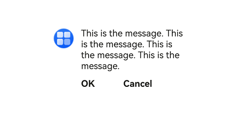

# Popup
<!--Kit: ArkUI-->
<!--Subsystem: ArkUI-->
<!--Owner: @liyi0309-->
<!--Designer: @liyi0309-->
<!--Tester: @lxl007-->
<!--Adviser: @HelloCrease-->

The **Popup** component is used to display popups in a specific style.

>  **NOTE**
>
>  - This component is supported since API version 11. Updates will be marked with a superscript to indicate their earliest API version.
>  - Use this component with the custom popup features in [popup control](ts-universal-attributes-popup.md) for best results.

## Modules to Import

```ts
import { Popup, PopupOptions, PopupTextOptions, PopupButtonOptions, PopupIconOptions } from '@kit.ArkUI';
```

##  Child Components

Not supported

## Popup

Popup(options: PopupOptions): void

**Decorator**: @Builder

**Atomic service API**: This API can be used in atomic services since API version 12.

**System capability**: SystemCapability.ArkUI.ArkUI.Full

**Device behavior differences**: On wearables, calling this API results in a runtime exception indicating that the API is undefined. On other devices, the API works correctly.

**Parameters**

| Name | Type                         | Mandatory| Description                 |
| ------- | ----------------------------- | ---- | --------------------- |
| options | [PopupOptions](#popupoptions) | Yes  | Parameters of the popup.|

## PopupOptions

Defines the style parameters of the popup.

**System capability**: SystemCapability.ArkUI.ArkUI.Full

**Device behavior differences**: On wearables, calling this API results in a runtime exception indicating that the API is undefined. On other devices, the API works correctly.

| Name       | Type      | Mandatory       | Description                           |
| ----------- | ---------- | ------| --------------------------------- |
| icon      | [PopupIconOptions](#popupiconoptions)                        | No  | Icon of the popup.<br>**NOTE**<br>The icon is not displayed when **size** is set to an invalid value or **0**.<br>**Atomic service API**: This API can be used in atomic services since API version 12.|
| title     | [PopupTextOptions](#popuptextoptions)                        | No  | Title of the popup.<br>**Atomic service API**: This API can be used in atomic services since API version 12.|
| message   | [PopupTextOptions](#popuptextoptions)                        | Yes  | Content of the popup.<br>**NOTE**<br>**fontWeight** is not available for **messages**.<br>**Atomic service API**: This API can be used in atomic services since API version 12.|
| showClose | boolean \| [Resource](ts-types.md#resource)                | No  | Whether to show the close button. The value **true** means to show the close icon, and **false** means the opposite. If the value is of the **Resource** type, the corresponding icon is displayed.<br>Default value: **true**.<br>**Atomic service API**: This API can be used in atomic services since API version 12.|
| onClose   | () => void                                                   | No  | Callback for the popup close button.<br>**Atomic service API**: This API can be used in atomic services since API version 12.|
| buttons   | [[PopupButtonOptions](#popupbuttonoptions)?,[PopupButtonOptions](#popupbuttonoptions)?] | No  | Buttons of the popup. A maximum of two buttons can be set.<br>**Atomic service API**: This API can be used in atomic services since API version 12.|
| direction<sup>12+</sup> | [Direction](ts-appendix-enums.md#direction)                                             | No                               | Layout direction.<br>Default value: **Direction.Auto**<br>**Atomic service API**: This API can be used in atomic services since API version 12.|
| maxWidth<sup>18+</sup> | [Dimension](ts-types.md#dimension10)                                             | No                               | Maximum width of the popup. This API allows the popup to display with a custom width.<br>**NOTE**<br>When using resource references, ensure that the parameter type matches the attribute method type. **maxWidth** accepts numeric values (both floating-point and integer values), such as **$r('app.float.maxWidth')** and **$r('app.integer.maxWidth')**.<br>Default value: 400 vp<br>**Atomic service API**: This API can be used in atomic services since API version 18.|

## PopupTextOptions

Provides text style settings.

**Atomic service API**: This API can be used in atomic services since API version 12.

**System capability**: SystemCapability.ArkUI.ArkUI.Full

**Device behavior differences**: On wearables, calling this API results in a runtime exception indicating that the API is undefined. On other devices, the API works correctly.

| Name      | Type                                                        | Mandatory| Description        |
| ---------- | ------------------------------------------------------------ | ---- | ------------------ |
| text       | [ResourceStr](ts-types.md#resourcestr)                       | Yes  | Text content.    |
| fontSize   | number \| string \| [Resource](ts-types.md#resource)         | No  | Text font size.<br>Default value: **$r('sys.float.ohos_id_text_size_body2')**<br>The string value must be convertible to a number (for example, **'10'**) or include a length unit (for example, **'10px'**); percentage-based strings are not supported.<br>Value range of number values: (0, +∞)|
| fontColor  | [ResourceColor](ts-types.md#resourcecolor)                   | No  | Text font color.<br>Default value: **$r('sys.color.ohos_id_color_text_secondary')**|
| fontWeight | number \| [FontWeight](ts-appendix-enums.md#fontweight) \| string | No  | Text font weight.<br>For the number type, the value ranges from 100 to 900, at an interval of 100. A larger value indicates a heavier font weight. The default value is **400**.<br>For the string type, only strings of the number type are supported, for example, **"400"**, **"bold"**, **"bolder"**, **"lighter"**, **"regular"**, and **"medium"**, which correspond to the enumerated values in **FontWeight**.<br>Default value: **FontWeight.Regular**|

## PopupButtonOptions

Defines the button attributes and events.

**Atomic service API**: This API can be used in atomic services since API version 12.

**System capability**: SystemCapability.ArkUI.ArkUI.Full

**Device behavior differences**: On wearables, calling this API results in a runtime exception indicating that the API is undefined. On other devices, the API works correctly.

| Name     | Type                                                | Mandatory| Description                |
| --------- | ---------------------------------------------------- | ---- | ---------------------- |
| text      | [ResourceStr](ts-types.md#resourcestr)               | Yes  | Text of the button.        |
| action    | () => void                                           | No  | Click callback of the button.|
| fontSize  | number \| string \| [Resource](ts-types.md#resource) | No  | Font size of the button text.<br>Default value: **$r('sys.float.ohos_id_text_size_button2')**<br>The string value must be convertible to a number (for example, **'10'**) or include a length unit (for example, **'10px'**); percentage-based strings are not supported.<br>If an invalid value is provided, the default value is used.|
| fontColor | [ResourceColor](ts-types.md#resourcecolor)           | No  | Font color of the button text.<br>Default value: **$r('sys.color.ohos_id_color_text_primary_activated')**|

##  PopupIconOptions

Defines the attributes of the icon (in the upper left corner).

**Atomic service API**: This API can be used in atomic services since API version 12.

**System capability**: SystemCapability.ArkUI.ArkUI.Full

**Device behavior differences**: On wearables, calling this API results in a runtime exception indicating that the API is undefined. On other devices, the API works correctly.

| Name        | Type                                                        | Mandatory| Description                            |
| ------------ | ------------------------------------------------------------ | ---- | ---------------------------------- |
| image        | [ResourceStr](ts-types.md#resourcestr)                       | Yes  | Icon content.                    |
| width        | [Dimension](ts-types.md#dimension10)                         | No  | Icon width.<br>Default value: **32VP**|
| height       | [Dimension](ts-types.md#dimension10)                         | No  | Icon height.<br>Default value: **32VP**|
| fillColor    | [ResourceColor](ts-types.md#resourcecolor)                   | No  | Icon fill color. This property applies only to an SVG image.|
| borderRadius | [Length](ts-types.md#length) \| [BorderRadiuses](ts-types.md#borderradiuses9) | No  | Rounded corner of the icon.<br>Default value: **$r('sys.float.ohos_id_corner_radius_default_s')** |

## Example

### Example 1: Setting the Popup Style

This example demonstrates how to customize the style of a popup by configuring **PopupIconOptions**, **PopupTextOptions**, and **PopupButtonOptions**.

```ts
// xxx.ets
import { Popup, PopupTextOptions, PopupButtonOptions, PopupIconOptions } from '@kit.ArkUI';

@Entry
@Component
struct PopupExample {
  build() {
    Row() {
      // Define a popup.
      Popup({
        // Set the icon through PopupIconOptions.
        icon: {
          // Replace $r('app.media.icon') with the image resource file you use.
          image: $r('app.media.icon'),
          width: 32,
          height: 32,
          fillColor: Color.White,
          borderRadius: 16
        } as PopupIconOptions,
        // Set the text through PopupTextOptions.
        title: {
          text: 'This is a popup with PopupOptions',
          fontSize: 20,
          fontColor: Color.Black,
          fontWeight: FontWeight.Normal
        } as PopupTextOptions,
        // Set the text through PopupTextOptions.
        message: {
          text: 'This is the message',
          fontSize: 15,
          fontColor: Color.Black
        } as PopupTextOptions,
        showClose: false,
        onClose: () => {
          console.info('close Button click');
        },
        // Set the button through PopupButtonOptions.
        buttons: [{
          text: 'confirm',
          action: () => {
            console.info('confirm button click');
          },
          fontSize: 15,
          fontColor: Color.Black,
        },
          {
            text: 'cancel',
            action: () => {
              console.info('cancel button click');
            },
            fontSize: 15,
            fontColor: Color.Black
          },] as [PopupButtonOptions?, PopupButtonOptions?]
      })
    }
    .width(300)
    .height(200)
    .borderWidth(2)
    .justifyContent(FlexAlign.Center)
  }
}
```


### Example 2: Implementing an RTL Layout
This example shows how to implement a right-to-left (RTL) layout for a popup by configuring **direction**.

```ts
// xxx.ets
import { Popup, PopupTextOptions, PopupButtonOptions, PopupIconOptions } from '@kit.ArkUI';

@Entry
@Component
struct PopupPage {
  @State currentDirection: Direction = Direction.Rtl;

  build() {
    Column() {
      // Define a popup.
      Popup({
        // Set the icon through PopupIconOptions.
        direction: this.currentDirection,
        icon: {
          // Replace $r('app.media.icon') with the image resource file you use.
          image: $r('app.media.icon'),
          width: 32,
          height: 32,
          fillColor: Color.White,
          borderRadius: 16,
        } as PopupIconOptions,
        // Set the text through PopupTextOptions.
        title: {
          text: 'This is a popup with PopupOptions',
          fontSize: 20,
          fontColor: Color.Black,
          fontWeight: FontWeight.Normal,

        } as PopupTextOptions,
        // Set the text through PopupTextOptions.
        message: {
          text: 'This is the message',
          fontSize: 15,
          fontColor: Color.Black,
        } as PopupTextOptions,
        showClose: true,
        onClose: () => {
          console.info('close Button click');
        },
        // Set the button through PopupButtonOptions.
        buttons: [{
          text: 'confirm',
          action: () => {
            console.info('confirm button click');
          },
          fontSize: 15,
          fontColor: Color.Black,

        },
          {
            text: 'cancel',
            action: () => {
              console.info('cancel button click');
            },
            fontSize: 15,
            fontColor: Color.Black,
          },] as [PopupButtonOptions?, PopupButtonOptions?],
      })

    }
    .justifyContent(FlexAlign.Center)
    .width('100%')
    .height('100%')
  }
}
```


### Example 3: Setting the Custom Width
This example demonstrates how to set the custom width for a popup using **maxWidth**.

```ts
// xxx.ets
import { Popup, PopupTextOptions, PopupButtonOptions, PopupIconOptions } from '@kit.ArkUI';

@Entry
@Component
struct PopupPage {
  @State currentDirection: Direction = Direction.Rtl;

  build() {
    Row() {
      // Define a popup.
      Popup({
        // Set the custom width.
        maxWidth: '50%',
        // Set the icon through PopupIconOptions.
        icon: {
          // Replace $r('app.media.startIcon') with the image resource file you use.
          image: $r('app.media.startIcon'),
          width: 32,
          height: 32,
          fillColor: Color.White,
          borderRadius: 16,
        } as PopupIconOptions,
        // Set the text through PopupTextOptions.
        message: {
          text: 'This is the message. This is the message. This is the message. This is the message.',
          fontSize: 15,
          fontColor: Color.Black
        } as PopupTextOptions,
        showClose: false,
        onClose: () => {
          console.info('close Button click');
        },
        // Set the button through PopupButtonOptions.
        buttons: [{
          text: 'OK',
          action: () => {
            console.info('confirm button click');
          },
          fontSize: 15,
          fontColor: Color.Black,
        },
          {
            text: 'cancel',
            action: () => {
              console.info('cancel button click');
            },
            fontSize: 15,
            fontColor: Color.Black
          },] as [PopupButtonOptions?, PopupButtonOptions?]
      })
    }
    .width(400)
    .height(200)
    .borderWidth(2)
    .justifyContent(FlexAlign.Center)
  }
}
```


