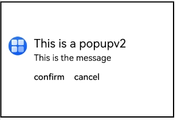
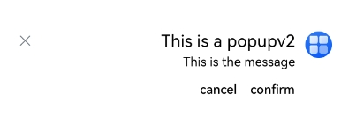
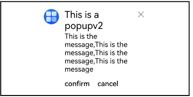

# PopupV2

<!--Kit: ArkUI-->
<!--Subsystem: ArkUI-->
<!--Owner: @liyi0309-->
<!--Designer: @liyi0309-->
<!--Tester: @lxl007-->
<!--Adviser: @Brilliantry_Rui-->
<!-- md-trans-meta sourceCommit=d1b102fd25833b7df24baa458c6e325b88131994 translatedAt=2026-07-29T03:02:24.070Z pushedAt=2026-08-04T02:47:00.286Z -->

The **PopupV2** component is used to display popup bubbles of specific styles, suitable for scenarios that require user attention or response, such as prompts, operation confirmations, or information notifications.

This component is implemented based on [state management V2](../../../ui/state-management/arkts-state-management-overview.md#state-management-v2). Compared with [state management V1](../../../ui/state-management/arkts-state-management-overview.md#state-management-v1), state management V2 delivers enhanced capabilities for deep observation and management of data objects, and is no longer limited to the component level. With state management V2, you can more flexibly control the display of popup bubbles of specific styles through this component, achieving more efficient UI refresh.

**Since:** 26.0.0

## Modules to Import

```ts
import { PopupV2, PopupV2Button, PopupV2InitInfo } from '@kit.ArkUI';
```

## Child Components

None

## PopupV2

PopupV2(options: PopupV2InitInfo): void

**Since:** 26.0.0

**Decorator:** @Builder

**Atomic service API:** This API can be used in atomic services since API version 26.0.0.

**System capability:** SystemCapability.ArkUI.ArkUI.Full

**Parameters**

| Name | Type | Mandatory | Description |
| ------- | ----------------------------- | ---- | --------------------- |
| options | [PopupV2InitInfo](#popupv2initinfo) | Yes | Configuration parameters of the PopupV2 component. |

## PopupV2InitInfo

Defines the specific style parameters of **PopupV2**.

**Since:** 26.0.0

**Atomic service API:** This API can be used in atomic services since API version 26.0.0.

**System capability:** SystemCapability.ArkUI.ArkUI.Full

| Name        | Type       | Read-Only      | Optional      | Description                            |
| ----------- | ---------- | ------| --------------------------------- | --------------------------------- |
| icon      | [ResourceStr](ts-types.md#resourcestr)                 | No   | Yes | PopupV2 icon.<br/>**Note:** Default value: **''**, meaning no icon is displayed.  |
| title     | [ResourceStr](ts-types.md#resourcestr)                        | No   | Yes  | PopupV2 title text.<br/>**Note:** Default value: **''**, meaning no title text is displayed. |
| message   | [ResourceStr](ts-types.md#resourcestr)                       | No  | No  | PopupV2 content text.<br/>**Note:** Default value: **''**, meaning no content text is displayed.|
| titleModifier      | [TextModifier](ts-universal-attributes-attribute-modifier.md#custom-modifier)                | No   | Yes | Title text properties, such as the title color, font size, and font weight.<br/>Default value: **undefined**, meaning the system title text properties are used.|
| iconModifier     | [ImageModifier](ts-universal-attributes-attribute-modifier.md#custom-modifier)                        | No   | Yes  | icon properties, such as the icon color, size, and border.<br/>Default value: **undefined**, meaning the system icon properties are used.|
| messageModifier   | [TextModifier](ts-universal-attributes-attribute-modifier.md#custom-modifier)                       | No  | Yes  | Content text properties, such as the content text color, font size, and font weight.<br/>Default value: **undefined**, meaning the system content text properties are used.|
| showClose | boolean \| [Resource](ts-types.md#resource)                | No   | Yes  | PopupV2 close button. **true**: displays the close button; **false**: hides the close button. Resource type: displays the corresponding icon.<br/>Default value: **true**|
| onClose   | Callback\<void\>                                                   | No   | Yes  | Callback for the **PopupV2** close button.<br/>No close button callback is set by default.|
| buttons   | [[PopupV2Button](#popupv2button)?,[PopupV2Button](#popupv2button)?] | No   | Yes  | PopupV2 action buttons. A maximum of two buttons can be set. No buttons are displayed by default.<br/>Default value: **[{ text: '' }, { text: '' }]** |
| direction | [Direction](ts-appendix-enums.md#direction) | No   | Yes  | Layout direction of **PopupV2**, which controls text arrangement and alignment. This is applicable to RTL (right-to-left) layout in internationalization scenarios. For details about the enum values, see [Direction](ts-appendix-enums.md#direction).<br/>Default value: **Direction.Auto** |
| maxWidth  | [Dimension](ts-types.md#dimension10)                                             | No                                | Yes                               |  Maximum width of **PopupV2**, allowing **PopupV2** to be displayed with a custom width.<br/>Default value: **400vp**<br/>NOTE<br/>1. When using a referenced resource type, the parameter type must be consistent with the attribute method type.<br/>2. **maxWidth** is of the [Dimension](ts-types.md#dimension10) type, which supports numbers, percentages, or strings with units (such as 400, '50%', '400vp'). When using a referenced resource type, the resource type supports float and integer, for example, `$r('app.float.maxWidth')` and `$r('app.integer.maxWidth')`.<br/>3. When the type is Resource, if no unit is set, the default unit is px. |

## PopupV2Button

Defines the related attributes and events of a button.

**Since:** 26.0.0

**Atomic service API:** This API can be used in atomic services since API version 26.0.0.

**System capability:** SystemCapability.ArkUI.ArkUI.Full

| Name      | Type                                                 | Read-Only | Optional | Description                 |
| --------- | ---------------------------------------------------- | ---- | ---------------------- | ---------------------- |
| text      | [ResourceStr](ts-types.md#resourcestr)               | No  | No  | Button content.         |
| action    | Callback\<void\>                                            | No   | Yes  | Callback for the button click event.<br/>No operation is performed by default. |
| buttonTextModifier  | [TextModifier](ts-universal-attributes-attribute-modifier.md#custom-modifier) | No   | Yes  | Text properties of the button, such as the text color and font size.<br/>Default value: **undefined**<br/>When the value is **undefined**, the system button text properties are used by default.<br/>**Model constraint**: This API can only be used in the stage model. |

## Examples

### Example 1: Setting the Popup Style

This example implements the popup style by configuring [titleModifier](#popupv2initinfo), [messageModifier](#popupv2initinfo), and [PopupV2Button](#popupv2button).

Since API version 26.0.0, **titleModifier**, **messageModifier**, and **PopupV2Button** are added.

```ts
// xxx.ets
import { PopupV2, PopupV2Button } from '@kit.ArkUI';
import { ImageModifier, TextModifier } from '@kit.ArkUI';

@Entry
@ComponentV2
struct PopupExample {

  build() {
    Row() {
      // PopupV2 custom advanced component
      PopupV2 ({
        // Replace with the actual resource file.
        icon:  $r('app.media.startIcon'),
        iconModifier: new ImageModifier().width(32).height(32).fillColor(Color.White).borderRadius(16),
        title: 'This is a popupv2',
        titleModifier: new TextModifier().fontSize(20).fontColor(Color.Black).fontWeight(FontWeight.Normal),
        message:  'This is the message',
        messageModifier: new TextModifier().fontSize(15).fontColor(Color.Black),
        showClose: false,
        onClose: () => {
          console.info('close Button click');
        },
        buttons: [{
          text: 'confirm',
          action: () => {
            console.info('confirm button click');
          },
          buttonTextModifier: new TextModifier().fontSize(15).fontColor(Color.Black)
        },
          {
            text: 'cancel',
            action: () => {
              console.info('cancel button click');
            },
            buttonTextModifier: new TextModifier().fontSize(15).fontColor(Color.Black)
          }] as [PopupV2Button | undefined, PopupV2Button | undefined]
      })
    }
    .width(300)
    .height(200)
    .borderWidth(2)
    .justifyContent(FlexAlign.Center)
  }
}
```



### Example 2: Setting Layout Direction

This example implements a mirrored layout effect by configuring [direction](#popupv2initinfo), suitable for RTL (right-to-left) layout requirements in internationalization scenarios.

Since API version 26.0.0, the **direction** parameter is added.

```ts
// xxx.ets
import { PopupV2, PopupV2Button } from '@kit.ArkUI';
import { ImageModifier, TextModifier } from '@kit.ArkUI';

@Entry
@ComponentV2
struct PopupExample {

  build() {
    Column() {
      // PopupV2 custom advanced component
      PopupV2 ({
        direction: Direction.Rtl,
        // Replace with the actual resource file.
        icon:  $r('app.media.startIcon'),
        iconModifier: new ImageModifier().width(32).height(32).fillColor(Color.White).borderRadius(16),
        title: 'This is a popupv2',
        titleModifier: new TextModifier().fontSize(20).fontColor(Color.Black).fontWeight(FontWeight.Normal),
        message:  'This is the message',
        messageModifier: new TextModifier().fontSize(15).fontColor(Color.Black),
        showClose: true,
        onClose: () => {
          console.info('close Button click');
        },
        buttons: [{
          text: 'confirm',
          action: () => {
            console.info('confirm button click');
          },
          buttonTextModifier: new TextModifier().fontSize(15).fontColor(Color.Black)
        },
          {
            text: 'cancel',
            action: () => {
              console.info('cancel button click');
            },
            buttonTextModifier: new TextModifier().fontSize(15).fontColor(Color.Black)
          }] as [PopupV2Button | undefined, PopupV2Button | undefined]
      })
    }
    .width('100%')
    .height('100%')
    .justifyContent(FlexAlign.Center)
  }
}
```



### Example 3: Setting a Custom Width

This example implements a custom width effect by configuring [maxWidth](#popupv2initinfo), suitable for scenarios such as long message notifications that require adjusting the display width.

Since API version 26.0.0, the **maxWidth** parameter is added.

```ts
// xxx.ets
import { PopupV2, PopupV2Button } from '@kit.ArkUI';
import { ImageModifier, TextModifier } from '@kit.ArkUI';

@Entry
@ComponentV2
struct PopupExample {

  build() {
    Row() {
      // PopupV2 custom advanced component.
      PopupV2 ({
        maxWidth: '50%',
        // Replace with the actual resource file.
        icon:  $r('app.media.startIcon'),
        iconModifier: new ImageModifier().width(32).height(32).fillColor(Color.White).borderRadius(16),
        title: 'This is a popupv2',
        titleModifier: new TextModifier().fontSize(20).fontColor(Color.Black).fontWeight(FontWeight.Normal),
        message:  'This is the message, This is the message, This is the message, This is the message',
        messageModifier: new TextModifier().fontSize(15).fontColor(Color.Black),
        showClose: true,
        onClose: () => {
          console.info('close Button click');
        },
        buttons: [{
          text: 'confirm',
          action: () => {
            console.info('confirm button click');
          },
          buttonTextModifier: new TextModifier().fontSize(15).fontColor(Color.Black)
        },
          {
            text: 'cancel',
            action: () => {
              console.info('cancel button click');
            },
            buttonTextModifier: new TextModifier().fontSize(15).fontColor(Color.Black)
          }] as [PopupV2Button | undefined, PopupV2Button | undefined]
      })
    }
    .width(400)
    .height(200)
    .borderWidth(2)
    .justifyContent(FlexAlign.Center)
  }
}
```

