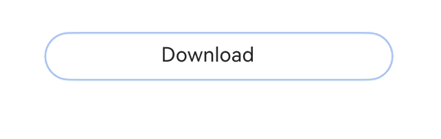
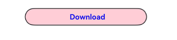

# ProgressButton


The **ProgressButton** component is a download button with a progress indicator that shows the download progress.


> **NOTE**
>
> This component is supported since API version 10. Updates will be marked with a superscript to indicate their earliest API version.


## Modules to Import

```
import { ProgressButton } from '@kit.ArkUI'
```

## Attributes
The [universal attributes](ts-component-general-attributes.md) are not supported.

## ProgressButton

ProgressButton({progress: number, content: string, progressButtonWidth?: Length, clickCallback: () =&gt; void, enable:
boolean, colorOptions?: ProgressButtonColorOptions, progressButtonRadius?: LengthMetrics})

**Decorator**: @Component


**System capability**: SystemCapability.ArkUI.ArkUI.Full

| Name                               | Type                                                           | Mandatory| Decorator | Description                                                                                                                                  |
|-----------------------------------|---------------------------------------------------------------|----|--------|--------------------------------------------------------------------------------------------------------------------------------------|
| progress                          | number                                                        | Yes | \@Prop | Current download progress.<br>The value ranges from 0 to 100. Values less than 0 are adjusted to **0**, and values greater than 100 are capped at **100**.<br>Default value: **0**<br>**Atomic service API**: This API can be used in atomic services since API version 11.           |
| content                           | string                                                        | Yes | \@Prop | Button text.<br>The default value is an empty string.<br>**NOTE**<br>The text is truncated with an ellipsis (...) if it exceeds the maximum display width of the component.<br>**Atomic service API**: This API can be used in atomic services since API version 11.                          |
| progressButtonWidth               | [Length](ts-types.md#length)                                  | No | -      | Button width, in vp.<br>The value must be greater than or equal to 44 vp.<br>The default value is **44vp**. Values less than the default value and invalid values are adjusted to the default value.<br>**Atomic service API**: This API can be used in atomic services since API version 11.                  |
| clickCallback                     | () =&gt; void                                                 | Yes | -      | Callback invoked when the button is clicked.<br>**Atomic service API**: This API can be used in atomic services since API version 11.                                                                      |
| enable                            | boolean                                                       | Yes | \@Prop | Whether the button can be clicked.<br> **true**: The button can be clicked.<br> **false**: The button cannot be clicked.<br>**Atomic service API**: This API can be used in atomic services since API version 11.                  |
| colorOptions<sup>18+<sup>         | [ProgressButtonColorOptions](#progressbuttoncoloroptions18)   | No | \@Prop | Color options of the button.<br>**Atomic service API**: This API can be used in atomic services since API version 18.                                                                         |
| progressButtonRadius<sup>18+<sup> | [LengthMetrics](../js-apis-arkui-graphics.md#lengthmetrics12) | No | \@Prop | Corner radius of the button. It cannot be set in percentage.<br>Value range: [0, height/2]<br>Default value: height/2<br>If an invalid value is set, the default value is used.<br>**Atomic service API**: This API can be used in atomic services since API version 18.|

## ProgressButtonColorOptions<sup>18+<sup>

Defines the color options for the download button.

**Atomic service API**: This API can be used in atomic services since API version 18.

**System capability**: SystemCapability.ArkUI.ArkUI.Full

| Name             | Type                                    | Mandatory| Description                                                               |
|-----------------|----------------------------------------|----|-------------------------------------------------------------------|
| progressColor   | [ResourceStr](ts-types.md#resourcestr) | No | Color of the progress indicator.<br>Default value: **#330A59F7**                                         |
| borderColor     | [ResourceStr](ts-types.md#resourcestr) | No | Border color of the button.<br>Default value: **#330A59F7**                                        |
| textColor       | [ResourceStr](ts-types.md#resourcestr) | No | Text color of the button.<br>Default value: system default value                                            |
| backgroundColor | [ResourceStr](ts-types.md#resourcestr) | No | Background color of the button.<br>Default value: **\$r('sys.color.ohos_id_color_foreground_contrary')**|

## Events
The [universal events](ts-component-general-events.md) are not supported.

## Example

### Example 1: Creating a Download Button with a Progress Indicator
This example demonstrates how to create a simple download button with a progress indicator that shows the loading status of a text file.
```ts
import { ProgressButton } from '@kit.ArkUI'

@Entry
@Component
struct Index {
  @State progressIndex: number = 0
  @State textState: string = 'Download'
  @State ButtonWidth: number = 200
  @State isRunning: boolean = false
  @State enableState: boolean = true

  build() {
    Column() {
      Scroll() {
        Column({ space: 20 }) {
          ProgressButton({
            progress: this.progressIndex,
            progressButtonWidth: this.ButtonWidth,
            content: this.textState,
            enable: this.enableState,
            clickCallback: () => {
              if (this.textState && !this.isRunning && this.progressIndex < 100) {
                this.textState = 'Continue'
              }
              this.isRunning = !this.isRunning
              let timer = setInterval(() => {
                if (this.isRunning) {
                  if (this.progressIndex === 100) {

                  } else {
                    this.progressIndex++
                    if (this.progressIndex === 100) {
                      this.textState = 'Completed'
                      this.enableState = false
                    }
                  }
                } else {
                  clearInterval(timer)
                }
              }, 20)
            }
          })
        }.alignItems(HorizontalAlign.Center).width('100%').margin({ top: 20 })
      }
    }
  }
}
```




### Example 2: Implementing a Download Button with Custom Colors
This example shows how to implement a download button with custom colors.
```ts
import { ProgressButton } from '@kit.ArkUI'

@Entry
@Component
struct Index {
  @State progressIndex: number = 0
  @State textState: string = 'Download'
  @State ButtonWidth: number = 200
  @State isRunning: boolean = false
  @State enableState: boolean = true

  build() {
    Column() {
      Scroll() {
        Column({ space: 20 }) {
          ProgressButton({
            // Set the color options of the download button.
            colorOptions: {
              progressColor: Color.Orange,
              borderColor: Color.Black,
              textColor: Color.Blue,
              backgroundColor: Color.Pink
            },
            progress: this.progressIndex,
            progressButtonWidth: this.ButtonWidth,
            content: this.textState,
            enable: this.enableState,
            clickCallback: () => {
              if (this.textState && !this.isRunning && this.progressIndex < 100) {
                this.textState = 'Continue'
              }
              this.isRunning = !this.isRunning
              let timer = setInterval(() => {
                if (this.isRunning) {
                  if (this.progressIndex === 100) {
                  } else {
                    this.progressIndex++
                    if (this.progressIndex === 100) {
                      this.textState = 'Completed'
                      this.enableState = false
                    }
                  }
                } else {
                  clearInterval(timer)
                }
              }, 20)
            }
          })
        }.alignItems(HorizontalAlign.Center).width('100%').margin({ top: 20 })
      }
    }
  }
}
```


### Example 3: Implementing a Download Button with Custom Corner Radius
This example shows how to implement a download button with custom corner radius.
```ts
import { ProgressButton, LengthMetrics } from '@kit.ArkUI'

@Entry
@Component
struct Index {
  @State progressIndex: number = 0
  @State textState: string = 'Download'
  @State ButtonWidth: number = 200
  @State isRunning: boolean = false
  @State enableState: boolean = true

  build() {
    Column() {
      Scroll() {
        Column({ space: 20 }) {
          ProgressButton({
            progressButtonRadius: LengthMetrics.vp (8), // Set the custom corner radius to 8 vp.
            progress: this.progressIndex,
            progressButtonWidth: this.ButtonWidth,
            content: this.textState,
            enable: this.enableState,
            clickCallback: () => {
              if (this.textState && !this.isRunning && this.progressIndex < 100) {
                this.textState = 'Continue'
              }
              this.isRunning = !this.isRunning
              let timer = setInterval(() => {
                if (this.isRunning) {
                  if (this.progressIndex === 100) {
                  } else {
                    this.progressIndex++
                    if (this.progressIndex === 100) {
                      this.textState = 'Completed'
                      this.enableState = false
                    }
                  }
                } else {
                  clearInterval(timer)
                }
              }, 20)
            }
          })
        }.alignItems(HorizontalAlign.Center).width('100%').margin({ top: 20 })
      }
    }
  }
}
```

