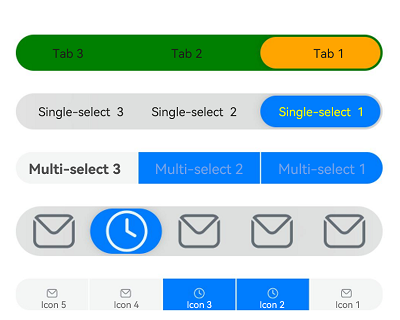

# SegmentButton

**SegmentButton** is a versatile component containing a group of related items, which can be tab-style, single-select, and multi-select buttons.

>**NOTE**
>
>This component and its child components are supported since API version 11. Updates will be marked with a superscript to indicate their earliest API version.

## Modules to Import

```
import { SegmentButton, SegmentButtonOptions, SegmentButtonItemOptionsArray } from '@kit.ArkUI';
```

## Child Components

Not supported

## SegmentButton

SegmentButton({ options: SegmentButtonOptions, selectedIndexes: number[], onItemClicked: Callback\<number\>, maxFontScale: number \| Resource })

**Decorator**: @Component

**System capability**: SystemCapability.ArkUI.ArkUI.Full

| Name           | Type                                     | Mandatory| Decorator | Description                                                        |
| --------------- | --------------------------------------------- | ---- | ----------- | ------------------------------------------------------------ |
| options         | [SegmentButtonOptions](#segmentbuttonoptions) | Yes  | @ObjectLink | Options of the **SegmentButton** component.<br>**Atomic service API**: This API can be used in atomic services since API version 12.|
| selectedIndexes | number[]                                      | Yes  | @Link       | Indexes of selected items of the **SegmentButton**. The index starts from 0 and increments by 1.<br>**NOTE**<br>**selectedIndexes** is decorated with [@Link](../../../quick-start/arkts-link.md) to implement parent-child two-way synchronization. If no items are selected, an empty array **[]** can be passed in.<br>**Atomic service API**: This API can be used in atomic services since API version 12.|
| onItemClicked<sup>13+</sup> | Callback\<number\> | No| - | Callback invoked when an item in the **SegmentButton** is clicked. The index of the clicked item is passed in as the parameter.<br>**Atomic service API**: This API can be used in atomic services since API version 13.|
| maxFontScale<sup>14+</sup> | number \| [Resource](ts-types.md#resource) | No| @Prop | Maximum font scale for the text in the **SegmentButton**.<br>Default value: **1**<br>Value range: [1, 2]<br>**NOTE**<br>Values less than 1 are treated as 1, and values greater than 2 are treated as 2.<br>**Atomic service API**: This API can be used in atomic services since API version 14.|

>**NOTE**
>
>The **SegmentButton** component does not support the universal attributes. The component takes up the maximum width allowed by the content area, and evenly allocates the width among its items. It adapts its height automatically to the content (text and image), the minimum height being 28 vp.

## SegmentButtonOptions

Provides initial data and custom properties for the **SegmentButton** component.

### Properties

**Decorator Type**: @Observed

**Atomic service API**: This API can be used in atomic services since API version 12.

**System capability**: SystemCapability.ArkUI.ArkUI.Full

| Name                 | Type                                                        | Mandatory                                                    | Description                                                      |
| ----------------------- | ------------------------------------------------------------ | ------------------------------------------------------------ | ------------------------------------------------------------ |
| type                    | 'tab' \| 'capsule'                                       | Yes                                       | Type of the **SegmentButton**.                                            |
| multiply                | boolean                                                      | Yes                                                  | Whether multiple items can be selected.<br>**NOTE**<br>For the **SegmentButton** component consisting of tab-style buttons, only one item can be selected. In this case, setting **multiply** to **true** does not take effect.|
| buttons                 | [SegmentButtonItemOptionsArray](#segmentbuttonitemoptionsarray) | Yes| Button information, including the icon and text.                              |
| fontColor               | [ResourceColor](ts-types.md#resourcecolor)                   | Yes               | Font color of the unselected item.<br>Default value: **$r('sys.color.ohos_id_color_text_secondary')**|
| selectedFontColor       | [ResourceColor](ts-types.md#resourcecolor)                   | Yes               | Font color of the selected item.<br>Default value: **$r('sys.color.ohos_id_color_text_primary')** when **type** is **"tab"** and **$r('sys.color.ohos_id_color_foreground_contrary')** when **type** is **"capsule"**|
| fontSize                | [DimensionNoPercentage](#dimensionnopercentage)              | Yes          | Font size of the unselected item. It cannot be set in percentage.<br>Default value: **$r('sys.float.ohos_id_text_size_body2')**|
| selectedFontSize        | [DimensionNoPercentage](#dimensionnopercentage)              | Yes           | Font size of the selected item. It cannot be set in percentage.<br>Default value: **$r('sys.float.ohos_id_text_size_body2')**|
| fontWeight              | [FontWeight](ts-appendix-enums.md#fontweight)                | Yes             | Font weight of the unselected item.<br>Default value: **FontWeight.Regular**|
| selectedFontWeight      | [FontWeight](ts-appendix-enums.md#fontweight)                | Yes             | Font weight of the selected item.<br>Default value: **FontWeight.Medium**    |
| backgroundColor         | [ResourceColor](ts-types.md#resourcecolor)                   | Yes                | Background color of the unselected item.<br>Default value: **$r('sys.color.ohos_id_color_button_normal')**|
| selectedBackgroundColor | [ResourceColor](ts-types.md#resourcecolor)                   | Yes                | Background color of the selected item.<br>Default value: **$r('sys.color.ohos_id_color_foreground_contrary')** when **type** is **"tab"** and **$r('sys.color.ohos_id_color_emphasize')** when **type** is **"capsule"**|
| imageSize               | [SizeOptions](ts-types.md#sizeoptions)                       | Yes                    | Image size.<br>Default value: **{ width: 24, height: 24 }**<br>**NOTE**<br>This property is effective only for buttons that contain icons.|
| buttonPadding           | [Padding](ts-types.md#padding) \| [Dimension](ts-types.md#dimension10) | Yes| Button margin.<br>Default value: **{ top: 4, right: 8, bottom: 4, left: 8 }** for icon buttons and text buttons, and **{ top: 6, right: 8, bottom: 6, left: 8 }** for icon+text buttons.|
| textPadding             | [Padding](ts-types.md#padding) \| [Dimension](ts-types.md#dimension10) | Yes| Text padding.<br>Default value: **0**                          |
| localizedButtonPadding<sup>12+</sup>  | [LocalizedPadding](ts-types.md#localizedpadding12)                 | No              | Button padding.<br>Default value:<br>Text-only buttons and icon-only buttons: **{ top: LengthMetrics.vp(4), end: LengthMetrics.vp(8), bottom: LengthMetrics.vp(4), start: LengthMetrics.vp(8) }**<br>Buttons with both an icon and text: **{ top: LengthMetrics.vp(6), end: LengthMetrics.vp(8), bottom: LengthMetrics.vp(6), start: LengthMetrics.vp(8) }**|
| localizedTextPadding<sup>12+</sup>    | [LocalizedPadding](ts-types.md#localizedpadding12)                 | No             | Text padding.<br>Default value: **0**                                                                                                                                                                                                                                         |
| direction<sup>12+</sup> | [Direction](ts-appendix-enums.md#direction)                                             | No                                         | Layout direction.<br>Default value: **Direction.Auto**                                                                                                                                                                                                                                          |
| backgroundBlurStyle     | [BlurStyle](ts-universal-attributes-background.md#blurstyle9)                 | Yes               | Background blur style applied between the content and the background.<br>Default value: **BlurStyle.NONE**                   |

### constructor

constructor(options: TabSegmentButtonOptions | CapsuleSegmentButtonOptions)

A constructor used to create a **SegmentButtonOptions** instance.

**Atomic service API**: This API can be used in atomic services since API version 12.

**System capability**: SystemCapability.ArkUI.ArkUI.Full


| Name   | Type                                                    | Mandatory| Description                |
| ------- | ------------------------------------------------------------ | ---- | -------------------- |
| options | [TabSegmentButtonOptions](#tabsegmentbuttonoptions) \|   [CapsuleSegmentButtonOptions](#capsulesegmentbuttonoptions) | Yes| Options of the **SegmentButton** component.|

### tab

static tab(options: TabSegmentButtonConstructionOptions): SegmentButtonOptions

Creates a **SegmentButtonOptions** object for the **SegmentButton** component consisting of tab-style buttons.

**Atomic service API**: This API can be used in atomic services since API version 12.

**System capability**: SystemCapability.ArkUI.ArkUI.Full


| Name   | Type                                                        | Mandatory| Description                |
| ------- | ------------------------------------------------------------ | ---- | -------------------- |
| options | [TabSegmentButtonConstructionOptions](#tabsegmentbuttonconstructionoptions) | Yes  | Options of the tab-style buttons.|

**Return value**

| Type  | Description                    |
| ------ | ------------------------ |
| [SegmentButtonOptions](#segmentbuttonoptions) | **SegmentButtonOptions** object.|

### capsule

static capsule(options: CapsuleSegmentButtonConstructionOptions): SegmentButtonOptions

Creates a **SegmentButtonOptions** object for the **SegmentButton** component consisting of single-select or multi-select buttons.

**Atomic service API**: This API can be used in atomic services since API version 12.

**System capability**: SystemCapability.ArkUI.ArkUI.Full


| Name   | Type                                                        | Mandatory| Description                       |
| ------- | ------------------------------------------------------------ | ---- | --------------------------- |
| options | [CapsuleSegmentButtonConstructionOptions](#capsulesegmentbuttonconstructionoptions) | Yes  | Options of the single-select or multi-select buttons.|

**Return value**

| Type  | Description                    |
| ------ | ------------------------ |
| [SegmentButtonOptions](#segmentbuttonoptions) | **SegmentButtonOptions** object.|

## DimensionNoPercentage

type DimensionNoPercentage = PX | VP | FP | LPX | Resource

Represents the length union type that does not support values in percentage.

**Atomic service API**: This API can be used in atomic services since API version 12.

**System capability**: SystemCapability.ArkUI.ArkUI.Full

| Type                            | Description                                         |
| -------------------------------- | --------------------------------------------- |
| [PX](ts-types.md#px10)           | Length in px. |
| [VP](ts-types.md#vp10)           | Length in vp. |
| [FP](ts-types.md#fp10)           | Length in fp. |
| [LPX](ts-types.md#lpx10)         | Length in lpx.|
| [Resource](ts-types.md#resource) | Resource reference type, which is used to set the value of a component attribute.         |

## CommonSegmentButtonOptions

Defines the attributes that can be customized for the segment button.

**Atomic service API**: This API can be used in atomic services since API version 12.

**System capability**: SystemCapability.ArkUI.ArkUI.Full

### Properties

| Name                 | Type                                                        | Mandatory                                                      | Description                                                      |
| ----------------------- | ------------------------------------------------------------ | ------------------------------------------------------------ | ------------------------------------------------------------ |
| fontColor               | [ResourceColor](ts-types.md#resourcecolor)                   | No                 | Font color of the unselected item.<br>Default value: **$r('sys.color.ohos_id_color_text_secondary')**|
| selectedFontColor       | [ResourceColor](ts-types.md#resourcecolor)                   | No                 | Font color of the selected item.<br>Default value: **$r('sys.color.ohos_id_color_text_primary')** when **type** is **"tab"** and **$r('sys.color.ohos_id_color_foreground_contrary')** when **type** is **"capsule"**|
| fontSize                | [DimensionNoPercentage](#dimensionnopercentage)              | No            | Font size of the unselected item. It cannot be set in percentage.<br>Default value: **$r('sys.float.ohos_id_text_size_body2')**|
| selectedFontSize        | [DimensionNoPercentage](#dimensionnopercentage)              | No            | Font size of the selected item. It cannot be set in percentage.<br>Default value: **$r('sys.float.ohos_id_text_size_body2')**|
| fontWeight              | [FontWeight](ts-appendix-enums.md#fontweight)                | No              | Font weight of the unselected item.<br>Default value: **FontWeight.Regular**|
| selectedFontWeight      | [FontWeight](ts-appendix-enums.md#fontweight)                | No              | Font weight of the selected item.<br>Default value: **FontWeight.Medium**|
| backgroundColor         | [ResourceColor](ts-types.md#resourcecolor)                   | No                 | Background color of the unselected item.<br>Default value: **$r('sys.color.ohos_id_color_button_normal')**|
| selectedBackgroundColor | [ResourceColor](ts-types.md#resourcecolor)                   | No                 | Background color of the selected item.<br>Default value: **$r('sys.color.ohos_id_color_foreground_contrary')** when **type** is **"tab"** and **$r('sys.color.ohos_id_color_emphasize')** when **type** is **"capsule"**|
| imageSize               | [SizeOptions](ts-types.md#sizeoptions)                       | No                     | Image size.<br>Default value: { width: 24, height: 24 }<br>**NOTE**<br>This property is effective only for buttons that contain icons.|
| buttonPadding           | [Padding](ts-types.md#padding) \| [Dimension](ts-types.md#dimension10) | No| Button margin.<br>Default value: **{ top: 4, right: 8, bottom: 4, left: 8 }** for icon buttons and text buttons, and **{ top: 6, right: 8, bottom: 6, left: 8 }** for icon+text buttons.|
| textPadding             | [Padding](ts-types.md#padding) \| [Dimension](ts-types.md#dimension10) | No| Text padding.<br>Default value: **0**                        |
| localizedButtonPadding<sup>12+</sup> | [LocalizedPadding](ts-types.md#localizedpadding12)                 | No               | Button padding.<br>Default value:<br>Text-only buttons and icon-only buttons: **{ top: LengthMetrics.vp(4), end: LengthMetrics.vp(8), bottom: LengthMetrics.vp(4), start: LengthMetrics.vp(8) }**<br>Buttons with both an icon and text: **{ top: LengthMetrics.vp(6), end: LengthMetrics.vp(8), bottom: LengthMetrics.vp(6), start: LengthMetrics.vp(8) }**|
| localizedTextPadding<sup>12+</sup>   | [LocalizedPadding](ts-types.md#localizedpadding12)                 | No               | Text padding.<br>Default value: **0**                                                                                                                                                                                                                                         |
| direction<sup>12+</sup> | [Direction](ts-appendix-enums.md#direction)                                             | No                                           | Layout direction.<br>Default value: **Direction.Auto**                                                                                                                                                                                                                                         |
| backgroundBlurStyle     | [BlurStyle](ts-universal-attributes-background.md#blurstyle9)                 | No               | Background blur style applied between the content and the background.<br>Default value: **BlurStyle.NONE**|

## TabSegmentButtonConstructionOptions

Represents options for creating a **SegmentButton** component consisting of tab-style buttons.

It inherits [CommonSegmentButtonOptions](#commonsegmentbuttonoptions).

**Atomic service API**: This API can be used in atomic services since API version 12.

**System capability**: SystemCapability.ArkUI.ArkUI.Full

### Properties

| Name   | Type                                                        | Mandatory| Description      |
| ------- | ------------------------------------------------------------ | ---- | ---------- |
| buttons | [ItemRestriction](#itemrestriction)\<[SegmentButtonTextItem](#segmentbuttontextitem)> | Yes  | Button information.|

## CapsuleSegmentButtonConstructionOptions

Represents options for creating a **SegmentButton** component consisting of single-select or multi-select buttons.

It inherits [CommonSegmentButtonOptions](#commonsegmentbuttonoptions).

**Atomic service API**: This API can be used in atomic services since API version 12.

**System capability**: SystemCapability.ArkUI.ArkUI.Full

### Properties

| Name     | Type                                             | Mandatory| Description                       |
| -------- | ------------------------------------------------- | ---- | ----------------------------- |
| buttons  | [SegmentButtonItemTuple](#segmentbuttonitemtuple) | Yes  | Button information.                   |
| multiply | boolean                                           | No  | Whether multiple items can be selected.<br>Default value: **false**|

## ItemRestriction

type ItemRestriction\<T> = [T, T, T?, T?, T?]

Represents a tuple used to store button information.

**Atomic service API**: This API can be used in atomic services since API version 12.

**System capability**: SystemCapability.ArkUI.ArkUI.Full

| Type                                     | Description                             |
| ----------------------------------------- | --------------------------------- |
|[T, T, T?, T?, T?] | A tuple that contains two to five elements of the same type.|

>**NOTE**
>
>A **SegmentButton** component supports two to five buttons.

## SegmentButtonItemTuple

Represents the tuple union type used to store button information.

**Atomic service API**: This API can be used in atomic services since API version 12.

**System capability**: SystemCapability.ArkUI.ArkUI.Full

| Type                                                        | Description                     |
| ------------------------------------------------------------ | ------------------------- |
| [ItemRestriction](#itemrestriction)\<[SegmentButtonTextItem](#segmentbuttontextitem)\> | A tuple of text-only button information.   |
| [ItemRestriction](#itemrestriction)\<[SegmentButtonIconItem](#segmentbuttoniconitem)\> | A tuple of icon-only button information.   |
| [ItemRestriction](#itemrestriction)\<[SegmentButtonIconTextItem](#segmentbuttonicontextitem)\> | A tuple of icon and text button information.|

## SegmentButtonItemArray

Represents the array union type used to store button information.

**Atomic service API**: This API can be used in atomic services since API version 12.

**System capability**: SystemCapability.ArkUI.ArkUI.Full

| Type                                                        | Description                     |
| ------------------------------------------------------------ | ------------------------- |
| Array\<[SegmentButtonTextItem](#segmentbuttontextitem)\>     | An array of text-only button information.   |
| Array\<[SegmentButtonIconItem](#segmentbuttoniconitem)\>     | An array of icon-only button information.   |
| Array\<[SegmentButtonIconTextItem](#segmentbuttonicontextitem)\> | An array of icon and text button information.|

## SegmentButtonItemOptionsArray

Represents an array for storing button information.

**Decorator Type**: @Observed

>**NOTE**
>
>A **SegmentButton** component supports two to five buttons. As such, a **SegmentButtonItemOptionsArray** object stores information about only two to five buttons.

### constructor

constructor(elements: SegmentButtonItemTuple)

A constructor used to create a **SegmentButtonItemOptionsArray** instance.

**Atomic service API**: This API can be used in atomic services since API version 12.

**System capability**: SystemCapability.ArkUI.ArkUI.Full

**Parameters**


| Name  | Type                                             | Mandatory| Description      |
| -------- | ------------------------------------------------- | ---- | ---------- |
| elements | [SegmentButtonItemTuple](#segmentbuttonitemtuple) | Yes  | Button information.|

### push

push(...items: SegmentButtonItemArray): number

Adds the specified elements to the end of this array and returns the new length of the array.

**Atomic service API**: This API can be used in atomic services since API version 12.

**System capability**: SystemCapability.ArkUI.ArkUI.Full

**Parameters**


| Name| Type                                             | Mandatory| Description                  |
| ------ | ------------------------------------------------- | ---- | ---------------------- |
| items  | [SegmentButtonItemArray](#segmentbuttonitemarray) | Yes  | Elements to add to the end of the array.|

**Return value**

| Type  | Description                    |
| ------ | ------------------------ |
| number | Length of the array after the elements are added.|

>**NOTE**
>
>A **SegmentButton** component supports two to five buttons. As such, a **SegmentButtonItemOptionsArray** object stores information about only two to five buttons. If the number limit is reached, this API will not work.

### pop

pop(): SegmentButtonItemOptions | undefined

Removes the last element from this array and returns that element.

**Atomic service API**: This API can be used in atomic services since API version 12.

**System capability**: SystemCapability.ArkUI.ArkUI.Full

**Return value**

| Type                                                        | Description          |
| ------------------------------------------------------------ | -------------- |
| [SegmentButtonItemOptions](#segmentbuttonitemoptions) \| undefined | Element removed from the array.|

>**NOTE**
>
>A **SegmentButton** component supports two to five buttons. As such, a **SegmentButtonItemOptionsArray** object stores information about only two to five buttons. If the number limit is reached, this API will not work.

### shift

shift(): SegmentButtonItemOptions | undefined

Removes the first element from this array and returns that element.

**Atomic service API**: This API can be used in atomic services since API version 12.

**System capability**: SystemCapability.ArkUI.ArkUI.Full

**Return value**

| Type                                                        | Description          |
| ------------------------------------------------------------ | -------------- |
| [SegmentButtonItemOptions](#segmentbuttonitemoptions) \| undefined | Element removed from the array.|

>**NOTE**
>
>A **SegmentButton** component supports two to five buttons. As such, a **SegmentButtonItemOptionsArray** object stores information about only two to five buttons. If the number limit is reached, this API will not work.

### unshift

unshift(...items: SegmentButtonItemArray): number

Adds the specified elements to the beginning of this array and returns the new length of the array.

**Atomic service API**: This API can be used in atomic services since API version 12.

**System capability**: SystemCapability.ArkUI.ArkUI.Full

**Parameters**


| Name | Type                                             | Mandatory| Description                |
| ----- | ------------------------------------------------- | ---- | -------------------- |
| items | [SegmentButtonItemArray](#segmentbuttonitemarray) | Yes  | Elements to add to the beginning of the array.|

**Return value**

| Type  | Description                  |
| ------ | ---------------------- |
| number | Length of the array after the elements are added.|

>**NOTE**
>
>A **SegmentButton** component supports two to five buttons. As such, a **SegmentButtonItemOptionsArray** object stores information about only two to five buttons. If the number limit is reached, this API will not work.

### splice

splice(start: number, deleteCount: number, ...items: SegmentButtonItemOptions[]): SegmentButtonItemOptions[]

Changes the contents of this array by removing the specified number of elements from the specified position and adding new elements in place. This API returns an array containing the removed elements.

**Atomic service API**: This API can be used in atomic services since API version 12.

**System capability**: SystemCapability.ArkUI.ArkUI.Full

**Parameters**


| Name     | Type                                                   | Mandatory| Description                |
| ----------- | ------------------------------------------------------- | ---- | -------------------- |
| start       | number                                                  | Yes  | Index of the position starting from which elements are to be removed.|
| deleteCount | number                                                  | Yes  | Number of elements to remove.    |
| items       | [SegmentButtonItemOptions](#segmentbuttonitemoptions)[] | No  | Elements to add to the array.      |

**Return value**

| Type                                                   | Description                          |
| ------------------------------------------------------- | ------------------------------ |
| [SegmentButtonItemOptions](#segmentbuttonitemoptions)[] | An array containing the removed elements.|

>**NOTE**
>
>A **SegmentButton** component supports two to five buttons. As such, a **SegmentButtonItemOptionsArray** object stores information about only two to five buttons. If the number limit is reached, this API will not work.

### create

static create(elements: SegmentButtonItemTuple): SegmentButtonItemOptionsArray

Creates a **SegmentButtonItemOptionsArray** object.

**Atomic service API**: This API can be used in atomic services since API version 12.

**System capability**: SystemCapability.ArkUI.ArkUI.Full

**Parameters**


| Name  | Type                                             | Mandatory| Description      |
| -------- | ------------------------------------------------- | ---- | ---------- |
| elements | [SegmentButtonItemTuple](#segmentbuttonitemtuple) | Yes  | Button information.|

**Return value**

| Type                                                        | Description                                     |
| ------------------------------------------------------------ | ----------------------------------------- |
| [SegmentButtonItemOptionsArray](#segmentbuttonitemoptionsarray) | Created **SegmentButtonItemOptionsArray** object.|

## TabSegmentButtonOptions

Provides the options of the **SegmentButton** component consisting of tab-style buttons. It inherits [TabSegmentButtonConstructionOptions](#tabsegmentbuttonconstructionoptions).

**Atomic service API**: This API can be used in atomic services since API version 12.

**System capability**: SystemCapability.ArkUI.ArkUI.Full

| Name| Type | Mandatory| Description                  |
| ---- | ----- | ---- | ---------------------- |
| type | 'tab' | Yes  | **SegmentButton** component consisting of tab-style buttons.|

## CapsuleSegmentButtonOptions

Provides the options of the **SegmentButton** component consisting of single-select or multi-select buttons. It inherits [CapsuleSegmentButtonConstructionOptions](#capsulesegmentbuttonconstructionoptions).

**Atomic service API**: This API can be used in atomic services since API version 12.

**System capability**: SystemCapability.ArkUI.ArkUI.Full

| Name| Type     | Mandatory| Description                       |
| ---- | --------- | ---- | ----------------------------- |
| type | 'capsule' | Yes  | **SegmentButton** component consisting of single-select or multi-select buttons.|

## SegmentButtonTextItem

Provides text button information.

**System capability**: SystemCapability.ArkUI.ArkUI.Full

| Name| Type                                  | Mandatory| Description     |
| ---- | -------------------------------------- | ---- | ---------- |
| text | [ResourceStr](ts-types.md#resourcestr) | Yes  | Button text.<br>**Atomic service API**: This API can be used in atomic services since API version 12.|
| accessibilityLevel<sup>13+</sup> | string | No  | Accessibility level, which is used to set whether the current component can be recognized by accessibility services.<br>The options are as follows:<br>**"auto"**: The component cannot be recognized by accessibility services.<br>**"yes"**: The component can be recognized by accessibility services.<br>**"no"**: The component cannot be recognized by accessibility services.<br>**"no-hide-descendants"**: Neither the component nor its child components can be recognized by accessibility services.<br>Default value: **"auto"**<br>**Atomic service API**: This API can be used in atomic services since API version 13.|
| accessibilityDescription<sup>13+</sup> | [ResourceStr](ts-types.md#resourcestr) | No  | Accessibility description. You can specify further explanation of the current component, for example, possible operation consequences, especially those that cannot be learned from component attributes and accessibility text. If a component contains both text information and the accessibility description, the text is read first and then the accessibility description, when the component is selected.<br>**Atomic service API**: This API can be used in atomic services since API version 13.|

## SegmentButtonIconItem

Provides icon button information.

**System capability**: SystemCapability.ArkUI.ArkUI.Full

|Name     | Type                                  | Mandatory| Description              |
| ------------ | -------------------------------------- | ---- | -------------------- |
| icon         | [ResourceStr](ts-types.md#resourcestr) | Yes  | Icon of the unselected item.<br>**Atomic service API**: This API can be used in atomic services since API version 12.|
| iconAccessibilityText<sup>13+</sup>         | [ResourceStr](ts-types.md#resourcestr) | No  | Accessibility text of the unselected item.<br>**Atomic service API**: This API can be used in atomic services since API version 13.|
| selectedIcon | [ResourceStr](ts-types.md#resourcestr) | Yes  | Icon of the selected item.<br>**Atomic service API**: This API can be used in atomic services since API version 12.  |
| selectedIconAccessibilityText<sup>13+</sup> | [ResourceStr](ts-types.md#resourcestr) | No  | Accessibility text of the selected item.<br>**Atomic service API**: This API can be used in atomic services since API version 13.  |
| accessibilityLevel<sup>13+</sup> | string | No  | Accessibility level, which is used to set whether the current component can be recognized by accessibility services.<br>The options are as follows:<br>**"auto"**: The component cannot be recognized by accessibility services.<br>**"yes"**: The component can be recognized by accessibility services.<br>**"no"**: The component cannot be recognized by accessibility services.<br>**"no-hide-descendants"**: Neither the component nor its child components can be recognized by accessibility services.<br>Default value: **"auto"**<br>**Atomic service API**: This API can be used in atomic services since API version 13.  |
| accessibilityDescription<sup>13+</sup> | [ResourceStr](ts-types.md#resourcestr) | No  | Accessibility description. You can specify further explanation of the current component, for example, possible operation consequences, especially those that cannot be learned from component attributes and accessibility text. If a component contains both text information and the accessibility description, the text is read first and then the accessibility description, when the component is selected.<br>**Atomic service API**: This API can be used in atomic services since API version 13.  |

>**NOTE**
>
>For the settings to take effect, both **icon** and **selectedIcon** must be set.

## SegmentButtonIconTextItem

Provides icon+text button information.

**System capability**: SystemCapability.ArkUI.ArkUI.Full

### Properties

| Name        | Type                                  | Mandatory| Description                |
| ------------ | -------------------------------------- | ---- | -------------------- |
| icon         | [ResourceStr](ts-types.md#resourcestr) | Yes  | Icon of the unselected item.<br>**Atomic service API**: This API can be used in atomic services since API version 12.|
| iconAccessibilityText<sup>13+</sup>         | [ResourceStr](ts-types.md#resourcestr) | No  | Accessibility text of the unselected item.<br>**Atomic service API**: This API can be used in atomic services since API version 13.|
| selectedIcon | [ResourceStr](ts-types.md#resourcestr) | Yes  | Icon of the selected item.<br>**Atomic service API**: This API can be used in atomic services since API version 12.  |
| selectedIconAccessibilityText<sup>13+</sup> | [ResourceStr](ts-types.md#resourcestr) | No  | Accessibility text of the selected item.<br>**Atomic service API**: This API can be used in atomic services since API version 13.  |
| text         | [ResourceStr](ts-types.md#resourcestr) | Yes  | Button text.<br>**Atomic service API**: This API can be used in atomic services since API version 12.          |
| accessibilityLevel<sup>13+</sup> | string | No  | Accessibility level, which is used to set whether the current component can be recognized by accessibility services.<br>The options are as follows:<br>**"auto"**: The component cannot be recognized by accessibility services.<br>**"yes"**: The component can be recognized by accessibility services.<br>**"no"**: The component cannot be recognized by accessibility services.<br>**"no-hide-descendants"**: Neither the component nor its child components can be recognized by accessibility services.<br>Default value: **"auto"**<br>**Atomic service API**: This API can be used in atomic services since API version 13.  |
| accessibilityDescription<sup>13+</sup> | [ResourceStr](ts-types.md#resourcestr) | No  | Accessibility description. You can specify further explanation of the current component, for example, possible operation consequences, especially those that cannot be learned from component attributes and accessibility text. If a component contains both text information and the accessibility description, the text is read first and then the accessibility description, when the component is selected.<br>**Atomic service API**: This API can be used in atomic services since API version 13.  |

>**NOTE**
>
>For the settings to take effect, both **icon** and **selectedIcon** must be set.

## SegmentButtonItemOptions

Describes options of the items in the **SegmentButton** component.

**Decorator Type**: @Observed

**System capability**: SystemCapability.ArkUI.ArkUI.Full

### Properties

| Name        | Type                                  | Mandatory| Description                |
| ------------ | -------------------------------------- | ---- | -------------------- |
| icon         | [ResourceStr](ts-types.md#resourcestr) | No  | Icon of the unselected item.<br>**Atomic service API**: This API can be used in atomic services since API version 12.|
| iconAccessibilityText<sup>13+</sup>         | [ResourceStr](ts-types.md#resourcestr) | No  | Accessibility text of the unselected item.<br>**Atomic service API**: This API can be used in atomic services since API version 13.|
| selectedIcon | [ResourceStr](ts-types.md#resourcestr) | No  | Icon of the selected item.<br>**Atomic service API**: This API can be used in atomic services since API version 12.  |
| selectedIconAccessibilityText<sup>13+</sup> | [ResourceStr](ts-types.md#resourcestr) | No  | Accessibility text of the selected item.<br>**Atomic service API**: This API can be used in atomic services since API version 13.  |
| text         | [ResourceStr](ts-types.md#resourcestr) | No  | Button text.<br>**Atomic service API**: This API can be used in atomic services since API version 12.          |
| accessibilityLevel<sup>13+</sup> | string | No  | Accessibility level, which is used to set whether the current component can be recognized by accessibility services.<br>The options are as follows:<br>**"auto"**: The component cannot be recognized by accessibility services.<br>**"yes"**: The component can be recognized by accessibility services.<br>**"no"**: The component cannot be recognized by accessibility services.<br>**"no-hide-descendants"**: Neither the component nor its child components can be recognized by accessibility services.<br>Default value: **"auto"**<br>**Atomic service API**: This API can be used in atomic services since API version 13.  |
| accessibilityDescription<sup>13+</sup> | [ResourceStr](ts-types.md#resourcestr) | No  | Accessibility description. You can specify further explanation of the current component, for example, possible operation consequences, especially those that cannot be learned from component attributes and accessibility text. If a component contains both text information and the accessibility description, the text is read first and then the accessibility description, when the component is selected.<br>**Atomic service API**: This API can be used in atomic services since API version 13.  |

### constructor

constructor(options: SegmentButtonItemOptionsConstructorOptions)

A constructor used to create a **SegmentButtonItemOptions** instance.

**Atomic service API**: This API can be used in atomic services since API version 12.

**System capability**: SystemCapability.ArkUI.ArkUI.Full

**Parameters**


| Name | Type                                                        | Mandatory| Description              |
| ------- | ------------------------------------------------------------ | ---- | ------------------ |
| options | [SegmentButtonItemOptionsConstructorOptions](#segmentbuttonitemoptionsconstructoroptions) | Yes  | Options of the items in the **SegmentButton** component.|

## SegmentButtonItemOptionsConstructorOptions

Describes the constructor parameters of **SegmentButtonItemOptions**.

**System capability**: SystemCapability.ArkUI.ArkUI.Full

### Properties

| Name        | Type                                  | Mandatory| Description             |
| ------------ | -------------------------------------- | ---- | -------------------- |
| icon         | [ResourceStr](ts-types.md#resourcestr) | No  | Icon of the unselected item.<br>**Atomic service API**: This API can be used in atomic services since API version 12.|
| iconAccessibilityText<sup>13+</sup>         | [ResourceStr](ts-types.md#resourcestr) | No  | Accessibility text of the unselected item.<br>**Atomic service API**: This API can be used in atomic services since API version 13.|
| selectedIcon | [ResourceStr](ts-types.md#resourcestr) | No  | Icon of the selected item.<br>**Atomic service API**: This API can be used in atomic services since API version 12.  |
| selectedIconAccessibilityText<sup>13+</sup> | [ResourceStr](ts-types.md#resourcestr) | No  | Accessibility text of the selected item.<br>**Atomic service API**: This API can be used in atomic services since API version 13.  |
| text         | [ResourceStr](ts-types.md#resourcestr) | No  | Button text.<br>**Atomic service API**: This API can be used in atomic services since API version 12.          |
| accessibilityLevel<sup>13+</sup> | string | No  | Accessibility level, which is used to set whether the current component can be recognized by accessibility services.<br>The options are as follows:<br>**"auto"**: The component cannot be recognized by accessibility services.<br>**"yes"**: The component can be recognized by accessibility services.<br>**"no"**: The component cannot be recognized by accessibility services.<br>**"no-hide-descendants"**: Neither the component nor its child components can be recognized by accessibility services.<br>Default value: **"auto"**<br>**Atomic service API**: This API can be used in atomic services since API version 13.  |
| accessibilityDescription<sup>13+</sup> | [ResourceStr](ts-types.md#resourcestr) | No  | Accessibility description. You can specify further explanation of the current component, for example, possible operation consequences, especially those that cannot be learned from component attributes and accessibility text. If a component contains both text information and the accessibility description, the text is read first and then the accessibility description, when the component is selected.<br>**Atomic service API**: This API can be used in atomic services since API version 13.  |

## Example

### Example 1

```ts
// xxx.ets
import {
  ItemRestriction,
  SegmentButton,
  SegmentButtonItemTuple,
  SegmentButtonOptions,
  SegmentButtonTextItem
} from '@kit.ArkUI';

@Entry
@Component
struct Index {
  @State tabOptions: SegmentButtonOptions = SegmentButtonOptions.tab({
    buttons: [{ text: 'Tab 1' }, { text: 'Tab 2' }, {
      text: 'Tab 3'
    }] as ItemRestriction<SegmentButtonTextItem>,
    backgroundBlurStyle: BlurStyle.BACKGROUND_THICK
  })
  @State singleSelectCapsuleOptions: SegmentButtonOptions = SegmentButtonOptions.capsule({
    buttons: [{ text: 'Single-select 1' }, { text: 'Single-select 2' }, { text: 'Single-select 3' }] as SegmentButtonItemTuple,
    multiply: false,
    backgroundBlurStyle: BlurStyle.BACKGROUND_THICK
  })
  @State multiplySelectCapsuleOptions: SegmentButtonOptions = SegmentButtonOptions.capsule({
    buttons: [{ text: 'Multi-select 1' }, { text: 'Multi-select 2' }, { text: 'Multi-select 3' }] as SegmentButtonItemTuple,
    multiply: true
  })
  @State iconCapsuleOptions: SegmentButtonOptions = SegmentButtonOptions.capsule({
    buttons: [
      { icon: $r('sys.media.ohos_ic_public_email'), selectedIcon: $r('sys.media.ohos_ic_public_clock') },
      { icon: $r('sys.media.ohos_ic_public_email'), selectedIcon: $r('sys.media.ohos_ic_public_clock') },
      { icon: $r('sys.media.ohos_ic_public_email'), selectedIcon: $r('sys.media.ohos_ic_public_clock') },
      { icon: $r('sys.media.ohos_ic_public_email'), selectedIcon: $r('sys.media.ohos_ic_public_clock') }
    ] as SegmentButtonItemTuple,
    multiply: false,
    backgroundBlurStyle: BlurStyle.BACKGROUND_THICK
  })
  @State iconTextCapsuleOptions: SegmentButtonOptions = SegmentButtonOptions.capsule({
    buttons: [
      { text: 'Icon 1', icon: $r('sys.media.ohos_ic_public_email'), selectedIcon: $r('sys.media.ohos_ic_public_clock') },
      { text: 'Icon 2', icon: $r('sys.media.ohos_ic_public_email'), selectedIcon: $r('sys.media.ohos_ic_public_clock') },
      { text: 'Icon 3', icon: $r('sys.media.ohos_ic_public_email'), selectedIcon: $r('sys.media.ohos_ic_public_clock') },
      { text: 'Icon 4', icon: $r('sys.media.ohos_ic_public_email'), selectedIcon: $r('sys.media.ohos_ic_public_clock') },
      { text: 'Icon 5', icon: $r('sys.media.ohos_ic_public_email'), selectedIcon: $r('sys.media.ohos_ic_public_clock') }
    ] as SegmentButtonItemTuple,
    multiply: true
  })
  @State tabSelectedIndexes: number[] = [1]
  @State singleSelectCapsuleSelectedIndexes: number[] = [0]
  @State multiplySelectCapsuleSelectedIndexes: number[] = [0, 1]
  @State singleSelectIconCapsuleSelectedIndexes: number[] = [3]
  @State multiplySelectIconTextCapsuleSelectedIndexes: number[] = [1, 2]

  build() {
    Row() {
      Column() {
        Column({ space: 25 }) {
          SegmentButton({ options: this.tabOptions,
            selectedIndexes: $tabSelectedIndexes })
          SegmentButton({ options: this.singleSelectCapsuleOptions,
            selectedIndexes: $singleSelectCapsuleSelectedIndexes })
          SegmentButton({
            options: this.multiplySelectCapsuleOptions,
            selectedIndexes: $multiplySelectCapsuleSelectedIndexes })
          SegmentButton({ options: this.iconCapsuleOptions,
            selectedIndexes: $singleSelectIconCapsuleSelectedIndexes })
          SegmentButton({ options: this.iconTextCapsuleOptions,
            selectedIndexes: $multiplySelectIconTextCapsuleSelectedIndexes })
        }.width('90%')
      }.width('100%')
    }.height('100%')
  }
}
```


### Example 2

```ts
// xxx.ets
import {
  ItemRestriction,
  SegmentButton,
  SegmentButtonItemTuple,
  SegmentButtonOptions,
  SegmentButtonTextItem
} from '@kit.ArkUI';

@Entry
@Component
struct Index {
  @State tabOptions: SegmentButtonOptions = SegmentButtonOptions.tab({
    buttons: [{ text: 'Tab 1' }, { text: 'Tab 2' }, {
      text: 'Tab 3'
    }] as ItemRestriction<SegmentButtonTextItem>,
    backgroundColor: Color.Green,
    selectedBackgroundColor: Color.Orange,
    textPadding: { top: 10, right: 10, bottom: 10, left: 10 },
  })
  @State singleSelectCapsuleOptions: SegmentButtonOptions = SegmentButtonOptions.capsule({
    buttons: [{ text: 'Single-select 1' }, { text: 'Single-select 2' }, { text: 'Single-select 3' }] as SegmentButtonItemTuple,
    multiply: false,
    fontColor: Color.Black,
    selectedFontColor: Color.Yellow,
    backgroundBlurStyle: BlurStyle.BACKGROUND_THICK
  })
  @State multiplySelectCapsuleOptions: SegmentButtonOptions = SegmentButtonOptions.capsule({
    buttons: [{ text: 'Multi-select 1' }, { text: 'Multi-select 2' }, { text: 'Multi-select 3' }] as SegmentButtonItemTuple,
    multiply: true,
    fontSize: 18,
    selectedFontSize: 18,
    fontWeight: FontWeight.Bolder,
    selectedFontWeight: FontWeight.Lighter,
  })
  @State iconCapsuleOptions: SegmentButtonOptions = SegmentButtonOptions.capsule({
    buttons: [
      { icon: $r('sys.media.ohos_ic_public_email'), selectedIcon: $r('sys.media.ohos_ic_public_clock') },
      { icon: $r('sys.media.ohos_ic_public_email'), selectedIcon: $r('sys.media.ohos_ic_public_clock') },
      { icon: $r('sys.media.ohos_ic_public_email'), selectedIcon: $r('sys.media.ohos_ic_public_clock') },
      { icon: $r('sys.media.ohos_ic_public_email'), selectedIcon: $r('sys.media.ohos_ic_public_clock') }
    ] as SegmentButtonItemTuple,
    multiply: false,
    imageSize: { width: 40, height: 40 },
    buttonPadding: { top: 6, right: 10, bottom: 6, left: 10 },
    backgroundBlurStyle: BlurStyle.BACKGROUND_THICK
  })
  @State iconTextCapsuleOptions: SegmentButtonOptions = SegmentButtonOptions.capsule({
    buttons: [
      { text: 'Icon 1', icon: $r('sys.media.ohos_ic_public_email'), selectedIcon: $r('sys.media.ohos_ic_public_clock') },
      { text: 'Icon 2', icon: $r('sys.media.ohos_ic_public_email'), selectedIcon: $r('sys.media.ohos_ic_public_clock') },
      { text: 'Icon 3', icon: $r('sys.media.ohos_ic_public_email'), selectedIcon: $r('sys.media.ohos_ic_public_clock') },
      { text: 'Icon 4', icon: $r('sys.media.ohos_ic_public_email'), selectedIcon: $r('sys.media.ohos_ic_public_clock') },
      { text: 'Icon 5', icon: $r('sys.media.ohos_ic_public_email'), selectedIcon: $r('sys.media.ohos_ic_public_clock') }
    ] as SegmentButtonItemTuple,
    multiply: true,
    imageSize: { width: 10, height: 10 },
  })
  @State tabSelectedIndexes: number[] = [0]
  @State singleSelectCapsuleSelectedIndexes: number[] = [0]
  @State multiplySelectCapsuleSelectedIndexes: number[] = [0, 1]
  @State singleSelectIconCapsuleSelectedIndexes: number[] = [3]
  @State multiplySelectIconTextCapsuleSelectedIndexes: number[] = [1, 2]

  build() {
    Row() {
      Column() {
        Column({ space: 20 }) {
          SegmentButton({ options: this.tabOptions, selectedIndexes: $tabSelectedIndexes })
          SegmentButton({ options: this.singleSelectCapsuleOptions,
            selectedIndexes: $singleSelectCapsuleSelectedIndexes })
          SegmentButton({ options: this.multiplySelectCapsuleOptions,
            selectedIndexes: $multiplySelectCapsuleSelectedIndexes })
          SegmentButton({ options: this.iconCapsuleOptions,
            selectedIndexes: $singleSelectIconCapsuleSelectedIndexes })
          SegmentButton({ options: this.iconTextCapsuleOptions,
            selectedIndexes: $multiplySelectIconTextCapsuleSelectedIndexes })
        }.width('90%')
      }.width('100%')
    }.height('100%')
  }
}
```


### Example 3

```ts
import {
  SegmentButton,
  SegmentButtonOptions,
  SegmentButtonItemOptionsArray,
  SegmentButtonItemTuple,
  SegmentButtonItemOptions
} from '@kit.ArkUI';

@Entry
@Component
struct Index {
  @State singleSelectCapsuleOptions: SegmentButtonOptions = SegmentButtonOptions.capsule({
    buttons: [{ text: '1' }, { text: '2' }, { text: '3' },
      { text: '4' }, { text: '5' }] as SegmentButtonItemTuple,
    multiply: false,
    backgroundBlurStyle: BlurStyle.BACKGROUND_THICK
  })
  @State capsuleSelectedIndexes: number[] = [0]

  build() {
    Row() {
      Column() {
        Column({ space: 10 }) {
          SegmentButton({ options: this.singleSelectCapsuleOptions,
            selectedIndexes: $capsuleSelectedIndexes })
          Button("Delete First Item")
            .onClick(() => {
              this.singleSelectCapsuleOptions.buttons.shift()
            })
          Button("Delete Last Item")
            .onClick(() => {
              this.singleSelectCapsuleOptions.buttons.pop()
            })
          Button("Add to End")
            .onClick(() => {
              this.singleSelectCapsuleOptions.buttons.push({ text: 'push' })
            })
          Button("Add to Beginning")
            .onClick(() => {
              this.singleSelectCapsuleOptions.buttons.unshift(({ text: 'unshift' }))
            })
          Button("Replace Items 2 and 3 with splice1 and splice2")
            .onClick(() => {
              this.singleSelectCapsuleOptions.buttons.splice(1, 2, new SegmentButtonItemOptions({
                text: 'splice1'
              }), new SegmentButtonItemOptions({ text: 'splice2' }))
            })
          Button("Change All Button Text")
            .onClick(() => {
              this.singleSelectCapsuleOptions.buttons =
              SegmentButtonItemOptionsArray.create([{ text: 'a' }, { text: 'b' },
                { text: 'c' }, { text: 'd' }, { text: 'e' }])
            })
        }.width('90%')
      }.width('100%')
    }.height('100%')
  }
}
```


### Example 4
This example shows a mirrored layout of segment buttons.

```ts
// xxx.ets
import { LengthMetrics, SegmentButton, SegmentButtonOptions } from '@kit.ArkUI'


@Entry
@Component
struct Index {
  @State tabOptions: SegmentButtonOptions = SegmentButtonOptions.tab({
    buttons: [{ text: 'Tab 1' }, { text: 'Tab 2' }, {
      text: 'Tab 3'
    }],
    direction: Direction.Rtl,
    backgroundColor: Color.Green,
    selectedBackgroundColor: Color.Orange,
    localizedTextPadding: {
      end: LengthMetrics.vp(10),
      start: LengthMetrics.vp(10)
    },
  })
  @State singleSelectCapsuleOptions: SegmentButtonOptions = SegmentButtonOptions.capsule({
    buttons: [{ text: 'Single-select 1' }, { text: 'Single-select 2' }, { text: 'Single-select 3' }],
    multiply: false,
    direction: Direction.Rtl,
    fontColor: Color.Black,
    selectedFontColor: Color.Yellow,
    backgroundBlurStyle: BlurStyle.BACKGROUND_THICK
  })
  @State multiplySelectCapsuleOptions: SegmentButtonOptions = SegmentButtonOptions.capsule({
    buttons: [{ text: 'Multi-select 1' }, { text: 'Multi-select 2' }, { text: 'Multi-select 3' }],
    multiply: true,
    direction: Direction.Rtl,
    fontSize: 18,
    selectedFontSize: 18,
    fontWeight: FontWeight.Bolder,
    selectedFontWeight: FontWeight.Lighter,
  })
  @State iconCapsuleOptions: SegmentButtonOptions = SegmentButtonOptions.capsule({
    buttons: [
      { icon: $r('sys.media.ohos_ic_public_email'), selectedIcon: $r('sys.media.ohos_ic_public_clock') },
      { icon: $r('sys.media.ohos_ic_public_email'), selectedIcon: $r('sys.media.ohos_ic_public_clock') },
      { icon: $r('sys.media.ohos_ic_public_email'), selectedIcon: $r('sys.media.ohos_ic_public_clock') },
      { icon: $r('sys.media.ohos_ic_public_email'), selectedIcon: $r('sys.media.ohos_ic_public_clock') },
      { icon: $r('sys.media.ohos_ic_public_email'), selectedIcon: $r('sys.media.ohos_ic_public_clock') }
    ],
    multiply: false,
    direction: Direction.Rtl,
    imageSize: { width: 40, height: 40 },
    localizedButtonPadding: {
      end: LengthMetrics.vp(10),
      start: LengthMetrics.vp(10)
    },
    backgroundBlurStyle: BlurStyle.BACKGROUND_THICK
  })
  @State iconTextCapsuleOptions: SegmentButtonOptions = SegmentButtonOptions.capsule({
    buttons: [
      { text: 'Icon 1', icon: $r('sys.media.ohos_ic_public_email'), selectedIcon: $r('sys.media.ohos_ic_public_clock') },
      { text: 'Icon 2', icon: $r('sys.media.ohos_ic_public_email'), selectedIcon: $r('sys.media.ohos_ic_public_clock') },
      { text: 'Icon 3', icon: $r('sys.media.ohos_ic_public_email'), selectedIcon: $r('sys.media.ohos_ic_public_clock') },
      { text: 'Icon 4', icon: $r('sys.media.ohos_ic_public_email'), selectedIcon: $r('sys.media.ohos_ic_public_clock') },
      { text: 'Icon 5', icon: $r('sys.media.ohos_ic_public_email'), selectedIcon: $r('sys.media.ohos_ic_public_clock') }
    ],
    multiply: true,
    direction: Direction.Rtl,
    imageSize: { width: 10, height: 10 },
  })
  @State tabSelectedIndexes: number[] = [0]
  @State singleSelectCapsuleSelectedIndexes: number[] = [0]
  @State multiplySelectCapsuleSelectedIndexes: number[] = [0, 1]
  @State singleSelectIconCapsuleSelectedIndexes: number[] = [3]
  @State multiplySelectIconTextCapsuleSelectedIndexes: number[] = [1, 2]

  build() {
    Row() {
      Column() {
        Column({ space: 20 }) {
          SegmentButton({ options: this.tabOptions, selectedIndexes: $tabSelectedIndexes })
          SegmentButton({
            options: this.singleSelectCapsuleOptions,
            selectedIndexes: $singleSelectCapsuleSelectedIndexes
          })
          SegmentButton({
            options: this.multiplySelectCapsuleOptions,
            selectedIndexes: $multiplySelectCapsuleSelectedIndexes
          })
          SegmentButton({
            options: this.iconCapsuleOptions,
            selectedIndexes: $singleSelectIconCapsuleSelectedIndexes
          })
          SegmentButton({
            options: this.iconTextCapsuleOptions,
            selectedIndexes: $multiplySelectIconTextCapsuleSelectedIndexes
          })
        }.width('90%')
      }.width('100%')
    }.height('100%')
  }
}
```



### Example 5
This example implements the accessibility feature of the segment button.

```ts
// xxx.ets
import {
  ItemRestriction,
  SegmentButton,
  SegmentButtonItemTuple,
  SegmentButtonOptions,
  SegmentButtonTextItem,
  SegmentButtonItemOptions
} from '@kit.ArkUI';

@Entry
@Component
struct Index {
  @State tabOptions: SegmentButtonOptions = SegmentButtonOptions.tab({
    buttons: [{ text: 'Tab 1', accessibilityLevel: 'yes', accessibilityDescription: 'Tab 1 usage hints' },
      { text: 'Tab 2', accessibilityLevel: 'yes', accessibilityDescription: 'Tab 2 usage hints' },
      { text: 'Tab 3', accessibilityLevel: 'yes', accessibilityDescription: 'Tab 3 usage hints'
    }] as ItemRestriction<SegmentButtonTextItem>,
    backgroundBlurStyle: BlurStyle.BACKGROUND_THICK
  })
  @State iconCapsuleOptions: SegmentButtonOptions = SegmentButtonOptions.capsule({
    buttons: [
      { icon: $r('sys.media.ohos_ic_public_email'), iconAccessibilityText: 'Accessibility text for the unselected icon',
        selectedIcon: $r('sys.media.ohos_ic_public_clock'), selectedIconAccessibilityText: 'Accessibility text for the selected icon',
      accessibilityLevel: 'yes', accessibilityDescription: 'SegmentButtonIconItem usage hints'},
      { icon: $r('sys.media.ohos_ic_public_email'), iconAccessibilityText: 'Accessibility text for the unselected icon',
        selectedIcon: $r('sys.media.ohos_ic_public_clock'), selectedIconAccessibilityText: 'Accessibility text for the selected icon',
        accessibilityLevel: 'yes', accessibilityDescription: 'SegmentButtonIconItem usage hints'},
      { icon: $r('sys.media.ohos_ic_public_email'), iconAccessibilityText: 'Accessibility text for the unselected icon',
        selectedIcon: $r('sys.media.ohos_ic_public_clock'), selectedIconAccessibilityText: 'Accessibility text for the selected icon',
        accessibilityLevel: 'yes', accessibilityDescription: 'SegmentButtonIconItem usage hints'},
      { icon: $r('sys.media.ohos_ic_public_email'), iconAccessibilityText: 'Accessibility text for the unselected icon',
        selectedIcon: $r('sys.media.ohos_ic_public_clock'), selectedIconAccessibilityText: 'Accessibility text for the selected icon',
        accessibilityLevel: 'yes', accessibilityDescription: 'SegmentButtonIconItem usage hints'}
    ] as SegmentButtonItemTuple,
    multiply: false,
    backgroundBlurStyle: BlurStyle.BACKGROUND_THICK
  })
  @State iconTextCapsuleOptions: SegmentButtonOptions = SegmentButtonOptions.capsule({
    buttons: [
      { text: 'Icon 1', icon: $r('sys.media.ohos_ic_public_email'), iconAccessibilityText: 'Accessibility text for the unselected icon',
        selectedIcon: $r('sys.media.ohos_ic_public_clock'), selectedIconAccessibilityText: 'Accessibility text for the selected icon',
        accessibilityLevel: 'yes', accessibilityDescription: 'SegmentButtonIconTextItem usage hints'},
      { text: 'Icon 1', icon: $r('sys.media.ohos_ic_public_email'), iconAccessibilityText: 'Accessibility text for the unselected icon',
        selectedIcon: $r('sys.media.ohos_ic_public_clock'), selectedIconAccessibilityText: 'Accessibility text for the selected icon',
        accessibilityLevel: 'yes', accessibilityDescription: 'SegmentButtonIconTextItem usage hints'},
      { text: 'Icon 1', icon: $r('sys.media.ohos_ic_public_email'), iconAccessibilityText: 'Accessibility text for the unselected icon',
        selectedIcon: $r('sys.media.ohos_ic_public_clock'), selectedIconAccessibilityText: 'Accessibility text for the selected icon',
        accessibilityLevel: 'yes', accessibilityDescription: 'SegmentButtonIconTextItem usage hints'},
      { text: 'Icon 1', icon: $r('sys.media.ohos_ic_public_email'), iconAccessibilityText: 'Accessibility text for the unselected icon',
        selectedIcon: $r('sys.media.ohos_ic_public_clock'), selectedIconAccessibilityText: 'Accessibility text for the selected icon',
        accessibilityLevel: 'yes', accessibilityDescription: 'SegmentButtonIconTextItem usage hints'}
    ] as SegmentButtonItemTuple,
    multiply: true
  })
  @State tabSelectedIndexes: number[] = [1]
  @State singleSelectIconCapsuleSelectedIndexes: number[] = [3]
  @State multiplySelectIconTextCapsuleSelectedIndexes: number[] = [1, 2]

  build() {
    Row() {
      Column() {
        Column({ space: 25 }) {
          SegmentButton({ options: this.tabOptions,
            selectedIndexes: $tabSelectedIndexes })
          SegmentButton({ options: this.iconCapsuleOptions,
            selectedIndexes: $singleSelectIconCapsuleSelectedIndexes })
          SegmentButton({ options: this.iconTextCapsuleOptions,
            selectedIndexes: $multiplySelectIconTextCapsuleSelectedIndexes })
          Button("Replace Items 2 and 3 with splice1 and splice2")
            .onClick(() => {
              this.iconTextCapsuleOptions.buttons.splice(1, 2, new SegmentButtonItemOptions({
                text: 'splice1', accessibilityLevel: 'yes', accessibilityDescription: 'SegmentButtonItemOptions usage hints'
              }), new SegmentButtonItemOptions({ text: 'splice2', icon: $r('sys.media.ohos_ic_public_email'),
                iconAccessibilityText: 'Accessibility text for the unselected icon', selectedIcon: $r('sys.media.ohos_ic_public_clock'),
                selectedIconAccessibilityText: 'Accessibility text for the selected icon', accessibilityLevel: 'yes',
                accessibilityDescription: 'SegmentButtonIconTextItem usage hints' }))
            })
        }.width('90%')
      }.width('100%')
    }.height('100%')
  }
}
```
