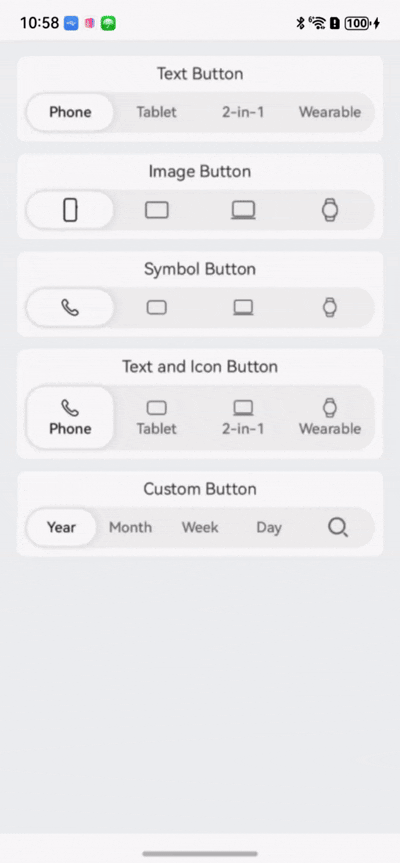
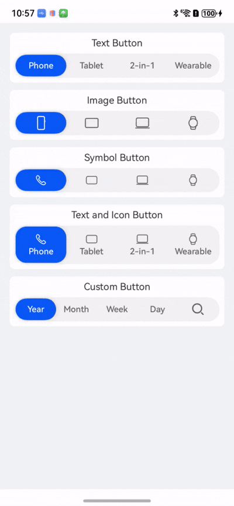
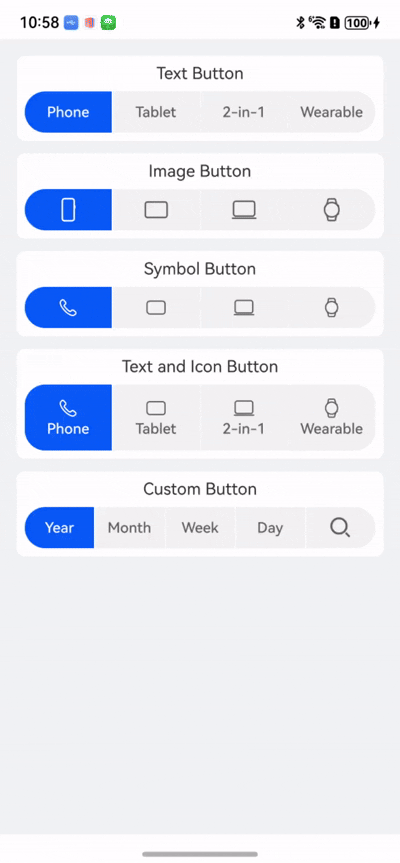

# SegmentButtonV2

**SegmentButtonV2** is a component used to create tab-style, single-select, and multi-select capsule-style buttons.

> **NOTE**
>
> This component and its child components are supported since API version 18. Updates will be marked with a superscript to indicate their earliest API version.

## Modules to Import

```
import { TabSegmentButtonV2, CapsuleSegmentButtonV2, MultiCapsuleSegmentButtonV2, SegmentButtonV2Items } from '@kit.ArkUI';
```

## Child Components

Not supported

## TabSegmentButtonV2

```ts
TabSegmentButtonV2({
  items: SegmentButtonV2Items,
  selectedIndex: number,
  $selectedIndex?: OnSelectedIndexChange,
  onItemClicked?: Callback<number>,
  itemMinFontScale?: number | Resource,
  itemMaxFontScale?: number | Resource,
  itemSpace?: LengthMetrics,
  itemFontSize?: LengthMetrics,
  itemSelectedFontSize?: LengthMetrics,
  itemFontColor?: ColorMetrics,
  itemSelectedFontColor?: ColorMetrics,
  itemFontWeight?: FontWeight,
  itemSelectedFontWeight?: FontWeight,
  itemBorderRadius?: LengthMetrics,
  itemSelectedBackgroundColor?: ColorMetrics,
  itemIconSize?: SizeT<LengthMetrics>,
  itemIconFillColor?: ColorMetrics,
  itemSelectedIconFillColor?: ColorMetrics,
  itemSymbolFontSize?: LengthMetrics,
  itemSymbolFontColor?: ColorMetrics,
  itemSelectedSymbolFontColor?: ColorMetrics,
  itemMinHeight?: LengthMetrics,
  itemPadding?: LocalizedPadding,
  itemShadow?: ShadowOptions | ShadowStyle,
  buttonBackgroundColor?: ColorMetrics,
  buttonBackgroundBlurStyle?: BlurStyle,
  buttonBackgroundBlurStyleOptions?: BackgroundBlurStyleOptions,
  buttonBackgroundEffect?: BackgroundEffectOptions,
  buttonBorderRadius?: LengthMetrics, 
  buttonMinHeight?: LengthMetrics, 
  buttonPadding?: LengthMetrics, 
  languageDirection?: Direction 
})
```

**Decorator**: @ComponentV2

**Atomic service API**: This API can be used in atomic services since API version 18.

**System capability**: SystemCapability.ArkUI.ArkUI.Full

**Parameters**

| Name                            | Type                                                                                                                                          | Read-Only| Optional| Decorator        | Description                                                                                                                                                                                                                                                                                                    |
| -------------------------------- | ---------------------------------------------------------------------------------------------------------------------------------------------- | ---- | ---- | ------------------ | -------------------------------------------------------------------------------------------------------------------------------------------------------------------------------------------------------------------------------------------------------------------------------------------------------- |
| items                            | [SegmentButtonV2Items](#segmentbuttonv2items)                                                                                                  | Yes  | No  | @Require<br>@Param | Items of the **TabSegmentButtonV2** component.                                                                                                                                                                                                                                                                        |
| selectedIndex                    | number                                                                                                                                         | Yes  | No  | @Require<br>@Param | Index of the selected item of the **TabSegmentButtonV2** component.                                                                                                                                                                                                                                                                      |
| $selectedIndex                   | [OnSelectedIndexChange](#onselectedindexchange)                                                                                                | No  | Yes  | @Event             | Callback invoked when the selected item of the **TabSegmentButtonV2** component changes.                                                                                                                                                                                                                                                            |
| onItemClicked                    | Callback\<number>                                                                                                                              | No  | Yes  | @Event             | Callback invoked when an item in the **TabSegmentButtonV2** component is clicked.                                                                                                                                                                                                                                                            |
| buttonBackgroundColor            | [ColorMetrics](../js-apis-arkui-graphics.md#colormetrics12)                                                                                    | Yes  | Yes  | @Param             | Background color of the **TabSegmentButtonV2** component.<br>Default value: **$r('sys.color.segment_button_v2_tab_button_background')**                                                                                                                                                                                                         |
| buttonBackgroundBlurStyle        | [BlurStyle](ts-universal-attributes-background.md#blurstyle9)                                                                                  | Yes  | Yes  | @Param             | Background blur style of the **TabSegmentButtonV2** component.                                                                                                                                                                                                                                                                          |
| buttonBackgroundBlurStyleOptions | [BackgroundBlurStyleOptions](ts-universal-attributes-background.md#backgroundblurstyleoptions10)                                              | Yes  | Yes  | @Param             | Background blur style options of the **TabSegmentButtonV2** component.                                                                                                                                                                                                                                                                  |
| buttonBackgroundEffect           | [BackgroundEffectOptions](ts-universal-attributes-background.md#backgroundeffectoptions11)                                                     | Yes  | Yes  | @Param             | Background blur effect options of the **TabSegmentButtonV2** component.                                                                                                                                                                                                                                                                  |
| buttonBorderRadius               | [LengthMetrics](../js-apis-arkui-graphics.md#lengthmetrics12)                                                                                  | Yes  | Yes  | @Param             | Radius of the background rounded corner.<br>Value range: [0, +∞)<br>Default value: **$r('sys.float.segment_button_v2_background_corner_radius')**                                                                                                                                                                           |
| buttonMinHeight                  | [LengthMetrics](../js-apis-arkui-graphics.md#lengthmetrics12)                                                                                  | Yes  | Yes  | @Param             | Minimum height of the **TabSegmentButtonV2** component.<br>Value range: [0, +∞)<br>Default value: **$r('sys.float.segment_button_v2_singleline_background_height')** for text-only buttons and icon-only buttons, and **$r('sys.float.segment_button_v2_doubleline_background_height')** for buttons with both an icon and text.                                                         |
| buttonPadding                    | [LengthMetrics](../js-apis-arkui-graphics.md#lengthmetrics12)                                                                                  | Yes  | Yes  | @Param             | Padding of the **TabSegmentButtonV2** component.<br>Value range: [0, +∞)<br>Default value: **$r('sys.float.padding_level1')**                                                                                                                                                                                                              |
| onItemClicked                    | Callback\<number>                                                                                                                              | Yes  | Yes  | @Event             | Callback invoked when an item in the **TabSegmentButtonV2** component is clicked.                                                                                                                                                                                                                                                            |
| itemSelectedBackgroundColor      | [ColorMetrics](../js-apis-arkui-graphics.md#colormetrics12)                                                                                    | Yes  | Yes  | @Param             | Background color of the selected item of the **TabSegmentButtonV2** component.<br>Default value: **$r('sys.color.segment_button_v2_tab_selected_item_background')**                                                                                                                                                                                        |
| itemMinHeight                    | [LengthMetrics](../js-apis-arkui-graphics.md#lengthmetrics12)                                                                                  | Yes  | Yes  | @Param             | Minimum height of the item of the **TabSegmentButtonV2** component.<br>Value range: [0, +∞)<br>Default value:<br>**$r('sys.float.segment_button_v2_singleline_selected_height')** for text-only buttons and icon-only buttons, and **$r('sys.float.segment_button_v2_doubleline_selected_height')** for buttons with both an icon and text.                                                      |
| itemPadding                      | [LocalizedPadding](ts-types.md#localizedpadding12)                                                                                             | Yes  | Yes  | @Param             | Padding of the item of the **TabSegmentButtonV2** component.<br> Default value: **{top: LengthMetrics.resource ($r('sys.float.padding_level2')), bottom: LengthMetrics.resource ($r('sys.float.padding_level2')), start: LengthMetrics.resource($r('sys.float.padding_level4')), end: LengthMetrics.resource($r('sys.float.padding_level4'))}**|
| itemShadow                       | [ShadowOptions](ts-universal-attributes-image-effect.md#shadowoptions) \| [ShadowStyle](ts-universal-attributes-image-effect.md#shadowstyle10)| Yes  | Yes  | @Param             | Shadow of the item of the **TabSegmentButtonV2** component.<br>Default value: **ShadowStyle.OUTER_DEFAULT_XS**                                                                                                                                                                                                                                    |
| itemSpace                        | [LengthMetrics](../js-apis-arkui-graphics.md#lengthmetrics12)                                                                                  | Yes  | Yes  | @Param             | Space between items of the **TabSegmentButtonV2** component.<br>Value range: [0, +∞)<br>Default value: **LengthMetrics.vp(0)**<br>**NOTE**<br>This parameter cannot be set in percentage. If an invalid value is set, the default value is used.                                                                                                                                                          |
| itemMinFontScale                 | number \| [Resource](ts-types.md#resource)                                                                                                     | Yes  | Yes  | @Param             | Minimum font scale for the item of the **TabSegmentButtonV2** component.<br>Value range: [0, 1]<br>**NOTE**<br>A value less than 0 is handled as **0**. A value greater than 1 is handled as **1**. Abnormal values are ineffective by default.                                                                                                                |
| itemMaxFontScale                 | number \| [Resource](ts-types.md#resource)                                                                                                     | Yes  | Yes  | @Param             | Maximum font scale for the item of the **TabSegmentButtonV2** component.<br>Value range: [1, 2]<br>Default value: **1**<br>**NOTE**<br>A value less than 1 is handled as **1**. A value greater than 2 is handled as **2**. Abnormal values are ineffective by default.                                                                                                   |
| itemFontSize                     | [LengthMetrics](../js-apis-arkui-graphics.md#lengthmetrics12)                                                                                  | Yes  | Yes  | @Param             | Font size of the unselected item of the **TabSegmentButtonV2** component.<br>Value range: [0, +∞)<br>Default value: **14fp**<br>**NOTE**<br>This parameter cannot be set in percentage. If an invalid value is set, the default value is used.                                                                                                                                                                                                                            |
| itemSelectedFontSize             | [LengthMetrics](../js-apis-arkui-graphics.md#lengthmetrics12)                                                                                  | Yes  | Yes  | @Param             | Font size of the selected item of the **TabSegmentButtonV2** component.<br>Value range: [0, +∞)<br>Default value: **14fp**<br>**NOTE**<br>This parameter cannot be set in percentage. If an invalid value is set, the default value is used.                                                                                                                                                                                                                              |
| itemFontColor                    | [ColorMetrics](../js-apis-arkui-graphics.md#colormetrics12)                                                                                    | Yes  | Yes  | @Param             | Font color of the unselected item of the **TabSegmentButtonV2** component.<br>Default value: **$r('sys.color.font_secondary')**                                                                                                                                                                                                                      |
| itemSelectedFontColor            | [ColorMetrics](../js-apis-arkui-graphics.md#colormetrics12)                                                                                    | Yes  | Yes  | @Param             | Font color of the selected item of the **TabSegmentButtonV2** component.<br> Default value: **$r('sys.color.font_primary')**                                                                                                                                                                                                                         |
| itemFontWeight                   | [FontWeight](ts-appendix-enums.md#fontweight)                                                                                                  | Yes  | Yes  | @Param             | Font weight of the unselected item of the **TabSegmentButtonV2** component.<br>Default value: **FontWeight.Medium**                                                                                                                                                                                                                                     |
| itemSelectedFontWeight           | [FontWeight](ts-appendix-enums.md#fontweight)                                                                                                  | Yes  | Yes  | @Param             | Font weight of the selected item of the **TabSegmentButtonV2** component.<br>Default value: **FontWeight.Medium**                                                                                                                                                                                                                                       |
| itemBorderRadius                 | [LengthMetrics](../js-apis-arkui-graphics.md#lengthmetrics12)                                                                                  | Yes  | Yes  | @Param             | Rounded corner radius of the item of the **TabSegmentButtonV2** component.<br>Value range: [0, +∞)<br> Default value: **$r('sys.float.segment_button_v2_selected_corner_radius')**                                                                                                                                                                             |
| itemIconSize                     | [SizeT](../js-apis-arkui-graphics.md#sizett12)\<[LengthMetrics](../js-apis-arkui-graphics.md#lengthmetrics12)>                                 | Yes  | Yes  | @Param             | Size of the image icon of the item in the **TabSegmentButtonV2** component.<br>Value range: [0, +∞)<br> Default value: **{ width: LengthMetrics.vp(24), height: LengthMetrics.vp(24) }**                                                                                                                                                             |
| itemIconFillColor                | [ColorMetrics](../js-apis-arkui-graphics.md#colormetrics12)                                                                                    | Yes  | Yes  | @Param             | Icon color of the unselected item of the **TabSegmentButtonV2** component.<br> Default value: **$r('sys.color.font_secondary')**                                                                                                                                                                                                                     |
| itemSelectedIconFillColor        | [ColorMetrics](../js-apis-arkui-graphics.md#colormetrics12)                                                                                    | Yes  | Yes  | @Param             | Icon color of the selected item of the **TabSegmentButtonV2** component.<br>Default value: **$r('sys.color.font_primary')**                                                                                                                                                                                                                          |
| itemSymbolFontSize               | [LengthMetrics](../js-apis-arkui-graphics.md#lengthmetrics12)                                                                                  | Yes  | Yes  | @Param             | Size of the HM Symbol icon of the item in the **TabSegmentButtonV2** component.<br>Value range: [0, +∞)<br>Default value: **20fp**<br>**NOTE**<br>This parameter cannot be set in percentage. If an invalid value is set, the default value is used.                                                                                                                                                                                                                   |
| itemSymbolFontColor              | [ColorMetrics](../js-apis-arkui-graphics.md#colormetrics12)                                                                                    | Yes  | Yes  | @Param             | Color of the HM Symbol icon of the unselected items in the **TabSegmentButtonV2** component.<br>Default value: **$r('sys.color.font_secondary')**                                                                                                                                                                                                     |
| itemSelectedSymbolFontColor      | [ColorMetrics](../js-apis-arkui-graphics.md#colormetrics12)                                                                                    | Yes  | Yes  | @Param             | Color of the HM Symbol icon of the selected item in the **TabSegmentButtonV2** component.<br>Default value: **$r('sys.color.font_primary')**                                                                                                                                                                                                         |
| languageDirection                | [Direction](ts-appendix-enums.md#direction)                                                                                                    | Yes  | Yes  | @Param             | Language direction of the **TabSegmentButtonV2** component.<br>Default value: **Direction.Auto**                                                                                                                                                                                                                                                  |

## CapsuleSegmentButtonV2

```ts
CapsuleSegmentButtonV2({
  items: SegmentButtonV2Items,
  selectedIndex: number,
  $selectedIndex?: OnSelectedIndexChange,
  onItemClicked?: Callback<number>,
  itemMinFontScale?: number | Resource,
  itemMaxFontScale?: number | Resource,
  itemSpace?: LengthMetrics,
  itemFontSize?: LengthMetrics,
  itemSelectedFontSize?: LengthMetrics,
  itemFontColor?: ColorMetrics,
  itemSelectedFontColor?: ColorMetrics,
  itemFontWeight?: FontWeight,
  itemSelectedFontWeight?: FontWeight,
  itemBorderRadius?: LengthMetrics,
  itemSelectedBackgroundColor?: ColorMetrics,
  itemIconSize?: SizeT<LengthMetrics>,
  itemIconFillColor?: ColorMetrics,
  itemSelectedIconFillColor?: ColorMetrics,
  itemSymbolFontSize?: LengthMetrics,
  itemSymbolFontColor?: ColorMetrics,
  itemSelectedSymbolFontColor?: ColorMetrics,
  itemMinHeight?: LengthMetrics,
  itemPadding?: LocalizedPadding,
  itemShadow?: ShadowOptions | ShadowStyle,
  buttonBackgroundColor?: ColorMetrics,
  buttonBackgroundBlurStyle?: BlurStyle,
  buttonBackgroundBlurStyleOptions?: BackgroundBlurStyleOptions,
  buttonBackgroundEffect?: BackgroundEffectOptions,
  buttonBorderRadius?: LengthMetrics,
  buttonMinHeight?: LengthMetrics,
  buttonPadding?: LengthMetrics,
  languageDirection?: Direction 
})
```

**Decorator**: @ComponentV2

**Atomic service API**: This API can be used in atomic services since API version 18.

**System capability**: SystemCapability.ArkUI.ArkUI.Full

**Parameters**

| Name                            | Type                                                                                                                                          | Read-Only| Mandatory| Decorator        | Description                                                                                                                                                                                                                                                                                                    |
| -------------------------------- | ---------------------------------------------------------------------------------------------------------------------------------------------- | ---- | ---- | ------------------ | -------------------------------------------------------------------------------------------------------------------------------------------------------------------------------------------------------------------------------------------------------------------------------------------------------- |
| items                            | [SegmentButtonV2Items](#segmentbuttonv2items)                                                                                                  | Yes  | No  | @Require<br>@Param | Items of the **CapsuleSegmentButtonV2** component.                                                                                                                                                                                                                                                                        |
| selectedIndex                    | number                                                                                                                                         | Yes  | No  | @Require<br>@Param | Index of the selected item of the **CapsuleSegmentButtonV2** component.                                                                                                                                                                                                                                                                      |
| $selectedIndex                   | [OnSelectedIndexChange](#onselectedindexchange)                                                                                                | No  | Yes  | @Event             | Callback invoked when the selected item of the **CapsuleSegmentButtonV2** component changes.                                                                                                                                                                                                                                                            |
| onItemClicked                    | Callback\<number>                                                                                                                              | No  | Yes  | @Event             | Callback invoked when an item in the **CapsuleSegmentButtonV2** component is clicked.                                                                                                                                                                                                                                                            |
| buttonBackgroundColor            | [ColorMetrics](../js-apis-arkui-graphics.md#colormetrics12)                                                                                    | Yes  | Yes  | @Param             | Background color of the **CapsuleSegmentButtonV2** component.<br>Default value: **$r('sys.color.segment_button_v2_tab_button_background')**                                                                                                                                                                                                         |
| buttonBackgroundBlurStyle        | [BlurStyle](ts-universal-attributes-background.md#blurstyle9)                                                                                  | Yes  | Yes  | @Param             | Background blur style of the **CapsuleSegmentButtonV2** component.                                                                                                                                                                                                                                                                          |
| buttonBackgroundBlurStyleOptions | [BackgroundBlurStyleOptions](ts-universal-attributes-background.md#backgroundblurstyleoptions10)                                              | Yes  | Yes  | @Param             | Background blur style options of the **TabSegmentButtonV2** component.                                                                                                                                                                                                                                                                  |
| buttonBackgroundEffect           | [BackgroundEffectOptions](ts-universal-attributes-background.md#backgroundeffectoptions11)                                                     | Yes  | Yes  | @Param             | Background blur effect options of the **TabSegmentButtonV2** component.                                                                                                                                                                                                                                                                  |
| buttonBorderRadius               | [LengthMetrics](../js-apis-arkui-graphics.md#lengthmetrics12)                                                                                  | Yes  | Yes  | @Param             | Radius of the background rounded corner of the **CapsuleSegmentButtonV2** component.<br>Value range: [0, +∞)<br>Default value: **$r('sys.float.segment_button_v2_background_corner_radius')**                                                                                                                                                                           |
| buttonMinHeight                  | [LengthMetrics](../js-apis-arkui-graphics.md#lengthmetrics12)                                                                                  | Yes  | Yes  | @Param             | Minimum height of the **CapsuleSegmentButtonV2** component.<br>Value range: [0, +∞)<br>Default value: **$r('sys.float.segment_button_v2_singleline_background_height')** for text-only buttons and icon-only buttons, and **$r('sys.float.segment_button_v2_doubleline_background_height')** for buttons with both an icon and text.                                                         |
| buttonPadding                    | [LengthMetrics](../js-apis-arkui-graphics.md#lengthmetrics12)                                                                                  | Yes  | Yes  | @Param             | Padding of the **CapsuleSegmentButtonV2** component.<br>Value range: [0, +∞)<br>Default value: **$r('sys.float.padding_level1')**                                                                                                                                                                                                              |
| onItemClicked                    | Callback\<number>                                                                                                                              | Yes  | Yes  | @Event             | Callback invoked when an item in the **CapsuleSegmentButtonV2** component is clicked.                                                                                                                                                                                                                                                            |
| itemSelectedBackgroundColor      | [ColorMetrics](../js-apis-arkui-graphics.md#colormetrics12)                                                                                    | Yes  | Yes  | @Param             | Background color of the selected item of the **CapsuleSegmentButtonV2** component.<br>Default value: **$r('sys.color.comp_background_emphasize')**                                                                                                                                                                                                             |
| itemMinHeight                    | [LengthMetrics](../js-apis-arkui-graphics.md#lengthmetrics12)                                                                                  | Yes  | Yes  | @Param             | Minimum height of the item of the **CapsuleSegmentButtonV2** component.<br>Value range: [0, +∞)<br>Default value:<br>**$r('sys.float.segment_button_v2_singleline_selected_height')** for text-only buttons and icon-only buttons, and **$r('sys.float.segment_button_v2_doubleline_selected_height')** for buttons with both an icon and text.                                                      |
| itemPadding                      | [LocalizedPadding](ts-types.md#localizedpadding12)                                                                                             | Yes  | Yes  | @Param             | Padding of the item of the **CapsuleSegmentButtonV2** component.<br> Default value: **{top: LengthMetrics.resource ($r('sys.float.padding_level2')), bottom: LengthMetrics.resource ($r('sys.float.padding_level2')), start: LengthMetrics.resource($r('sys.float.padding_level4')), end: LengthMetrics.resource($r('sys.float.padding_level4'))}**|
| itemShadow                       | [ShadowOptions](ts-universal-attributes-image-effect.md#shadowoptions) \| [ShadowStyle](ts-universal-attributes-image-effect.md#shadowstyle10)| Yes  | Yes  | @Param             | Shadow of the item of the **CapsuleSegmentButtonV2** component.<br>Default value: **ShadowStyle.OUTER_DEFAULT_XS**                                                                                                                                                                                                                                    |
| itemSpace                        | [LengthMetrics](../js-apis-arkui-graphics.md#lengthmetrics12)                                                                                  | Yes  | Yes  | @Param             | Space between items of the **CapsuleSegmentButtonV2** component.<br>Value range: [0, +∞)<br>Default value: **LengthMetrics.vp(0)**<br>**NOTE**<br>This parameter cannot be set in percentage. If an invalid value is set, the default value is used.                                                                                                                                                          |
| itemMinFontScale                 | number \| [Resource](ts-types.md#resource)                                                                                                     | Yes  | Yes  | @Param             | Minimum font scale for the item of the **CapsuleSegmentButtonV2** component.<br>Value range: [0, 1]<br>**NOTE**<br>A value less than 0 is handled as **0**. A value greater than 1 is handled as **1**. Abnormal values are ineffective by default.                                                                                                                |
| itemMaxFontScale                 | number \| [Resource](ts-types.md#resource)                                                                                                     | Yes  | Yes  | @Param             | Maximum font scale for the item of the **CapsuleSegmentButtonV2** component.<br>Value range: [1, 2]<br>Default value: **1**<br>**NOTE**<br>A value less than 1 is handled as **1**. A value greater than 2 is handled as **2**. Abnormal values are ineffective by default.                                                                                                   |
| itemFontSize                     | [LengthMetrics](../js-apis-arkui-graphics.md#lengthmetrics12)                                                                                  | Yes  | Yes  | @Param             | Font size of the unselected item of the **CapsuleSegmentButtonV2** component.<br>Value range: [0, +∞)<br>Default value: **14fp**<br>**NOTE**<br>This parameter cannot be set in percentage. If an invalid value is set, the default value is used.                                                                                                                                                                                                                            |
| itemSelectedFontSize             | [LengthMetrics](../js-apis-arkui-graphics.md#lengthmetrics12)                                                                                  | Yes  | Yes  | @Param             | Font size of the selected item of the **CapsuleSegmentButtonV2** component.<br>Value range: [0, +∞)<br>Default value: **14fp**<br>**NOTE**<br>This parameter cannot be set in percentage. If an invalid value is set, the default value is used.                                                                                                                                                                                                                              |
| itemFontColor                    | [ColorMetrics](../js-apis-arkui-graphics.md#colormetrics12)                                                                                    | Yes  | Yes  | @Param             | Font color of the unselected item of the **CapsuleSegmentButtonV2** component.<br>Default value: **$r('sys.color.font_secondary')**                                                                                                                                                                                                                      |
| itemSelectedFontColor            | [ColorMetrics](../js-apis-arkui-graphics.md#colormetrics12)                                                                                    | Yes  | Yes  | @Param             | Font color of the selected item of the **CapsuleSegmentButtonV2** component.<br> Default value: **$r('sys.color.font_on_primary')**                                                                                                                                                                                                                      |
| itemFontWeight                   | [FontWeight](ts-appendix-enums.md#fontweight)                                                                                                  | Yes  | Yes  | @Param             | Font weight of the unselected item of the **CapsuleSegmentButtonV2** component.<br>Default value: **FontWeight.Medium**                                                                                                                                                                                                                                     |
| itemSelectedFontWeight           | [FontWeight](ts-appendix-enums.md#fontweight)                                                                                                  | Yes  | Yes  | @Param             | Font weight of the selected item of the **CapsuleSegmentButtonV2** component.<br>Default value: **FontWeight.Medium**                                                                                                                                                                                                                                       |
| itemBorderRadius                 | [LengthMetrics](../js-apis-arkui-graphics.md#lengthmetrics12)                                                                                  | Yes  | Yes  | @Param             | Rounded corner radius of the item of the **CapsuleSegmentButtonV2** component.<br>Value range: [0, +∞)<br> Default value: **$r('sys.float.segment_button_v2_selected_corner_radius')**                                                                                                                                                                             |
| itemIconSize                     | [SizeT](../js-apis-arkui-graphics.md#sizett12)\<[LengthMetrics](../js-apis-arkui-graphics.md#lengthmetrics12)>                                 | Yes  | Yes  | @Param             | Size of the image icon of the item in the **CapsuleSegmentButtonV2** component.<br>Value range: [0, +∞)<br> Default value: **{ width: LengthMetrics.vp(24), height: LengthMetrics.vp(24) }**                                                                                                                                                             |
| itemIconFillColor                | [ColorMetrics](../js-apis-arkui-graphics.md#colormetrics12)                                                                                    | Yes  | Yes  | @Param             | Icon color of the unselected item of the **CapsuleSegmentButtonV2** component.<br> Default value: **$r('sys.color.font_secondary')**                                                                                                                                                                                                                     |
| itemSelectedIconFillColor        | [ColorMetrics](../js-apis-arkui-graphics.md#colormetrics12)                                                                                    | Yes  | Yes  | @Param             | Icon color of the selected item of the **CapsuleSegmentButtonV2** component.<br>Default value: **$r('sys.color.font_on_primary')**                                                                                                                                                                                                                       |
| itemSymbolFontSize               | [LengthMetrics](../js-apis-arkui-graphics.md#lengthmetrics12)                                                                                  | Yes  | Yes  | @Param             | Size of the HM Symbol icon of the item in the **CapsuleSegmentButtonV2** component.<br>Value range: [0, +∞)<br>Default value: **20fp**<br>**NOTE**<br>This parameter cannot be set in percentage. If an invalid value is set, the default value is used.                                                                                                                                                                                                                   |
| itemSymbolFontColor              | [ColorMetrics](../js-apis-arkui-graphics.md#colormetrics12)                                                                                    | Yes  | Yes  | @Param             | Color of the HM Symbol icon of the unselected items in the **CapsuleSegmentButtonV2** component.<br>Default value: **$r('sys.color.font_secondary')**                                                                                                                                                                                                     |
| itemSelectedSymbolFontColor      | [ColorMetrics](../js-apis-arkui-graphics.md#colormetrics12)                                                                                    | Yes  | Yes  | @Param             | Color of the HM Symbol icon of the selected item in the **CapsuleSegmentButtonV2** component.<br>Default value: **$r('sys.color.font_on_primary')**                                                                                                                                                                                                      |
| languageDirection                | [Direction](ts-appendix-enums.md#direction)                                                                                                    | Yes  | Yes  | @Param             | Language direction of the **CapsuleSegmentButtonV2** component.<br>Default value: **Direction.Auto**                                                                                                                                                                                                                                                  |

## MultiCapsuleSegmentButtonV2

```ts
MultiCapsuleSegmentButtonV2({
  items: SegmentButtonV2Items,
  selectedIndexes: number[],
  $selectedIndexes: OnSelectedIndexesChange,
  onItemClicked?: Callback<number>,
  itemMinFontScale?: number | Resource,
  itemMaxFontScale?: number | Resource,
  itemSpace?: LengthMetrics,
  itemFontColor?: ColorMetrics,
  itemSelectedFontColor?: ColorMetrics,
  itemFontSize?: LengthMetrics,
  itemSelectedFontSize?: LengthMetrics,
  itemFontWeight?: FontWeight,
  itemSelectedFontWeight?: FontWeight,
  itemBorderRadius?: LengthMetrics,
  itemBackgroundColor?: ColorMetrics,
  itemBackgroundEffect?: BackgroundEffectOptions,
  itemBackgroundBlurStyle?: BlurStyle,
  itemBackgroundBlurStyleOptions?: BackgroundBlurStyleOptions,
  itemSelectedBackgroundColor?: ColorMetrics,
  itemIconSize?: SizeT<LengthMetrics>,
  itemIconFillColor?: ColorMetrics,
  itemSelectedIconFillColor?: ColorMetrics,
  itemSymbolFontSize?: LengthMetrics,
  itemSymbolFontColor?: ColorMetrics,
  itemSelectedSymbolFontColor?: ColorMetrics,
  itemMinHeight?: LengthMetrics,
  itemPadding?: LocalizedPadding,
  languageDirection?: Direction
})
```

**Decorator**: @ComponentV2

**Atomic service API**: This API can be used in atomic services since API version 18.

**System capability**: SystemCapability.ArkUI.ArkUI.Full

**Parameters**

| Name                          | Type                                                                                                                                          | Read-Only| Mandatory| Decorator        | Description                                                                                                                                                                                                                                                                                                    |
| ------------------------------ | ---------------------------------------------------------------------------------------------------------------------------------------------- | ---- | ---- | ------------------ | -------------------------------------------------------------------------------------------------------------------------------------------------------------------------------------------------------------------------------------------------------------------------------------------------------- |
| items                          | [SegmentButtonV2Items](#segmentbuttonv2items)                                                                                                  | Yes  | No  | @Require<br>@Param | Items of the **MultiCapsuleSegmentButtonV2** component.                                                                                                                                                                                                                                                                        |
| selectedIndexes                | number[]                                                                                                                                       | Yes  | No  | @Require<br>@Param | Index of the selected item of the **MultiCapsuleSegmentButtonV2** component.                                                                                                                                                                                                                                                                  |
| $selectedIndexes               | [OnSelectedIndexesChange](#onselectedindexeschange)                                                                                            | No  | Yes  | @Event             | Callback invoked when the selected item of the **MultiCapsuleSegmentButtonV2** component changes.                                                                                                                                                                                                                                                            |
| onItemClicked                  | Callback\<number>                                                                                                                              | No  | Yes  | @Event             | Callback invoked when an item in the **MultiCapsuleSegmentButtonV2** component is clicked.                                                                                                                                                                                                                                                            |
| itemBackgroundColor            | [ColorMetrics](../js-apis-arkui-graphics.md#colormetrics12)                                                                                    | Yes  | Yes  | @Param             | Background color of the unselected item of the **MultiCapsuleSegmentButtonV2** component.<br>Default value: **$r('sys.color.segment_button_v2_multi_capsule_button_background')**                                                                                                                                                                                   |
| itemBackgroundEffect           | [BackgroundEffectOptions](ts-universal-attributes-background.md#backgroundeffectoptions11)                                                     | Yes  | Yes  | @Param             | Background effect of the unselected item of the **MultiCapsuleSegmentButtonV2** component.                                                                                                                                                                                                                                                                  |
| itemBackgroundBlurStyle        | [BlurStyle](ts-universal-attributes-background.md#blurstyle9)                                                                                  | Yes  | Yes  | @Param             | Background blur effect of the unselected item of the **MultiCapsuleSegmentButtonV2** component.                                                                                                                                                                                                                                                                  |
| itemBackgroundBlurStyleOptions | [BackgroundBlurStyleOptions](ts-universal-attributes-background.md#backgroundblurstyleoptions10)                                              | Yes  | Yes  | @Param             | Background blur style options of the unselected item of the **MultiCapsuleSegmentButtonV2** component.                                                                                                                                                                                                                                                          |
| itemSelectedBackgroundColor    | [ColorMetrics](../js-apis-arkui-graphics.md#colormetrics12)                                                                                    | Yes  | Yes  | @Param             | Background color of the selected item of the **MultiCapsuleSegmentButtonV2** component.<br>Default value: **$r('sys.color.comp_background_emphasize')**                                                                                                                                                                                                             |
| itemMinHeight                  | [LengthMetrics](../js-apis-arkui-graphics.md#lengthmetrics12)                                                                                  | Yes  | Yes  | @Param             | Minimum height of the item of the **MultiCapsuleSegmentButtonV2** component.<br>Value range: [0, +∞)<br>Default value:<br>**$r('sys.float.segment_button_v2_singleline_selected_height')** for text-only buttons and icon-only buttons, and **$r('sys.float.segment_button_v2_doubleline_selected_height')** for buttons with both an icon and text.                                                      |
| itemPadding                    | [LocalizedPadding](ts-types.md#localizedpadding12)                                                                                             | Yes  | Yes  | @Param             | Padding of the item of the **MultiCapsuleSegmentButtonV2** component.<br> Default value: **{top: LengthMetrics.resource ($r('sys.float.padding_level2')), bottom: LengthMetrics.resource ($r('sys.float.padding_level2')), start: LengthMetrics.resource($r('sys.float.padding_level4')), end: LengthMetrics.resource($r('sys.float.padding_level4'))}**|
| itemShadow                     | [ShadowOptions](ts-universal-attributes-image-effect.md#shadowoptions) \| [ShadowStyle](ts-universal-attributes-image-effect.md#shadowstyle10)| Yes  | Yes  | @Param             | Shadow of the item of the **MultiCapsuleSegmentButtonV2** component.<br>Default value: **ShadowStyle.OUTER_DEFAULT_XS**                                                                                                                                                                                                                                    |
| itemSpace                      | [LengthMetrics](../js-apis-arkui-graphics.md#lengthmetrics12)                                                                                  | Yes  | Yes  | @Param             | Space between items of the **MultiCapsuleSegmentButtonV2** component.<br>Value range: [0, +∞)<br>Default value: **LengthMetrics.vp(1)**<br>**NOTE**<br>This parameter cannot be set in percentage. If an invalid value is set, the default value is used.                                                                                                                                                          |
| itemMinFontScale               | number \| [Resource](ts-types.md#resource)                                                                                                     | Yes  | Yes  | @Param             | Minimum font scale for the item of the **MultiCapsuleSegmentButtonV2** component.<br>Value range: [0, 1]<br>**NOTE**<br>A value less than 0 is handled as **0**. A value greater than 1 is handled as **1**. Abnormal values are ineffective by default.                                                                                                                |
| itemMaxFontScale               | number \| [Resource](ts-types.md#resource)                                                                                                     | Yes  | Yes  | @Param             | Maximum font scale for the item of the **MultiCapsuleSegmentButtonV2** component.<br>Value range: [1, 2]<br>Default value: **1**<br>**NOTE**<br>A value less than 1 is handled as **1**. A value greater than 2 is handled as **2**. Abnormal values are ineffective by default.                                                                                                   |
| itemSelectedFontSize           | [LengthMetrics](../js-apis-arkui-graphics.md#lengthmetrics12)                                                                                  | Yes  | Yes  | @Param             | Font size of the selected item of the **MultiCapsuleSegmentButtonV2** component.<br>Value range: [0, +∞)<br>Default value: **14fp**<br>**NOTE**<br>This parameter cannot be set in percentage. If an invalid value is set, the default value is used.                                                                                                                                                                                                                              |
| itemFontColor                  | [ColorMetrics](../js-apis-arkui-graphics.md#colormetrics12)                                                                                    | Yes  | Yes  | @Param             | Font color of the unselected item of the **MultiCapsuleSegmentButtonV2** component.<br>Default value: **$r('sys.color.font_secondary')**                                                                                                                                                                                                                      |
| itemSelectedFontColor          | [ColorMetrics](../js-apis-arkui-graphics.md#colormetrics12)                                                                                    | Yes  | Yes  | @Param             | Font color of the selected item of the **MultiCapsuleSegmentButtonV2** component.<br> Default value: **$r('sys.color.font_on_primary')**                                                                                                                                                                                                                      |
| itemFontWeight                 | [FontWeight](ts-appendix-enums.md#fontweight)                                                                                                  | Yes  | Yes  | @Param             | Font weight of the unselected item of the **MultiCapsuleSegmentButtonV2** component.<br>Default value: **FontWeight.Medium**                                                                                                                                                                                                                                     |
| itemSelectedFontWeight         | [FontWeight](ts-appendix-enums.md#fontweight)                                                                                                  | Yes  | Yes  | @Param             | Font weight of the selected item of the **MultiCapsuleSegmentButtonV2** component.<br>Default value: **FontWeight.Medium**                                                                                                                                                                                                                                       |
| itemBorderRadius               | [LengthMetrics](../js-apis-arkui-graphics.md#lengthmetrics12)                                                                                  | Yes  | Yes  | @Param             | Rounded corner radius of the item of the **MultiCapsuleSegmentButtonV2** component.<br>Value range: [0, +∞)<br> Default value: **$r('sys.float.segment_button_v2_multi_corner_radius')**                                                                                                                                                                                |
| itemIconSize                   | [SizeT](../js-apis-arkui-graphics.md#sizett12)\<[LengthMetrics](../js-apis-arkui-graphics.md#lengthmetrics12)>                                 | Yes  | Yes  | @Param             | Size of the image icon of the item in the **MultiCapsuleSegmentButtonV2** component.<br>Value range: [0, +∞)<br> Default value: **{ width: LengthMetrics.vp(24), height: LengthMetrics.vp(24) }**                                                                                                                                                             |
| itemIconFillColor              | [ColorMetrics](../js-apis-arkui-graphics.md#colormetrics12)                                                                                    | Yes  | Yes  | @Param             | Icon color of the unselected item of the **MultiCapsuleSegmentButtonV2** component.<br> Default value: **$r('sys.color.font_secondary')**                                                                                                                                                                                                                     |
| itemSelectedIconFillColor      | [ColorMetrics](../js-apis-arkui-graphics.md#colormetrics12)                                                                                    | Yes  | Yes  | @Param             | Icon color of the selected item of the **MultiCapsuleSegmentButtonV2** component.<br>Default value: **$r('sys.color.font_on_primary')**                                                                                                                                                                                                                       |
| itemSymbolFontSize             | [LengthMetrics](../js-apis-arkui-graphics.md#lengthmetrics12)                                                                                  | Yes  | Yes  | @Param             | Size of the HM Symbol icon of the item in the **MultiCapsuleSegmentButtonV2** component.<br>Value range: [0, +∞)<br>Default value: **20fp**<br>**NOTE**<br>This parameter cannot be set in percentage. If an invalid value is set, the default value is used.                                                                                                                                                                                                                   |
| itemSymbolFontColor            | [ColorMetrics](../js-apis-arkui-graphics.md#colormetrics12)                                                                                    | Yes  | Yes  | @Param             | Color of the HM Symbol icon of the unselected items in the **MultiCapsuleSegmentButtonV2** component.<br>Default value: **$r('sys.color.font_secondary')**                                                                                                                                                                                                     |
| itemSelectedSymbolFontColor    | [ColorMetrics](../js-apis-arkui-graphics.md#colormetrics12)                                                                                    | Yes  | Yes  | @Param             | Color of the HM Symbol icon of the selected item in the **MultiCapsuleSegmentButtonV2** component.<br>Default value: **$r('sys.color.font_on_primary')**                                                                                                                                                                                                      |
| languageDirection              | [Direction](ts-appendix-enums.md#direction)                                                                                                    | Yes  | Yes  | @Param             | Language direction of the **MultiCapsuleSegmentButtonV2** component.<br>Default value: **Direction.Auto**                                                                                                                                                                                                                                                  |

## SegmentButtonV2Items

Represents items of the **SegmentButtonV2** component.

This parameter is inherited from Array\<[SegmentButtonV2Item](#segmentbuttonv2item)>.

**Decorator type**: @ObservedV2

**Atomic service API**: This API can be used in atomic services since API version 18.

**System capability**: SystemCapability.ArkUI.ArkUI.Full

### Properties

**Decorator type**: @ObservedV2

**Atomic service API**: This API can be used in atomic services since API version 18.

**System capability**: SystemCapability.ArkUI.ArkUI.Full

### constructor

constructor(items: SegmentButtonV2ItemOptions[])

Constructs a **SegmentButtonV2ItemOptions** instance.

**Atomic service API**: This API can be used in atomic services since API version 18.

**System capability**: SystemCapability.ArkUI.ArkUI.Full

**Parameters**

| Name | Type                                                             | Mandatory| Description                      |
| ----- | ----------------------------------------------------------------- | ---- | -------------------------- |
| items | Array\<[SegmentButtonV2ItemOptions](#segmentbuttonv2itemoptions)> | Yes  | Options of the item of the **SegmentButtonV2** component.|

### isHybrid

get hasHybrid()

Obtains whether there is an item with both an icon and text.

**Atomic service API**: This API can be used in atomic services since API version 18.

**System capability**: SystemCapability.ArkUI.ArkUI.Full

**Return value**

| Type   | Description                |
| ------- | -------------------- |
| boolean | Whether there is an item with both an icon and text.<br>The value **true** indicates that there is an item with both an icon and text; the value **false** indicates the opposite.|

## SegmentButtonV2Item

### Properties

**Decorator type**: @ObservedV2

**Atomic service API**: This API can be used in atomic services since API version 18.

**System capability**: SystemCapability.ArkUI.ArkUI.Full

**Parameters**

| Name                    | Type                                                                | Decorator| Mandatory| Description                                           |
| ------------------------ | -------------------------------------------------------------------- | ------ | ---- | ----------------------------------------------- |
| text                     | [ResourceStr](ts-types.md#resourcestr)                               | @Trace | No  | Item text of the **SegmentButtonV2** component.                             |
| icon                     | [ResourceStr](ts-types.md#resourcestr)                               | @Trace | No  | Image icon of the item of the **SegmentButtonV2** component.                     |
| symbol                   | [Resource](ts-types.md#resource)                                     | @Trace | No  | HM symbol icon of the item of the **SegmentButtonV2** component.              |
| enabled                  | boolean                                                              | @Trace | No  | Whether the item of the **SegmentButtonV2** component is enabled.<br>Default value: **true**<br>The value **true** indicates that the item is enabled; the value **false** indicates the opposite.                         |
| textModifier             | [TextModifier](ts-universal-attributes-attribute-modifier.md)        | @Trace | No  | Text modifier for the item of the **SegmentButtonV2** component.               |
| iconModifier             | [ImageModifier](ts-universal-attributes-attribute-modifier.md)       | @Trace | No  | Image icon modifier for the item of the **SegmentButtonV2** component.       |
| symbolModifier           | [SymbolGlyphModifier](ts-universal-attributes-attribute-modifier.md) | @Trace | No  | HM Symbol icon modifier for the item of the **SegmentButtonV2** component.|
| accessibilityText        | [ResourceStr](ts-types.md#resourcestr)                               | @Trace | No  | Accessibility text of the item of the **SegmentButtonV2** component.                       |
| accessibilityDescription | [ResourceStr](ts-types.md#resourcestr)                               | @Trace | No  | Accessibility description of the item of the **SegmentButtonV2** component.                       |
| accessibilityLevel       | string                                                               | @Trace | No  | Accessibility level of the **SegmentButtonV2** component.                     |

> **Description**
>
> 1. When both **symbol** and **icon** are set, **symbol** has a higher display priority.
> 2. When both **symbol** and **symbolModifier** are set with HM Symbol, **symbolModifier** has a higher display priority.

### constructor

constructor(options: SegmentButtonV2ItemOptions)

Constructs a **SegmentButtonV2ItemOptions** instance.

**Atomic service API**: This API can be used in atomic services since API version 18.

**System capability**: SystemCapability.ArkUI.ArkUI.Full

**Parameters**

| Name   | Type                                                     | Mandatory| Description                  |
| ------- | --------------------------------------------------------- | ---- | ---------------------- |
| options | [SegmentButtonV2ItemOptions](#segmentbuttonv2itemoptions) | Yes  | Options of the item of the **SegmentButtonV2** component.|

### isHybrid

get isHybrid()

Obtains whether the item is set with both an icon and text.

**Atomic service API**: This API can be used in atomic services since API version 18.

**System capability**: SystemCapability.ArkUI.ArkUI.Full

**Return value**

| Type   | Description                          |
| ------- | ------------------------------ |
| boolean | Whether the item is set with both an icon and text.|

## SegmentButtonV2ItemOptions

Represents options of the item of the **SegmentButtonV2** component.

**Atomic service API**: This API can be used in atomic services since API version 18.

**System capability**: SystemCapability.ArkUI.ArkUI.Full

**Parameters**

### Properties

| Name                    | Type                                                                | Mandatory| Description                                           |
| ------------------------ | -------------------------------------------------------------------- | ---- | ----------------------------------------------- |
| text                     | [ResourceStr](ts-types.md#resourcestr)                               | No  | Item text of the **SegmentButtonV2** component.                             |
| icon                     | [ResourceStr](ts-types.md#resourcestr)                               | No  | Image icon of the item of the **SegmentButtonV2** component.                     |
| symbol                   | [Resource](ts-types.md#resource)                                     | No  | HM symbol icon of the item of the **SegmentButtonV2** component.              |
| enabled                  | boolean                                                              | No  | Whether the item of the **SegmentButtonV2** component is enabled.                         |
| textModifier             | [TextModifier](ts-universal-attributes-attribute-modifier.md)        | No  | Text modifier for the item of the **SegmentButtonV2** component.               |
| iconModifier             | [ImageModifier](ts-universal-attributes-attribute-modifier.md)       | No  | Image icon modifier for the item of the **SegmentButtonV2** component.       |
| symbolModifier           | [SymbolGlyphModifier](ts-universal-attributes-attribute-modifier.md) | No  | HM Symbol icon modifier for the item of the **SegmentButtonV2** component.|
| accessibilityText        | [ResourceStr](ts-types.md#resourcestr)                               | No  | Accessibility text of the item of the **SegmentButtonV2** component.                       |
| accessibilityDescription | [ResourceStr](ts-types.md#resourcestr)                               | No  | Accessibility description of the item of the **SegmentButtonV2** component.                       |
| accessibilityLevel       | string                                                               | No  | Accessibility level of the **SegmentButtonV2** component.                     |

> **Description**
>
> 1. When both **symbol** and **icon** are set, **symbol** has a higher display priority.
> 2. When both **symbol** and **symbolModifier** are set with HM Symbol, **symbolModifier** has a higher display priority.

## OnSelectedIndexChange

type OnSelectedIndexChange = (selectedIndex: number) => void

Defines a callback invoked when the selected item of the **SegmentButtonV2** component changes.

**Atomic service API**: This API can be used in atomic services since API version 18.

**System capability**: SystemCapability.ArkUI.ArkUI.Full

**Parameters**

| Name       | Type  | Mandatory| Description              |
| ------------- | ------ | ---- | ------------------ |
| selectedIndex | number | Yes  | Index of the selected item of the **SegmentButtonV2** component.|

## OnSelectedIndexesChange

type OnSelectedIndexesChange = (selectedIndexes: number[]) => void

Defines a callback invoked when selected items of the **SegmentButtonV2** component changes.

**Atomic service API**: This API can be used in atomic services since API version 18.

**System capability**: SystemCapability.ArkUI.ArkUI.Full

**Parameters**

| Name         | Type    | Mandatory| Description                  |
| --------------- | -------- | ---- | ---------------------- |
| selectedIndexes | number[] | Yes  | Indexes of selected items of the **SegmentButtonV2** component.|

## Example

### Example 1 (**TabSegmentButtonV2**)

The following example describes how to use the **TabSegmentButtonV2** component. 

```ts
import { SegmentButtonV2Items, TabSegmentButtonV2 } from '@kit.ArkUI';

@Entry
@ComponentV2
struct TabSegmentButtonV2Example {
  @Local textItems: SegmentButtonV2Items = new SegmentButtonV2Items([
    { text: 'Phone'},
    { text: 'Tablet' },
    { text: '2-in-1' }, 
    { text: 'Wearable' },
  ]);
  @Local textSelectedIndex: number = 0;
  @Local imageItems: SegmentButtonV2Items = new SegmentButtonV2Items([
    { icon: $r('sys.media.ohos_ic_public_device_phone') },
    { icon: $r('sys.media.ohos_ic_public_device_pad') },
    { icon: $r('sys.media.ohos_ic_public_device_matebook') },
    { icon: $r('sys.media.ohos_ic_public_device_watch') },
  ]);
  @Local imageSelectedIndex: number = 0;
  @Local symbolItems: SegmentButtonV2Items = new SegmentButtonV2Items([
    { symbol: $r('sys.symbol.phone') },
    { symbol: $r('sys.symbol.pad') },
    { symbol: $r('sys.symbol.matebook') },
    { symbol: $r('sys.symbol.watch') },
  ]);
  @Local symbolSelectedIndex: number = 0;
  @Local hybridItems: SegmentButtonV2Items = new SegmentButtonV2Items([
    { text: 'Phone', symbol: $r('sys.symbol.phone') },
    { text: 'Tablet', symbol: $r('sys.symbol.pad') },
    { text: '2-in-1', symbol: $r('sys.symbol.matebook') },
    { text: 'Wearable', symbol: $r('sys.symbol.watch') },
  ]);
  @Local hybridSelectedIndex: number = 0;
  @Local freeItems: SegmentButtonV2Items = new SegmentButtonV2Items([
    { text: 'Year' },
    { text: 'Month' },
    { text: 'Week' },
    { text: 'Day' },
    { icon: $r('sys.media.ohos_ic_public_search_filled') },
  ]);
  @Local freeSelectedIndex: number = 0;

  build() {
    Scroll() {
      Column({ space: 12 }) {
        VCard({ title: 'Text Button' }) {
          TabSegmentButtonV2({
            items: this.textItems,
            selectedIndex: this.textSelectedIndex!!,
          })
        }

        VCard({ title: 'Image Button' }) {
          TabSegmentButtonV2({
            items: this.imageItems,
            selectedIndex: this.imageSelectedIndex!!,
          })
        }

        VCard({ title: 'Symbol Button' }) {
          TabSegmentButtonV2({
            items: this.symbolItems,
            selectedIndex: this.symbolSelectedIndex!!,
          })
        }

        VCard({ title: 'Text and Icon Button' }) {
          TabSegmentButtonV2({
            items: this.hybridItems,
            selectedIndex: this.hybridSelectedIndex!!,
          })
        }

        VCard({ title: 'Custom Button' }) {
          TabSegmentButtonV2({
            items: this.freeItems,
            selectedIndex: this.freeSelectedIndex!!,
          })
        }
      }
      .constraintSize({ minHeight: '100%' })
      .justifyContent(FlexAlign.Start)
      .padding(16)
    }
    .backgroundColor('#f1f3f5')
    .width('100%')
    .height('100%')
  }
}

@Builder
function Noop() {
}

@Component
export struct VCard {
  @Prop
  title: ResourceStr;
  @BuilderParam
  content: () => void = Noop;

  build() {
    Column({ space: 8 }) {
      if (this.title) {
        Text(this.title)
          .maxLines(1)
          .textOverflow({ overflow: TextOverflow.Ellipsis })
          .constraintSize({ maxWidth: '80%' })
      }
      this.content()
    }
    .backgroundColor(Color.White)
    .borderRadius(8)
    .padding(8)
    .width('100%')
  }
}
```



### Example 2 (**CapsuleSegmentButtonV2**)

The following example describes how to use the **CapsuleSegmentButtonV2** button.

```ts
import { CapsuleSegmentButtonV2, SegmentButtonV2Items } from '@kit.ArkUI';

@Entry
@ComponentV2
struct CapsuleSegmentButtonV2Example {
  @Local textItems: SegmentButtonV2Items = new SegmentButtonV2Items([
    { text: 'Phone'},
    { text: 'Tablet'},
    { text: '2-in-1' }, 
    { text: 'Wearable' },
  ]);
  @Local textSelectedIndex: number = 0;
  @Local imageItems: SegmentButtonV2Items = new SegmentButtonV2Items([
    { icon: $r('sys.media.ohos_ic_public_device_phone') },
    { icon: $r('sys.media.ohos_ic_public_device_pad') },
    { icon: $r('sys.media.ohos_ic_public_device_matebook') },
    { icon: $r('sys.media.ohos_ic_public_device_watch') },
  ]);
  @Local imageSelectedIndex: number = 0;
  @Local symbolItems: SegmentButtonV2Items = new SegmentButtonV2Items([
    { symbol: $r('sys.symbol.phone') },
    { symbol: $r('sys.symbol.pad') },
    { symbol: $r('sys.symbol.matebook') },
    { symbol: $r('sys.symbol.watch') },
  ]);
  @Local symbolSelectedIndex: number = 0;
  @Local hybridItems: SegmentButtonV2Items = new SegmentButtonV2Items([
    { text: 'Phone', symbol: $r('sys.symbol.phone') },
    { text: 'Tablet', symbol: $r('sys.symbol.pad') },
    { text: '2-in-1', symbol: $r('sys.symbol.matebook') },
    { text: 'Wearable', symbol: $r('sys.symbol.watch') },
  ]);
  @Local hybridSelectedIndex: number = 0;
  @Local freeItems: SegmentButtonV2Items = new SegmentButtonV2Items([
    { text: 'Year' },
    { text: 'Month' },
    { text: 'Week' },
    { text: 'Day' },
    { icon: $r('sys.media.ohos_ic_public_search_filled') },
  ]);
  @Local freeSelectedIndex: number = 0;

  build() {
    Scroll() {
      Column({ space: 12 }) {
        VCard({ title: 'Text Button' }) {
          CapsuleSegmentButtonV2({
            items: this.textItems,
            selectedIndex: this.textSelectedIndex!!,
          })
        }

        VCard({ title: 'Image Button' }) {
          CapsuleSegmentButtonV2({
            items: this.imageItems,
            selectedIndex: this.imageSelectedIndex!!,
          })
        }

        VCard({ title: 'Symbol Button' }) {
          CapsuleSegmentButtonV2({
            items: this.symbolItems,
            selectedIndex: this.symbolSelectedIndex!!,
          })
        }

        VCard({ title: 'Text and Icon Button' }) {
          CapsuleSegmentButtonV2({
            items: this.hybridItems,
            selectedIndex: this.hybridSelectedIndex!!,
          })
        }

        VCard({ title: 'Custom Button' }) {
          CapsuleSegmentButtonV2({
            items: this.freeItems,
            selectedIndex: this.freeSelectedIndex!!,
          })
        }
      }
      .constraintSize({ minHeight: '100%' })
      .justifyContent(FlexAlign.Start)
      .padding(16)
    }
    .backgroundColor('#f1f3f5')
    .width('100%')
    .height('100%')
  }
}

@Builder
function Noop() {
}

@Component
export struct VCard {
  @Prop
  title: ResourceStr;
  @BuilderParam
  content: () => void = Noop;

  build() {
    Column({ space: 8 }) {
      if (this.title) {
        Text(this.title)
          .maxLines(1)
          .textOverflow({ overflow: TextOverflow.Ellipsis })
          .constraintSize({ maxWidth: '80%' })
      }
      this.content()
    }
    .backgroundColor(Color.White)
    .borderRadius(8)
    .padding(8)
    .width('100%')
  }
}

```



### Example 3 (**MultiCapsuleSegmentButtonV2**)

The following example describes how to use the **MultiCapsuleSegmentButtonV2** button.

```ts
import { MultiCapsuleSegmentButtonV2, SegmentButtonV2Items } from '@kit.ArkUI';

@Entry
@ComponentV2
struct MultiCapsuleSegmentButtonV2Example {
  @Local textItems: SegmentButtonV2Items = new SegmentButtonV2Items([
    { text: 'Phone'},
    { text: 'Tablet'},
    { text: '2-in-1' }, 
    { text: 'Wearable' },
  ]);
  @Local textSelectedIndexes: number[] = [0];
  @Local imageItems: SegmentButtonV2Items = new SegmentButtonV2Items([
    { icon: $r('sys.media.ohos_ic_public_device_phone') },
    { icon: $r('sys.media.ohos_ic_public_device_pad') },
    { icon: $r('sys.media.ohos_ic_public_device_matebook') },
    { icon: $r('sys.media.ohos_ic_public_device_watch') },
  ]);
  @Local imageSelectedIndexes: number[] = [0];
  @Local symbolItems: SegmentButtonV2Items = new SegmentButtonV2Items([
    { symbol: $r('sys.symbol.phone') },
    { symbol: $r('sys.symbol.pad') },
    { symbol: $r('sys.symbol.matebook') },
    { symbol: $r('sys.symbol.watch') },
  ]);
  @Local symbolSelectedIndexes: number[] = [0];
  @Local hybridItems: SegmentButtonV2Items = new SegmentButtonV2Items([
    { text: 'Phone', symbol: $r('sys.symbol.phone') },
    { text: 'Tablet', symbol: $r('sys.symbol.pad') },
    { text: '2-in-1', symbol: $r('sys.symbol.matebook') },
    { text: 'Wearable', symbol: $r('sys.symbol.watch') },
  ]);
  @Local hybridSelectedIndexes: number[] = [0];
  @Local freeItems: SegmentButtonV2Items = new SegmentButtonV2Items([
    { text: 'Year' },
    { text: 'Month' },
    { text: 'Week' },
    { text: 'Day' },
    { icon: $r('sys.media.ohos_ic_public_search_filled') },
  ]);
  @Local freeSelectedIndexes: number[] = [0];

  build() {
    Scroll() {
      Column({ space: 12 }) {
        VCard({ title: 'Text Button' }) {
          MultiCapsuleSegmentButtonV2({
            items: this.textItems,
            selectedIndexes: this.textSelectedIndexes!!,
          })
        }

        VCard({ title: 'Image Button' }) {
          MultiCapsuleSegmentButtonV2({
            items: this.imageItems,
            selectedIndexes: this.imageSelectedIndexes!!,
          })
        }

        VCard({ title: 'Symbol Button' }) {
          MultiCapsuleSegmentButtonV2({
            items: this.symbolItems,
            selectedIndexes: this.symbolSelectedIndexes!!,
          })
        }

        VCard({ title: 'Text and Icon Button' }) {
          MultiCapsuleSegmentButtonV2({
            items: this.hybridItems,
            selectedIndexes: this.hybridSelectedIndexes!!,
          })
        }

        VCard({ title: 'Custom Button' }) {
          MultiCapsuleSegmentButtonV2({
            items: this.freeItems,
            selectedIndexes: this.freeSelectedIndexes!!,
          })
        }
      }
      .constraintSize({ minHeight: '100%' })
      .justifyContent(FlexAlign.Start)
      .padding(16)
    }
    .backgroundColor('#f1f3f5')
    .width('100%')
    .height('100%')
  }
}

@Builder
function Noop() {
}

@Component
export struct VCard {
  @Prop
  title: ResourceStr;
  @BuilderParam
  content: () => void = Noop;

  build() {
    Column({ space: 8 }) {
      if (this.title) {
        Text(this.title)
          .maxLines(1)
          .textOverflow({ overflow: TextOverflow.Ellipsis })
          .constraintSize({ maxWidth: '80%' })
      }
      this.content()
    }
    .backgroundColor(Color.White)
    .borderRadius(8)
    .padding(8)
    .width('100%')
  }
}

```


