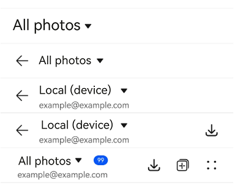
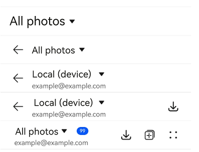
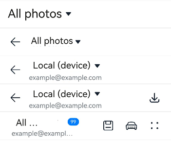

# SelectTitleBar


The **SelectTitleBar** component represents a drop-down menu title bar - a title bar that contains a drop-down menu - for switching between pages of different levels (configured with the **Back** button).


> **NOTE**
>
> This component is supported since API version 10. Updates will be marked with a superscript to indicate their earliest API version.
>
> This component is not supported on wearables.


## Modules to Import

```
import { SelectTitleBar } from '@kit.ArkUI';
```


## Child Components

Not supported

## Attributes
The [universal attributes](ts-component-general-attributes.md) are not supported.

## SelectTitleBar

SelectTitleBar({selected: number, options: Array&lt;SelectOption&gt;, menuItems?: Array&lt;SelectTitleBarMenuItem&gt;, subtitle?: ResourceStr, badgeValue?: number, hidesBackButton?: boolean, onSelected?: (index: number) =&gt; void})

**Decorator**: @Component

**Atomic service API**: This API can be used in atomic services since API version 11.

**System capability**: SystemCapability.ArkUI.ArkUI.Full

| Name| Type| Mandatory| Decorator| Description|
| -------- | -------- | -------- | -------- | -------- |
| selected | number | Yes| \@Prop | Index of the currently selected item.<br>The index of the first item is 0. If this attribute is not set, the default value **0** will be used.|
| options | Array&lt;[SelectOption](ts-basic-components-select.md#selectoption)&gt; | Yes| - | Options in the drop-down menu.|
| menuItems | Array&lt;[SelectTitleBarMenuItem](#selecttitlebarmenuitem)&gt;              | No| - | List of menu items on the right of the title bar.|
| subtitle | [ResourceStr](ts-types.md#resourcestr)                                      | No| - | Subtitle.|
| badgeValue | number                                                                      | No| - | Value for the badge.<br>Value range: [-2147483648, 2147483647].<br>If the value is out of the range, 4294967296 is added or subtracted so that the value is within the range. If the value is not an integer, it is rounded off to the nearest integer. For example, 5.5 is rounded off to 5.<br>**NOTE**<br>The badge will not be displayed if the value is less than or equal to 0.<br>The maximum number of messages is 99. If this limit is exceeded, only **99+** is displayed. Extremely large values are considered exceptional and will result in the badge not being displayed.|
| hidesBackButton | boolean                                                                     | No| - | Whether to hide the back arrow on the left.<br>Default value: **false**. <br>The value **true** means to hide the provider, and **false** means the opposite.|
| onSelected | (index: number) =&gt; void                                   | No| - | Callback invoked when an option in the drop-down menu is selected. The index of the selected option is passed in.|

> **NOTE**
> 
> The input parameter cannot be **undefined**, that is, calling **SelectTitleBar(undefined)** is not allowed.

## SelectTitleBarMenuItem

**System capability**: SystemCapability.ArkUI.ArkUI.Full

| Name| Type| Mandatory| Description|
| -------- | -------- | -------- | -------- |
| value | [ResourceStr](ts-types.md#resourcestr) | Yes| Icon resource.<br>**Atomic service API**: This API can be used in atomic services since API version 11.|
| symbolStyle<sup>18+</sup> | [SymbolGlyphModifier](ts-universal-attributes-attribute-modifier.md) | No| Symbol icon resource, which has higher priority than **value**.<br>**Atomic service API**: This API can be used in atomic services since API version 18.|
| label<sup>13+</sup> | [ResourceStr](ts-types.md#resourcestr) | No| Icon label.<br>**Atomic service API**: This API can be used in atomic services since API version 13.|
| isEnabled | boolean | No| Whether to enable the item.<br>Default value: **false**. <br>The value **true** means to enable the item, and **false** means the opposite.<br>**Atomic service API**: This API can be used in atomic services since API version 11.|
| action | () =&gt; void | No| Action to perform.<br>**Atomic service API**: This API can be used in atomic services since API version 11.|
| accessibilityLevel<sup>18+<sup>       | string  | No| Accessibility level. It determines whether the component can be recognized by accessibility services.<br>The options are as follows:<br>**"auto"**: It is treated as "yes" by the system.<br>**"yes"**: The component can be recognized by accessibility services.<br>**"no"**: The component cannot be recognized by accessibility services.<br>**"no-hide-descendants"**: Neither the component nor its child components can be recognized by accessibility services.<br>Default value: **"auto"**<br>**Atomic service API**: This API can be used in atomic services since API version 18.|
| accessibilityText<sup>18+<sup>        | ResourceStr | No| Accessibility text, that is, accessible label name. If a component does not contain text information, it will not be announced by the screen reader when selected. In this case, the screen reader user cannot know which component is selected. To solve this problem, you can set accessibility text for components without text information. When such a component is selected, the screen reader announces the specified accessibility text, informing the user which component is selected.<br>Default value: value of the **label** property if it is set and an empty string otherwise.<br>**Atomic service API**: This API can be used in atomic services since API version 18.                                    |
| accessibilityDescription<sup>18+<sup> | ResourceStr | No| Accessible description. You can provide comprehensive text explanations to help users understand the operation they are about to perform and its potential consequences, especially when these cannot be inferred from the component's attributes and accessibility text alone. If a component contains both text information and the accessible description, the text is announced first and then the accessible description, when the component is selected.<br>Default value: **"Double-tap to activate"**<br>**Atomic service API**: This API can be used in atomic services since API version 18.          |

## Events
The [universal events](ts-component-general-events.md) are not supported.

## Example

### Example 1: Implementing a Simple Drop-down Menu Title Bar
This example demonstrates how to implement a simple drop-down menu title bar with various configurations, including one with a back arrow and one with a right-side menu item list.
```ts
import { SelectTitleBar, Prompt, SelectTitleBarMenuItem } from '@kit.ArkUI';

@Entry
@Component
struct Index {
  // Define an array of menu items for the right side of the title bar.
  private menuItems: Array<SelectTitleBarMenuItem> =
    [
      {
        // Resource for the menu icon.
        value: $r('sys.media.ohos_save_button_filled'),
        // Enable the image.
        isEnabled: true,
        // Action triggered when the menu item is clicked.
        action: () => Prompt.showToast({ message: 'show toast index 1' }),
      },
      {
        value: $r('sys.media.ohos_ic_public_copy'),
        isEnabled: true,
        action: () => Prompt.showToast({ message: 'show toast index 2' }),
      },
      {
        value: $r('sys.media.ohos_ic_public_edit'),
        isEnabled: true,
        action: () => Prompt.showToast({ message: 'show toast index 3' }),
      },
      {
        value: $r('sys.media.ohos_ic_public_remove'),
        isEnabled: true,
        action: () => Prompt.showToast({ message: 'show toast index 4' }),
      },
    ]

  build() {
    Row() {
      Column() {
        Divider().height(2).color(0xCCCCCC)
        SelectTitleBar({
          // Define items in the drop-down list.
          options: [
            { value: 'All photos' },
            { value: 'Local (device)' },
            { value: 'Local (memory card)'}
          ],
          // Initially select the first item in the drop-down list.
          selected: 0,
          // Function triggered when the item is selected.
          onSelected: (index) => Prompt.showToast({ message: 'page index ' + index }),
          // Hide the back arrow on the left.
          hidesBackButton: true,
        })
        Divider().height(2).color(0xCCCCCC)
        SelectTitleBar({
          options: [
            { value: 'All photos' },
            { value: 'Local (device)' },
            { value: 'Local (memory card)' },
          ],
          selected: 0,
          onSelected: (index) => Prompt.showToast({ message: 'page index ' + index }),
          hidesBackButton: false,
        })
        Divider().height(2).color(0xCCCCCC)
        SelectTitleBar({
          options: [
            { value: 'All photos' },
            { value: 'Local (device)' },
            { value: 'Local (memory card)' },
          ],
          selected: 1,
          onSelected: (index) => Prompt.showToast({ message: 'page index ' + index }),
          subtitle: 'example@example.com',
        })
        Divider().height(2).color(0xCCCCCC)
        SelectTitleBar({
          options: [
            { value: 'All photos' },
            { value: 'Local (device)' },
            { value: 'Local (memory card)' },
          ],
          selected: 1,
          onSelected: (index) => Prompt.showToast({ message: 'page index ' + index }),
          subtitle: 'example@example.com',
          menuItems: [{ isEnabled: true, value: $r('sys.media.ohos_save_button_filled'),
            action: () => Prompt.showToast({ message: 'show toast index 1' }),
          }],
        })
        Divider().height(2).color(0xCCCCCC)
        SelectTitleBar({
          options: [
            { value: 'All photos' },
            { value: 'Local (device)' },
            { value: 'Local (memory card)' },
          ],
          selected: 0,
          onSelected: (index) => Prompt.showToast({ message: 'page index ' + index }),
          subtitle: 'example@example.com',
          menuItems: this.menuItems,
          badgeValue: 99,
          hidesBackButton: true,
        })
        Divider().height(2).color(0xCCCCCC)
      }.width('100%')
    }.height('100%')
  }
}
```



### Example 2: Implementing Screen Reader Announcement for the Custom Button on the Right Side
This example customizes the screen reader announcement text by setting the **accessibilityText**, **accessibilityDescription**, and **accessibilityLevel** properties of the custom button on the right side of the title bar. This functionality is supported since API version 18.
```ts
import { SelectTitleBar, Prompt, SelectTitleBarMenuItem } from '@kit.ArkUI';

@Entry
@Component
struct Index {
  // Define an array of menu items for the right side of the title bar.
  private menuItems: Array<SelectTitleBarMenuItem> =
    [
      {
        // Resource for the menu icon.
        value: $r('sys.media.ohos_save_button_filled'),
        // Enable the image.
        isEnabled: true,
        // Action triggered when the menu item is clicked.
        action: () => Prompt.showToast({ message: 'show toast index 1' }),
        // The screen reader will prioritize this text over the label.
        accessibilityText: 'Save',
        // The screen reader can focus on this item.
        accessibilityLevel: 'yes',
        // The screen reader will ultimately announce this text.
        accessibilityDescription: 'Tap to save the current content',
      },
      {
        value: $r('sys.media.ohos_ic_public_copy'),
        isEnabled: true,
        action: () => Prompt.showToast({ message: 'show toast index 2' }),
        accessibilityText: 'Copy',
        // The screen reader will not focus on this item.
        accessibilityLevel: 'no',
        accessibilityDescription: 'Tap to copy the current content',
      },
      {
        value: $r('sys.media.ohos_ic_public_edit'),
        isEnabled: true,
        action: () => Prompt.showToast({ message: 'show toast index 3' }),
        accessibilityText: 'Edit',
        accessibilityLevel: 'yes',
        accessibilityDescription: 'Tap to edit the current content',
      },
      {
        value: $r('sys.media.ohos_ic_public_remove'),
        isEnabled: true,
        action: () => Prompt.showToast({ message: "show toast index 4" }),
        accessibilityText: 'Remove',
        accessibilityLevel: 'yes',
        accessibilityDescription: 'Tap to remove the selected item',
      }
    ]

  build() {
    Row() {
      Column() {
        Divider().height(2).color(0xCCCCCC)
        SelectTitleBar({
          // Define items in the drop-down list.
          options: [
            { value: 'All photos' },
            { value: 'Local (device)' },
            { value: 'Local (memory card)' },
          ],
          // Initially select the first item in the drop-down list.
          selected: 0,
          // Function triggered when the item is selected.
          onSelected: (index) => Prompt.showToast({ message: 'page index ' + index }),
          // Hide the back arrow on the left.
          hidesBackButton: true,
        })
        Divider().height(2).color(0xCCCCCC)
        SelectTitleBar({
          options: [
            { value: 'All photos' },
            { value: 'Local (device)' },
            { value: 'Local (memory card)' },
          ],
          selected: 0,
          onSelected: (index) => Prompt.showToast({ message: 'page index ' + index }),
          hidesBackButton: false,
        })
        Divider().height(2).color(0xCCCCCC)
        SelectTitleBar({
          options: [
            { value: 'All photos' },
            { value: 'Local (device)' },
            { value: 'Local (memory card)' },
          ],
          selected: 1,
          onSelected: (index) => Prompt.showToast({ message: 'page index ' + index }),
          subtitle: 'example@example.com',
        })
        Divider().height(2).color(0xCCCCCC)
        SelectTitleBar({
          options: [
            { value: 'All photos' },
            { value: 'Local (device)' },
            { value: 'Local (memory card)' },
          ],
          selected: 1,
          onSelected: (index) => Prompt.showToast({ message: 'page index ' + index }),
          subtitle: 'example@example.com',
          menuItems: [{ isEnabled: true, value: $r('sys.media.ohos_save_button_filled'),
            action: () => Prompt.showToast({ message: 'show toast index 1' }),
          }],
        })
        Divider().height(2).color(0xCCCCCC)
        SelectTitleBar({
          options: [
            { value: 'All photos' },
            { value: 'Local (device)' },
            { value: 'Local (memory card)' },
          ],
          selected: 0,
          onSelected: (index) => Prompt.showToast({ message: 'page index ' + index }),
          subtitle: 'example@example.com',
          menuItems: this.menuItems,
          badgeValue: 99,
          hidesBackButton: true,
        })
        Divider().height(2).color(0xCCCCCC)
      }.width('100%')
    }.height('100%')
  }
}
```


### Example 3: Setting the Symbol Icon
This example demonstrates how to use **symbolStyle** in **SelectTitleBarMenuItem** to set custom symbol icons. This functionality is supported since API version 18.
```ts
import { SelectTitleBar, Prompt, SelectTitleBarMenuItem, SymbolGlyphModifier } from '@kit.ArkUI';

@Entry
@Component
struct Index {
  // Define an array of menu items for the right side of the title bar.
  private menuItems: Array<SelectTitleBarMenuItem> =
    [
      {
        // Resource for the menu icon.
        value: $r('sys.media.ohos_save_button_filled'),
        // Resource for the menu symbol icon.
        symbolStyle: new SymbolGlyphModifier($r('sys.symbol.save')),
        // Enable the image.
        isEnabled: true,
        // Action triggered when the menu item is clicked.
        action: () => Prompt.showToast({ message: 'show toast index 1' }),
        // The screen reader will prioritize this text over the label.
        accessibilityText: 'Save',
        // The screen reader can focus on this item.
        accessibilityLevel: 'yes',
        // The screen reader will ultimately announce this text.
        accessibilityDescription: 'Tap to save the current content',
      },
      {
        value: $r('sys.media.ohos_ic_public_copy'),
        symbolStyle: new SymbolGlyphModifier($r('sys.symbol.car')),
        isEnabled: true,
        action: () => Prompt.showToast({ message: 'show toast index 2' }),
        accessibilityText: 'Copy',
        // The screen reader will not focus on this item.
        accessibilityLevel: 'no',
        accessibilityDescription: 'Tap to copy the current content',
      },
      {
        value: $r('sys.media.ohos_ic_public_edit'),
        symbolStyle: new SymbolGlyphModifier($r('sys.symbol.ai_edit')),
        isEnabled: true,
        action: () => Prompt.showToast({ message: 'show toast index 3' }),
        accessibilityText: 'Edit',
        accessibilityLevel: 'yes',
        accessibilityDescription: 'Tap to edit the current content',
      },
      {
        value: $r('sys.media.ohos_ic_public_remove'),
        symbolStyle: new SymbolGlyphModifier($r('sys.symbol.remove_songlist')),
        isEnabled: true,
        action: () => Prompt.showToast({ message: "show toast index 4" }),
        accessibilityText: 'Remove',
        accessibilityLevel: 'yes',
        accessibilityDescription: 'Tap to remove the selected item',
      }
    ]

  build() {
    Row() {
      Column() {
        Divider().height(2).color(0xCCCCCC)
        SelectTitleBar({
          // Define items in the drop-down list.
          options: [
            { value: 'All photos' },
            { value: 'Local (device)' },
            { value: 'Local (memory card)' },
          ],
          // Initially select the first item in the drop-down list.
          selected: 0,
          // Function triggered when the item is selected.
          onSelected: (index) => Prompt.showToast({ message: 'page index ' + index }),
          // Hide the back arrow on the left.
          hidesBackButton: true,
        })
        Divider().height(2).color(0xCCCCCC)
        SelectTitleBar({
          options: [
            { value: 'All photos' },
            { value: 'Local (device)' },
            { value: 'Local (memory card)' },
          ],
          selected: 0,
          onSelected: (index) => Prompt.showToast({ message: 'page index ' + index }),
          hidesBackButton: false,
        })
        Divider().height(2).color(0xCCCCCC)
        SelectTitleBar({
          options: [
            { value: 'All photos' },
            { value: 'Local (device)' },
            { value: 'Local (memory card)' },
          ],
          selected: 1,
          onSelected: (index) => Prompt.showToast({ message: 'page index ' + index }),
          subtitle: 'example@example.com',
        })
        Divider().height(2).color(0xCCCCCC)
        SelectTitleBar({
          options: [
            { value: 'All photos' },
            { value: 'Local (device)' },
            { value: 'Local (memory card)' },
          ],
          selected: 1,
          onSelected: (index) => Prompt.showToast({ message: 'page index ' + index }),
          subtitle: 'example@example.com',
          menuItems: [{
            isEnabled: true, value: $r('sys.media.ohos_save_button_filled'),
            action: () => Prompt.showToast({ message: 'show toast index 1' }),
          }],
        })
        Divider().height(2).color(0xCCCCCC)
        SelectTitleBar({
          options: [
            { value: 'All photos' },
            { value: 'Local (device)' },
            { value: 'Local (memory card)' },
          ],
          selected: 0,
          onSelected: (index) => Prompt.showToast({ message: 'page index ' + index }),
          subtitle: 'example@example.com',
          menuItems: this.menuItems,
          badgeValue: 99,
          hidesBackButton: true,
        })
        Divider().height(2).color(0xCCCCCC)
      }.width('100%')
    }.height('100%')
  }
}
```

