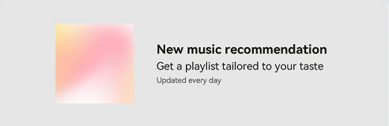

# SplitLayout


**SplitLayout** is a component that enables you to divide the available space vertically into separate sections, each of which can contain solely text or a combination of text and images.


> **NOTE**
>
> This component is supported since API version 10. Updates will be marked with a superscript to indicate their earliest API version.


## Modules to Import

```
import { SplitLayout } from '@kit.ArkUI';
```


## Child Components

Not supported

## Attributes
The [universal attributes](ts-component-general-attributes.md) are not supported.


## SplitLayout

SplitLayout({mainImage: Resource, primaryText: string, secondaryText?: string, tertiaryText?: string, container: () =&gt; void })

**Decorator**: @Component

**Atomic service API**: This API can be used in atomic services since API version 11.

**System capability**: SystemCapability.ArkUI.ArkUI.Full

| Name| Type| Mandatory| Decorator       | Description    |
| -------- | -------- | -------- |---------------|--------|
| mainImage | [ResourceStr](ts-types.md#resourcestr) | Yes| @State | Image. |
| primaryText | [ResourceStr](ts-types.md#resourcestr) | Yes| @Prop         | Title. |
| secondaryText | [ResourceStr](ts-types.md#resourcestr) | No| @Prop         | Subtitle.|
| tertiaryText | [ResourceStr](ts-types.md#resourcestr) | No| @Prop         | Auxiliary text. |
| container | () =&gt; void | Yes| @BuilderParam | Container in the component.|

## Events
The [universal events](ts-component-general-events.md) are not supported.

## Example
This example demonstrates how to use **SplitLayout** to achieve a page layout that is both adaptable and responsive.
```ts
import { SplitLayout } from '@kit.ArkUI';

@Entry
@Component
struct Index {
  @State demoImage: Resource = $r("app.media.background");

  build() {
    Column() {
      SplitLayout({
        mainImage: this.demoImage,
        primaryText:'New music recommendation',
        secondaryText: 'Get a playlist tailored to your taste;',
        tertiaryText: 'Updated every day',
      }) {
        Text('Example: Components can be added to a blank area container.')
          .margin({ top: 36 })
      }
    }
    .justifyContent(FlexAlign.SpaceBetween)
    .height('100%')
    .width('100%')
  }
}
```


Layout less than 600 vp:


Layout between 600 vp and 840 vp:





Layout greater than 840 vp:


