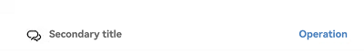
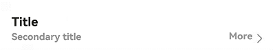
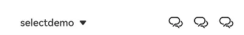
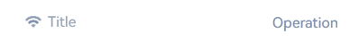
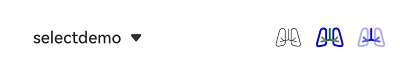
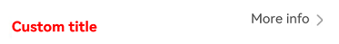
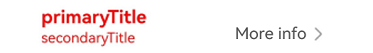
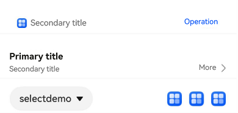
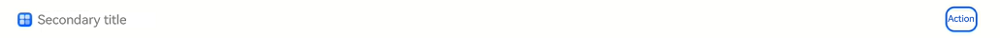

# SubHeader


The **SubHeader** component represents a subheader that signifies the top of a list or the beginning a subdivision of content and tells the user what the list or subdivision is about.


> **NOTE**
>
> This component is supported since API version 10. Updates will be marked with a superscript to indicate their earliest API version.
>
> This component is not supported on wearables.


## Modules to Import

```ts
import { SubHeader } from '@kit.ArkUI';
```


## Child Components

Not supported

## Attributes

The [universal attributes](ts-component-general-attributes.md) are not supported.

> **NOTE**
>
> Text-related settings are not supported.

## SubHeader

SubHeader({icon?: ResourceStr, iconSymbolOptions?: SymbolOptions, primaryTitle?: ResourceStr, secondaryTitle?:
ResourceStr, select?: SelectOptions, operationType?: OperationType, operationItem?: Array&lt;OperationOption&gt;,
operationSymbolOptions?: Array&lt;SymbolOptions&gt;, primaryTitleModifier?: TextModifier, secondaryTitleModifier?:
TextModifier, titleBuilder?: () => void, contentMargin?: LocalizedMargin, contentPadding?: LocalizedPadding})

**Decorator**: @Component

**System capability**: SystemCapability.ArkUI.ArkUI.Full

| Name| Type| Mandatory| Decorator        | Description|
| -------- | -------- | -------- |---------------| -------- |
| icon | [ResourceStr](ts-types.md#resourcestr) | No| \@Prop        | Icon.<br>**Atomic service API**: This API can be used in atomic services since API version 11.|
| iconSymbolOptions<sup>12+</sup> | [SymbolOptions](#symboloptions12) | No| -             | Icon symbol options. This parameter is available when **icon** is set to a [symbol glyph](ts-basic-components-symbolGlyph.md).<br>**Atomic service API**: This API can be used in atomic services since API version 12.|
| primaryTitle | [ResourceStr](ts-types.md#resourcestr) | No| \@Prop        | Primary title.<br>**Atomic service API**: This API can be used in atomic services since API version 11.|
| secondaryTitle | [ResourceStr](ts-types.md#resourcestr) | No| \@Prop        | Secondary title.<br>**Atomic service API**: This API can be used in atomic services since API version 11.|
| select | [SelectOptions](#selectoptions) | No| -             | Content and events for selection.<br>**Atomic service API**: This API can be used in atomic services since API version 11.|
| operationType | [OperationType](#operationtype) | No| \@Prop        | Type of operation in the operation area (right).<br>Default value: **OperationType.BUTTON**<br>**Atomic service API**: This API can be used in atomic services since API version 11.|
| operationItem | Array&lt;[OperationOption](#operationoption)&gt; | No| -             | Items in the operation area (right).<br>**Atomic service API**: This API can be used in atomic services since API version 11.|
| operationSymbolOptions<sup>12+</sup> | Array&lt;[SymbolOptions](#symboloptions12)&gt; | No| -             | Icon symbol options.<br>This parameter is available when **operationType** is set to **OperationType.ICON_GROUP** and **operationItem** is set to an array of [symbol glyphs](ts-basic-components-symbolGlyph.md).<br>**Atomic service API**: This API can be used in atomic services since API version 12.|
| primaryTitleModifier<sup>12+</sup> | [TextModifier](ts-universal-attributes-attribute-modifier.md) | No| -             | Text attributes of the primary title, such as the font color, font size, and font weight.<br>**Atomic service API**: This API can be used in atomic services since API version 12.|
| secondaryTitleModifier<sup>12+</sup> | [TextModifier](ts-universal-attributes-attribute-modifier.md) | No| -             | Text attributes of the secondary title, such as the font color, font size, and font weight.<br>**Atomic service API**: This API can be used in atomic services since API version 12.|
| titleBuilder<sup>12+</sup> | () => void | No| @BuilderParam | Content of the custom title area.<br>**Atomic service API**: This API can be used in atomic services since API version 12.|
| contentMargin<sup>12+</sup> | [LocalizedMargin](ts-types.md#localizedmargin12) | No| @Prop         | Margin of the content. Negative numbers are not supported.<br>Default value:<br> `{start: LengthMetrics.resource(` <br> `$r('sys.float.margin_left'))`, <br> `end: LengthMetrics.resource(` <br> `$r('sys.float.margin_right'))}`<br>**Atomic service API**: This API can be used in atomic services since API version 12.|
| contentPadding<sup>12+</sup> | [LocalizedPadding](ts-types.md#localizedpadding12) | No| @Prop         | Padding of the content.<br>Default value:<br>If a secondary title, with or without an icon, is displayed on the left:<br> {start: LengthMetrics.vp(12), end: LengthMetrics.vp(12)}<br>**Atomic service API**: This API can be used in atomic services since API version 12.|


## OperationType

**Atomic service API**: This API can be used in atomic services since API version 11.

**System capability**: SystemCapability.ArkUI.ArkUI.Full

| Name| Value| Description|
| -------- | -------- | -------- |
| TEXT_ARROW |  0  | Text button with a right arrow.|
| BUTTON |  1  |  Text button without a right arrow.|
| ICON_GROUP |  2  |  Icon-attached button (A maximum of three icons can be configured.)|
| LOADING |  3  |  Loading animation.|

## SelectOptions

**System capability**: SystemCapability.ArkUI.ArkUI.Full

| Name| Type| Mandatory| Description                                                                                                                                                          |
| -------- | -------- | -------- |--------------------------------------------------------------------------------------------------------------------------------------------------------------|
| options | Array&lt;[SelectOption](ts-basic-components-select.md#selectoption)&gt; | Yes| Options of an item in the drop-down list box.<br>**Atomic service API**: This API can be used in atomic services since API version 11.                                                                                                |
| selected | number | No| Index of the initially selected item in the drop-down list box.<br>The value must be greater than or equal to -1.<br>The index of the first item is 0.<br>If this property is not set, the default value **-1** is used, indicating that the option is not selected.<br>Values less than -1 are treated as no selection.<br>**Atomic service API**: This API can be used in atomic services since API version 11.|
| value | [ResourceStr](ts-types.md#resourcestr) | No| Text content of the drop-down list button itself.<br>The default value is an empty string.<br>**NOTE**<br>If the text length exceeds the column width, it will be truncated. The Resource type is supported since API version 20.<br>**Atomic service API**: This API can be used in atomic services since API version 11.                      |
| onSelect | (index: number, value?: string) =&gt; void | No| Callback invoked when an item in the drop-down list box is selected.<br>- **index**: index of the selected option.<br>- **value**: value of the selected option.<br>**Atomic service API**: This API can be used in atomic services since API version 11.                                          |
| defaultFocus<sup>18+</sup> | boolean | No| Whether the drop-down button is the default focus.<br>**true**: The drop-down button is the default focus.<br>**false**: The drop-down button is not the default focus.<br>Default value: **false**<br>**Atomic service API**: This API can be used in atomic services since API version 18.                                |

## OperationOption

**System capability**: SystemCapability.ArkUI.ArkUI.Full

| Name| Type| Mandatory| Description                                                                                                                                                                                                                                                      |
| -------- | -------- | -------- |----------------------------------------------------------------------------------------------------------------------------------------------------------------------------------------------------------------------------------------------------------|
| value | [ResourceStr](ts-types.md#resourcestr) | Yes| Text content.<br>**Atomic service API**: This API can be used in atomic services since API version 11.                                                                                                                                                                                                                                                 |
| action | ()=&gt;void | No| Event.<br>**Atomic service API**: This API can be used in atomic services since API version 11.                                                                                                                                                                                                                                                   |
| accessibilityLevel<sup>18+<sup>       | string  | No| Accessibility level. It determines whether the component can be recognized by accessibility services.<br>The options are as follows:<br>**"auto"**: It is treated as "yes" by the system.<br>**"yes"**: The component can be recognized by accessibility services.<br>**"no"**: The component cannot be recognized by accessibility services.<br>**"no-hide-descendants"**: Neither the component nor its child components can be recognized by accessibility services.<br>Default value: **"auto"**<br>**Atomic service API**: This API can be used in atomic services since API version 18.|
| accessibilityText<sup>18+<sup>        | ResourceStr | No| Accessibility text, that is, accessible label name. If a component does not contain text information, it will not be announced by the screen reader when selected. In this case, the screen reader user cannot know which component is selected. To solve this problem, you can set accessibility text for components without text information. When such a component is selected, the screen reader announces the specified accessibility text, informing the user which component is selected.<br>Default value: value of the **value** property if the operation type is **TEXT_ARROW** or **BUTTON** and an empty string otherwise.<br>**Atomic service API**: This API can be used in atomic services since API version 18.|
| accessibilityDescription<sup>18+<sup> | ResourceStr | No| Accessible description. You can provide comprehensive text explanations to help users understand the operation they are about to perform and its potential consequences, especially when these cannot be inferred from the component's attributes and accessibility text alone. If a component contains both text information and the accessible description, the text is announced first and then the accessible description, when the component is selected.<br>Default value: "Loading" when the operation type is **LOADING** and **"Double-tap to activate"** otherwise.<br>**Atomic service API**: This API can be used in atomic services since API version 18.       |
| defaultFocus<sup>18+</sup> | boolean | No| Whether to receive default focus.<br>**true**: Receive default focus.<br>**false**: Do not receive default focus.<br>Default value: **false**<br>**Atomic service API**: This API can be used in atomic services since API version 18.                                                                                                                                           |
## SymbolOptions<sup>12+</sup>

**Atomic service API**: This API can be used in atomic services since API version 12.

**System capability**: SystemCapability.ArkUI.ArkUI.Full

| Name| Type| Mandatory| Description                                                                                                                                                                                                                                             |
| -------- | -------- | -------- |-------------------------------------------------------------------------------------------------------------------------------------------------------------------------------------------------------------------------------------------------|
| fontColor | Array&lt;[ResourceColor](ts-types.md#resourcecolor)&gt; | No| Color of the [symbol glyph](ts-basic-components-symbolGlyph.md).<br>Default value: depending on the rendering strategy                                                                                                                                                                      |
| fontSize | number \|string \|[Resource](ts-types.md#resource) | No| Size of the [symbol glyph](ts-basic-components-symbolGlyph.md).<br>The value must be greater than or equal to 0.<br>Default value: system default value                                                                                                                                                             |
| fontWeight | number \| [FontWeight](ts-appendix-enums.md#fontweight) \| string | No| Weight of the [symbol glyph](ts-basic-components-symbolGlyph.md).<br>For the number type, the value ranges from 100 to 900, at an interval of 100. A larger value indicates a heavier weight. The default value is **400**.<br>For the string type, only strings of the number type are supported, for example, **"400"**, **"bold"**, **"bolder"**, **"lighter"**, **"regular"**, and **"medium"**, which correspond to the enumerated values in **FontWeight**.<br>Default value: **FontWeight.Normal**.|
| renderingStrategy | [SymbolRenderingStrategy](ts-basic-components-symbolGlyph.md#symbolrenderingstrategy11) | No| Rendering strategy of the [symbol glyph](ts-basic-components-symbolGlyph.md).<br>Default value: **SymbolRenderingStrategy.SINGLE**.<br>**NOTE**<br>For the resources referenced in **$r('sys.symbol.ohos_*')**, only **ohos_trash_circle**, **ohos_folder_badge_plus**, and **ohos_lungs** support the **MULTIPLE_COLOR** modes.                                      |
| effectStrategy | [SymbolEffectStrategy](ts-basic-components-symbolGlyph.md#symboleffectstrategy11) | No| Effect strategy of the [symbol glyph](ts-basic-components-symbolGlyph.md).<br>Default value: **SymbolEffectStrategy.NONE**<br>**NOTE**<br>For the resources referenced in **$r('sys.symbol.ohos_*')**, only **ohos_wifi** supports the hierarchical effect.                                                                                      |

## Events
The [universal events](ts-component-general-events.md) are not supported.

## Example
### Example 1: Implementing an Efficiency-Oriented Subheader
This example demonstrates how to implement a subheader where the left side contains an icon and a secondary title, and the right side has a text button.

```ts
import { Prompt, OperationType, SubHeader } from '@kit.ArkUI';

@Entry
@Component
struct SubHeaderExample {
  build() {
    Column() {
      SubHeader({
        icon: $r('sys.media.ohos_ic_public_email'),
        secondaryTitle: 'Secondary title',
        operationType: OperationType.BUTTON,
        operationItem: [{
          value: 'Operation',
          action: () => {
            Prompt.showToast({ message: 'demo' });
          }
        }]
      })
    }
  }
}
```



### Example 2: Implementing a Double-Line Text Content-Rich Subheader
This example showcases a subheader with a primary title and a secondary title on the left, and a text button with a right arrow on the right.

```ts
import { Prompt, OperationType, SubHeader } from '@kit.ArkUI';

@Entry
@Component
struct SubHeaderExample {
  build() {
    Column() {
      SubHeader({
        primaryTitle: 'Primary title',
        secondaryTitle: 'Secondary title',
        operationType: OperationType.TEXT_ARROW,
        operationItem: [{
          value: 'More',
          action: () => {
            Prompt.showToast({ message: 'demo' });
          }
        }]
      })
    }
  }
}
```



### Example 3: Implementing a Spinner Content-Rich Subheader
This example showcases a subheader with content and events for selection on the left, and an icon-attached button on the right.

```ts
import { Prompt, OperationType, SubHeader } from '@kit.ArkUI';

@Entry
@Component
struct SubHeaderExample {
  build() {
    Column() {
      SubHeader({
        // The left side is a drop-down box for selection.
        select: {
          options: [{ value: 'aaa' }, { value: 'bbb' }, { value: 'ccc' }],
          value: 'selectDemo',
          selected: 2,
          onSelect: () => {
            Prompt.showToast({ message: 'demo' });
          }
        },
        operationType: OperationType.ICON_GROUP,
        // The right side has three icons.
        operationItem: [{
          value: $r('sys.media.ohos_ic_public_email'),
          action: () => {
            Prompt.showToast({ message: 'demo' })
          }
        }, {
          value: $r('sys.media.ohos_ic_public_email'),
          action: () => {
            Prompt.showToast({ message: 'demo' });
          }
        }, {
          value: $r('sys.media.ohos_ic_public_email'),
          action: () => {
            Prompt.showToast({ message: 'demo' });
          }
        }]
      })
    }
  }
}
```



### Example 4: Setting the Icon Symbol for the Left Side
This example demonstrates how to set the icon symbol for the left side of the subheader.

```ts

import { Prompt, OperationType, SubHeader } from '@kit.ArkUI';

@Entry
@Component
struct SubHeaderExample {
  build() {
    Column() {
      SubHeader({
        // Set the icon to a symbol icon.
        icon: $r('sys.symbol.ohos_wifi'),
        iconSymbolOptions: {
          effectStrategy: SymbolEffectStrategy.HIERARCHICAL,
        },
        secondaryTitle: 'Title',
        operationType: OperationType.BUTTON,
        operationItem: [{
          value: 'Operation',
          action: () => {
            Prompt.showToast({ message: 'demo' });
          }
        }]
      })
    }
  }
}
```



### Example 5: Setting the Icon Symbol for the Right Side
The following example shows how to set **operationType** to **OperationType.ICON_GROUP** for the right side of the subheader, with **operationItem** set to a symbol icon.

```ts
import { Prompt, OperationType, SubHeader } from '@kit.ArkUI';

@Entry
@Component
struct SubHeaderExample {
  build() {
    Column() {
      SubHeader({
        // Set the left side to a drop-down box for selection.
        select: {
          options: [{ value: 'aaa' }, { value: 'bbb' }, { value: 'ccc' }],
          value: 'selectDemo',
          selected: 2,
          onSelect: () => {
            Prompt.showToast({ message: 'demo' });
          }
        },
        operationType: OperationType.ICON_GROUP,
        // Set the right side to icons.
        operationItem: [{
          value: $r('sys.symbol.ohos_lungs'),
          action: () => {
            Prompt.showToast({ message: 'icon1' });
          }
        }, {
          value: $r('sys.symbol.ohos_lungs'),
          action: () => {
            Prompt.showToast({ message: 'icon2' });
          }
        }, {
          value: $r('sys.symbol.ohos_lungs'),
          action: () => {
            Prompt.showToast({ message: 'icon3' });
          }
        }],
        // Set the symbol style for the right side icons.
        operationSymbolOptions: [{
          fontWeight: FontWeight.Lighter,
        }, {
          renderingStrategy: SymbolRenderingStrategy.MULTIPLE_COLOR,
          fontColor: [Color.Blue, Color.Grey, Color.Green],
        }, {
          renderingStrategy: SymbolRenderingStrategy.MULTIPLE_OPACITY,
          fontColor: [Color.Blue, Color.Grey, Color.Green],
        }]
      })
    }
  }
}
```



### Example 6: Customizing Title Content
 This example demonstrates how to customize the title content with a **titleBuilder** object for the subheader.

```ts
import { Prompt, OperationType, SubHeader } from '@kit.ArkUI';

@Entry
@Component
struct SubHeaderExample {
  // Set the custom title on the left side.
  @Builder
  TitleBuilder(): void {
    Text('Custom title')
      .fontSize(24)
      .fontColor(Color.Blue)
      .fontWeight(FontWeight.Bold)
  }

  build() {
    Column() {
      SubHeader({
        // Call the custom title builder.
        titleBuilder: () => {
          this.TitleBuilder();
        },
        primaryTitle: 'Primary title',
        secondaryTitle: 'Secondary title',
        icon: $r('sys.symbol.ohos_star'),
        operationType: OperationType.TEXT_ARROW,
        operationItem: [{
          value: 'More info',
          action: () => {
            Prompt.showToast({ message: 'demo' });
          }
        }]
      })
    }
  }
}
```


### Example 7: Customizing the Title Style
This example demonstrates how to set the font style, margin, and padding for the primary and secondary titles in the subheader.

```ts
import { Prompt, OperationType, SubHeader, LengthMetrics, TextModifier } from '@kit.ArkUI';

@Entry
@Component
struct SubHeaderExample {
  // Set the font color for the primary and secondary titles.
  @State primaryModifier: TextModifier = new TextModifier().fontColor(Color.Blue);
  @State secondaryModifier: TextModifier = new TextModifier().fontColor(Color.Blue);

  build() {
    Column() {
      SubHeader({
        primaryTitle: 'primaryTitle',
        secondaryTitle: 'secondaryTitle',
        primaryTitleModifier: this.primaryModifier,
        secondaryTitleModifier: this.secondaryModifier,
        operationType: OperationType.TEXT_ARROW,
        operationItem: [{
          value: 'More info',
          action: () => {
            Prompt.showToast({ message: 'demo' });
          }
        }],
        // Set the margin and padding for the subheader.
        contentMargin: { start: LengthMetrics.vp(20), end: LengthMetrics.vp(20) },
        contentPadding: { start: LengthMetrics.vp(20), end: LengthMetrics.vp(20) }
      })
    }
  }
}
```




### Example 8: Implementing Announcement for the Button on the Right Side
This example customizes the screen reader announcement text by setting the **accessibilityText**, **accessibilityDescription**, and **accessibilityLevel** properties of the button on the right side of the subheader. This functionality is supported since API version 18.
```ts
import { Prompt, OperationType, SubHeader } from '@kit.ArkUI';

@Entry
@Component
struct SubHeaderExample {
  build() {
    Column() {
      Divider().color('grey').width('100%').height('2vp')
      SubHeader({
        // Icon + secondary title, with a button on the right
        icon: $r('sys.media.ohos_ic_public_email'),
        secondaryTitle: 'Secondary title',
        operationType: OperationType.BUTTON,
        operationItem: [{
          value: 'Operation',
          action: () => {
            Prompt.showToast({ message: 'demo' })
          }
        }]
      })
      Divider().color('grey').width('100%').height('2vp')
      SubHeader({
        // Text button with right arrow on the right
        primaryTitle: 'Primary title',
        secondaryTitle: 'Secondary title',
        operationType: OperationType.TEXT_ARROW,
        operationItem: [{
          value: 'More',
          action: () => {
            Prompt.showToast({ message: 'demo' })
          }
        }]
      })
      Divider().color('grey').width('100%').height('2vp')
      SubHeader({
        // Selection on the left and icons (focused in sequence) on the right
        select: {
          options: [{ value: 'aaa' }, { value: 'bbb' }, { value: 'ccc' }],
          value: 'selectDemo',
          selected: 0,
          onSelect: (index: number, value?: string) => {
            console.log(`subheader onselect index : ${index}, value: ${value}`);
          }
        },
        operationType: OperationType.ICON_GROUP,
        operationItem: [{
          value: $r('sys.media.ohos_ic_public_email'),
          accessibilityText: 'Icon 1',
          accessibilityLevel: 'yes',
        }, {
          value: $r('sys.media.ohos_ic_public_email'),
          accessibilityText: 'Icon 2',
          accessibilityLevel: 'no',
        }, {
          value: $r('sys.media.ohos_ic_public_email'),
          accessibilityText: 'Icon 3',
          accessibilityDescription: 'Tap to operate icon 3',
        }]
      })
      Divider().color('grey').width('100%').height('2vp')
    }
  }
}
```


### Example 9: Enabling the Button on the Right Side to Receive Default Focus
This example demonstrates how to use **defaultFocus** to enable the button on the right side of the subheader to receive default focus. This functionality is supported since API version 18.
```ts
import { Prompt, OperationType, SubHeader } from '@kit.ArkUI';

@Entry
@Component
struct SubHeaderExample {
  build() {
    Column() {
      SubHeader({
        // Icon + secondary title, with a button on the right
        icon: $r('app.media.app_icon'),
        secondaryTitle: 'Secondary title',
        operationType: OperationType.BUTTON,
        operationItem: [{
          value: 'Action',
          defaultFocus: true,
          action: () => {
            Prompt.showToast({ message: 'demo' })
          }
        }]
      })
    }
  }
}
```

