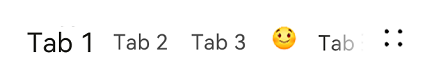

# TabTitleBar


The tab title bar is used to switch between tabs pages. It is applicable only to level-1 pages.


> **NOTE**
>
> This component is supported since API version 10. Updates will be marked with a superscript to indicate their earliest API version.


## Modules to Import

```
import { TabTitleBar } from '@kit.ArkUI'
```


## Child Components

Not supported

## Attributes
The [universal attributes](ts-universal-attributes-size.md) are not supported.


## TabTitleBar

TabTitleBar({tabItems: Array&lt;TabTitleBarTabItem&gt;, menuItems?: Array&lt;TabTitleBarMenuItem&gt;, swiperContent: () =&gt; void})

**Decorator**: @Component

**Atomic service API**: This API can be used in atomic services since API version 11.

**System capability**: SystemCapability.ArkUI.ArkUI.Full

**Parameters**

| Name| Type| Mandatory| Decorator| Description|
| -------- | -------- | -------- | -------- | -------- |
| tabItems | Array&lt;[TabTitleBarTabItem](#tabtitlebartabitem)&gt; | Yes| - | List of tab items on the left of the title bar.|
| menuItems | Array&lt;[TabTitleBarMenuItem](#tabtitlebarmenuitem)&gt; | No| - | List of menu items on the right of the title bar.|
| swiperContent | () =&gt; void | Yes| \@BuilderParam | Constructor for page content pertaining to the tab list.|

## TabTitleBarMenuItem

**Atomic service API**: This API can be used in atomic services since API version 11.

| Name| Type| Mandatory| Description|
| -------- | -------- | -------- | -------- |
| value | [ResourceStr](ts-types.md#resourcestr) | Yes| Icon resource.|
| label<sup>13+</sup> | [ResourceStr](ts-types.md#resourcestr) | No| Icon label.|
| isEnabled | boolean | No| Whether to enable the item.<br> Default value: **true**<br> The value **true** means to enable the item, and **false** means the opposite.|
| action | () =&gt; void | No| Action to perform.|

## TabTitleBarTabItem

**Atomic service API**: This API can be used in atomic services since API version 11.

| Name| Type| Mandatory| Description|
| -------- | -------- | -------- | -------- |
| title | [ResourceStr](ts-types.md#resourcestr) | Yes| Text of the tab.|
| icon | [ResourceStr](ts-types.md#resourcestr) | No| Icon of the tab.|


## Events
The [universal events](ts-universal-events-click.md) are not supported.

## Example

```ts
import { TabTitleBar, promptAction } from '@kit.ArkUI'

class tabItem {
  title: ResourceStr;
  icon?: ResourceStr;
  constructor(title: ResourceStr,icon?: ResourceStr) {
    this.title = title
    this.icon = icon
  }
}

interface menuItem {
  value: ResourceStr;
  isEnabled?: boolean;
  action?: () => void
}

@Entry
@Component
struct Index {
  @Builder
  componentBuilder() {
    Text("#1ABC9C\nTURQUOISE")
      .fontWeight(FontWeight.Bold)
      .fontSize(14)
      .width("100%")
      .textAlign(TextAlign.Center)
      .fontColor("#CCFFFFFF")
      .backgroundColor("#1ABC9C")
    Text("#16A085\nGREEN SEA")
      .fontWeight(FontWeight.Bold)
      .fontSize(14)
      .width("100%")
      .textAlign(TextAlign.Center)
      .fontColor("#CCFFFFFF")
      .backgroundColor("#16A085")
    Text("#2ECC71\nEMERALD")
      .fontWeight(FontWeight.Bold)
      .fontSize(14)
      .width("100%")
      .textAlign(TextAlign.Center)
      .fontColor("#CCFFFFFF")
      .backgroundColor("#2ECC71")
    Text("#27AE60\nNEPHRITIS")
      .fontWeight(FontWeight.Bold)
      .fontSize(14)
      .width("100%")
      .textAlign(TextAlign.Center)
      .fontColor("#CCFFFFFF")
      .backgroundColor("#27AE60")
    Text("#3498DB\nPETER RIVER")
      .fontWeight(FontWeight.Bold)
      .fontSize(14)
      .width("100%")
      .textAlign(TextAlign.Center)
      .fontColor("#CCFFFFFF")
      .backgroundColor("#3498DB")
  }

  private readonly tabItems: Array<tabItem> = [new tabItem('Tab 1'),new tabItem('Tab 2'),new tabItem('Tab 3'),new tabItem("Happy",$r('app.media.emoji_happy')),new tabItem('Tab 4')]
  private  readonly menuItems: Array<menuItem> = [
    {
      value: $r('app.media.ic_public_reduce'),
      isEnabled: true,
      action: () => promptAction.showToast({ message: "on item click! index 0" })
    },
    {
      value: $r('app.media.ic_public_edit'),
      isEnabled: true,
      action: () => promptAction.showToast({ message: "on item click! index 1" })
    },
    {
      value: $r('app.media.ic_public_save'),
      isEnabled: true,
      action: () => promptAction.showToast({ message: "on item click! index 2" })
    },
  ]

  build() {
    Row() {
      Column() {
        TabTitleBar({
          swiperContent: this.componentBuilder,
          tabItems: this.tabItems,
          menuItems: this.menuItems,
        })
      }.width('100%')
    }.height('100%')
  }
}
```


