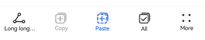
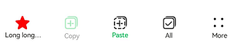

# ToolBar


The **Toolbar** component is designed to present a set of action options related to the current screen, displayed at the bottom of the screen. It can display up to five child components. If there are six or more child components, the first four are shown directly, and the additional ones are grouped under a **More** item on the rightmost side of the toolbar.


> **NOTE**
>
> This component is supported since API version 10. Updates will be marked with a superscript to indicate their earliest API version.
>
> This component is not supported on wearables.


## Modules to Import

```ts
import { SymbolGlyphModifier, DividerModifier, ToolBar, ToolBarOptions, ToolBarModifier, ItemState, LengthMetrics } from '@kit.ArkUI';
```


## Child Components

Not supported

## Attributes
The [universal attributes](ts-component-general-attributes.md) are not supported.

## ToolBar

Toolbar({toolBarList: ToolBarOptions, activateIndex?: number, controller: TabsController, dividerModifier?: DividerModifier, toolBarModifier?: ToolBarModifier})

**Decorator**: @Component

**System capability**: SystemCapability.ArkUI.ArkUI.Full

| Name                         | Type                                                        | Mandatory| Decorator | Description                                                                                                                                                            |
| ----------------------------- | ------------------------------------------------------------ | ---- | ----------- |----------------------------------------------------------------------------------------------------------------------------------------------------------------|
| toolBarList                   | [ToolBarOptions](#toolbaroptions)                            | Yes  | @ObjectLink | Toolbar list.<br>**Atomic service API**: This API can be used in atomic services since API version 11.                                                                                                    |
| activateIndex                 | number                                                       | No  | @Prop       | Index of the active item.<br>The value must be greater than or equal to -1.<br>The default value is **-1**, indicating that there is no active item. Values less than -1 are treated as no active item.<br>**Atomic service API**: This API can be used in atomic services since API version 11.                                          |
| controller                    | [TabsController](ts-container-tabs.md#tabscontroller)        | Yes  | -           | Toolbar controller, which cannot be used for controlling individual toolbar items.<br>**Atomic service API**: This API can be used in atomic services since API version 11.                                                                                        |
| dividerModifier<sup>13+</sup> | [DividerModifier](ts-universal-attributes-attribute-modifier.md) | No  | @Prop       | Modifier for the toolbar header divider, which can be used to customize the divider's height, color, and other attributes.<br>Default value: system default value<br>**Atomic service API**: This API can be used in atomic services since API version 13.                                                                   |
| toolBarModifier<sup>13+</sup> | [ToolBarModifier](#toolbarmodifier13)                        | No  | @Prop       | Modifier for the toolbar, which can be used to set the toolbar's height, background color, padding (which only takes effect when there are fewer than five toolbar items), and whether to display the pressed state.<br>Default value:<br>Height of the toolbar: **56vp**<br>Background color: **ohos_id_toolbar_bg**<br>Padding: **24vp**<br>Whether to display the pressed state: yes<br>**Atomic service API**: This API can be used in atomic services since API version 13.|

## ToolBarOptions

Inherits Array<[ToolBarOption](#toolbaroption)>.

**Decorator Type**: \@Observed

**Atomic service API**: This API can be used in atomic services since API version 11.

**System capability**: SystemCapability.ArkUI.ArkUI.Full

## ToolBarOption

**Decorator Type**: \@Observed

**System capability**: SystemCapability.ArkUI.ArkUI.Full

| Name                                    | Type                                                       | Mandatory| Description                                                                                                                                                                                                                                                    |
|----------------------------------------|-----------------------------------------------------------| -------- |--------------------------------------------------------------------------------------------------------------------------------------------------------------------------------------------------------------------------------------------------------|
| content                                | [ResourceStr](ts-types.md#resourcestr)                    | Yes| Text of the toolbar item.<br>**Atomic service API**: This API can be used in atomic services since API version 11.                                                                                                                                                                                         |
| action                                 | () =&gt; void                                   | No| Click event of the toolbar item.<br>**Atomic service API**: This API can be used in atomic services since API version 11.                                                                                                                                                                                        |
| icon                                   | [Resource](ts-types.md#resource)                          | No| Icon of the toolbar item.<br>If **toolBarSymbolOptions** has input parameters, **icon** is ineffective.<br>**Atomic service API**: This API can be used in atomic services since API version 11.                                                                                                                                                 |
| state                                  | [ItemState](#itemstate)                                   | No| State of the toolbar item.<br>Default value: **ENABLE**<br>**Atomic service API**: This API can be used in atomic services since API version 11.                                                                                                                                                                          |
| iconColor<sup>13+</sup>                | [ResourceColor](ts-types.md#resourcecolor)                | No| Icon fill color of the toolbar item.<br>Default value: **$r('sys.color.icon_primary')**<br>**Atomic service API**: This API can be used in atomic services since API version 13.                                                                                                                                               |
| activatedIconColor<sup>13+</sup>       | [ResourceColor](ts-types.md#resourcecolor)                | No| Icon fill color of the toolbar option in the activated state.<br>Default value: **$r('sys.color.icon_emphasize')**<br>**Atomic service API**: This API can be used in atomic services since API version 13.                                                                                                                                          |
| textColor<sup>13+</sup>                | [ResourceColor](ts-types.md#resourcecolor)                | No| Font color of the toolbar item.<br>Default value: **$r('sys.color.font_primary')**<br>**Atomic service API**: This API can be used in atomic services since API version 13.                                                                                                                                                 |
| activatedTextColor<sup>13+</sup>       | [ResourceColor](ts-types.md#resourcecolor)                | No| Font color of the toolbar item in the activated state.<br>Default value: **$r('sys.color.font_emphasize')**<br>**Atomic service API**: This API can be used in atomic services since API version 13.                                                                                                                                            |
| toolBarSymbolOptions<sup>13+</sup>     | [ToolBarSymbolGlyphOptions](#toolbarsymbolglyphoptions13) | No| Icon symbol options of the toolbar item.<br>**Atomic service API**: This API can be used in atomic services since API version 13.                                                                                                                                                                              |
| accessibilityText<sup>18+</sup>        | [ResourceStr](ts-types.md#resourcestr)                    | No| Accessibility text, that is, accessible label name, of the toolbar item. If a component does not contain text information, it will not be announced by the screen reader when selected. In this case, the screen reader user cannot know which component is selected. To solve this problem, you can set accessibility text for components without text information. When such a component is selected, the screen reader announces the specified accessibility text, informing the user which component is selected.<br>Default value: value of **content**<br>**Atomic service API**: This API can be used in atomic services since API version 18.                                                                                                                                                            |
| accessibilityDescription<sup>18+</sup> | [ResourceStr](ts-types.md#resourcestr)                    | No| Accessible description of the toolbar item. You can provide comprehensive text explanations to help users understand the operation they are about to perform and its potential consequences, especially when these cannot be inferred from the component's attributes and accessibility text alone. If a component contains both text information and the accessible description, the text is announced first and then the accessible description, when the component is selected.<br>Default value: **"Double-tap to activate"**<br>**Atomic service API**: This API can be used in atomic services since API version 18.                                                                                                                                                   |
| accessibilityLevel<sup>18+</sup>       | string                                                    | No| Accessibility level of the toolbar item. It determines whether the component can be recognized by accessibility services.<br>The options are as follows:<br>**"auto"**: It is treated as "yes" by the system.<br>**"yes"**: The component can be recognized by accessibility services.<br>**"no"**: The component cannot be recognized by accessibility services.<br>**"no-hide-descendants"**: Neither the component nor its child components can be recognized by accessibility services.<br>Default value: **"auto"**<br>**Atomic service API**: This API can be used in atomic services since API version 18.|

## ToolBarModifier<sup>13+</sup>
Provides APIs for setting the height (**height**), background color (**backgroundColor**), left and right padding (**padding**, which only takes effect when there are fewer than five items) of the toolbar, and whether to display the pressed state effect (**stateEffect**).

**Atomic service API**: This API can be used in atomic services since API version 13.

### backgroundColor

backgroundColor(backgroundColor: ResourceColor): ToolBarModifier

Sets the background color of the toolbar. By overriding this API, you can implement custom drawing for the background color of the toolbar.

**Atomic service API**: This API can be used in atomic services since API version 13.

**System capability**: SystemCapability.ArkUI.ArkUI.Full

**Parameters**

| Name | Type                                                  | Mandatory| Description                                                              |
| ------- | ------------------------------------------------------ | ---- |------------------------------------------------------------------|
| backgroundColor | [ResourceColor](ts-types.md#resourcecolor) | Yes  | Toolbar background color<br>Default value: **$r('sys.color.ohos_id_color_toolbar_bg')**|

**Return value**

| Type                                   | Description                                   |
|---------------------------------------|---------------------------------------|
| [ToolBarModifier](#toolbarmodifier13) | **ToolBarModifier** object after the background color is set.|

### padding

padding(padding: LengthMetrics): ToolBarModifier

Sets the left and right padding of the toolbar. By overriding this API, you can implement custom drawing for the left and right padding of the toolbar.

**Atomic service API**: This API can be used in atomic services since API version 13.

**System capability**: SystemCapability.ArkUI.ArkUI.Full

**Parameters**

| Name | Type    | Mandatory| Description                                                                                 |
| ------- |--------| ---- |-------------------------------------------------------------------------------------|
| padding | [LengthMetrics](../js-apis-arkui-graphics.md#lengthmetrics12)<sup>12+</sup> | Yes  | Left and right padding of the toolbar, which is effective only when there are fewer than five items.<br>By default, the padding is 24 vp when there are fewer than five items and 0 when there are five or more items.|

**Return value**

| Type                                   | Description                                   |
|---------------------------------------|---------------------------------------|
| [ToolBarModifier](#toolbarmodifier13) | **ToolBarModifier** object after the padding is set.|

### height

height(height: LengthMetrics): ToolBarModifier

Sets the height of the toolbar. By overriding this API, you can implement custom drawing for the height of the toolbar, which does not include the height of the divider.

**Atomic service API**: This API can be used in atomic services since API version 13.

**System capability**: SystemCapability.ArkUI.ArkUI.Full

**Parameters**

| Name | Type                             | Mandatory| Description                                |
| ------- |---------------------------------| ---- |------------------------------------|
| height | [LengthMetrics](../js-apis-arkui-graphics.md#lengthmetrics12)<sup>12+</sup> | Yes  | Height of the toolbar.<br>The default height of the toolbar is 56 vp, which does not include the divider.|

**Return value**

| Type                                   | Description                                   |
|---------------------------------------|---------------------------------------|
| [ToolBarModifier](#toolbarmodifier13) | **ToolBarModifier** object after the height is set.|


### stateEffect

stateEffect(stateEffect: boolean): ToolBarModifier

Sets whether to display the pressed state effect.

**Atomic service API**: This API can be used in atomic services since API version 13.

**System capability**: SystemCapability.ArkUI.ArkUI.Full

**Parameters**

| Name | Type                            | Mandatory| Description                                                      |
| ------- |--------------------------------| ---- |----------------------------------------------------------|
| stateEffect | boolean | Yes  | Whether to display the pressed state effect on the toolbar.<br>The value **true** means to display the pressed state effect on the toolbar, and **false** means the opposite.<br>Default value: **true**|

**Return value**

| Type                                   | Description                                   |
|---------------------------------------|---------------------------------------|
| [ToolBarModifier](#toolbarmodifier13) | **ToolBarModifier** object after the pressed state effect is set.|

## ItemState

**Atomic service API**: This API can be used in atomic services since API version 11.

**System capability**: SystemCapability.ArkUI.ArkUI.Full

| Name| Value| Description|
| -------- | -------- | -------- |
| ENABLE | 1 | The toolbar item is enabled.|
| DISABLE | 2 | The toolbar item is disabled.|
| ACTIVATE | 3 | The toolbar item is activated.|

## ToolBarSymbolGlyphOptions<sup>13+</sup>

Defines the icon symbol options.

**Atomic service API**: This API can be used in atomic services since API version 13.

**System capability**: SystemCapability.ArkUI.ArkUI.Full

| Name  | Type      | Mandatory| Description                                                                                      |
| ------ | ---------- | ---- |------------------------------------------------------------------------------------------|
| normal | [SymbolGlyphModifier](ts-universal-attributes-attribute-modifier.md) | No  | Icon symbol of the toolbar item in normal state.<br>Default value: **fontColor: $r('sys.color.icon_primary'), fontSize: 24vp** |
| activated| [SymbolGlyphModifier](ts-universal-attributes-attribute-modifier.md) | No  | Icon symbol of the toolbar item in activated state.<br>Default value: **fontColor: $r('sys.color.icon_emphasize'), fontSize: 24vp**|

## Events
The [universal events](ts-component-general-events.md) are not supported.

## Example

### Example 1: Setting Toolbar Items to Different States
This example shows the various display effects when the **state** property of toolbar items is set to **ENABLE**, **DISABLE**, or **ACTIVATE**.
```ts
import { ToolBar, ToolBarOptions, ItemState } from '@kit.ArkUI';

@Entry
@Component
struct Index {
  @State toolbarList: ToolBarOptions = new ToolBarOptions();

  aboutToAppear() {
    this.toolbarList.push({
      content: 'Cut Super Long Text',
      icon: $r('sys.media.ohos_ic_public_share'),
      action: () => {
      },
    })
    this.toolbarList.push({
      content: 'Copy',
      icon: $r('sys.media.ohos_ic_public_copy'),
      action: () => {
      },
      state: ItemState.DISABLE
    })
    this.toolbarList.push({
      content: 'Paste',
      icon: $r('sys.media.ohos_ic_public_paste'),
      action: () => {
      },
      state: ItemState.ACTIVATE
    })
    this.toolbarList.push({
      content: 'Select All',
      icon: $r('sys.media.ohos_ic_public_select_all'),
      action: () => {
      },
    })
    this.toolbarList.push({
      content: 'Share',
      icon: $r('sys.media.ohos_ic_public_share'),
      action: () => {
      },
    })
    this.toolbarList.push({
      content: 'Share',
      icon: $r('sys.media.ohos_ic_public_share'),
      action: () => {
      },
    })
  }

  build() {
    Row() {
      Stack() {
        Column() {
          ToolBar({
            activateIndex: 2,
            toolBarList: this.toolbarList,
          })
        }
      }
      .align(Alignment.Bottom)
      .width('100%')
      .height('100%')
    }
  }
}
```



### Example 2: Customizing the Toolbar Style
This example demonstrates how to customize the toolbar's height, background color, and other styles using **ToolBarModifier**. This functionality is supported since API version 13.
```ts
import {
  SymbolGlyphModifier,
  DividerModifier,
  ToolBar,
  ToolBarOptions,
  ToolBarModifier,
  ItemState,
  LengthMetrics,
} from '@kit.ArkUI';

@Entry
@Component
struct Index {
  @State toolbarList: ToolBarOptions = new ToolBarOptions();
  // Custom toolbar style
  private toolBarModifier: ToolBarModifier =
    new ToolBarModifier().height(LengthMetrics.vp(52)).backgroundColor(Color.Transparent).stateEffect(false);
  @State dividerModifier: DividerModifier = new DividerModifier().height(0);

  aboutToAppear() {
    // Add toolbar items.
    this.toolbarList.push({
      content: 'Long long long long long long long long text',
      icon: $r('sys.media.ohos_ic_public_share'),
      action: () => {
      },
      state: ItemState.ACTIVATE,
      toolBarSymbolOptions: {
        normal: new SymbolGlyphModifier($r('sys.symbol.ohos_star')).fontColor([Color.Green]), // Symbol icon in the normal state.
        activated: new SymbolGlyphModifier($r('sys.symbol.ohos_star')).fontColor([Color.Red]), // Symbol icon in the activated state.
      },
      activatedTextColor: $r('sys.color.font_primary'),
    })
    this.toolbarList.push({
      content: 'Copy',
      icon: $r('sys.media.ohos_ic_public_copy'),
      action: () => {
      },
      state: ItemState.DISABLE,
      iconColor: '#ff18cb53',
      activatedIconColor: '#ffec5d5d', // Icon fill color of the toolbar item in the activated state.
      activatedTextColor: '#ffec5d5d', // Font color of the toolbar item in the activated state.
    })
    this.toolbarList.push({
      content: 'Paste',
      icon: $r('sys.media.ohos_ic_public_paste'),
      action: () => {
      },
      state: ItemState.ACTIVATE,
      textColor: '#ff18cb53',
    })
    this.toolbarList.push({
      content: 'All',
      icon: $r('sys.media.ohos_ic_public_select_all'),
      action: () => {
      },
      state: ItemState.ACTIVATE,
    })
    this.toolbarList.push({
      content: 'Share',
      icon: $r('sys.media.ohos_ic_public_share'),
      action: () => {
      },
    })
    this.toolbarList.push({
      content: 'Share',
      icon: $r('sys.media.ohos_ic_public_share'),
      action: () => {
      },
    })
  }

  build() {
    Row() {
      Stack() {
        Column() {
          ToolBar({
            toolBarModifier: this.toolBarModifier,
            dividerModifier: this.dividerModifier,
            activateIndex: 0,
            toolBarList: this.toolbarList,
          })
            .height(52)
        }
      }
      .align(Alignment.Bottom)
      .width('100%')
      .height('100%')
    }
  }
}
```




### Example 3: Implementing Screen Reader Announcement
This example customizes the screen reader announcement text by setting the **accessibilityText**, **accessibilityDescription**, and **accessibilityLevel** properties of the toolbar item. This functionality is supported since API version 18.
```ts
import { ToolBar, ToolBarOptions, ItemState } from '@kit.ArkUI';

@Entry
@Component
struct Index {
  @State toolbarList: ToolBarOptions = new ToolBarOptions();

  aboutToAppear() {
    // Add toolbar items.
    this.toolbarList.push({
      content: 'Cut Super Long Text',
      icon: $r('sys.media.ohos_ic_public_share'),
      action: () => {
      },
      accessibilityText: 'Clip', // Screen reader announcement for the item.
      accessibilityDescription: 'Double-tap to clip', // Screen reader announcement for the item.
      accessibilityLevel: 'yes' // Configure this element to be focused by accessibility screen readers.
    })
    this.toolbarList.push({
      content: 'Copy',
      icon: $r('sys.media.ohos_ic_public_copy'),
      action: () => {
      },
      state: ItemState.DISABLE,
      accessibilityLevel: 'no' // Configure this button to be not recognizable by screen readers.
    })
    this.toolbarList.push({
      content: 'Paste',
      icon: $r('sys.media.ohos_ic_public_paste'),
      action: () => {
      },
      state: ItemState.ACTIVATE
    })
    this.toolbarList.push({
      content: 'Select All',
      icon: $r('sys.media.ohos_ic_public_select_all'),
      action: () => {
      },
    })
    this.toolbarList.push({
      content: 'Share',
      icon: $r('sys.media.ohos_ic_public_share'),
      action: () => {
      },
    })
    this.toolbarList.push({
      content: 'Share',
      icon: $r('sys.media.ohos_ic_public_share'),
      action: () => {
      },
    })
  }

  build() {
    Row() {
      Stack() {
        Column() {
          ToolBar({
            activateIndex: 2,
            toolBarList: this.toolbarList,
          })
        }
      }
      .align(Alignment.Bottom)
      .width('100%')
      .height('100%')
    }
  }
}
```

