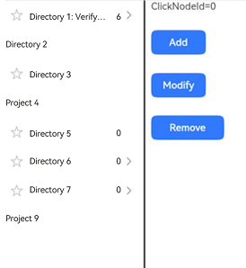
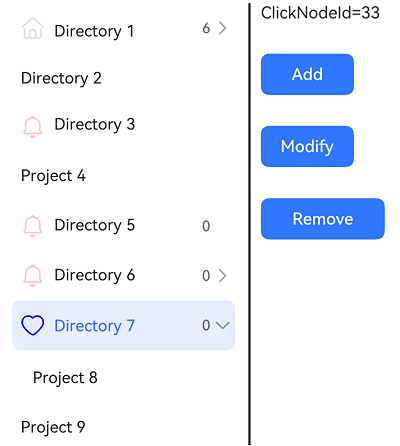

# TreeView


The **TreeView** component represents a tree view used to display a hierarchical list of items. Each item can contain subitems, which may be expanded or collapsed.


This component is applicable in productivity applications, such as side navigation bars in notepad, email, and Gallery applications.


> **NOTE**
>
> This component is supported since API version 10. Updates will be marked with a superscript to indicate their earliest API version.


## Modules to Import

```
import { TreeView } from "@kit.ArkUI"
```


## Child Components

Not supported

## Attributes
The [universal attributes](ts-component-general-attributes.md) are not supported.

## TreeView

TreeView({ treeController: TreeController })

**Decorator**: @Component

**Atomic service API**: This API can be used in atomic services since API version 11.

**System capability**: SystemCapability.ArkUI.ArkUI.Full


| Name| Type| Mandatory| Description|
| -------- | -------- | -------- | -------- |
| treeController | [TreeController](#treecontroller) | Yes| Node information of the tree view.|


## TreeController

Implements a **TreeController** object, which can be bound to a tree view component to control the node information of the component. One **TreeController** object can be bound to only one tree view component.

**Atomic service API**: This API can be used in atomic services since API version 11.

**System capability**: SystemCapability.ArkUI.ArkUI.Full


### addNode


addNode(nodeParam?: NodeParam): TreeController

Adds a child node to the selected node.

**Atomic service API**: This API can be used in atomic services since API version 11.

**System capability**: SystemCapability.ArkUI.ArkUI.Full


| Name| Type| Mandatory| Description|
| -------- | -------- | -------- | -------- |
| nodeParam | [NodeParam](#nodeparam) | No| Node information.|

**Return value**

| Type                             | Description                |
| --------------------------------- | -------------------- |
| [TreeController](#treecontroller) | Controller of the **TreeView** component.|

### removeNode

removeNode(): void

Removes the selected node.

**Atomic service API**: This API can be used in atomic services since API version 11.

**System capability**: SystemCapability.ArkUI.ArkUI.Full


### modifyNode


modifyNode(): void

Modifies the selected node.

**Atomic service API**: This API can be used in atomic services since API version 11.

**System capability**: SystemCapability.ArkUI.ArkUI.Full


### buildDone

buildDone(): void

Builds a tree view. After a node is added, this API must be called to save the tree information.

**Atomic service API**: This API can be used in atomic services since API version 11.

**System capability**: SystemCapability.ArkUI.ArkUI.Full


### refreshNode

refreshNode(parentId: number, parentSubTitle: ResourceStr, currentSubtitle: ResourceStr): void

Refreshes the tree view. You can call this API to update the information about the current node.

**Atomic service API**: This API can be used in atomic services since API version 11.

**System capability**: SystemCapability.ArkUI.ArkUI.Full

| Name| Type| Mandatory| Description|
| -------- | -------- | -------- | -------- |
| parentId | number | Yes| ID of the parent node.|
| parentSubTitle | [ResourceStr](ts-types.md#resourcestr) | Yes| Secondary text of the parent node.|
| currentSubtitle | [ResourceStr](ts-types.md#resourcestr) | Yes| Secondary text of the current node.|

## NodeParam

**System capability**: SystemCapability.ArkUI.ArkUI.Full

| Name| Type| Mandatory| Description                                                                                                                                              |
| -------- | -------- | -------- |--------------------------------------------------------------------------------------------------------------------------------------------------|
| parentNodeId | number | No| Parent node.<br>The value must be greater than or equal to -1.<br>Default value: -1. The root node ID is -1. If the value is less than -1, the setting does not take effect.<br>**Atomic service API**: This API can be used in atomic services since API version 11.                              |
| currentNodeId | number | No| Current child node.<br>The value must be greater than or equal to -1.<br>The value cannot be the root node ID, cannot be null, and cannot be duplicated.<br>Default value: **-1**<br>**Atomic service API**: This API can be used in atomic services since API version 11.|
| isFolder | boolean | No| Whether the node is a directory.<br> Default value: **false**.<br> **true**: The node is a directory.<br>**false**: The node is not a directory.<br>**Atomic service API**: This API can be used in atomic services since API version 11.                                                        |
| icon | [ResourceStr](ts-types.md#resourcestr) | No| Icon.<br>The default value is an empty string.<br>**Atomic service API**: This API can be used in atomic services since API version 11.                                                                          |
| symbolIconStyle<sup>18+</sup> | [SymbolGlyphModifier](ts-universal-attributes-attribute-modifier.md) | No| Symbol icon, which has higher priority than **icon**.<br>Default value: **undefined**<br>**Atomic service API**: This API can be used in atomic services since API version 18.                                                      |
| selectedIcon | [ResourceStr](ts-types.md#resourcestr) | No| Icon of the selected node.<br>The default value is an empty string.<br>**Atomic service API**: This API can be used in atomic services since API version 11.                                                                        |
| symbolSelectedIconStyle<sup>18+</sup> | [SymbolGlyphModifier](ts-universal-attributes-attribute-modifier.md) | No| Symbol icon of the selected node., which has higher priority than **selectedIcon**.<br>Default value: **undefined**<br>**Atomic service API**: This API can be used in atomic services since API version 18.                                            |
| editIcon | [ResourceStr](ts-types.md#resourcestr) | No| Edit icon.<br>The default value is an empty string.<br>**Atomic service API**: This API can be used in atomic services since API version 11.                                                                        |
| symbolEditIconStyle<sup>18+</sup> | [SymbolGlyphModifier](ts-universal-attributes-attribute-modifier.md) | No| Symbol edit icon, which has a higher priority than **editIcon**.<br>Default value: **undefined**<br>**Atomic service API**: This API can be used in atomic services since API version 18.                                                |
| primaryTitle | [ResourceStr](ts-types.md#resourcestr) | No| Primary title.<br>The default value is an empty string.<br>**Atomic service API**: This API can be used in atomic services since API version 11.                                                                         |
| secondaryTitle | [ResourceStr](ts-types.md#resourcestr) | No| Secondary title.<br>The default value is an empty string.<br>**Atomic service API**: This API can be used in atomic services since API version 11.                                                                          |
| container | () =&gt; void | No| Right-click child component bound to the node. The child component is decorated with @Builder.<br>Default value: **() => void**<br>**Atomic service API**: This API can be used in atomic services since API version 11.                               |


## TreeListenerManager

Implements a **TreeListenerManager** object, which can be bound to a tree view component to listen for changes of tree nodes. One **TreeListenerManager** object can be bound to only one tree view component.


### getInstance

static getInstance(): TreeListenerManager

Obtains a **TreeListenerManager** singleton object.

**Atomic service API**: This API can be used in atomic services since API version 11.

**System capability**: SystemCapability.ArkUI.ArkUI.Full

**Return value**

| Type             | Description              |
| --------------- |------------------|
| [TreeListenerManager](#treelistenermanager) | **TreeListenerManager** singleton object.|


### getTreeListener

getTreeListener(): TreeListener

Obtains a listener.

**Atomic service API**: This API can be used in atomic services since API version 11.

**System capability**: SystemCapability.ArkUI.ArkUI.Full

**Return value**

| Type          | Description        |
| ------------ |------------|
| [TreeListener](#treelistener) | Obtained listener.|


## TreeListener

Listener of the tree view component. You can bind it to the **TreeView** component and use it to listen for changes of tree nodes. A listener can be bound to only one **TreeView** component.


### on

on(type: TreeListenType, callback: (callbackParam: CallbackParam) =&gt; void): void;

Register a listener.

**Atomic service API**: This API can be used in atomic services since API version 11.

**System capability**: SystemCapability.ArkUI.ArkUI.Full

| Name| Type| Mandatory| Description|
| -------- | -------- | -------- | -------- |
| type | [TreeListenType](#treelistentype) | Yes| Listening type.|
| callback | (callbackParam: [CallbackParam](#callbackparam)) =&gt; void | Yes| Node information.|


### once

once(type: TreeListenType, callback: (callbackParam: CallbackParam) =&gt; void): void;

Registers a one-off listener.

**Atomic service API**: This API can be used in atomic services since API version 11.

**System capability**: SystemCapability.ArkUI.ArkUI.Full

| Name| Type| Mandatory| Description|
| -------- | -------- | -------- | -------- |
| type | [TreeListenType](#treelistentype) | Yes| Listening type.|
| callback | (callbackParam: [CallbackParam](#callbackparam)) =&gt; void | Yes| Node information.|


### off


off(type: TreeListenType, callback?: (callbackParam: CallbackParam) =&gt; void): void;

Unregisters a listener.

**Atomic service API**: This API can be used in atomic services since API version 11.

**System capability**: SystemCapability.ArkUI.ArkUI.Full


| Name| Type| Mandatory| Description|
| -------- | -------- | -------- | -------- |
| type | [TreeListenType](#treelistentype) | Yes| Listening type.|
| callback | (callbackParam: [CallbackParam](#callbackparam)) =&gt; void | No| Node information.|

## TreeListenType

**Atomic service API**: This API can be used in atomic services since API version 11.

**System capability**: SystemCapability.ArkUI.ArkUI.Full

| Name| Value| Description|
| -------- | -------- | -------- |
| NODE_CLICK | "NodeClick" | Listens for click events of nodes.|
| NODE_ADD | "NodeAdd" | Listens for add events of nodes.|
| NODE_DELETE | "NodeDelete" | Listens for delete events of nodes.|
| NODE_MODIFY | "NodeModify" | Listens for modify events of nodes.|
| NODE_MOVE | "NodeMove" | Listens for move events of nodes.|

## CallbackParam

**Atomic service API**: This API can be used in atomic services since API version 11.

**System capability**: SystemCapability.ArkUI.ArkUI.Full

| Name| Type| Mandatory| Description                                      |
| -------- | -------- | -------- |------------------------------------------|
| currentNodeId | number | Yes| ID of the current child node.<br>The value must be greater than or equal to 0.             |
| parentNodeId | number | No| ID of the current parent node.<br>The value must be greater than or equal to -1.<br>Default value: **-1**|
| childIndex | number | No| Child index.<br>The value must be greater than or equal to -1.<br>Default value: **-1**  |

## Events
The [universal events](ts-component-general-events.md) are not supported.

## Example

### Example 1: Configuring a Simple Tree View

This example showcases how to use **TreeController** to perform operations on tree nodes, such as adding, deleting, and renaming. It also demonstrates the effects of adding nodes with different parameters.

```ts
import { TreeController, TreeListener, TreeListenerManager, TreeListenType, NodeParam, TreeView, CallbackParam } from '@kit.ArkUI'

@Entry
@Component
struct TreeViewDemo {
  private treeController: TreeController = new TreeController();
  private treeListener: TreeListener = TreeListenerManager.getInstance().getTreeListener();
  @State clickId: number = 0;

  aboutToDisappear(): void {
    this.treeListener.off(TreeListenType.NODE_CLICK, undefined);
    this.treeListener.off(TreeListenType.NODE_ADD, undefined);
    this.treeListener.off(TreeListenType.NODE_DELETE, undefined);
    this.treeListener.off(TreeListenType.NODE_MOVE, undefined);
  }

  @Builder menuBuilder1() {
    Flex({ direction: FlexDirection.Column, justifyContent: FlexAlign.Center, alignItems: ItemAlign.Center }) {
      Text('Add').fontSize(16).width(100).height(30).textAlign(TextAlign.Center)
        .onClick((event: ClickEvent) => {
          this.treeController.addNode();
        })
      Divider()
      Text('Delete').fontSize(16).width(100).height(30).textAlign(TextAlign.Center)
        .onClick((event: ClickEvent) => {
          this.treeController.removeNode();
        })
      Divider()
      Text('Rename').fontSize(16).width(100).height(30).textAlign(TextAlign.Center)
        .onClick((event: ClickEvent) => {
          this.treeController.modifyNode();
        })
    }.width(100).border({width: 1, color: 0x80808a, radius: '16dp'})
  }

  aboutToAppear(): void {
    this.treeListener.on(TreeListenType.NODE_CLICK, (callbackParam: CallbackParam) => {
      this.clickId = callbackParam.currentNodeId;
    })
    this.treeListener.on(TreeListenType.NODE_ADD, (callbackParam: CallbackParam) => {
      this.clickId = callbackParam.currentNodeId;
    })
    this.treeListener.on(TreeListenType.NODE_DELETE, (callbackParam: CallbackParam) => {
      this.clickId = callbackParam.currentNodeId;
    })
    this.treeListener.once(TreeListenType.NODE_MOVE, (callbackParam: CallbackParam) => {
      this.clickId = callbackParam.currentNodeId;
    })

    let normalResource: Resource = $r('sys.media.ohos_ic_normal_white_grid_folder');
    let selectedResource: Resource = $r('sys.media.ohos_ic_public_select_all');
    let editResource: Resource = $r('sys.media.ohos_ic_public_edit');
    let nodeParam: NodeParam = { parentNodeId:-1, currentNodeId: 1, isFolder: true, icon: normalResource, selectedIcon: selectedResource,
      editIcon: editResource, primaryTitle: "Directory 1 to verify the adaptive effect",
      secondaryTitle: "6" };
    this.treeController
      .addNode(nodeParam)
      .addNode({parentNodeId:1, currentNodeId: 2, isFolder: false, primaryTitle: "Project 1_1" })
      .addNode({ parentNodeId:-1, currentNodeId: 7, isFolder: true, primaryTitle: "Directory 2" })
      .addNode({ parentNodeId:-1, currentNodeId: 23, isFolder: true, icon: normalResource, selectedIcon: selectedResource,
        editIcon: editResource, primaryTitle: "Directory 3" })
      .addNode({ parentNodeId:-1, currentNodeId: 24, isFolder: false, primaryTitle: "Project 4" })
      .addNode({ parentNodeId:-1, currentNodeId: 31, isFolder: true, icon: normalResource, selectedIcon: selectedResource,
        editIcon: editResource, primaryTitle: "Directory 5", secondaryTitle: "0" })
      .addNode({ parentNodeId:-1, currentNodeId: 32, isFolder: true, icon: normalResource, selectedIcon: selectedResource,
        editIcon: editResource, primaryTitle: "Directory 6", secondaryTitle: "0" })
      .addNode({ parentNodeId:32, currentNodeId: 35, isFolder: true, icon: normalResource, selectedIcon: selectedResource,
        editIcon: editResource, primaryTitle: "Directory 6-1", secondaryTitle: "0" })
      .addNode({ parentNodeId:-1, currentNodeId: 33, isFolder: true, icon: normalResource, selectedIcon: selectedResource,
        editIcon: editResource, primaryTitle: "Directory 7", secondaryTitle: "0" })
      .addNode({ parentNodeId:33, currentNodeId: 34, isFolder: false, primaryTitle: "Project 8" })
      .addNode({ parentNodeId:-1, currentNodeId: 36, isFolder: false, primaryTitle: "Project 9" })
      .buildDone();
    this.treeController.refreshNode (-1, "Parent", "Child");
  }

  build() {
    Column(){
      SideBarContainer(SideBarContainerType.Embed)
      {
        TreeView({ treeController: this.treeController })
        Row() {
          Divider().vertical(true).strokeWidth(2).color(0x000000).lineCap(LineCapStyle.Round)
          Column({ space: 30 }) {
            Text('ClickId=' + this.clickId).fontSize('16fp')
            Button('Add', { type: ButtonType.Normal, stateEffect: true })
              .borderRadius(8).backgroundColor(0x317aff).width(90)
              .onClick((event: ClickEvent) => {
                this.treeController.addNode();
              })
            Button('Modify', { type: ButtonType.Normal, stateEffect: true })
              .borderRadius(8).backgroundColor(0x317aff).width(90)
              .onClick((event: ClickEvent) => {
                this.treeController.modifyNode();
              })
            Button('Remove', { type: ButtonType.Normal, stateEffect: true })
              .borderRadius(8).backgroundColor(0x317aff).width(120)
              .onClick((event: ClickEvent) => {
                this.treeController.removeNode();
              })
          }.height('100%').width('70%').alignItems(HorizontalAlign.Start).margin(10)
        }
      }
      .focusable(true)
      .showControlButton(false)
      .showSideBar(true)
    }
  }}
```



### Example 2: Setting the Symbol Icon

This example demonstrates how to use **symbolIconStyle**, **symbolEditIconStyle**, and **symbolSelectedIconStyle** in **NodeParam** to set custom symbol icons.

```ts
import { TreeController, TreeListener, TreeListenerManager, TreeListenType, NodeParam, TreeView, CallbackParam,
  SymbolGlyphModifier } from '@kit.ArkUI'

@Entry
@Component
struct TreeViewDemo {
  private treeController: TreeController = new TreeController();
  private treeListener: TreeListener = TreeListenerManager.getInstance().getTreeListener();
  @State clickNodeId: number = 0;

  aboutToDisappear(): void {
    this.treeListener.off(TreeListenType.NODE_CLICK, undefined);
    this.treeListener.off(TreeListenType.NODE_ADD, undefined);
    this.treeListener.off(TreeListenType.NODE_DELETE, undefined);
    this.treeListener.off(TreeListenType.NODE_MOVE, undefined);
  }

  @Builder menuBuilder1() {
    Flex({ direction: FlexDirection.Column, justifyContent: FlexAlign.Center, alignItems: ItemAlign.Center }) {
      Text('Add').fontSize(16).width(100).height(30).textAlign(TextAlign.Center)
        .onClick((event: ClickEvent) => {
          this.treeController.addNode();
        })
      Divider()
      Text('Delete').fontSize(16).width(100).height(30).textAlign(TextAlign.Center)
        .onClick((event: ClickEvent) => {
          this.treeController.removeNode();
        })
      Divider()
      Text('Rename').fontSize(16).width(100).height(30).textAlign(TextAlign.Center)
        .onClick((event: ClickEvent) => {
          this.treeController.modifyNode();
        })
    }.width(100).border({width: 1, color: 0x80808a, radius: '16dp'})
  }

  aboutToAppear(): void {
    this.treeListener.on(TreeListenType.NODE_CLICK, (callbackParam: CallbackParam) => {
      this.clickNodeId = callbackParam.currentNodeId;
    })
    this.treeListener.on(TreeListenType.NODE_ADD, (callbackParam: CallbackParam) => {
      this.clickNodeId = callbackParam.currentNodeId;
    })
    this.treeListener.on(TreeListenType.NODE_DELETE, (callbackParam: CallbackParam) => {
      this.clickNodeId = callbackParam.currentNodeId;
    })
    this.treeListener.once(TreeListenType.NODE_MOVE, (callbackParam: CallbackParam) => {
      this.clickNodeId = callbackParam.currentNodeId;
    })

    let normalResource: Resource = $r('sys.symbol.house');
    let selectedResource: Resource = $r('sys.symbol.car');
    let editResource: Resource = $r('sys.symbol.calendar');
    let normalSymbolResource: SymbolGlyphModifier = new SymbolGlyphModifier($r('sys.symbol.bell')).fontColor([Color.Red]);
    let selectedSymbolResource: SymbolGlyphModifier = new SymbolGlyphModifier($r('sys.symbol.heart')).fontColor([Color.Blue]);
    let editSymbolResource: SymbolGlyphModifier = new SymbolGlyphModifier($r('sys.symbol.cake')).fontColor([Color.Pink]);
    let nodeParam: NodeParam = { parentNodeId:-1, currentNodeId: 1, isFolder: true, icon: normalResource, selectedIcon: selectedResource,
      editIcon: editResource, primaryTitle: "Directory 1",
      secondaryTitle: "6" };
    this.treeController
      .addNode(nodeParam)
      .addNode({parentNodeId:1, currentNodeId: 2, isFolder: false, primaryTitle: "Project 1_1" })
      .addNode({ parentNodeId:-1, currentNodeId: 7, isFolder: true, primaryTitle: "Directory 2" })
      .addNode({ parentNodeId:-1, currentNodeId: 23, isFolder: true, icon: normalResource, symbolIconStyle: normalSymbolResource,
        selectedIcon: selectedResource, symbolSelectedIconStyle: selectedSymbolResource, editIcon: editResource,
        symbolEditIconStyle: editSymbolResource, primaryTitle: "Directory 3" })
      .addNode({ parentNodeId:-1, currentNodeId: 24, isFolder: false, primaryTitle: "Project 4" })
      .addNode({ parentNodeId:-1, currentNodeId: 31, isFolder: true, icon: normalResource, symbolIconStyle: normalSymbolResource,
        selectedIcon: selectedResource, symbolSelectedIconStyle: selectedSymbolResource, editIcon: editResource,
        symbolEditIconStyle: editSymbolResource, primaryTitle: "Directory 5", secondaryTitle: "0" })
      .addNode({ parentNodeId:-1, currentNodeId: 32, isFolder: true, icon: normalResource, symbolIconStyle: normalSymbolResource,
        selectedIcon: selectedResource, symbolSelectedIconStyle: selectedSymbolResource, editIcon: editResource,
        symbolEditIconStyle: editSymbolResource, primaryTitle: "Directory 6", secondaryTitle: "0" })
      .addNode({ parentNodeId:32, currentNodeId: 35, isFolder: true, icon: normalResource, symbolIconStyle: normalSymbolResource,
        selectedIcon: selectedResource, symbolSelectedIconStyle: selectedSymbolResource, editIcon: editResource,
        symbolEditIconStyle: editSymbolResource, primaryTitle: "Directory 6-1", secondaryTitle: "0" })
      .addNode({ parentNodeId:-1, currentNodeId: 33, isFolder: true, icon: normalResource, symbolIconStyle: normalSymbolResource,
        selectedIcon: selectedResource, symbolSelectedIconStyle: selectedSymbolResource, editIcon: editResource,
        symbolEditIconStyle: editSymbolResource, primaryTitle: "Directory 7", secondaryTitle: "0" })
      .addNode({ parentNodeId:33, currentNodeId: 34, isFolder: false, primaryTitle: "Project 8" })
      .addNode({ parentNodeId:-1, currentNodeId: 36, isFolder: false, primaryTitle: "Project 9" })
      .buildDone();
    this.treeController.refreshNode (-1, "Parent", "Child");
  }

  build() {
    Column(){
      SideBarContainer(SideBarContainerType.Embed)
      {
        TreeView({ treeController: this.treeController })
        Row() {
          Divider().vertical(true).strokeWidth(2).color(0x000000).lineCap(LineCapStyle.Round)
          Column({ space: 30 }) {
            Text('ClickNodeId=' + this.clickNodeId).fontSize('16fp')
            Button('Add', { type: ButtonType.Normal, stateEffect: true })
              .borderRadius(8).backgroundColor(0x317aff).width(90)
              .onClick((event: ClickEvent) => {
                this.treeController.addNode();
              })
            Button('Modify', { type: ButtonType.Normal, stateEffect: true })
              .borderRadius(8).backgroundColor(0x317aff).width(90)
              .onClick((event: ClickEvent) => {
                this.treeController.modifyNode();
              })
            Button('Remove', { type: ButtonType.Normal, stateEffect: true })
              .borderRadius(8).backgroundColor(0x317aff).width(120)
              .onClick((event: ClickEvent) => {
                this.treeController.removeNode();
              })
          }.height('100%').width('80%').alignItems(HorizontalAlign.Start).margin(10)
        }
      }
      .focusable(true)
      .showControlButton(false)
      .showSideBar(true)
    }
  }}
```


