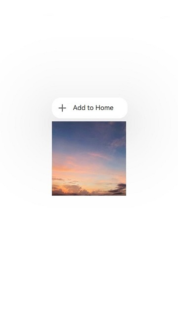
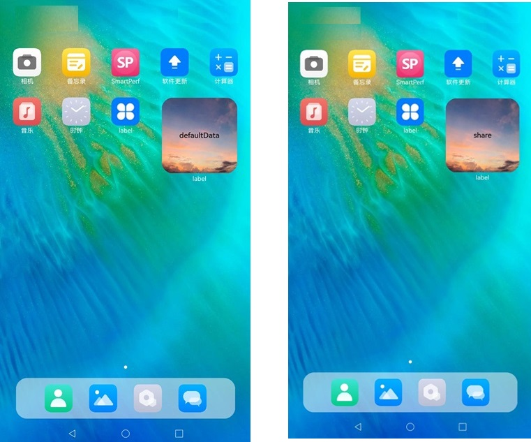

# FormMenu

The **FormMenu** component encapsulates an **Add to home screen** menu, which allows users to long-press a component in the application to add it to their home screen for direct access. During application usage, this component acts as a portal for retention and re-engagement, encouraging users to conveniently add features to their home screen.

This component facilitates the quick addition of service widgets to the home screen through a long-press menu within the application:

1. You pass the widget data and the ID of the in-application functional component to the service widget framework.

2. The click event captures a snapshot and the position of the in-application functional component based on the component ID, which is used for the transition animation when the widget is added to the home screen.

3. The service widget framework triggers the addition of the service widget to the home screen by sending the addition data to the home screen, initiating the service widget placement operation.


> **NOTE**
>
> This component is supported since API version 12. Updates will be marked with a superscript to indicate their earliest API version.


## Modules to Import

```
import { AddFormMenuItem } from '@kit.ArkUI';
```


## Child Components

Not supported

## Attributes
The [universal attributes](ts-universal-attributes-size.md) are not supported.

## AddFormMenuItem 


AddFormMenuItem(
  want: Want,
  componentId: string,
  options?: AddFormOptions
): void


**Decorator**: @Component

**Atomic service API**: This API can be used in atomic services since API version 12.

**System capability**: SystemCapability.ArkUI.ArkUI.Full

**Parameters**

| Name          | Type                       | Mandatory| Decorator| Description                                                            |
| -------------- | ------------------------------- | ---- | ---------- | ---------------------------------------------------------------- |
| want           | [Want](../../apis-ability-kit/js-apis-app-ability-want.md#want)                            | Yes  | \@Prop     | Want information of the functional component.                                        |
| componentId    | string                          | Yes  | -          | In-application functional component ID, which corresponds to a UI similar to the UI of the service widget to add.|
| AddFormOptions| [AddFormOptions](#addformoptions) | No  | -          | Options for adding the service widget.                                                        |

## AddFormOptions

**Atomic service API**: This API can be used in atomic services since API version 12.

**System capability**: SystemCapability.ArkUI.ArkUI.Full

**Parameters**
| Name            | Type               | Mandatory| Description                                                     |
| --------------- | ---- | ---- | ---------------------------------------------------------------- |
| formBindingData | [formBindingData.FormBindingData](../../apis-form-kit/js-apis-app-form-formBindingData.md#formbindingdata) | No| Service widget data.|
| callback        | AsyncCallback\<string>                                                                                                | No| Callback used to return the result. |
| style           | [FormMenuItemStyle](#formmenuitemstyle)                                                                              | No| Custom menu style.|


## FormMenuItemStyle

**Atomic service API**: This API can be used in atomic services since API version 12.

**System capability**: SystemCapability.ArkUI.ArkUI.Full

**Parameters**
| Name           | Type          | Mandatory| Description|
| --------------- | ----------------- | ---- | ---- |
| options | [MenuItemOptions](ts-basic-components-menuitem.md#menuitemoptions) | No  | Information about the menu item.|

> **NOTE**
>
> If **style** is left empty or unspecified, the default icon and menu text are applied.

## Events
Menu click events are supported.

## Example

```ts
// index.ets
import { AddFormMenuItem } from '@kit.ArkUI';
import { formBindingData } from '@kit.FormKit';
import { hilog } from '@kit.PerformanceAnalysisKit';

const tag = 'AddFormMenuItem';

@Entry
@Component
struct Index {
  @State message: string = 'Long press show menu';
  private compId: string = 'addforms@d46313145';

  @Builder
  MyMenu() {
    Menu() {
      AddFormMenuItem(
        {
          bundleName: 'com.example.myapplication', // Bundle name
          abilityName: 'EntryFormAbility', // Module ability name.
          parameters: {
            'ohos.extra.param.key.form_dimension': 2,
            'ohos.extra.param.key.form_name': 'widget',
            'ohos.extra.param.key.module_name': 'entry'
          },
        },
        this.compId,
        {
          formBindingData: formBindingData.createFormBindingData({}),
          // formBindingData: formBindingData.createFormBindingData({ data: 'share' }),
          callback: (error, formId) => {
            hilog.info(0x3900, tag, `callback info: error = ${JSON.stringify(error)}, formId = ${formId}`);
            if (error?.code === 0) {
              hilog.info(0x3900, tag, "Added to the home screen.")
            } else {
              hilog.info(0x3900, tag, "Failed to add to the home screen. Try another method.")
            }
          },
          style: {
            // options: {
            // startIcon: $r("app.media.icon"), // Menu icon, which can be provided by yourself. The default value is "sys.media.ic_public_add."
            //   content: "Add to home screen",  //  Menu content, which can be provided by yourself. The default value is "sys.string.ohos_add_form_to_desktop."
            //   endIcon: $r("app.media.icon") // Menu icon, which can be provided by yourself.
            // }
          }
        }
      )
    }
  }

  build() {
    Row() {
      Column() {
        Image($r("app.media.startIcon"))   // Custom image.
          .id(this.compId)
          .width(200)
          .height(200)
          .bindContextMenu(this.MyMenu, ResponseType.LongPress, {
            placement: Placement.TopLeft
          })
      }
      .width('100%')
    }
    .height('100%')
  }
}
```

```ts
// WidgetCard.ets
const local = new LocalStorage()

@Entry(local)
@Component
struct WidgetCard {
  @LocalStorageProp('data') data: string = 'defaultdata'; // Define the service widget data to be updated.
  /*
   * The action type.
   */
  readonly ACTION_TYPE: string = 'router';
  /*
   * The ability name.
   */
  readonly ABILITY_NAME: string = 'EntryAbility';
  /*
   * The message.
   */
  readonly MESSAGE: string = 'add detail';
  /*
   * The width percentage setting.
   */
  readonly FULL_WIDTH_PERCENT: string = '100%';
  /*
   * The height percentage setting.
   */
  readonly FULL_HEIGHT_PERCENT: string = '100%';

  build() {
    Row() {
      Column() {
        Text(this.data)
          .fontSize($r('app.float.font_size'))
          .fontWeight(FontWeight.Medium)
          .fontColor($r('app.color.item_title_font'))
      }
      .width(this.FULL_WIDTH_PERCENT)
    }
    .height(this.FULL_HEIGHT_PERCENT)
    .backgroundImage($r('app.media.startIcon'))
    .backgroundImageSize({ width: '100%', height: '100%' })
    .onClick(() => {
      postCardAction(this, {
        action: this.ACTION_TYPE,
        abilityName: this.ABILITY_NAME,
        params: {
          message: this.MESSAGE
        }
      });
    })
  }
}
```

**UI of the FormMenu component**



**Result of using Add to home screen with the FormMenu component**

On the left is the result of using **Add to home screen** with **formbdingdata** empty, and on the right is the result with **formbdingdata** as **{ data: 'share' }**.


