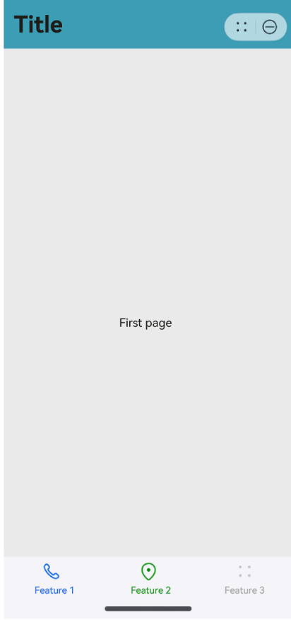

# @ohos.atomicservice.AtomicServiceNavigation (Navigation Root View Container)

**AtomicServiceNavigation** is a component that serves as the root container of a page. By default, it includes a title bar, content area, and toolbar. The content area switches between the home page content (child components of [NavDestination](ts-basic-components-navdestination.md)) and non-home page content through routing.

> **NOTE**
>
> This component is supported since API version 12. Updates will be marked with a superscript to indicate their earliest API version.

## Child Components

Supported

Since API version 10, you are advised to use [NavPathStack](ts-basic-components-navigation.md#navpathstack10) for page routing.

## AtomicServiceNavigation

AtomicServiceNavigation({
    navPathStack?: NavPathStack,
    navigationContent: Callback\<void\>,
    title?: ResourceStr,
    titleBackgroundColor?: ResourceColor,
    hideTitleBar?: boolean,
    navBarWidth?: Length,
    mode?: NavigationMode,
    navDestinationBuilder?: NavDestinationBuilder,
    navBarWidthRange?: [Dimension, Dimension],
    minContentWidth?: Dimension,
    stateChangeCallback?: Callback\<boolean\>,
    modeChangeCallback?: Callback\<NavigationMode\>
})

**Atomic service API**: This API can be used in atomic services since API version 12.

**Decorator**: @Component

**System capability**: SystemCapability.ArkUI.ArkUI.Full

**Parameters**

| Name | Type | Mandatory | Decorator|Description |
| --------------- | ------ | ---- | ----|----------|
| navPathStack | [NavPathStack](ts-basic-components-navigation.md#navpathstack10) | No | @State | Information about the navigation stack. |
| navigationContent | Callback\<void\> | No | @BuilderParam | Content of the navigation container. |
| title | [ResourceStr](ts-types.md#resourcestr) | No |@Prop | Page title.|
| titleOptions | [TitleOptions](#titleoptions) | No | @Prop | Title bar options.|
| hideTitleBar | boolean | No | @Prop | Whether to hide the title bar.|
| navBarWidth | [Length](ts-types.md#length)| No | @Prop | Width of the navigation bar.<br>This attribute takes effect only when the component is split.|
| mode| [NavigationMode](ts-basic-components-navigation.md#navigationmode9) | No | @Prop |Display mode of the navigation bar.<br>Available options are **Stack**, **Split**, and **Auto**.|
| navDestinationBuilder | [NavDestinationBuilder](#navdestinationbuilder) | No | @BuilderParam | Builder data required for creating the [NavDestination](ts-basic-components-navdestination.md) component. |
| navBarWidthRange | [[Dimension](ts-types.md#dimension10), [Dimension](ts-types.md#dimension10)] | No | @Prop |Minimum and maximum widths of the navigation bar (effective in dual-column mode).|
| minContentWidth | [Dimension](ts-types.md#dimension10) | No | @Prop | Minimum width of the navigation bar content area (effective in dual-column mode).|
| stateChangeCallback | Callback\<boolean\> | No | - | Callback invoked when the navigation bar visibility status changes.|
| modeChangeCallback | Callback\<[NavigationMode](ts-basic-components-navigation.md#navigationmode9)\> | No | - | Callback invoked when the component is displayed for the first time or its display mode switches between single-column and dual-column.|

## TitleOptions

**Atomic service API**: This API can be used in atomic services since API version 12.

**System capability**: SystemCapability.ArkUI.ArkUI.Full

| Name | Type | Mandatory | Description |
| --------------- | ------ | ---- | ---------- |
| backgroundColor | [ResourceColor](ts-types.md#resourcecolor) | No | Background color of the title bar. |
| isBlurEnabled | boolean | No | Whether the title bar is blurred.<br>Default value: **true** |
| TitleOptions | [BarStyle<sup>12+</sup>](ts-basic-components-navigation.md#barstyle12)  | No | Style options of the title bar. |

## NavDestinationBuilder

**Atomic service API**: This API can be used in atomic services since API version 12.

**System capability**: SystemCapability.ArkUI.ArkUI.Full
    
| Name | Type | Mandatory | Description |
| --------------- | ------ | ---- | ---------- |
| name | string | Yes | Name of the [NavDestination](ts-basic-components-navdestination.md) page. |
| param | Object | Yes | Settings of the [NavDestination](ts-basic-components-navdestination.md) page. |

## Example

```ts
// Index.ets
import { AtomicServiceNavigation, NavDestinationBuilder, AtomicServiceTabs, TabBarOptions, TabBarPosition } from '@kit.ArkUI';

@Entry
@Component
struct Index {
  @State message: string = 'Title';
  childNavStack: NavPathStack = new NavPathStack();
  @Builder
  tabContent1() {
    Text('first page')
      .onClick(() => {
        this.childNavStack.pushPath({ name: 'page one' })
      })
  }

  @Builder
  tabContent2() {
    Text('second page')
  }

  @Builder
  tabContent3() {
    Text('third page')
  }

  @Builder
  navigationContent() {
    AtomicServiceTabs({
      tabContents: [
        () => {
          this.tabContent1()
        },
        () => {
          this.tabContent2()
        },
        () => {
          this.tabContent3()
        }
      ],
      tabBarOptionsArray: [
        new TabBarOptions($r('sys.media.ohos_ic_public_phone'), 'Feature 1'),
        new TabBarOptions($r('sys.media.ohos_ic_public_location'), 'Feature 2', Color.Green, Color.Red),
        new TabBarOptions($r('sys.media.ohos_ic_public_more'), 'Feature 3')
      ],
      tabBarPosition: TabBarPosition.BOTTOM,
      barBackgroundColor: $r('sys.color.ohos_id_color_bottom_tab_bg'),
      onTabBarClick: (index: Number) => {
        if (index == 0) {
          this.message = 'Feature 1';
        } else if (index == 1) {
          this.message = 'Feature 2';
        } else {
          this.message = 'Feature 3';
        }
      }
    })
  }

  @Builder
  pageMap(name: string) {
    if (name === 'page one') {
      PageOne()
    } else if (name === 'page two') {
      PageTwo()
    }
  }

  build() {
    Row() {
      Column() {
        AtomicServiceNavigation({
          navigationContent: () => {
            this.navigationContent()
          },
          title: this.message,
          titleOptions: {
            backgroundColor: 'rgb(61, 157, 180)',
            isBlurEnabled: false
          },
          navDestinationBuilder: this.pageMap,
          navPathStack: this.childNavStack,
          mode: NavigationMode.Stack
        })
      }
      .width('100%')
    }
    .height('100%')
  }
}

@Component
export struct PageOne {
  pageInfo: NavPathStack = new NavPathStack();

  build() {
    NavDestination() {
      Button('Next')
        .onClick(() => {
          this.pageInfo.pushPath({ name: 'page two'})
        })
    }
    .title('PageOne')
    .onReady((context: NavDestinationContext) => {
      this.pageInfo = context.pathStack;
    })
  }
}

@Component
export struct PageTwo {
  pageInfo: NavPathStack = new NavPathStack();

  build() {
    NavDestination() {
      Button('End')
    }
    .title('PageTwo')
    .onReady((context: NavDestinationContext) => {
      this.pageInfo = context.pathStack;
    })
  }
}
```


