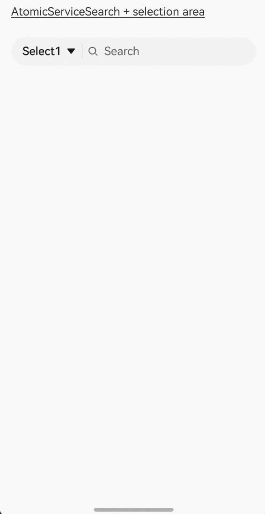
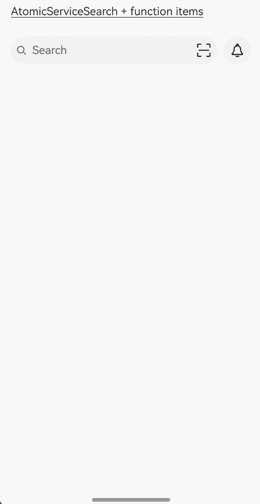
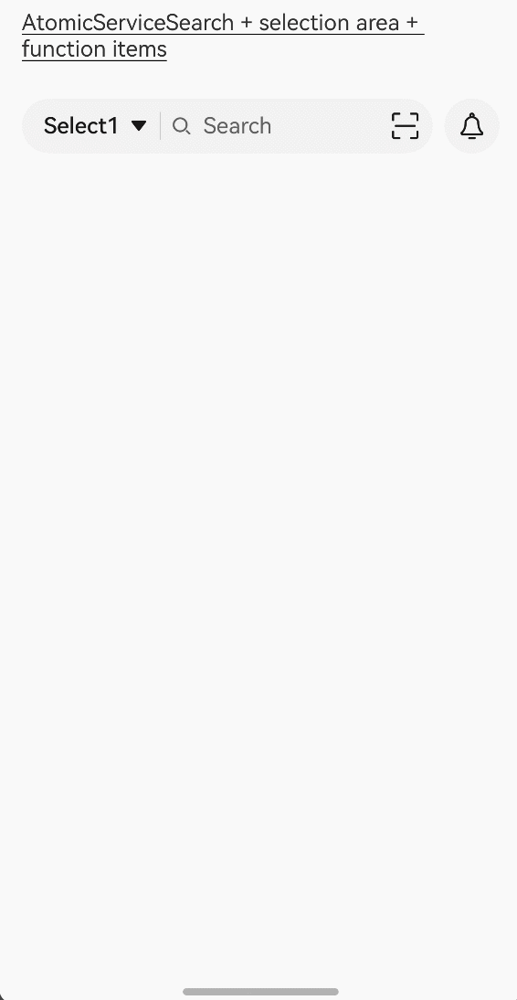
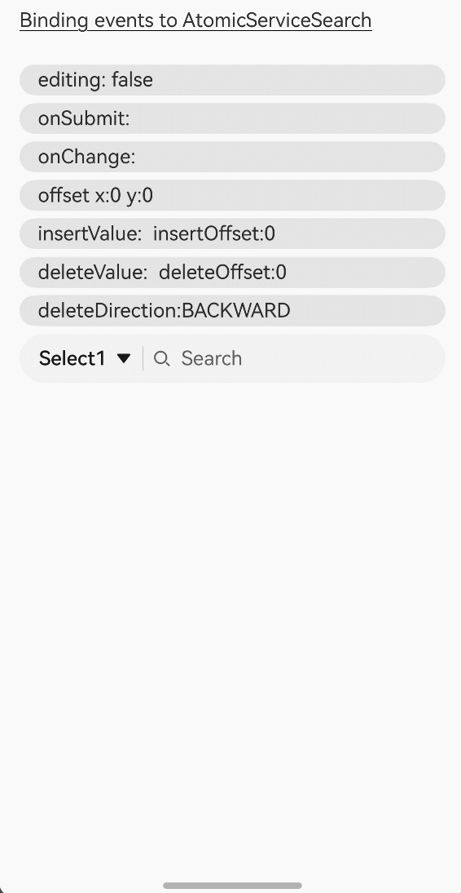
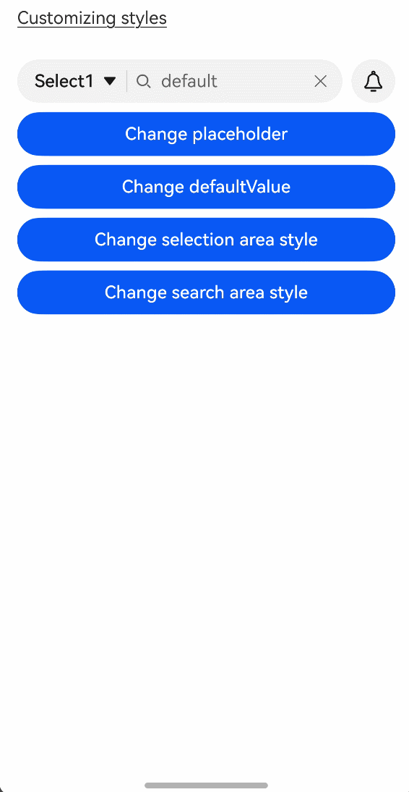
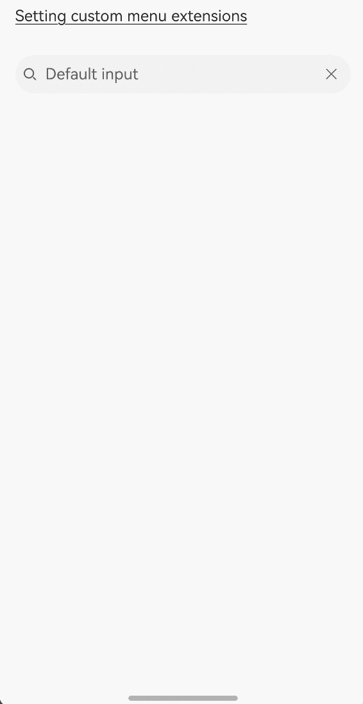
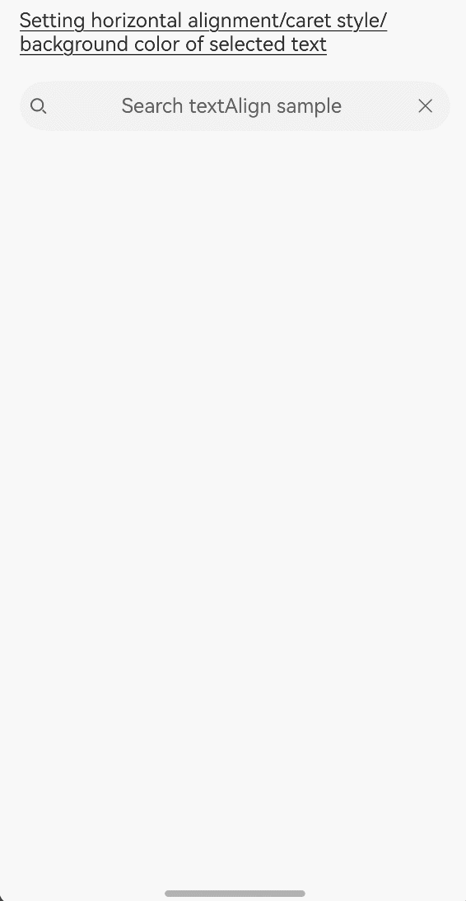
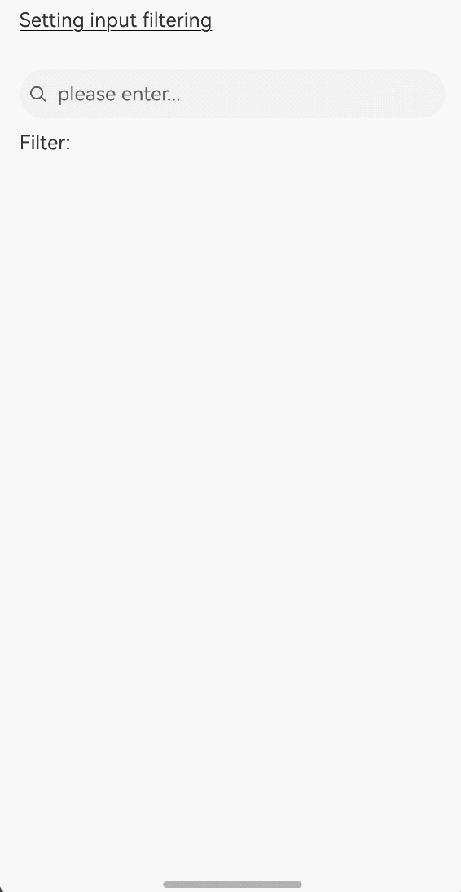

# AtomicServiceSearch

**AtomicServiceSearch** allows you to customize the default search area, customizable selection area, and function area (a maximum of two).

> **NOTE**
>
> This component is supported since API version 18. Updates will be marked with a superscript to indicate their earliest API version.


## Modules to Import

```
import { AtomicServiceSearch } from '@kit.ArkUI';
```


## AtomicServiceSearch
```ts
AtomicServiceSearch({
  value?: ResourceStr,
  placeholder?: ResourceStr,
  controller?: SearchController,
  select?: SelectParams,
  search?: SearchParams,
  operation?: OperationParams,
})
```

**Atomic service API**: This API can be used in atomic services since API version 18.

**Decorator**: @Component

**System capability**: SystemCapability.ArkUI.ArkUI.Full

**Parameters**

| Name     | Type        | Mandatory| Decorator| Description                                                        |
| ----------- | :--------------- | ---- | ---------- | ------------------------------------------------------------ |
| value       | [ResourceStr](ts-types.md#resourcestr) | No| @Prop | Text input in the search text box. The default value is an empty string.|
| placeholder | [ResourceStr](ts-types.md#resourcestr) | No| @Prop | Default prompt text displayed in the search box. The default value is **Search**.|
| controller  | [SearchController](ts-basic-components-search.md#searchcontroller) | No  | - | Native **Search** component controller, which is used to set the position of the input cursor and exit the editing state. The default value is **undefined**.|
| select      | [SelectParams](#selectparams) | No| @Prop | Content, event, and style of the selection area. The default value is **undefined**.|
| search      | [SearchParams](#searchparams) | No| @Prop | Events and styles supported by the search area. The default value is **undefined**.|
| operation   | [OperationParams](#operationparams) | No| - | Function setting items on the right of the selection area. The default value is **undefined**.|


## SelectParams

Provides optional attributes for the selection area.

**Atomic service API**: This API can be used in atomic services since API version 18.

**System capability**: SystemCapability.ArkUI.ArkUI.Full

| Name                   | Type                  | Mandatory                        | Description                                                        |
| ----------------------- | -------------------------------------------- | ------------------------------------------------------------ | ---- |
| options                 | Array&lt;[SelectOption](ts-basic-components-select.md#selectoption)&gt; | No| Value of an option in the drop-down menu. The default value is **undefined**.|
| selected                | number| No| Index of the initially selected item in the drop-down list box. The index of the first item is 0. If this attribute is not set, the default value **-1** is used, indicating that the option is not selected.|
| selectValue             | [ResourceStr](ts-types.md#resourcestr) | No| Text content of the drop-down list button itself. The default value is **undefined**.|
| onSelect                | [OnSelectCallback](#onselectcallback) | No| Callback invoked when an item in the drop-down list box is selected. The default value is **undefined**.|
| menuItemContentModifier | [ContentModifier\<MenuItemConfiguration>](ts-basic-components-select.md#menuitemconfiguration12)| No| 	Content modifier to apply to the drop-down list box.<br>**modifier**: content modifier. You need a custom class to implement the **ContentModifier** API. The default value is **undefined**.|
| divider                 | [Optional](ts-universal-attributes-custom-property.md#optional12)&lt;[DividerOptions](ts-basic-components-textpicker.md#divideroptions12)&gt; \| null | No| Divider options.<br>1. If **DividerOptions** is set, the divider is displayed in the configured style. Default value: **{strokeWidth: '1px', color: '#33182431'}**<br>2. If this parameter is set to **null**, the divider is not displayed.<br>3. If the value of **strokeWidth** is too larger, the divider may overlap the text. The divider extends both upwards and downwards from the bottom of each item.<br>4. The default values for **startMargin** and **endMargin** are consistent with the style of the divider when the **divider** attribute is not set. If the sum of **startMargin** and **endMargin** is equal to the value of **optionWidth**, the divider is not displayed. If the sum of **startMargin** and **endMargin** exceeds the value of **optionWidth**, the divider line is displayed in the default style.|
| font                    | [Font](ts-types.md#font) | No| Text font of the drop-down list button. Default value: **{size: $r('sys.float.ohos_id_text_size_body1')}**|
| fontColor               | [ResourceColor](ts-types.md#resourcecolor) | No| Font color of the selected option in the drop-down list box. Default value: **{fontColor: $r('sys.color.ohos_id_color_text_primary')}**  |
| selectedOptionBgColor   | [ResourceColor](ts-types.md#resourcecolor) | No| Background color of the selected option in the drop-down list box. Default value: **$r('sys.color.ohos_id_color_component_activated')** with the opacity of **$r('sys.color.ohos_id_alpha_highlight_bg')**|
| selectedOptionFont      | [Font](ts-types.md#font) | No| Text font of the selected option in the drop-down list box. Default value: **{size: $r('sys.color.ohos_id_text_size_body1'), weight: FontWeight.Regular}**|
| selectedOptionFontColor | [ResourceColor](ts-types.md#resourcecolor) | No| Font color of the selected option in the drop-down list box. Default value: **$r('sys.color.ohos_id_color_text_primary_activated')**|
| optionBgColor           | [ResourceColor](ts-types.md#resourcecolor) | No| Background color of an option in the drop-down list box. Default value: **Color.Transparent**|
| optionFont              | [Font](ts-types.md#font) | No| Text font of options in the drop-down list box. Default value: **{size: $r('sys.float.ohos_id_text_size_body1'), weight: FontWeight.Regular}**|
| optionFontColor         | [ResourceColor](ts-types.md#resourcecolor) | No| Font color of an option in the drop-down list box. Default value: **$r('sys.color.ohos_id_color_text_primary')**|
| optionWidth             | [Dimension](ts-types.md#dimension10) \| [OptionWidthMode](ts-appendix-enums.md#optionwidthmode11) | No| Option width in the drop-down list box. This attribute cannot be set in percentage. **OptionWidthMode** is of the enum type and it determines whether the drop-down list box inherits the width of the drop-down list button. If an invalid value or a value less than the minimum width of 56 vp is set, the attribute does not take effect, and the option width uses the default value, which is two columns.|
| optionHeight            | [Dimension](ts-types.md#dimension10) | No| Maximum height for the option in the drop-down list box. This attribute cannot be set in percentage. The default maximum height is 80% of the available height of the screen. The maximum height set cannot exceed the default maximum height.|
| space                   | [Length](ts-types.md#length) | No| Spacing between the text and arrow of an option. Default value: **8**|
| arrowPosition           | [ArrowPosition](ts-basic-components-select.md#arrowposition10)| No| Alignment between the text and arrow of an option. Default value: **ArrowPosition.END**|
| menuAlign               | [MenuAlignParams](#menualignparams) | No| Alignment between the drop-down list button and the drop-down list box. Default value: **{alignType: MenuAlignType.START, offset: {dx: 0, dy: 0}}**|
| menuBackgroundColor     | [ResourceColor](ts-types.md#resourcecolor) | No| Background color of the drop-down list box. Default value: **Color.Transparent**  |
| menuBackgroundBlurStyle | [BlurStyle](ts-universal-attributes-background.md#blurstyle9) | No| Background blur style of the drop-down list box. Default value: **BlurStyle.COMPONENT_ULTRA_THICK**|


## SearchParams

Sets optional attributes for the search area.

**Atomic service API**: This API can be used in atomic services since API version 18.

**System capability**: SystemCapability.ArkUI.ArkUI.Full

| Name                    | Type           | Mandatory                                  | Description                                                        |
| ------------------------ | ---------------------------------------------- | ------------------------------------------------------------ | ---- |
| searchKey | [ResourceStr](ts-types.md#resourcestr) | No| Search key used to find a unique **search** component. Default value: **undefined**  |
| componentBackgroundColor | [ResourceColor](ts-types.md#resourcecolor) | No| Background color of a component. Default value: **$r('sys.color.ohos_id_color_text_field_sub_bg')**  |
| pressedBackgroundColor   | [ResourceColor](ts-types.md#resourcecolor) | No| Background color of the pressed component. Default value: **$r('sys.color.ohos_id_color_click_effect')**|
| searchButton             | [SearchButtonParams](#searchbuttonparams) | No| Search button located next to the search text box. Clicking the search button triggers both **onSubmit** and **onClick** callbacks.<br>- **value**: Text on the search button located next to the search text box.<br> - **option**: Font of the search text box. Default value: **{fontSize: '16fp', fontColor: '#ff3f97e9'}**|
| placeholderColor         | [ResourceColor](ts-types.md#resourcecolor) | No| Placeholder text color. Default value: **$r('sys.color.ohos_id_color_text_secondary')**  |
| placeholderFont          | [Font](ts-types.md#font) | No| Placeholder text style, including the font size, font weight, font family, and font style. Default value: **{size: $r('sys_float.ohos_id_text_size_body1')}**|
| textFont                 | [Font](ts-types.md#font) | No| Style of the text entered in the search box, including the font size, font width, font family, and font style. Currently, only the default font family is supported. Default value: **{size: $r('sys_float.ohos_id_text_size_body1')}**|
| textAlign                | [TextAlign](ts-appendix-enums.md#textalign) | No| Text alignment mode in the search text box. Default value: **TextAlign.Start**  |
| copyOptions              | [CopyOptions](ts-appendix-enums.md#copyoptions9) | No| Whether copy and paste is allowed. Default value: **CopyOptions.LocalDevice**  |
| searchIcon               | [IconOptions](ts-basic-components-search.md#iconoptions10) \| [SymbolGlyphModifier](ts-universal-attributes-attribute-modifier.md) | No| Style of the search icon on the left.<!--RP1--><br>Default value in light mode: **{size: '16vp', color: '#99182431', src:' '}**<br>Default value in dark mode: **{size: '16vp', color: '#99ffffff', src:' '}**<!--RP1End--> |
| cancelIcon               | [IconOptions](ts-basic-components-search.md#iconoptions10)| No| Style of the cancel button on the right. Default value: **{style: CancelButtonStyle.INPUT, icon: {size: '16vp', color: '#99ffffff', src:' '}}**<br>When style is set to **CancelButtonStyle.CONSTANT**, the cancel button is displayed in a default style.  |
| fontColor                | [ResourceColor](ts-types.md#resourcecolor) | No|  Font color of the input text. Default value: **$r('sys.color.ohos_id_color_text_secondary')**|
| caretStyle               | [CaretStyle](ts-text-common.md#caretstyle10) | No| Pointer style. Default value: **{width: '1.5vp', color: '#007DFF'}**  |
| enableKeyboardOnFocus    | boolean | No| Whether to enable the input method when the **search** component obtains focus in a way other than clicking. Default value: **true**  |
| hideSelectionMenu        | boolean | No| Whether to hide the system text selection menu.<br>**true**: The system text selection menu does not appear under the following circumstances: clicking the text box cursor, long-pressing the text box, double-tapping the text box, triple-tapping the text box, or right-clicking the text box. **false**: The system text selection menu appears under the following circumstances: clicking the text box cursor, long-pressing the text box, double-tapping the text box, triple-tapping the text box, or right-clicking the text box. Default value: **false**  |
| type                     | [SearchType](ts-basic-components-search.md#searchtype11)| No| Text box type. Default value: **SearchType.Normal**  |
| maxLength                | number | No| Maximum number of characters in the text input. By default, there is no maximum number of characters. When the maximum number is reached, no more characters can be entered. Default value: **-1**  |
| enterKeyType             | [EnterKeyType](ts-basic-components-textinput.md#enterkeytype)| No| Type of the Enter key. Default value: **EnterKeyType.Search**  |
| decoration               | [TextDecorationOptions](ts-types.md#textdecorationoptions12)| No|  Text decorative line options. Default value: **{type: TextDecorationType.None, color: Color.Black, style: TextDecorationStyle.SOLID}**  |
| letterSpacing            | number \| string \| [Resource](ts-types.md#resource) | No| Letter spacing. If the value specified is a percentage or **0**, the default value is used. If the value specified is a negative value, the text is compressed. A negative value too small may result in the text being compressed to 0 and no content being displayed. Default value: **0** |
| fontFeature              | [ResourceStr](ts-types.md#resourcestr) | No| Font feature, for example, monospaced digits.<br>Format: normal \| \<feature-tag-value\><br>Syntax for \<feature-tag-value\>: \<string\> \[ \<integer\> \| on \| off ]<br>There can be multiple **\<feature-tag-value\>** values, which are separated by commas (,).<br>For example, the input format for monospaced digits is "ss01" on. The default value is **undefined**.  |
| selectedBackgroundColor  | [ResourceColor](ts-types.md#resourcecolor) | No| Background color of the selected text. By default, a 20% opacity is applied.|
| inputFilter              | [InputFilterParams](#inputfilterparams) | No| Regular expression for input filtering. Only inputs that comply with the regular expression can be displayed. Other inputs are filtered out. The specified regular expression can match single characters, but not strings. The default value is **undefined**.<br> - **value**: regular expression.<br> - **error**: Filtered-out content to return when regular expression matching fails.|
| textIndent               | [Dimension](ts-types.md#dimension10) | No| Indent of the first line text. Default value: **0**  |
| minFontSize              | number \| string \| [Resource](ts-types.md#resource) | No| Minimum font size. For the setting to take effect, this attribute must be used together with **maxFontSize** or layout constraint settings. The default value is **undefined**.  |
| maxFontSize              | number \| string \| [Resource](ts-types.md#resource) | No| Maximum font size. For the setting to take effect, this attribute must be used together with **minFontSize** or layout constraint settings. The default value is **undefined**.  |
| editMenuOptions          | [EditMenuOptions](ts-text-common.md#editmenuoptions) | No| Extended options of the custom context menu on selection, including the text content, icon, and callback. The default value is **undefined**.  |
| enablePreviewText        | boolean | No| Whether to enable preview text. Default value: **true**<br> Preview text of the input method should be enabled. Preview text is in a temporary state and does not support text interception. As such, it does not trigger **onWillInsert** and **onDidInsert** callbacks. |
| enableHapticFeedback     | boolean | No| Whether to enable haptic feedback. Default value: **true**  |
| onSubmit                 | Callback&lt;string&gt; \| [SearchSubmitCallback](ts-basic-components-search.md#searchsubmitcallback14) | No| Callback triggered when users click the search icon or the search button, or touch the search button on a soft keyboard. The default value is **undefined**.  |
| onChange                 | [EditableTextOnChangeCallback](ts-text-common.md#editabletextonchangecallback12) | No| Callback triggered when the content in the text box changes. The default value is **undefined**.  |
| onCopy                   | Callback&lt;string&gt; | No| Callback triggered when a copy operation is performed. The default value is **undefined**.  |
| onCut                    | Callback&lt;string&gt; | No| Callback triggered when a cut operation is performed. The default value is **undefined**.  |
| onPaste                  | [OnPasteCallback](#onpastecallback) | No| Callback triggered when a paste operation is performed. The default value is **undefined**.  |
| onTextSelectionChange    | [OnTextSelectionChangeCallback](#ontextselectionchangecallback) | No| Callback triggered when the position of the text selection changes or when the cursor position changes during the editing state. The default value is **undefined**.  |
| onContentScroll          | [OnContentScrollCallback](#oncontentscrollcallback) | No| Callback triggered when the text content is scrolled. The default value is **undefined**.  |
| onEditChange             | Callback&lt;boolean&gt; | No| Callback triggered when the input status changes. If a cursor is displayed, that is, the value of **isEditing** is **true**, the text box is in the editing state. The default value is **undefined**.  |
| onWillInsert             | Callback&lt;InsertValue, boolean&gt; | No| Callback triggered when text is about to be inserted. The default value is **undefined**.  |
| onDidInsert              | Callback&lt;InsertValue&gt; | No| Callback triggered when text is inserted. The default value is **undefined**.  |
| onWillDelete             | Callback&lt;DeleteValue, boolean&gt; | No| Callback triggered when text is about to be deleted. The default value is **undefined**.  |
| onDidDelete              | Callback&lt;DeleteValue&gt; | No| Callback triggered when text is deleted. The default value is **undefined**.  |


## OperationParams

Sets initialization parameters of the function area.

**Atomic service API**: This API can be used in atomic services since API version 18.

**System capability**: SystemCapability.ArkUI.ArkUI.Full

| Name         | Type       | Mandatory | Description                         |
| ------------- | --------------- | ---------------------------- | ---- |
| auxiliaryItem | [OperationOption ](ohos-arkui-advanced-SubHeader.md#operationoption)| No| Auxiliary item on the right of the search area. The default value is **undefined**.|
| independentItem | [OperationOption ](ohos-arkui-advanced-SubHeader.md#operationoption)| No| Independent item on the right of the search area. The default value is **undefined**.|


## InputFilterParams

Sets regular expression for input filtering.

**Atomic service API**: This API can be used in atomic services since API version 18.

**System capability**: SystemCapability.ArkUI.ArkUI.Full

| Name            | Type        | Mandatory| Description                              |
| ---------------- | ---------------- | ---- | ---------------------------------- |
| inputFilterValue | [ResourceStr](ts-types.md#resourcestr) | Yes| Regular expression.|
| error | Callback&lt;string&gt; | No| Callback used to return the filtered-out content when regular expression matching fails. The default value is **undefined**.|

## SearchButtonParams

Sets the search button located next to the search text box.

**Atomic service API**: This API can be used in atomic services since API version 18.

**System capability**: SystemCapability.ArkUI.ArkUI.Full

| Name             | Type           | Mandatory| Description                                                        |
| ----------------- | ------------------- | ---- | ------------------------------------------------------------ |
| searchButtonValue | [ResourceStr](ts-types.md#resourcestr) | Yes  | Text on the search button located next to the search text box.|
| options | [SearchButtonOptions](ts-basic-components-search.md#searchbuttonoptions10)| No  | Font of the search text box. Default value: **{fontSize: '16fp',fontColor: '#ff3f97e9'}**|


## MenuAlignParams

Sets the alignment between the drop-down list button and the drop-down list box.

**Atomic service API**: This API can be used in atomic services since API version 18.

**System capability**: SystemCapability.ArkUI.ArkUI.Full

| Name     | Type     | Mandatory| Description                                                        |
| --------- | ------------- | ---- | ------------------------------------------------------------ |
| alignType | [MenuAlignType](ts-basic-components-select.md#menualigntype10)| Yes| Alignment type. Default value: **MenuAlignType.START**|
| offset | [Offset](ts-types.md#offset) | No| Offset of the drop-down list box relative to the drop-down list button after alignment based on the alignment type. Default value: **{dx: 0, dy: 0}**|


## OnSelectCallback

type OnSelectCallback = (index: number, selectValue: string) => void

Called when an item in the drop-down list box is selected.

**Atomic service API**: This API can be used in atomic services since API version 18.

**System capability**: SystemCapability.ArkUI.ArkUI.Full

**Parameters**

| Name  | Type                                                        | Mandatory| Description                                                    |
| -------- | ------------------------------------------------------------ | ---- | -------------------------------------------------------- |
| index | number | Yes| Index of the selected option.|
| selectValue | string | Yes| Value of the selected option.|


## OnPasteCallback

type OnPasteCallback = (pasteValue: string, event: PasteEvent) => void

Called when a paste operation is performed.

**Atomic service API**: This API can be used in atomic services since API version 18.

**System capability**: SystemCapability.ArkUI.ArkUI.Full

**Parameters**

| Name  | Type                                                        | Mandatory| Description                                                    |
| -------- | ------------------------------------------------------------ | ---- | -------------------------------------------------------- |
| pasteValue | string | Yes| Text to be pasted.|
| event | [PasteEvent](ts-basic-components-richeditor.md#pasteevent) | Yes| Custom paste event.|


## OnTextSelectionChangeCallback

type OnTextSelectionChangeCallback = (selectionStart: number, selectionEnd: number) => void

Called when the position of the text selection changes or when the cursor position changes during the editing state.

**Atomic service API**: This API can be used in atomic services since API version 18.

**System capability**: SystemCapability.ArkUI.ArkUI.Full

**Parameters**

| Name  | Type                                                        | Mandatory| Description                                                    |
| -------- | ------------------------------------------------------------ | ---- | -------------------------------------------------------- |
| selectionStart | number | Yes| Start position of the text to be selected.|
| selectionEnd | number | Yes| End position of the text to be selected.|


## OnContentScrollCallback

type OnContentScrollCallback = (totalOffsetX: number, totalOffsetY: number) => void

Called when the text content is scrolled.

**Atomic service API**: This API can be used in atomic services since API version 18.

**System capability**: SystemCapability.ArkUI.ArkUI.Full

**Parameters**

| Name  | Type                                                        | Mandatory| Description                                                    |
| -------- | ------------------------------------------------------------ | ---- | -------------------------------------------------------- |
| totalOffsetX | number | Yes| X coordinate offset of the text in the content area.|
| totalOffsetY | number | Yes| Y coordinate offset of the text in the content area.|


## Examples

### Example 1: Adding a Selection Area to AtomicServiceSearch
This example demonstrates how to use the **select** parameter to add a selection area on the left to the **AtomicServiceSearch** component.

```ts
import { AtomicServiceSearch } from '@kit.ArkUI';

@Entry
@Component
struct Index {
  build() {
    Column({ space: 6 }) {
      Text('AtomicServiceSearch + selection area').alignSelf(ItemAlign.Start).decoration({
        type: TextDecorationType.Underline,
        color: Color.Black,
        style: TextDecorationStyle.SOLID
      }).margin({top:20, bottom: 20})

      AtomicServiceSearch({
        select: {
          options: [
            { value: 'Select1', icon: $r("app.media.sweep") }, // Custom resource
            { value: 'Select2', icon: $r("app.media.sweep") }, // Custom resource
            { value: 'Select3', icon: $r("app.media.sweep") }, // Custom resource
            { value: 'Select4', icon: $r("app.media.sweep") } // Custom resource
          ],
          selected: -1,
          selectValue: 'Select1',
          onSelect: (index: number, selectValue: string) => { // Custom event
            if (index === 0) {
              this.alert(`index: ${index}, selectValue: ${selectValue}`);
            } else if (index === 1) {
              this.alert(`index: ${index}, selectValue: ${selectValue}`);
            } else if (index === 2) {
              this.alert(`index: ${index}, selectValue: ${selectValue}`);
            } else if (index === 3) {
              this.alert(`index: ${index}, selectValue: ${selectValue}`);
            }
          },
        }
      })
    }.padding({ left: 16, right: 16 })
  }

  private alert(message: string): void {
    AlertDialog.show({
      message: message
    })
  }
}
```




### Example 2: Adding a Function Item to AtomicServiceSearch
This example demonstrates how to use the **operation** parameter to add a function item on the right to the **AtomicServiceSearch** component.

```ts
import { AtomicServiceSearch } from '@kit.ArkUI';

@Entry
@Component
struct Index {
  build() {
    Column({ space: 6 }) {
      Text('AtomicServiceSearch + function items').alignSelf(ItemAlign.Start).decoration({
        type: TextDecorationType.Underline,
        color: Color.Black,
        style: TextDecorationStyle.SOLID
      }).margin({top:20, bottom: 20})
      
      AtomicServiceSearch({
        operation: {
          // Auxiliary item of the Search component.
          auxiliaryItem: {
            value: $r("app.media.sweep"), // Custom resource
            action: () => {
              this.alert('Scan'); // Custom event
            }
          },
          // Independent item of the Search component.
          independentItem: {
            value: $r("app.media.dingding"), // Custom resource
            action: () => {
              this.alert('Notifications'); // Custom event
            }
          }
        }
      })
    }.padding({ left: 16, right: 16 })
  }

  private alert(message: string): void {
    AlertDialog.show({
      message: message
    })
  }
}
```




### Example 3: Adding a Selection Area and Function Item to AtomicServiceSearch
This example demonstrates how to add the selection area and function items on the left and right to the AtomicServiceSearch component.

```ts
import { AtomicServiceSearch } from '@kit.ArkUI';

@Entry
@Component
struct Index {
  build() {
    Column({ space: 6 }) {
      Text('AtomicServiceSearch + selection area + function items').alignSelf(ItemAlign.Start).decoration({
        type: TextDecorationType.Underline,
        color: Color.Black,
        style: TextDecorationStyle.SOLID
      }).margin({top:20, bottom: 20})

      AtomicServiceSearch({
        select: {
          options: [
            { value: 'Select1', icon: $r("app.media.sweep") }, // Custom resource
            { value: 'Select2', icon: $r("app.media.sweep") }, // Custom resource
            { value: 'Select3', icon: $r("app.media.sweep") }, // Custom resource
            { value: 'Select4', icon: $r("app.media.sweep") } // Custom resource
          ],
          selected: -1,
          selectValue: 'Select1',
          onSelect: (index: number, selectValue:string) => {
            if (index === 0) {
              this.alert(`index: ${index}, selectValue: ${selectValue}`);
            } else if (index === 1) {
              this.alert(`index: ${index}, selectValue: ${selectValue}`);
            } else if (index === 2) {
              this.alert(`index: ${index}, selectValue: ${selectValue}`);
            } else if (index === 3) {
              this.alert(`index: ${index}, selectValue: ${selectValue}`);
            }
          },
        },
        operation: {
          auxiliaryItem: {
            value: $r("app.media.sweep"), // Custom resource
            action: () => {
              this.alert('Scan'); // Custom event
            }
          },
          independentItem: {
            value: $r("app.media.dingding"), // Custom resource
            action: () => {
              this.alert('Notifications'); // Custom event
            }
          }
        }
      })
    }.padding({ left: 16, right: 16 })
  }

  private alert(message: string): void {
    AlertDialog.show({
      message: message
    })
  }
}
```




### Example 4: Binding the Search Callback Events to AtomicServiceSearch
This example demonstrates how to use the **onWillInsert**, **onDidInsert**, **onWillDelete**, and **onDidDelete** APIs to implement insert and delete operations.
The **onSubmit** API is used to submit content in the search area.
The **onChange** API is used to listen for the content changes in the search area.

```ts
import { AtomicServiceSearch } from '@kit.ArkUI';

@Entry
@Component
struct Index {
  @State insertValue: string = "";
  @State deleteValue: string = "";
  @State insertOffset: number = 0;
  @State deleteOffset: number = 0;
  @State deleteDirection: number = 0;
  @State startIndex: number = 0;
  @State endIndex: number = 0;
  @State offsetX: number = 0;
  @State offsetY: number = 0;
  @State changeValue: string = '';
  @State value: string = 'false';
  @State submitValue: string = '';
  @State text: string = 'Search editMenuOptions';

  build() {
    Column({ space: 6 }) {
      Text('Binding events to AtomicServiceSearch').alignSelf(ItemAlign.Start).decoration({
        type: TextDecorationType.Underline,
        color: Color.Black,
        style: TextDecorationStyle.SOLID
      }).margin({top:20, bottom: 20})

      Column({ space: 6 }) {
        Text('editing: ' + this.value).width('100%').height(25).borderRadius(15).padding({ left: 15 })
          .backgroundColor('rgba(0, 0, 0, 0.1)').maxLines(1).textOverflow({ overflow: TextOverflow.MARQUEE });
        Text('onSubmit:' + this.submitValue).width('100%').height(25).borderRadius(15).padding({ left: 15 })
          .backgroundColor('rgba(0, 0, 0, 0.1)').maxLines(1).textOverflow({ overflow: TextOverflow.MARQUEE });
        Text('onChange:' + this.changeValue).width('100%').height(25).borderRadius(15).padding({ left: 15 })
          .backgroundColor('rgba(0, 0, 0, 0.1)').maxLines(1).textOverflow({ overflow: TextOverflow.MARQUEE });
        Text('offset x:' + this.offsetX + ' y:' + this.offsetY).width('100%').height(25).borderRadius(15).padding({ left: 15 })
          .backgroundColor('rgba(0, 0, 0, 0.1)').maxLines(1).textOverflow({ overflow: TextOverflow.MARQUEE });
        Text("insertValue:" + this.insertValue + "  insertOffset:" + this.insertOffset).width('100%').height(25)
          .borderRadius(15).padding({ left: 15 }).backgroundColor('rgba(0, 0, 0, 0.1)').maxLines(1)
          .textOverflow({ overflow: TextOverflow.MARQUEE });
        Text("deleteValue:" + this.deleteValue + "  deleteOffset:" + this.deleteOffset).width('100%').height(25)
          .borderRadius(15).padding({ left: 15 }).backgroundColor('rgba(0, 0, 0, 0.1)').maxLines(1)
          .textOverflow({ overflow: TextOverflow.MARQUEE });
        Text("deleteDirection:" + (this.deleteDirection == 0 ? "BACKWARD" : "FORWARD")).width('100%').height(25)
          .borderRadius(15).padding({ left: 15 }).backgroundColor('rgba(0, 0, 0, 0.1)').maxLines(1)
          .textOverflow({ overflow: TextOverflow.MARQUEE });
        AtomicServiceSearch({
          select: {
            options: [
              { value: 'Select1', icon: $r("app.media.sweep") },
              { value: 'Select2', icon: $r("app.media.sweep") },
              { value: 'Select3', icon: $r("app.media.sweep") },
              { value: 'Select4', icon: $r("app.media.sweep") }
            ],
            selected: -1,
            selectValue: 'Select1',
            onSelect: (index: number) => {
              if (index === 0) {
                this.alert('Select1');
              } else if (index === 1) {
                this.alert('Select2');
              } else if (index === 2) {
                this.alert('Select3');
              } else if (index === 3) {
                this.alert('Select4');
              }
            },
          },
          search: {
            onSubmit: (value: string) => {
              this.submitValue = value
            },
            onChange: (value: string) => {
              this.changeValue = value
            },
            onCopy: () => {
              this.alert('onCopy');
            },
            onCut: () => {
              this.alert('onCut');
            },
            onPaste: () => {
              this.alert('onPaste');
            },
            onTextSelectionChange: (selectionStart: number, selectionEnd: number) => {
              this.startIndex = selectionStart
              this.endIndex = selectionEnd
            },
            onContentScroll: (totalOffsetX: number, totalOffsetY: number) => {
              this.offsetX = totalOffsetX
              this.offsetY = totalOffsetY
            },
            onEditChange: (data: boolean) => {
              this.value = data ? 'true' : 'false'
            },
            onWillInsert: (info: InsertValue) => {
              this.insertValue = info.insertValue
              return true;
            },
            onDidInsert: (info: InsertValue) => {
              this.insertOffset = info.insertOffset
            },
            onWillDelete: (info: DeleteValue) => {
              this.deleteValue = info.deleteValue
              info.direction
              return true;
            },
            onDidDelete: (info: DeleteValue) => {
              this.deleteOffset = info.deleteOffset
              this.deleteDirection = info.direction
            }
          }
        })
      }
    }.padding({ left: 16, right: 16 })
  }

  private alert(message: string): void {
    AlertDialog.show({
      message: message
    })
  }
}
```




### Example 5: Customizing the Style of AtomicServiceSearch
This example demonstrates how to use the **search**, **select**, **value**, and **placeholder** parameters to customize the style of the **AtomicServiceSearch** component.

```ts
import { AtomicServiceSearch } from '@kit.ArkUI';

@Entry
@Component
struct Index {
  @State private placeholder: string = 'Type to Search...';
  @State private defaultValue: string = 'default';
  @State private search?: SearchParams = {};
  @State private select?: SelectParams = {
    options: [
      { value: 'Select1', icon: $r("app.media.sweep") },
      { value: 'Select2', icon: $r("app.media.sweep") },
      { value: 'Select3', icon: $r("app.media.sweep") },
      { value: 'Select4', icon: $r("app.media.sweep") }
    ],
    selected: -1,
    selectValue: 'Select1',
    onSelect: (index: number) => {
      if (index === 0) {
        this.alert('Select1');
      } else if (index === 1) {
        this.alert('Select2');
      } else if (index === 2) {
        this.alert('Select3');
      } else if (index === 3) {
        this.alert('Select4');
      }
    }
  };

  build() {
    Column({ space: 8 }) {
      Text('Customizing styles').alignSelf(ItemAlign.Start).decoration({
        type: TextDecorationType.Underline,
        color: Color.Black,
        style: TextDecorationStyle.SOLID
      }).margin({ top: 20, bottom: 20 })

      AtomicServiceSearch({
        value: this.defaultValue,
        placeholder: this.placeholder,
        select: this.select,
        search: this.search,
        operation: {
          independentItem: {
            value: $r(`app.media.dingding`),
            action: () => {
              this.alert('Notification');
            }
          }
        }
      })
      Button("Change placeholder")
        .width('100%')
        .type(ButtonType.Normal)
        .borderRadius(20)
        .onClick(() => {
          if (this.placeholder === 'Search...') {
            this.placeholder = 'Type to Search...';
          } else {
            this.placeholder = 'Search...';
          }
        });
      Button("Change defaultValue")
        .width('100%')
        .type(ButtonType.Normal)
        .borderRadius(20)
        .onClick(() => {
          if (this.defaultValue === 'value') {
            this.defaultValue = 'defaultValue';
          } else {
            this.defaultValue = 'value';
          }
        });
      Button("Change selection area style")
        .width('100%')
        .type(ButtonType.Normal)
        .borderRadius(20)
        .onClick(() => {
          this.select = {
            options: [
              { value: 'Option 1', icon: $r("app.media.dingding") },
              { value: 'Option 2', icon: $r("app.media.dingding") },
            ],
            selected: -1,
            selectValue: 'Option 1',
            onSelect: (index: number) => {
              if (index === 0) {
                this.alert('Option 1');
              } else if (index === 1) {
                this.alert('Option 2');
              }
            }
          };
        });

      Button("Change search area style")
        .width('100%')
        .type(ButtonType.Normal)
        .borderRadius(20)
        .onClick(() => {
          this.search = {
            componentBackgroundColor: '#e0eee8'
          }
        });
    }.padding({ left: 16, right: 16 })
  }

  private alert(message: string): void {
    AlertDialog.show({
      message: message
    })
  }
}
```




### Example 6: Setting the Caret Position Using controller
This example demonstrates how to use the **controller** parameter to set the caret position, select the content in the specified area, and disable the editing state.


```ts
import { AtomicServiceSearch } from '@kit.ArkUI';

@Entry
@Component
struct Index {
  controller: SearchController = new SearchController();

  build() {
    Column({ space : 10 }) {
      Text('Setting the caret position using controller').alignSelf(ItemAlign.Start).decoration({
        type: TextDecorationType.Underline,
        color: Color.Black,
        style: TextDecorationStyle.SOLID
      }).margin({top:20, bottom: 20})

      AtomicServiceSearch(
        {
          value: 'Default Value',
          placeholder: 'Type to Search...',
          controller: this.controller,
          search: {
            searchButton: {
              searchButtonValue: 'SEARCH',
              options: { fontSize: '12fp', fontColor: '#ff0e1216' }
            }
          }
        },
      );
      Button('caretPosition to 1').onClick(() => {
        this.controller.caretPosition(1);
      }).width('100%')
      Button('stopEditing').onClick(() => {
        this.controller.stopEditing();
      }).width('100%')
      Button('Selection [0,3]').onClick(() => {
        this.controller.setTextSelection(0, 3)
      }).width('100%')
    }.padding({ left: 16, right: 16 })
  }

  public alert(message: string): void {
    AlertDialog.show({
      message: message,
    })
  }
}
```


### Example 7: Setting the Enter Key Type
This example demonstrates how to use the **enterKeyType** attribute to dynamically change the effect of the Enter key on the soft keyboard.

```ts
import { AtomicServiceSearch } from '@kit.ArkUI';

@Entry
@Component
struct Index {
  @State enterTypes: Array<EnterKeyType> = [EnterKeyType.Go, EnterKeyType.Search, EnterKeyType.Send, EnterKeyType.Done, EnterKeyType.Next, EnterKeyType.PREVIOUS, EnterKeyType.NEW_LINE]
  @State index: number = 0

  build() {
    Column({ space : 10 }) {
      Text('Enter key type as search').alignSelf(ItemAlign.Start).decoration({
        type: TextDecorationType.Underline,
        color: Color.Black,
        style: TextDecorationStyle.SOLID
      }).margin({top:20, bottom: 20})

      AtomicServiceSearch({
        placeholder: 'Enter key type as search',
        search: {
          enterKeyType: this.enterTypes[this.index]
        }
      })

      Button('Change EnterKeyType').onClick(() => {
        this.index = (this.index + 1) % this.enterTypes.length;
      }).width('100%')

    }.padding({ left: 16, right: 16 })
  }

  public alert(message: string): void {
    AlertDialog.show({
      message: message,
    })
  }
}
```


### Example 8: Setting Text Feature Effects
This example demonstrates how to use the **fontFeature** attribute to display text with various typographic features.

```ts
import { AtomicServiceSearch } from '@kit.ArkUI';

@Entry
@Component
struct Index {
  build() {
    Column({ space : 10 }) {
      Text('Setting text feature effects').alignSelf(ItemAlign.Start).decoration({
        type: TextDecorationType.Underline,
        color: Color.Black,
        style: TextDecorationStyle.SOLID
      }).margin({top:20, bottom: 20})

      AtomicServiceSearch({
        value: 'This is ss01 on : 0123456789',
        search: {
          fontFeature: "\"ss012\" on"
        }
      });
      
      AtomicServiceSearch({
        value: 'This is ss01 off : 0123456789',
        search: {
          fontFeature: "\"ss01\" off"
        }
      });
    }.padding({ left: 16, right: 16 })
  }

  public alert(message: string): void {
    AlertDialog.show({
      message: message,
    })
  }
}
```


### Example 9: Setting Text Auto-Adaptation
This example demonstrates how to use the **minFontSize** and **maxFontSize** attributes to implement the text auto-adaptation features.

```ts
import { AtomicServiceSearch } from '@kit.ArkUI';

@Entry
@Component
struct Index {
  build() {
    Column({ space : 10 }) {
      Text('Setting text auto-adaptation').alignSelf(ItemAlign.Start).decoration({
        type: TextDecorationType.Underline,
        color: Color.Black,
        style: TextDecorationStyle.SOLID
      }).margin({top:20, bottom: 20})

      AtomicServiceSearch({
        value: 'This is the text without the adaptive font',
      }).width('80%').height(40).borderWidth(1).borderRadius(20)

      AtomicServiceSearch({
        value: 'This is the text without the adaptive font',
        search: {
          minFontSize: 4,
          maxFontSize: 40
        }
      }).width('80%').height(40).borderWidth(1).borderRadius(20)
    }.padding({ left: 16, right: 16 })
  }

  public alert(message: string): void {
    AlertDialog.show({
      message: message,
    })
  }
}
```


### Example 10: Setting Custom Menu Extensions
This example demonstrates how to use the **editMenuOptions** API to create custom menu extensions for text settings. It includes customizing text content, icons, and callbacks for these extensions.

```ts
import { AtomicServiceSearch } from '@kit.ArkUI';

@Entry
@Component
struct Index {
  onCreateMenu = (menuItems: Array<TextMenuItem>) => {
    let item1: TextMenuItem = {
      content: 'custom1',
      icon: $r('app.media.startIcon'),
      id: TextMenuItemId.of('custom1'),
    }
    let item2: TextMenuItem = {
      content: 'custom2',
      id: TextMenuItemId.of('custom2'),
      icon: $r('app.media.startIcon'),
    }
    menuItems.push(item1)
    menuItems.unshift(item2)
    return menuItems
  }

  onMenuItemClick = (menuItem: TextMenuItem, textRange: TextRange) => {
    if (menuItem.id.equals(TextMenuItemId.of("custom2"))) {
      console.log("Intercept id: custom2 start:" + textRange.start + "; end:" + textRange.end)
      return true
    }
    if (menuItem.id.equals(TextMenuItemId.COPY)) {
      console.log("Intercept COPY start:" + textRange.start + "; end:" + textRange.end)
      return true
    }
    if (menuItem.id.equals(TextMenuItemId.SELECT_ALL)) {
      console.log("Do not intercept SELECT_ALL start:" + textRange.start + "; end:" + textRange.end)
      return false
    }
    return false
  }

  @State editMenuOptions: EditMenuOptions = {
    onCreateMenu: this.onCreateMenu, onMenuItemClick: this.onMenuItemClick
  }

  build() {
    Column({ space : 10 }) {
      Text('Setting custom menu extensions').alignSelf(ItemAlign.Start).decoration({
        type: TextDecorationType.Underline,
        color: Color.Black,
        style: TextDecorationStyle.SOLID
      }).margin({top:20, bottom: 20})

      AtomicServiceSearch({
        value:'Default input',
        search: {
          editMenuOptions : this.editMenuOptions
        }
      })
    }.padding({ left: 16, right: 16 })
  }

  public alert(message: string): void {
    AlertDialog.show({
      message: message,
    })
  }
}
```




### Example 11: Setting the Horizontal Alignment, Caret Style, and Background Color of the Selected Text
This example shows how to set the horizontal alignment, caret style, and background color of the selected text using **textAlign**, **caretStyle**, and **selectedBackgroundColor**.

```ts
import { AtomicServiceSearch } from '@kit.ArkUI';

@Entry
@Component
struct Index {
  build() {
    Column() {
      Text('Setting horizontal alignment/caret style/background color of selected text').alignSelf(ItemAlign.Start).decoration({
        type: TextDecorationType.Underline,
        color: Color.Black,
        style: TextDecorationStyle.SOLID
      }).margin({top:20, bottom: 20})

      AtomicServiceSearch({
        value: 'Search textAlign sample',
        search: {
          textAlign: TextAlign.Center,
          caretStyle: { width: 3, color: Color.Green },
          selectedBackgroundColor: Color.Gray
        }
      })
    }.padding({ left: 16, right: 16 })
  }

  public alert(message: string): void {
    AlertDialog.show({
      message: message,
    })
  }
}
```




### Example 12: Setting Input Filtering
This example shows how to set input filtering using **inputFilter**.

```ts
import { AtomicServiceSearch } from '@kit.ArkUI';

@Entry
@Component
struct Index {
  @State filterValue: string = '';

  build() {
    Column() {
      Column({ space: 10 }) {
        Text('Setting input filtering').alignSelf(ItemAlign.Start).decoration({
          type: TextDecorationType.Underline,
          color: Color.Black,
          style: TextDecorationStyle.SOLID
        }).margin({top:20, bottom: 20})
        AtomicServiceSearch({
          placeholder: 'please enter...',
          search: {
            inputFilter: {
              inputFilterValue : '[a-z]',
              error: (filterValue: string) => {this.filterValue = filterValue}
            }
          }
        })
        Text('Filter:' + this.filterValue).alignSelf(ItemAlign.Start)

      }
    }.padding({ left: 16, right: 16 })
  }

  public alert(message: string): void {
    AlertDialog.show({
      message: message,
    })
  }
}
```


