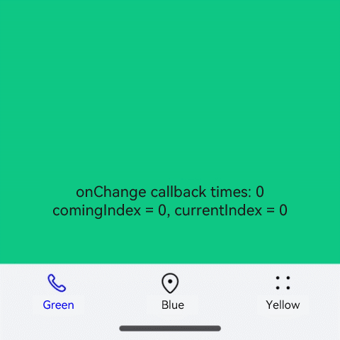

# @ohos.atomicservice.AtomicServiceTabs (Tabs Container)

**AtomicServiceTabs** is an advanced component designed to streamline the use of the **Tabs** component by limiting customization options. It restricts the display to a maximum of five tabs, with fixed styles, positions, and sizes for the tabs.

> **NOTE**
>
> This component is supported since API version 12. Updates will be marked with a superscript to indicate their earliest API version.

## Modules to Import

```
import { AtomicServiceTabs, TabBarOptions, TabBarPosition, OnContentWillChangeCallback } from '@kit.ArkUI';
```

## Child Components

Not supported

## Attributes

The [universal attributes](ts-universal-attributes-size.md) are not supported.

## AtomicServiceTabs

AtomicServiceTabs ({\
  tabContents?: [ TabContentBuilder?,
                    TabContentBuilder?,
                  TabContentBuilder?,
                  TabContentBuilder?,
                  TabContentBuilder?
                ],\
  tabBarOptionsArray: [ TabBarOptions,
                        TabBarOptions,
                        TabBarOptions?,
                        TabBarOptions?,
                        TabBarOptions?
                      ],\
  tabBarPosition?: TabBarPosition,\
  barBackgroundColor?: ResourceColor,\
  index?: number,\
  barOverlap?: boolean,\
  controller?: TabsController,\
  onChange?: Callback\<number>,\
  onTabBarClick?: Callback\<number>,\
  onContentWillChange?: OnContentWillChangeCallback,\
})

**Decorator**: \@Component

**Atomic service API**: This API can be used in atomic services since API version 12.

**System capability**: SystemCapability.ArkUI.ArkUI.Full

**Parameters**

| Name | Type | Mandatory | Decorator | Description |
| --------------- | ------ | ---- | ----|----------|
| tabContents | [[TabContentBuilder?](#tabcontentbuilder),[TabContentBuilder?](#tabcontentbuilder), [TabContentBuilder?](#tabcontentbuilder),[TabContentBuilder?](#tabcontentbuilder), [TabContentBuilder?](#tabcontentbuilder)] | No | @BuilderParam| Array of content view containers.|
| tabBarOptionsArray | [[TabBarOptions?](#tabbaroptions),[TabBarOptions?](#tabbaroptions), [TabBarOptions?](#tabbaroptions),[TabBarOptions?](#tabbaroptions), [TabBarOptions?](#tabbaroptions)]  | Yes | @Prop | Array of tab bar container configurations. |
| tabBarPosition | [TabBarPosition](#tabbarposition) | No  |@Prop | Position of the tab bar.|
| barBackgroundColor | [ResourceColor](ts-types.md#resourcecolor) | No | @Prop | Background color of the tab bar.|
| index | number | No | @Prop | Index of the currently displayed tab.|
| barOverlap | boolean| No | @Prop | Whether the tab bar is superimposed on the **TabContent** component after having its background blurred.|
| controller|[TabsController](ts-container-tabs#tabscontroller) | No | @Prop |Tab controller, which is used to control switching of tabs.|
| onChange | Callback\<number\> | No | - | Callback invoked when a tab is switched. |
| onTabBarClick | Callback\<number\> | No | - |Callback invoked when a tab is clicked.|
| onContentWillChange | [OnContentWillChangeCallback](#oncontentwillchangecallback) | No | - | Callback invoked when a new page is about to be displayed.|

## TabContentBuilder

**Atomic service API**: This API can be used in atomic services since API version 12.

**System capability**: SystemCapability.ArkUI.ArkUI.Full

| Type | Description |
| ---- | ---------- |
| () => void | Content view container. |

## TabBarOptions

**Atomic service API**: This API can be used in atomic services since API version 12.

**System capability**: SystemCapability.ArkUI.ArkUI.Full

| Name | Type | Mandatory | Description |
| --------------- | ------ |------ |------ |
| icon | [ResourceStr](ts-types.md#resourcestr) \| [TabBarSymbol](#tabbarsymbol12) | Yes | Icon of the tab. |
| text | [ResourceStr](ts-types.md#resourcestr) | Yes | Text of the tab. |
| unselectedColor | [ResourceColor](ts-types.md#resourcecolor) | Yes | Color of the tab when it is not selected. |
| selectedColor | [ResourceColor](ts-types.md#resourcecolor) | Yes | Color of the tab when it is selected. |

## TabBarPosition 

**Atomic service API**: This API can be used in atomic services since API version 12.

**System capability**: SystemCapability.ArkUI.ArkUI.Full

| Name | Value | Description |
| --------------- | ------ |-----|
| LEFT  | 0 | The tab bar is on the left side of the screen. |
| BOTTOM  | 1 | The tab bar is at the bottom of the screen. |

## OnContentWillChangeCallback

**Atomic service API**: This API can be used in atomic services since API version 12.

**System capability**: SystemCapability.ArkUI.ArkUI.Full

| Name | Type | Mandatory | Description |
| --------------- | ------ |------ |------ |
| currentIndex | number | Yes | Index of the current tab. |
| comingIndex | number | Yes | Index of the tab to be switched to. |

## Example

```ts
// Index.ets
import { AtomicServiceTabs, TabBarOptions, TabBarPosition, OnContentWillChangeCallback } from '@kit.ArkUI';

@Entry
@Component
struct Index {
  @State message: string = 'Home';
  @State onClickNumber: number = 0;
  @State currentIndex: number = 0;
  @State comingIndex: number = 0;
  onContentWillChangeCallBack:  OnContentWillChangeCallback = (currentIndex: number, comingIndex: number): boolean => {
    this.currentIndex = currentIndex;
    this.comingIndex = comingIndex;
    console.log('OnContentWillChangeCallback')
     return true;
  }
  onTabClick: Callback<number> = (index:number)=>{
    this.onClickNumber ++;
    console.log('onTabClick');
  }
  @Builder
  tabContent1() {
    Column().width('100%').height('100%').alignItems(HorizontalAlign.Center).backgroundColor('#00CB87')
  }

  @Builder
  tabContent2() {
    Column().width('100%').height('100%').backgroundColor('#007DFF')
  }

  @Builder
  tabContent3() {
    Column().width('100%').height('100%').backgroundColor('#FFBF00')
  }

  build() {
    Stack() {
    AtomicServiceTabs({
      tabContents: [
        () => {
          this.tabContent1()
        },
        () => {
          this.tabContent2()
        },
        () => {
          this.tabContent3()
        }
      ],
      tabBarOptionsArray: [
        new TabBarOptions($r('sys.media.ohos_ic_public_phone'), 'Green', Color.Black, Color.Blue),
        new TabBarOptions($r('sys.media.ohos_ic_public_location'), 'Blue', Color.Black, Color.Blue),
        new TabBarOptions($r('sys.media.ohos_ic_public_more'), 'Yellow', Color.Black, Color.Blue)
      ],
      tabBarPosition: TabBarPosition.BOTTOM,
      barBackgroundColor: $r('sys.color.ohos_id_color_bottom_tab_bg'),
      onTabBarClick:this.onTabClick,
      onContentWillChange: this.onContentWillChangeCallBack,
    })
    Column() {
      Text("onChange callback times:" + this.onClickNumber)
      Text("comingIndex = " + this.comingIndex + ", currentIndex = " + this.currentIndex)
    }.margin({top:500})
    }.height('100%')
  }
}
```

