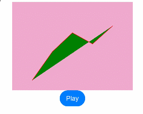

# Definition of Animatable Properties (@AnimatableExtend)
<!--Kit: ArkUI-->
<!--Subsystem: ArkUI-->
<!--Owner: @hehongyang3-->
<!--Designer: @CCFFWW-->
<!--Tester: @lxl007-->
<!--Adviser: @HelloCrease-->

The @AnimatableExtend decorator is used to customize animatable property methods. Functions defined within this decorator are called on a frame-by-frame basis during the animation process until the animation ends. Common use cases for this decorator include:

1. Converting non-animatable properties into animatable ones: Customize data calculation rules that enable interpolation for the property to obtain intermediate values, allowing the animation to drive the property to transition gradually from a start value to an end value.

2. Enabling frame-by-frame property changes to achieve frame-by-frame layout effects.

- Animatable property: a property that triggers an animation effect when its value changes (after being called before the animation property), resulting in a smooth transition effect. Examples include **height**, **width**, **backgroundColor**, **translate**, and **fontSize** (of the **Text** component).

- Non-animatable property: a property that does not trigger an animation effect when its value changes (even if called before the **animation** property). Its value changes abruptly without transitions. An example is the **points** property of the **Polyline** component.

>  **NOTE**
>
>  This decorator is supported since API version 10. Updates will be marked with a superscript to indicate their earliest API version.

## Syntax

```ts
@AnimatableExtend(UIComponentName) function functionName(value: typeName) { 
  .propertyName(value)
}
```

- \@AnimatableExtend can be defined only globally.
- The parameter of the \@AnimatableExtend decorated function must be of the number type or a custom type that implements the **AnimatableArithmetic\<T\>** API.
- The function body of an \@AnimatableExtend decorated function can only access attribute methods of the component type specified within the parentheses of @AnimatableExtend.

## AnimatableArithmetic\<T\>

The **AnimatableArithmetic** API defines animation calculation rules for non-number data types. To animate non-number data (such as arrays, structs, and colors), you must implement the **AnimatableArithmetic\<T\>** API, including methods for addition, subtraction, multiplication, and equality checks.
This enables the data to participate in animation interpolation and allows the system to detect value changes. In other words, the non-number data is defined as types that implement the **AnimatableArithmetic\<T\>** API.

**Atomic service API**: This API can be used in atomic services since API version 11.

**System capability**: SystemCapability.ArkUI.ArkUI.Full

### plus

plus(rhs: AnimatableArithmetic\<T\>): AnimatableArithmetic\<T\>

Defines the addition rule for the data type.

**Atomic service API**: This API can be used in atomic services since API version 11.

**System capability**: SystemCapability.ArkUI.ArkUI.Full

**Parameters**

| Name  | Type                               | Mandatory| Description                                   |
| ----- | --------------------------------- | ---- | ------------------------------------- |
| rhs | [AnimatableArithmetic\<T\>](#animatablearithmetict) | Yes   | Object for the addition operation.                          |

**Return value**

| Type                                      | Description     |
| ---------------------------------------- | ------- |
| [AnimatableArithmetic\<T\>](#animatablearithmetict) | Result of the addition operation. |

### subtract

subtract(rhs: AnimatableArithmetic\<T\>): AnimatableArithmetic\<T\>

Defines the subtraction rule for the data type.

**Atomic service API**: This API can be used in atomic services since API version 11.

**System capability**: SystemCapability.ArkUI.ArkUI.Full

**Parameters**

| Name  | Type                               | Mandatory| Description                                   |
| ----- | --------------------------------- | ---- | ------------------------------------- |
| rhs | [AnimatableArithmetic\<T\>](#animatablearithmetict) | Yes   | Object for the subtraction operation.                          |

**Return value**

| Type                                      | Description     |
| ---------------------------------------- | ------- |
| [AnimatableArithmetic\<T\>](#animatablearithmetict) | Result of the subtraction operation. |

### multiply

multiply(scale: number): AnimatableArithmetic\<T\>

Defines the multiplication rule for the data type.

**Atomic service API**: This API can be used in atomic services since API version 11.

**System capability**: SystemCapability.ArkUI.ArkUI.Full

**Parameters**

| Name  | Type                               | Mandatory| Description                                   |
| ----- | --------------------------------- | ---- | ------------------------------------- |
| scale | number | Yes   | Coefficient for the multiplication operation.                          |

**Return value**

| Type                                      | Description     |
| ---------------------------------------- | ------- |
| [AnimatableArithmetic\<T\>](#animatablearithmetict) | Result of the multiplication operation. |

### equals

equals(rhs: AnimatableArithmetic\<T\>): boolean

Defines the equality check rule for the data type.

**Atomic service API**: This API can be used in atomic services since API version 11.

**System capability**: SystemCapability.ArkUI.ArkUI.Full

**Parameters**

| Name  | Type                               | Mandatory| Description                                   |
| ----- | --------------------------------- | ---- | ------------------------------------- |
| rhs | [AnimatableArithmetic\<T\>](#animatablearithmetict) | Yes   |  Another data object to compare for equality with the current object.                         |

**Return value**

| Type                                      | Description     |
| ---------------------------------------- | ------- |
| boolean | Whether the objects are equal. Returns **true** if they are equal; returns **false** otherwise. |

## Example

### Example 1: Implementing a Frame-by-Frame Layout Effect

The following example implements the frame-by-frame layout effects by changing the width of the **Text** component.

```ts
@AnimatableExtend(Text)
function animatableWidth(width: number) {
  .width(width)
}

@Entry
@Component
struct AnimatablePropertyExample {
  @State textWidth: number = 80;

  build() {
    Column() {
      Text("AnimatableProperty")
        .animatableWidth(this.textWidth)
        .animation({ duration: 2000, curve: Curve.Ease })
      Button("Play")
        .onClick(() => {
          this.textWidth = this.textWidth == 80 ? 160 : 80;
        })
    }.width("100%")
    .padding(10)
  }
}
```


### Example 2: Implementing a Polyline Animation Effect

The following example implements a polyline animation effect.

```ts
class Point {
  x: number
  y: number

  constructor(x: number, y: number) {
    this.x = x
    this.y = y
  }

  plus(rhs: Point): Point {
    return new Point(this.x + rhs.x, this.y + rhs.y);
  }

  subtract(rhs: Point): Point {
    return new Point(this.x - rhs.x, this.y - rhs.y);
  }

  multiply(scale: number): Point {
    return new Point(this.x * scale, this.y * scale);
  }

  equals(rhs: Point): boolean {
    return this.x === rhs.x && this.y === rhs.y;
  }
}

// PointVector implements the AnimatableArithmetic<T> API.
class PointVector extends Array<Point> implements AnimatableArithmetic<PointVector> {
  constructor(value: Array<Point>) {
    super();
    value.forEach(p => this.push(p));
  }

  plus(rhs: PointVector): PointVector {
    let result = new PointVector([]);
    const len = Math.min(this.length, rhs.length);
    for (let i = 0; i < len; i++) {
      result.push((this as Array<Point>)[i].plus((rhs as Array<Point>)[i]));
    }
    return result;
  }

  subtract(rhs: PointVector): PointVector {
    let result = new PointVector([]);
    const len = Math.min(this.length, rhs.length);
    for (let i = 0; i < len; i++) {
      result.push((this as Array<Point>)[i].subtract((rhs as Array<Point>)[i]));
    }
    return result;
  }

  multiply(scale: number): PointVector {
    let result = new PointVector([]);
    for (let i = 0; i < this.length; i++) {
      result.push((this as Array<Point>)[i].multiply(scale));
    }
    return result;
  }

  equals(rhs: PointVector): boolean {
    if (this.length != rhs.length) {
      return false;
    }
    for (let i = 0; i < this.length; i++) {
      if (!(this as Array<Point>)[i].equals((rhs as Array<Point>)[i])) {
        return false;
      }
    }
    return true;
  }

  get(): Array<Object[]> {
    let result: Array<Object[]> = [];
    this.forEach(p => result.push([p.x, p.y]));
    return result;
  }
}

@AnimatableExtend(Polyline)
function animatablePoints(points: PointVector) {
  .points(points.get())
}

@Entry
@Component
struct AnimatablePropertyExample {
  @State points: PointVector = new PointVector([
    new Point(50, Math.random() * 200),
    new Point(100, Math.random() * 200),
    new Point(150, Math.random() * 200),
    new Point(200, Math.random() * 200),
    new Point(250, Math.random() * 200),
  ])

  build() {
    Column() {
      Polyline()
        .animatablePoints(this.points)
        .animation({ duration: 1000, curve: Curve.Ease })// Set animation parameters.
        .size({ height: 220, width: 300 })
        .fill(Color.Green)
        .stroke(Color.Red)
        .backgroundColor('#eeaacc')
      Button("Play")
        .onClick(() => {
          // points is a data type that implements the animation protocol. During the animation, points can be changed from the previous PointVector data to the new one based on the defined operation rules and animation parameters to generate the PointVector data of each frame and then generate an animation.
          this.points = new PointVector([
            new Point(50, Math.random() * 200),
            new Point(100, Math.random() * 200),
            new Point(150, Math.random() * 200),
            new Point(200, Math.random() * 200),
            new Point(250, Math.random() * 200),
          ]);
        })
    }.width("100%")
    .padding(10)
  }
}
```

