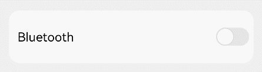
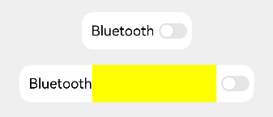

# Blank

The **Blank** component is a spacer in the layout, automatically filling the remaining space along the main axis of its parent container. It works only when the parent component is [Row](ts-container-row.md), [Column](ts-container-column.md), or [Flex](ts-container-flex.md).

>  **NOTE**
>
>  This component is supported since API version 7. Updates will be marked with a superscript to indicate their earliest API version.


## Child Components

Not supported


## APIs

Blank(min?: number | string)

Since API version 10: 
 - When the **Blank** component is used within a [Row](ts-container-row.md), [Column](ts-container-column.md), or [Flex](ts-container-flex.md) container, it will automatically stretch or shrink along the main axis if it does not have a main axis size specified. If the **Blank** component has a main axis size specified or if the container is set to adapt to the size of its child nodes, the component will not automatically stretch or shrink.
 - Relationship between **size** and **min** of the **Blank** component on the main axis: max(min, size). 
 - If the **Blank** component has a cross axis size specified, it will not fill up the parent container on the cross axis. If it does not have a cross axis size specified, it will fill up the parent container on the cross axis, following the **ItemAlign.Stretch** mode, the default setting of **alignSelf**. 

**Widget capability**: This API can be used in ArkTS widgets since API version 9.

**Atomic service API**: This API can be used in atomic services since API version 11.

**System capability**: SystemCapability.ArkUI.ArkUI.Full

**Parameters**

| Name| Type| Mandatory| Description|
| -------- | -------- | -------- | -------- |
| min | number \| string | No| Minimum size of the **Blank** component in the container along the main axis.<br>Default value: **0**<br>If the type is number, the default unit is vp. If the type is string, the [pixel unit](ts-pixel-units.md) can be explicitly specified, for example, '**10px'**. If the unit is not specified, the default unit vp is used, in which case **'10'** is equivalent to **10vp**.<br>**NOTE**<br>This parameter cannot be set in percentage. If the value is negative, the default value is used. If the minimum size is larger than the available space of the container, it is used as the component size, and the component extends beyond the container.|

## Attributes

In addition to the [universal attributes](ts-component-general-attributes.md), the following attributes are supported.

### color

color(value: ResourceColor)

Sets the color to fill the blank.

**Widget capability**: This API can be used in ArkTS widgets since API version 9.

**Atomic service API**: This API can be used in atomic services since API version 11.

**System capability**: SystemCapability.ArkUI.ArkUI.Full

**Parameters**

| Name| Type| Mandatory| Description|
| -------- | -------- | -------- | -------- |
| value | [ResourceColor](ts-types.md#resourcecolor) | Yes| Color to fill the blank.<br>Default value: **Color.Transparent**|

## Events

The [universal events](ts-component-general-events.md) are supported.

## Example

### Example 1: Filling Remaining Space

This example shows how the **Blank** component fills the remaining space in landscape and portrait modes.

```ts
// xxx.ets
@Entry
@Component
struct BlankExample {
  build() {
    Column() {
      Row() {
        Text('Bluetooth').fontSize(18)
        Blank()
        Toggle({ type: ToggleType.Switch }).margin({ top: 14, bottom: 14, left: 6, right: 6 })
      }.width('100%').backgroundColor(0xFFFFFF).borderRadius(15).padding({ left: 12 })
    }.backgroundColor(0xEFEFEF).padding(20)
  }
}
```

Portrait mode



Landscape mode


### Example 2: Filling a Fixed Width

This example shows the effect of using the **min** parameter of the **Blank** component when its parent component does not have a width set.

```ts
// xxx.ets
@Entry
@Component
struct BlankExample {
  build() {
    Column({ space: 20 }) {
      // If the width of the parent container is not set, the Blank component becomes invalid. In this case, you can set min to specify the minimum width of the Blank component.
      Row() {
        Text('Bluetooth').fontSize(18)
        Blank().color(Color.Yellow)
        Toggle({ type: ToggleType.Switch }).margin({ top: 14, bottom: 14, left: 6, right: 6 })
      }.backgroundColor(0xFFFFFF).borderRadius(15).padding({ left: 12 })

      Row() {
        Text('Bluetooth').fontSize(18)
        // Set the minimum width to 160.
        Blank('160').color(Color.Yellow)
        Toggle({ type: ToggleType.Switch }).margin({ top: 14, bottom: 14, left: 6, right: 6 })
      }.backgroundColor(0xFFFFFF).borderRadius(15).padding({ left: 12 })

    }.backgroundColor(0xEFEFEF).padding(20).width('100%')
  }
}
```
If the width of the parent container is not set, set **min** to specify the minimum width of the **Blank** component.


