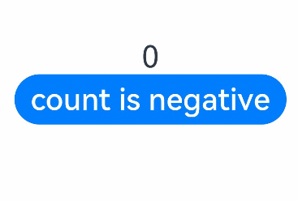
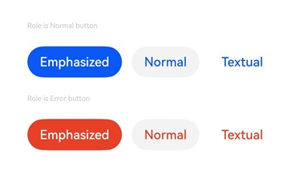
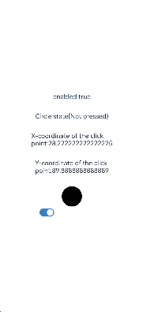

# Button

The **Button** component can be used to create different types of buttons.

>  **NOTE**
>
>  This component is supported since API version 7. Updates will be marked with a superscript to indicate their earliest API version.


## Child Components

This component can contain only one child component.


## APIs

### Button

Button(options: ButtonOptions)

Creates a button that can contain a single child component.

**Widget capability**: This API can be used in ArkTS widgets since API version 9.

**Atomic service API**: This API can be used in atomic services since API version 11.

**System capability**: SystemCapability.ArkUI.ArkUI.Full

**Parameters**

| Name | Type                                   | Mandatory| Description                |
| ------- | --------------------------------------- | ---- | -------------------- |
| options | [ButtonOptions](#buttonoptions) | Yes  | Button settings.|

### Button

Button(label: ResourceStr, options?: ButtonOptions)

Creates a button based on text content. In this case, the component cannot contain child components.

By default, the text content is displayed in a one line.

**Widget capability**: This API can be used in ArkTS widgets since API version 9.

**Atomic service API**: This API can be used in atomic services since API version 11.

**System capability**: SystemCapability.ArkUI.ArkUI.Full

**Parameters**

| Name | Type                                   | Mandatory| Description                |
| ------- | --------------------------------------- | ---- | -------------------- |
| label   | [ResourceStr](ts-types.md#resourcestr)  | Yes  | Button text.      |
| options | [ButtonOptions](#buttonoptions) | No  | Button settings.|

## ButtonOptions

**System capability**: SystemCapability.ArkUI.ArkUI.Full

| Name                     | Type                                         | Mandatory| Description                                                      |
| ------------------------- | --------------------------------------------- | ---- | ------------------------------------------------------------ |
| type                      | [ButtonType](#buttontype)             | No  | Button type.<br>Default value: Since API version 16: **ButtonType.ROUNDED_RECTANGLE**<br> API version 15 and earlier versions: **ButtonType.Capsule**<br>**Widget capability**: This API can be used in ArkTS widgets since API version 9.<br>**Atomic service API**: This API can be used in atomic services since API version 11.|
| stateEffect               | boolean                                       | No  | Whether to enable the pressed effect on the click of the button. The value **false** means to disable the pressed effect.<br>Default value: **true**<br>**NOTE**<br>When the pressed effect is enabled on the click of the button and the state style is set, the background color is applied based on the state style.<br>**Widget capability**: This API can be used in ArkTS widgets since API version 9.<br>**Atomic service API**: This API can be used in atomic services since API version 11.|
| buttonStyle<sup>11+</sup> | [ButtonStyleMode](#buttonstylemode11) | No  | Style and primacy of the button.<br>Default value: **ButtonStyleMode.EMPHASIZED**<br>**NOTE**<br>The button primacy is as follows, from high to low: emphasized button, normal button, text button.<br>**Widget capability**: This API can be used in ArkTS widgets since API version 11.<br>**Atomic service API**: This API can be used in atomic services since API version 12.|
| controlSize<sup>11+</sup> | [ControlSize](#controlsize11)         | No  | Size of the button.<br>Default value: **ControlSize.NORMAL**<br>**Widget capability**: This API can be used in ArkTS widgets since API version 11.<br>**Atomic service API**: This API can be used in atomic services since API version 12.|
| role<sup>12+</sup> | [ButtonRole](#buttonrole12)         | No  | Role of the button.<br>Default value: **ButtonRole.NORMAL**<br>**Widget capability**: This API can be used in ArkTS widgets since API version 12.<br>**Atomic service API**: This API can be used in atomic services since API version 12.|

## Attributes

In addition to the [universal attributes](ts-universal-attributes-size.md), the following attributes are supported.

### type

type(value: ButtonType)

Sets the button type.

**Widget capability**: This API can be used in ArkTS widgets since API version 9.

**Atomic service API**: This API can be used in atomic services since API version 11.

**System capability**: SystemCapability.ArkUI.ArkUI.Full

**Parameters**

| Name| Type                             | Mandatory| Description                                       |
| ------ | --------------------------------- | ---- | ------------------------------------------- |
| value  | [ButtonType](#buttontype) | Yes  | Button type.<br>Default value: **ButtonType.ROUNDED_RECTANGLE**|

### fontSize

fontSize(value: Length)

Sets the font size for the button.

**Widget capability**: This API can be used in ArkTS widgets since API version 9.

**Atomic service API**: This API can be used in atomic services since API version 11.

**System capability**: SystemCapability.ArkUI.ArkUI.Full

**Parameters**

| Name| Type                        | Mandatory| Description                                                        |
| ------ | ---------------------------- | ---- | ------------------------------------------------------------ |
| value  | [Length](ts-types.md#length) | Yes  | Font size of the button.<br>Default value:<br>**$r('sys.float.Body_L')** when **controlSize** is set to **ControlSize.NORMAL**<br>**$r('sys.float.Body_S')** when **controlSize** is set to **ControlSize.SMALL**|

### fontColor

fontColor(value: ResourceColor)

Sets the font color for the button.

**Widget capability**: This API can be used in ArkTS widgets since API version 9.

**Atomic service API**: This API can be used in atomic services since API version 11.

**System capability**: SystemCapability.ArkUI.ArkUI.Full

**Parameters**

| Name| Type                                      | Mandatory| Description                                                        |
| ------ | ------------------------------------------ | ---- | ------------------------------------------------------------ |
| value  | [ResourceColor](ts-types.md#resourcecolor) | Yes  | Font color of the button.<br>Default value: **$r('sys.color.font_on_primary')**, which means white|

### fontWeight

fontWeight(value: number | FontWeight | string)

Sets the font weight for the button.

**Widget capability**: This API can be used in ArkTS widgets since API version 9.

**Atomic service API**: This API can be used in atomic services since API version 11.

**System capability**: SystemCapability.ArkUI.ArkUI.Full

**Parameters**

| Name| Type                                                        | Mandatory| Description                                                        |
| ------ | ------------------------------------------------------------ | ---- | ------------------------------------------------------------ |
| value  | number \| [FontWeight](ts-appendix-enums.md#fontweight) \| string | Yes  | Font weight of the button. For the number type, the value ranges from 100 to 900, at an interval of 100. A larger value indicates a thicker font.<br>Default value: **500**|

### fontStyle<sup>8+</sup>

fontStyle(value: FontStyle)

Sets the font style for the button.

**Widget capability**: This API can be used in ArkTS widgets since API version 9.

**Atomic service API**: This API can be used in atomic services since API version 11.

**System capability**: SystemCapability.ArkUI.ArkUI.Full

**Parameters**

| Name| Type                                       | Mandatory| Description                                           |
| ------ | ------------------------------------------- | ---- | ----------------------------------------------- |
| value  | [FontStyle](ts-appendix-enums.md#fontstyle) | Yes  | Font style of the button.<br>Default value: **FontStyle.Normal**|

### stateEffect

stateEffect(value: boolean)

Specifies whether to enable the pressed effect on the click of the button.

**Widget capability**: This API can be used in ArkTS widgets since API version 9.

**Atomic service API**: This API can be used in atomic services since API version 11.

**System capability**: SystemCapability.ArkUI.ArkUI.Full

**Parameters**

| Name| Type   | Mandatory| Description                                                        |
| ------ | ------- | ---- | ------------------------------------------------------------ |
| value  | boolean | Yes  | Whether to enable the pressed effect on the click of the button. The value **false** means to disable the pressed effect.<br>Default value: **true**|

>  **NOTE**
> 
>  When the polymorphic style is used to set the pressed state, set **stateEffect** to **false** to avoid conflicts between the built-in and custom pressed state effects.

### fontFamily<sup>8+</sup>

fontFamily(value: string | Resource)

Sets the font family.

**Widget capability**: This API can be used in ArkTS widgets since API version 9.

**Atomic service API**: This API can be used in atomic services since API version 11.

**System capability**: SystemCapability.ArkUI.ArkUI.Full

**Parameters**

| Name| Type                                                | Mandatory| Description                                                        |
| ------ | ---------------------------------------------------- | ---- | ------------------------------------------------------------ |
| value  | string \| [Resource](ts-types.md#resource) | Yes  | Font family. The 'HarmonyOS Sans' font and [registered custom fonts](../js-apis-font.md) are supported.|

### labelStyle<sup>10+</sup>

labelStyle(value: LabelStyle)

Sets the label style for the button.

**Atomic service API**: This API can be used in atomic services since API version 11.

**System capability**: SystemCapability.ArkUI.ArkUI.Full

**Parameters**

| Name| Type                               | Mandatory| Description                             |
| ------ | ----------------------------------- | ---- | --------------------------------- |
| value  | [LabelStyle](#labelstyle10) | Yes  | Label style of the button.|

### buttonStyle<sup>11+</sup>

buttonStyle(value: ButtonStyleMode)

Sets the style and primacy for the button.

**Widget capability**: This API can be used in ArkTS widgets since API version 11.

**Atomic service API**: This API can be used in atomic services since API version 12.

**System capability**: SystemCapability.ArkUI.ArkUI.Full

**Parameters**

| Name| Type                                         | Mandatory| Description                                                        |
| ------ | --------------------------------------------- | ---- | ------------------------------------------------------------ |
| value  | [ButtonStyleMode](#buttonstylemode11) | Yes  | Style and primacy of the button<br>Default value: **ButtonStyleMode.EMPHASIZED**|

### controlSize<sup>11+</sup>

controlSize(value: ControlSize)

Sets the size for the button.

**Widget capability**: This API can be used in ArkTS widgets since API version 11.

**Atomic service API**: This API can be used in atomic services since API version 12.

**System capability**: SystemCapability.ArkUI.ArkUI.Full

**Parameters**

| Name| Type                                 | Mandatory| Description                                            |
| ------ | ------------------------------------- | ---- | ------------------------------------------------ |
| value  | [ControlSize](#controlsize11) | Yes  | Size of the button.<br>Default value: **ControlSize.NORMAL**|

### role<sup>12+</sup>

role(value: ButtonRole)

Sets the role of the button.

**Widget capability**: This API can be used in ArkTS widgets since API version 12.

**Atomic service API**: This API can be used in atomic services since API version 12.

**System capability**: SystemCapability.ArkUI.ArkUI.Full

**Parameters**

| Name| Type                                         | Mandatory| Description                                            |
| ------ | --------------------------------------------- | ---- | ------------------------------------------------ |
| value  | [ButtonRole](#buttonrole12) | Yes  | Role of the button.<br>Default value: **ButtonRole.NORMAL**|

### contentModifier<sup>12+</sup>

contentModifier(modifier: ContentModifier\<ButtonConfiguration>)

Creates a content modifier.

**Atomic service API**: This API can be used in atomic services since API version 12.

**System capability**: SystemCapability.ArkUI.ArkUI.Full

**Parameters**

| Name| Type                                         | Mandatory| Description                                            |
| ------ | --------------------------------------------- | ---- | ------------------------------------------------ |
| modifier  | [ContentModifier\<ButtonConfiguration>](#buttonconfiguration12) | Yes  | Content modifier to apply to the button.<br>**modifier**: content modifier. You need a custom class to implement the **ContentModifier** API.|

### minFontScale<sup>16+</sup>

minFontScale(scale: number | Resource)

Sets the minimum font scale factor for text.

**Atomic service API**: This API can be used in atomic services since API version 16.

**System capability**: SystemCapability.ArkUI.ArkUI.Full

**Parameters**

| Name| Type                                         | Mandatory| Description                                         |
| ------ | --------------------------------------------- | ---- | --------------------------------------------- |
| scale  | number \| [Resource](ts-types.md#resource) | Yes  | Minimum font scale factor for text.<br>Value range: [0, 1]<br>**NOTE**<br>A value less than 0 is handled as **0**. A value greater than 1 is handled as **1**. Abnormal values are ineffective by default.<br>If the multiplier is set to 0, no content is displayed.|

### maxFontScale<sup>16+</sup>

maxFontScale(scale: number | Resource)

Setting the scale factor to **0** hides the content.

**Atomic service API**: This API can be used in atomic services since API version 16.

**System capability**: SystemCapability.ArkUI.ArkUI.Full

**Parameters**

| Name| Type                                         | Mandatory| Description                                         |
| ------ | --------------------------------------------- | ---- | --------------------------------------------- |
| scale  | number \| [Resource](ts-types.md#resource) | Yes  | Maximum font scale factor for text.<br>Value range: [1, +∞)<br>**NOTE**<br>A value less than 1 is handled as **1**. Abnormal values are ineffective by default.<br>If not set, the maximum scale factor for circle buttons is 1.|

## ButtonType

**System capability**: SystemCapability.ArkUI.ArkUI.Full

| Name     | Description              |
| ------- | ------------------ |
| Capsule | Capsule-type button (the round corner is half of the height by default).**<br>**Widget capability**: This API can be used in ArkTS widgets since API version 9.**<br>**Atomic service API**: This API can be used in atomic services since API version 11.|
| Circle  | Circular button.**<br>**Widget capability**: This API can be used in ArkTS widgets since API version 9.**<br>**Atomic service API**: This API can be used in atomic services since API version 11.             |
| Normal  | Normal button, with no rounded corners by default. **<br>**Widget capability**: This API can be used in ArkTS widgets since API version 9.**<br>**Atomic service API**: This API can be used in atomic services since API version 11.    |
| ROUNDED_RECTANGLE<sup>15+</sup> | Rounded rectangle button (default value: when **controlSize** is **NORMAL**, the corner radius is 20 vp; when controlSize is **SMALL**, the corner radius is 14 vp).**<br>**Widget capability**: This API can be used in ArkTS widgets since API version 15.**<br>**Atomic service API**: This API can be used in atomic services since API version 15.|

>  **NOTE**
>  - The corner radius of the rounded rectangle button is set using the universal attribute [borderRadius](ts-universal-attributes-border.md#borderradius).
>  - For a button of the **Capsule** type, the **borderRadius** settings do not take effect, and the radius of its rounded corner is always half of the button height or width, whichever is smaller.
>  - For a button of the **Circle** type: (1) If both its width and height are set, **borderRadius** does not take effect, and the button radius is half of the width or height (whichever is smaller). (2) If either its width or height is set, **borderRadius** does not take effect, and the button radius is half of the set width or height. (3) If neither its width nor height is set, the button radius is as specified by **borderRadius**; if **borderRadius** is set to a negative value, the value **0** will be used.
>  - The button text is set using [fontSize](#fontsize), [fontColor](#fontcolor), [fontStyle](#fontstyle8), [fontFamily](#fontfamily8) and [fontWeight](#fontweight).
>  - Before setting the [gradient color](ts-universal-attributes-gradient-color.md), you need to set [backgroundColor](ts-universal-attributes-background.md#backgroundcolor) to transparent.
>  - When **borderRadius** is not set, the corner radius of the rounded rectangle button remains at the default value. In this case, the corner radius does not change with the button height and is subject to the **controlSize** property. When **controlSize** is **NORMAL**, the corner radius is 20 vp; when **controlSize** is **SMALL**, the corner radius is 14 vp.

## LabelStyle<sup>10+</sup>

**Atomic service API**: This API can be used in atomic services since API version 11.

**System capability**: SystemCapability.ArkUI.ArkUI.Full

| Name                | Type                                                        | Mandatory| Description                                                        |
| -------------------- | ------------------------------------------------------------ | ---- | ------------------------------------------------------------ |
| overflow             | [TextOverflow](ts-appendix-enums.md#textoverflow)            | No  | Display mode when the label text is too long. Text is clipped at the transition between words. To clip text in the middle of a word, add zero-width spaces between characters.<br>Default value: **TextOverflow.Ellipsis**|
| maxLines             | number                                                       | No  | Maximum number of lines in the label text. By default, text is automatically folded. If this attribute is specified, the text will not exceed the specified number of lines. If there is extra text, you can use **overflow** to specify how it is displayed.<br>Default value: **1**|
| minFontSize          | number \| [ResourceStr](ts-types.md#resourcestr)             | No  | Minimum font size of the label text. For the setting to take effect, this attribute must be used together with **maxFontSize**, **maxLines**, or layout constraint settings.<br>**NOTE**<br>If the value of **minFontSize** is less than or equal to 0, the adaptive font size does not take effect.|
| maxFontSize          | number \| [ResourceStr](ts-types.md#resourcestr)             | No  | Maximum font size of the label text. For the setting to take effect, this attribute must be used together with **minFontSize**, **maxLines**, or layout constraint settings.|
| heightAdaptivePolicy | [TextHeightAdaptivePolicy](ts-appendix-enums.md#textheightadaptivepolicy10) | No  | How the adaptive height is determined for the label text.<br>Default value: **TextHeightAdaptivePolicy.MAX_LINES_FIRST**|
| font                 | [Font](ts-types.md#font)                                     | No  | Font of the label text.<br>Default value: See [Font](ts-types.md#font).|

## ButtonStyleMode<sup>11+</sup>

**Widget capability**: This API can be used in ArkTS widgets since API version 11.

**Atomic service API**: This API can be used in atomic services since API version 12.

**System capability**: SystemCapability.ArkUI.ArkUI.Full

| Name     | Value| Description              |
| ------- | -- |------------------ |
| NORMAL  | 0 |Normal button (used to direct the user to a common task).             |
| EMPHASIZED | 1 |Emphasized button (used to direct the user to the most important task).|
| TEXTUAL  | 2 |Text button (displayed as simple text without any background color).     |

## ControlSize<sup>11+</sup>

**Widget capability**: This API can be used in ArkTS widgets since API version 11.

**Atomic service API**: This API can be used in atomic services since API version 12.

**System capability**: SystemCapability.ArkUI.ArkUI.Full

| Name     | Value|Description              |
| ------- | -- |------------------ |
| SMALL | "small" |Small button.|
| NORMAL  | "normal" |Normal button.             |

## ButtonRole<sup>12+</sup>

**Widget capability**: This API can be used in ArkTS widgets since API version 12.

**Atomic service API**: This API can be used in atomic services since API version 12.

**System capability**: SystemCapability.ArkUI.ArkUI.Full

| Name     | Value|Description              |
| ------- | -- |------------------ |
| NORMAL | 0 |Normal button.|
| ERROR  | 1 |Warning button.             |

## ButtonConfiguration<sup>12+</sup>

You need a custom class to implement the **ContentModifier** API.

**Atomic service API**: This API can be used in atomic services since API version 12.

**System capability**: SystemCapability.ArkUI.ArkUI.Full

| Name | Type   | Read Only | Optional| Description             |
| ------ | ------ | ---------------- | ---------------- | ---------------- |
| label | string | No| No| Text label of the button.|
| pressed | boolean | No| No| Whether the button is pressed.<br>**NOTE**<br>The button here refers to the original button, not the new component constructed using the builder. If the new component is larger than the original button, this parameter does not signify the pressed state of the excess part.|
| triggerClick | [ButtonTriggerClickCallback](#buttontriggerclickcallback12) | No| No| Click event of the new component constructed using the builder.|

## ButtonTriggerClickCallback<sup>12+</sup>

type ButtonTriggerClickCallback = (xPos: number, yPos: number) => void

Defines the callback type used in **ButtonConfiguration**.

**Atomic service API**: This API can be used in atomic services since API version 12.

**System capability**: SystemCapability.ArkUI.ArkUI.Full

**Parameters**

| Name | Type   | Mandatory| Description             |
| ------ | ------ | ---- | ---------------- |
| xPos | number | Yes| X-coordinate of the click point.|
| yPos | number | Yes| Y-coordinate of the click point.|

## Events

The [universal events](ts-universal-events-click.md) are supported.
## Example

### Example 1: Setting the Button Display Style

This example demonstrates two methods to create buttons, either with child components or using text content.

```ts
// xxx.ets
@Entry
@Component
struct ButtonExample {
  build() {
    Flex({ direction: FlexDirection.Column, alignItems: ItemAlign.Start, justifyContent: FlexAlign.SpaceBetween }) {
      Text('Normal button').fontSize(9).fontColor(0xCCCCCC)
      Flex({ alignItems: ItemAlign.Center, justifyContent: FlexAlign.SpaceBetween }) {
        Button('OK', { type: ButtonType.Normal, stateEffect: true })
          .borderRadius(8)
          .backgroundColor(0x317aff)
          .width(90)
          .onClick(() => {
            console.log('ButtonType.Normal')
          })
        Button({ type: ButtonType.Normal, stateEffect: true }) {
          Row() {
            LoadingProgress().width(20).height(20).margin({ left: 12 }).color(0xFFFFFF)
            Text('loading').fontSize(12).fontColor(0xffffff).margin({ left: 5, right: 12 })
          }.alignItems(VerticalAlign.Center)
        }.borderRadius(8).backgroundColor(0x317aff).width(90).height(40)

        Button('Disable', { type: ButtonType.Normal, stateEffect: false }).opacity(0.4)
          .borderRadius(8).backgroundColor(0x317aff).width(90)
      }

      Text('Capsule button').fontSize(9).fontColor(0xCCCCCC)
      Flex({ alignItems: ItemAlign.Center, justifyContent: FlexAlign.SpaceBetween }) {
        Button('OK', { type: ButtonType.Capsule, stateEffect: true }).backgroundColor(0x317aff).width(90)
        Button({ type: ButtonType.Capsule, stateEffect: true }) {
          Row() {
            LoadingProgress().width(20).height(20).margin({ left: 12 }).color(0xFFFFFF)
            Text('loading').fontSize(12).fontColor(0xffffff).margin({ left: 5, right: 12 })
          }.alignItems(VerticalAlign.Center).width(90).height(40)
        }.backgroundColor(0x317aff)

        Button('Disable', { type: ButtonType.Capsule, stateEffect: false }).opacity(0.4)
          .backgroundColor(0x317aff).width(90)
      }

      Text('Circle button').fontSize(9).fontColor(0xCCCCCC)
      Flex({ alignItems: ItemAlign.Center, wrap: FlexWrap.Wrap }) {
        Button({ type: ButtonType.Circle, stateEffect: true }) {
          LoadingProgress().width(20).height(20).color(0xFFFFFF)
        }.width(55).height(55).backgroundColor(0x317aff)

        Button({ type: ButtonType.Circle, stateEffect: true }) {
          LoadingProgress().width(20).height(20).color(0xFFFFFF)
        }.width(55).height(55).margin({ left: 20 }).backgroundColor(0xF55A42)
      }
    }.height(400).padding({ left: 35, right: 35, top: 35 })
  }
}
```


### Example 2: Adding Render Control to a Button

This example uses if/else statements to control the display text of the button.

```ts
// xxx.ets
@Entry
@Component
struct SwipeGestureExample {
  @State count: number = 0

  build() {
    Column() {
      Text(`${this.count}`)
        .fontSize(30)
        .onClick(() => {
          this.count++
        })
      if (this.count <= 0) {
        Button('count is negative').fontSize(30).height(50)
      } else if (this.count % 2 === 0) {
        Button('count is even').fontSize(30).height(50)
      } else {
        Button('count is odd').fontSize(30).height(50)
      }
    }.height('100%').width('100%').justifyContent(FlexAlign.Center)
  }
}
```



### Example 3: Setting the Button Text Style

This example customizes the display style of button text by configuring **labelStyle**.

```ts
// xxx.ets
@Entry
@Component
struct buttonTestDemo {
  @State txt: string = 'overflowTextOverlengthTextOverflow.Clip';
  @State widthShortSize: number = 210;

  build() {
    Row() {
      Column() {
        Button(this.txt)
          .width(this.widthShortSize)
          .height(100)
          .backgroundColor(0x317aff)
          .labelStyle({ overflow: TextOverflow.Clip,
            maxLines: 1,
            minFontSize: 20,
            maxFontSize: 20,
            font: {
              size: 20,
              weight: FontWeight.Bolder,
              family: 'cursive',
              style: FontStyle.Italic
            }
          })
          .fontSize(40)
      }
      .width('100%')
    }
    .height('100%')
  }
}
```


### Example 4: Setting Importance of Different Sized Buttons

This example demonstrates how to set the importance of buttons of different sizes by configuring **controlSize** and **buttonStyle**.

```ts
// xxx.ets
@Entry
@Component
struct ButtonExample {
  build() {
    Flex({ direction: FlexDirection.Column, alignItems: ItemAlign.Start, justifyContent: FlexAlign.SpaceBetween }) {
      Text('Normal size button').fontSize(9).fontColor(0xCCCCCC)
      Flex({ alignItems: ItemAlign.Center, justifyContent: FlexAlign.SpaceBetween }) {
        Button('Emphasized', { buttonStyle: ButtonStyleMode.EMPHASIZED });
        Button('Normal', { buttonStyle: ButtonStyleMode.NORMAL });
        Button('Textual', { buttonStyle: ButtonStyleMode.TEXTUAL });
      }

      Text('Small size button').fontSize(9).fontColor(0xCCCCCC)
      Flex({ alignItems: ItemAlign.Center, justifyContent: FlexAlign.SpaceBetween }) {
        Button('Emphasized', { controlSize: ControlSize.SMALL, buttonStyle: ButtonStyleMode.EMPHASIZED });
        Button('Normal', { controlSize: ControlSize.SMALL, buttonStyle: ButtonStyleMode.NORMAL });
        Button('Textual', { controlSize: ControlSize.SMALL, buttonStyle: ButtonStyleMode.TEXTUAL });
      }

      Text('Small size button').fontSize(9).fontColor(0xCCCCCC)
      Flex({ alignItems: ItemAlign.Center, justifyContent: FlexAlign.SpaceBetween }) {
        Button('Emphasized').controlSize(ControlSize.SMALL).buttonStyle(ButtonStyleMode.EMPHASIZED);
        Button('Normal').controlSize(ControlSize.SMALL).buttonStyle(ButtonStyleMode.NORMAL);
        Button('Textual').controlSize(ControlSize.SMALL).buttonStyle(ButtonStyleMode.TEXTUAL);
      }

    }.height(400).padding({ left: 35, right: 35, top: 35 })
  }
}
```


### Example 5: Setting the Button Role

This example demonstrates how to set the role of the button by configuring **role**.

```ts
// xxx.ets
@Entry
@Component
struct ButtonExample {
  build() {
    Flex({ direction: FlexDirection.Column, alignItems: ItemAlign.Start, justifyContent: FlexAlign.SpaceBetween }) {
      Text('Role is Normal button').fontSize(9).fontColor(0xCCCCCC)
      Flex({ alignItems: ItemAlign.Center, justifyContent: FlexAlign.SpaceBetween }) {
        Button('Emphasized', { buttonStyle: ButtonStyleMode.EMPHASIZED, role: ButtonRole.NORMAL });
        Button('Normal', { buttonStyle: ButtonStyleMode.NORMAL, role: ButtonRole.NORMAL });
        Button('Textual', { buttonStyle: ButtonStyleMode.TEXTUAL, role: ButtonRole.NORMAL });
      }
      Text('Role is Error button').fontSize(9).fontColor(0xCCCCCC)
      Flex({ alignItems: ItemAlign.Center, justifyContent: FlexAlign.SpaceBetween }) {
        Button('Emphasized', { buttonStyle: ButtonStyleMode.EMPHASIZED, role: ButtonRole.ERROR});
        Button('Normal', { buttonStyle: ButtonStyleMode.NORMAL, role: ButtonRole.ERROR });
        Button('Textual', { buttonStyle: ButtonStyleMode.TEXTUAL, role: ButtonRole.ERROR });
      }
    }.height(200).padding({ left: 35, right: 35, top: 35 })
  }
}
```


### Example 6: ImplementIng a Custom Button
This example implements a custom button in the shape of a circle. The circle is red when pressed, accompanied by the text "Pressed" in the title. It is black when not pressed, accompanied by the text "Not pressed" in the title.
```ts
class MyButtonStyle implements ContentModifier<ButtonConfiguration> {
  x: number = 0
  y: number = 0
  selectedColor:Color = Color.Black

  constructor(x : number, y: number,ColorType:Color) {
    this.x = x
    this.y = y
    this.selectedColor = ColorType
  }
  applyContent() : WrappedBuilder<[ButtonConfiguration]>
  {
    return wrapBuilder(buildButton1)
  }
}

@Builder function buildButton1(config: ButtonConfiguration) {
  Column({space:30}) {
    Text(config.enabled ? "enabled true" : "enabled false")
    Text('Circle state' + (config.pressed? "(Pressed)" : "(Not pressed)"))
    Text('X-coordinate of the click point:' + (config.enabled ? (config.contentModifier as MyButtonStyle).x : "0"))
    Text('Y-coordinate of the click point:' + (config.enabled ? (config.contentModifier as MyButtonStyle).y : "0"))
    Circle({ width: 50, height: 50 })
      .fill(config.pressed ? (config.contentModifier as MyButtonStyle).selectedColor : Color.Black)
      .gesture(
        TapGesture({count:1}).onAction((event: GestureEvent)=>{
          config.triggerClick(event.fingerList[0].localX,event.fingerList[0].localY)
        })).opacity(config.enabled ? 1 : 0.1)
  }
}

@Entry
@Component
struct ButtonExample {
  @State buttonEnabled: boolean = true;
  @State positionX: number = 0
  @State positionY: number = 0
  @State state : boolean[] = [true,false]
  @State index:number = 0
  build() {
    Column() {
      Button('OK')
        .contentModifier(new MyButtonStyle(this.positionX,this.positionY,Color.Red))
        .onClick((event) => {
          console.info('change' + JSON.stringify(event))
          this.positionX = event.displayX
          this.positionY = event.displayY
        }).enabled(this.buttonEnabled)
      Row() {
        Toggle({ type: ToggleType.Switch, isOn: true }).onChange((value: boolean) => {
          if (value) {
            this.buttonEnabled = true
          } else {
            this.buttonEnabled = false
          }
        }).margin({left:-80})
      }
    }.height('100%').width('100%').justifyContent(FlexAlign.Center)
  }
}
```


### Example 7: Setting Rounded Rectangle Buttons
This example creates rounded rectangle buttons by configuring **ButtonType.ROUNDED_RECTANGLE**.
```ts
@Entry
@Component
struct ButtonExample {
  build() {
    Flex({ direction: FlexDirection.Column, alignItems: ItemAlign.Start, justifyContent: FlexAlign.SpaceBetween }) {
      Text('Rounded rectangle button with rounded corners by default.').fontSize(9).fontColor(0xCCCCCC)
      Flex({ alignItems: ItemAlign.Center, justifyContent: FlexAlign.SpaceBetween }) {
        Button('Rounded rectangle')
          .type(ButtonType.ROUNDED_RECTANGLE)
          .backgroundColor(0x317aff)
          .controlSize(ControlSize.NORMAL)
          .width(180)
      }
      Text('Rounded rectangle button configured with a borderRadius of 5.').fontSize(9).fontColor(0xCCCCCC)
      Flex({ alignItems: ItemAlign.Center, justifyContent: FlexAlign.SpaceBetween }) {
        Button('Rounded rectangle')
          .type(ButtonType.ROUNDED_RECTANGLE)
          .backgroundColor(0x317aff)
          .controlSize(ControlSize.NORMAL)
          .width(180)
          .borderRadius(5)
      }
      Text('Rounded rectangle button configured extra long text.').fontSize(9).fontColor(0xCCCCCC)
      Flex({ alignItems: ItemAlign.Center, justifyContent: FlexAlign.SpaceBetween }) {
        Button('Rounded rectangle Rounded rectangle Rounded rectangle Rounded rectangle')
          .type(ButtonType.ROUNDED_RECTANGLE)
          .backgroundColor(0x317aff)
          .width(180)
            //.buttonStyle(ButtonStyleMode.NORMAL)
          .labelStyle({overflow:TextOverflow.Ellipsis, maxLines:3, minFontSize: 0})
      }
    }.height(400).padding({ left: 35, right: 35, top: 35 })
  }
}
```

