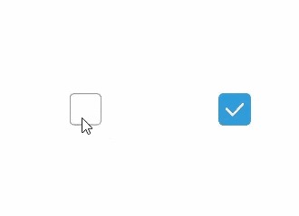
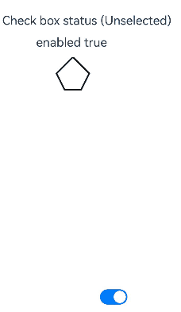
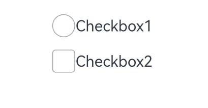

# Checkbox

**Checkbox** is a component that is used to enable or disable an option.

>  **NOTE**
>
>  Since API version 11, the default style of the **Checkbox** component is changed from rounded square to circle.
>
>  This component is supported since API version 8. Updates will be marked with a superscript to indicate their earliest API version.

## Child Components

Not supported

## APIs

Checkbox(options?: CheckboxOptions)

Creates a check box.

**Widget capability**: This API can be used in ArkTS widgets since API version 9.

**Atomic service API**: This API can be used in atomic services since API version 11.

**System capability**: SystemCapability.ArkUI.ArkUI.Full

**Parameters**

| Name | Type                                       | Mandatory| Description              |
| ------- | ------------------------------------------- | ---- | ------------------ |
| options | [CheckboxOptions](#checkboxoptions)| No  | Check box parameters.|

## CheckboxOptions

**System capability**: SystemCapability.ArkUI.ArkUI.Full

| Name | Type| Mandatory | Description|
| --------| --------| ------ | -------- |
| name    | string | No| Name of the check box.<br>**Widget capability**: This API can be used in ArkTS widgets since API version 9.<br>**Atomic service API**: This API can be used in atomic services since API version 11.|
| group   | string | No| Group name of the check box (that is, the name of the check box group to which the check box belongs).<br>**NOTE**<br>For the settings to take effect, this parameter must be used with the [CheckboxGroup](ts-basic-components-checkboxgroup.md) component.<br>**Widget capability**: This API can be used in ArkTS widgets since API version 9.<br>**Atomic service API**: This API can be used in atomic services since API version 11.|
| indicatorBuilder<sup>12+</sup> | [CustomBuilder](ts-types.md#custombuilder8) | No| Custom component to indicate that the check box is selected. This custom component is center aligned with the check box. When **indicatorBuilder** is set to **undefined** or **null**, it defaults to the state where it is not set.<br>**Atomic service API**: This API can be used in atomic services since API version 12.|

## Attributes

In addition to the [universal attributes](ts-component-general-attributes.md), the following attributes are supported.

### select

select(value: boolean)

Sets whether the check box is selected.

Since API version 10, this attribute supports two-way binding through [$$](../../../ui/state-management/arkts-two-way-sync.md).
Since API version 18, this attribute supports two-way binding through [!!](../../../ui/state-management/arkts-new-binding.md#two-way-binding-between-built-in-component-parameters).

**Widget capability**: This API can be used in ArkTS widgets since API version 9.

**Atomic service API**: This API can be used in atomic services since API version 11.

**System capability**: SystemCapability.ArkUI.ArkUI.Full

**Parameters**

| Name| Type   | Mandatory| Description                                                        |
| ------ | ------- | ---- | ------------------------------------------------------------ |
| value  | boolean | Yes  | Whether the check box is selected.<br>Default value: **false**<br>**true**: The check box is selected. **false**: The check box is not selected.|

### select<sup>18+</sup>

select(isSelected: Optional\<boolean>)

Sets whether the check box is selected. Compared with [select](#select), this API supports the **undefined** type for the **isSelected** parameter.

This attribute supports two-way binding through [$$](../../../ui/state-management/arkts-two-way-sync.md). This attribute supports two-way binding through [!!](../../../ui/state-management/arkts-new-binding.md).

**Widget capability**: This API can be used in ArkTS widgets since API version 18.

**Atomic service API**: This API can be used in atomic services since API version 18.

**System capability**: SystemCapability.ArkUI.ArkUI.Full

**Parameters**

| Name    | Type                                                        | Mandatory| Description                                                        |
| ---------- | ------------------------------------------------------------ | ---- | ------------------------------------------------------------ |
| isSelected | [Optional](ts-universal-attributes-custom-property.md#optional12)\<boolean> | Yes  | Whether the check box is selected.<br>If **isSelected** is set to **undefined**, the default value **false** is used.<br>**true**: The check box is selected. **false**: The check box is not selected.|

### selectedColor

selectedColor(value: ResourceColor)

Sets the color of the check box when it is selected.

**Widget capability**: This API can be used in ArkTS widgets since API version 9.

**Atomic service API**: This API can be used in atomic services since API version 11.

**System capability**: SystemCapability.ArkUI.ArkUI.Full

**Parameters**

| Name| Type                                      | Mandatory| Description                                                        |
| ------ | ------------------------------------------ | ---- | ------------------------------------------------------------ |
| value  | [ResourceColor](ts-types.md#resourcecolor) | Yes  | Color of the check box when it is selected.<br>Default value: **$r('sys.color.ohos_id_color_text_primary_activated')**<br>An invalid value is handled as the default value.|

### selectedColor<sup>18+</sup>

selectedColor(resColor: Optional\<ResourceColor>)

Sets the color of the check box when it is selected. Compared with [selectedColor](#selectedcolor), this API supports the **undefined** type for the **resColor** parameter.

**Widget capability**: This API can be used in ArkTS widgets since API version 18.

**Atomic service API**: This API can be used in atomic services since API version 18.

**System capability**: SystemCapability.ArkUI.ArkUI.Full

**Parameters**

| Name  | Type                                                        | Mandatory| Description                                                        |
| -------- | ------------------------------------------------------------ | ---- | ------------------------------------------------------------ |
| resColor | [Optional](ts-universal-attributes-custom-property.md#optional12)\<[ResourceColor](ts-types.md#resourcecolor)> | Yes  | Color of the check box when it is selected.<br>If **resColor** is set to **undefined**, the default value **$r('sys.color.ohos_id_color_text_primary_activated')** is used.<br>An invalid value is handled as the default value.|

### unselectedColor<sup>10+</sup>

unselectedColor(value: ResourceColor)

Sets the border color of the check box when it is not selected.

**Atomic service API**: This API can be used in atomic services since API version 11.

**System capability**: SystemCapability.ArkUI.ArkUI.Full

**Parameters**

| Name| Type                                      | Mandatory| Description                    |
| ------ | ------------------------------------------ | ---- | -------------------------- |
| value  | [ResourceColor](ts-types.md#resourcecolor) | Yes  | Border color of the check box when it is not selected.<br>Default value: **$r('sys.color.ohos_id_color_switch_outline_off')**|

### unselectedColor<sup>18+</sup>

unselectedColor(resColor: Optional\<ResourceColor>)

Sets the border color of the check box when it is not selected. Compared with [unselectedColor](#unselectedcolor10)<sup>10+</sup>, this API supports the **undefined** type for the **resColor** parameter.

**Atomic service API**: This API can be used in atomic services since API version 18.

**System capability**: SystemCapability.ArkUI.ArkUI.Full

**Parameters**

| Name  | Type                                                        | Mandatory| Description                                                        |
| -------- | ------------------------------------------------------------ | ---- | ------------------------------------------------------------ |
| resColor | [Optional](ts-universal-attributes-custom-property.md#optional12)\<[ResourceColor](ts-types.md#resourcecolor)> | Yes  | Border color of the check box when it is not selected.<br>If **resColor** is set to **undefined**, the default value **$r('sys.color.ohos_id_color_switch_outline_off')** is used.|

### mark<sup>10+</sup>

mark(value: MarkStyle)

Sets the check mark style of the check box.

**Atomic service API**: This API can be used in atomic services since API version 11.

**System capability**: SystemCapability.ArkUI.ArkUI.Full

**Parameters**

| Name| Type                                        | Mandatory| Description                                                        |
| ------ | -------------------------------------------- | ---- | ------------------------------------------------------------ |
| value  | [MarkStyle](ts-types.md#markstyle10) | Yes  | Check mark style of the check box. Since API version 12, if **indicatorBuilder** is set, the style is determined by **indicatorBuilder**.<br>Default value: {<br>strokeColor : `$r('sys.color.ohos_id_color_foreground_contrary')`,<br>strokeWidth: `$r('sys.float.ohos_id_checkbox_stroke_width')`,<br>size: '20vp'<br>} |

### mark<sup>18+</sup>

mark(style: Optional\<MarkStyle>)

Sets the check mark style of the check box. Compared with [mark](#mark10)<sup>10+</sup>, this API supports the **undefined** type for the **style** parameter.

**Atomic service API**: This API can be used in atomic services since API version 18.

**System capability**: SystemCapability.ArkUI.ArkUI.Full

**Parameters**

| Name| Type                                                        | Mandatory| Description                                                        |
| ------ | ------------------------------------------------------------ | ---- | ------------------------------------------------------------ |
| style  | [Optional](ts-universal-attributes-custom-property.md#optional12)\<[MarkStyle](ts-types.md#markstyle10)> | Yes  | Check mark style of the check box. If **indicatorBuilder** is set, the style is determined by **indicatorBuilder**.<br>If **style** is set to **undefined**, the default value is used: {<br>strokeColor : `$r('sys.color.ohos_id_color_foreground_contrary')`,<br>strokeWidth: `$r('sys.float.ohos_id_checkbox_stroke_width')`,<br>size: '20vp'<br>} |

### shape<sup>11+</sup>

shape(value: CheckBoxShape)

Sets the shape of the check box.

**Widget capability**: This API can be used in ArkTS widgets since API version 11.

**Atomic service API**: This API can be used in atomic services since API version 12.

**System capability**: SystemCapability.ArkUI.ArkUI.Full

**Parameters**

| Name| Type                                                 | Mandatory| Description                                                        |
| ------ | ----------------------------------------------------- | ---- | ------------------------------------------------------------ |
| value  | [CheckBoxShape](ts-appendix-enums.md#checkboxshape11) | Yes  | Shape of the check box.<br>Default value: **CheckBoxShape.CIRCLE**|

### shape<sup>18+</sup>

shape(shape: Optional\<CheckBoxShape>)

Sets the shape of the check box. Compared with [shape](#shape11)<sup>11+</sup>, this API supports the **undefined** type for the **shape** parameter.

**Widget capability**: This API can be used in ArkTS widgets since API version 18.

**Atomic service API**: This API can be used in atomic services since API version 18.

**System capability**: SystemCapability.ArkUI.ArkUI.Full

**Parameters**

| Name| Type                                                        | Mandatory| Description                                                        |
| ------ | ------------------------------------------------------------ | ---- | ------------------------------------------------------------ |
| shape  | [Optional](ts-universal-attributes-custom-property.md#optional12)\<[CheckBoxShape](ts-appendix-enums.md#checkboxshape11)> | Yes  | Shape of the check box.<br>If **shape** is set to **undefined**, the default value **CheckBoxShape.CIRCLE** is used.|

### contentModifier<sup>12+</sup>

contentModifier(modifier: ContentModifier\<CheckBoxConfiguration>)

Creates a content modifier.

**Atomic service API**: This API can be used in atomic services since API version 12.

**System capability**: SystemCapability.ArkUI.ArkUI.Full

**Parameters**

| Name| Type                                         | Mandatory| Description                                            |
| ------ | --------------------------------------------- | ---- | ------------------------------------------------ |
| modifier  | [ContentModifier\<CheckBoxConfiguration>](#checkboxconfiguration12) | Yes  | Content modifier to apply to the check box.<br>**modifier**: content modifier. You need a custom class to implement the **ContentModifier** API.|

### contentModifier<sup>18+</sup>

contentModifier(modifier: Optional<ContentModifier\<CheckBoxConfiguration>>)

Creates a content modifier. Compared with [contentModifier](#contentmodifier12)<sup>12+</sup>, this API supports the **undefined** type for the **modifier** parameter.

**Atomic service API**: This API can be used in atomic services since API version 18.

**System capability**: SystemCapability.ArkUI.ArkUI.Full

**Parameters**

| Name  | Type                                                        | Mandatory| Description                                                        |
| -------- | ------------------------------------------------------------ | ---- | ------------------------------------------------------------ |
| modifier | [Optional](ts-universal-attributes-custom-property.md#optional12)\<[ContentModifier\<CheckBoxConfiguration>](#checkboxconfiguration12)> | Yes  | Content modifier to apply to the check box.<br>**modifier**: content modifier. You need a custom class to implement the **ContentModifier** API.<br>If **modifier** is set to **undefined**, no content modifier is used.|

## Events

In addition to the [universal events](ts-component-general-events.md), the following events are supported.

### onChange

onChange(callback: OnCheckboxChangeCallback)

Invoked when the selected state of the check box changes.

**Widget capability**: This API can be used in ArkTS widgets since API version 9.

**Atomic service API**: This API can be used in atomic services since API version 11.

**System capability**: SystemCapability.ArkUI.ArkUI.Full

**Parameters**

| Name  | Type                                                   | Mandatory| Description            |
| -------- | ------------------------------------------------------- | ---- | ---------------- |
| callback | [OnCheckboxChangeCallback](#oncheckboxchangecallback18) | Yes  | Callback used to return the selected state.|

### onChange<sup>18+</sup>

onChange(callback: Optional\<OnCheckboxChangeCallback>)

Invoked when the selected state of the check box changes. Compared with [onChange](#onchange), this API supports the **undefined** type for the **callback** parameter.

**Widget capability**: This API can be used in ArkTS widgets since API version 18.

**Atomic service API**: This API can be used in atomic services since API version 18.

**System capability**: SystemCapability.ArkUI.ArkUI.Full

**Parameters**

| Name  | Type                                                        | Mandatory| Description                                                        |
| -------- | ------------------------------------------------------------ | ---- | ------------------------------------------------------------ |
| callback | [Optional](ts-universal-attributes-custom-property.md#optional12)\<[OnCheckboxChangeCallback](#oncheckboxchangecallback18)> | Yes  | Callback used to return the selected state.<br>If **callback** is set to **undefined**, the callback function is not used.|

## OnCheckboxChangeCallback<sup>18+</sup>

type OnCheckboxChangeCallback  = (value: boolean) => void

Represents the callback invoked when the selected state of the check box changes.

**Widget capability**: This API can be used in ArkTS widgets since API version 18.

**Atomic service API**: This API can be used in atomic services since API version 18.

**System capability**: SystemCapability.ArkUI.ArkUI.Full

**Parameters**

| Name| Type   | Mandatory| Description                                             |
| ------ | ------- | ---- | ------------------------------------------------- |
| value  | boolean | Yes  | Whether the check box is selected. The value **true** means that the check box is selected, and **false** means the opposite.|

## CheckBoxConfiguration<sup>12+</sup>

You need a custom class to implement the **ContentModifier** API.

**Atomic service API**: This API can be used in atomic services since API version 12.

**System capability**: SystemCapability.ArkUI.ArkUI.Full

| Name| Type   |    Read Only   |    Optional     |  Description             |
| ------ | ------ | ------ |-------------------------------- |-------------------------------- |
| name | string | No| No|Name of the check box.|
| selected | boolean| No| No| Whether the check box is selected.<br>If the **select** attribute is not set, the default value **false** is used.<br>If the **select** attribute is set, the attribute value is used here.|
| triggerChange |Callback\<boolean>| No| No|Changes the selected state of the check box.<br>The value **true** means that the check box changes from unselected to selected, and **false** means that the check box changes from selected to unselected.|

## Example

### Example 1: Setting the Check Box Shape

This example shows how to set **CheckBoxShape** to implement check boxes in circle and rounded square shapes.

```ts
// xxx.ets
@Entry
@Component
struct CheckboxExample {
  build() {
    Flex({ justifyContent: FlexAlign.SpaceEvenly }) {
      Checkbox({ name: 'checkbox1', group: 'checkboxGroup' })
        .select(true)
        .selectedColor(0xed6f21)
        .shape(CheckBoxShape.CIRCLE)
        .onChange((value: boolean) => {
          console.info('Checkbox1 change is' + value)
        })
      Checkbox({ name: 'checkbox2', group: 'checkboxGroup' })
        .select(false)
        .selectedColor(0x39a2db)
        .shape(CheckBoxShape.ROUNDED_SQUARE)
        .onChange((value: boolean) => {
          console.info('Checkbox2 change is' + value)
        })
    }
  }
}
```




### Example 2: Setting the Check Box Color

This example demonstrates how to set **mark** to customize the color of a check box.

```ts
// xxx.ets
@Entry
@Component
struct Index {

  build() {
    Row() {
      Column() {
        Flex({ justifyContent: FlexAlign.Center, alignItems: ItemAlign.Center }) {
          Checkbox({ name: 'checkbox1', group: 'checkboxGroup' })
            .selectedColor(0x39a2db)
            .shape(CheckBoxShape.ROUNDED_SQUARE)
            .onChange((value: boolean) => {
              console.info('Checkbox1 change is'+ value)
            })
            .mark({
              strokeColor:Color.Black,
              size: 50,
              strokeWidth: 5
            })
            .unselectedColor(Color.Red)
            .width(30)
            .height(30)
          Text('Checkbox1').fontSize(20)
        }
        Flex({ justifyContent: FlexAlign.Center, alignItems: ItemAlign.Center }) {
          Checkbox({ name: 'checkbox2', group: 'checkboxGroup' })
            .selectedColor(0x39a2db)
            .shape(CheckBoxShape.ROUNDED_SQUARE)
            .onChange((value: boolean) => {
              console.info('Checkbox2 change is' + value)
            })
            .width(30)
            .height(30)
          Text('Checkbox2').fontSize(20)
        }
      }
      .width('100%')
    }
    .height('100%')
  }
}
```


### Example 3: Customizing the Check Box Style
This example implements a custom check box. This check box comes in the custom pentagon style. When selected, the check box shows a red triangle pattern inside, and the title displays the word "Selected;" when deselected, the check box hides the red triangle pattern inside, and the title displays the word "Unselected."

```ts
// xxx.ets
class MyCheckboxStyle implements ContentModifier<CheckBoxConfiguration> {
  selectedColor: Color = Color.White
  constructor(selectedColor: Color) {
    this.selectedColor = selectedColor;
  }
  applyContent() : WrappedBuilder<[CheckBoxConfiguration]>
  {
    return wrapBuilder(buildCheckbox)
  }
}

@Builder function buildCheckbox(config: CheckBoxConfiguration) {
  Column({space:10}) {
      Text(config.name  + (config.selected ? "(Selected)" : " (Unselected)")).margin({right : 70, top : 50})
      Text(config.enabled ? "enabled true" : "enabled false").margin({right : 110})
      Shape() {
        Path().width(100).height(100).commands('M100 0 L0 100 L50 200 L150 200 L200 100 Z').fillOpacity(0).strokeWidth(3).onClick(()=>{
          if (config.selected) {
            config.triggerChange(false)
          } else {
            config.triggerChange(true)
          }
        }).opacity(config.enabled ? 1 : 0.1)
        Path().width(10).height(10).commands('M50 0 L100 100 L0 100 Z')
          .visibility(config.selected ? Visibility.Visible : Visibility.Hidden)
          .fill(config.selected ? (config.contentModifier as MyCheckboxStyle).selectedColor : Color.Black)
          .stroke((config.contentModifier as MyCheckboxStyle).selectedColor)
          .margin({left:10,top:10})
          .opacity(config.enabled ? 1 : 0.1)
      }
      .width(300)
      .height(200)
      .viewPort({ x: 0, y: 0, width: 310, height: 310 })
      .strokeLineJoin(LineJoinStyle.Miter)
      .strokeMiterLimit(5)
      .margin({left:50})
  }
}

@Entry
@Component
struct Index {
  @State checkboxEnabled: boolean = true;
  build() {
    Column({ space: 100 }) {
        Checkbox({ name: 'Check box status', group: 'checkboxGroup' })
        .contentModifier(new MyCheckboxStyle(Color.Red))
        .onChange((value: boolean) => {
          console.info('Checkbox change is' + value)
        }).enabled(this.checkboxEnabled)

      Row() {
        Toggle({ type: ToggleType.Switch, isOn: true }).onChange((value: boolean) => {
          if (value) {
            this.checkboxEnabled = true
          } else {
            this.checkboxEnabled = false
          }
        })
      }.position({ x: 50, y: 130 })
    }.margin({top : 30})
  }
}
```




### Example 4: Setting the Text Check Box Style
This example configures the selected style of a check box to display as text using the **indicatorBuilder** property.
```ts
// xxx.ets
@Entry
@Component
struct CheckboxExample {
  @Builder
  indicatorBuilder(value: number) {
    Column(){
      Text(value > 99 ? '99+': value.toString())
        .textAlign(TextAlign.Center)
        .fontSize(value > 99 ?  '16vp': '20vp')
        .fontWeight(FontWeight.Medium)
        .fontColor('#ffffffff')
    }
  }
  build() {
    Row() {
      Column() {
        Flex({ justifyContent: FlexAlign.Center, alignItems: ItemAlign.Center}) {
          Checkbox({ name: 'checkbox1', group: 'checkboxGroup', indicatorBuilder:()=>{this.indicatorBuilder(9)}})
            .shape(CheckBoxShape.CIRCLE)
            .onChange((value: boolean) => {
              console.info('Checkbox1 change is'+ value)
            })
            .mark({
              strokeColor:Color.Black,
              size: 50,
              strokeWidth: 5
            })
            .width(30)
            .height(30)
          Text('Checkbox1').fontSize(20)
        }.padding(15)
        Flex({ justifyContent: FlexAlign.Center, alignItems: ItemAlign.Center }) {
          Checkbox({ name: 'checkbox2', group: 'checkboxGroup', indicatorBuilder:()=>{this.indicatorBuilder(100)}})
            .shape(CheckBoxShape.ROUNDED_SQUARE)
            .onChange((value: boolean) => {
              console.info('Checkbox2 change is' + value)
            })
            .width(30)
            .height(30)
          Text('Checkbox2').fontSize(20)
        }
      }
      .width('100%')
    }
    .height('100%')
  }
}
```



