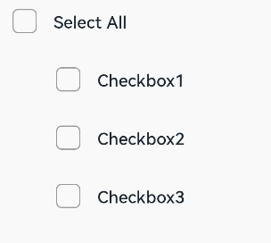
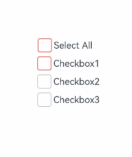

# CheckboxGroup

The **CheckboxGroup** component is used to select or deselect all check boxes in a group.

>  **NOTE**
>
>  This component is supported since API version 8. Updates will be marked with a superscript to indicate their earliest API version.

## Child Components

Not supported

## APIs

CheckboxGroup(options?: CheckboxGroupOptions)

Creates a check box group so that you can select or deselect all check boxes in the group at once. Check boxes and check box groups that share the same group name belong to the same group.

When this API is used with components that come with a pre-loading mechanism, such as the **List** component, those check boxes that have not been created yet need to be manually selected or unselected.

**Widget capability**: Since API version 9, this feature is supported in ArkTS widgets.

**Atomic service API**: This API can be used in atomic services since API version 11.

**System capability**: SystemCapability.ArkUI.ArkUI.Full

**Parameters**

| Name | Type                                                 | Mandatory| Description                |
| ------- | ----------------------------------------------------- | ---- | -------------------- |
| options | [CheckboxGroupOptions](#checkboxgroupoptions) | No  | Check box group parameters.|

## CheckboxGroupOptions

**Widget capability**: Since API version 9, this feature is supported in ArkTS widgets.

**Atomic service API**: This API can be used in atomic services since API version 11.

**System capability**: SystemCapability.ArkUI.ArkUI.Full

| Name| Type| Mandatory| Description|
| -------- | -------- | -------- | -------- |
| group | string | No| Group name.<br>**NOTE**<br>If there are multiple check box groups with the same group name, only the first check box group takes effect.|

## Attributes

In addition to the [universal attributes](ts-component-general-attributes.md), the following attributes are supported.

### selectAll

selectAll(value: boolean)

Sets whether to select all. If the **select** attribute is set for a [Checkbox](ts-basic-components-checkbox.md) component in the same group, the setting of the **Checkbox** has a higher priority.

Since API version 10, this attribute supports two-way binding through [$$](../../../ui/state-management/arkts-two-way-sync.md).
Since API version 18, this attribute supports two-way binding through [!!](../../../ui/state-management/arkts-new-binding.md#two-way-binding-between-built-in-component-parameters).

**Widget capability**: Since API version 9, this feature is supported in ArkTS widgets.

**Atomic service API**: This API can be used in atomic services since API version 11.

**System capability**: SystemCapability.ArkUI.ArkUI.Full

**Parameters**

| Name| Type   | Mandatory| Description                                                        |
| ------ | ------- | ---- | ------------------------------------------------------------ |
| value  | boolean | Yes  | Whether to select all.<br>Default value: **false**<br>**true**: Select all check boxes in the group. **false**: Do not select any check box in the group.|

### selectAll<sup>18+</sup>

selectAll(isAllSelected: Optional\<boolean>)

Sets whether to select all. If the **select** attribute is set for a [Checkbox](ts-basic-components-checkbox.md) component in the same group, the setting of the **Checkbox** has a higher priority. Compared with [selectAll](#selectall), this API supports the **undefined** type for the **isAllSelected** parameter.

This attribute supports two-way binding through [$$](../../../ui/state-management/arkts-two-way-sync.md) or [!!](../../../ui/state-management/arkts-new-binding.md).

**Widget capability**: This API can be used in ArkTS widgets since API version 18.

**Atomic service API**: This API can be used in atomic services since API version 18.

**System capability**: SystemCapability.ArkUI.ArkUI.Full

**Parameters**

| Name       | Type                                                        | Mandatory| Description                                                        |
| ------------- | ------------------------------------------------------------ | ---- | ------------------------------------------------------------ |
| isAllSelected | [Optional](ts-universal-attributes-custom-property.md#optionalt12)\<boolean> | Yes  | Whether to select all.<br>If **isAllSelected** is set to **undefined**, the default value **false** is used.<br>**true**: Select all check boxes in the group. **false**: Do not select any check box in the group.|

### selectedColor

selectedColor(value: ResourceColor)

Sets the color of the selected check box.	

**Widget capability**: Since API version 9, this feature is supported in ArkTS widgets.

**Atomic service API**: This API can be used in atomic services since API version 11.

**System capability**: SystemCapability.ArkUI.ArkUI.Full

**Parameters**

| Name| Type                                      | Mandatory| Description                                                        |
| ------ | ------------------------------------------ | ---- | ------------------------------------------------------------ |
| value  | [ResourceColor](ts-types.md#resourcecolor) | Yes  | Color of the selected check box.<br>Default value: **$r('sys.color.ohos_id_color_text_primary_activated')**<br>An invalid value is handled as the default value.|

### selectedColor<sup>18+</sup>

selectedColor(resColor: Optional\<ResourceColor>)

Sets the color of the selected check box. Compared with [selectedColor](#selectedcolor), this API supports the **undefined** type for the **resColor** parameter.

**Widget capability**: This API can be used in ArkTS widgets since API version 18.

**Atomic service API**: This API can be used in atomic services since API version 18.

**System capability**: SystemCapability.ArkUI.ArkUI.Full

**Parameters**

| Name  | Type                                                        | Mandatory| Description                                                        |
| -------- | ------------------------------------------------------------ | ---- | ------------------------------------------------------------ |
| resColor | [Optional](ts-universal-attributes-custom-property.md#optionalt12)\<[ResourceColor](ts-types.md#resourcecolor)> | Yes  | Color of the selected check box.<br>If **resColor** is set to **undefined**, the default value **$r('sys.color.ohos_id_color_text_primary_activated')** is used.<br>An invalid value is handled as the default value.|

### unselectedColor<sup>10+</sup>

unselectedColor(value: ResourceColor)

Sets the border color of the check box when it is not selected.

**Atomic service API**: This API can be used in atomic services since API version 11.

**System capability**: SystemCapability.ArkUI.ArkUI.Full

**Parameters**

| Name| Type                                      | Mandatory| Description                                                        |
| ------ | ------------------------------------------ | ---- | ------------------------------------------------------------ |
| value  | [ResourceColor](ts-types.md#resourcecolor) | Yes  | Border color of the check box when it is not selected.<br>Default value: **$r('sys.color.ohos_id_color_switch_outline_off')**|

### unselectedColor<sup>18+</sup>

unselectedColor(resColor: Optional\<ResourceColor>)

Sets the border color of the check box when it is not selected. Compared with [unselectedColor](#unselectedcolor10)<sup>10+</sup>, this API supports the **undefined** type for the **resColor** parameter.

**Atomic service API**: This API can be used in atomic services since API version 18.

**System capability**: SystemCapability.ArkUI.ArkUI.Full

**Parameters**

| Name  | Type                                                        | Mandatory| Description                                                        |
| -------- | ------------------------------------------------------------ | ---- | ------------------------------------------------------------ |
| resColor | [Optional](ts-universal-attributes-custom-property.md#optionalt12)\<[ResourceColor](ts-types.md#resourcecolor)> | Yes  | Border color of the check box when it is not selected.<br>If **resColor** is set to **undefined**, the default value **$r('sys.color.ohos_id_color_switch_outline_off')** is used.|

### mark<sup>10+</sup>

mark(value: MarkStyle)

Sets the check mark style of the check box.

**Atomic service API**: This API can be used in atomic services since API version 11.

**System capability**: SystemCapability.ArkUI.ArkUI.Full

**Parameters**

| Name| Type                                        | Mandatory| Description                |
| ------ | -------------------------------------------- | ---- | -------------------- |
| value  | [MarkStyle](ts-types.md#markstyle10) | Yes  | Check mark style of the check box.|

### mark<sup>18+</sup>

mark(style: Optional\<MarkStyle>)

Sets the check mark style of the check box. Compared with [mark](#mark10)<sup>10+</sup>, this API supports the **undefined** type for the **style** parameter.

**Atomic service API**: This API can be used in atomic services since API version 18.

**System capability**: SystemCapability.ArkUI.ArkUI.Full

**Parameters**

| Name| Type                                                        | Mandatory| Description                                                        |
| ------ | ------------------------------------------------------------ | ---- | ------------------------------------------------------------ |
| style  | [Optional](ts-universal-attributes-custom-property.md#optionalt12)\<[MarkStyle](ts-types.md#markstyle10)> | Yes  | Check mark style of the check box.<br>If **style** is set to **undefined**, the previous value is retained.|

### checkboxShape<sup>12+</sup>

checkboxShape(value: CheckBoxShape)

Sets the check box shape of the check box group.

**Widget capability**: This API can be used in ArkTS widgets since API version 12.

**Atomic service API**: This API can be used in atomic services since API version 12.

**System capability**: SystemCapability.ArkUI.ArkUI.Full

**Parameters**

| Name| Type                                                 | Mandatory| Description                                                        |
| ------ | ----------------------------------------------------- | ---- | ------------------------------------------------------------ |
| value  | [CheckBoxShape](ts-appendix-enums.md#checkboxshape11) | Yes  | Check box shape of the check box group.<br>Default value: **CheckBoxShape.CIRCLE**<br>**NOTE**<br>The shape of the check box group component follows the settings configured.<br>All check boxes within the check box group that do not have an individual shape set will conform to the shape of the check box group.<br>If a check box within the check box group has an individual shape set, that shape takes precedence over the check box group's shape.|

### checkboxShape<sup>18+</sup>

checkboxShape(shape: Optional\<CheckBoxShape>)

Sets the check box shape of the check box group. Compared with [checkboxShape](#checkboxshape12)<sup>12+</sup>, this API supports the **undefined** type for the **shape** parameter.

**Widget capability**: This API can be used in ArkTS widgets since API version 18.

**Atomic service API**: This API can be used in atomic services since API version 18.

**System capability**: SystemCapability.ArkUI.ArkUI.Full

**Parameters**

| Name| Type                                                        | Mandatory| Description                                                        |
| ------ | ------------------------------------------------------------ | ---- | ------------------------------------------------------------ |
| shape  | [Optional](ts-universal-attributes-custom-property.md#optionalt12)\<[CheckBoxShape](ts-appendix-enums.md#checkboxshape11)> | Yes  | Check box shape of the check box group.<br>If **shape** is set to **undefined**, the default value **CheckBoxShape.CIRCLE** is used.<br>**NOTE**<br>The shape of the check box group component follows the settings configured.<br>All check boxes within the check box group that do not have an individual shape set will conform to the shape of the check box group.<br>If a check box within the check box group has an individual shape set, that shape takes precedence over the check box group's shape.|

## Events

In addition to the [universal events](ts-component-general-events.md), the following events are supported.

### onChange

onChange(callback: OnCheckboxGroupChangeCallback)

Triggered when the selected status of the check box group or any check box wherein changes.

**Widget capability**: Since API version 9, this feature is supported in ArkTS widgets.

**Atomic service API**: This API can be used in atomic services since API version 11.

**System capability**: SystemCapability.ArkUI.ArkUI.Full

**Parameters**

| Name  | Type                                                        | Mandatory| Description              |
| -------- | ------------------------------------------------------------ | ---- | ------------------ |
| callback | [OnCheckboxGroupChangeCallback](#oncheckboxgroupchangecallback18) | Yes  | Information about the check box group.|

### onChange<sup>18+</sup>

onChange(callback: Optional\<OnCheckboxGroupChangeCallback>)

Triggered when the selected status of the check box group or any check box wherein changes. Compared with [onChange](#onchange), this API supports the **undefined** type for the **callback** parameter.

**Widget capability**: This API can be used in ArkTS widgets since API version 18.

**Atomic service API**: This API can be used in atomic services since API version 18.

**System capability**: SystemCapability.ArkUI.ArkUI.Full

**Parameters**

| Name  | Type                                                        | Mandatory| Description                                                        |
| -------- | ------------------------------------------------------------ | ---- | ------------------------------------------------------------ |
| callback | [Optional](ts-universal-attributes-custom-property.md#optionalt12)\<[OnCheckboxGroupChangeCallback](#oncheckboxgroupchangecallback18)> | Yes  | Information about the check box group.<br>If **callback** is set to **undefined**, the callback function is not used.|

## OnCheckboxGroupChangeCallback<sup>18+</sup>

type OnCheckboxGroupChangeCallback  = (value: CheckboxGroupResult) => void

Information about the check box group.

**Widget capability**: This API can be used in ArkTS widgets since API version 18.

**Atomic service API**: This API can be used in atomic services since API version 18.

**System capability**: SystemCapability.ArkUI.ArkUI.Full

**Parameters**

| Name| Type                                               | Mandatory| Description              |
| ------ | --------------------------------------------------- | ---- | ------------------ |
| value  | [CheckboxGroupResult](#checkboxgroupresult)| Yes  | Information about the check box group.|

## CheckboxGroupResult

**Widget capability**: Since API version 9, this feature is supported in ArkTS widgets.

**Atomic service API**: This API can be used in atomic services since API version 11.

**System capability**: SystemCapability.ArkUI.ArkUI.Full

| Name   | Type  | Read Only| Optional| Description     |
| ------ | ------ | ------- | ------- | ------- |
| name   | Array&lt;string&gt; | No| No| Names of all the selected check boxes in the group.|
| status | [SelectStatus](#selectstatus) | No| No| Selected status.|

## SelectStatus

**Widget capability**: Since API version 9, this feature is supported in ArkTS widgets.

**Atomic service API**: This API can be used in atomic services since API version 11.

**System capability**: SystemCapability.ArkUI.ArkUI.Full

| Name | Description|
| ----- | -------------------- |
| All   | All check boxes in the group are selected.|
| Part  | Some check boxes in the group are selected.|
| None  | None of the check boxes in the group are selected.|

## Example

### Example 1: Setting a Check Box Group

This example demonstrates how to control the state of a group of check boxes to achieve a "select all" or "deselect all" effect.

```ts
// xxx.ets
@Entry
@Component
struct CheckboxExample {
  build() {
    Scroll() {
      Column() {
        // Select All button
        Flex({ justifyContent: FlexAlign.Start, alignItems: ItemAlign.Center }) {
          CheckboxGroup({ group: 'checkboxGroup' })
            .checkboxShape(CheckBoxShape.ROUNDED_SQUARE)
            .selectedColor('#007DFF')
            .onChange((itemName: CheckboxGroupResult) => {
              console.info("checkbox group content" + JSON.stringify(itemName))
            })
          Text('Select All').fontSize(14).lineHeight(20).fontColor('#182431').fontWeight(500)
        }

        // Option 1
        Flex({ justifyContent: FlexAlign.Start, alignItems: ItemAlign.Center }) {
          Checkbox({ name: 'checkbox1', group: 'checkboxGroup' })
            .selectedColor('#007DFF')
            .shape(CheckBoxShape.ROUNDED_SQUARE)
            .onChange((value: boolean) => {
              console.info('Checkbox1 change is' + value)
            })
          Text('Checkbox1').fontSize(14).lineHeight(20).fontColor('#182431').fontWeight(500)
        }.margin({ left: 36 })

        // Option 2
        Flex({ justifyContent: FlexAlign.Start, alignItems: ItemAlign.Center }) {
          Checkbox({ name: 'checkbox2', group: 'checkboxGroup' })
            .selectedColor('#007DFF')
            .shape(CheckBoxShape.ROUNDED_SQUARE)
            .onChange((value: boolean) => {
              console.info('Checkbox2 change is' + value)
            })
          Text('Checkbox2').fontSize(14).lineHeight(20).fontColor('#182431').fontWeight(500)
        }.margin({ left: 36 })

        // Option 3
        Flex({ justifyContent: FlexAlign.Start, alignItems: ItemAlign.Center }) {
          Checkbox({ name: 'checkbox3', group: 'checkboxGroup' })
            .selectedColor('#007DFF')
            .shape(CheckBoxShape.ROUNDED_SQUARE)
            .onChange((value: boolean) => {
              console.info('Checkbox3 change is' + value)
            })
          Text('Checkbox3').fontSize(14).lineHeight(20).fontColor('#182431').fontWeight(500)
        }.margin({ left: 36 })
      }
    }
  }
}
```


### Example 2: Customizing Check Mark Style

This example shows how to customize the check mark style for a check box group by configuring the **mark** attribute.

```ts
// xxx.ets
@Entry
@Component
struct Index {

  build() {
    Row() {
      Column() {
        Flex({ justifyContent: FlexAlign.Center, alignItems: ItemAlign.Center }) {
          CheckboxGroup({ group: 'checkboxGroup' })
            .checkboxShape(CheckBoxShape.ROUNDED_SQUARE)
            .selectedColor(Color.Orange)
            .onChange((itemName: CheckboxGroupResult) => {
              console.info("checkbox group content" + JSON.stringify(itemName))
            })
            .mark({
              strokeColor:Color.Black,
              size: 40,
              strokeWidth: 5
            })
            .unselectedColor(Color.Red)
            .width(30)
            .height(30)
          Text('Select All').fontSize(20)
        }.margin({right:15})
        Flex({ justifyContent: FlexAlign.Center, alignItems: ItemAlign.Center }) {
          Checkbox({ name: 'checkbox1', group: 'checkboxGroup' })
            .selectedColor(0x39a2db)
            .shape(CheckBoxShape.ROUNDED_SQUARE)
            .onChange((value: boolean) => {
              console.info('Checkbox1 change is'+ value)
            })
            .mark({
              strokeColor:Color.Black,
              size: 50,
              strokeWidth: 5
            })
            .unselectedColor(Color.Red)
            .width(30)
            .height(30)
          Text('Checkbox1').fontSize(20)
        }
        Flex({ justifyContent: FlexAlign.Center, alignItems: ItemAlign.Center }) {
          Checkbox({ name: 'checkbox2', group: 'checkboxGroup' })
            .selectedColor(0x39a2db)
            .shape(CheckBoxShape.ROUNDED_SQUARE)
            .onChange((value: boolean) => {
              console.info('Checkbox2 change is' + value)
            })
            .width(30)
            .height(30)
          Text('Checkbox2').fontSize(20)
        }
        Flex({ justifyContent: FlexAlign.Center, alignItems: ItemAlign.Center }) {
          Checkbox({ name: 'checkbox3', group: 'checkboxGroup' })
            .selectedColor(0x39a2db)
            .shape(CheckBoxShape.ROUNDED_SQUARE)
            .onChange((value: boolean) => {
              console.info('Checkbox3 change is' + value)
            })
            .width(30)
            .height(30)
          Text('Checkbox3').fontSize(20)
        }
      }
      .width('100%')
    }
    .height('100%')
  }
}
```


