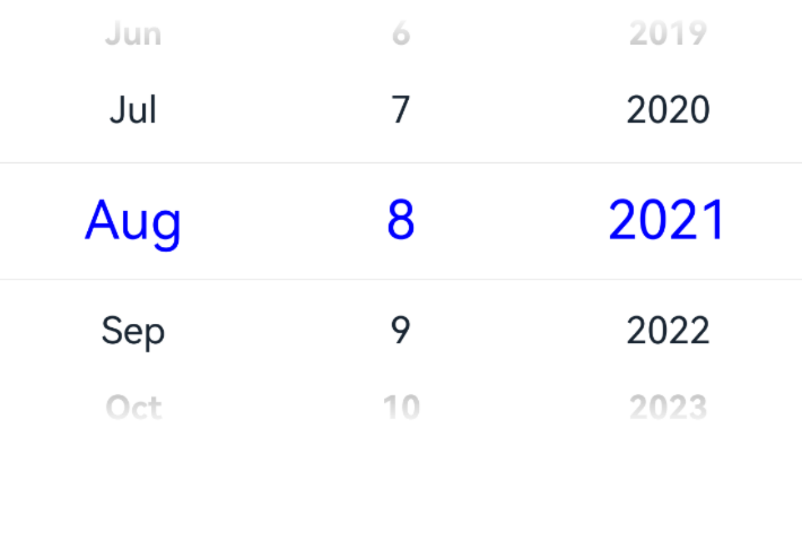
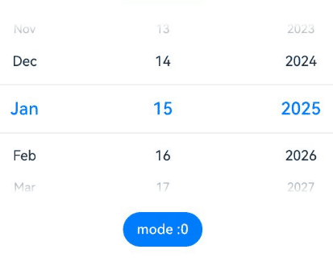

# DatePicker

The **DatePicker** component allows users to select a date from the given range.

>  **NOTE**
>
>  This component is supported since API version 8. Updates will be marked with a superscript to indicate their earliest API version.


## Child Components

Not supported


## APIs

DatePicker(options?: DatePickerOptions)

Creates a date picker in the given date range.

**Atomic service API**: This API can be used in atomic services since API version 11.

**System capability**: SystemCapability.ArkUI.ArkUI.Full

**Parameters**

| Name | Type                                           | Mandatory| Description                      |
| ------- | ----------------------------------------------- | ---- | -------------------------- |
| options | [DatePickerOptions](#datepickeroptions) | No  | Parameters of the date picker.|

## DatePickerOptions

**Atomic service API**: This API can be used in atomic services since API version 11.

**System capability**: SystemCapability.ArkUI.ArkUI.Full

| Name    | Type| Mandatory| Description                                                        |
| -------- | ---- | ---- | ------------------------------------------------------------ |
| start    | Date | No  | Start date of the picker.<br>Default value: **Date('1970-1-1')**         |
| end      | Date | No  | End date of the picker.<br>Default value: **Date('2100-12-31')**       |
| selected | Date | No  | Date of the selected item.<br>Default value: current system date<br>Since API version 10, this parameter supports two-way binding through [$$](../../../ui/state-management/arkts-two-way-sync.md).|
| mode<sup>18+</sup> | [DatePickerMode](#datepickermode18) | No  | Date columns to be displayed.<br>Default value: **DatePickerMode.DATE**, which means to display three columns: year, month, and day. Decimal values are rounded off.<br>In **DatePickerDialog**, with **showTime=true**, this parameter has no effect and the default three columns for year, month, and day are displayed.|

>  **NOTE**
>
>  For details about how to use **Date**, see [TimePickerOptions](ts-basic-components-timepicker.md). 
>  Modifying the **DatePickerOptions** properties, such as **start**, **end**, or **selected**, during the scrolling process of the **DatePicker** component may not take effect.


## DatePickerMode<sup>18+</sup>

Sets the date columns to be displayed.

**Atomic service API**: This API can be used in atomic services since API version 18.

**System capability**: SystemCapability.ArkUI.ArkUI.Full

| Name| Description|
| -------- | -------- |
| DATE | The date displays three columns: year, month, and day.|
| YEAR_AND_MONTH | The date displays two columns: year and month.|
| MONTH_AND_DAY | The date displays two columns: month and day.<br>In this mode, if the month changes from December to January, the year does not increment by one; if the month changes from January to December, the year does not decrement by one. The year remains fixed at the currently set value.|

**Handling in the case of exceptions**

| Exception  | Result |
| -------- |  ------------------------------------------------------------ |
| The start date is later than the end date, and the selected date is not set.   | The start date, end date, and selected date are set to the default values. |
| The start date is later than the end date, and the selected date is earlier than the default start date.   | The start date and end date are set to the default values, and the selected date is set to the default start date. |
| The start date is later than the end date, and the selected date is later than the default end date.   | The start date and end date are set to the default values, and the selected date is set to the default end date. |
| The start date is later than the end date, and the selected date is within the range of the default start date and end date.   | The start date and end date are set to the default values, and the selected date is set to the specified value.|
| The selected date is earlier than the start date.   | The start date is set to the selected date. |
| The selected date is later than the end date.   | The selected date is set to the end date. |
| The start date is later than the current system date, and the selected date is not set.   | The start date is set to the selected date. |
| The end date is earlier than the current system date, and the selected date is not set.   | The end date is set to the selected date. |
| The set date is in invalid format, for example, **'1999-13-32'**.  | The default value is used. |
| The start date or end date is earlier than the earliest date in the valid date range.   | The start date or end date is set to the default state date.|
| The start date or end date is later than the latest date in the valid date range.   | The start date or end date is set to the default end date.|
| Both the start date and end date are earlier than the earliest date in the valid date range.| The start date and end date are set to the earliest date in the valid date range.|
| Both the start date and end date are later than the latest date in the valid date range.| The start date and end date are set to the latest date in the valid date range.|

The valid date range is from 1900-1-31 to 2100-12-31.

The exception detection and handling with the selected date comes after that with the start date and end date.

## Attributes

In addition to the [universal attributes](ts-component-general-attributes.md), the following attributes are supported.

### lunar

lunar(value: boolean)

Specifies whether to display the lunar calendar.

**Atomic service API**: This API can be used in atomic services since API version 11.

**System capability**: SystemCapability.ArkUI.ArkUI.Full

**Parameters**

| Name| Type   | Mandatory| Description                                                        |
| ------ | ------- | ---- | ------------------------------------------------------------ |
| value  | boolean | Yes  | Whether to display the lunar calendar.<br>- **true**: Display the lunar calendar.<br>- **false**: Do not display the lunar calendar.<br>Default value: **false**|

### lunar<sup>18+</sup>

lunar(isLunar: Optional\<boolean>)

Specifies whether to display the lunar calendar. Compared with [lunar](#lunar), this API supports the **undefined** type for the **isLunar** parameter.

**Atomic service API**: This API can be used in atomic services since API version 18.

**System capability**: SystemCapability.ArkUI.ArkUI.Full

**Parameters**

| Name| Type   | Mandatory| Description                                                        |
| ------ | ------- | ---- | ------------------------------------------------------------ |
| isLunar | [Optional](ts-universal-attributes-custom-property.md#optionalt12)\<boolean> | Yes  | Whether to display the lunar calendar.<br>- **true**: Display the lunar calendar.<br>- **false**: Do not display the lunar calendar.<br>If **isLunar** is set to **undefined**, the default value **false** is used.|

### disappearTextStyle<sup>10+</sup>

disappearTextStyle(value: PickerTextStyle)

Sets the text style for the top and bottom items.

**Atomic service API**: This API can be used in atomic services since API version 11.

**System capability**: SystemCapability.ArkUI.ArkUI.Full

**Parameters**

| Name| Type                                         | Mandatory| Description                                                        |
| ------ | --------------------------------------------- | ---- | ------------------------------------------------------------ |
| value  | [PickerTextStyle](#pickertextstyle10) | Yes  | Font color, font size, and font weight of the top and bottom items.<br>Default value:<br>{<br>color: '#ff182431',<br>font: {<br>size: '14fp', <br>weight: FontWeight.Regular<br>}<br>} |

### disappearTextStyle<sup>18+</sup>

disappearTextStyle(style: Optional\<PickerTextStyle>)

Sets the text style for the top and bottom items. Compared with [disappearTextStyle](#disappeartextstyle10)<sup>10+</sup>, this API supports the **undefined** type for the **style** parameter.

**Atomic service API**: This API can be used in atomic services since API version 18.

**System capability**: SystemCapability.ArkUI.ArkUI.Full

**Parameters**

| Name| Type                                                        | Mandatory| Description                                                        |
| ------ | ------------------------------------------------------------ | ---- | ------------------------------------------------------------ |
| style  | [Optional](ts-universal-attributes-custom-property.md#optionalt12)\<[PickerTextStyle](#pickertextstyle10)> | Yes  | Font color, font size, and font weight of the top and bottom items.<br>If **style** is set to **undefined**, the default value is used:<br>{<br>color: '#ff182431',<br>font: {<br>size: '14fp', <br>weight: FontWeight.Regular<br>}<br>} |

### textStyle<sup>10+</sup>

textStyle(value: PickerTextStyle)

Sets the text style for all items except the top, bottom, and selected items.

**Atomic service API**: This API can be used in atomic services since API version 11.

**System capability**: SystemCapability.ArkUI.ArkUI.Full

**Parameters**

| Name| Type                                         | Mandatory| Description                                                        |
| ------ | --------------------------------------------- | ---- | ------------------------------------------------------------ |
| value  | [PickerTextStyle](#pickertextstyle10) | Yes  | Font color, font size, and font weight of all items except the top, bottom, and selected items.<br>Default value:<br>{<br>color: '#ff182431',<br>font: {<br>size: '16fp', <br>weight: FontWeight.Regular<br>}<br>} |

### textStyle<sup>18+</sup>

textStyle(style: Optional\<PickerTextStyle>)

Sets the text style for all items except the top, bottom, and selected items. Compared with [textStyle](#textstyle10)<sup>10+</sup>, this API supports the **undefined** type for the **style** parameter.

**Atomic service API**: This API can be used in atomic services since API version 18.

**System capability**: SystemCapability.ArkUI.ArkUI.Full

**Parameters**

| Name| Type                                         | Mandatory| Description                                                        |
| ------ | --------------------------------------------- | ---- | ------------------------------------------------------------ |
| style | [Optional](ts-universal-attributes-custom-property.md#optionalt12)\<[PickerTextStyle](#pickertextstyle10)> | Yes  | Font color, font size, and font weight of all items except the top, bottom, and selected items.<br>If **style** is set to **undefined**, the default value is used:<br>{<br>color: '#ff182431',<br>font: {<br>size: '16fp', <br>weight: FontWeight.Regular<br>}<br>} |

### selectedTextStyle<sup>10+</sup>

selectedTextStyle(value: PickerTextStyle)

Sets the text style for the selected item.

**Atomic service API**: This API can be used in atomic services since API version 11.

**System capability**: SystemCapability.ArkUI.ArkUI.Full

**Parameters**

| Name| Type                                         | Mandatory| Description                                                        |
| ------ | --------------------------------------------- | ---- | ------------------------------------------------------------ |
| value  | [PickerTextStyle](#pickertextstyle10) | Yes  | Font color, font size, and font weight of the selected item.<br>Default value:<br>{<br>color: '#ff007dff',<br>font: {<br>size: '20vp', <br>weight: FontWeight.Medium<br>}<br>} |

### selectedTextStyle<sup>18+</sup>

selectedTextStyle(style: Optional\<PickerTextStyle>)

Sets the text style for the selected item. Compared with [selectedTextStyle](#selectedtextstyle10)<sup>10+</sup>, this API supports the **undefined** type for the **style** parameter.

**Atomic service API**: This API can be used in atomic services since API version 18.

**System capability**: SystemCapability.ArkUI.ArkUI.Full

**Parameters**

| Name| Type                                                        | Mandatory| Description                                                        |
| ------ | ------------------------------------------------------------ | ---- | ------------------------------------------------------------ |
| style  | [Optional](ts-universal-attributes-custom-property.md#optionalt12)\<[PickerTextStyle](#pickertextstyle10)> | Yes  | Font color, font size, and font weight of the selected item.<br>If **style** is set to **undefined**, the default value is used:<br>{<br>color: '#ff007dff',<br>font: {<br>size: '20vp', <br>weight: FontWeight.Medium<br>}<br>} |

### enableHapticFeedback<sup>18+</sup>

enableHapticFeedback(enable: Optional\<boolean>)

Sets whether to enable haptic feedback.

**Atomic service API**: This API can be used in atomic services since API version 18.

**System capability**: SystemCapability.ArkUI.ArkUI.Full

| Name| Type                                         | Mandatory | Description                                                                                 |
| ------ | --------------------------------------------- |-----|-------------------------------------------------------------------------------------|
| enable  | [Optional](ts-universal-attributes-custom-property.md#optionalt12)\<boolean> | Yes  | Whether to enable haptic feedback.<br>**true** (default): Haptic feedback is enabled.<br>**false**: Haptic feedback is disabled.|

>  **NOTE**
>
>  To enable haptic feedback, you must declare the ohos.permission.VIBRATE permission under **requestPermissions** in the **module.json5** file of the project.
>  ```json
>  "requestPermissions": [
>  {
>   "name": "ohos.permission.VIBRATE",
>  }
>  ]
>  ```

### digitalCrownSensitivity<sup>18+</sup>
digitalCrownSensitivity(sensitivity: Optional\<CrownSensitivity>)

Sets the sensitivity to the digital crown rotation.

**Atomic service API**: This API can be used in atomic services since API version 18.

**System capability**: SystemCapability.ArkUI.ArkUI.Full

| Name  | Type                                    | Mandatory  | Description                     |
| ----- | ---------------------------------------- | ---- | ------------------------- |
| sensitivity | [Optional](ts-universal-attributes-custom-property.md#optionalt12)\<[CrownSensitivity](ts-appendix-enums.md#crownsensitivity18)> | Yes   | Sensitivity to the digital crown rotation.<br>Default value: **CrownSensitivity.MEDIUM**                   |

>  **NOTE**
>
>  This API is only available to circular screens on wearable devices. The component needs to obtain focus before responding to the [crown event](ts-universal-events-crown.md).

## PickerTextStyle<sup>10+</sup>

**Atomic service API**: This API can be used in atomic services since API version 11.

| Name  | Type                                    | Mandatory  | Description                     |
| ----- | ---------------------------------------- | ---- | ------------------------- |
| color | [ResourceColor](ts-types.md#resourcecolor) | No   | Font color.                    |
| font  | [Font](ts-types.md#font)                 | No   | Text style.|

## Events

In addition to the [universal events](ts-component-general-events.md), the following events are supported.

### onChange<sup>(deprecated)</sup>

onChange(callback: (value: DatePickerResult) => void)

Triggered when a date is selected.

This API is supported since API version 8 and deprecated since API version 10. You are advised to use [onDateChange](#ondatechange10) instead.

**System capability**: SystemCapability.ArkUI.ArkUI.Full

**Parameters**

| Name| Type                                         | Mandatory| Description            |
| ------ | --------------------------------------------- | ---- | ---------------- |
| value  | [DatePickerResult](#datepickerresult) | Yes  | Selected time.|

### onDateChange<sup>10+</sup>

onDateChange(callback: (value: Date) => void)

Triggered when a date is selected.

**Atomic service API**: This API can be used in atomic services since API version 11.

**System capability**: SystemCapability.ArkUI.ArkUI.Full

**Parameters**

| Name| Type| Mandatory| Description                                                        |
| ------ | ---- | ---- | ------------------------------------------------------------ |
| value  | Date | Yes  | Selected time, where the year, month, and day portions are subject to the selection, the hour and minute portions are subject to the current system time, and the second portion is always **00**.|

### onDateChange<sup>18+</sup>

onDateChange(callback: Optional\<Callback\<Date>>)

Triggered when a date is selected. Compared with [onDateChange](#ondatechange10)<sup>10+</sup>, this API supports the **undefined** type for the **callback** parameter.

**Atomic service API**: This API can be used in atomic services since API version 18.

**System capability**: SystemCapability.ArkUI.ArkUI.Full

**Parameters**

| Name  | Type                                                        | Mandatory| Description                                                        |
| -------- | ------------------------------------------------------------ | ---- | ------------------------------------------------------------ |
| callback | [Optional](ts-universal-attributes-custom-property.md#optionalt12)\<[Callback](ts-types.md#callback12)\<Date>> | Yes  | Selected time, where the year, month, and day portions are subject to the selection, the hour and minute portions are subject to the current system time, and the second portion is always **00**.<br>If **callback** is set to **undefined**, the callback function is not used.|

## DatePickerResult

**Atomic service API**: This API can be used in atomic services since API version 11.

**System capability**: SystemCapability.ArkUI.ArkUI.Full

| Name | Type  | Read Only| Optional| Description                                      |
| ----- | ------ | ---- | ---- | ------------------------------------------ |
| year  | number | No  | No  | Year of the selected date.<br>Value range: depends on **start** and **end**. If **start** and **end** are not set, the default range is [1970, 2100].                            |
| month | number | No  | No  | Month index of the selected date. The index is zero-based.<br>**0** indicates January, and **11** indicates December.<br>Value range: depends on **start** and **end**. If **start** and **end** are not set, the default range is [0, 11].|
| day   | number | No  | No  | Day of the selected date.<br>Value range: depends on **start** and **end**. If **start** and **end** are not set, the default range is [1, 31].                            |

## Example

### Example 1: Switching Between Gregorian and Lunar Calendars

This example implements a date picker that allows users to switch between the Gregorian (solar) calendar and the lunar calendar by clicking a button.


```ts
// xxx.ets
@Entry
@Component
struct DatePickerExample {
  @State isLunar: boolean = false
  private selectedDate: Date = new Date('2021-08-08')

  build() {
    Column() {
      Button('Switch Calendar')
        .margin({ top: 30, bottom: 30 })
        .onClick(() => {
          this.isLunar = !this.isLunar
        })
      DatePicker({
        start: new Date('1970-1-1'),
        end: new Date('2100-1-1'),
        selected: this.selectedDate
      })
        .lunar(this.isLunar)
        .onDateChange((value: Date) => {
          this.selectedDate = value
          console.info('select current date is: ' + value.toString())
        })

    }.width('100%')
  }
}
```


### Example 2: Setting the Text Style

This example shows how to customize the text style using **disappearTextStyle**, **textStyle**, and **selectedTextStyle**.

```ts
// xxx.ets
@Entry
@Component
struct DatePickerExample {
  private selectedDate: Date = new Date('2021-08-08')

  build() {
    Column() {
      DatePicker({
        start: new Date('1970-1-1'),
        end: new Date('2100-1-1'),
        selected: this.selectedDate
      })
        .disappearTextStyle({ color: Color.Gray, font: { size: '16fp', weight: FontWeight.Bold } })
        .textStyle({ color: '#ff182431', font: { size: '18fp', weight: FontWeight.Normal } })
        .selectedTextStyle({ color: '#ff0000FF', font: { size: '26fp', weight: FontWeight.Regular, family: "HarmonyOS Sans", style: FontStyle.Normal } })
        .onDateChange((value: Date) => {
          this.selectedDate = value
          console.info('select current date is: ' + value.toString())
        })

    }.width('100%')
  }
}
```



### Example 3: Displaying Year and Month, or Month and Day Columns

This example demonstrates how to display year and month, or month and day columns using **mode**.

```ts
// xxx.ets
@Entry
@Component
struct DatePickerExample {
  @State isLunar: boolean = false
  private selectedDate: Date = new Date('2025-01-15')
  @State datePickerModeList: (DatePickerMode)[] = [
    DatePickerMode.DATE,
    DatePickerMode.YEAR_AND_MONTH,
    DatePickerMode.MONTH_AND_DAY,
  ]
  @State datePickerModeIndex: number = 0;

  build() {
    Column() {
      Button('Switch Calendar')
        .margin({ top: 30, bottom: 30 })
        .onClick(() => {
          this.isLunar = !this.isLunar
        })
      DatePicker({
        start: new Date('1970-1-1'),
        end: new Date('2100-1-1'),
        selected: this.selectedDate,
        mode:this.datePickerModeList[this.datePickerModeIndex]
      })
        .lunar(this.isLunar)
        .onDateChange((value: Date) => {
          this.selectedDate = value
          console.info('select current date is: ' + value.toString())
        })

      Button('mode :' + this.datePickerModeIndex).margin({ top: 20 })
        .onClick(() => {
          this.datePickerModeIndex++
          if(this.datePickerModeIndex >= this.datePickerModeList.length){
            this.datePickerModeIndex = 0
          }
        })
    }.width('100%')
  }
}
```

