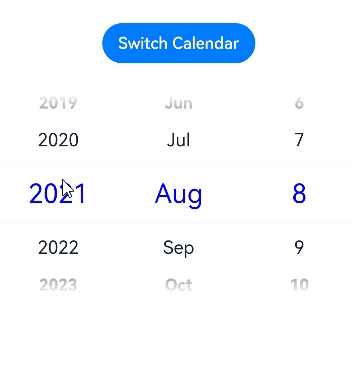
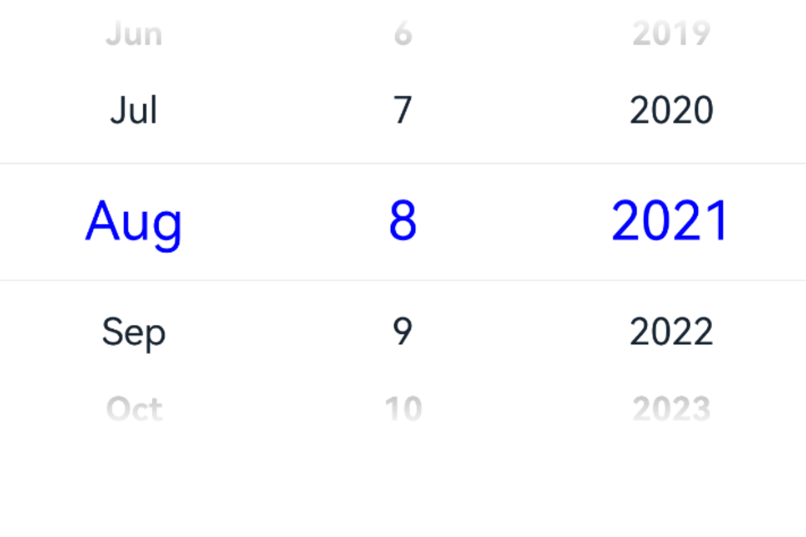
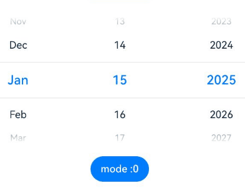

# DatePicker
<!--Kit: ArkUI-->
<!--Subsystem: ArkUI-->
<!--Owner: @Zhang-Dong-hui-->
<!--Designer: @xiangyuan6-->
<!--Tester: @jiaoaozihao-->
<!--Adviser: @Brilliantry_Rui-->

**DatePicker** is a component for selecting a date through scrolling interaction.

>  **NOTE**
>
> - This component is supported since API version 8. Updates will be marked with a superscript to indicate their earliest API version.
>
> - Avoid changing component attributes during animation processes.
>
> - The maximum number of rows that can be displayed varies by screen orientation: In portrait mode, the default number of rows is 5. In landscape mode, the number of rows depends on the system configuration. If no system configuration is set, the default is 3 rows. To check the specific system configuration value for landscape mode, use **$r('sys.float.ohos_id_picker_show_count_landscape')**.

## Child Components

Not supported


## APIs

DatePicker(options?: DatePickerOptions)

Creates a date picker in the given date range.

**Atomic service API**: This API can be used in atomic services since API version 11.

**System capability**: SystemCapability.ArkUI.ArkUI.Full

**Parameters**

| Name | Type                                           | Mandatory| Description                      |
| ------- | ----------------------------------------------- | ---- | -------------------------- |
| options | [DatePickerOptions](#datepickeroptions) | No  | Parameters of the date picker.|

## DatePickerOptions

Describes the parameters of the date picker.

**System capability**: SystemCapability.ArkUI.ArkUI.Full

| Name    | Type| Read Only| Optional| Description                                                        |
| -------- | ---- | ---- | ------------------------------------------------------------ | ------------------------------------------------------------ |
| start    | Date | No | Yes | Start date of the picker.<br>Default value: **Date('1970-1-1')**<br>Value range: \[Date('1900-01-31'), Date('2100-12-31')].<br>**Atomic service API**: This API can be used in atomic services since API version 11.         |
| end      | Date | No | Yes | End date of the picker.<br>Default value: **Date('2100-12-31')**<br>Value range: \[Date('1900-01-31'), Date('2100-12-31')].<br>**Atomic service API**: This API can be used in atomic services since API version 11.       |
| selected | Date | No | Yes | Date of the selected item.<br>Default value: current system date.<br>Value range: \[Date('1900-01-31'), Date('2100-12-31')].<br>Since API version 10, this parameter supports two-way binding through [$$](../../../ui/state-management/arkts-two-way-sync.md).<br>**Atomic service API**: This API can be used in atomic services since API version 11.|
| mode<sup>18+</sup> | [DatePickerMode](#datepickermode18) | No | Yes | Date display mode.<br>Default value: **DatePickerMode.DATE**, which means to display three columns: year, month, and day.<br>In [DatePickerDialog](ts-methods-datepicker-dialog.md), when **showTime** in [DatePickerDialogOptions](ts-methods-datepicker-dialog.md#datepickerdialogoptions) is **true**, this parameter is ignored and the year, month, day columns are always shown.<br>**Atomic service API**: This API can be used in atomic services since API version 18.|

>  **NOTE**
>
> - For details about how to use **Date**, see [TimePickerOptions](ts-basic-components-timepicker.md#timepickeroptions).
>
> - Property modifications made to **DatePickerOptions** during the **DatePicker** scrolling process may not take effect.

**Handling in the case of date configuration exceptions**

| Exception  | Result |
| -------- |  ------------------------------------------------------------ |
| The start date is later than the end date, and the selected date is not set.   | The start date, end date, and selected date are set to the default values.|
| The start date is later than the end date, and the selected date is earlier than the default start date.   | The start date and end date are set to the default values, and the selected date is set to the default start date. |
| The start date is later than the end date, and the selected date is later than the default end date.   | The start date and end date are set to the default values, and the selected date is set to the default end date. |
| The start date is later than the end date, and the selected date is within the range of the default start date and end date.   | The start date and end date are set to the default values, and the selected date is set to the specified value.|
| The selected date is earlier than the start date.   | The start date is set to the selected date. |
| The selected date is later than the end date.   | The end date is set to the selected date. |
| The start date is later than the current system date, and the selected date is not set.   | The start date is set to the selected date. |
| The end date is earlier than the current system date, and the selected date is not set.   | The end date is set to the selected date. |
| The set date is in invalid format, for example, **'1999-13-32'**.  | The default value is used. |
| The start date or end date is earlier than the earliest date in the valid date range.   | The start date or end date is set to the default state date.|
| The start date or end date is later than the latest date in the valid date range.   | The start date or end date is set to the default end date.|
| Both the start date and end date are earlier than the earliest date in the valid date range.| The start date and end date are set to the earliest date in the valid date range.|
| Both the start date and end date are later than the latest date in the valid date range.| The start date and end date are set to the latest date in the valid date range.|

>  **NOTE**
>
> Handle exceptions for the start and end dates first, followed by exceptions for the selected date.

## DatePickerMode<sup>18+</sup>

Enumerates date display modes.

**Atomic service API**: This API can be used in atomic services since API version 18.

**System capability**: SystemCapability.ArkUI.ArkUI.Full

| Name| Value| Description|
| -------- | - |-------- |
| DATE | 0 | Three-column display: year, month, and day.|
| YEAR_AND_MONTH | 1 | Two-column display: year and month.|
| MONTH_AND_DAY | 2 | Two-column display: month and day.<br>In this mode, the year value remains fixed.|

## Attributes

In addition to the [universal attributes](ts-component-general-attributes.md), the following attributes are supported.

### lunar

lunar(value: boolean)

Sets whether to display dates in lunar calendar format.

**Atomic service API**: This API can be used in atomic services since API version 11.

**System capability**: SystemCapability.ArkUI.ArkUI.Full

**Parameters**

| Name| Type   | Mandatory| Description                                                        |
| ------ | ------- | ---- | ------------------------------------------------------------ |
| value  | boolean | Yes  | Whether to display dates in lunar calendar format.<br>- **true**: Display dates in lunar calendar format.<br>- **false**: Do not display dates in lunar calendar format.<br>Default value: **false**|

### lunar<sup>18+</sup>

lunar(isLunar: Optional\<boolean>)

Sets whether to display dates in lunar calendar format. Compared to [lunar](#lunar), the **isLunar** parameter supports the **undefined** type.

**Atomic service API**: This API can be used in atomic services since API version 18.

**System capability**: SystemCapability.ArkUI.ArkUI.Full

**Parameters**

| Name| Type   | Mandatory| Description                                                        |
| ------ | ------- | ---- | ------------------------------------------------------------ |
| isLunar | [Optional](ts-universal-attributes-custom-property.md#optionalt)\<boolean> | Yes  | Whether to display dates in lunar calendar format.<br>- **true**: Display dates in lunar calendar format.<br>- **false**: Do not display dates in lunar calendar format.<br>Default value: **false**<br>If the value of **isLunar** is **undefined**, the default value is used.|

### disappearTextStyle<sup>10+</sup>

disappearTextStyle(value: PickerTextStyle)

Sets the text style for edge items (the second item above or below the selected item).

**Atomic service API**: This API can be used in atomic services since API version 11.

**System capability**: SystemCapability.ArkUI.ArkUI.Full

**Parameters**

| Name| Type                                         | Mandatory| Description                                                        |
| ------ | --------------------------------------------- | ---- | ------------------------------------------------------------ |
| value  | [PickerTextStyle](ts-picker-common.md#pickertextstyle) | Yes  | Text color, font size, and font weight for edge items.<br>Default value:<br>{<br>color: '#ff182431',<br>font: {<br>size: '14fp', <br>weight: FontWeight.Regular<br>}<br>} |

>  **NOTE**
>
> Edge items only appear when there are at least two visible items above or below the selected item. If insufficient items are available, no edge items will be styled.

### disappearTextStyle<sup>18+</sup>

disappearTextStyle(style: Optional\<PickerTextStyle>)

Sets the text style for edge items (the second item above or below the selected item). Compared to [disappearTextStyle<sup>10+</sup>](#disappeartextstyle10), this API supports the **undefined** type for the **style** parameter.

**Atomic service API**: This API can be used in atomic services since API version 18.

**System capability**: SystemCapability.ArkUI.ArkUI.Full

**Parameters**

| Name| Type                                                        | Mandatory| Description                                                        |
| ------ | ------------------------------------------------------------ | ---- | ------------------------------------------------------------ |
| style  | [Optional](ts-universal-attributes-custom-property.md#optionalt)\<[PickerTextStyle](ts-picker-common.md#pickertextstyle)> | Yes  | Text color, font size, and font weight for edge items.<br>Default value:<br>{<br>color: '#ff182431',<br>font: {<br>size: '14fp', <br>weight: FontWeight.Regular<br>}<br>}<br>If the value of **style** is **undefined**, the default value is used.|

>  **NOTE**
>
> Edge items only appear when there are at least two visible items above or below the selected item. If insufficient items are available, no edge items will be styled.

### textStyle<sup>10+</sup>

textStyle(value: PickerTextStyle)

Sets the text style for candidate items (the first item immediately above or below the selected item).

**Atomic service API**: This API can be used in atomic services since API version 11.

**System capability**: SystemCapability.ArkUI.ArkUI.Full

**Parameters**

| Name| Type                                         | Mandatory| Description                                                        |
| ------ | --------------------------------------------- | ---- | ------------------------------------------------------------ |
| value  | [PickerTextStyle](ts-picker-common.md#pickertextstyle) | Yes  | Text color, font size, and font weight for candidate items.<br>Default value:<br>{<br>color: '#ff182431',<br>font: {<br>size: '16fp', <br>weight: FontWeight.Regular<br>}<br>} |

>  **NOTE**
>
> Candidate items only appear when there is at least one visible item above or below the selected item. If insufficient items are available, no candidate items will be styled.

### textStyle<sup>18+</sup>

textStyle(style: Optional\<PickerTextStyle>)

Sets the text style for candidate items (the first item immediately above or below the selected item). Compared to [textStyle<sup>10+</sup>](#textstyle10), this API supports the **undefined** type for the **style** parameter.

**Atomic service API**: This API can be used in atomic services since API version 18.

**System capability**: SystemCapability.ArkUI.ArkUI.Full

**Parameters**

| Name| Type                                         | Mandatory| Description                                                        |
| ------ | --------------------------------------------- | ---- | ------------------------------------------------------------ |
| style | [Optional](ts-universal-attributes-custom-property.md#optionalt)\<[PickerTextStyle](ts-picker-common.md#pickertextstyle)> | Yes  | Text color, font size, and font weight for candidate items.<br>Default value:<br>{<br>color: '#ff182431',<br>font: {<br>size: '16fp', <br>weight: FontWeight.Regular<br>}<br>}<br>If the value of **style** is **undefined**, the default value is used.|

>  **NOTE**
>
> Candidate items only appear when there is at least one visible item above or below the selected item. If insufficient items are available, no candidate items will be styled.

### selectedTextStyle<sup>10+</sup>

selectedTextStyle(value: PickerTextStyle)

Sets the text style for the selected item.

**Atomic service API**: This API can be used in atomic services since API version 11.

**System capability**: SystemCapability.ArkUI.ArkUI.Full

**Parameters**

| Name| Type                                         | Mandatory| Description                                                        |
| ------ | --------------------------------------------- | ---- | ------------------------------------------------------------ |
| value  | [PickerTextStyle](ts-picker-common.md#pickertextstyle) | Yes  | Font color, font size, and font weight of the selected item.<br>Default value:<br>{<br>color: '#ff007dff',<br>font: {<br>size: '20fp', <br>weight: FontWeight.Medium<br>}<br>} |

### selectedTextStyle<sup>18+</sup>

selectedTextStyle(style: Optional\<PickerTextStyle>)

Sets the text style for the selected item. Compared to [selectedTextStyle<sup>10+</sup>](#selectedtextstyle10), this API supports the **undefined** type for the **style** parameter.

**Atomic service API**: This API can be used in atomic services since API version 18.

**System capability**: SystemCapability.ArkUI.ArkUI.Full

**Parameters**

| Name| Type                                                        | Mandatory| Description                                                        |
| ------ | ------------------------------------------------------------ | ---- | ------------------------------------------------------------ |
| style  | [Optional](ts-universal-attributes-custom-property.md#optionalt)\<[PickerTextStyle](ts-picker-common.md#pickertextstyle)> | Yes  | Font color, font size, and font weight of the selected item.<br>Default value:<br>{<br>color: '#ff007dff',<br>font: {<br>size: '20fp', <br>weight: FontWeight.Medium<br>}<br>}<br>If the value of **style** is **undefined**, the default value is used.|

### enableHapticFeedback<sup>18+</sup>

enableHapticFeedback(enable: Optional\<boolean>)

Sets whether to enable haptic feedback.

**Atomic service API**: This API can be used in atomic services since API version 18.

**System capability**: SystemCapability.ArkUI.ArkUI.Full

**Parameters**

| Name| Type                                         | Mandatory | Description                                                                                 |
| ------ | --------------------------------------------- |-----|-------------------------------------------------------------------------------------|
| enable  | [Optional](ts-universal-attributes-custom-property.md#optionalt)\<boolean> | Yes  | Whether to enable haptic feedback.<br>- **true**: Enable haptic feedback.<br>- **false**: Disable haptic feedback.<br>Default value: **true**.<br>Whether this parameter takes effect after being set to **true** depends on hardware support.<br>If the value of **enable** is **undefined**, the default value is used.|

To enable haptic feedback, you must declare the following permission under **requestPermissions** in **module** in **src/main/module.json5** of the project.

```json
"requestPermissions": [
   {
      "name": "ohos.permission.VIBRATE",
   }
]
```

### digitalCrownSensitivity<sup>18+</sup>
digitalCrownSensitivity(sensitivity: Optional\<CrownSensitivity>)

Sets the sensitivity to the digital crown rotation.

**Atomic service API**: This API can be used in atomic services since API version 18.

**System capability**: SystemCapability.ArkUI.ArkUI.Full

**Parameters**

| Name  | Type                                    | Mandatory  | Description                     |
| ----- | ---------------------------------------- | ---- | ------------------------- |
| sensitivity | [Optional](ts-universal-attributes-custom-property.md#optionalt)\<[CrownSensitivity](ts-appendix-enums.md#crownsensitivity18)> | Yes   | Sensitivity to the digital crown rotation.<br>Default value: **CrownSensitivity.MEDIUM**                   |

>  **NOTE**
>
>  This API is only available to circular screens on wearable devices. The component needs to obtain focus before responding to the [crown event](ts-universal-events-crown.md).

### canLoop<sup>20+</sup>

canLoop(isLoop: Optional\<boolean>)

Sets whether to enable cyclic scrolling.

**Atomic service API**: This API can be used in atomic services since API version 20.

**System capability**: SystemCapability.ArkUI.ArkUI.Full

**Parameters**

| Name| Type   | Mandatory| Description                                                        |
| ------ | ------- | ---- | ------------------------------------------------------------ |
| isLoop  | [Optional](ts-universal-attributes-custom-property.md#optionalt)\<boolean> | Yes  | Whether to enable cyclic scrolling.<br>- **true**: Cyclic scrolling is enabled, where the year values increment or decrement with month cycling, and month values increment or decrement with day cycling.<br>- **false**: Cyclic scrolling is disabled, preventing out-of-bounds scrolling in year, month, and day columns and cross-column value synchronization.<br>Default value: **true**.<br>If the value of **isLoop** is **undefined**, the default value is used.|

## Events

In addition to the [universal events](ts-component-general-events.md), the following events are supported.

### onChange<sup>(deprecated)</sup>

onChange(callback: (value: DatePickerResult) => void)

Triggered when the date picker snaps to the selected item. This event cannot be triggered by two-way bound state variables.

This API is supported since API version 8 and deprecated since API version 10. You are advised to use [onDateChange](#ondatechange10) instead.

**System capability**: SystemCapability.ArkUI.ArkUI.Full

**Parameters**

| Name| Type                                         | Mandatory| Description            |
| ------ | --------------------------------------------- | ---- | ---------------- |
| callback | (value: [DatePickerResult](#datepickerresult)) => void | Yes  | Selected time.|

### onDateChange<sup>10+</sup>

onDateChange(callback: Callback\<Date>)

Triggered when the date picker snaps to the selected item. This event cannot be triggered by two-way bound state variables.

**Atomic service API**: This API can be used in atomic services since API version 11.

**System capability**: SystemCapability.ArkUI.ArkUI.Full

**Parameters**

| Name| Type| Mandatory| Description                                                        |
| ------ | ---- | ---- | ------------------------------------------------------------ |
| callback  | [Callback](ts-types.md#callback12)\<Date> | Yes  | Selected date, where the year, month, and day portions are subject to the selection, the hour and minute portions are subject to the current system time, and the second portion is always **00**.|

### onDateChange<sup>18+</sup>

onDateChange(callback: Optional\<Callback\<Date>>)

Triggered when the date picker snaps to the selected item. This event cannot be triggered by two-way bound state variables. Compared to [onDateChange<sup>10+</sup>](#ondatechange10), this API supports the **undefined** type for the **callback** parameter.

>**NOTE**
>
> This API can be called within [attributeModifier](ts-universal-attributes-attribute-modifier.md#attributemodifier) since API version 20.

**Atomic service API**: This API can be used in atomic services since API version 18.

**System capability**: SystemCapability.ArkUI.ArkUI.Full

**Parameters**

| Name  | Type                                                        | Mandatory| Description                                                        |
| -------- | ------------------------------------------------------------ | ---- | ------------------------------------------------------------ |
| callback | [Optional](ts-universal-attributes-custom-property.md#optionalt)\<[Callback](ts-types.md#callback12)\<Date>> | Yes  | Selected date, where the year, month, and day portions are subject to the selection, the hour and minute portions are subject to the current system time, and the second portion is always **00**.<br>If **callback** is set to **undefined**, the callback function is not used.|

## DatePickerResult

Defines the time format returned by the date picker.

**Atomic service API**: This API can be used in atomic services since API version 11.

**System capability**: SystemCapability.ArkUI.ArkUI.Full

| Name | Type  | Read Only| Optional| Description                                      |
| ----- | ------ | ---- | ---- | ------------------------------------------ |
| year  | number | No  | Yes  | Year of the selected date.<br>Value range: depends on **start** and **end**. If **start** and **end** are not set, the default range is [1970, 2100].                            |
| month | number | No  | Yes  | Zero-based month index of the selected date. **0** indicates January, and **11** indicates December.<br>Value range: depends on **start** and **end**. If **start** and **end** are not set, the default range is [0, 11].|
| day   | number | No  | Yes  | Day of the selected date.<br>Value range: depends on **start** and **end**. If **start** and **end** are not set, the default range is [1, 31].                            |

## Example

### Example 1: Switching Between Gregorian and Lunar Calendars

This example implements a date picker that allows users to switch between the Gregorian (solar) calendar and the lunar calendar by clicking a button.


```ts
// xxx.ets
@Entry
@Component
struct DatePickerExample {
  @State isLunar: boolean = false;
  private selectedDate: Date = new Date('2021-08-08');

  build() {
    Column() {
      Button('Switch Calendar')
        .margin({ top: 30, bottom: 30 })
        .onClick(() => {
          this.isLunar = !this.isLunar;
        })
      DatePicker({
        start: new Date('1970-1-1'),
        end: new Date('2100-1-1'),
        selected: this.selectedDate
      })
        .lunar(this.isLunar)
        .onDateChange((value: Date) => {
          this.selectedDate = value;
          console.info('select current date is: ' + value.toString());
        })

    }.width('100%')
  }
}
```



### Example 2: Setting the Text Style

This example shows how to customize the text style using [disappearTextStyle](#disappeartextstyle10), [textStyle](#textstyle10), and [selectedTextStyle](#selectedtextstyle10).

```ts
// xxx.ets
@Entry
@Component
struct DatePickerExample {
  private selectedDate: Date = new Date('2021-08-08');

  build() {
    Column() {
      DatePicker({
        start: new Date('1970-1-1'),
        end: new Date('2100-1-1'),
        selected: this.selectedDate
      })
        .disappearTextStyle({ color: Color.Gray, font: { size: '16fp', weight: FontWeight.Bold } })
        .textStyle({ color: '#ff182431', font: { size: '18fp', weight: FontWeight.Normal } })
        .selectedTextStyle({ color: '#ff0000FF', font: { size: '26fp', weight: FontWeight.Regular, family: "HarmonyOS Sans", style: FontStyle.Normal } })
        .onDateChange((value: Date) => {
          this.selectedDate = value;
          console.info('select current date is: ' + value.toString());
        })

    }.width('100%')
  }
}
```



### Example 3: Displaying Year and Month, or Month and Day Columns

This example demonstrates how to display year and month, or month and day columns using **mode**.

The **mode** attribute of [DatePickerOptions](#datepickeroptions) is added since API version 18.

```ts
// xxx.ets
@Entry
@Component
struct DatePickerExample {
  @State isLunar: boolean = false;
  private selectedDate: Date = new Date('2025-01-15');
  @State datePickerModeList: (DatePickerMode)[] = [
    DatePickerMode.DATE,
    DatePickerMode.YEAR_AND_MONTH,
    DatePickerMode.MONTH_AND_DAY,
  ];
  @State datePickerModeIndex: number = 0;

  build() {
    Column() {
      Button('Switch Calendar')
        .margin({ top: 30, bottom: 30 })
        .onClick(() => {
          this.isLunar = !this.isLunar;
        })
      DatePicker({
        start: new Date('1970-1-1'),
        end: new Date('2100-1-1'),
        selected: this.selectedDate,
        mode:this.datePickerModeList[this.datePickerModeIndex]
      })
        .lunar(this.isLunar)
        .onDateChange((value: Date) => {
          this.selectedDate = value;
          console.info('select current date is: ' + value.toString());
        })

      Button('mode :' + this.datePickerModeIndex).margin({ top: 20 })
        .onClick(() => {
          this.datePickerModeIndex++;
          if(this.datePickerModeIndex >= this.datePickerModeList.length){
            this.datePickerModeIndex = 0;
          }
        })
    }.width('100%')
  }
}
```


### Example 4: Setting Cyclic Scrolling

This example demonstrates how to set whether to enable cyclic scrolling using [canLoop](#canloop20), available since API version 20.

```ts
// xxx.ets
@Entry
@Component
struct DatePickerExample {
  @State isLoop: boolean = true;
  selectedDate: Date = new Date("2010-1-1");

  build() {
    Column() {
      DatePicker({
        start: new Date("2000-1-1"),
        end: new Date("2100-12-31"),
        selected: this.selectedDate,
      })
        .canLoop(this.isLoop)
        .onDateChange((value: Date) => {
            console.info("DatePicker:onDateChange()" + value.toString());
        })

      Row() {
        Text('Cyclic scrolling').fontSize(20)
        Toggle({ type: ToggleType.Switch, isOn: true })
          .onChange((isOn: boolean) => {
            this.isLoop = isOn;
          })
      }.position({ x: '60%', y: '40%' })
    }.width('100%')
  }
}
```

