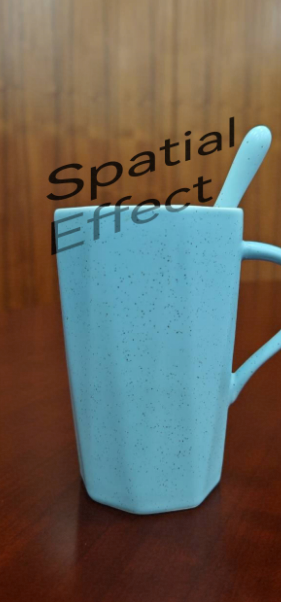
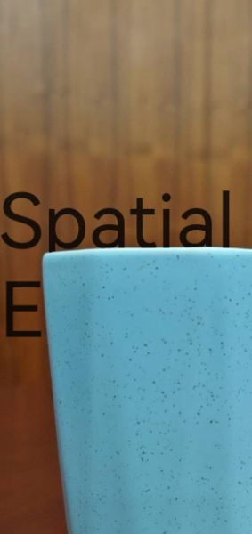

# DepthComponent (System API)

<!--Kit: ArkUI-->
<!--Subsystem: ArkUI-->
<!--Owner: @houguobiao-->
<!--Designer: @houguobiao-->
<!--Tester: @lxl007-->
<!--Adviser: @Brilliantry_Rui-->
<!-- md-trans-meta sourceCommit=d2c50a60c602f7446ec67ad08cb4d81ecd2717cf translatedAt=2026-08-14T03:43:12.002Z pushedAt=2026-08-17T02:32:26.020Z -->

This component uses a background and a depth map to generate content with a depth space effect.

> **NOTE**
>
> - Child components need to set the [spatial effect](./ts-universal-attributes-spatial-effect-sys.md) to interact with the background of **DepthComponent**.
>
> - To better use this component, you need to master basic knowledge of computer graphics.
>
> - The APIs provided by this module are system APIs.

**Since:** 26.0.0

## Child Components

Supported

## APIs

DepthComponent(background: ResourceStr | PixelMap, options?: DepthComponentOptions)

Creates a **DepthComponent** component.

**Since:** 26.0.0

**Model restriction:** This API can be used only in the stage model.

**System capability:** SystemCapability.ArkUI.ArkUI.Full

**Atomic service API:** This API can be used in atomic services since API version 26.0.0.

**System API:** This is a system API.

**Parameters**

| Name | Type | Mandatory | Description |
| -------- | -------- | -------- | -------- |
| background | [ResourceStr](ts-types.md#resourcestr) \| [PixelMap](../../apis-image-kit/arkts-apis-image-PixelMap.md) | Yes | Background resource, which supports static images or 3D models.<br>Static images support loading data sources of the **PixelMap** and **ResourceStr** types. For details about how to reference them, see [Loading Image Resources](../../../ui/arkts-graphics-display.md#loading-image-resources).<br>3D models support loading only data sources of the **ResourceStr** type, and only the glTF and GLB 3D model formats are supported. **ResourceStr** includes the Resource and string formats. The string format can be used to load local 3D models, and supports absolute paths or sandbox URIs with the **file://** prefix. Loading network resources is not supported. The Resource format can access model resource files across packages or modules. It is recommended to load local 3D models in this way. |
| options | [DepthComponentOptions](#depthcomponentoptions) | No | Configuration options of **DepthComponent**. Default value: `{ depthSpace: DepthSpaceType.INSTANCE }`. |

## DepthComponentOptions

Provides configuration options of **DepthComponent**.

**Since:** 26.0.0

**Model restriction:** This API can be used only in the stage model.

**System capability:** SystemCapability.ArkUI.ArkUI.Full

**Atomic service API:** This API can be used in atomic services since API version 26.0.0.

**System API:** This is a system API.

| Name | Type | Read-Only | Optional | Description |
| -------- | -------- | -------- | -------- | -------- |
| depthSpace | [DepthSpaceType](#depthspacetype) | No | Yes | Depth space type. |
| render3DScale | number | No | Yes | Scale factor of the 3D rendering window, applied to both width and height. Value range: (0.0, 1.0]. Values outside this range are invalid (the previous value is inherited; if no value has been set, the default value is used). Default value: **1.0**. |
| colorSpace | import('../api/@ohos.graphics.colorSpaceManager').default.[ColorSpace](../../apis-arkgraphics2d/js-apis-colorSpaceManager.md#colorspace) | No | Yes | Color space of the rendering surface. When set, the color space information is applied to the underlying rendering surface. When not set, no color space information is applied, and the rendering surface retains the default color space. Default value: **colorSpaceManager.ColorSpace.SRGB**. |

## DepthSpaceType

Enumerates depth space types.

> **NOTE**
>
> In global mode, other processes reuse the background, depth map, camera parameters, and lighting parameters of the wallpaper process, and these cannot be customized.

**Since:** 26.0.0

**Model restriction:** This API can be used only in the stage model.

**System capability:** SystemCapability.ArkUI.ArkUI.Full

**Atomic service API:** This API can be used in atomic services since API version 26.0.0.

**System API:** This is a system API.

| Name | Value | Description |
| -------- | -------- | -------- |
| INSTANCE | 0 | Instance mode, which uses the background, depth map, camera parameters, and lighting parameters of the current process. |
| GLOBAL | 1 | Global mode, which uses the global background, depth map, camera parameters, and lighting parameters. |

## Attributes

In addition to the [universal attributes](ts-component-general-attributes.md), the following attributes are supported:

### depthMap

depthMap(depthMap: ResourceStr | PixelMap, callback?: DepthMapCallback)

Sets the depth map used for depth calculation and rendering. This API returns the result asynchronously through a callback.

> **NOTE**
>
> A depth map is a two-dimensional matrix image that describes the distance between each pixel in the background and the camera in 3D space.
> Its data format is a grayscale image. A pixel with a larger grayscale value (whiter color) is closer to the camera.

**Since:** 26.0.0

**Model restriction:** This API can be used only in the stage model.

**System capability:** SystemCapability.ArkUI.ArkUI.Full

**Atomic service API:** This API can be used in atomic services since API version 26.0.0.

**System API:** This is a system API.

**Parameters**

| Name | Type | Mandatory | Description |
| -------- | -------- | -------- | -------- |
| depthMap | [ResourceStr](ts-types.md#resourcestr) \| [PixelMap](../../apis-image-kit/arkts-apis-image-PixelMap.md) | Yes | Depth map resource or **PixelMap** object, referenced in the same way as a static background image. The depth map needs to be set only when the background is a static image. The depth map must have the same resolution as the background image. |
| callback | [DepthMapCallback](#depthmapcallback) | No | Callback invoked when the depth map finishes loading. On load success, **error.code** is **0**; on load failure, **error** contains the error code and error message. |

### camera

camera(camera: DepthCameraParams)

Sets the camera parameters used for depth rendering.

> **NOTE**
>
> When an image is used as the background, updating the camera parameters will not change the background.

**Since:** 26.0.0

**Model restriction:** This API can be used only in the stage model.

**System capability:** SystemCapability.ArkUI.ArkUI.Full

**Atomic service API:** This API can be used in atomic services since API version 26.0.0.

**System API:** This is a system API.

**Parameters**

| Name | Type | Mandatory | Description |
| -------- | -------- | -------- | -------- |
| camera | [DepthCameraParams](#depthcameraparams) | Yes | Camera parameters. |

### light

light(light: DepthLightParams)

Sets the lighting parameters used for depth rendering.

**Since:** 26.0.0

**Model restriction:** This API can be used only in the stage model.

**System capability:** SystemCapability.ArkUI.ArkUI.Full

**Atomic service API:** This API can be used in atomic services since API version 26.0.0.

**System API:** This is a system API.

**Parameters**

| Name | Type | Mandatory | Description |
| -------- | -------- | -------- | -------- |
| light | [DepthLightParams](#depthlightparams) | Yes | Lighting parameters, including the direction, color, and intensity. |

## Events

### onComplete

onComplete(callback: DepthComponentCompleteCallback)

Triggered when the background resource is loaded successfully. This API returns the result asynchronously through a callback.

**Since:** 26.0.0

**Model restriction:** This API can be used only in the stage model.

**System capability:** SystemCapability.ArkUI.ArkUI.Full

**Atomic service API:** This API can be used in atomic services since API version 26.0.0.

**System API:** This is a system API.

**Parameters**

| Name | Type | Mandatory | Description |
| -------- | -------- | -------- | -------- |
| callback | [DepthComponentCompleteCallback](#depthcomponentcompletecallback) | Yes | Callback invoked when the background resource is loaded successfully. |

### onError

onError(callback: DepthComponentErrorCallback)

Triggered when an error occurs during background resource loading. This API returns the result asynchronously through a callback.

**Since:** 26.0.0

**Model restriction:** This API can be used only in the stage model.

**System capability:** SystemCapability.ArkUI.ArkUI.Full

**Atomic service API:** This API can be used in atomic services since API version 26.0.0.

**System API:** This is a system API.

**Parameters**

| Name | Type | Mandatory | Description |
| -------- | -------- | -------- | -------- |
| callback | [DepthComponentErrorCallback](#depthcomponenterrorcallback) | Yes | Callback invoked when the background resource fails to be loaded. |

## DepthMapCallback

Called when the depth map resource finishes loading. This API returns the result asynchronously through a callback.

type DepthMapCallback = (error: BusinessError&lt;void&gt;) => void

**Since:** 26.0.0

**Model restriction:** This API can be used only in the stage model.

**System capability:** SystemCapability.ArkUI.ArkUI.Full

**Atomic service API:** This API can be used in atomic services since API version 26.0.0.

**System API:** This is a system API.

**Parameters**

| Name | Type | Mandatory | Description |
| -------- | -------- | -------- | -------- |
| error | [BusinessError](../../apis-basic-services-kit/js-apis-base.md#businesserror)&lt;void&gt; | Yes | Error information returned when the depth map resource finishes loading. On load success, **error.code** is **0**; on load failure, **error** contains the error code and error message. |

## DepthCameraParams

Provides camera parameters.

**Since:** 26.0.0

**Model restriction:** This API can be used only in the stage model.

**System capability:** SystemCapability.ArkUI.ArkUI.Full

**Atomic service API:** This API can be used in atomic services since API version 26.0.0.

**System API:** This is a system API.

| Name | Type | Read-Only | Optional | Description |
| -------- | -------- | -------- | -------- | -------- |
| position | [DepthVector3](ts-universal-attributes-spatial-effect-sys.md#depthvector3) | No | No | Position of the camera in 3D space, without a unit. The value indicates the coordinates in 3D space. |
| quaternion | [DepthVector4](ts-universal-attributes-spatial-effect-sys.md#depthvector4) | No | No | Rotation quaternion of the camera, represented as (x, y, z, w). There is no unit. |
| yFov | number | No | No | Vertical field of view of the camera, in radians. |
| zNear | number | No | No | Distance to the near clipping plane, without a unit. The value must be a positive number. |
| zFar | number | No | No | Distance to the far clipping plane, without a unit. The value must be a positive number. |
| cameraBufferCrop | [CameraBufferCrop](#camerabuffercrop) | No | Yes | Camera buffer crop parameters. If not set, the component layout size is used as the default image reference size, with a crop offset of (0, 0) and a scale factor of 1.0. |

## CameraBufferCrop

Provides camera buffer crop parameters.

**Since:** 26.0.0

**Model restriction:** This API can be used only in the stage model.

**System capability:** SystemCapability.ArkUI.ArkUI.Full

**Atomic service API:** This API can be used in atomic services since API version 26.0.0.

**System API:** This is a system API.

| Name | Type | Read-Only | Optional | Description |
| -------- | -------- | -------- | -------- | -------- |
| bufferWidth | number | No | No | Width of the base image, in pixels. Ensure that the width of the input image is consistent with the actual image width; otherwise, display exceptions such as position offset may occur. |
| bufferHeight | number | No | No | Height of the base image, in pixels. Ensure that the height of the input image is consistent with the actual image height; otherwise, display exceptions such as position offset may occur. |
| cropOffset | [CropOffset](#cropoffset) | No | No | Crop offset. |
| cropScale | number | No | No | Scale factor of the crop area. The base size of the crop area is the size of the **DepthComponent** component. |

## CropOffset

Provides crop offset.

**Since:** 26.0.0

**Model restriction:** This API can be used only in the stage model.

**System capability:** SystemCapability.ArkUI.ArkUI.Full

**Atomic service API:** This API can be used in atomic services since API version 26.0.0.

**System API:** This is a system API.

| Name | Type | Read-Only | Optional | Description |
| -------- | -------- | -------- | -------- | -------- |
| x | number | No | No | Horizontal offset, in pixels. |
| y | number | No | No | Vertical offset, in pixels. |

## DepthLightParams

Provides lighting parameters.

**Since:** 26.0.0

**Model restriction:** This API can be used only in the stage model.

**System capability:** SystemCapability.ArkUI.ArkUI.Full

**Atomic service API:** This API can be used in atomic services since API version 26.0.0.

**System API:** This is a system API.

| Name | Type | Read-Only | Optional | Description |
| -------- | -------- | -------- | -------- | -------- |
| direction | [DepthVector3](ts-universal-attributes-spatial-effect-sys.md#depthvector3) | No | No | Lighting direction vector, without a unit. The value indicates the coordinates in 3D space. |
| color | [DepthColorRGB](ts-universal-attributes-spatial-effect-sys.md#depthcolorrgb) | No | No | Lighting color. |
| intensity | number | No | No | Lighting intensity, without a unit. The value range is [0, +∞).<br>The recommended value range is [0, 1]. When set to 0, there is no light. |

## DepthComponentCompleteCallback

Called when the background resource is loaded successfully. This API returns the result asynchronously through a callback.

type DepthComponentCompleteCallback = (event: DepthComponentCompleteEvent) => void

**Since:** 26.0.0

**Model restriction:** This API can be used only in the stage model.

**System capability:** SystemCapability.ArkUI.ArkUI.Full

**Atomic service API:** This API can be used in atomic services since API version 26.0.0.

**System API:** This is a system API.

**Parameters**

| Name | Type | Mandatory | Description |
| -------- | -------- | -------- | -------- |
| event | [DepthComponentCompleteEvent](#depthcomponentcompleteevent) | Yes | Event information about the successful loading of the background resource. |

## DepthComponentCompleteEvent

Provides the event information about the successful loading of the background resource.

**Since:** 26.0.0

**Model restriction:** This API can be used only in the stage model.

**System capability:** SystemCapability.ArkUI.ArkUI.Full

**Atomic service API:** This API can be used in atomic services since API version 26.0.0.

**System API:** This is a system API.

| Name | Type | Read-Only | Optional | Description |
| -------- | -------- | -------- | -------- | -------- |
| componentWidth | number | Yes | No | Width of the component, in vp. |
| componentHeight | number | Yes | No | Height of the component, in vp. |

## DepthComponentErrorCallback

Called when the background resource fails to be loaded. This API returns the result asynchronously through a callback.

type DepthComponentErrorCallback = (error: DepthComponentErrorEvent) => void

**Since:** 26.0.0

**Model restriction:** This API can be used only in the stage model.

**System capability:** SystemCapability.ArkUI.ArkUI.Full

**Atomic service API:** This API can be used in atomic services since API version 26.0.0.

**System API:** This is a system API.

**Parameters**

| Name | Type | Mandatory | Description |
| -------- | -------- | -------- | -------- |
| error | [DepthComponentErrorEvent](#depthcomponenterrorevent) | Yes | Event information about the background resource load failure. |

## DepthComponentErrorEvent

Provides the event information about the background resource load failure.

**Since:** 26.0.0

**Model restriction:** This API can be used only in the stage model.

**System capability:** SystemCapability.ArkUI.ArkUI.Full

**Atomic service API:** This API can be used in atomic services since API version 26.0.0.

**System API:** This is a system API.

| Name | Type | Read-Only | Optional | Description |
| -------- | -------- | -------- | -------- | -------- |
| componentWidth | number | Yes | No | Width of the component, in vp. |
| componentHeight | number | Yes | No | Height of the component, in vp. |
| error | [BusinessError](../../apis-basic-services-kit/js-apis-base.md#businesserror)&lt;void&gt; | Yes | Yes | Error information of the load failure. |

## Examples

### Example 1: Implementing Visually Tilted Text with Part of the Content Occluded by an Image

This example demonstrates how to implement visually tilted text with part of the content occluded by an image by configuring the child component [SpatialEffectParams](ts-universal-attributes-spatial-effect-sys.md#spatialeffectparams) and using a depth map. 

**SpatialEffectParams** is added since API version 26.0.0.

```ts
// xxx.ets
import { colorSpaceManager } from '@kit.ArkGraphics2D';

@Entry
@Component
struct DepthComponentInstanceExample {
  build() {
    Column() {
      // Replace it with the resource file you use.
      DepthComponent($r('app.media.background'), {
        colorSpace: colorSpaceManager.ColorSpace.DISPLAY_P3
      }) {
        Text('Spatial Effect')
          .fontSize(100)
          .spatialEffect({
            position: {
              leftTop: { x: -0.355, y: 0.915, z: -1.941 },
              rightTop: { x: 0.483, y: 1.259, z: -2.295 },
              leftBottom: { x: -0.355, y: -0.281, z: -1.941 },
              rightBottom: { x: 0.483, y: 0.063, z: -2.295 }
            },
            occlusionWeight: 0.5
          })
      }
        .width('100%')
        .height('100%')
        .depthMap($r('app.media.depth_map'), (error: BusinessError<void>) => {
          // Replace it with the resource file you use.
          if (error && error.code !== 0) {
            console.error(`Depth map load failed: ${error.code} - ${error.message}`);
          } else {
            console.info('Depth map loaded successfully');
          }
        })
        .camera({
          position: { x: 0, y: 0, z: 0 },
          quaternion: { x: 0, y: 0, z: 0, w: 1 },
          yFov: 1.05,
          zNear: 0.1,
          zFar: 100
        })
        .light({
          direction: { x: 0, y: 0, z: -1 },
          color: { red: 255, green: 255, blue: 255 },
          intensity: 1
        })
        .onComplete((event: DepthComponentCompleteEvent) => {
          console.info(`Background loaded: ${event.componentWidth}x${event.componentHeight}`);
        })
        .onError((event: DepthComponentErrorEvent) => {
          console.error(`Background load failed: ${event.componentWidth}x${event.componentHeight}`);
          if (event.error) {
            console.error(`Error: ${event.error.code} - ${event.error.message}`);
          }
        })
    }
    .width('100%')
    .padding(16)
  }
}
```



### Example 2: Implementing Depth Occlusion for Part of the Text

This example demonstrates how to implement occlusion of part of the text by an image by configuring the depth information in the child component [SpatialEffectParams](ts-universal-attributes-spatial-effect-sys.md#spatialeffectparams) and using a depth map.

**SpatialEffectParams** is added since API version 26.0.0.

```ts
// xxx.ets
@Entry
@Component
struct DepthComponentInstanceExample {
  build() {
    Column() {
      // Replace it with the resource file you use.
      DepthComponent($r('app.media.background')) {
        Text('Spatial Effect')
          .fontSize(100)
          .spatialEffect({
            position: -2.0,  // Set the depth information of the child component.
            occlusionWeight: 1.0
          })
      }
        .width('100%')
        .height('100%')
        .depthMap($r('app.media.depth_map')) // Replace it with the resource file you use.
        .camera({
          position: { x: 0, y: 0, z: 0 },
          quaternion: { x: 0, y: 0, z: 0, w: 1 },
          yFov: 1.05,
          zNear: 0.1,
          zFar: 100
        })
        .light({
          direction: { x: 0, y: 0, z: -1 },
          color: { red: 255, green: 255, blue: 255 },
          intensity: 1
        })
    }
    .width('100%')
    .padding(16)
  }
}
```


### Example 3: Implementing Cropping of Partial Rendered Content

This example demonstrates how to crop partial rendered content by configuring the tilt-shift camera [cameraBufferCrop](#camerabuffercrop) and using a depth map.

Since API version 26.0.0, the **cameraBufferCrop** attribute of **DepthCameraParams** is added.

```ts
// xxx.ets
@Entry
@Component
struct DepthComponentInstanceExample {
  build() {
    Column() {
      // Replace it with the resource file you use.
      DepthComponent($r('app.media.background')) {
        Text('Spatial Effect')
          .fontSize(100)
          .spatialEffect({
            position: -10.0,      // Set the depth information of the child component.
            occlusionWeight: 1.0
          })
      }
        .width('100%')
        .height('100%')
        .depthMap($r('app.media.depth_map')) // Replace it with the resource file you use.
        .camera({
          position: { x: 0, y: 0, z: 0 },
          quaternion: { x: 0, y: 0, z: 0, w: 1 },
          yFov: 1.05,
          zNear: 0.1,
          zFar: 100,
          cameraBufferCrop: {
            bufferWidth: 1262,       // Width of the base image.
            bufferHeight: 2560,      // Height of the base image.
            cropOffset: { x: 100.0, y: 100.0 },
            cropScale: 0.65
          }
        })
        .light({
          direction: { x: 0, y: 0, z: -1 },
          color: { red: 255, green: 255, blue: 255 },
          intensity: 1
        })
    }
    .width('100%')
    .padding(16)
  }
}
```

