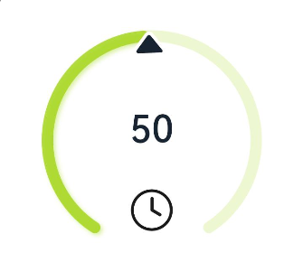
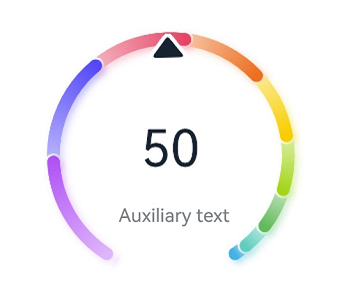
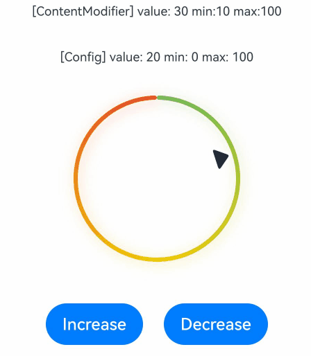

# Gauge

The **Gauge** component represents a gauge that displays data in a circular format.


>  **NOTE**
>
>  This component is supported since API version 8. Updates will be marked with a superscript to indicate their earliest API version.


## Child Components

This component can contain only one child component.

> **NOTE**
>
> You are advised to use the **Text** component to build the current value and auxiliary text.
>
> If the width and height of the child component are in percentage, the reference range is the rectangle that has the outer ring as its inscribed circle.


## APIs

Gauge(options: GaugeOptions)

Creates a gauge.

**Widget capability**: This API can be used in ArkTS widgets since API version 9.

**Atomic service API**: This API can be used in atomic services since API version 11.

**System capability**: SystemCapability.ArkUI.ArkUI.Full

**Parameters**

| Name| Type| Mandatory| Description|
| -------- | -------- | -------- | -------- |
| options |  [GaugeOptions](#gaugeoptions14)| Yes| Settings of the gauge.|

## GaugeOptions<sup>14+</sup>

**Widget capability**: This API can be used in ArkTS widgets since API version 14.

**Atomic service API**: This API can be used in atomic services since API version 14.

**System capability**: SystemCapability.ArkUI.ArkUI.Full

| Name| Type| Mandatory| Description|
| -------- | -------- | -------- | -------- |
| value | number | Yes| Current value of the gauge, that is, the position to which the indicator points in the gauge. It is used as the initial value of the gauge when it is created.<br>**NOTE**<br>If the value is not within the range defined by the **min** and **max** parameters, the value of **min** is used.|
| min | number | No| Minimum value of the current data segment.<br>Default value: **0**|
| max | number | No| Maximum value of the current data segment.<br>Default value: **100**<br>**NOTE**<br>If the value of **max** is less than that of **min**, the default values **0** and **100** are used.<br>The values of **max** and **min** can be negative numbers.|

## Attributes

In addition to the [universal attributes](ts-universal-attributes-size.md), the following attributes are supported.

### value

value(value: number)

Sets the value of the gauge.

**Widget capability**: This API can be used in ArkTS widgets since API version 9.

**Atomic service API**: This API can be used in atomic services since API version 11.

**System capability**: SystemCapability.ArkUI.ArkUI.Full

**Parameters**

| Name| Type  | Mandatory| Description                                                        |
| ------ | ------ | ---- | ------------------------------------------------------------ |
| value  | number | Yes  | Value of the gauge. It can be dynamically changed.<br>Default value: **0**|

### startAngle

startAngle(angle: number)

Sets the start angle of the gauge.

**Widget capability**: This API can be used in ArkTS widgets since API version 9.

**Atomic service API**: This API can be used in atomic services since API version 11.

**System capability**: SystemCapability.ArkUI.ArkUI.Full

**Parameters**

| Name| Type  | Mandatory| Description                                                        |
| ------ | ------ | ---- | ------------------------------------------------------------ |
| angle  | number | Yes  | Start angle of the gauge. The value **0** indicates 0 degrees, and a positive value indicates the clockwise direction.<br>Default value: **0**|

### endAngle

endAngle(angle: number)

Sets the end angle of the gauge. Ensure an appropriate difference between the start angle and end angle. If this difference is too small, the drawn chart may be abnormal. You are advised to use a monochrome ring to set the **value** attribute of the **Gauge**. You can also use **setTimeout** to delay value loading.

**Widget capability**: This API can be used in ArkTS widgets since API version 9.

**Atomic service API**: This API can be used in atomic services since API version 11.

**System capability**: SystemCapability.ArkUI.ArkUI.Full

**Parameters**

| Name| Type  | Mandatory| Description                                                        |
| ------ | ------ | ---- | ------------------------------------------------------------ |
| angle  | number | Yes  | End angle of the gauge. The value **0** indicates 0 degrees, and a positive value indicates the clockwise direction.<br>Default value: **360**|

### colors

colors(colors: ResourceColor | LinearGradient | Array<[ResourceColor | LinearGradient, number]>)

Sets the colors of the gauge.

Since API version 11, this API follows the following rules:

If the data type is ResourceColor, the ring is of the monochrome type.

If the data type is LinearGradient, the ring is of the gradient type.

If the data type is Array, the ring is of the gradient type. The first parameter indicates the color value. If it is set to a non-color value, the color of 0xFFE84026 is used. The second parameter indicates the color weight. If it is set to a negative number or a non-numeric value, the color weight is 0.

A ring of the gradient type contains a maximum of nine color segments. If there are more than nine segments, the excess is not displayed.

**Widget capability**: This API can be used in ArkTS widgets since API version 9.

**Atomic service API**: This API can be used in atomic services since API version 11.

**System capability**: SystemCapability.ArkUI.ArkUI.Full

**Parameters**

| Name| Type                                                        | Mandatory| Description                                                        |
| ------ | ------------------------------------------------------------ | ---- | ------------------------------------------------------------ |
| colors | [ResourceColor<sup>11+</sup>](ts-types.md#resourcecolor) \| [LinearGradient<sup>11+</sup>](ts-basic-components-datapanel.md#lineargradient10) \| Array&lt;[[ResourceColor](ts-types.md#resourcecolor) \| [LinearGradient<sup>11+</sup>](ts-basic-components-datapanel.md#lineargradient10) \, number]&gt; | Yes  | Colors of the gauge. You can set colors for individual segments.<br>Default value in API version 9: **Color.Black**<br>Default value in API version 11:<br>If no color is provided or the array is empty, the ring color will be a gradient consisting of the following colors: 0xFF64BB5C, 0xFFF7CE00, and 0xFFE84026.<br>If a color value is provided but invalid, the ring will be in the color of 0xFFE84026.<br>Colors with a weight of 0 are not displayed in the ring. If all weights are 0, the ring is not displayed.|

### strokeWidth

strokeWidth(length: Length)

Sets the stroke width of the gauge.

**Widget capability**: This API can be used in ArkTS widgets since API version 9.

**Atomic service API**: This API can be used in atomic services since API version 11.

**System capability**: SystemCapability.ArkUI.ArkUI.Full

**Parameters**

| Name| Type                        | Mandatory| Description                                                        |
| ------ | ---------------------------- | ---- | ------------------------------------------------------------ |
| length | [Length](ts-types.md#length) | Yes  | Stroke width of the gauge.<br>Default value: **4**<br>Unit: vp<br>**NOTE**<br>A value less than 0 evaluates to the default value.<br>The value cannot be in percentage.|

### description<sup>11+</sup>

description(value: CustomBuilder)

Sets the description of the gauge.

**Atomic service API**: This API can be used in atomic services since API version 12.

**System capability**: SystemCapability.ArkUI.ArkUI.Full

**Parameters**

| Name| Type                                       | Mandatory| Description                                                        |
| ------ | ------------------------------------------- | ---- | ------------------------------------------------------------ |
| value  | [CustomBuilder](ts-types.md#custombuilder8) | Yes  | Description.<br>**NOTE**<br>You need to customize the content – text or imagery recommended – in @Builder.<br>If the width and height of the custom content are in percentage, the reference range is a rectangle that is 44.4% of the diameter of the ring horizontally and 25.4% vertically (for images, it is 28.6% both horizontally and vertically), positioned 0 vp away from the bottom of the ring and centered horizontally.<br>If this parameter is set to null, no description is displayed.<br>If this parameter is not set, what's displayed is subject to the maximum and minimum value settings.<br>If either or both of the maximum and minimum values are set, they are displayed.<br>If neither maximum nor minimum values are set, no description is displayed.<br>The maximum and minimum values are displayed at the bottom of the ring and cannot be relocated. They may be blocked by the ring if the ring's start and end angles are not set properly.|

### trackShadow<sup>11+</sup>

trackShadow(value: GaugeShadowOptions)

Sets the shadow style of the gauge.

**Atomic service API**: This API can be used in atomic services since API version 12.

**System capability**: SystemCapability.ArkUI.ArkUI.Full

**Parameters**

| Name| Type                                               | Mandatory| Description                                                        |
| ------ | --------------------------------------------------- | ---- | ------------------------------------------------------------ |
| value  | [GaugeShadowOptions](#gaugeshadowoptions11) | Yes  | Shadow style.<br>**NOTE**<br>The shadow color is the same as the ring color.<br>If this attribute is set to **null**, the shadow effect is disabled.|

### indicator<sup>11+</sup>

indicator(value: GaugeIndicatorOptions)

Sets the indicator style of the gauge.

**Atomic service API**: This API can be used in atomic services since API version 12.

**System capability**: SystemCapability.ArkUI.ArkUI.Full

**Parameters**

| Name| Type                                                     | Mandatory| Description                                                 |
| ------ | --------------------------------------------------------- | ---- | ----------------------------------------------------- |
| value  | [GaugeIndicatorOptions](#gaugeindicatoroptions11) | Yes  | Indicator style.<br>**NOTE**<br>If this attribute is set to **null**, no indicator is displayed.|

### privacySensitive<sup>12+</sup>

privacySensitive(isPrivacySensitiveMode: Optional\<boolean\>)

Sets whether to enable privacy mode.

**Widget capability**: This API can be used in ArkTS widgets since API version 12.

**Atomic service API**: This API can be used in atomic services since API version 12.

**System capability**: SystemCapability.ArkUI.ArkUI.Full

**Parameters**

| Name| Type                                                     | Mandatory| Description                                                 |
| ------ | --------------------------------------------------------- | ---- | ----------------------------------------------------- |
| isPrivacySensitiveMode  | [Optional\<boolean\>] | Yes  | Whether to enable privacy mode. In privacy mode, the gauge indicator points to **0**, the maximum and minimum values are masked, and the scale range is displayed in gray or the background color.<br>**NOTE**<br>If this parameter is set to **null**, privacy mode is disabled.<br>[Enabling privacy mode requires widget framework support.](./ts-universal-attributes-obscured.md) |

### contentModifier<sup>12+</sup>

contentModifier(modifier: ContentModifier\<GaugeConfiguration>)

Creates a content modifier.

**Atomic service API**: This API can be used in atomic services since API version 12.

**System capability**: SystemCapability.ArkUI.ArkUI.Full

**Parameters**

| Name| Type                                         | Mandatory| Description                                            |
| ------ | --------------------------------------------- | ---- | ------------------------------------------------ |
| modifier  | [ContentModifier\<GaugeConfiguration>](#gaugeconfiguration12)| Yes  | Content modifier to apply to the current component.<br>**modifier**: content modifier. You need a custom class to implement the **ContentModifier** API.|

## GaugeShadowOptions<sup>11+</sup>

Inherits from [MultiShadowOptions](ts-types.md#multishadowoptions10) and has all attributes of **MultiShadowOptions**.

**Atomic service API**: This API can be used in atomic services since API version 12.

## GaugeIndicatorOptions<sup>11+</sup>

**Atomic service API**: This API can be used in atomic services since API version 12.

**System capability**: SystemCapability.ArkUI.ArkUI.Full

| Name         | Type| Mandatory| Description|
| ------------- | ------- | ---- | -------- |
| icon | [ResourceStr](ts-types.md#resourcestr) | No| Image path of the icon.<br>**NOTE**<br>If this parameter is not set, the default triangle style indicator is used.<br>Icons in SVG format are supported. If icons in other formats are used, the default triangle style indicator is used.|
| space | [Dimension](ts-types.md#dimension10) | No| Distance between the indicator and the outer edge of the ring. The value cannot be in percentage.<br>Default value: **8**<br>Unit: vp<br>**NOTE**<br> For the default triangle style indicator, the distance is the amount of space between the triangle and the outer edge of the ring.<br> If this parameter is set to a value less than 0, the default value will be used.<br>If this parameter is set to a value greater than the ring radius, the default value will be used.|

## GaugeConfiguration<sup>12+</sup>

You need a custom class to implement the **ContentModifier** API.

**Atomic service API**: This API can be used in atomic services since API version 12.

**System capability**: SystemCapability.ArkUI.ArkUI.Full

| Name | Type   | Mandatory| Description             |
| ------ | ------ | ----| ---------------- |
| value | number | Yes| Current value.|
| min | number | Yes| Minimum value of the current data segment.|
| max | number | Yes| Maximum value of the current data segment.|


## Example
### Example 1: Implementing a Multi-color Gauge

This example demonstrates how to implement a multi-color gauge using the **colors** attribute.

```ts
@Entry
@Component
struct Gauge1 {
  @Builder descriptionBuilder() {
    Text('Description')
      .maxFontSize('30sp')
      .minFontSize("10.0vp")
      .fontColor("#fffa2a2d")
      .fontWeight(FontWeight.Medium)
      .width('100%')
      .height("100%")
      .textAlign(TextAlign.Center)
  }

  build() {
    Column() {
      Gauge({ value: 50, min: 1, max: 100 }) {
        Column() {
          Text('50')
            .fontWeight(FontWeight.Medium)
            .width('62%')
            .fontColor("#ff182431")
            .maxFontSize("60.0vp")
            .minFontSize("30.0vp")
            .textAlign(TextAlign.Center)
            .margin({ top: '35%' })
            .textOverflow({ overflow: TextOverflow.Ellipsis })
            .maxLines(1)
          Text('Auxiliary text')
            .maxFontSize("16.0fp")
            .minFontSize("10.0vp")
            .fontColor($r('sys.color.ohos_id_color_text_secondary'))
            .fontColor($r('sys.color.ohos_id_color_text_secondary'))
            .fontWeight(FontWeight.Regular)
            .width('67.4%')
            .height('9.5%')
            .textAlign(TextAlign.Center)
        }.width('100%').height('100%')
      }
      .value(50)
      .startAngle(210)
      .endAngle(150)
      .colors([[new LinearGradient([{ color: "#deb6fb", offset: 0 }, { color: "#ac49f5", offset: 1 }]), 9],
        [new LinearGradient([{ color: "#bbb7fc", offset: 0 }, { color: "#564af7", offset: 1 }]), 8],
        [new LinearGradient([{ color: "#f5b5c2", offset: 0 }, { color: "#e64566", offset: 1 }]), 7],
        [new LinearGradient([{ color: "#f8c5a6", offset: 0 }, { color: "#ed6f21", offset: 1 }]), 6],
        [new LinearGradient([{ color: "#fceb99", offset: 0 }, { color: "#f7ce00", offset: 1 }]), 5],
        [new LinearGradient([{ color: "#dbefa5", offset: 0 }, { color: "#a5d61d", offset: 1 }]), 4],
        [new LinearGradient([{ color: "#c1e4be", offset: 0 }, { color: "#64bb5c", offset: 1 }]), 3],
        [new LinearGradient([{ color: "#c0ece5", offset: 0 }, { color: "#61cfbe", offset: 1 }]), 2],
        [new LinearGradient([{ color: "#b5e0f4", offset: 0 }, { color: "#46b1e3", offset: 1 }]), 1]])
      .width('80%')
      .height('80%')
      .strokeWidth(18)
      .trackShadow({ radius: 7, offsetX: 7, offsetY: 7 })
      .description(this.descriptionBuilder)
      .padding(18)
    }.margin({ top: 40 }).width('100%').height('100%')
  }
}
```


### Example 1: Implementing a Single-color Gauge

This example demonstrates how to implement a single-color gauge using the **colors** attribute.

```ts
@Entry
@Component
struct Gauge2 {
  @Builder descriptionBuilderImage() {
    Image($r('sys.media.ohos_ic_public_clock')).width(72).height(72)
  }

  build() {
    Column() {
      Gauge({ value: 50, min: 1, max: 100 }) {
        Column() {
          Text('50')
            .fontWeight(FontWeight.Medium)
            .width('62%')
            .fontColor("#ff182431")
            .maxFontSize("60.0vp")
            .minFontSize("30.0vp")
            .textAlign(TextAlign.Center)
            .margin({ top: '35%' })
            .textOverflow({ overflow: TextOverflow.Ellipsis })
            .maxLines(1)
        }.width('100%').height('100%')
      }
      .startAngle(210)
      .endAngle(150)
      .colors('#cca5d61d')
      .width('80%')
      .height('80%')
      .strokeWidth(18)
      .description(this.descriptionBuilderImage)
      .padding(18)
    }.margin({ top: 40 }).width('100%').height('100%')
  }
}
```


### Example 3: Configuring a Custom Description Area

This example illustrates how to configure a custom description area using the **description** attribute.

```ts
@Entry
@Component
struct Gauge3 {
  @Builder descriptionBuilder() {
    Text('Description')
      .maxFontSize('30sp')
      .minFontSize("10.0vp")
      .fontColor("#fffa2a2d")
      .fontWeight(FontWeight.Medium)
      .width('100%')
      .height("100%")
      .textAlign(TextAlign.Center)
  }

  build() {
    Column() {
      Column() {
        Gauge({ value: 50, min: 1, max: 100 }) {
          Column() {
            Text('50')
              .fontWeight(FontWeight.Medium)
              .width('62%')
              .fontColor("#ff182431")
              .maxFontSize("60.0vp")
              .minFontSize("30.0vp")
              .textAlign(TextAlign.Center)
              .margin({ top: '35%' })
              .textOverflow({ overflow: TextOverflow.Ellipsis })
              .maxLines(1)
          }.width('100%').height('100%')
        }
        .startAngle(210)
        .endAngle(150)
        .colors([[new LinearGradient([{ color: "#deb6fb", offset: 0 }, { color: "#ac49f5", offset: 1 }]), 9],
          [new LinearGradient([{ color: "#bbb7fc", offset: 0 }, { color: "#564af7", offset: 1 }]), 8],
          [new LinearGradient([{ color: "#f5b5c2", offset: 0 }, { color: "#e64566", offset: 1 }]), 7],
          [new LinearGradient([{ color: "#f8c5a6", offset: 0 }, { color: "#ed6f21", offset: 1 }]), 6],
          [new LinearGradient([{ color: "#fceb99", offset: 0 }, { color: "#f7ce00", offset: 1 }]), 5],
          [new LinearGradient([{ color: "#dbefa5", offset: 0 }, { color: "#a5d61d", offset: 1 }]), 4],
          [new LinearGradient([{ color: "#c1e4be", offset: 0 }, { color: "#64bb5c", offset: 1 }]), 3],
          [new LinearGradient([{ color: "#c0ece5", offset: 0 }, { color: "#61cfbe", offset: 1 }]), 2],
          [new LinearGradient([{ color: "#b5e0f4", offset: 0 }, { color: "#46b1e3", offset: 1 }]), 1]])
        .width('80%')
        .height('80%')
        .strokeWidth(18)
        .description(this.descriptionBuilder)
        .trackShadow({ radius: 7, offsetX: 7, offsetY: 7 })
        .padding(18)
      }.margin({ top: 40 }).width('100%').height('100%')
    }
  }
}
```


### Example 4: Configuring the Auxiliary Area

This example demonstrates how to configure the auxiliary area by setting child components.

```ts
@Entry
@Component
struct Gauge4 {
  build() {
    Column() {
      Gauge({ value: 50, min: 1, max: 100 }) {
        Column() {
          Text('50')
            .maxFontSize("72.0vp")
            .minFontSize("10.0vp")
            .fontColor("#ff182431")
            .width('40%')
            .textAlign(TextAlign.Center)
            .margin({ top: '35%' })
            .textOverflow({ overflow: TextOverflow.Ellipsis })
            .maxLines(1)
          Text('Auxiliary text')
            .maxFontSize("30.0vp")
            .minFontSize("18.0vp")
            .fontWeight(FontWeight.Medium)
            .fontColor($r('sys.color.ohos_id_color_text_secondary'))
            .width('62%')
            .height('15.9%')
            .textAlign(TextAlign.Center)
        }.width('100%').height('100%')
      }
      .startAngle(210)
      .endAngle(150)
      .colors([[new LinearGradient([{ color: "#deb6fb", offset: 0 }, { color: "#ac49f5", offset: 1 }]), 9],
        [new LinearGradient([{ color: "#bbb7fc", offset: 0 }, { color: "#564af7", offset: 1 }]), 8],
        [new LinearGradient([{ color: "#f5b5c2", offset: 0 }, { color: "#e64566", offset: 1 }]), 7],
        [new LinearGradient([{ color: "#f8c5a6", offset: 0 }, { color: "#ed6f21", offset: 1 }]), 6],
        [new LinearGradient([{ color: "#fceb99", offset: 0 }, { color: "#f7ce00", offset: 1 }]), 5],
        [new LinearGradient([{ color: "#dbefa5", offset: 0 }, { color: "#a5d61d", offset: 1 }]), 4],
        [new LinearGradient([{ color: "#c1e4be", offset: 0 }, { color: "#64bb5c", offset: 1 }]), 3],
        [new LinearGradient([{ color: "#c0ece5", offset: 0 }, { color: "#61cfbe", offset: 1 }]), 2],
        [new LinearGradient([{ color: "#b5e0f4", offset: 0 }, { color: "#46b1e3", offset: 1 }]), 1]])
      .width('80%')
      .height('80%')
      .strokeWidth(18)
      .description(null)
      .trackShadow({ radius: 7, offsetX: 7, offsetY: 7 })
      .padding(18)
    }.margin({ top: 40 }).width('100%').height('100%')
  }
}
```


### Example 5: Setting the Minimum and Maximum Values

This example shows how to set the minimum and maximum values of the gauge by configuring **min** and **max**.

```ts
@Entry
@Component
struct Gauge5 {
  build() {
    Column() {
      Gauge({ value: 50, min: 1, max: 100 }) {
        Column() {
          Text('50')
            .maxFontSize("80sp")
            .minFontSize("60.0vp")
            .fontWeight(FontWeight.Medium)
            .fontColor("#ff182431")
            .width('40%')
            .height('30%')
            .textAlign(TextAlign.Center)
            .margin({ top: '22.2%' })
            .textOverflow({ overflow: TextOverflow.Ellipsis })
            .maxLines(1)
        }.width('100%').height('100%')
      }
      .startAngle(225)
      .endAngle(135)
      .colors(new LinearGradient([{ color: "#e84026", offset: 0 },
        { color: "#f7ce00", offset: 0.6 },
        { color: "#64bb5c", offset: 1 }]))
      .width('80%')
      .height('80%')
      .strokeWidth(18)
      .trackShadow({ radius: 7, offsetX: 7, offsetY: 7 })
      .padding(18)
    }.margin({ top: 40 }).width('100%').height('100%')
  }
}
```


### Example 6: Setting the Indicator

This example illustrates how to set the indicator of the gauge using the **indicator** attribute.

```ts
@Entry
@Component
struct Gauge6 {
  build() {
    Column() {
      Gauge({ value: 50, min: 1, max: 100 }) {
        Column() {
          Text('50')
            .maxFontSize('60sp')
            .minFontSize('30.0vp')
            .fontWeight(FontWeight.Medium)
            .fontColor("#ff182431")
            .width('62%')
            .textAlign(TextAlign.Center)
            .margin({ top: '35%' })
            .textOverflow({ overflow: TextOverflow.Ellipsis })
            .maxLines(1)
          Text('Auxiliary text')
            .maxFontSize('16sp')
            .minFontSize("10.0vp")
            .fontColor($r('sys.color.ohos_id_color_text_secondary'))
            .fontWeight(FontWeight.Regular)
            .width('67.4%')
            .height('9.5%')
            .textAlign(TextAlign.Center)
        }.width('100%').height('100%')
      }
      .startAngle(225)
      .endAngle(135)
      .colors(Color.Red)
      .width('80%')
      .height('80%')
      .indicator(null)
      .strokeWidth(18)
      .trackShadow({ radius: 7, offsetX: 7, offsetY: 7 })
      .padding(18)
    }.margin({ top: 40 }).width('100%').height('100%')
  }
}
```


### Example 7: Setting the Start and End Angles

This example demonstrates how to set the start and end angles of the gauge using the **startAngle** and **endAngle** attributes.

```ts
@Entry
@Component
struct Gauge7 {
  build() {
    Column() {
      Gauge({ value: 50, min: 1, max: 100 }) {
        Column() {
          Text('50')
            .maxFontSize('60sp')
            .minFontSize('30.0vp')
            .fontWeight(FontWeight.Medium)
            .fontColor("#ff182431")
            .width('62%')
            .textAlign(TextAlign.Center)
            .margin({ top: '35%' })
            .textOverflow({ overflow: TextOverflow.Ellipsis })
            .maxLines(1)
        }.width('100%').height('100%')
      }
      .startAngle(225)
      .endAngle(135)
      .colors(Color.Red)
      .width('80%')
      .height('80%')
      .indicator(null)
      .strokeWidth(18)
      .trackShadow({ radius: 7, offsetX: 7, offsetY: 7 })
      .padding(18)
    }.margin({ top: 40 }).width('100%').height('100%')
  }
}
```


### Example 8: Setting the Custom Content Area

This example shows how to customize the content area of the gauge using the **contentModifier** attribute.

```ts
// xxx.ets
// The example implements the customization of the gauge's content area using a Builder, utilizing a circular chart, buttons, and text boxes. When the increase button is clicked, the indicator will shift to the right; conversely, when the decrease button is clicked, the indicator will shift to the left.
@Builder
function buildGauge(config: GaugeConfiguration) {
  Column({ space: 30 }) {
    Row() {
      Text('[ContentModifier] value: ' + JSON.stringify((config.contentModifier as MyGaugeStyle).value) +
        ' min:' + JSON.stringify((config.contentModifier as MyGaugeStyle).min) +
        ' max:' + JSON.stringify((config.contentModifier as MyGaugeStyle).max))
        .fontSize(12)
    }

    Text('[Config] value: ' + config.value + ' min: ' + config.min + ' max: ' + config.max).fontSize(12)
    Gauge({
      value: config.value,
      min: config.min,
      max: config.max
    }).width("50%")
  }
  .width("100%")
  .padding(20)
  .margin({ top: 5 })
  .alignItems(HorizontalAlign.Center)
}

class MyGaugeStyle implements ContentModifier<GaugeConfiguration> {
  value: number = 0
  min: number = 0
  max: number = 0

  constructor(value: number, min: number, max: number) {
    this.value = value
    this.min = min
    this.max = max
  }

  applyContent(): WrappedBuilder<[GaugeConfiguration]> {
    return wrapBuilder(buildGauge)
  }
}

@Entry
@Component
struct refreshExample {
  @State gaugeValue: number = 20
  @State gaugeMin: number = 0
  @State gaugeMax: number = 100

  build() {
    Column({ space: 20 }) {
      Gauge({
        value: this.gaugeValue,
        min: this.gaugeMin,
        max: this.gaugeMax
      })
        .contentModifier(new MyGaugeStyle(30, 10, 100))

      Column({ space: 20 }) {
        Row({ space: 20 }) {
          Button('Increase').onClick(() => {
            if (this.gaugeValue < this.gaugeMax) {
              this.gaugeValue += 1
            }
          })
          Button('Decrease').onClick(() => {
            if (this.gaugeValue > this.gaugeMin) {
              this.gaugeValue -= 1
            }
          })
        }
      }.width('100%')
    }.width('100%').margin({ top: 5 })
  }
}
```



### Example 9: Securing Sensitive Information

This example illustrates how to secure sensitive information using the **privacySensitive** attribute. Note that the display requires widget framework support.

```ts
@Entry
@Component
struct GaugeExample {
  build() {
    Scroll() {
      Column({ space: 15 }) {
        Row() {
          Gauge({ value: 50, min: 1, max: 100 }) {
            Column() {
              Text('60')
                .maxFontSize("180sp")
                .minFontSize("160.0vp")
                .fontWeight(FontWeight.Medium)
                .fontColor("#ff182431")
                .width('40%')
                .height('30%')
                .textAlign(TextAlign.Center)
                .margin({ top: '22.2%' })
                .textOverflow({ overflow: TextOverflow.Ellipsis })
                .maxLines(1)
            }.width('100%').height('100%')
          }
          .startAngle(225)
          .endAngle(135)
          .colors(Color.Red)
          .width('80%')
          .height('80%')
          .strokeWidth(18)
          .trackShadow({ radius: 7, offsetX: 7, offsetY: 7 })
          .padding(18)
          .privacySensitive(true)
        }
      }
    }
  }
}
```

