# Image

The **Image** component is usually used to display images in applications. It supports data sources of the following types: [PixelMap](../../apis-image-kit/arkts-apis-image-PixelMap.md), [ResourceStr](ts-types.md#resourcestr), and [DrawableDescriptor](#drawabledescriptor10). Supported image formats include PNG, JPG, JPEG, BMP, SVG, WEBP, GIF, and HEIF. Note that the APNG and SVGA formats are not supported.

> **NOTE**
>
> This component is supported since API version 7. Updates will be marked with a superscript to indicate their earliest API version.
>
> To use shortcut keys to copy the **Image** component, the component must be [in focus](../../../ui/arkts-common-events-focus-event.md#setting-whether-a-component-is-focusable). By default, the **Image** component is not focusable. To enable it to gain focus, set both the [focusable](ts-universal-attributes-focus.md#focusable) and [focusOnTouch](ts-universal-attributes-focus.md#focusontouch9) attributes to **true**.
>
> The **Image** component supports SVG image sources. For details about SVG tags, see [SVG Tags](./ts-basic-svg.md).
>
> For animated images, animation playback is disabled by default and depends on the visibility of the **Image** component. When the component is visible, the animation is started through the callback. When the component is invisible, the animation is stopped. The visibility status of the **Image** component can be identified through the [onVisibleAreaChange](./ts-universal-component-visible-area-change-event.md#onvisibleareachange) event. If the value of **ratios** is greater than 0, the component is visible.
>
>For details about how to resolve white block issues during image loading, see [Solution to White Image Blocks](https://developer.huawei.com/consumer/en/doc/best-practices/bpta-image-white-lump-solution). For details about how to address slow image loading, see [Optimizing Preset Image Loading](https://developer.huawei.com/consumer/en/doc/best-practices/bpta-texture-compression-improve-performance).

## Required Permissions

The **ohos.permission.INTERNET** permission is required for using online images. For details about how to apply for a permission, see [Declaring Permissions](../../../security/AccessToken/declare-permissions.md).


## Child Components

Not supported


## APIs

### Image

Image(src: PixelMap | ResourceStr | DrawableDescriptor)

Obtains an image from the specified source for subsequent rendering and display.

If the **Image** component fails to obtain the image or the obtained image size is 0, the **Image** component is automatically resized to 0 and does not follow the layout constraints of its parent component.

By default, the **Image** component crops images to keep their center. For example, if the component has the same width and height, it crops any image whose width and height are different, so as to keep its center.

If the **Image** component does not have its width and height set, its size adapts to that of its parent component once the image is successfully loaded.

**Widget capability**: This API can be used in ArkTS widgets since API version 9.

**Atomic service API**: This API can be used in atomic services since API version 11.

**System capability**: SystemCapability.ArkUI.ArkUI.Full

**Parameters**

| Name | Type                                    | Mandatory  | Description                                    |
| ---- | ---------------------------------------- | ---- | ---------------------------------------- |
| src  | [PixelMap](../../apis-image-kit/arkts-apis-image-PixelMap.md) \| [ResourceStr](ts-types.md#resourcestr)\| [DrawableDescriptor](#drawabledescriptor10) | Yes   | Data source of the image. Local and online sources are supported. For details about how to reference an image, see [Loading Image Resources](../../../ui/arkts-graphics-display.md#loading-image-resources).<br>1. **PixelMap**: an array of pixels storing graphical information. This type is usually used in image editing scenarios.<br>2. **ResourceStr**: a string or a **Resource** object.<br>The string type can be used to load local images and, more frequently, online images. When using an image referenced using a relative path, for example, **Image("common/test.jpg")**, the **Image** component cannot be called across bundles or modules. If an image needs to be used globally, you are advised to use the **Resource** format. The following types of strings are supported:<br>- Base64 strings<br>- Strings with the **file://** prefix, that is, [application sandbox URIs](../../apis-core-file-kit/js-apis-file-fileuri.md#constructor10): **file://\<bundleName>/\<sandboxPath>**, When accessing a path that contains special characters, use [fileUri.getUriFromPath(path)](../../apis-core-file-kit/js-apis-file-fileuri.md#fileurigeturifrompath) to transform the path into a URI that can handle special symbols. In addition, ensure that the application has the read permission to the files in the specified path.<br>The **Resource** format allows for access across bundles and modules. It is recommended for accessing local images.<br>3. **DrawableDescriptor**: an object created when the passed resource ID or name belongs to a common image. If the [AnimatedDrawableDescriptor](../js-apis-arkui-drawableDescriptor.md#animateddrawabledescriptor12) type is passed in, the PixelMap array animation can be played.<br>**NOTE**<br>- ArkTS widgets support GIF animations, but the animations only play once on display.<br>- ArkTS widgets do not support the strings with the **http:/\/** or **file:/\/** prefix.|

>**NOTE**
>
> Passing a URL directly to an **Image** component may lead to potential performance issues, such as: (1) Large images cannot be downloaded in advance during loading, resulting in a long display time of white blocks; (2) Small images set to load synchronously may block the UI thread in a weak network environment, causing screen freezes; (3) In a rapidly scrolling waterfall flow, images that are about to be displayed cannot be downloaded in advance, resulting in many white blocks during scrolling. Performance issues may manifest differently in different scenarios. To minimize these issues, separate the network download part from the display of the **Image** component, and download in advance or asynchronously. For details about how to resolve white block issues during image loading, see [Solution to White Image Blocks](https://developer.huawei.com/consumer/en/doc/best-practices/bpta-image-white-lump-solution). For details about how to address slow image loading, see [Optimizing Preset Image Loading](https://developer.huawei.com/consumer/en/doc/best-practices/bpta-texture-compression-improve-performance).
>
> When **src** is switched from a valid value (an image resource that can be parsed and loaded correctly) to an invalid value (an image path that cannot be parsed or loaded), the component should retain the previously successfully loaded image content without clearing or resetting it.
>
> If the input parameter is of the [PixelMap](../../apis-image-kit/arkts-apis-image-PixelMap.md) type, the **Image** component can detect data changes only when the reference to the **PixelMap** object is updated to point to a new instance. If modifications are made to the content of the **PixelMap** object, such as pixel values, but the reference to the object remains the same, the **Image** component will not recognize these modifications as a data change.

### Image<sup>12+</sup>

Image(src: PixelMap | ResourceStr | DrawableDescriptor | ImageContent)

Obtains an image. The [ImageContent](#imagecontent12) type allows you to specify the image content.

**Widget capability**: This API can be used in ArkTS widgets since API version 12.

**Atomic service API**: This API can be used in atomic services since API version 12.

**System capability**: SystemCapability.ArkUI.ArkUI.Full

**Parameters**

| Name | Type                                    | Mandatory  | Description                                    |
| ---- | ---------------------------------------- | ---- | ---------------------------------------- |
| src  | [PixelMap](../../apis-image-kit/arkts-apis-image-PixelMap.md) \| [ResourceStr](ts-types.md#resourcestr)\| [DrawableDescriptor](#drawabledescriptor10)\| [ImageContent](#imagecontent12) | Yes   | Data source of the image. Local and online sources are supported. For details about how to reference an image, see [Loading Image Resources](../../../ui/arkts-graphics-display.md#loading-image-resources).<br>For details about how to use **PixelMap**, **ResourceStr**, and **DrawableDescriptor**, see the **scr** parameter description of [Image](#image-1).<br> [ImageContent](#imagecontent12): image content.<br>**NOTE**<br>- ArkTS widgets support GIF animations, but the animations only play once on display.<br>- ArkTS widgets do not support the strings with the **http:/\/** or **file:/\/** prefix.|

### Image<sup>12+</sup>

Image(src: PixelMap | ResourceStr | DrawableDescriptor, imageAIOptions: ImageAIOptions)

Obtains an image. The [imageAIOptions](ts-image-common.md#imageaioptions) parameter allows you to set AI image analysis options.

**Atomic service API**: This API can be used in atomic services since API version 12.

**System capability**: SystemCapability.ArkUI.ArkUI.Full

**Parameters**

| Name | Type                                    | Mandatory  | Description                                    |
| ---- | ---------------------------------------- | ---- | ---------------------------------------- |
| src  | [PixelMap](../../apis-image-kit/arkts-apis-image-PixelMap.md) \| [ResourceStr](ts-types.md#resourcestr)\| [DrawableDescriptor](#drawabledescriptor10) | Yes   | Data source of the image. Local and online sources are supported. For details about how to reference an image, see [Loading Image Resources](../../../ui/arkts-graphics-display.md#loading-image-resources).<br>For details about how to use **PixelMap**, **ResourceStr**, and **DrawableDescriptor**, see the **scr** parameter description of [Image](#image-1).<br>**NOTE**<br>- ArkTS widgets support GIF animations, but the animations only play once on display.<br>- ArkTS widgets do not support the strings with the **http:/\/** or **file:/\/** prefix.|
| imageAIOptions  | [ImageAIOptions](ts-image-common.md#imageaioptions) | Yes  | AI image analysis options. You can configure the analysis type or bind an analyzer controller through this parameter.|

## Attributes

For details about how to use the attributes, see [Setting Attributes](../../../ui/arkts-graphics-display.md#setting-attributes). In addition to the [universal attributes](ts-component-general-attributes.md), the following attributes are supported.

> **NOTE**
>
> The **Image** component does not support the universal attribute [foregroundColor](./ts-universal-attributes-foreground-color.md#foregroundcolor). Instead, you can set the fill color using the component's [fillColor](#fillcolor) attribute.

### alt

alt(value: string | Resource  | PixelMap)

Sets the placeholder image displayed during loading.

The placeholder image supports configuration of [objectFit](#objectfit) for setting the fill effect, which is consistent with the fill effect of the image.

This attribute does not take effect when the parameter type of the component is [AnimatedDrawableDescriptor](../js-apis-arkui-drawableDescriptor.md#animateddrawabledescriptor12).

**Widget capability**: This API can be used in ArkTS widgets since API version 9.

**Atomic service API**: This API can be used in atomic services since API version 11.

**System capability**: SystemCapability.ArkUI.ArkUI.Full

**Parameters**

| Name| Type                                                    | Mandatory| Description                                                        |
| ------ | -------------------------------------------------------- | ---- | ------------------------------------------------------------ |
| value  | string \| [Resource](ts-types.md#resource) \| [PixelMap](../../apis-image-kit/arkts-apis-image-PixelMap.md)<sup>12+</sup> | Yes  | Placeholder image displayed during loading. Local images (in PNG, JPG, BMP, SVG, GIF, or HEIF format) and [PixelMap](../../apis-image-kit/arkts-apis-image-PixelMap.md) objects are supported, but online images are not.<br>Default value: **null**.<br>When the value is switched from a valid one (an image resource that can be parsed and loaded correctly) to an invalid one (an image path that cannot be parsed or loaded), the component retains the previously successfully loaded image content without clearing or resetting it.|

### objectFit

objectFit(value: ImageFit)

Sets how the image is resized to fit its container.

**Widget capability**: This API can be used in ArkTS widgets since API version 9.

**Atomic service API**: This API can be used in atomic services since API version 11.

**System capability**: SystemCapability.ArkUI.ArkUI.Full

**Parameters**

| Name| Type                                     | Mandatory| Description                                       |
| ------ | ----------------------------------------- | ---- | ------------------------------------------- |
| value  | [ImageFit](ts-appendix-enums.md#imagefit) | Yes  | How the image is resized to fit its container.<br>Default value: **ImageFit.Cover**|

### imageMatrix<sup>15+</sup>

imageMatrix(matrix: ImageMatrix)

Sets the transformation matrix of the image. This API allows you to use the APIs provided by the [ImageMatrix](#imagematrix15) object, such as translate, rotate, and scale, to achieve the optimal display of grid thumbnails. This attribute is not applicable to SVG images.

This attribute does not take effect when the **resizable** or **objectRepeat** attributes are set. This attribute only processes the image source and does not trigger any callback events of the **Image** component.

This attribute is strongly related to the [objectFit](#objectfit) setting and only works when [objectFit](#objectfit) is set to **[ImageFit](ts-appendix-enums.md#imagefit).MATRIX**.

**Atomic service API**: This API can be used in atomic services since API version 15.

**System capability**: SystemCapability.ArkUI.ArkUI.Full

**Parameters**

| Name| Type                                                | Mandatory| Description          |
| ------ | --------------------------------------------------- | ---- | -------------- |
| matrix  | [ImageMatrix](#imagematrix15) | Yes  | Transformation matrix of the image.|

### objectRepeat

objectRepeat(value: ImageRepeat)

Sets how the image is repeated. When set to repeat, the image is repeated from the center to edges, and the last image will be clipped if it does not fit in the component. This attribute is not applicable to SVG images.

This attribute does not take effect when the parameter type of the component is [AnimatedDrawableDescriptor](../js-apis-arkui-drawableDescriptor.md#animateddrawabledescriptor12).

**Widget capability**: This API can be used in ArkTS widgets since API version 9.

**Atomic service API**: This API can be used in atomic services since API version 11.

**System capability**: SystemCapability.ArkUI.ArkUI.Full

**Parameters**

| Name| Type                                           | Mandatory| Description                                             |
| ------ | ----------------------------------------------- | ---- | ------------------------------------------------- |
| value  | [ImageRepeat](ts-appendix-enums.md#imagerepeat) | Yes  | How the image is repeated.<br>Default value: **ImageRepeat.NoRepeat**|

### interpolation

interpolation(value: ImageInterpolation)

Sets the interpolation effect of the image, which can alleviate aliasing that occurs when the image is zoomed. This attribute is not applicable to SVG images.

This attribute does not take effect when the parameter type of the component is [AnimatedDrawableDescriptor](../js-apis-arkui-drawableDescriptor.md#animateddrawabledescriptor12).

**Widget capability**: This API can be used in ArkTS widgets since API version 9.

**Atomic service API**: This API can be used in atomic services since API version 11.

**System capability**: SystemCapability.ArkUI.ArkUI.Full

**Parameters**

| Name| Type                                     | Mandatory| Description                                               |
| ------ | ----------------------------------------- | ---- | --------------------------------------------------- |
| value  | [ImageInterpolation](#imageinterpolation) | Yes  | Interpolation effect of the image.<br>Default value: **ImageInterpolation.Low**.<br>When set to **undefined**, the value is treated as **ImageInterpolation.None**.|

### renderMode

renderMode(value: ImageRenderMode)

Sets the rendering mode of the image. This attribute is not applicable to SVG images.

When [ColorFilter](#colorfilter9) is set, this attribute is not effective.

This attribute does not take effect when the parameter type of the component is [AnimatedDrawableDescriptor](../js-apis-arkui-drawableDescriptor.md#animateddrawabledescriptor12).

**Widget capability**: This API can be used in ArkTS widgets since API version 9.

**Atomic service API**: This API can be used in atomic services since API version 11.

**System capability**: SystemCapability.ArkUI.ArkUI.Full

**Parameters**

| Name| Type                               | Mandatory| Description                                                        |
| ------ | ----------------------------------- | ---- | ------------------------------------------------------------ |
| value  | [ImageRenderMode](#imagerendermode) | Yes  | Rendering mode of the image, which can be **Original** or **Template** (monochrome).<br>Default value: **ImageRenderMode.Original**|

### sourceSize

sourceSize(value: ImageSourceSize)

Sets the decoding size of the image. This attribute works only when the target size is smaller than the source size. This attribute is not applicable to SVG images or **PixelMap** objects.

This attribute does not take effect when the parameter type of the component is [AnimatedDrawableDescriptor](../js-apis-arkui-drawableDescriptor.md#animateddrawabledescriptor12).

**Widget capability**: This API can be used in ArkTS widgets since API version 9.

**Atomic service API**: This API can be used in atomic services since API version 11.

**System capability**: SystemCapability.ArkUI.ArkUI.Full

**Parameters**

| Name| Type                                                   | Mandatory| Description                                                        |
| ------ | ------------------------------------------------------- | ---- | ------------------------------------------------------------ |
| value  | [ImageSourceSize](#imagesourcesize18) | Yes  | Decoding size of the image. This parameter can be used to reduce the image resolution when the image display size needs to be smaller than the component size. When used together with **ImageFit.None**, it can display a small image in the component.|

### matchTextDirection

matchTextDirection(value: boolean)

Specifies whether the image follows the system language direction, displaying a mirrored effect in a right-to-left (RTL) language environments.

This attribute does not take effect when the parameter type of the component is [AnimatedDrawableDescriptor](../js-apis-arkui-drawableDescriptor.md#animateddrawabledescriptor12).

**Widget capability**: This API can be used in ArkTS widgets since API version 9.

**Atomic service API**: This API can be used in atomic services since API version 11.

**System capability**: SystemCapability.ArkUI.ArkUI.Full

**Parameters**

| Name| Type   | Mandatory| Description                                        |
| ------ | ------- | ---- | -------------------------------------------- |
| value  | boolean | Yes  | Whether the image follows the system language direction, displaying a mirrored effect in a RTL language environments.<br>Default value: **false**.<br>The value **true** means that the image follows the system language direction, displaying a mirrored effect in a RTL language environments, and **false** means the opposite.|

### fitOriginalSize

fitOriginalSize(value: boolean)

Specifies whether the image display size follows the size of the image source.

This attribute does not take effect when:

- The component has the **width** and **height** attributes set.
- The parameter type of the component is [AnimatedDrawableDescriptor](../js-apis-arkui-drawableDescriptor.md#animateddrawabledescriptor12).

**Widget capability**: This API can be used in ArkTS widgets since API version 9.

**Atomic service API**: This API can be used in atomic services since API version 11.

**System capability**: SystemCapability.ArkUI.ArkUI.Full

**Parameters**

| Name| Type   | Mandatory| Description                                            |
| ------ | ------- | ---- | ------------------------------------------------ |
| value  | boolean | Yes  | Whether the image display size follows the size of the image source.<br>Default value: **false**.<br>**NOTE**<br>**false** or not set: The image display size does not follow the size of the image source.<br>**true**: The image display size follows the size of the image source. |

### fillColor

fillColor(value: ResourceColor)

Sets the fill color to be superimposed on the image. This attribute applies only to SVG images. Once set, the fill color will replace the fill colors of all drawable elements within the SVG image. To set the fill color for a PNG image, use [colorFilter](#colorfilter9).

This attribute does not take effect when the parameter type of the component is [AnimatedDrawableDescriptor](../js-apis-arkui-drawableDescriptor.md#animateddrawabledescriptor12).

**Widget capability**: This API can be used in ArkTS widgets since API version 9.

**Atomic service API**: This API can be used in atomic services since API version 11.

**System capability**: SystemCapability.ArkUI.ArkUI.Full

**Parameters**

| Name| Type                                      | Mandatory| Description          |
| ------ | ------------------------------------------ | ---- | -------------- |
| value  | [ResourceColor](ts-types.md#resourcecolor) | Yes  | Fill color to be superimposed on the image.<br>**NOTE**<br> By default, no fill color is applied. If an invalid value is passed, the system uses the default theme color: black in light mode and white in dark mode.|

### fillColor<sup>15+</sup>

fillColor(color: ResourceColor|ColorContent)

Sets the fill color to be superimposed on the image. This attribute applies only to SVG images. Once set, the fill color will replace the fill colors of all drawable elements within the SVG image. To set the fill color for a PNG image, use [colorFilter](#colorfilter9). To reset the fill color, pass a value of the [ColorContent](#colorcontent15) type.

This attribute does not take effect when the parameter type of the component is [AnimatedDrawableDescriptor](../js-apis-arkui-drawableDescriptor.md#animateddrawabledescriptor12).

**Atomic service API**: This API can be used in atomic services since API version 15.

**System capability**: SystemCapability.ArkUI.ArkUI.Full

**Parameters**

| Name| Type                                      | Mandatory| Description          |
| ------ | ------------------------------------------ | ---- | -------------- |
| color  | [ResourceColor](ts-types.md#resourcecolor)\|[ColorContent](#colorcontent15) | Yes  | Fill color to be superimposed on the image.<br>**NOTE**<br> By default, no fill color is applied. If an invalid value is passed, the system uses the default theme color: black in light mode and white in dark mode.|

### fillColor<sup>20+</sup>

fillColor(color: ResourceColor|ColorContent|ColorMetrics)

Sets the fill color to be superimposed on the image. This attribute applies only to SVG images. Once set, the fill color will replace the fill colors of all drawable elements within the SVG image. To set the fill color for a PNG image, use [colorFilter](#colorfilter9). To reset the fill color, pass a value of the [ColorContent](#colorcontent15) type. You can set P3 color gamut values by passing in the [ColorMetrics](../js-apis-arkui-graphics.md#colormetrics12) type, which can achieve richer color performance on devices that support high color gamut.

This attribute does not take effect when the parameter type of the component is [AnimatedDrawableDescriptor](../js-apis-arkui-drawableDescriptor.md#animateddrawabledescriptor12).

**Atomic service API**: This API can be used in atomic services since API version 20.

**System capability**: SystemCapability.ArkUI.ArkUI.Full

**Parameters**

| Name| Type                                      | Mandatory| Description          |
| ------ | ------------------------------------------ | ---- | -------------- |
| color  | [ResourceColor](ts-types.md#resourcecolor)\|[ColorContent](#colorcontent15)\|[ColorMetrics](../js-apis-arkui-graphics.md#colormetrics12) | Yes  | Fill color to be superimposed on the image.<br>**NOTE**<br> By default, no fill color is applied. If an invalid value is passed, the system uses the default theme color: black in light mode and white in dark mode.|

### autoResize

autoResize(value: boolean)

Specifies whether to resize the image source based on the size of the display area during image decoding. As downsampling images results in some loss of information, it may reduce the image quality, causing issues such as aliasing. To retain the original image quality, set **autoResize** to **false**, but this may increase the memory usage.

If the original image size does not match the display size, the image may be distorted or blurred. Recommended configuration for the optimal definition:

When the image is scaled down: .autoResize(false) + .interpolation(.Medium)

When the image is scaled up: .interpolation(.High)

This attribute does not take effect when the parameter type of the component is [AnimatedDrawableDescriptor](../js-apis-arkui-drawableDescriptor.md#animateddrawabledescriptor12) or the image format is SVG.

**Widget capability**: This API can be used in ArkTS widgets since API version 9.

**Atomic service API**: This API can be used in atomic services since API version 11.

**System capability**: SystemCapability.ArkUI.ArkUI.Full

**Parameters**

| Name| Type   | Mandatory| Description                                                        |
| ------ | ------- | ---- | ------------------------------------------------------------ |
| value  | boolean | Yes  | Whether to resize the image source based on the size of the display area during image decoding. This resizing can help reduce the memory usage. For example, if the size of the original image is 1920 x 1080 and the size of the display area is 200 x 200, you can set this attribute to **true** so that the image is downsampled to 200 x 200.<br>Default value: **false**.<br>**true**: Enable resizing.<br>**false**: Disable resizing.|

### syncLoad<sup>8+</sup>

syncLoad(value: boolean)

Specifies whether to load the image synchronously. When loading a small image, you are advised to set **syncLoad** to **true** so that the image loading can be quickly completed on the main thread.

This attribute does not take effect when the parameter type of the component is [AnimatedDrawableDescriptor](../js-apis-arkui-drawableDescriptor.md#animateddrawabledescriptor12).

If image flickering occurs during loading, set **syncLoad** to **true**. For details, see [Optimizing Concurrent Tasks](https://developer.huawei.com/consumer/en/doc/best-practices/bpta-click-to-click-response-optimization#section715115119192).

**Widget capability**: This API can be used in ArkTS widgets since API version 9.

**Atomic service API**: This API can be used in atomic services since API version 11.

**System capability**: SystemCapability.ArkUI.ArkUI.Full

**Parameters**

| Name| Type   | Mandatory| Description                                                        |
| ------ | ------- | ---- | ------------------------------------------------------------ |
| value  | boolean | Yes  | Whether to load the image synchronously. By default, the image is loaded asynchronously. During synchronous loading, the UI thread is blocked and the placeholder image is not displayed.<br>Default value: **false**<br>**true**: Load the image synchronously.<br>**false**: Load the image asynchronously.|

### copyOption<sup>9+</sup>

copyOption(value: CopyOptions)

Whether the image can be copied. When **copyOption** is set to a value other than **CopyOptions.None**, the image can be copied in various manners, such as long pressing, right-clicking, or pressing Ctrl+C. SVG images cannot be copied.

This attribute does not take effect when the parameter type of the component is [AnimatedDrawableDescriptor](../js-apis-arkui-drawableDescriptor.md#animateddrawabledescriptor12).

**Widget capability**: This API can be used in ArkTS widgets since API version 9.

**Atomic service API**: This API can be used in atomic services since API version 11.

**System capability**: SystemCapability.ArkUI.ArkUI.Full

**Parameters**

| Name| Type                                            | Mandatory| Description                                         |
| ------ | ------------------------------------------------ | ---- | --------------------------------------------- |
| value  | [CopyOptions](ts-appendix-enums.md#copyoptions9) | Yes  | Specifies whether the image can be copied.<br>Default value: **CopyOptions.None**|

### colorFilter<sup>9+</sup>

colorFilter(value: ColorFilter | DrawingColorFilter)

Sets the color filter for the image.

When this attribute is set, [renderMode](#rendermode) is not effective.

**Widget capability**: This API can be used in ArkTS widgets since API version 9.

**Atomic service API**: This API can be used in atomic services since API version 11.

**System capability**: SystemCapability.ArkUI.ArkUI.Full

**Parameters**

| Name| Type                                   | Mandatory| Description                                                        |
| ------ | --------------------------------------- | ---- | ------------------------------------------------------------ |
| value  | [ColorFilter](ts-types.md#colorfilter9) \| [DrawingColorFilter](#drawingcolorfilter12) | Yes  | 1. Color filter of the image. The input parameter is a 4 x 5 RGBA transformation matrix.<br>The first row of the matrix represents vector values for R (red), the second row for G (green), the third row for B (blue), and the fourth row for A (alpha).<br>When the diagonal values of the matrix are 1 and all other values are 0, the original colors of the image are retained.<br> **Calculation rule:**<br>If the input filter matrix is as follows (value range: [0, 1]):<br> <br>And the pixel point is [R, G, B, A] with color values in the [0, 255] range,<br>then the color after filtering is [R', G', B', A'].<br>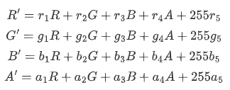<br>2. The ColorFilter type of **@ohos.graphics.drawing** can be used as an input parameter since API version 12.<br>**NOTE**<br>This parameter is not available for SVG images in API version 11 and earlier versions.<br>The DrawingColorfilter type can be used in atomic services since API version 12. For SVG sources, the effect only applies when the **stroke** property is set (regardless of the value).|
### draggable<sup>9+</sup>

draggable(value: boolean)

Specifies whether the image is draggable.

**Atomic service API**: This API can be used in atomic services since API version 11.

**System capability**: SystemCapability.ArkUI.ArkUI.Full

**Parameters**

| Name| Type   | Mandatory| Description                                                        |
| ------ | ------- | ---- | ------------------------------------------------------------ |
| value  | boolean | Yes  | Whether the image is draggable. The value **true** means that the image is draggable, in which case the bound long press gesture will not take effect.<br>Default value:<br>API version 9 and earlier: **false**<br> Since API version 10: **true**<br> To bind custom gestures to the component, set **draggable** to **false**. With the value **false**, drag-related events are not triggered.|

### enableAnalyzer<sup>11+</sup>

enableAnalyzer(enable: boolean)

Sets whether to enable the AI image analyzer, which supports subject recognition, text recognition, and object lookup.<!--RP3--><!--RP3End-->

This attribute cannot be used together with the [overlay](ts-universal-attributes-overlay.md) attribute. If they are set at the same time, the **CustomBuilder** attribute in **overlay** has no effect. This attribute depends on device capabilities.

Images to be analyzed must be static, non-vector images. That is, SVG and GIF images cannot be analyzed. [Pixel maps](../../apis-image-kit/arkts-apis-image-PixelMap.md) in [RGBA_8888](../../apis-image-kit/arkts-apis-image-e.md#pixelmapformat7) format can be passed in for analysis. For details, see [Example 5: Enabling the AI Image Analyzer](#example-5-enabling-the-ai-image-analyzer).

The placeholder images (specified by **alt**) cannot be analyzed. An image can be analyzed only when **objectRepeat** is set to **ImageRepeat.NoRepeat** and [obscured](ts-universal-attributes-obscured.md) is disabled.

Analysis is performed based on the complete original image. If the **clip**, **margin**, **borderRadius**, **position**, or **objectFit** attribute is set, the image is not displayed completely. If **renderMode** is used to apply a mask, analysis is still performed based on the complete original image. The **copyOption** attribute does not affect the AI image analyzer functionality.

This attribute does not take effect when the parameter type of the component is [AnimatedDrawableDescriptor](../js-apis-arkui-drawableDescriptor.md#animateddrawabledescriptor12).

> **NOTE**
>
> The ohos.permission.INTERNET permission must be declared.

**Atomic service API**: This API can be used in atomic services since API version 12.

**System capability**: SystemCapability.ArkUI.ArkUI.Full

**Parameters**

| Name| Type   | Mandatory| Description                                                        |
| ------ | ------- | ---- | ------------------------------------------------------------ |
| enable  | boolean | Yes  | Whether to enable the AI image analyzer.<br>Default value: **false**<br>**true**: Enable the AI image analyzer.<br>**false**: Disable the AI image analyzer.|

### resizable<sup>11+</sup>

resizable(value: ResizableOptions)

Sets the resizable image options. Resizing is effective for drag previews and placeholder images.

When [ResizableOptions](#resizableoptions11) is set to a valid value, neither **objectRepeat** nor **orientation** has effect.

When the sum of the values of **top** and **bottom** is greater than the source image height, or the sum of the values of **left** and **right** is greater than the source image width, the [ResizableOptions](#resizableoptions11) attribute does not take effect.

This attribute does not take effect when the parameter type of the component is [AnimatedDrawableDescriptor](../js-apis-arkui-drawableDescriptor.md#animateddrawabledescriptor12) or the image format is SVG.

**Atomic service API**: This API can be used in atomic services since API version 12.

**System capability**: SystemCapability.ArkUI.ArkUI.Full

**Parameters**

| Name| Type                                   | Mandatory| Description                            |
| ------ | --------------------------------------- | ---- | -------------------------------- |
| value  | [ResizableOptions](#resizableoptions11) | Yes  | Resizable image options.|

### privacySensitive<sup>12+</sup>

privacySensitive(supported: boolean)

Sets whether to secure sensitive information on widgets.

**Widget capability**: This API can be used in ArkTS widgets since API version 12.

**Atomic service API**: This API can be used in atomic services since API version 12.

**System capability**: SystemCapability.ArkUI.ArkUI.Full

**Parameters**

| Name   | Type   | Mandatory| Description                    |
| --------- | ------- | ---- | ------------------------ |
| supported | boolean | Yes  | Whether to secure sensitive information on widgets.<br>**false** (default): Do not secure sensitive information on widgets.<br>**true**: Secure sensitive information on widgets, obscuring the image with a semi-transparent background style in privacy mode.<br>**NOTE**<br>If this parameter is set to **null**, the image is not obscured.<br>Obscuring requires [widget framework support](./ts-universal-attributes-obscured.md).|

### dynamicRangeMode<sup>12+</sup>

dynamicRangeMode(value: DynamicRangeMode)

Sets the dynamic range of the image to be displayed. This attribute is not applicable to SVG images.

<!--RP1--><!--RP1End-->

**Atomic service API**: This API can be used in atomic services since API version 12.

**System capability**: SystemCapability.ArkUI.ArkUI.Full

**Parameters**

| Name| Type                                   | Mandatory| Description                            |
| ------ | --------------------------------------- | ---- | -------------------------------- |
| value  | [DynamicRangeMode](#dynamicrangemode12) | Yes  | Dynamic range of the image.<br>Default value: **DynamicRangeMode.STANDARD**.|

### orientation<sup>14+</sup>

orientation(orientation: ImageRotateOrientation)

Sets the display orientation of the image content.

**Atomic service API**: This API can be used in atomic services since API version 14.

**System capability**: SystemCapability.ArkUI.ArkUI.Full

**Parameters**

| Name| Type                                   | Mandatory| Description                            |
| ------ | --------------------------------------- | ---- | -------------------------------- |
| orientation  | [ImageRotateOrientation](#imagerotateorientation14) | Yes  | Display orientation of the image content.<br>GIF and SVG images are not supported.<br>For images containing rotation or flip information, use **ImageRotateOrientation.AUTO**.<br>Default value: **ImageRotateOrientation.UP**<br>When set to **undefined**, the value is treated as **ImageRotateOrientation.AUTO**.|

### hdrBrightness<sup>19+</sup>

hdrBrightness(brightness: number)

Sets the brightness of HDR images displayed by the component.

This attribute is not applicable to SVG images.

If this attribute and the [dynamicRangeMode](#dynamicrangemode12) attribute are both set, [dynamicRangeMode](#dynamicrangemode12) does not take effect.

**Atomic service API**: This API can be used in atomic services since API version 19.

**System capability**: SystemCapability.ArkUI.ArkUI.Full

**Parameters**

| Name  | Type   | Mandatory| Description                  |
| -------- | ------- | ---- | ---------------------- |
| brightness | number | Yes  | Brightness of HDR images displayed by the component. This API only takes effect for HDR image sources.<br>Default value: **1.0**.<br>Value range: [0.0, 1.0]. Values less than 0 or greater than 1.0 are treated as **1.0**. **0**: The image is displayed at SDR brightness.<br>**1**: The image is displayed at the highest allowed HDR brightness. |

## ImageContent<sup>12+</sup>

Defines the image content.

**Widget capability**: This API can be used in ArkTS widgets since API version 12.

**Atomic service API**: This API can be used in atomic services since API version 12.

**System capability**: SystemCapability.ArkUI.ArkUI.Full

| Name    | Value   | Description                   |
| ------ | ----- | -------------------------- |
| EMPTY   | 0  | Empty image.                  |

## ImageInterpolation

Interpolation effect of the image.

**Widget capability**: This API can be used in ArkTS widgets since API version 9.

**Atomic service API**: This API can be used in atomic services since API version 11.

**System capability**: SystemCapability.ArkUI.ArkUI.Full

| Name    | Value| Description                      |
| ------ | - | -------------------------- |
| None   | 0 | Nearest neighbor interpolation.                  |
| Low    | 1 | Bilinear interpolation.                    |
| Medium | 2 | MipMap interpolation.                    |
| High   | 3 | Cubic interpolation. This mode produces scaled images of the highest possible quality, but may require more image rendering time.|

## ImageRenderMode

Enumerates the rendering modes of images.

**Widget capability**: This API can be used in ArkTS widgets since API version 9.

**Atomic service API**: This API can be used in atomic services since API version 11.

**System capability**: SystemCapability.ArkUI.ArkUI.Full

| Name    | Value| Description          |
| -------- | - | -------------- |
| Original | 0 | Render image pixels as they are in the original source image.|
| Template | 1 | Render image pixels to create a monochrome template image.|

## ResizableOptions<sup>11+</sup>

Defines the resizable image options.

**Atomic service API**: This API can be used in atomic services since API version 12.

**System capability**: SystemCapability.ArkUI.ArkUI.Full

| Name| Type| Mandatory| Description|
| --------- |-----------|-----------|-----------|
| slice | [EdgeWidths](#edgewidths) |  No | Edge widths in different directions of a component.<br>**NOTE**<br>This parameter takes effect only when values of **bottom** and **right** are both greater than 0.<br> When a number is passed, the default unit is vp.|
| lattice<sup>12+</sup> | [DrawingLattice](#drawinglattice12) |  No | Lattice object, which is used to divide the image by lattice.<br>**NOTE**<br> A lattice object can be created through the **createImageLattice** API of the **@ohos.graphics.drawing** module. The lattices on both even columns and even rows are fixed.<br>This parameter does not take effect for the [backgroundImageResizable](ts-universal-attributes-background.md#backgroundimageresizable12) API.<br> When a number is passed, the default unit is px.|

## EdgeWidths

Edge widths in different directions of a component.

**Atomic service API**: This API can be used in atomic services since API version 11.

**System capability**: SystemCapability.ArkUI.ArkUI.Full

| Name| Type| Mandatory| Description|
| --------- |-----------|-----------|-----------|
|  top    |  [Length](ts-types.md#length)  |  No | Pixel value of the image that remains unchanged when the top side of the image is stretched.<br>Default value: **0**<br>Unit: vp|
|  right  |  [Length](ts-types.md#length)  |  No | Pixel value of the image that remains unchanged when the right side of the image is stretched.<br>Default value: **0**<br>Unit: vp|
|  bottom |  [Length](ts-types.md#length)  |  No | Pixel value of the image that remains unchanged when the bottom side of the image is stretched.<br>Default value: **0**<br>Unit: vp|
|  left   |  [Length](ts-types.md#length)  |  No | Pixel value of the image that remains unchanged when the left side of the image is stretched.<br>Default value: **0**<br>Unit: vp|

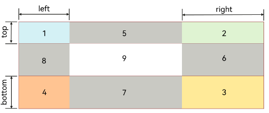

## DynamicRangeMode<sup>12+</sup>

Describes the dynamic range of the image to be displayed.

**Atomic service API**: This API can be used in atomic services since API version 12.

**System capability**: SystemCapability.ArkUI.ArkUI.Full

| Name    | Value   | Description                   |
| ------ | -------------------------- | -------------------------- |
| HIGH   | 0  | Unrestricted dynamic range, which allows for the maximum brightening of an image.             |
| CONSTRAINT | 1 | Restricted dynamic range, which brightens an image within certain constraints.         |
| STANDARD | 2 | Standard dynamic range, which does not brighten an image.        |

## ImageRotateOrientation<sup>14+</sup>

Describes the desired display orientation for image content.

**System capability**: SystemCapability.ArkUI.ArkUI.Full

| Name    | Value   | Description                   |
| ------ | -------------------------- | -------------------------- |
| AUTO | 0 | Use EXIF metadata for display orientation, with support for rotation and mirroring.<br>**Atomic service API**: This API can be used in atomic services since API version 14.<br>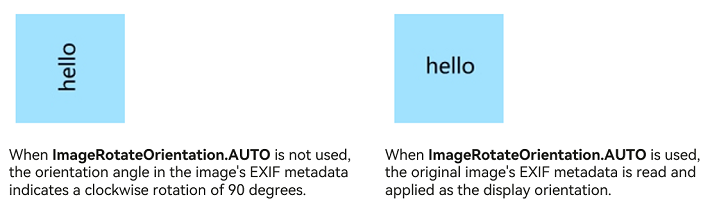 |
| UP | 1 | Display original pixel data without transformation.<br>**Atomic service API**: This API can be used in atomic services since API version 14.|
| RIGHT | 2 | Display the image after rotating it 90 degrees clockwise.<br>**Atomic service API**: This API can be used in atomic services since API version 14.<br>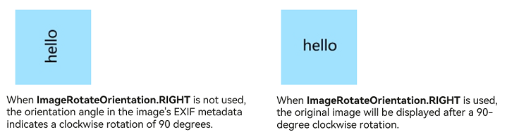 |
| DOWN | 3 | Display the image after rotating it 180 degrees clockwise.<br>**Atomic service API**: This API can be used in atomic services since API version 14.<br>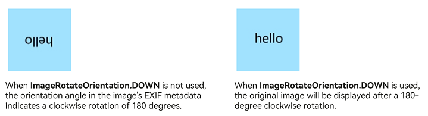 |
| LEFT | 4 | Display the image after rotating it 270 degrees clockwise.<br>**Atomic service API**: This API can be used in atomic services since API version 14.<br>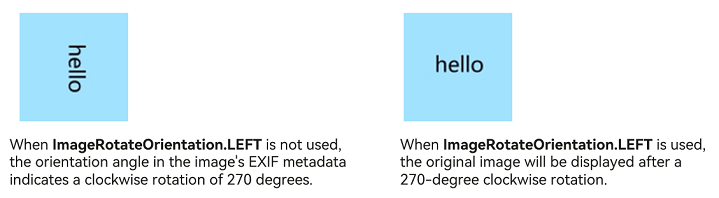 |
| UP_MIRRORED<sup>20+</sup> | 5 | Display the image after flipping it horizontally.<br>**Atomic service API**: This API can be used in atomic services since API version 20.<br>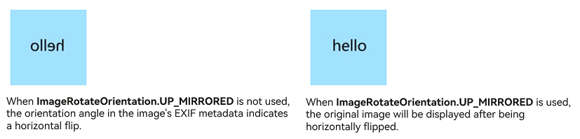 |
| RIGHT_MIRRORED<sup>20+</sup> | 6 | Display the image after flipping it horizontally and then rotating it 90 degrees clockwise.<br>**Atomic service API**: This API can be used in atomic services since API version 20.<br>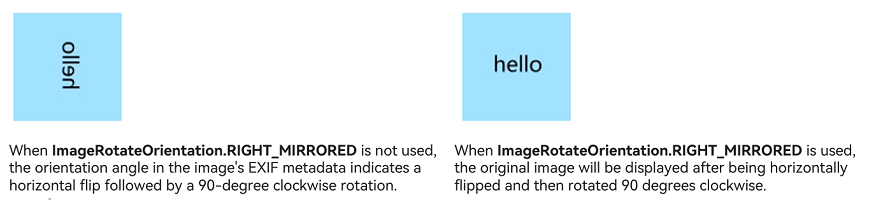 |
| DOWN_MIRRORED<sup>20+</sup> | 7 | Display the image after flipping it vertically.<br>**Atomic service API**: This API can be used in atomic services since API version 20.<br>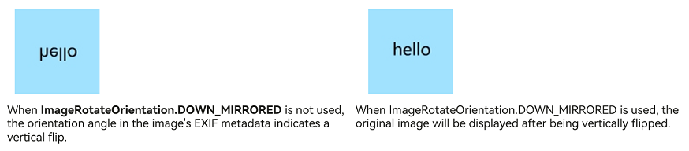 |
| LEFT_MIRRORED<sup>20+</sup> | 8 | Display the image after flipping it horizontally and then rotating it 270 degrees clockwise.<br>**Atomic service API**: This API can be used in atomic services since API version 20.<br>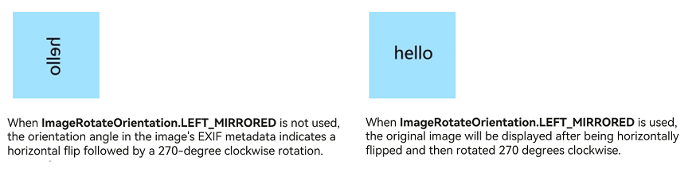 |

## ImageSourceSize<sup>18+</sup>

Provides the image decoding size.

**Widget capability**: This API can be used in ArkTS widgets since API version 18.

**Atomic service API**: This API can be used in atomic services since API version 18.

**System capability**: SystemCapability.ArkUI.ArkUI.Full

| Name| Type      | Mandatory| Description          |
| ------ | --------- | ---- | ------------- |
| width<sup>7+</sup>  | number | Yes  | Width of the decoded image.<br>Unit: vp.<br>**Widget capability**: This API can be used in ArkTS widgets since API version 9.<br>**Atomic service API**: This API can be used in atomic services since API version 11.|
| height<sup>7+</sup>  | number | Yes  | Height of the decoded image.<br>Unit: vp.<br>**Widget capability**: This API can be used in ArkTS widgets since API version 9.<br>**Atomic service API**: This API can be used in atomic services since API version 11.|

## DrawableDescriptor<sup>10+</sup>

type DrawableDescriptor = DrawableDescriptor

Represents a parameter object for the **Image** component.

**Atomic service API**: This API can be used in atomic services since API version 11.

**System capability**: SystemCapability.ArkUI.ArkUI.Full

| Type    | Description      |
| ------ | ---------- |
| [DrawableDescriptor](../js-apis-arkui-drawableDescriptor.md#drawabledescriptor)  | **DrawableDescriptor** object.|

## DrawingColorFilter<sup>12+</sup>

type DrawingColorFilter = ColorFilter

Represents a color filter object.

**Atomic service API**: This API can be used in atomic services since API version 12.

**System capability**: SystemCapability.ArkUI.ArkUI.Full

| Type    | Description      |
| ------ | ---------- |
| [ColorFilter](../../apis-arkgraphics2d/arkts-apis-graphics-drawing-ColorFilter.md)  | Color filter created.|

## DrawingLattice<sup>12+<sup>

type DrawingLattice = Lattice

Represents a matrix grid object that divides an image into a rectangular grid.

**Atomic service API**: This API can be used in atomic services since API version 12.

**System capability**: SystemCapability.ArkUI.ArkUI.Full

| Type    | Description      |
| ------ | ---------- |
| [Lattice](../../apis-arkgraphics2d/arkts-apis-graphics-drawing-Lattice.md) | Matrix grid object used to divide the image into a rectangular grid.|

## ImageMatrix<sup>15+</sup>

type ImageMatrix = Matrix4Transit

Represents the current matrix object.

**Atomic service API**: This API can be used in atomic services since API version 15.

**System capability**: SystemCapability.ArkUI.ArkUI.Full

| Type    | Description      |
| ------ | ---------- |
| [Matrix4Transit](../js-apis-matrix4.md#matrix4transit) | Current matrix object.|

## ColorContent<sup>15+</sup>

Defines the content for color filling.

**Atomic service API**: This API can be used in atomic services since API version 15.

**System capability**: SystemCapability.ArkUI.ArkUI.Full

| Name| Type      | Read-Only| Optional| Description          |
| ------ | --------- | --- | --- | ------------- |
| ORIGIN  | ColorContent | Yes| No| Resets the [fillColor](#fillcolor) API, effectively the same as not setting [fillColor](#fillcolor).|

## Events

In addition to the [universal events](ts-component-general-events.md), the following events are supported.

### onComplete

onComplete(callback: (event?: { width: number, height: number, componentWidth: number, componentHeight: number, loadingStatus: number,contentWidth: number, contentHeight: number, contentOffsetX: number, contentOffsetY: number }) =&gt; void)

Triggered when an image is successfully loaded or decoded. The size of the loaded image is returned.

This event is not triggered if the parameter type of the component is [AnimatedDrawableDescriptor](../js-apis-arkui-drawableDescriptor.md#animateddrawabledescriptor12).

**Widget capability**: This API can be used in ArkTS widgets since API version 9.

**Atomic service API**: This API can be used in atomic services since API version 11.

**System capability**: SystemCapability.ArkUI.ArkUI.Full

**Parameters**

| Name                      | Type  | Mandatory| Description                                                        |
| ---------------------------- | ------ | ---- | ------------------------------------------------------------ |
| width                        | number | Yes  | Width of the image.<br>Unit: pixel                                   |
| height                       | number | Yes  | Height of the image.<br>Unit: pixel                                   |
| componentWidth               | number | Yes  | Width of the component.<br>Unit: pixel                                   |
| componentHeight              | number | Yes  | Height of the component.<br>Unit: pixel                                   |
| loadingStatus                | number | Yes  | Loading status of the image.<br>**NOTE**<br>If the return value is **0**, the image is successfully loaded. If the return value is **1**, the image is successfully decoded.|
| contentWidth<sup>10+</sup>   | number | Yes  | Actual rendered width of the image.<br>Unit: pixel<br>**NOTE**<br>This parameter is valid only when the return value of **loadingStatus** is **1**.|
| contentHeight<sup>10+</sup>  | number | Yes  | Actual rendered height of the image.<br>Unit: pixel<br>**NOTE**<br>This parameter is valid only when the return value of **loadingStatus** is **1**.|
| contentOffsetX<sup>10+</sup> | number | Yes  | Offset of the rendered content relative to the component on the x-axis.<br>Unit: pixel<br>**NOTE**<br>This parameter is valid only when the return value of **loadingStatus** is **1**.|
| contentOffsetY<sup>10+</sup> | number | Yes  | Offset of the rendered content relative to the component on the y-axis<br>Unit: pixel<br>**NOTE**<br>This parameter is valid only when the return value of **loadingStatus** is **1**.|

### onError<sup>9+</sup>

onError(callback: ImageErrorCallback)

Triggered when an error occurs during image loading.

This event is not triggered if the parameter type of the component is [AnimatedDrawableDescriptor](../js-apis-arkui-drawableDescriptor.md#animateddrawabledescriptor12).

**Widget capability**: This API can be used in ArkTS widgets since API version 9.

**Atomic service API**: This API can be used in atomic services since API version 11.

**System capability**: SystemCapability.ArkUI.ArkUI.Full

**Parameters**

| Name  | Type                                      | Mandatory| Description                      |
| -------- | ------------------------------------------ | ---- | -------------------------- |
| callback | [ImageErrorCallback](#imageerrorcallback9) | Yes  | Callback triggered when an error occurs during image loading.<br>**NOTE**<br>Whenever possible, implement this callback to quickly identify failure reasons. For details, see the [ImageError error code reference](#imageerror9).|

### onFinish

onFinish(event: () =&gt; void)

Triggered when the animation playback in the loaded SVG image is complete. If the animation is an infinite loop, this callback is not triggered.

Only SVG images are supported. This event is not triggered if the parameter type of the component is [AnimatedDrawableDescriptor](../js-apis-arkui-drawableDescriptor.md#animateddrawabledescriptor12).

**Widget capability**: This API can be used in ArkTS widgets since API version 9.

**Atomic service API**: This API can be used in atomic services since API version 11.

**System capability**: SystemCapability.ArkUI.ArkUI.Full

## ImageErrorCallback<sup>9+</sup>

type ImageErrorCallback = (error: ImageError) => void

Represents the callback triggered when an error occurs during image loading.

The callback is not triggered if the parameter type of the component is [AnimatedDrawableDescriptor](../js-apis-arkui-drawableDescriptor.md#animateddrawabledescriptor12).

**Widget capability**: This API can be used in ArkTS widgets since API version 9.

**Atomic service API**: This API can be used in atomic services since API version 11.

**System capability**: SystemCapability.ArkUI.ArkUI.Full

| Name| Type                      | Mandatory| Description                              |
| ------ | -------------------------- | ---- | ---------------------------------- |
| error  | [ImageError](#imageerror9) | Yes  | Return object that triggers the callback for when an error occurs during image loading.|

## ImageError<sup>9+</sup>

Describes the return object that triggers the callback for when an error occurs during image loading.

This event is not triggered if the parameter type of the component is [AnimatedDrawableDescriptor](../js-apis-arkui-drawableDescriptor.md#animateddrawabledescriptor12).

**Widget capability**: This API can be used in ArkTS widgets since API version 9.

**System capability**: SystemCapability.ArkUI.ArkUI.Full

| Name         | Type  | Mandatory| Description                     |
| --------------- | ------ | ---- | ------------------------- |
| componentWidth  | number | Yes  | Width of the component.<br>Unit: pixel<br>**Widget capability**: This API can be used in ArkTS widgets since API version 9.<br>**Atomic service API**: This API can be used in atomic services since API version 11.|
| componentHeight | number | Yes  | Height of the component.<br>Unit: pixel<br>**Widget capability**: This API can be used in ArkTS widgets since API version 9.<br>**Atomic service API**: This API can be used in atomic services since API version 11.|
| message<sup>10+</sup>         | string | Yes  | Error information.<br>**Widget capability**: This API can be used in ArkTS widgets since API version 10.<br>**Atomic service API**: This API can be used in atomic services since API version 11.|
| error<sup>20+</sup>         | [BusinessError\<void>](#businesserror20) | No  | Error information returned when an error occurs during image loading, where **code** represents the error code and **message** indicates the error message. For details, see the **ImageError** error code reference below.<br>Default value: **{ code : -1, message : "" }**.<br>**Widget capability**: This API can be used in ArkTS widgets since API version 20.<br>**Atomic service API**: This API can be used in atomic services since API version 20.|

## BusinessError<sup>20+</sup>

type BusinessError\<T> = BusinessError\<T>

Represents the error information returned when an error occurs during image loading.

**Widget capability**: This API can be used in ArkTS widgets since API version 20.

**Atomic service API**: This API can be used in atomic services since API version 20.

**System capability**: SystemCapability.ArkUI.ArkUI.Full

| Type | Description  |
| ---- | ------ |
| [BusinessError\<T>](../../apis-basic-services-kit/js-apis-base.md#businesserror) | Error information returned when an error occurs during image loading.|

The table below describes the **ImageError** error codes. The **error** property of **ImageError** contains error details with **code** and **message** fields, representing the error code and error message, respectively.

| ID | Error Message                      | Stage of Occurrence| Image Type|
| --------  | ----------------------------   | --------- | ------- |
| 101000    | unknown source type.           | Data loading| Unknown|
| 102010    | sync http task of uri cancelled. | Data loading| Network file|
| 102011    | sync http task of uri failed.  | Data loading| Network file|
| 102012    | async http task of uri cancelled. | Data loading| Network file|
| 102013    | async http task of uri failed. | Data loading| Network file|
| 102030    | wrong code format.             | Data loading| Base64 string file|
| 102031    | decode base64 image failed.    | Data loading| Base64 string file|
| 102050    | path is too long.              | Data loading| Base64 string file|
| 102051    | read data failed.              | Data loading| Sandbox file|
| 102070    | get image data by name failed. | Data loading| Sandbox file|
| 102071    | get image data by id failed.   | Data loading| Resource file|
| 102072    | uri is invalid.                | Data loading| Resource file|
| 102090    | uri is invalid.                | Data loading| In-package file|
| 102091    | get asset failed.              | Data loading| In-package file|
| 102110    | open file failed.              | Data loading| Media library file|
| 102111    | get file stat failed.          | Data loading| Media library file|
| 102112    | read file failed.              | Data loading| Media library file|
| 102130    | decoded data is empty.         | Data loading| Media library thumbnail|
| 102131    | load shared memory image data timeout. | Data loading| Shared memory file|
| 103100    | make svg dom failed.           | Data loading| Vector graphics file|
| 103200    | image data size is invalid.    | Data loading| Bitmap file|
| 111000    | image source create failed.    | Data decoding| Bitmap file|
| 111001    | pixelmap create failed.        | Data decoding| Bitmap file|

## Example

### Example 1: Loading Images of Basic Types

This example demonstrates how to load images of basic types, such as PNG, GIF, SVG, and JPG, by passing in [Resource](ts-types.md#resource) resources.

```ts
@Entry
@Component
struct ImageExample1 {
  build() {
    Column() {
      Flex({ direction: FlexDirection.Column, alignItems: ItemAlign.Start }) {
        Row() {
          // Load a PNG image.
          Image($r('app.media.ic_camera_master_ai_leaf'))
            .width(110).height(110).margin(15)
            .overlay('png', { align: Alignment.Bottom, offset: { x: 0, y: 20 } })
          // Load a GIF image.
          Image($r('app.media.loading'))
            .width(110).height(110).margin(15)
            .overlay('gif', { align: Alignment.Bottom, offset: { x: 0, y: 20 } })
        }
        Row() {
          // Load an SVG image.
          Image($r('app.media.ic_camera_master_ai_clouded'))
            .width(110).height(110).margin(15)
            .overlay('svg', { align: Alignment.Bottom, offset: { x: 0, y: 20 } })
          // Load a JPG image.
          Image($r('app.media.ic_public_favor_filled'))
            .width(110).height(110).margin(15)
            .overlay('jpg', { align: Alignment.Bottom, offset: { x: 0, y: 20 } })
        }
      }
    }.height(320).width(360).padding({ right: 10, top: 10 })
  }
}
```

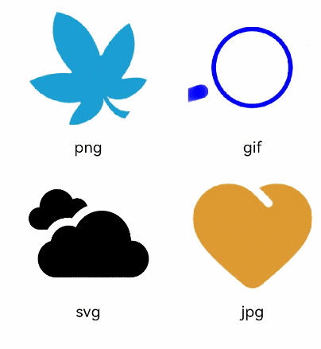

### Example 2: Downloading and Displaying Static Online Images

The default timeout is 5 minutes for loading online images. When using an online image, you are advised to use **alt** to configure a placeholder image displayed during loading. You can use [HTTP](../../../network/http-request.md) to send a network request, and then decode the returned data into a **PixelMap** object for the **Image** component. Note that a GIF image loaded into a **PixelMap** object will be displayed as a static image. For details about image development, see [Introduction to Image Kit](../../../media/image/image-overview.md).

The **ohos.permission.INTERNET** permission is required for using online images. For details about how to apply for a permission, see [Declaring Permissions](../../../security/AccessToken/declare-permissions.md).

```ts
import { http } from '@kit.NetworkKit';
import { BusinessError } from '@kit.BasicServicesKit';
import { image } from '@kit.ImageKit';

@Entry
@Component
struct ImageExample2 {
  @State pixelMapImg: PixelMap | undefined = undefined;

  aboutToAppear() {
    this.requestImageUrl('https://www.example.com/xxx.png'); // Enter a specific online image URL.
  }

  requestImageUrl(url: string) {
    http.createHttp().request(url, (error: BusinessError, data: http.HttpResponse)=> {
      if (error) {
        console.error(`request image failed: url: ${url}, code: ${error.code}, message: ${error.message}`);
      } else {
        let imgData: ArrayBuffer = data.result as ArrayBuffer;
        console.info(`request image success, size: ${imgData.byteLength}`);
        let imgSource: image.ImageSource = image.createImageSource(imgData);
        class sizeTmp {
          height: number = 100;
          width: number = 100;
        }
        let options: Record<string, number | boolean | sizeTmp> = {
          'alphaType': 0,
          'editable': false,
          'pixelFormat': 3,
          'scaleMode': 1,
          'size': { height: 100, width: 100 }
        }
        imgSource.createPixelMap(options).then((pixelMap: PixelMap) => {
          console.error('image createPixelMap success');
          this.pixelMapImg = pixelMap;
        })
        imgSource.release()
      }
    })
  }

  build() {
    Column() {
      Image(this.pixelMapImg)
        .alt($r('app.media.img'))
        .objectFit(ImageFit.None)
        .width('100%')
        .height('100%')
    }
  }
}
```


### Example 3: Downloading and Displaying Online GIF Images

This example shows how to use the [cacheDownload.download](../../apis-basic-services-kit/js-apis-request-cacheDownload.md#cachedownloaddownload) API to download online GIF images.

The **ohos.permission.INTERNET** permission is required for using online images. For details about how to apply for a permission, see [Declaring Permissions](../../../security/AccessToken/declare-permissions.md).

```ts
import { cacheDownload } from '@kit.BasicServicesKit';

@Entry
@Component
struct Index {
  @State src: string = 'https://www.example.com/xxx.gif'; // Enter a specific online image URL.

  async aboutToAppear(): Promise<void> {
    // Provide configuration options for the download-and-cache task.
    let options: cacheDownload.CacheDownloadOptions = {};
    try {
      // Download the resource. If the download is successful, the resource will be cached to the specified file in the application memory or sandbox directory.
      cacheDownload.download(this.src, options);
      console.error(`Resource downloaded successfully. `);
    } catch (err) {
      console.error(`Failed to download the resource. err: ${JSON.stringify(err)}`);
    }
  }

  build() {
    Column() {
      // If src specifies an online image that has been successfully downloaded and cached, the image will be displayed without requiring re-downloading.
      Image(this.src)
        .width(100)
        .height(100)
        .objectFit(ImageFit.Cover)
        .borderWidth(1)
    }
    .height('100%')
    .width('100%')
  }
}
```

### Example 4: Adding Events to an Image

This example demonstrates how to add the [onClick](ts-universal-events-click.md#onclick) and [onFinish](#onfinish) events to an image.

```ts
@Entry
@Component
struct ImageExample3 {
  private imageOne: Resource = $r('app.media.earth');
  private imageTwo: Resource = $r('app.media.star');
  private imageThree: Resource = $r('app.media.moveStar');
  @State src: Resource = this.imageOne;
  @State src2: Resource = this.imageThree;
  build(){
    Column(){
      // Add a click event so that a specific image is loaded upon clicking.
      Image(this.src)
        .width(100)
        .height(100)
        .onClick(() => {
          this.src = this.imageTwo;
        })

      // When the image to be loaded is in SVG format:
      Image(this.src2)
        .width(100)
        .height(100)
        .onFinish(() => {
          // Load another image when the SVG image has finished its animation.
          this.src2 = this.imageOne;
        })
    }.width('100%').height('100%')
  }
}
```


### Example 5: Enabling the AI Image Analyzer
<!--RP2-->
This example shows how to enable the AI image analyzer using the [enableAnalyzer](#enableanalyzer11) API.

```ts
import { image } from '@kit.ImageKit';

@Entry
@Component
struct ImageExample4 {
  @State imagePixelMap: image.PixelMap | undefined = undefined;
  private aiController: ImageAnalyzerController = new ImageAnalyzerController();
  private options: ImageAIOptions = {
    types: [ImageAnalyzerType.SUBJECT, ImageAnalyzerType.TEXT],
    aiController: this.aiController
  };

  async aboutToAppear() {
    this.imagePixelMap = await this.getPixmapFromMedia($r('app.media.app_icon'));
  }

  build() {
    Column() {
      Image(this.imagePixelMap, this.options)
        .enableAnalyzer(true)
        .width(200)
        .height(200)
        .margin({bottom:10})
      Button('getTypes')
        .width(80)
        .height(80)
        .onClick(() => {
          this.aiController.getImageAnalyzerSupportTypes();
        })
    }
  }
  private async getPixmapFromMedia(resource: Resource) {
    let unit8Array = await this.getUIContext().getHostContext()?.resourceManager?.getMediaContent({
      bundleName: resource.bundleName,
      moduleName: resource.moduleName,
      id: resource.id
    });
    let imageSource = image.createImageSource(unit8Array?.buffer.slice(0, unit8Array.buffer.byteLength));
    let createPixelMap: image.PixelMap = await imageSource.createPixelMap({
      desiredPixelFormat: image.PixelMapFormat.RGBA_8888
    });
    await imageSource.release();
    return createPixelMap;
  }
}
```


<!--RP2End-->
### Example 6: Stretching an Image Using slice

This example demonstrates how to stretch an image in different directions using the **slice** option of the [resizable](#resizable11) attribute.

```ts
@Entry
@Component
struct Index {
  @State top: number = 10;
  @State bottom: number = 10;
  @State left: number = 10;
  @State right: number = 10;

  build() {
    Column({ space: 5 }) {
      // Original image effect
      Image($r("app.media.landscape"))
        .width(200).height(200)
        .border({ width: 2, color: Color.Pink })
        .objectFit(ImageFit.Contain)

      // Set the resizable attribute to stretch the image in different directions.
      Image($r("app.media.landscape"))
        .resizable({
          slice: {
            // When a number is passed in, it uses the default vp unit, which is parsed into different px sizes on different devices. Choose the unit based on your needs.
            left: `${this.left}px`,
            right: `${this.right}px`,
            top: `${this.top}px`,
            bottom: `${this.bottom}px`
          }
        })
        .width(200)
        .height(200)
        .border({ width: 2, color: Color.Pink })
        .objectFit(ImageFit.Contain)

      Row() {
        Button("add top to " + this.top).fontSize(10)
          .onClick(() => {
            this.top += 10;
          })
        Button("add bottom to " + this.bottom).fontSize(10)
          .onClick(() => {
            this.bottom += 10;
          })
      }

      Row() {
        Button("add left to " + this.left).fontSize(10)
          .onClick(() => {
            this.left += 10;
          })
        Button("add right to " + this.right).fontSize(10)
          .onClick(() => {
            this.right += 10;
          })
      }

    }
    .justifyContent(FlexAlign.Start).width('100%').height('100%')
  }
}
```


### Example 7: Stretching an Image Using lattice

This example demonstrates how to stretch an image using the **lattice** option of the [resizable](#resizable11) attribute with a rectangular grid object.

```ts
import { drawing } from '@kit.ArkGraphics2D';

@Entry
@Component
struct drawingLatticeTest {
  private xDivs: Array<number> = [1, 2, 200];
  private yDivs: Array<number> = [1, 2, 200];
  private fXCount: number = 3;
  private fYCount: number = 3;
  private drawingLatticeFirst: DrawingLattice =
    drawing.Lattice.createImageLattice(this.xDivs, this.yDivs, this.fXCount, this.fYCount);

  build() {
    Scroll() {
      Column({ space: 10 }) {
        Text('Original Image').fontSize(20).fontWeight(700)
        Column({ space: 10 }) {
          Image($r('app.media.mountain'))
            .width(260).height(260)
        }.width('100%')

        Text('Resize by lattice').fontSize(20).fontWeight(700)
        Column({ space: 10 }) {
          Image($r('app.media.mountain'))
            .objectRepeat(ImageRepeat.X)
            .width(260)
            .height(260)
            .resizable({
              lattice: this.drawingLatticeFirst
            })
        }.width('100%')
      }.width('100%')
    }
  }
}
```


### Example 8: Playing a PixelMap Array Animation

This example demonstrates how to play an animation using a **PixelMap** array through an [AnimatedDrawableDescriptor](../js-apis-arkui-drawableDescriptor.md#animateddrawabledescriptor12) object.

```ts
import {AnimationOptions, AnimatedDrawableDescriptor} from '@kit.ArkUI';
import { image } from '@kit.ImageKit';

@Entry
@Component
struct ImageExample {
  pixelMaps: PixelMap[] = [];
  options: AnimationOptions = { iterations: 1 };
  @State animated: AnimatedDrawableDescriptor | undefined = undefined;

  async aboutToAppear() {
    this.pixelMaps = await this.getPixelMaps();
    this.animated = new AnimatedDrawableDescriptor(this.pixelMaps, this.options);
  }

  build() {
    Column() {
      Row() {
        Image(this.animated)
          .width('500px').height('500px')
          .onFinish(() => {
            console.info('finish');
          })
      }.height('50%')
      Row() {
        Button('once').width(100).padding(5).onClick(() => {
          this.options = { iterations: 1 };
          this.animated = new AnimatedDrawableDescriptor(this.pixelMaps, this.options);
        }).margin(5)
        Button('infinite').width(100).padding(5).onClick(() => {
          this.options = { iterations: -1 };
          this.animated = new AnimatedDrawableDescriptor(this.pixelMaps, this.options);
        }).margin(5)
      }
    }.width('50%')
  }

  private async getPixmapListFromMedia(resource: Resource) {
    let unit8Array = await this.getUIContext().getHostContext()?.resourceManager?.getMediaContent({
      bundleName: resource.bundleName,
      moduleName: resource.moduleName,
      id: resource.id
    });
    let imageSource = image.createImageSource(unit8Array?.buffer.slice(0, unit8Array.buffer.byteLength));
    let createPixelMap: image.PixelMap[] = await imageSource.createPixelMapList({
      desiredPixelFormat: image.PixelMapFormat.RGBA_8888
    });
    await imageSource.release();
    return createPixelMap;
  }

  private async getPixmapFromMedia(resource: Resource) {
    let unit8Array = await this.getUIContext().getHostContext()?.resourceManager?.getMediaContent({
      bundleName: resource.bundleName,
      moduleName: resource.moduleName,
      id: resource.id
    });
    let imageSource = image.createImageSource(unit8Array?.buffer.slice(0, unit8Array.buffer.byteLength));
    let createPixelMap: image.PixelMap = await imageSource.createPixelMap({
      desiredPixelFormat: image.PixelMapFormat.RGBA_8888
    });
    await imageSource.release();
    return createPixelMap;
  }

  private async getPixelMaps() {
    let myPixelMaps:PixelMap[] = await this.getPixmapListFromMedia($r('app.media.mountain')); // Add images.
    myPixelMaps.push(await this.getPixmapFromMedia($r('app.media.sky')));
    myPixelMaps.push(await this.getPixmapFromMedia($r('app.media.clouds')));
    myPixelMaps.push(await this.getPixmapFromMedia($r('app.media.landscape')));
    return myPixelMaps;
  }
}
```

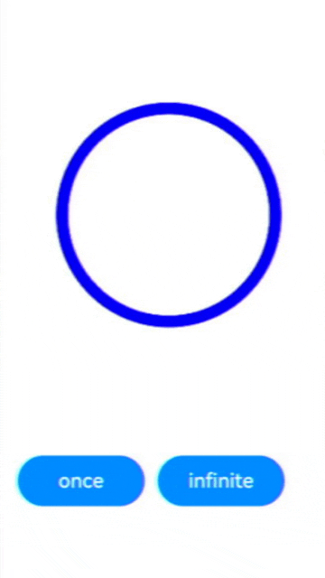

### Example 9: Setting a Color Filter for an Image

This example shows how to set a color filter for an image using the [colorFilter](#colorfilter9) attribute.

```ts
import { drawing, common2D } from '@kit.ArkGraphics2D';

@Entry
@Component
struct ImageExample3 {
  private imageOne: Resource = $r('app.media.1');
  private imageTwo: Resource = $r('app.media.2');
  @State src: Resource = this.imageOne;
  @State src2: Resource = this.imageTwo;
  private colorFilterMatrix: number[] = [1, 0, 1, 0, 1, 0, 0, 0, 1, 0, 1, 0, 1, 0, 0, 0, 1, 0, 1, 0];
  private color: common2D.Color = {
    alpha: 255,
    red: 255,
    green: 0,
    blue: 0
  };
  @State drawingColorFilterFirst: ColorFilter | undefined = undefined;
  @State drawingColorFilterSecond: ColorFilter | undefined = undefined;
  @State drawingColorFilterThird: ColorFilter | undefined = undefined;

  build() {
    Column() {
      Image(this.src)
        .width(100)
        .height(100)
        .colorFilter(this.drawingColorFilterFirst)
        .onClick(()=>{
          this.drawingColorFilterFirst =
            drawing.ColorFilter.createBlendModeColorFilter(this.color, drawing.BlendMode.SRC_IN);
        })

      Image(this.src2)
        .width(100)
        .height(100)
        .colorFilter(this.drawingColorFilterSecond)
        .onClick(()=>{
          this.drawingColorFilterSecond = new ColorFilter(this.colorFilterMatrix);
        })

      // When the image to be loaded is in SVG format:
      Image($r('app.media.test_self'))
        .width(110)
        .height(110)
        .margin(15)
        .colorFilter(this.drawingColorFilterThird)
        .onClick(()=>{
          this.drawingColorFilterThird =
            drawing.ColorFilter.createBlendModeColorFilter(this.color, drawing.BlendMode.SRC_IN);
        })
    }
  }
}
```


### Example 10: Setting the Fill Effect for an Image

This example shows how to use the [objectFit](#objectfit) attribute to specify how an image is resized to fit its container.

```ts
@Entry
@Component
struct ImageExample{
  build() {
    Column() {
      Flex({ direction: FlexDirection.Column, alignItems: ItemAlign.Start }) {
        Row() {
          // Load a PNG image.
          Image($r('app.media.sky'))
            .width(110).height(110).margin(15)
            .overlay('png', { align: Alignment.Bottom, offset: { x: 0, y: 20 } })
            .border({ width: 2, color: Color.Pink })
            .objectFit(ImageFit.TOP_START)
          // Load a GIF image.
          Image($r('app.media.loading'))
            .width(110).height(110).margin(15)
            .overlay('gif', { align: Alignment.Bottom, offset: { x: 0, y: 20 } })
            .border({ width: 2, color: Color.Pink })
            .objectFit(ImageFit.BOTTOM_START)
        }
        Row() {
          // Load an SVG image.
          Image($r('app.media.svg'))
            .width(110).height(110).margin(15)
            .overlay('svg', { align: Alignment.Bottom, offset: { x: 0, y: 20 } })
            .border({ width: 2, color: Color.Pink })
            .objectFit(ImageFit.TOP_END)
          // Load a JPG image.
          Image($r('app.media.jpg'))
            .width(110).height(110).margin(15)
            .overlay('jpg', { align: Alignment.Bottom, offset: { x: 0, y: 20 } })
            .border({ width: 2, color: Color.Pink })
            .objectFit(ImageFit.CENTER)
        }
      }
    }.height(320).width(360).padding({ right: 10, top: 10 })
  }
}
```


### Example 11: Switching Between Different Types of Images

This example demonstrates the effect of displaying images with [ResourceStr](ts-types.md#resourcestr) and [ImageContent](#imagecontent12) as types of data sources.

```ts
@Entry
@Component
struct ImageContentExample {
  @State imageSrcIndex: number = 0;
  @State imageSrcList: (ResourceStr | ImageContent)[] = [$r('app.media.app_icon'), ImageContent.EMPTY];

  build() {
    Column({ space: 10 }) {
      Image(this.imageSrcList[this.imageSrcIndex])
        .width(100)
        .height(100)
      Button('Change Image src')
        .padding(20)
        .onClick(() => {
          this.imageSrcIndex = (this.imageSrcIndex + 1) % this.imageSrcList.length;
        })
    }.width('100%')
    .padding(20)
  }
}
```


### Example 12: Securing Sensitive Information

This example shows how to secure sensitive information on widgets using the [privacySensitive](#privacysensitive12) attribute. The display requires widget framework support.

```ts
@Entry
@Component
struct ImageExample {
  build() {
    Column({ space: 10 }) {
      Image($r('app.media.startIcon'))
        .width(50)
        .height(50)
        .margin({top :30})
        .privacySensitive(true)
    }
    .alignItems(HorizontalAlign.Center)
    .width('100%')
  }
}
```


### Example 13: Setting the Scan Effect for an Image

This example shows how to enable the scan effect for an image using [linearGradient](./ts-basic-components-datapanel.md#lineargradient10) and [animateTo()](./ts-explicit-animation.md).

```ts
import { curves } from '@kit.ArkUI';

@Entry
@Component
struct ImageExample11 {
  private curve = curves.cubicBezierCurve(0.33, 0, 0.67, 1);
  @State moveImg: string[] = ['imageScanEffect'];
  @State moveImgVisible: Visibility = Visibility.Visible;
  @State durationTime: number = 1500;
  @State iterationsTimes: number = -1;
  @State private opacityValue: number = 0.5;
  @State imageWidth: number = 450;
  @State visible: Visibility = Visibility.Hidden;
  @State stackBackgroundColor: string = '#E1E4E9';
  @State linePositionX: number = 0 - this.imageWidth;
  @State linePositionY: number = 0;
  @State imgResource: Resource | undefined = undefined;

  startupAnimate() {
    this.moveImg.pop();
    this.moveImg.push('imageScanEffect');
    setTimeout(() => {
      this.imgResource = $r('app.media.img');
    }, 3000);
    this.getUIContext()?.animateTo({
      duration: this.durationTime,
      curve: this.curve,
      tempo: 1,
      iterations: this.iterationsTimes,
      delay: 0
    }, () => {
      this.linePositionX = this.imageWidth;
    })
  }

  build() {
    Column() {
      Row() {
        Stack() {
          Image(this.imgResource)
            .width(this.imageWidth)
            .height(200)
            .objectFit(ImageFit.Contain)
            .visibility(this.visible)
            .onComplete(() => {
              this.visible = Visibility.Visible;
              this.moveImg.pop();
            })
            .onError(() =>{
              setTimeout(() => {
                this.visible = Visibility.Visible;
                this.moveImg.pop();
              }, 2600)
            })
          ForEach(this.moveImg, (item: string) => {
            Row()
              .width(this.imageWidth)
              .height(200)
              .visibility(this.moveImgVisible)
              .position({ x: this.linePositionX, y: this.linePositionY })
              .linearGradient({
                direction: GradientDirection.Right,
                repeating: false,
                colors: [[0xE1E4E9, 0], [0xFFFFFF, 0.75], [0xE1E4E9, 1]]
              })
              .opacity(this.opacityValue)
          })
        }
        .backgroundColor(this.visible ? this.stackBackgroundColor : undefined)
        .margin({top: 20, left: 20, right: 20})
        .borderRadius(20)
        .clip(true)
        .onAppear(() => {
          this.startupAnimate();
        })
      }
    }
  }
}
```


### Example 14: Adding Transform Effects to an Image

This example demonstrates how to apply rotation and translation effects to an image using the [imageMatrix](#imagematrix15) and [objectFit](#objectfit) attributes.

```ts
import { matrix4 } from '@kit.ArkUI';

@Entry
@Component
struct Test {
  private matrix1 = matrix4.identity()
    .translate({ x: -400, y: -750 })
    .scale({ x: 0.5, y: 0.5 })
    .rotate({
      x: 2,
      y: 0.5,
      z: 3,
      centerX: 10,
      centerY: 10,
      angle: -10
    })

  build() {
    Row() {
      Column({ space: 50 }) {
        Column({ space: 5 }) {
          Image($r('app.media.example'))
            .border({ width:2, color: Color.Black })
            .objectFit(ImageFit.Contain)
            .width(150)
            .height(150)
          Text('No transformation')
            .fontSize('25px')
        }
        Column({ space: 5 }) {
          Image($r('app.media.example'))
            .border({ width:2, color: Color.Black })
            .objectFit(ImageFit.None)
            .translate({ x: 10, y: 10 })
            .scale({ x: 0.5, y: 0.5 })
            .width(100)
            .height(100)
          Text('Direct transformation on the image, with the upper left corner of the image source displayed by default')
            .fontSize('25px')
        }
        Column({ space: 5 }) {
          Image($r('app.media.example'))
            .objectFit(ImageFit.MATRIX)
            .imageMatrix(this.matrix1)
            .border({ width:2, color: Color.Black })
            .width(150)
            .height(150)
          Text('Transformation using imageMatrix to adjust the source position for optimal display')
            .fontSize('25px')
        }
      }
      .width('100%')
    }
  }
}
```

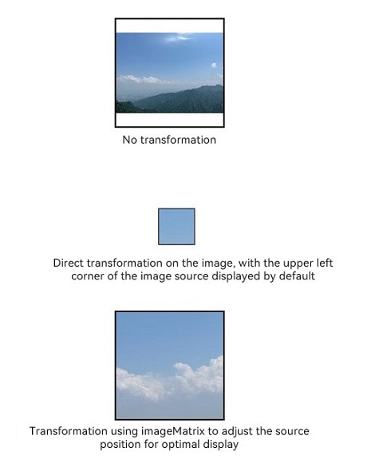

### Example 15: Setting the Image Decoding Size Using sourceSize

This example uses the [sourceSize](ts-basic-components-image.md#sourcesize) API to customize the image decoding size.

```ts
@Entry
@Component
struct Index {
  @State borderRadiusValue: number = 10;
  build() {
    Column() {
      Image($r('app.media.sky'))
        .sourceSize({width:1393, height:1080})
        .height(300)
        .width(300)
        .objectFit(ImageFit.Contain)
        .borderWidth(1)
      Image($r('app.media.sky'))
        .sourceSize({width:13, height:10})
        .height(300)
        .width(300)
        .objectFit(ImageFit.Contain)
        .borderWidth(1)
    }
    .height('100%')
    .width('100%')
  }
}
```

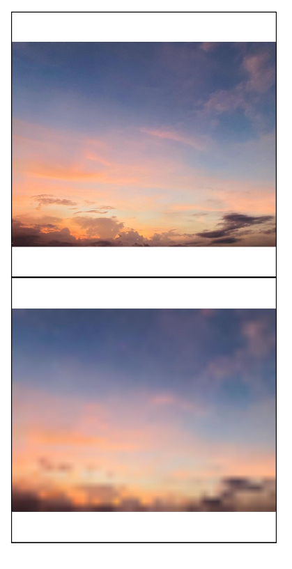

### Example 16: Setting the Image Rendering Mode Using renderMode

This example uses the [renderMode](ts-basic-components-image.md#rendermode) API to set the image rendering mode to grayscale.

```ts
@Entry
@Component
struct Index {
  @State borderRadiusValue: number = 10;
  build() {
    Column() {
      Image($r('app.media.sky'))
        .renderMode(ImageRenderMode.Template)
        .height(300)
        .width(300)
        .objectFit(ImageFit.Contain)
        .borderWidth(1)
    }
    .height('100%')
    .width('100%')
  }
}
```


### Example 17: Setting the Image Repeat Pattern Using objectRepeat

This example uses the [objectRepeat](ts-basic-components-image.md#objectrepeat) API to repeat the image along the vertical axis.

```ts
@Entry
@Component
struct Index {
  @State borderRadiusValue: number = 10;
  build() {
    Column() {
      Image($r('app.media.sky'))
        .objectRepeat(ImageRepeat.Y)
        .height('90%')
        .width('90%')
        .objectFit(ImageFit.Contain)
        .borderWidth(1)
    }
    .height('100%')
    .width('100%')
  }
}
```

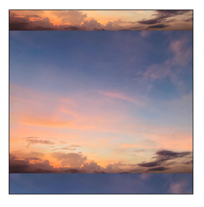

### Example 18: Setting the Fill Color for an SVG Image

This example shows how to set different fill colors for an SVG image using the [fillColor](#fillcolor15) attribute.

```ts
@Entry
@Component
struct Index {
  build() {
    Column() {
      Text('FillColor not set')
      Image($r('app.media.svgExample'))
        .height(100)
        .width(100)
        .objectFit(ImageFit.Contain)
        .borderWidth(1)
      Text('fillColor set to ColorContent.ORIGIN')
      Image($r('app.media.svgExample'))
        .height(100)
        .width(100)
        .objectFit(ImageFit.Contain)
        .borderWidth(1)
        .fillColor(ColorContent.ORIGIN)
      Text('fillColor set to Color.Blue')
      Image($r('app.media.svgExample'))
        .height(100)
        .width(100)
        .objectFit(ImageFit.Contain)
        .borderWidth(1)
        .fillColor(Color.Blue)
      Text('fillColor set to undefined')
      Image($r('app.media.svgExample'))
        .height(100)
        .width(100)
        .objectFit(ImageFit.Contain)
        .borderWidth(1)
        .fillColor(undefined)
    }
    .height('100%')
    .width('100%')
  }
}
```

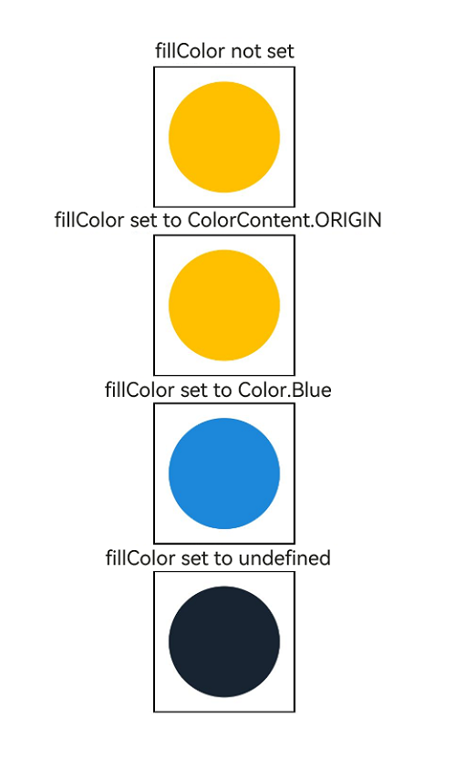

### Example 19: Adjusting HDR Image Brightness

This example demonstrates how to adjust the HDR image brightness using the [hdrBrightness](#hdrbrightness19) attribute, changing the value from **0** to **1**.

```ts
import { image } from '@kit.ImageKit';

const TAG = 'AceImage';

@Entry
@Component
struct Index {
  @State imgUrl: string = 'img_1';
  @State bright: number = 0; // The default brightness is 0.
  aboutToAppear(): void {
    // Obtain media resources from the resource manager.
    let img = this.getUIContext().getHostContext()?.resourceManager.getMediaByNameSync(this.imgUrl);
    // Create an image source and obtain image information.
    let imageSource = image.createImageSource(img?.buffer.slice(0));
    let imageInfo = imageSource.getImageInfoSync();
    // Check whether the image information is obtained successfully.
    if (imageInfo == undefined) {
      console.error(TAG, 'Failed to obtain the image information.');
    } else {
      // After the image information is obtained successfully, print the HDR status.
      console.info(TAG, 'imageInfo.isHdr:' + imageInfo.isHdr);
    }
  }

  build() {
    Column() {
      Image($r('app.media.img_1')).width('50%')
        .height('auto')
        .margin({top:160})
        .hdrBrightness(this.bright) // Set the HDR image brightness controlled by the bright state.
      Button('Adjust Brightness 0 -> 1')
        .onClick(() => {
          // Animation transition for brightness changes
          this.getUIContext()?.animateTo({}, () => {
            this.bright = 1.0 - this.bright;
          });
        })
    }
    .height('100%')
    .width('100%')
  }
}
```

### Example 20: Setting Whether the Image Follows the System Language Direction

This example shows how to use the [matchTextDirection](#matchtextdirection) API to set whether the image should be mirrored when the device system language is set to Uyghur.

```ts
@Entry
@Component
struct Index {
  build() {
    Column() {
      Flex({ direction: FlexDirection.Column, alignItems: ItemAlign.Start }) {
        Row() {
          // The image does not follow the system language direction.
          Image($r('app.media.ocean'))
            .width(110).height(110).margin(15)
            .matchTextDirection(false)
        }
        Row() {
          // The image follows the system language direction.
          Image($r('app.media.ocean'))
            .width(110).height(110).margin(15)
            .matchTextDirection(true)
        }
      }
    }.height(320).width(360).padding({ right: 10, top: 10 })
  }
}
```


### Example 21: Setting Image Display Orientation

This example shows how to configure different image display orientations using the [orientation](#orientation14) attribute.

```ts
@Entry
@Component
struct OrientationExample {
  build() {
    Column() {
      Row({ space: 25 }) {
        Column() {
          Text('AUTO')
          Image($r('app.media.hello'))
            .width(125).height(125)
            .orientation(ImageRotateOrientation.AUTO)
        }

        Column() {
          Text('UP')
          Image($r('app.media.hello'))
            .width(125).height(125)
            .orientation(ImageRotateOrientation.UP)
        }

        Column() {
          Text('RIGHT')
          Image($r('app.media.hello'))
            .width(125).height(125)
            .orientation(ImageRotateOrientation.RIGHT)
        }
      }

      Row({ space: 25 }) {
        Column() {
          Text('DOWN')
          Image($r('app.media.hello'))
            .width(125).height(125)
            .orientation(ImageRotateOrientation.DOWN)
        }

        Column() {
          Text('LEFT')
          Image($r('app.media.hello'))
            .width(125).height(125)
            .orientation(ImageRotateOrientation.LEFT)
        }

        Column() {
          Text('UP_MIRRORED')
          Image($r('app.media.hello'))
            .width(125).height(125)
            .orientation(ImageRotateOrientation.UP_MIRRORED)
        }
      }

      Row({ space: 15 }) {
        Column() {
          Text('RIGHT_MIRRORED')
          Image($r('app.media.hello'))
            .width(125).height(125)
            .orientation(ImageRotateOrientation.RIGHT_MIRRORED)
        }

        Column() {
          Text('DOWN_MIRRORED')
          Image($r('app.media.hello'))
            .width(125).height(125)
            .orientation(ImageRotateOrientation.DOWN_MIRRORED)
        }

        Column() {
          Text('LEFT_MIRRORED')
          Image($r('app.media.hello'))
            .width(125).height(125)
            .orientation(ImageRotateOrientation.LEFT_MIRRORED)
        }
      }
    }
  }
}
```

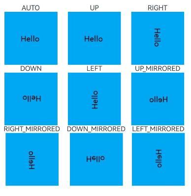

### Example 22: Using EXIF Metadata for Image Display Orientation

This example demonstrates how to use the [getImageProperty](../../apis-image-kit/arkts-apis-image-ImageSource.md#getimageproperty11) API to obtain the EXIF metadata of an image, and then set the image display orientation through the [orientation](#orientation14) attribute based on the obtained EXIF metadata.

```ts
import { image } from '@kit.ImageKit';
import { resourceManager } from '@kit.LocalizationKit';

@Entry
@Component
struct Example {
  @State rotateOrientation: ImageRotateOrientation = ImageRotateOrientation.UP;
  @State pixelMap: image.PixelMap | undefined = undefined;
  @State text1: string = 'The exif orientation is ';
  @State text2: string = 'Set orientation to ';

  // Convert EXIF orientation information into ImageRotateOrientation.
  getOrientation(orientation: string): ImageRotateOrientation {
    if (orientation == 'Top-right') {
      this.text2 = this.text2 + 'UP_MIRRORED';
      return ImageRotateOrientation.UP_MIRRORED;
    } else if (orientation == 'Bottom-right') {
      this.text2 = this.text2 + 'DOWN';
      return ImageRotateOrientation.DOWN;
    } else if (orientation == 'Bottom-left') {
      this.text2 = this.text2 + 'DOWN_MIRRORED';
      return ImageRotateOrientation.DOWN_MIRRORED;
    } else if (orientation == 'Left-top') {
      this.text2 = this.text2 + 'LEFT_MIRRORED';
      return ImageRotateOrientation.LEFT_MIRRORED;
    } else if (orientation == 'Right-top') {
      this.text2 = this.text2 + 'RIGHT';
      return ImageRotateOrientation.RIGHT;
    } else if (orientation == 'Right-bottom') {
      this.text2 = this.text2 + 'RIGHT_MIRRORED';
      return ImageRotateOrientation.RIGHT_MIRRORED;
    } else if (orientation == 'Left-bottom') {
      this.text2 = this.text2 + 'LEFT';
      return ImageRotateOrientation.LEFT;
    } else if (orientation == 'Top-left') {
      this.text2 = this.text2 + 'UP';
      return ImageRotateOrientation.UP;
    } else {
      this.text2 = this.text2 + 'UP';
      return ImageRotateOrientation.UP;
    }
  }

  async getFileBuffer(context: Context): Promise<ArrayBuffer | undefined> {
    try {
      const resourceMgr: resourceManager.ResourceManager = context.resourceManager;
      // Obtain the content of the resource file with EXIF data as Uint8Array.
      const fileData: Uint8Array = await resourceMgr.getRawFileContent('hello.jpg');
      console.info('Successfully get RawFileContent');
      // Convert the array to an ArrayBuffer and return the ArrayBuffer.
      const buffer: ArrayBuffer = fileData.buffer.slice(0);
      return buffer;
    } catch (error) {
      console.error('Failed to get RawFileContent');
      return undefined;
    }
  }

  aboutToAppear() {
    let context = this.getUIContext().getHostContext();
    if (!context) {
      return;
    }
    this.getFileBuffer(context).then((buf: ArrayBuffer | undefined) => {
      let imageSource = image.createImageSource(buf);
      if (!imageSource) {
        return;
      }
      // Obtain EXIF orientation information.
      imageSource.getImageProperty(image.PropertyKey.ORIENTATION).then((orientation) => {
        this.rotateOrientation = this.getOrientation(orientation);
        this.text1 = this.text1 + orientation;
        let options: image.DecodingOptions = {
          'editable': true,
          'desiredPixelFormat': image.PixelMapFormat.RGBA_8888,
        }
        imageSource.createPixelMap(options).then((pixelMap: image.PixelMap) => {
          this.pixelMap = pixelMap;
          imageSource.release();
        });
      }).catch(() => {
        imageSource.release();
      });
    })
  }

  build() {
    Column({ space: 40 }) {
      Column({ space: 10 }) {
        Text('before').fontSize(20).fontWeight(700)
        Image($rawfile('hello.jpg'))
          .width(100)
          .height(100)
        Text(this.text1)
      }

      Column({ space: 10 }) {
        Text('after').fontSize(20).fontWeight(700)
        Image(this.pixelMap)
          .width(100)
          .height(100)
          .orientation(this.rotateOrientation)
        Text(this.text2)
      }
    }
    .height('80%')
    .width('100%')
  }
}
```


### Example 23: Dynamically Switching an SVG Image Between Fill Colors

This example demonstrates how to dynamically switch an SVG Image between fill colors across different color spaces using [ColorMetrics](../js-apis-arkui-graphics.md#colormetrics12).

```ts
import { ColorMetrics } from '@kit.ArkUI';
@Entry
@Component
struct fillColorMetricsDemo {
  @State p3Red: ColorMetrics = ColorMetrics.colorWithSpace(ColorSpace.DISPLAY_P3, 0.631, 0.0392, 0.1294);
  @State sRGBRed: ColorMetrics = ColorMetrics.colorWithSpace(ColorSpace.SRGB, 0.631, 0.0392, 0.1294);
  @State p3Green: ColorMetrics = ColorMetrics.colorWithSpace(ColorSpace.DISPLAY_P3, 0.09, 0.662 ,0.552);
  @State sRGBGreen: ColorMetrics = ColorMetrics.colorWithSpace(ColorSpace.SRGB, 0.09, 0.662 ,0.552);
  @State p3Blue: ColorMetrics = ColorMetrics.colorWithSpace(ColorSpace.DISPLAY_P3, 0, 0.290 ,0.686);
  @State sRGBBlue: ColorMetrics = ColorMetrics.colorWithSpace(ColorSpace.SRGB, 0, 0.290 ,0.686);
  @State colorArray: (Color|undefined|ColorMetrics|ColorContent)[] = [
    this.p3Red, this.sRGBRed, this.p3Green, this.sRGBGreen, this.p3Blue,
    this.sRGBBlue, ColorContent.ORIGIN, Color.Gray, undefined
  ]
  @State colorArrayStr: string[] = [
    "P3 Red", "SRGB Red", "P3 Green", "SRGB Green",
    "P3 Blue", "SRGB Blue", "ORIGIN", "Gray", "undefined"
  ]
  @State arrayIdx: number = 0
  build() {
    Column() {
      Text("FillColor is " + this.colorArrayStr[this.arrayIdx])
      Image($r('app.media.svgExample'))
        .width(110).height(110).margin(15)
        .fillColor(this.colorArray[this.arrayIdx])
      Button("ChangeFillColor")
        .onClick(()=>{
          this.arrayIdx = (this.arrayIdx + 1) % this.colorArray.length
        })
      Blank().height(30).width('100%')
      Text("FillColor is SRGB Red")
      Image($r('app.media.svgExample'))
        .width(110).height(110).margin(15)
        .fillColor(this.sRGBRed)
      Blank().height(30).width('100%')
      Text("FillColor is SRGB Green")
      Image($r('app.media.svgExample'))
        .width(110).height(110).margin(15)
        .fillColor(this.sRGBGreen)
      Blank().height(30).width('100%')
      Text("FillColor is SRGB Blue")
      Image($r('app.media.svgExample'))
        .width(110).height(110).margin(15)
        .fillColor(this.sRGBBlue)
    }
  }
}
```

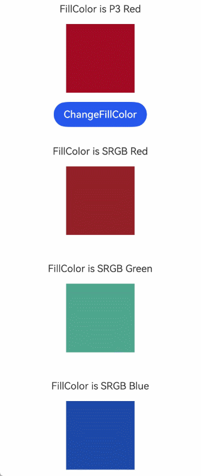
<!--no_check-->