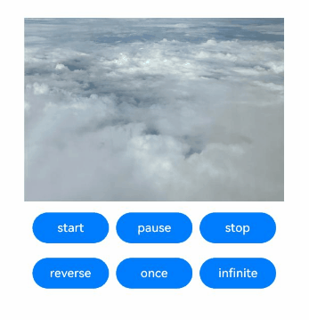
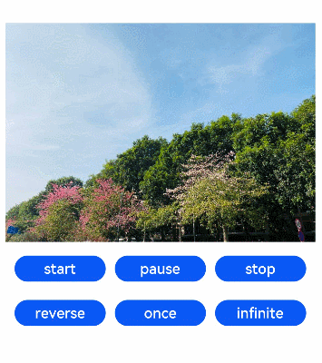

# ImageAnimator

The **ImageAnimator** component enables images to be played a frame-by-frame basis. The list of images to be played as well as the duration of each image can be configured.

>  **NOTE**
>
> This component is supported since API version 7. Updates will be marked with a superscript to indicate their earliest API version.


## Child Components

Not supported


## APIs

ImageAnimator()

**Widget capability**: This API can be used in ArkTS widgets since API version 10.

**Atomic service API**: This API can be used in atomic services since API version 11.

**System capability**: SystemCapability.ArkUI.ArkUI.Full

## Attributes

In addition to the [universal attributes](ts-component-general-attributes.md), the following attributes are supported.

### images

images(value: Array&lt;ImageFrameInfo&gt;)

Sets the image frame information. Dynamic update is not supported.

**Widget capability**: This API can be used in ArkTS widgets since API version 10.

**Atomic service API**: This API can be used in atomic services since API version 11.

**System capability**: SystemCapability.ArkUI.ArkUI.Full

**Parameters**

| Name| Type                                                  | Mandatory| Description                                                        |
| ------ | ------------------------------------------------------ | ---- | ------------------------------------------------------------ |
| value  | Array&lt;[ImageFrameInfo](#imageframeinfo)&gt; | Yes  | Image frame information. The information of each frame includes the image path, image size, image position, and image playback duration. For details, see [ImageFrameInfo](#imageframeinfo).<br>Default value: **[]**<br> **NOTE**<br>If the input array is too large, memory usage may increase. Therefore, as the controller of memory usage, be sure to assess potential memory consumption before passing in the data to avoid issues such as insufficient memory.|

### state

state(value: AnimationStatus)

Sets the playback state of the animation.

**Widget capability**: This API can be used in ArkTS widgets since API version 10.

**Atomic service API**: This API can be used in atomic services since API version 11.

**System capability**: SystemCapability.ArkUI.ArkUI.Full

**Parameters**

| Name| Type                                                   | Mandatory| Description                                                        |
| ------ | ------------------------------------------------------- | ---- | ------------------------------------------------------------ |
| value  | [AnimationStatus](ts-appendix-enums.md#animationstatus) | Yes  | Playback state of the animation. The default state is **Initial**.<br>Default value: **AnimationStatus.Initial**|

### duration

duration(value: number)

Sets the playback duration. This attribute does not take effect when a separate duration is set for any of the image frames.

**Widget capability**: This API can be used in ArkTS widgets since API version 10.

**Atomic service API**: This API can be used in atomic services since API version 11.

**System capability**: SystemCapability.ArkUI.ArkUI.Full

**Parameters**

| Name| Type  | Mandatory| Description                                                        |
| ------ | ------ | ---- | ------------------------------------------------------------ |
| value  | number | Yes  | Playback duration.<br>If the value is **0**, no image is played.<br>If it is set to a negative value, the default value is used.<br>The value change takes effect only at the start of the next cycle.<br>Unit: ms<br>Default value: **1000**|

### reverse

reverse(value: boolean)

Sets the playback direction.

**Widget capability**: This API can be used in ArkTS widgets since API version 10.

**Atomic service API**: This API can be used in atomic services since API version 11.

**System capability**: SystemCapability.ArkUI.ArkUI.Full

**Parameters**

| Name| Type   | Mandatory| Description                                                        |
| ------ | ------- | ---- | ------------------------------------------------------------ |
| value  | boolean | Yes  | Playback direction.<br>The value **false** indicates that images are played from the first one to the last one, and **true** indicates that images are played from the last one to the first one.<br>Default value: **false**|

### fixedSize

fixedSize(value: boolean)

Sets whether the image size is fixed at the component size.

**Widget capability**: This API can be used in ArkTS widgets since API version 10.

**Atomic service API**: This API can be used in atomic services since API version 11.

**System capability**: SystemCapability.ArkUI.ArkUI.Full

**Parameters**

| Name| Type   | Mandatory| Description                                                        |
| ------ | ------- | ---- | ------------------------------------------------------------ |
| value  | boolean | Yes  | Whether the image size is fixed at the component size.<br> **true**: The image size is fixed at the component size. In this case, the width, height, top, and left attributes of the image are invalid.<br> **false**: The width, height, top, and left attributes of each image must be set separately. If the image size does not match the component size, the image will not be stretched.<br>Default value: **true**|

### preDecode<sup>(deprecated)</sup>

preDecode(value: number)

Sets the number of images to be pre-decoded.

This API is deprecated since API version 9.

**System capability**: SystemCapability.ArkUI.ArkUI.Full

**Parameters**

| Name| Type  | Mandatory| Description                                                        |
| ------ | ------ | ---- | ------------------------------------------------------------ |
| value  | number | Yes  | Number of images to be pre-decoded. For example, the value **2** indicates that two images following the currently playing one are pre-decoded.<br>Default value: **0**|

### fillMode

fillMode(value: FillMode)

Sets the status before and after execution of the animation in the current playback direction. The status after execution of the animation is jointly determined by the **fillMode** and **reverse** attributes. For example, if **fillMode** is set to **Forwards**, the target will retain the state defined by the last keyframe encountered during execution. In this case, if **reverse** is set to **false**, the target will retain the state defined by the last keyframe encountered in the forward direction, that is, the last image; if **reverse** is set to **true**, the target will retain the state defined by the last keyframe encountered in the backward direction, that is, the first image.

**Widget capability**: This API can be used in ArkTS widgets since API version 10.

**Atomic service API**: This API can be used in atomic services since API version 11.

**System capability**: SystemCapability.ArkUI.ArkUI.Full

**Parameters**

| Name| Type                                     | Mandatory| Description                                                        |
| ------ | ----------------------------------------- | ---- | ------------------------------------------------------------ |
| value  | [FillMode](ts-appendix-enums.md#fillmode) | Yes  | Status before and after execution of the animation in the current playback direction.<br>Default value: **FillMode.Forwards**|

### iterations

iterations(value: number)

Sets the number of times that the animation is played.

**Atomic service API**: This API can be used in atomic services since API version 11.

**System capability**: SystemCapability.ArkUI.ArkUI.Full

**Parameters**

| Name| Type  | Mandatory| Description                                                  |
| ------ | ------ | ---- | ------------------------------------------------------ |
| value  | number | Yes  | Number of times that the animation is played. By default, the animation is played once. The value **-1** indicates that the animation is played for an unlimited number of times. Values less than -1 are treated as the default value. For the value is a floating-point number, it is rounded down.<br>Default value: **1**|

### monitorInvisibleArea<sup>17+</sup>

monitorInvisibleArea(monitorInvisibleArea: boolean)

Sets whether the component should automatically pause or resume based on its visibility, using the system's [onVisibleAreaChange](./ts-universal-component-visible-area-change-event.md#onvisibleareachange) event.

**Atomic service API**: This API can be used in atomic services since API version 17.

**System capability**: SystemCapability.ArkUI.ArkUI.Full

**Parameters**

| Name| Type  | Mandatory| Description                                                  |
| ------ | ------ | ---- | ------------------------------------------------------ |
| monitorInvisibleArea  | boolean | Yes| Whether the component should automatically pause or resume based on its visibility, using the system's [onVisibleAreaChange](./ts-universal-component-visible-area-change-event.md#onvisibleareachange) event.<br> With the value **true**, when the component's [AnimationStatus](ts-appendix-enums.md#animationstatus) is Running, the component automatically pauses once it becomes invisible and resumes playback if it becomes visible again, based on the **onVisibleAreaChange** event.<br>Default value: **false**.<br> **NOTE**<br>When this parameter is dynamically changed from **true** to **false**,<br> the component will resume from its last paused state based on the current [AnimationStatus](ts-appendix-enums.md#animationstatus).<br>Changes to this property do not affect the custom [state](./ts-basic-components-imageanimator.md#state) value.|

## ImageFrameInfo

Provides image frame information.

**Atomic service API**: This API can be used in atomic services since API version 11.

**System capability**: SystemCapability.ArkUI.ArkUI.Full

| Name  | Type  | Mandatory| Description|
| -------- | -------------- | -------- | -------- |
| src      | string \| [Resource](ts-types.md#resource)<sup>9+</sup> \| [PixelMap](../../apis-image-kit/arkts-apis-image-PixelMap.md)<sup>12+</sup> | Yes   | Image path. The image format can be .jpg, .jpeg, .svg, .png, .bmp, .webp, .ico, or .heif. The [Resource](ts-types.md#resource) type is supported since API version 9, and the [PixelMap](../../apis-image-kit/arkts-apis-image-PixelMap.md) type is supported since API version 12.<br>**Widget capability**: This API can be used in ArkTS widgets since API version 10.|
| width    | number \| string | No | Image width. For the string type, numeric string values with optional units, for example, **"2"** or **"2px"**, are supported.<br>Default value: **0**.<br>Unit: vp.<br>**Widget capability**: This API can be used in ArkTS widgets since API version 10.      |
| height   | number \| string | No | Image height. For the string type, numeric string values with optional units, for example, **"2"** or **"2px"**, are supported.<br>Default value: **0**.<br>Unit: vp<br>**Widget capability**: This API can be used in ArkTS widgets since API version 10.       |
| top      | number \| string | No | Vertical coordinate of the image relative to the upper left corner of the widget For the string type, numeric string values with optional units, for example, **"2"** or **"2px"**, are supported.<br>Default value: **0**.<br>Unit: vp<br>**Widget capability**: This API can be used in ArkTS widgets since API version 10. |
| left     | number \| string | No | Horizontal coordinate of the image relative to the upper left corner of the widget For the string type, numeric string values with optional units, for example, **"2"** or **"2px"**, are supported.<br>Default value: **0**.<br>Unit: vp<br>**Widget capability**: This API can be used in ArkTS widgets since API version 10.  |
| duration | number          | No    | Playback duration of each image frame, in milliseconds.<br>Default value: **0**.<br>Negative numbers are not supported. Setting negative values will cause the image to stay in the current frame for a long time, affecting normal playback.        |

## Events

In addition to the [universal events](ts-component-general-events.md), the following events are supported.

### onStart

onStart(event: () =&gt; void)

Triggered when the animation starts to play.

**Widget capability**: This API can be used in ArkTS widgets since API version 10.

**Atomic service API**: This API can be used in atomic services since API version 11.

**System capability**: SystemCapability.ArkUI.ArkUI.Full

### onPause

onPause(event: () =&gt; void)

Triggered when the animation playback is paused.

**Widget capability**: This API can be used in ArkTS widgets since API version 10.

**Atomic service API**: This API can be used in atomic services since API version 11.

**System capability**: SystemCapability.ArkUI.ArkUI.Full

### onRepeat

onRepeat(event: () =&gt; void)

Triggered when the animation playback is repeated.

**Atomic service API**: This API can be used in atomic services since API version 11.

**System capability**: SystemCapability.ArkUI.ArkUI.Full

### onCancel

onCancel(event: () =&gt; void)

Triggered when the animation playback returns to the initial state.

**Widget capability**: This API can be used in ArkTS widgets since API version 10.

**Atomic service API**: This API can be used in atomic services since API version 11.

**System capability**: SystemCapability.ArkUI.ArkUI.Full

### onFinish

onFinish(event: () =&gt; void)

Triggered when the animation playback is complete or stopped.

**Widget capability**: This API can be used in ArkTS widgets since API version 10.

**Atomic service API**: This API can be used in atomic services since API version 11.

**System capability**: SystemCapability.ArkUI.ArkUI.Full


## Example

### Example 1: Playing an Animation Using Images of the Resource Type

This example demonstrates how to play an animation using the **ImageAnimator** component with images of the Resource type.

```ts
// xxx.ets
@Entry
@Component
struct ImageAnimatorExample {
  @State state: AnimationStatus = AnimationStatus.Initial;
  @State reverse: boolean = false;
  @State iterations: number = 1;

  build() {
    Column({ space: 10 }) {
      ImageAnimator()
        .images([
          {
            src: $r('app.media.img1')
          },
          {
            src: $r('app.media.img2')
          },
          {
            src: $r('app.media.img3')
          },
          {
            src: $r('app.media.img4')
          }
        ])
        .duration(4000)
        .state(this.state)
        .reverse(this.reverse)
        .fillMode(FillMode.None)
        .iterations(this.iterations)
        .width(340)
        .height(240)
        .margin({ top: 100 })
        .onStart(() => {
          console.info('Start')
        })
        .onPause(() => {
          console.info('Pause')
        })
        .onRepeat(() => {
          console.info('Repeat')
        })
        .onCancel(() => {
          console.info('Cancel')
        })
        .onFinish(() => {
          console.info('Finish')
          this.state = AnimationStatus.Stopped
        })
      Row() {
        Button('start').width(100).padding(5).onClick(() => {
          this.state = AnimationStatus.Running
        }).margin(5)
        Button('pause').width(100).padding(5).onClick(() => {
          this.state = AnimationStatus.Paused // Display the image of the current frame.
        }).margin(5)
        Button('stop').width(100).padding(5).onClick(() => {
          this.state = AnimationStatus.Stopped // Display the image of the initial frame.
        }).margin(5)
      }

      Row() {
        Button('reverse').width(100).padding(5).onClick(() => {
          this.reverse = !this.reverse
        }).margin(5)
        Button('once').width(100).padding(5).onClick(() => {
          this.iterations = 1
        }).margin(5)
        Button('infinite').width(100).padding(5).onClick(() => {
          this.iterations = -1 // The animation is played for an unlimited number of times.
        }).margin(5)
      }
    }.width('100%').height('100%')
  }
}
```



### Example 2: Playing an Animation Using Images of the PixelMap Type

This example demonstrates how to play an animation using the **ImageAnimator** component with images of the PixelMap type.

```ts
// xxx.ets
import { image } from '@kit.ImageKit';

@Entry
@Component
struct ImageAnimatorExample {
  imagePixelMap: Array<PixelMap> = [];
  @State state: AnimationStatus = AnimationStatus.Initial;
  @State reverse: boolean = false;
  @State iterations: number = 1;
  @State images: Array<ImageFrameInfo> = [];

  async aboutToAppear() {
    this.imagePixelMap.push(await this.getPixmapFromMedia($r('app.media.icon')));
    this.images.push({ src: this.imagePixelMap[0] });
  }

  build() {
    Column({ space: 10 }) {
      ImageAnimator()
        .images(this.images)
        .duration(2000)
        .state(this.state)
        .reverse(this.reverse)
        .fillMode(FillMode.None)
        .iterations(this.iterations)
        .width(340)
        .height(240)
        .margin({ top: 100 })
        .onStart(() => {
          console.info('Start');
        })
        .onPause(() => {
          console.info('Pause');
        })
        .onRepeat(() => {
          console.info('Repeat');
        })
        .onCancel(() => {
          console.info('Cancel');
        })
        .onFinish(() => {
          console.info('Finish');
          this.state = AnimationStatus.Stopped;
        })
      Row() {
        Button('start').width(100).padding(5).onClick(() => {
          this.state = AnimationStatus.Running;
        }).margin(5)
        Button('pause').width(100).padding(5).onClick(() => {
          this.state = AnimationStatus.Paused; // Display the image of the current frame.
        }).margin(5)
        Button('stop').width(100).padding(5).onClick(() => {
          this.state = AnimationStatus.Stopped; // Display the image of the initial frame.
        }).margin(5)
      }

      Row() {
        Button('reverse').width(100).padding(5).onClick(() => {
          this.reverse = !this.reverse;
        }).margin(5)
        Button('once').width(100).padding(5).onClick(() => {
          this.iterations = 1;
        }).margin(5)
        Button('infinite').width(100).padding(5).onClick(() => {
          this.iterations = -1; // The animation is played for an unlimited number of times.
        }).margin(5)
      }
    }.width('100%').height('100%')
  }

  private async getPixmapFromMedia(resource: Resource) {
    let unit8Array = await this.getUIContext().getHostContext()?.resourceManager?.getMediaContent({
      bundleName: resource.bundleName,
      moduleName: resource.moduleName,
      id: resource.id
    });
    let imageSource = image.createImageSource(unit8Array?.buffer.slice(0, unit8Array.buffer.byteLength));
    let createPixelMap: image.PixelMap = await imageSource.createPixelMap({
      desiredPixelFormat: image.PixelMapFormat.RGBA_8888
    });
    await imageSource.release();
    return createPixelMap;
  }
}
```



### Example 3: Enabling Automatic Pause on Invisibility

This example demonstrates how to use [monitorInvisibleArea](#monitorinvisiblearea17) to automatically pause the **ImageAnimator** component when it becomes invisible and resume playback when it becomes visible again. This behavior is controlled based on the component's [state](#state) being set to **AnimationStatus.Running**.

```ts
@Entry
@Component
struct ImageAnimatorAutoPauseTest {
  scroller: Scroller = new Scroller();
  @State state: AnimationStatus = AnimationStatus.Running;
  @State reverse: boolean = false;
  @State iterations: number = 100;
  @State preCallBack: string = 'Null';
  private arr: number[] = [0, 1, 2, 3, 4, 5, 6, 7, 8, 9];

  build() {
    Stack({ alignContent: Alignment.TopStart }) {
      Scroll(this.scroller) {
        Column() {
          ImageAnimator()
            .images([
              {
                src: $r('app.media.Clouds')
              },
              {
                src: $r('app.media.landscape')
              },
              {
                src: $r('app.media.sky')
              },
              {
                src: $r('app.media.mountain')
              }
            ])
            .borderRadius(10)
            .monitorInvisibleArea(true)
            .clip(true)
            .duration(4000)
            .state(this.state)
            .reverse(this.reverse)
            .fillMode(FillMode.Forwards)
            .iterations(this.iterations)
            .width(340)
            .height(240)
            .margin({ top: 100 })
            .onStart(() => {
              this.preCallBack = "Start";
              console.info('ImageAnimator Start');
            })
            .onPause(() => {
              this.preCallBack = "Pause";
              console.info('ImageAnimator Pause');
            })
            .onRepeat(() => {
              console.info('ImageAnimator Repeat');
            })
            .onCancel(() => {
              console.info('ImageAnimator Cancel');
            })
            .onFinish(() => {
              console.info('ImageAnimator Finish');
            })
          ForEach(this.arr, (item: number) => {
            Text(item.toString())
              .width('90%')
              .height(150)
              .backgroundColor(0xFFFFFF)
              .borderRadius(15)
              .fontSize(16)
              .textAlign(TextAlign.Center)
              .margin({ top: 10 })
          }, (item: string) => item)
        }.width('100%')
      }
      .scrollable(ScrollDirection.Vertical) // The scrollbar scrolls in the vertical direction.
      .scrollBar(BarState.On) // The scrollbar is always displayed.
      .scrollBarColor(Color.Gray) // The scrollbar color is gray.
      .scrollBarWidth(10) // The scrollbar width is 10.
      .friction(0.6)
      .edgeEffect(EdgeEffect.None)
      .onWillScroll((xOffset: number, yOffset: number, scrollState: ScrollState) => {
        console.info(xOffset + ' ' + yOffset);
      })
      .onScrollEdge((side: Edge) => {
        console.info('To the edge');
      })
      .onScrollStop(() => {
        console.info('Scroll Stop');
      })

      Text("Last triggered callback (Pause/Start): " + this.preCallBack)
        .margin({ top: 60, left: 20 })
    }.width('100%').height('100%').backgroundColor(0xDCDCDC)
  }
}
```


