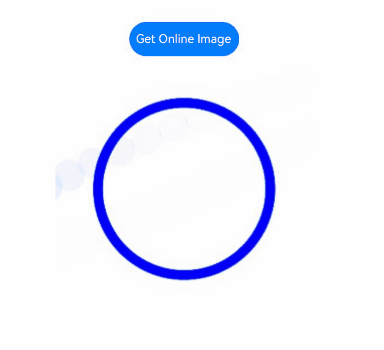

# ImageSpan

As a child of the [Text](ts-basic-components-text.md) and [ContainerSpan](ts-basic-components-containerspan.md) components, the **ImageSpan** component is used to display inline images.

>  **NOTE**
>
>  This component is supported since API version 10. Updates will be marked with a superscript to indicate their earliest API version.


## Child Components

Not supported


## APIs

ImageSpan(value: ResourceStr | PixelMap)

**Atomic service API**: This API can be used in atomic services since API version 11.

**System capability**: SystemCapability.ArkUI.ArkUI.Full

**Parameters**

| Name| Type| Mandatory| Description|
| -------- | -------- | -------- | -------- |
| value | [ResourceStr](ts-types.md#resourcestr) \| [PixelMap](../../apis-image-kit/js-apis-image.md#pixelmap7)  | Yes| Image source. Both local and online images are supported.<br>When using an image referenced using a relative path, for example, **ImageSpan("common/test.jpg")**, the **ImageSpan** component cannot be called across bundles or modules. Therefore, you are advised to use **\$r** to reference image resources that need to be used globally.<br>\- The supported formats include PNG, JPG, BMP, SVG, GIF, and HEIF.<br>\- Base64 strings are supported. The value format is data:image/[png\|jpeg\|bmp\|webp\|heif];base64,[base64 data], where *[base64 data]* is a Base64 string.<br>\- Strings with the **file:///data/storage** prefix are supported, which are used to read image resources in the **files** folder in the installation directory of the application. Ensure that the application has the read permission to the files in the specified path.|


## Attributes

The attributes inherit from [BaseSpan](ts-basic-components-span.md#basespan). Among the universal attributes, [size](ts-universal-attributes-size.md#size), [background](ts-universal-attributes-background.md#background), and [border](ts-universal-attributes-border.md#border) are supported.

### verticalAlign

verticalAlign(value: ImageSpanAlignment)

Sets the alignment mode of the image relative to the line height.

**Atomic service API**: This API can be used in atomic services since API version 11.

**System capability**: SystemCapability.ArkUI.ArkUI.Full

**Parameters**

| Name| Type                                     | Mandatory| Description                                                        |
| ------ | ----------------------------------------- | ---- | ------------------------------------------------------------ |
| value  | [ImageSpanAlignment](ts-appendix-enums.md#imagespanalignment10) | Yes  | Alignment mode of the image relative to the line height.<br>Default value: **ImageSpanAlignment.BOTTOM**|

### objectFit

objectFit(value: ImageFit)

Sets the image scale type.

**Atomic service API**: This API can be used in atomic services since API version 11.

**System capability**: SystemCapability.ArkUI.ArkUI.Full

**Parameters**

| Name| Type                                     | Mandatory| Description                                       |
| ------ | ----------------------------------------- | ---- | ------------------------------------------- |
| value  | [ImageFit](ts-appendix-enums.md#imagefit) | Yes  | Image scale type.<br>Default value: **ImageFit.Cover**|

### alt<sup>12+</sup>

alt(value: PixelMap)

Sets the placeholder image displayed during loading.

**Atomic service API**: This API can be used in atomic services since API version 12.

**System capability**: SystemCapability.ArkUI.ArkUI.Full

**Parameters**

| Name| Type                                                    | Mandatory| Description                                                        |
| ------ | -------------------------------------------------------- | ---- | ------------------------------------------------------------ |
| value  | [PixelMap](../../apis-image-kit/js-apis-image.md#pixelmap7) | Yes  | Placeholder image displayed during loading. The [PixelMap](../../apis-image-kit/js-apis-image.md#pixelmap7) type is supported.<br>Default value: **null**|

### colorFilter<sup>14+</sup>

colorFilter(filter: ColorFilter | DrawingColorFilter)

Sets the color filter for the image.

**Atomic service API**: This API can be used in atomic services since API version 14.

**System capability**: SystemCapability.ArkUI.ArkUI.Full

**Parameters**

| Name| Type                                   | Mandatory| Description                                                        |
| ------ | --------------------------------------- | ---- | ------------------------------------------------------------ |
| filter  | [ColorFilter](ts-types.md#colorfilter9) \| [DrawingColorFilter](ts-basic-components-image.md#drawingcolorfilter12) | Yes  | 1. Color filter of the image. The input parameter is a 4 x 5 RGBA transformation matrix.<br>The first row of the matrix represents a vector value of R (red), the second row represents a vector value of G (green), the third row represents a vector value of B (blue), and the fourth row represents a vector value of A (alpha). The four rows represent different RGBA vector values.<br>If the matrix contains entries of 1 on the diagonal and entries of 0 in other places, the original color of the image is retained.<br> **Calculation rule:**<br>If the input filter matrix is as follows:<br><br>Wherein the color is [R, G, B, A].<br>Then the color after filtering is [R', G', B', A'].<br><br>2. The ColorFilter type of **@ohos.graphics.drawing** can be used as the input parameter.<br>**NOTE**<br>The DrawingColorfilter type can be used in atomic services. The SVG image to set as the source must have the **stroke** attribute.|

## Events

Among all the universal events, only the [click event](ts-universal-attributes-click.md) is supported. The following events are also supported.

### onComplete<sup>12+</sup>

onComplete(callback: ImageCompleteCallback)

Triggered when the image is successfully loaded or decoded. The size of the loaded image is returned.

**Atomic service API**: This API can be used in atomic services since API version 12.

**System capability**: SystemCapability.ArkUI.ArkUI.Full

**Parameters**

| Name  | Type                                      | Mandatory| Description                      |
| -------- | ------------------------------------------ | ---- | -------------------------- |
| callback | [ImageCompleteCallback](#imagecompletecallback12) | Yes  | Callback triggered when the image is successfully loaded or decoded.|

### onError<sup>12+</sup>

onError(callback: ImageErrorCallback)

Triggered when an error occurs during image loading.

**Atomic service API**: This API can be used in atomic services since API version 12.

**System capability**: SystemCapability.ArkUI.ArkUI.Full

**Parameters**

| Name  | Type                                      | Mandatory| Description                      |
| -------- | ------------------------------------------ | ---- | -------------------------- |
| callback | [ImageErrorCallback](ts-basic-components-image.md#imageerrorcallback9) | Yes  | Callback triggered when an error occurs during image loading.|

## ImageCompleteCallback<sup>12+</sup>

type ImageCompleteCallback = (result: ImageLoadResult) => void

Defines the callback triggered when the image is successfully loaded or decoded.

**Atomic service API**: This API can be used in atomic services since API version 12.

**System capability**: SystemCapability.ArkUI.ArkUI.Full

| Name| Type                      | Mandatory| Description                              |
| ------ | -------------------------- | ---- | ---------------------------------- |
| result  | [ImageLoadResult](#imageloadresult12) | Yes  | Object returned after the callback is triggered when an image is successfully loaded or decoded.|

## ImageLoadResult<sup>12+</sup>

Object returned after the callback is triggered when an image is successfully loaded or decoded.

**Atomic service API**: This API can be used in atomic services since API version 12.

**System capability**: SystemCapability.ArkUI.ArkUI.Full

| Name                      | Type  | Mandatory| Description                                                        |
| ---------------------------- | ------ | ---- | ------------------------------------------------------------ |
| width                        | number | Yes  | Width of the image.<br>Unit: pixel                                   |
| height                       | number | Yes  | Height of the image.<br>Unit: pixel                                   |
| componentWidth               | number | Yes  | Width of the component.<br>Unit: pixel                                   |
| componentHeight              | number | Yes  | Height of the component.<br>Unit: pixel                                   |
| loadingStatus                | number | Yes  | Loading status of the image.<br>**NOTE**<br>If the return value is **0**, the image is successfully loaded. If the return value is **1**, the image is successfully decoded.|
| contentWidth   | number | Yes  | Actual rendered width of the image.<br>Unit: pixel<br>**NOTE**<br>This parameter is valid only when the return value of **loadingStatus** is **1**.|
| contentHeight  | number | Yes  | Actual rendered height of the image.<br>Unit: pixel<br>**NOTE**<br>This parameter is valid only when the return value of **loadingStatus** is **1**.|
| contentOffsetX | number | Yes  | Offset of the rendered content relative to the component on the x-axis.<br>Unit: pixel<br>**NOTE**<br>This parameter is valid only when the return value of **loadingStatus** is **1**.|
| contentOffsetY | number | Yes  | Offset of the rendered content relative to the component on the y-axis<br>Unit: pixel<br>**NOTE**<br>This parameter is valid only when the return value of **loadingStatus** is **1**.|


## Example

### Example 1: Setting the Alignment Mode

This example demonstrates the alignment and scaling effects of the **ImageSpan** component using the **verticalAlign** and **objectFit** attributes.

```ts
// xxx.ets
@Entry
@Component
struct SpanExample {
  build() {
    Flex({ direction: FlexDirection.Column, alignItems: ItemAlign.Center, justifyContent: FlexAlign.Center }) {
      Text() {
        Span('This is the Span and ImageSpan component').fontSize(25).textCase(TextCase.Normal)
          .decoration({ type: TextDecorationType.None, color: Color.Pink })
      }.width('100%').textAlign(TextAlign.Center)

      Text() {
        ImageSpan($r('app.media.app_icon'))
          .width('200px')
          .height('200px')
          .objectFit(ImageFit.Fill)
          .verticalAlign(ImageSpanAlignment.CENTER)
        Span('I am LineThrough-span')
          .decoration({ type: TextDecorationType.LineThrough, color: Color.Red }).fontSize(25)
        ImageSpan($r('app.media.app_icon'))
          .width('50px')
          .height('50px')
          .verticalAlign(ImageSpanAlignment.TOP)
        Span('I am Underline-span')
          .decoration({ type: TextDecorationType.Underline, color: Color.Red }).fontSize(25)
        ImageSpan($r('app.media.app_icon'))
          .size({ width: '100px', height: '100px' })
          .verticalAlign(ImageSpanAlignment.BASELINE)
        Span('I am Underline-span')
          .decoration({ type: TextDecorationType.Underline, color: Color.Red }).fontSize(25)
        ImageSpan($r('app.media.app_icon'))
          .width('70px')
          .height('70px')
          .verticalAlign(ImageSpanAlignment.BOTTOM)
        Span('I am Underline-span')
          .decoration({ type: TextDecorationType.Underline, color: Color.Red }).fontSize(50)
      }
      .width('100%')
      .textIndent(50)
    }.width('100%').height('100%').padding({ left: 0, right: 0, top: 0 })
  }
}
```


### Example 2: Setting the Background Style

This example demonstrates the effect of setting a background style for text using the **textBackgroundStyle** attribute.

```ts
// xxx.ets
@Component
@Entry
struct Index {
  build() {
    Row() {
      Column() {
        Text() {
          ImageSpan($r('app.media.sky'))// You are advised to use a custom local image.
            .width('60vp')
            .height('60vp')
            .verticalAlign(ImageSpanAlignment.CENTER)
            .borderRadius(20)
            .textBackgroundStyle({ color: '#7F007DFF', radius: "5vp" })
        }
      }.width('100%')
    }.height('100%')
  }
}
```


### Example 3: Adding Events to an Image

This example demonstrates how to add load success and load error events to the **ImageSpan** component using **onComplete** and **onError**.

```ts
// xxx.ets
@Entry
@Component
struct Index {
  @State src: ResourceStr = $r('app.media.app_icon');

  build() {
    Column() {
      Text() {
        ImageSpan(this.src)
          .width(100).height(100)
          .onError((err) => {
            console.log("onError: " + err.message);
          })
          .onComplete((event) => {
            console.log("onComplete: " + event.loadingStatus);
          })
      }
    }.width('100%').height('100%')
  }
}
```
### Example 4: Setting the Color Filter

This example demonstrates the effect of setting a color filter for the **ImageSpan** component using the **colorFilter** attribute.

```ts
// xxx.ets
import { drawing } from '@kit.ArkGraphics2D';

@Entry
@Component
struct SpanExample {
  private ColorFilterMatrix: number[] = [0.239, 0, 0, 0, 0, 0, 0.616, 0, 0, 0, 0, 0, 0.706, 0, 0, 0, 0, 0, 1, 0];
  @State DrawingColorFilterFirst: ColorFilter | undefined = new ColorFilter(this.ColorFilterMatrix);

  build() {
    Row() {
      Column({ space: 10 }) {
        // Use a ColorFilter object to apply a color filter to the image.
        Text() {
          ImageSpan($r('app.media.sky'))// You are advised to use a custom local image.
            .width('60vp')
            .height('60vp')
            .colorFilter(this.DrawingColorFilterFirst)
        }

        // Create a color filter using the drawing.ColorFilter API.
        Text() {
          ImageSpan($r('app.media.sky'))// You are advised to use a custom local image.
            .width('60vp')
            .height('60vp')
            .colorFilter(drawing.ColorFilter.createBlendModeColorFilter({
              alpha: 255,
              red: 112,
              green: 112,
              blue: 112
            }, drawing.BlendMode.SRC))
        }
      }.width('100%')
    }.height('100%')
  }
}
```


### Example 5: Setting a Placeholder Image

This example shows how a placeholder image is used in the **ImageSpan** component during the process of loading an image from the Internet.

```ts
// xxx.ets
import { http } from '@kit.NetworkKit';
import { image } from '@kit.ImageKit';
import { BusinessError } from '@kit.BasicServicesKit';

@Entry
@Component
struct SpanExample {
  @State imageAlt: PixelMap | undefined = undefined

  httpRequest() {
    // Enter an image URL.
    http.createHttp().request("https://www.example.com/xxx.png", (error: BusinessError, data: http.HttpResponse) => {
      if (error) {
        console.error(`http request failed with. Code: ${error.code}, message: ${error.message}`);
      } else {
        console.log(`http request success.`);
        let imageData: ArrayBuffer = data.result as ArrayBuffer;
        let imageSource: image.ImageSource = image.createImageSource(imageData);

        class tmp {
          height: number = 100;
          width: number = 100;
        }

        let option: Record<string, number | boolean | tmp> = {
          'alphaType': 0, // Alpha type.
          'editable': false, // Whether the image is editable.
          'pixelFormat': 3, // Pixel format.
          'scaleMode': 1, // Scale mode.
          'size': { height: 100, width: 100 }
        };
        // Image size.
        imageSource.createPixelMap(option).then((pixelMap: PixelMap) => {
          this.imageAlt = pixelMap;
        })
      }
    })
  }

  build() {
    Column() {
      Button("Get Online Image")
        .onClick(() => {
          this.httpRequest();
        })

      Text() {
        // Enter an image URL.
        ImageSpan('https://www.example.com/xxx.png')
          .alt(this.imageAlt)
          .width(300)
          .height(300)
      }

    }.width('100%').height(250).padding({ left: 35, right: 35, top: 35 })
  }
}
```


