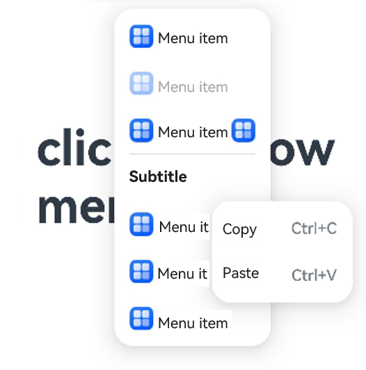

# Menu

The **Menu** component is a vertical list of items presented to the user.

> **NOTE**
>
> - This component is supported since API version 9. Newly added APIs will be marked with a superscript to indicate their earliest API version.
>
> - The **Menu** component must be used together with the [bindMenu](ts-universal-attributes-menu.md#bindmenu) or [bindContextMenu](ts-universal-attributes-menu.md#bindcontextmenu8) method. It does not work when used alone.

## Child Components

This component contains the [MenuItem](ts-basic-components-menuitem.md) and [MenuItemGroup](ts-basic-components-menuitemgroup.md) child components.

## APIs

Menu()

Creates a fixed container for a menu. This API does not have any parameters.

> **NOTE**
> Rules for calculating the width of menus and menu items:
>
> During the layout, the width of each menu item is expected to be the same. If a child component has its width set, the [size calculation rule](ts-universal-attributes-size.md#constraintsize) prevails.
>
> If the width is not set, the **Menu** component sets the default width of two columns for the **MenuItem** and **MenuItemGroup** child components. If a menu item's content area is wider than two columns, the **Menu** component automatically expands the menu item content area.
>
> When the width is set, the **Menu** component sets the **MenuItem** and **MenuItemGroup** child components to the fixed width (set width minus the padding).

**Atomic service API**: This API can be used in atomic services since API version 11.

**System capability**: SystemCapability.ArkUI.ArkUI.Full

## Attributes

In addition to the [universal attributes](ts-universal-attributes-size.md), the following attributes are supported.

### fontSize<sup>(deprecated)</sup>

fontSize(value: Length)

Sets the size of all text within the menu.

This API is deprecated since API version 10. You are advised to use [font](#font10) instead.

**System capability**: SystemCapability.ArkUI.ArkUI.Full

**Parameters**

| Name | Type                        | Mandatory | Description                                                    |
| ------ | ---------------------------- | ---- | -------------------------------------------------------- |
| value  | [Length](ts-types.md#length) | Yes  | Size of all text within the menu. If the value of the Length type is a number, the unit is fp. |

### font<sup>10+</sup>

font(value: Font)

Sets the size of all text within the menu.

**Atomic service API**: This API can be used in atomic services since API version 11.

**System capability**: SystemCapability.ArkUI.ArkUI.Full

**Parameters**

| Name| Type                    | Mandatory| Description                                                        |
| ------ | ------------------------ | ---- | ------------------------------------------------------------ |
| value  | [Font](ts-types.md#font) | Yes  | Size of all text within the menu.<br>Default value:<br>{<br>      size: 16,<br>      family: 'HarmonyOS Sans',<br>      weight: FontWeight.Medium,<br>      style: FontStyle.Normal<br>} |
### fontColor<sup>10+</sup>

fontColor(value: ResourceColor)

Sets the font color of all text within the menu.

**Atomic service API**: This API can be used in atomic services since API version 11.

**System capability**: SystemCapability.ArkUI.ArkUI.Full

**Parameters**

| Name | Type                                      | Mandatory | Description                  |
| ------ | ------------------------------------------ | ---- | ---------------------- |
| value  | [ResourceColor](ts-types.md#resourcecolor) | Yes  | Font color of all text within the menu.<br>Default value: **'#E5000000'**|

### radius<sup>10+</sup>

radius(value: Dimension | BorderRadiuses)

Sets the radius of the menu border corners.

**Atomic service API**: This API can be used in atomic services since API version 11.

**System capability**: SystemCapability.ArkUI.ArkUI.Full

**Parameters**

| Name | Type                                                        | Mandatory | Description                                                        |
| ------ | ------------------------------------------------------------ | ---- | ------------------------------------------------------------ |
| value  | [Dimension](ts-types.md#dimension10) \| [BorderRadiuses](ts-types.md#borderradiuses9) | Yes  | Radius of the menu border corners.<br>Default value: **8vp** for 2-in-1 devices and **20vp** for other devices<br><br> Since API version 12, if the sum of the two maximum corner radii in the horizontal direction exceeds the menu width, or if the sum of the two maximum corner radii in the vertical direction exceeds the menu height, the default corner radius will be used for all four corners of the menu.|

### width<sup>10+</sup>

width(value: Length)

Sets the border width of the menu. The minimum width is 64 vp.

**Widget capability**: This API can be used in ArkTS widgets since API version 10.

**System capability**: SystemCapability.ArkUI.ArkUI.Full

**Parameters**

| Name | Type                        | Mandatory | Description          |
| ------ | ---------------------------- | ---- | -------------- |
| value  | [Length](ts-types.md#length) | Yes  | Border width of the menu. |

### menuItemDivider<sup>12+</sup>

menuItemDivider(options: DividerStyleOptions | undefined)

Sets the style of the menu item divider. If this attribute is not set, the divider will not be displayed.

If the sum of **startMargin** and **endMargin** exceeds the component width, both **startMargin** and **endMargin** will be set to **0**.

**Atomic service API**: This API can be used in atomic services since API version 12.

**System capability**: SystemCapability.ArkUI.ArkUI.Full

**Parameters**

| Name    | Type                                                    | Mandatory        | Description          |
|---------|--------------------------------------------------------|------------| -------------- |
| options | [DividerStyleOptions](ts-types.md#dividerstyleoptions12) \|  undefined | Yes  | Style of the menu item divider.<br>- **strokeWidth**: stroke width of the divider.<br>- **color**: color of the divider.<br>- **startMargin**: distance between the divider and the start edge of the menu item.<br>- **endMargin**: distance between the divider and the end edge of the menu item. |

### menuItemGroupDivider<sup>12+</sup>

menuItemGroupDivider(options: DividerStyleOptions | undefined)

Sets the style of the top and bottom dividers for the menu item group. If this attribute is not set, the dividers will be displayed by default.

**Atomic service API**: This API can be used in atomic services since API version 12.

**System capability**: SystemCapability.ArkUI.ArkUI.Full

**Parameters**

| Name    | Type                                                    | Mandatory        | Description          |
|---------|--------------------------------------------------------|------------| -------------- |
| options | [DividerStyleOptions](ts-types.md#dividerstyleoptions12) \|  undefined | Yes  | Style of the top and bottom dividers for the menu item group.<br>- **strokeWidth**: stroke width of the divider. The default value is 1 px.<br>- **color**: color of the divider. The default value is **#33000000**.<br>- **startMargin**: distance between the divider and the start edge of the menu item group. The default value is **16**.<br>- **endMargin**: distance between the divider and the end edge of the menu item group. The default value is **16**. |

### subMenuExpandingMode<sup>12+</sup>

subMenuExpandingMode(mode: SubMenuExpandingMode)

Sets the submenu expanding mode of the menu.

**Atomic service API**: This API can be used in atomic services since API version 12.

**System capability**: SystemCapability.ArkUI.ArkUI.Full

**Parameters**

| Name | Type                        | Mandatory | Description          |
| ------ | ---------------------------- | ---- |--------------|
| mode  | [SubMenuExpandingMode](#submenuexpandingmode12) | Yes  | Submenu expanding mode of the menu.<br>Default value: **SubMenuExpandingMode.SIDE_EXPAND** |

## SubMenuExpandingMode<sup>12+</sup>

Enumerates the submenu expanding modes.

**Atomic service API**: This API can be used in atomic services since API version 12.

**System capability**: SystemCapability.ArkUI.ArkUI.Full

| Name           | Description                                      |
| --------------- | ------------------------------------------ |
| SIDE_EXPAND     | Default mode. Submenus are expanded on the side on the same plane.|
| EMBEDDED_EXPAND | Embedded mode. Submenus are expanded while embedded within the main menu.    |
| STACK_EXPAND    | Stack mode. Submenus are expanded above the main menu.      |

## Example

### Example 1

```ts
@Entry
@Component
struct Index {
  @State select: boolean = true
  private iconStr: ResourceStr = $r("app.media.view_list_filled")
  private iconStr2: ResourceStr = $r("app.media.arrow_right_filled")

  @Builder
  SubMenu() {
    Menu() {
      MenuItem({ content: "Copy", labelInfo: "Ctrl+C" })
      MenuItem({ content: "Paste", labelInfo: "Ctrl+V" })
    }
  }

  @Builder
  MyMenu(){
    Menu() {
      MenuItem({ startIcon: $r("app.media.icon"), content: "Menu item" })
      MenuItem({ startIcon: $r("app.media.icon"), content: "Menu item" })
        .enabled(false)
      MenuItem({
        startIcon: this.iconStr,
        content: "Menu item",
        endIcon: this.iconStr2,
        builder: ():void=>this.SubMenu()
      })
      MenuItemGroup({ header: 'Subtitle' }) {
        MenuItem({
          startIcon: this.iconStr,
          content: "Menu item",
          endIcon: this.iconStr2,
          builder: ():void=>this.SubMenu()
        })
        MenuItem({
          startIcon: $r("app.media.app_icon"),
          content: "Menu item",
          endIcon: this.iconStr2,
          builder: ():void=>this.SubMenu()
        })
      }
      MenuItem({
        startIcon: this.iconStr,
        content: "Menu item",
      })
    }
  }

  build() {
    Row() {
      Column() {
        Text('click to show menu')
          .fontSize(50)
          .fontWeight(FontWeight.Bold)
      }
      .bindMenu(this.MyMenu)
      .width('100%')
    }
    .height('100%')
  }
}
```



### Example 2

This example demonstrates a regular menu (using symbol-type icons).

```ts
// xxx.ets
import { SymbolGlyphModifier } from '@kit.ArkUI';

@Entry
@Component
struct Index {
  @State startIconModifier: SymbolGlyphModifier = new SymbolGlyphModifier($r('sys.symbol.ohos_mic')).fontSize('24vp');
  @State endIconModifier: SymbolGlyphModifier = new SymbolGlyphModifier($r('sys.symbol.ohos_trash')).fontSize('24vp');
  @State selectIconModifier: SymbolGlyphModifier =
    new SymbolGlyphModifier($r('sys.symbol.checkmark')).fontSize('24vp');
  @State select: boolean = true;

  @Builder
  SubMenu() {
    Menu() {
      MenuItem({ content: "Copy", labelInfo: "Ctrl+C" })
      MenuItem({ content: "Paste", labelInfo: "Ctrl+V" })
    }
  }

  @Builder
  MyMenu() {
    Menu() {
      MenuItem({ symbolStartIcon: this.startIconModifier, content: "Menu item" })
      MenuItem({ symbolStartIcon: this.startIconModifier, content: "Menu item" })
        .enabled(false)
      MenuItem({
        symbolStartIcon: this.startIconModifier,
        content: "Menu item",
        symbolEndIcon: this.endIconModifier,
        builder: (): void => this.SubMenu()
      })
      MenuItemGroup({ header: 'Subtitle' }) {
        MenuItem({
          symbolStartIcon: this.startIconModifier,
          content: "Menu item",
          symbolEndIcon: this.endIconModifier,
          builder: (): void => this.SubMenu()
        })
        MenuItem({
          symbolStartIcon: this.startIconModifier,
          content: "Menu item",
          symbolEndIcon: this.endIconModifier,
          builder: (): void => this.SubMenu()
        })
      }
      MenuItem({
        content: "Menu item",
      }).selected(this.select).selectIcon(this.selectIconModifier)
    }
  }

  build() {
    Row() {
      Column() {
        Text('click to show menu')
          .fontSize(50)
          .fontWeight(FontWeight.Bold)
      }
      .bindMenu(this.MyMenu)
      .width('100%')
    }
    .height('100%')
  }
}
```


