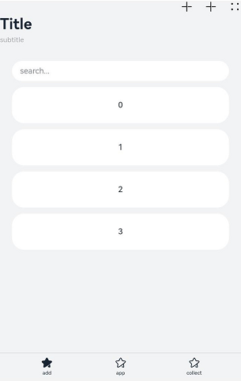
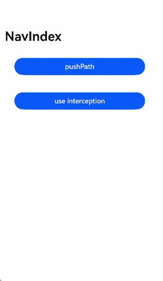
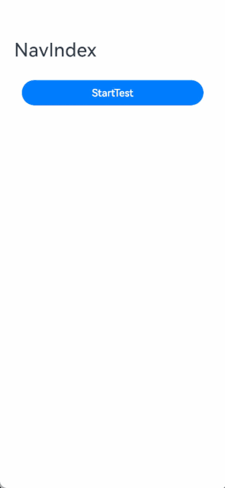
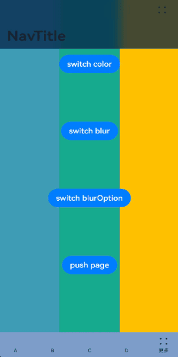
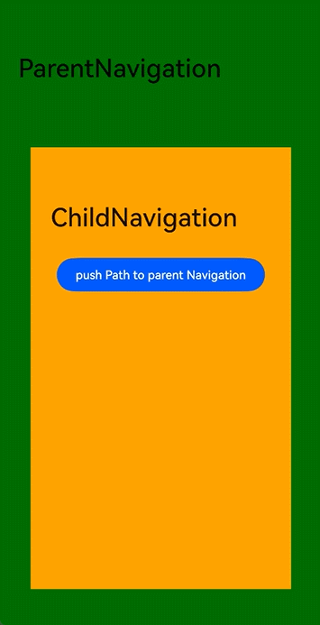
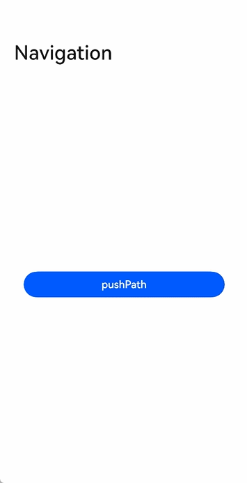
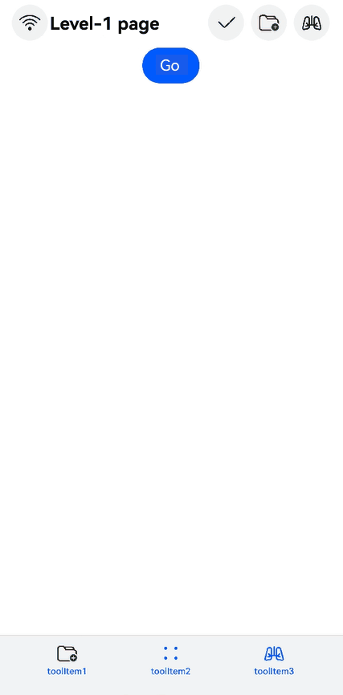

# Navigation

The **Navigation** component is the root view container for navigation. It typically functions as the root container of a page and includes a title bar, content area, and toolbar. The content area switches between the home page content (child components of **Navigation**) and non-home page content (child components of [NavDestination](ts-basic-components-navdestination.md)) through routing.

> **NOTE**
>
> This component is supported since API version 8. Updates will be marked with a superscript to indicate their earliest API version.
>
> Since API version 11, this component supports the safe area attribute by default, with the default attribute value being **expandSafeArea([SafeAreaType.SYSTEM, SafeAreaType.KEYBOARD, SafeAreaType.CUTOUT], [SafeAreaEdge.TOP, SafeAreaEdge.BOTTOM])**. You can override this attribute to change the default behavior. In earlier versions, you need to use the [expandSafeArea](ts-universal-attributes-expand-safe-area.md) attribute to implement the safe area feature.


## Child Components

Supported

Since API version 9, it is recommended that this component be used together with the [NavRouter](ts-basic-components-navrouter.md) component.

Since API version 10, it is recommended that this component be used together with the [NavPathStack](#navpathstack10) component and **navDestination** attribute for page routing.

## APIs

### Navigation

Navigation()

**Atomic service API**: This API can be used in atomic services since API version 11.

**System capability**: SystemCapability.ArkUI.ArkUI.Full

### Navigation<sup>10+</sup>

Navigation(pathInfos: NavPathStack)

Binds a navigation stack to the **Navigation** component.

**Atomic service API**: This API can be used in atomic services since API version 11.

**System capability**: SystemCapability.ArkUI.ArkUI.Full

**Parameters**

| Name      | Type                           | Mandatory  | Description  |
| --------- | ------------------------------- | ---- | ------ |
| pathInfos | [NavPathStack](#navpathstack10) | No   | Information about the navigation stack.|

## Attributes

In addition to the [universal attributes](ts-universal-attributes-size.md), the following attributes are supported.

### title

title(value: ResourceStr | CustomBuilder | NavigationCommonTitle | NavigationCustomTitle, options?: NavigationTitleOptions)

Sets the page title.

**Atomic service API**: This API can be used in atomic services since API version 11.

**System capability**: SystemCapability.ArkUI.ArkUI.Full

**Parameters**

| Name | Type                                                        | Mandatory| Description                                                        |
| ------- | ------------------------------------------------------------ | ---- | ------------------------------------------------------------ |
| value   | [ResourceStr](ts-types.md#resourcestr)<sup>10+</sup> \| [CustomBuilder](ts-types.md#custombuilder8) \| [NavigationCommonTitle](#navigationcommontitle9)<sup>9+</sup> \| [NavigationCustomTitle](#navigationcustomtitle9)<sup>9+</sup> | Yes  | Page title. When the NavigationCustomTitle type is used to set the height, [titleMode](#titlemode) does not take effect. When the title string is too long: (1) If no subtitle is set, the string is scaled down, wrapped in two lines, and then clipped with an ellipsis (...); (2) If a subtitle is set, the subtitle is scaled down and then clipped with an ellipsis (...).|
| options | [NavigationTitleOptions](#navigationtitleoptions11)<sup>11+</sup> | No  | Title bar options.                                                  |

### subTitle<sup>(deprecated)</sup>

subTitle(value: string)

Sets the page subtitle.

This API is deprecated since API version 9. You are advised to use [title](#title) instead.

**System capability**: SystemCapability.ArkUI.ArkUI.Full

**Parameters**

| Name| Type  | Mandatory| Description        |
| ------ | ------ | ---- | ------------ |
| value  | string | Yes  | Page subtitle.|

### menus

menus(value: Array&lt;NavigationMenuItem&gt; | CustomBuilder)

> **NOTE**
>
> The following are not allowed: modify the icon size through the **fontSize** attribute of the **SymbolGlyphModifier** object, change the animation effects through the **effectStrategy** attribute, or change the type of animation effects through the **symbolEffect** attribute.


Sets the menu items in the upper right corner of the page. If this attribute is not set, no menu item is displayed. When the value type is Array<[NavigationMenuItem](#navigationmenuitem)&gt;, the menu shows a maximum of three icons in portrait mode and a maximum of five icons in landscape mode, with excess icons (if any) placed under the automatically generated **More** icon.

**Atomic service API**: This API can be used in atomic services since API version 11.

**System capability**: SystemCapability.ArkUI.ArkUI.Full

**Parameters**

| Name| Type                                                        | Mandatory| Description            |
| ------ | ------------------------------------------------------------ | ---- | ---------------- |
| value  | Array<[NavigationMenuItem](#navigationmenuitem)&gt; \| [CustomBuilder](ts-types.md#custombuilder8) | Yes  | Menu items in the upper right corner of the page.|

### titleMode

titleMode(value: NavigationTitleMode)

Sets the display mode of the page title bar.

**Atomic service API**: This API can be used in atomic services since API version 11.

**System capability**: SystemCapability.ArkUI.ArkUI.Full

**Parameters**

| Name| Type                                               | Mandatory| Description                                                     |
| ------ | --------------------------------------------------- | ---- | --------------------------------------------------------- |
| value  | [NavigationTitleMode](#navigationtitlemode) | Yes  | Display mode of the page title bar.<br>Default value: **NavigationTitleMode.Free**|

### toolBar<sup>(deprecated)</sup>

toolBar(value: object | CustomBuilder)

Sets the content of the toolbar. If this attribute is not set, no toolbar is displayed. Items are evenly distributed on the toolbar at the bottom. Text and icons are evenly distributed in each content area. If the text is too long, it is scaled down level by level, wrapped in two lines, and then clipped with an ellipsis (...).

This API is deprecated since API version 10. You are advised to use [toolbarConfiguration](#toolbarconfiguration10) instead.

**System capability**: SystemCapability.ArkUI.ArkUI.Full

**Parameters**

| Name| Type                                                        | Mandatory| Description        |
| ------ | ------------------------------------------------------------ | ---- | ------------ |
| value  | object \| [CustomBuilder](ts-types.md#custombuilder8) | Yes  | Content of the toolbar.|

**object**

| Name    | Type           | Mandatory  | Description             |
| ------ | ------------- | ---- | --------------- |
| value  | string        | Yes   | Text of the toolbar item.  |
| icon   | string        | No   | Icon path of the toolbar item.|
| action | () =&gt; void | No   | Callback invoked when the menu item is selected.  |

### toolbarConfiguration<sup>10+</sup>

toolbarConfiguration(value: Array&lt;ToolbarItem&gt; | CustomBuilder, options?: NavigationToolbarOptions)

> **NOTE**
>
> The following are not allowed: modify the icon size through the **fontSize** attribute of the **SymbolGlyphModifier** object, change the animation effects through the **effectStrategy** attribute, or change the type of animation effects through the **symbolEffect** attribute.


Sets the content of the toolbar. If this attribute is not set, no toolbar is displayed.

**Widget capability**: Since API version 10, this API is supported in ArkTS widgets.

**Atomic service API**: This API can be used in atomic services since API version 11.

**System capability**: SystemCapability.ArkUI.ArkUI.Full

**Parameters**

| Name | Type                                                        | Mandatory| Description                                                        |
| ------- | ------------------------------------------------------------ | ---- | ------------------------------------------------------------ |
| value   |  Array&lt;[ToolbarItem](#toolbaritem10)&gt;  \| [CustomBuilder](ts-types.md#custombuilder8) | Yes  | Content of the toolbar. When the value type is Array&lt;[ToolbarItem](#toolbaritem10), the toolbar exhibits the following features:<br>Items are evenly distributed on the toolbar at the bottom. Text and icons are evenly distributed in each content area.<br>If any item contains overlong text and there are fewer than five items, the following measures are taken: 1. Increase the item's width to accommodate the text until it is as large as the screen width; 2. Scale down the text level by level; 3. Wrap the text in two lines; 4. Clip the text with an ellipsis (...).<br>The toolbar shows a maximum of five icons in portrait mode, with excess icons (if any) placed under the automatically generated **More** icon. In landscape mode, this attribute must be used together with Array&lt;[NavigationMenuItem](#navigationmenuitem)&gt; of the **menus** attribute; the toolbar at the bottom is automatically hidden, and all items on the toolbar are moved to the menu in the upper right corner of the screen.<br>When the value type is [CustomBuilder](ts-types.md#custombuilder8), and the toolbar does not exhibit the preceding features except that items are evenly distributed on the toolbar at the bottom.|
| options | [NavigationToolbarOptions](#navigationtoolbaroptions11)<sup>11+</sup> | No  | Toolbar options.                                                |

### hideToolBar

hideToolBar(value: boolean)

Specifies whether to hide the toolbar.

**Atomic service API**: This API can be used in atomic services since API version 11.

**System capability**: SystemCapability.ArkUI.ArkUI.Full

**Parameters**

| Name| Type   | Mandatory| Description                                                        |
| ------ | ------- | ---- | ------------------------------------------------------------ |
| value  | boolean | Yes  | Whether to hide the toolbar.<br>Default value: **false**<br>**true**: Hide the toolbar.<br>**false**: Show the toolbar.|

### hideTitleBar

hideTitleBar(value: boolean)

Specifies whether to hide the title bar.

**Atomic service API**: This API can be used in atomic services since API version 11.

**System capability**: SystemCapability.ArkUI.ArkUI.Full

**Parameters**

| Name| Type   | Mandatory| Description                                                        |
| ------ | ------- | ---- | ------------------------------------------------------------ |
| value  | boolean | Yes  | Whether to hide the title bar.<br>Default value: **false**<br>**true**: Hide the title bar.<br>**false**: Show the title bar.|

### hideBackButton

hideBackButton(value: boolean)

Specifies whether to hide the back button in the title bar. The back button is available only when [titleMode](#titlemode) is set to **NavigationTitleMode.Mini**.

**Atomic service API**: This API can be used in atomic services since API version 11.

**System capability**: SystemCapability.ArkUI.ArkUI.Full

**Parameters**

| Name| Type   | Mandatory| Description                                                        |
| ------ | ------- | ---- | ------------------------------------------------------------ |
| value  | boolean | Yes  | Whether to hide the back button in the title bar.<br>Default value: **false**<br>**true**: Hide the back button.<br>**false**: Show the back button.|

### navBarWidth<sup>9+</sup>

navBarWidth(value: Length)

Sets the width of the navigation bar. This attribute takes effect only when the **Navigation** component is split.

**Atomic service API**: This API can be used in atomic services since API version 11.

**System capability**: SystemCapability.ArkUI.ArkUI.Full

**Parameters**

| Name| Type                        | Mandatory| Description                                     |
| ------ | ---------------------------- | ---- | ----------------------------------------- |
| value  | [Length](ts-types.md#length) | Yes  | Width of the navigation bar.<br>Default value: **240**<br>Unit: vp<br>**undefined**: No action is taken, and the navigation bar width remains consistent with the default value.|

### navBarPosition<sup>9+</sup>

navBarPosition(value: NavBarPosition)

Sets the position of the navigation bar. This attribute takes effect only when the **Navigation** component is split.

**Atomic service API**: This API can be used in atomic services since API version 11.

**System capability**: SystemCapability.ArkUI.ArkUI.Full

**Parameters**

| Name| Type                                      | Mandatory| Description                                         |
| ------ | ------------------------------------------ | ---- | --------------------------------------------- |
| value  | [NavBarPosition](#navbarposition9) | Yes  | Position of the navigation bar.<br>Default value: **NavBarPosition.Start**|

### mode<sup>9+</sup>

mode(value: NavigationMode)

Sets the display mode of the navigation bar. Available options are **Stack**, **Split**, and **Auto**.

**Atomic service API**: This API can be used in atomic services since API version 11.

**System capability**: SystemCapability.ArkUI.ArkUI.Full

**Parameters**

| Name| Type                                      | Mandatory| Description                                                        |
| ------ | ------------------------------------------ | ---- | ------------------------------------------------------------ |
| value  | [NavigationMode](#navigationmode9) | Yes  | Display mode of the navigation bar.<br>Default value: **NavigationMode.Auto**<br>At the default settings, the component adapts to a single column or two columns based on the component width.|

### backButtonIcon<sup>9+</sup>

backButtonIcon(value: string | PixelMap | Resource | SymbolGlyphModifier)

> **NOTE**
>
> The following are not allowed: modify the icon size through the **fontSize** attribute of the **SymbolGlyphModifier** object, change the animation effects through the **effectStrategy** attribute, or change the type of animation effects through the **symbolEffect** attribute.


Sets the icon of the back button in the title bar.

**Atomic service API**: This API can be used in atomic services since API version 11.

**System capability**: SystemCapability.ArkUI.ArkUI.Full

**Parameters**

| Name| Type                                                        | Mandatory| Description                |
| ------ | ------------------------------------------------------------ | ---- | -------------------- |
| value  | string \| [PixelMap](../../apis-image-kit/js-apis-image.md#pixelmap7) \| [Resource](ts-types.md#resource) \| [SymbolGlyphModifier<sup>12+</sup>](ts-universal-attributes-attribute-modifier.md)    | Yes  | Icon of the back button in the title bar.|

### hideNavBar<sup>9+</sup>

hideNavBar(value: boolean)

Specifies whether to hide the navigation bar. If this parameter is set to **true**, the navigation bar, including the title bar, content area, and toolbar, is hidden. In this case, if the navigation destination page is in the navigation stack, it is moved to the top of the stack and displayed. Otherwise, a blank page is displayed.

From API version 9 to API version 10, this attribute takes effect only in dual-column mode. Since API version 11, this attribute takes effect in single-column, dual-column, and auto modes.

**Atomic service API**: This API can be used in atomic services since API version 11.

**System capability**: SystemCapability.ArkUI.ArkUI.Full

**Parameters**

| Name| Type   | Mandatory| Description                              |
| ------ | ------- | ---- | ---------------------------------- |
| value  | boolean | Yes  | Whether to hide the navigation bar.<br>Default value: **false**|

### navDestination<sup>10+</sup>

navDestination(builder: (name: string, param: unknown) => void)

Builder for a **NavDestination** component. The **builder** function is used, with the **name** and **param** parameters passed in. The **builder** can have only one root node. In the builder, a layer of custom components can be included outside the **NavDestination** component. However, no attributes or events can be set for the custom components. Otherwise, only blank components are displayed.

**Atomic service API**: This API can be used in atomic services since API version 11.

**System capability**: SystemCapability.ArkUI.ArkUI.Full

**Parameters**

| Name | Type                                  | Mandatory| Description                    |
| ------- | -------------------------------------- | ---- | ------------------------ |
| builder | (name: string, param: unknown) => void | Yes  | Builder for a **NavDestination** component.|

### navBarWidthRange<sup>10+</sup>

navBarWidthRange(value: [Dimension, Dimension])

Sets the minimum and maximum widths of the navigation bar (effective in dual-column mode).

For details about the priority rules, see **NOTE** below.

**Atomic service API**: This API can be used in atomic services since API version 11.

**System capability**: SystemCapability.ArkUI.ArkUI.Full

**Parameters**

| Name | Type                                                        | Mandatory| Description                                                        |
| ------- | ------------------------------------------------------------ | ---- | ------------------------------------------------------------ |
| value | [[Dimension](ts-types.md#dimension10), [Dimension](ts-types.md#dimension10)] | Yes  | Minimum and maximum widths of the navigation bar.<br>Default value: 240 for the minimum value; 40% of the component width (not greater than 432) for the maximum value; if either of the widths is not set, the default value is used for that width.<br>Unit: vp|

### minContentWidth<sup>10+</sup>

minContentWidth(value: Dimension)

Sets the minimum width of the navigation bar content area (effective in dual-column mode).

For details about the priority rules, see **NOTE** below.

**Atomic service API**: This API can be used in atomic services since API version 11.

**System capability**: SystemCapability.ArkUI.ArkUI.Full

**Parameters**

| Name | Type                                | Mandatory| Description                                                        |
| ------- | ------------------------------------ | ---- | ------------------------------------------------------------ |
| value | [Dimension](ts-types.md#dimension10) | Yes  | Minimum width of the navigation bar content area.<br>Default value: **360**<br>Unit: vp<br>**undefined**: No action is taken, and the minimum width of the navigation bar remains consistent with the default value.<br>Breakpoint calculation in Auto mode: default 600 vp = minNavBarWidth (240 vp) + minContentWidth (360 vp)|

>  **NOTE**
>
>  1. If only **navBarWidth** is set, no divider in the **Navigation** component can be dragged.
>
>  2. **navBarWidthRange** specifies the range within which the divider can be dragged. If it is not set, the default value is used. The dragging of the divider is subject to both **navBarWidthRange** and **minContentWidth**.
>
>  3. If the size of the **Navigation** component decreases, it carries out the following steps in sequence:<br>a. Scale down the content area. If **minContentWidth** is not set, the content area can be scaled down to 0. Otherwise, the content area can be scaled down to as small as the value specified by **minContentWidth**.b. Scale down the navigation bar until its width reaches the value defined by **navBarRange**.c. Clip the displayed content.

### ignoreLayoutSafeArea<sup>12+</sup>

ignoreLayoutSafeArea(types?: Array&lt;LayoutSafeAreaType&gt;, edges?: Array&lt;LayoutSafeAreaEdge&gt;)

Ignores the layout safe area by allowing the component to extend into the non-safe areas of the screen.

**Atomic service API**: This API can be used in atomic services since API version 12.

**System capability**: SystemCapability.ArkUI.ArkUI.Full

**Parameters**

| Name| Type                                              | Mandatory| Description                                                        |
| ------ | -------------------------------------------------- | ---- | ------------------------------------------------------------ |
| types  | Array <[LayoutSafeAreaType](ts-types.md#layoutsafeareatype12)> | No  | Types of non-safe areas to extend into.<br>Default value:<br>[LayoutSafeAreaType.SYSTEM] |
| edges  | Array <[LayoutSafeAreaEdge](ts-types.md#layoutsafeareaedge12)> | No  | Edges for expanding the safe area.<br> Default value:<br>[LayoutSafeAreaEdge.TOP, LayoutSafeAreaEdge.BOTTOM]|

>  **NOTE**
>   
>  After **LayoutSafeArea** is set:  
>  When **LayoutSafeAreaType.SYSTEM** is set, the component can extend into the non-safe area if its boundaries overlap with it. For example, if the device's status bar is 100 high, the component must have an absolute vertical offset between 0 and 100 to extend into the non-safe area. 
>   
>  If the component extends into the non-safe area, events triggered within that area (such as click events) might be intercepted by the system. This allows the system to prioritize responses to system components such as the status bar.

### systemBarStyle<sup>12+</sup>

systemBarStyle(style: Optional&lt;SystemBarStyle&gt;)

Sets the style of the system status bar when the home page of the **Navigation** component is displayed.

**Atomic service API**: This API can be used in atomic services since API version 12.

**System capability**: SystemCapability.ArkUI.ArkUI.Full

**Parameters**

| Name| Type        | Mandatory| Description              |
| ------ | -------------- | ---- | ------------------ |
| style  | Optional&lt;[SystemBarStyle](../js-apis-window.md#systembarstyle12)&gt; | Yes  | Style of the system status bar.|

>  **Instructions**
>
> 1. Avoid using the **systemBarStyle** attribute in conjunction with the status bar style APIs in the **Window** module, such as [setWindowSystemBarProperties](../js-apis-window.md#setwindowsystembarproperties9).
> 2. When you first set the **systemBarStyle** attribute for a **Navigation** or **NavDestination** component, the current status bar style is saved for potential future restoration.
> 3. The status bar style is determined by the home page of the **Navigation** component (if there are no **NavDestination** pages on the navigation stack) or the top **NavDestination** page on the navigation stack.
> 4. If the home page or any top **NavDestination** page has a valid **systemBarStyle** set, that style will be used. If no style is set, and there is a previously saved style available, the saved style will be used. If no style has been set or saved, no changes will be made.
> 5. In [Split](#navigationmode9) mode, if there is no **NavDestination** in the content area, the settings of the **Navigation** home page will apply. Otherwise, the settings of the top **NavDestination** page on the navigation stack will apply.
> 6. The **systemBarStyle** attribute is effective only for the main page of the main window.
> 7. The set style will only take effect if the **Navigation** component spans the entire page. If it does not, and there is a previously saved style available, the saved style will be used instead.
> 8. When different styles are set for pages, the new style takes effect at the start of the page transition.
> 9. The status bar style set by **Navigation** or **NavDestination** does not apply in non-fullscreen windows.

## Events

### onTitleModeChange

onTitleModeChange(callback: (titleMode: NavigationTitleMode) =&gt; void)

Called when [titleMode](#titlemode) is set to **NavigationTitleMode.Free** and the title bar mode changes as content scrolls.

**Atomic service API**: This API can be used in atomic services since API version 11.

**System capability**: SystemCapability.ArkUI.ArkUI.Full

**Parameters**

| Name   | Type                                               | Mandatory| Description      |
| --------- | --------------------------------------------------- | ---- | ---------- |
| titleMode | [NavigationTitleMode](#navigationtitlemode) | Yes  | Title mode.|

### onNavBarStateChange<sup>9+</sup>

onNavBarStateChange(callback: (isVisible: boolean) =&gt; void) 

Called when the navigation bar visibility status changes.

**Atomic service API**: This API can be used in atomic services since API version 11.

**System capability**: SystemCapability.ArkUI.ArkUI.Full

**Parameters**

| Name   | Type   | Mandatory| Description                                          |
| --------- | ------- | ---- | ---------------------------------------------- |
| isVisible | boolean | Yes  | Whether the navigation bar is visible. The value **true** means that the navigation bar is visible, and **false** means the opposite.|

### onNavigationModeChange<sup>11+</sup>

onNavigationModeChange(callback: (mode: NavigationMode) =&gt; void) 

Called when the **Navigation** component is displayed for the first time or its display mode switches between single-column and dual-column.

**Atomic service API**: This API can be used in atomic services since API version 11.

**System capability**: SystemCapability.ArkUI.ArkUI.Full

**Parameters**

| Name   | Type   | Mandatory| Description                                          |
| --------- | ------- | ---- | ---------------------------------------------- |
| mode | [NavigationMode](#navigationmode9) | Yes  | **NavigationMode.Split**: The component is displayed in two columns.<br>**NavigationMode.Stack**: The component is displayed in a single column.|

### customNavContentTransition<sup>11+</sup>

customNavContentTransition(delegate(from: NavContentInfo, to: NavContentInfo, operation: NavigationOperation) => NavigationAnimatedTransition | undefined)

Callback of the custom transition animation.

**Atomic service API**: This API can be used in atomic services since API version 12.

**System capability**: SystemCapability.ArkUI.ArkUI.Full

**Parameters**

| Name   | Type                                                 | Mandatory| Description                   |
| --------- | ----------------------------------------------------- | ---- | ----------------------- |
| from      | [NavContentInfo](#navcontentinfo11)                   | Yes  | Destination page to exit.|
| to        | [NavContentInfo](#navcontentinfo11)                   | Yes  | Destination page to enter.|
| operation | [NavigationOperation](#navigationoperation11) | Yes  | Transition type.             |

**Return value**

| Type                                                        | Description                                                        |
| ------------------------------------------------------------ | ------------------------------------------------------------ |
| [NavigationAnimatedTransition](#navigationanimatedtransition11) \| undefined | Custom transition animation agreement.<br>**undefined**: The default transition effect is executed.|

## NavPathStack<sup>10+</sup>

Implements a navigation stack, which allows for inheritance since API version 12. You can add new properties and methods in derived classes, or you can override the methods of the base **NavPathStack** class. Objects of the derived class can be used in place of objects of the base **NavPathStack** class. For details, see [Example](#example-10).

### pushPath<sup>10+</sup>

pushPath(info: NavPathInfo, animated?: boolean): void

Pushes the navigation destination page specified by **info** to the navigation stack.

**Atomic service API**: This API can be used in atomic services since API version 11.

**System capability**: SystemCapability.ArkUI.ArkUI.Full

**Parameters**

| Name  | Type                           | Mandatory  | Description                  |
| ---- | ----------------------------- | ---- | -------------------- |
| info | [NavPathInfo](#navpathinfo10) | Yes   | Information about the navigation destination page.|
| animated<sup>11+</sup> | boolean | No   | Whether to support transition animation.<br>Default value: **true**|

### pushPath<sup>12+</sup>

pushPath(info: NavPathInfo, options?: NavigationOptions): void

Pushes the navigation destination page specified by **info** onto the navigation stack. Depending on the [LaunchMode](#launchmode12) specified in the **options** parameter, different behaviors will be triggered.

**Atomic service API**: This API can be used in atomic services since API version 12.

**System capability**: SystemCapability.ArkUI.ArkUI.Full

**Parameters**

| Name  | Type                           | Mandatory  | Description                  |
| ---- | ----------------------------- | ---- | -------------------- |
| info | [NavPathInfo](#navpathinfo10) | Yes   | Information about the navigation destination page.|
| options | [NavigationOptions](#navigationoptions12) | No   | Navigation options.|

### pushPathByName<sup>10+</sup>

pushPathByName(name: string, param: unknown, animated?: boolean): void

Pushes the navigation destination page specified by **name**, with the data specified by **param**, to the navigation stack.

**Atomic service API**: This API can be used in atomic services since API version 11.

**System capability**: SystemCapability.ArkUI.ArkUI.Full

**Parameters**

| Name   | Type     | Mandatory  | Description                   |
| ----- | ------- | ---- | --------------------- |
| name  | string  | Yes   | Name of the navigation destination page.  |
| param | unknown | Yes   | Detailed parameters of the navigation destination page.|
| animated<sup>11+</sup> | boolean | No   | Whether to support transition animation.<br>Default value: **true**|

### pushPathByName<sup>11+</sup>

pushPathByName(name: string, param: Object, onPop: Callback\<PopInfo>, animated?: boolean): void

Pushes the navigation destination page specified by **name**, with the data specified by **param**, to the navigation stack. This API uses the **onPop** callback to receive the result returned when the page is popped out of the stack.

**Atomic service API**: This API can be used in atomic services since API version 12.

**System capability**: SystemCapability.ArkUI.ArkUI.Full

**Parameters**

| Name| Type| Mandatory| Description|
|------|------|------|------|
| name  | string  | Yes   | Name of the navigation destination page.  |
| param | Object | Yes   | Detailed parameters of the navigation destination page.|
| onPop | Callback\<[PopInfo](#popinfo11)> | Yes| Callback used to receive the result. It is invoked only after the **result** parameter is set in **pop**.|
| animated | boolean | No   | Whether to support transition animation.<br>Default value: **true**|

### pushDestination<sup>11+</sup>

pushDestination(info: NavPathInfo, animated?: boolean): Promise&lt;void&gt;

Pushes the navigation destination page specified by **info** to the navigation stack. This API uses a promise to return the result.

**Atomic service API**: This API can be used in atomic services since API version 12.

**System capability**: SystemCapability.ArkUI.ArkUI.Full

**Parameters**

| Name  | Type                           | Mandatory  | Description                  |
| ---- | ----------------------------- | ---- | -------------------- |
| info | [NavPathInfo](#navpathinfo10) | Yes   | Information about the navigation destination page.|
| animated | boolean | No   | Whether to support transition animation.<br>Default value: **true**|

**Return value**

| Type               | Description       |
| ------------------- | --------- |
| Promise&lt;void&gt; | Promise used to return the result.|

**Error codes**

For details about the error codes, see [Universal Error Codes](../../errorcode-universal.md) and [Router Error Codes](../errorcode-router.md).

| ID  | Error Message|
| --------- | ------- |
| 401      | Parameter error. Possible causes: 1. Mandatory parameters are left unspecified; 2.Incorrect parameters types; 3. Parameter verification failed.   |
| 100001    | Internal error.|
| 100005    | Builder function not registered. |
| 100006    | NavDestination not found.|

### pushDestination<sup>12+</sup>

pushDestination(info: NavPathInfo, options?: NavigationOptions): Promise&lt;void&gt;

Pushes the navigation destination page specified by **info** onto the navigation stack. This API uses a promise to return the result. Depending on the [LaunchMode](#launchmode12) specified in the **options** parameter, different behaviors will be triggered.

**Atomic service API**: This API can be used in atomic services since API version 12.

**System capability**: SystemCapability.ArkUI.ArkUI.Full

**Parameters**

| Name  | Type                           | Mandatory  | Description                  |
| ---- | ----------------------------- | ---- | -------------------- |
| info | [NavPathInfo](#navpathinfo10) | Yes   | Information about the navigation destination page.|
| options | [NavigationOptions](#navigationoptions12) | No   | Navigation options.|

**Return value**

| Type               | Description       |
| ------------------- | --------- |
| Promise&lt;void&gt; | Promise used to return the result.|

**Error codes**

For details about the error codes, see [Universal Error Codes](../../errorcode-universal.md) and [Router Error Codes](../errorcode-router.md).

| ID  | Error Message|
| --------- | ------- |
| 401      | Parameter error. Possible causes: 1. Mandatory parameters are left unspecified; 2.Incorrect parameters types; 3. Parameter verification failed.   |
| 100001    | Internal error.|
| 100005    | Builder function not registered. |
| 100006    | NavDestination not found.|

### pushDestinationByName<sup>11+</sup>

pushDestinationByName(name: string, param: Object, animated?: boolean): Promise&lt;void&gt;

Pushes the navigation destination page specified by **name**, with the data specified by **param**, to the navigation stack. This API uses a promise to return the result.

**Atomic service API**: This API can be used in atomic services since API version 12.

**System capability**: SystemCapability.ArkUI.ArkUI.Full

**Parameters**

| Name   | Type     | Mandatory  | Description                   |
| ----- | ------- | ---- | --------------------- |
| name  | string  | Yes   | Name of the navigation destination page.  |
| param | Object | Yes   | Detailed parameters of the navigation destination page.|
| animated | boolean | No   | Whether to support transition animation.<br>Default value: **true**|

**Return value**

| Type               | Description       |
| ------------------- | --------- |
| Promise&lt;void&gt; | Promise used to return the result.|

**Error codes**

For details about the error codes, see [Universal Error Codes](../../errorcode-universal.md) and [Router Error Codes](../errorcode-router.md).

| ID  | Error Message|
| --------- | ------- |
| 401      | Parameter error. Possible causes: 1. Mandatory parameters are left unspecified; 2.Incorrect parameters types; 3. Parameter verification failed.   |
| 100001    | Internal error.|
| 100005    | Builder function not registered. |
| 100006    | NavDestination not found.|

### pushDestinationByName<sup>11+</sup>

pushDestinationByName(name: string, param: Object, onPop: Callback\<PopInfo>, animated?: boolean): Promise&lt;void&gt;

Pushes the navigation destination page specified by **name**, with the data specified by **param**, to the navigation stack. This API uses the **onPop** callback to handle the result returned when the page is popped out of the stack. It uses a promise to return the result.

**Atomic service API**: This API can be used in atomic services since API version 12.

**System capability**: SystemCapability.ArkUI.ArkUI.Full

**Parameters**

| Name   | Type     | Mandatory  | Description                   |
| ----- | ------- | ---- | --------------------- |
| name  | string  | Yes   | Name of the navigation destination page.  |
| param | Object | Yes   | Detailed parameters of the navigation destination page.|
| onPop | Callback\<[PopInfo](#popinfo11)> | Yes   | Callback used to handle the result returned when the page is popped out of the stack. It is invoked only after the **result** parameter is set in **pop**.|
| animated | boolean | No   | Whether to support transition animation.<br>Default value: **true**|

**Return value**

| Type               | Description       |
| ------------------- | --------- |
| Promise&lt;void&gt; | Promise used to return the result.|

**Error codes**

For details about the error codes, see [Universal Error Codes](../../errorcode-universal.md) and [Router Error Codes](../errorcode-router.md).

| ID  | Error Message|
| --------- | ------- |
| 401      | Parameter error. Possible causes: 1. Mandatory parameters are left unspecified; 2.Incorrect parameters types; 3. Parameter verification failed.   |
| 100001    | Internal error.|
| 100005    | Builder function not registered. |
| 100006    | NavDestination not found.|

### replacePath<sup>11+</sup>

replacePath(info: NavPathInfo, animated?: boolean): void

Replaces the top of the navigation stack with the page specified by **info**.

**Atomic service API**: This API can be used in atomic services since API version 12.

**System capability**: SystemCapability.ArkUI.ArkUI.Full

**Parameters**

| Name  | Type                           | Mandatory  | Description                  |
| ---- | ----------------------------- | ---- | -------------------- |
| info | [NavPathInfo](#navpathinfo10) | Yes   | Parameters of the page to replace the top of the navigation stack.|
| animated<sup>11+</sup> | boolean | No   | Whether to support transition animation.<br>Default value: **true**|

### replacePath<sup>12+</sup>

replacePath(info: NavPathInfo, options?: NavigationOptions): void

Replaces the top page on the navigation stack. Depending on the [LaunchMode](#launchmode12) specified in the **options** parameter, different behaviors will be triggered.

**Atomic service API**: This API can be used in atomic services since API version 12.

**System capability**: SystemCapability.ArkUI.ArkUI.Full

**Parameters**

| Name  | Type                           | Mandatory  | Description                  |
| ---- | ----------------------------- | ---- | -------------------- |
| info | [NavPathInfo](#navpathinfo10) | Yes   | Parameters for the new top page of the navigation stack.|
| options | [NavigationOptions](#navigationoptions12) | No   | Navigation options.|

### replacePathByName<sup>11+</sup>

replacePathByName(name: string, param: Object, animated?: boolean): void

Replaces the top of the navigation stack with the page specified by **name**.

**Atomic service API**: This API can be used in atomic services since API version 12.

**System capability**: SystemCapability.ArkUI.ArkUI.Full

**Parameters**

| Name   | Type     | Mandatory  | Description                   |
| ----- | ------- | ---- | --------------------- |
| name  | string  | Yes   | Name of the navigation destination page.  |
| param | Object | Yes   | Detailed parameters of the navigation destination page.|
| animated<sup>11+</sup> | boolean | No   | Whether to support transition animation.<br>Default value: **true**|

### removeByIndexes<sup>11+</sup>

removeByIndexes(indexes: Array<number\>): number

Removes the navigation destination pages specified by **indexes** from the navigation stack.

**Atomic service API**: This API can be used in atomic services since API version 12.

**System capability**: SystemCapability.ArkUI.ArkUI.Full

**Parameters**

| Name   | Type     | Mandatory  | Description                   |
| ----- | ------- | ---- | --------------------- |
| indexes  | Array<number\>  | Yes   | Array of indexes of the navigation destination pages to remove.  |

**Return value**

| Type         | Description                      |
| ----------- | ------------------------ |
| number | Number of the navigation destination pages removed.|

### removeByName<sup>11+</sup>

removeByName(name: string): number

Removes the navigation destination page specified by **name** from the navigation stack.

**Atomic service API**: This API can be used in atomic services since API version 12.

**System capability**: SystemCapability.ArkUI.ArkUI.Full

**Parameters**

| Name   | Type     | Mandatory  | Description                   |
| ----- | ------- | ---- | --------------------- |
| name  | string  | Yes   | Name of the navigation destination page to remove.  |

**Return value**

| Type         | Description                      |
| ----------- | ------------------------ |
| number | Number of the navigation destination pages removed.|

### removeByNavDestinationId<sup>12+</sup>

removeByNavDestinationId(navDestinationId: string): boolean

Removes the navigation destination page specified by **navDestinationId** from the navigation stack. **navDestinationId** can be obtained from the [onReady](ts-basic-components-navdestination.md#onready11) callback of **NavDestination** or from [NavDestinationInfo](../js-apis-arkui-observer.md#navdestinationinfo).

**Atomic service API**: This API can be used in atomic services since API version 12.

**System capability**: SystemCapability.ArkUI.ArkUI.Full

**Parameters**

| Name   | Type     | Mandatory  | Description                   |
| ----- | ------- | ---- | --------------------- |
| navDestinationId  | string  | Yes   | Unique ID of the navigation destination page to remove.  |

**Return value**

| Type         | Description                      |
| ----------- | ------------------------ |
| boolean | Whether the page is removed successfully. The value **true** indicates that the page is removed successfully.|

### pop<sup>10+</sup>

pop(animated?: boolean): NavPathInfo | undefined

Pops the top element out of the navigation stack.

**Atomic service API**: This API can be used in atomic services since API version 11.

**System capability**: SystemCapability.ArkUI.ArkUI.Full

**Parameters**

| Name  | Type                           | Mandatory  | Description                  |
| ---- | ----------------------------- | ---- | -------------------- |
| animated<sup>11+</sup> | boolean | No   | Whether to support transition animation.<br>Default value: **true**|

**Return value**

| Type         | Description                      |
| ----------- | ------------------------ |
| [NavPathInfo](#navpathinfo10) | Returns the information about the navigation destination page at the top of the stack.|
| undefined   | Returns **undefined** if the navigation stack is empty.     |

### pop<sup>11+</sup>

pop(result: Object, animated?: boolean): NavPathInfo | undefined

Pops the top element out of the navigation stack and invokes the **onPop** callback to pass the page processing result.

**Atomic service API**: This API can be used in atomic services since API version 12.

**System capability**: SystemCapability.ArkUI.ArkUI.Full

**Parameters**

| Name  | Type                           | Mandatory  | Description                  |
| ---- | ----------------------------- | ---- | -------------------- |
| result | Object | Yes| Custom processing result on the page. The boolean type is not supported.|
| animated | boolean | No   | Whether to support transition animation.<br>Default value: **true**|

**Return value**

| Type         | Description                      |
| ----------- | ------------------------ |
| [NavPathInfo](#navpathinfo10) | Returns the information about the navigation destination page at the top of the stack.|
| undefined   | Returns **undefined** if the navigation stack is empty.     |

### popToName<sup>10+</sup>

popToName(name: string, animated?: boolean): number

Pops pages until the first navigation destination page that matches **name** from the bottom of the navigation stack is at the top of the stack.

**Atomic service API**: This API can be used in atomic services since API version 11.

**System capability**: SystemCapability.ArkUI.ArkUI.Full

**Parameters**

| Name  | Type    | Mandatory  | Description                 |
| ---- | ------ | ---- | ------------------- |
| name | string | Yes   | Name of the navigation destination page.|
| animated<sup>11+</sup> | boolean | No   | Whether to support transition animation.<br>Default value: **true**|

**Return value**

| Type    | Description                                      |
| ------ | ---------------------------------------- |
| number | Returns the index of the first navigation destination page that matches **name** from the bottom of the navigation stack; returns **-1** if such a page does not exist.|

### popToName<sup>11+</sup>

popToName(name: string, result: Object, animated?: boolean): number

Pops pages until the first navigation destination page that matches **name** from the bottom of the navigation stack is at the top of the stack. This API uses the **onPop** callback to pass in the page processing result.

**Atomic service API**: This API can be used in atomic services since API version 12.

**System capability**: SystemCapability.ArkUI.ArkUI.Full

**Parameters**

| Name  | Type    | Mandatory  | Description                 |
| ---- | ------ | ---- | ------------------- |
| name | string | Yes   | Name of the navigation destination page.|
| result | Object | Yes| Custom processing result on the page. The boolean type is not supported.|
| animated | boolean | No   | Whether to support transition animation.<br>Default value: **true**|

**Return value**

| Type    | Description                                      |
| ------ | ---------------------------------------- |
| number | Returns the index of the first navigation destination page that matches **name** from the bottom of the navigation stack; returns **-1** if such a page does not exist.|

### popToIndex<sup>10+</sup>

popToIndex(index: number, animated?: boolean): void

Returns the navigation stack to the page specified by **index**.

**Atomic service API**: This API can be used in atomic services since API version 11.

**System capability**: SystemCapability.ArkUI.ArkUI.Full

**Parameters**

| Name   | Type    | Mandatory  | Description                    |
| ----- | ------ | ---- | ---------------------- |
| index | number | Yes   | Index of the navigation destination page.|
| animated<sup>11+</sup> | boolean | No   | Whether to support transition animation.<br>Default value: **true**|

### popToIndex<sup>11+</sup>

popToIndex(index: number, result: Object, animated?: boolean): void

Returns the navigation stack to the page specified by **index** and invokes the **onPop** callback to pass the page processing result.

**Atomic service API**: This API can be used in atomic services since API version 11.

**System capability**: SystemCapability.ArkUI.ArkUI.Full

**Parameters**

| Name   | Type    | Mandatory  | Description                    |
| ----- | ------ | ---- | ---------------------- |
| index | number | Yes   | Index of the navigation destination page.|
| result | Object | Yes| Custom processing result on the page. The boolean type is not supported.|
| animated | boolean | No   | Whether to support transition animation.<br>Default value: **true**|

### moveToTop<sup>10+</sup>

moveToTop(name: string, animated?: boolean): number

Moves the first navigation destination page that matches **name** from the bottom of the navigation stack to the top of the stack

**Atomic service API**: This API can be used in atomic services since API version 11.

**System capability**: SystemCapability.ArkUI.ArkUI.Full

**Parameters**

| Name  | Type    | Mandatory  | Description                 |
| ---- | ------ | ---- | ------------------- |
| name | string | Yes   | Name of the navigation destination page.|
| animated<sup>11+</sup> | boolean | No   | Whether to support transition animation.<br>Default value: **true**|

**Return value**

| Type    | Description                                      |
| ------ | ---------------------------------------- |
| number | Returns the index of the first navigation destination page that matches **name** from the bottom of the navigation stack; returns **-1** if such a page does not exist.|

### moveIndexToTop<sup>10+</sup>

moveIndexToTop(index: number, animated?: boolean): void

Moves to the top of the navigation stack the navigation destination page specified by **index**.

**Atomic service API**: This API can be used in atomic services since API version 11.

**System capability**: SystemCapability.ArkUI.ArkUI.Full

**Parameters**

| Name   | Type    | Mandatory  | Description                    |
| ----- | ------ | ---- | ---------------------- |
| index | number | Yes   | Index of the navigation destination page.|
| animated<sup>11+</sup> | boolean | No   | Whether to support transition animation.<br>Default value: **true**|

### clear<sup>10+</sup>

clear(animated?: boolean): void

Clears the navigation stack.

**Atomic service API**: This API can be used in atomic services since API version 11.

**System capability**: SystemCapability.ArkUI.ArkUI.Full

**Parameters**

| Name   | Type    | Mandatory  | Description                    |
| ----- | ------ | ---- | ---------------------- |
| animated<sup>11+</sup> | boolean | No   | Whether to support transition animation.<br>Default value: **true**|

### getAllPathName<sup>10+</sup>

getAllPathName(): Array<string\>

Obtains the names of all navigation destination pages in the navigation stack.

**Atomic service API**: This API can be used in atomic services since API version 11.

**System capability**: SystemCapability.ArkUI.ArkUI.Full

**Return value**

| Type            | Description                        |
| -------------- | -------------------------- |
| Array<string\> | Names of all navigation destination pages in the navigation stack.|

### getParamByIndex<sup>10+</sup>

getParamByIndex(index: number): unknown | undefined

Obtains the parameter information of the navigation destination page specified by **index**.

**Atomic service API**: This API can be used in atomic services since API version 11.

**System capability**: SystemCapability.ArkUI.ArkUI.Full

**Parameters**

| Name   | Type    | Mandatory  | Description                    |
| ----- | ------ | ---- | ---------------------- |
| index | number | Yes   | Index of the navigation destination page.|

**Return value**

| Type       | Description                        |
| --------- | -------------------------- |
| unknown   | Returns the parameter information of the matching navigation destination page.|
| undefined | Returns **undefined** if the passed index is invalid.    |

### getParamByName<sup>10+</sup>

getParamByName(name: string): Array<unknown\>

Obtains the parameter information of all the navigation destination pages that match **name**.

**Atomic service API**: This API can be used in atomic services since API version 11.

**System capability**: SystemCapability.ArkUI.ArkUI.Full

**Parameters**

| Name  | Type    | Mandatory  | Description                 |
| ---- | ------ | ---- | ------------------- |
| name | string | Yes   | Name of the navigation destination page.|

**Return value**

| Type             | Description                               |
| --------------- | --------------------------------- |
| Array<unknown\> | Parameter information of all the matching navigation destination pages.|

### getIndexByName<sup>10+</sup>

getIndexByName(name: string): Array<number\>

Obtains the indexes of all the navigation destination pages that match **name**.

**Atomic service API**: This API can be used in atomic services since API version 11.

**System capability**: SystemCapability.ArkUI.ArkUI.Full

**Parameters**

| Name  | Type    | Mandatory  | Description                 |
| ---- | ------ | ---- | ------------------- |
| name | string | Yes   | Name of the navigation destination page.|

**Return value**

| Type            | Description                               |
| -------------- | --------------------------------- |
| Array<number\> | Indexes of all the matching navigation destination pages.|

### size<sup>10+</sup>

size(): number

Obtains the stack size.

**Atomic service API**: This API can be used in atomic services since API version 11.

**System capability**: SystemCapability.ArkUI.ArkUI.Full

**Return value**

| Type    | Description    |
| ------ | ------ |
| number | Stack size.|

### disableAnimation<sup>11+</sup>

disableAnimation(value: boolean): void

Disables or enables the transition animation in the **Navigation** component.

**Atomic service API**: This API can be used in atomic services since API version 12.

**System capability**: SystemCapability.ArkUI.ArkUI.Full

**Parameters**

| Name   | Type    | Mandatory  | Description                   |
| ----- | ------ | ---- | ---------------------- |
| value | boolean | No   | Whether to disable the transition animation.<br>Default value: **false**|

### getParent<sup>11+</sup>

getParent(): NavPathStack | null

Obtains the parent navigation path stack.<br>When a **Navigation** component is nested (directly or indirectly) insider another **Navigation** component, the internal one can obtain the navigation path stack of the external one.

**Atomic service API**: This API can be used in atomic services since API version 11.

**System capability**: SystemCapability.ArkUI.ArkUI.Full

**Return value**

| Type    | Description    |
| ------ | ------ |
| [NavPathStack](#navpathstack10) \| null | Navigation path stack of the external **Navigation** component inside which the current **Navigation** component is nested. If no nesting is involved, **null** is returned.|

### setInterception<sup>12+</sup>

setInterception(interception: NavigationInterception): void

Sets the interception callback for navigation page redirection.

**Atomic service API**: This API can be used in atomic services since API version 12.

**System capability**: SystemCapability.ArkUI.ArkUI.Full

**Parameters**

| Name   | Type    | Mandatory  | Description                    |
| ---- | ---- | --- | ---|
|interception| [NavigationInterception](#navigationinterception12)| Yes| Object to be intercepted during navigation redirection.|

## NavPathInfo<sup>10+</sup>

Provides the navigation page information.

### constructor

constructor(name: string, param: unknown, onPop?: Callback\<PopInfo>, isEntry?: boolean)

**Atomic service API**: This API can be used in atomic services since API version 11.

**System capability**: SystemCapability.ArkUI.ArkUI.Full

**Parameters**

| Name   | Type     | Mandatory  | Description                  |
| ----- | ------- | ---- | --------------------- |
| name  | string  | Yes   | Name of the navigation destination page.  |
| param | unknown | No   | Detailed parameters of the navigation destination page.|
| onPop<sup>11+</sup> | Callback\<[PopInfo](#popinfo11)> | No| Callback returned when **pop** is called on the navigation destination page.|
| isEntry<sup>12+</sup> | boolean | No| Whether the navigation destination page is the entry page.<br>Default value: **false**<br>The value of this parameter is reviewed or reset under the following conditions:<br>- When a global back event is triggered on the current navigation destination page.<br> - When the application is switched to the background.<br>**NOTE**<br>The navigation destination page serving as an entry does not respond to the in-app global back events; instead, it directly triggers the global back event between applications.|

## PopInfo<sup>11+</sup>

Provides the callback information returned when a page is popped out of the navigation stack.

**Atomic service API**: This API can be used in atomic services since API version 12.

**System capability**: SystemCapability.ArkUI.ArkUI.Full

**Parameters**

| Name| Type| Mandatory| Description|
|------|-----|-----|-----|
| info | [NavPathInfo](#navpathinfo10) | Yes| Information about the current page when a back action is performed. The value is automatically obtained by the system.|
| result | Object | Yes| Result returned when a back action is performed. You must customize the object.|

## NavContentInfo<sup>11+</sup>

Provides the destination information.

**Atomic service API**: This API can be used in atomic services since API version 12.

**System capability**: SystemCapability.ArkUI.ArkUI.Full

**Parameters**

| Name | Type | Mandatory | Description |
|-------|-------|------|-------|
| name | string | No| Name of the navigation destination. If the view is a root view (**NavBar**), the return value is **undefined**.|
| index | number | Yes| Index of the navigation destination in the navigation stack. If the view is a root view (**NavBar**), the return value is **-1**.|
| mode | [NavDestinationMode](ts-basic-components-navdestination.md#navdestinationmode11) | No| Mode of the navigation destination. If the view is a root view (**NavBar**), the return value is **undefined**.|
| param<sup>12+</sup> | Object | No| Parameters loaded on the navigation destination page.|
| navDestinationId<sup>12+</sup> | string | No| Unique identifier of the navigation destination page.|

## NavigationAnimatedTransition<sup>11+</sup>

Defines the custom transition animation protocol. You need to implement this protocol to define the redirection animation of the navigation route.

**Atomic service API**: This API can be used in atomic services since API version 12.

**System capability**: SystemCapability.ArkUI.ArkUI.Full

**Parameters**
| Name| Type| Mandatory| Description|
|------|-----|-----|------|
| timeout | number | No| Animation timeout time.<br> Unit: ms<br> Default value: no default value for interactive animations; 1000 ms for non-interactive animations.|
| transition | (transitionProxy : [NavigationTransitionProxy](#navigationtransitionproxy-11)) =&gt; void | Yes| Callback for executing the custom transition animation.<br> **transitionProxy**: proxy for the custom transition animation.|
| onTransitionEnd | (success: boolean):void | No| Callback invoked when the transition is complete.<br> **success**: whether the transition is successful.|
| isInteractive<sup>12+</sup> | boolean | No| Whether the transition animation is interactive.<br> Default value: **false**|

## NavigationTransitionProxy <sup>11+</sup>

Implements a custom transition animation proxy.

**System capability**: SystemCapability.ArkUI.ArkUI.Full

### Attributes

**Atomic service API**: This API can be used in atomic services since API version 12.

**System capability**: SystemCapability.ArkUI.ArkUI.Full

| Name| Type | Mandatory| Description |
|------|-------|-----|-------|
| from | [NavContentInfo](#navcontentinfo11) | Yes| Information about the exit page.|
| to | [NavContentInfo](#navcontentinfo11) | Yes| Information about the enter page.|
| isInteractive<sup>12+</sup> | boolean | No| Whether the transition animation is interactive.|

### finishTransition

finishTransition(): void;

Finishes this custom transition animation. This API must be manually called to end the animation. Otherwise, the system ends the animation when the timeout expires.

**Atomic service API**: This API can be used in atomic services since API version 12.

**System capability**: SystemCapability.ArkUI.ArkUI.Full

### cancelTransition<sup>12+</sup>

cancelTransition?(): void;

Cancels this interactive transition animation, restoring the navigation stack to its state before page redirection. (Non-interactive transition animations cannot be canceled.)

**Atomic service API**: This API can be used in atomic services since API version 12.

**System capability**: SystemCapability.ArkUI.ArkUI.Full

### updateTransition<sup>12+</sup>

updateTransition?(progress: number): void;

Updates the progress of this interactive transition animation. (Non-interactive animations do not support setting the animation progress).

**Atomic service API**: This API can be used in atomic services since API version 12.

**System capability**: SystemCapability.ArkUI.ArkUI.Full

**Parameters**

| Name| Type| Mandatory| Description|
|------|------|------|-----|
| progress | number | Yes| Progress percentage of the interactive transition animation. The value ranges from 0 to 1.|

## NavigationInterception<sup>12+</sup>

Describes the object to be intercepted during navigation redirection.

**Atomic service API**: This API can be used in atomic services since API version 12.

**System capability**: SystemCapability.ArkUI.ArkUI.Full

| Name   | Type    | Mandatory| Description   |
| ---- | ----- | ----- | ----   |
| willShow | [InterceptionShowCallback](#interceptionshowcallback12) | No| Interception before page redirection, allowing for stack operations. The setting takes effect in the current redirection.|
| didShow | [InterceptionShowCallback](#interceptionshowcallback12) | No| Callback after page redirection. The setting takes effect in the next redirection.|
| modeChange | [InterceptionModeCallback](#interceptionmodecallback12) | No| Callback invoked when the display mode of the **Navigation** component switches between single-column and dual-column.|

### InterceptionShowCallback<sup>12+</sup>

type InterceptionShowCallback = (from: NavDestinationContext|NavBar, to: NavDestinationContext|NavBar, operation: NavigationOperation, isAnimated: boolean) => void

Represents the interception callback before and after the navigation page.

**Atomic service API**: This API can be used in atomic services since API version 12.

**System capability**: SystemCapability.ArkUI.ArkUI.Full

| Name | Type   | Mandatory| Description             |
| ------ | ------ | ---- | ---------------- |
| from | [NavDestinationContext](ts-basic-components-navdestination.md#navdestinationcontext11) \|[NavBar](#navbar12) | Yes|  Information about the top page in the navigation stack before page redirection. The value **navBar** indicates that the top page is the home page.|
| to | [NavDestinationContext](ts-basic-components-navdestination.md#navdestinationcontext11) \|[NavBar](#navbar12) | Yes| Information about the top page in the navigation stack after page redirection. The value **navBar** indicates that the top page is the home page.|
| operation | [NavigationOperation](#navigationoperation11) | Yes| Current page redirection type.|
| isAnimated | boolean | Yes| Whether to support transition animation.|

### InterceptionModeCallback<sup>12+</sup>

type InterceptionModeCallback = (mode: NavigationMode) => void

Implements an interception callback triggered when the display mode of the **Navigation** component switches between single-column and dual-column.

**Atomic service API**: This API can be used in atomic services since API version 12.

**System capability**: SystemCapability.ArkUI.ArkUI.Full

| Name | Type   | Mandatory| Description             |
| ------ | ------ | ---- | ---------------- |
| mode | [NavigationMode](#navigationmode9) | Yes|  Display mode of the navigation bar.|

### NavBar<sup>12+</sup>

type NavBar = 'navBar'

Defines the name of the navigation home page.

**Atomic service API**: This API can be used in atomic services since API version 12.

**System capability**: SystemCapability.ArkUI.ArkUI.Full

| Type      | Description                                      |
| -------- | ---------------------------------------- |
| "navBar"   | Navigation home page.|

## NavigationMenuItem

| Name    | Type           | Mandatory  | Description             |
| ------ | ------------- | ---- | --------------- |
| value  | string        | Yes   | Text of the menu item. Its visibility varies by the API version.<br>API version 9: visible.<br> API version 10: invisible.<br>**Atomic service API**: This API can be used in atomic services since API version 11.|
| icon   | string        | No   | Icon path of the menu item.<br>**Atomic service API**: This API can be used in atomic services since API version 11.|
| isEnabled<sup>12+</sup>   | boolean        | No   | Enabled status.<br>**true** (default): enabled<br>**false**: disabled<br>**Atomic service API**: This API can be used in atomic services since API version 12.|
| action | () =&gt; void | No   | Callback invoked when the menu item is selected.<br>**Atomic service API**: This API can be used in atomic services since API version 11.|
| symbolIcon<sup>12+</sup> |  [SymbolGlyphModifier](ts-universal-attributes-attribute-modifier.md)  | No   |Symbol icon for a single option on the menu bar. It has higher priority than **icon**.|

## ToolbarItem<sup>10+</sup>

**Atomic service API**: This API can be used in atomic services since API version 11.

**System capability**: SystemCapability.ArkUI.ArkUI.Full

| Name        | Type                                      | Mandatory  | Description                                      |
| ---------- | ---------------------------------------- | ---- | ---------------------------------------- |
| value      | ResourceStr                              | Yes   | Text of the toolbar item.                           |
| icon       | ResourceStr                              | No   | Icon path of the toolbar item.                         |
| action     | () =&gt; void                            | No   | Callback invoked when the toolbar item is selected.                           |
| status     | [ToolbarItemStatus](#toolbaritemstatus10) | No   | Status of the toolbar item.<br>Default value: **ToolbarItemStatus.NORMAL**|
| activeIcon | ResourceStr                              | No   | Icon path of the toolbar item in the active state.               |
| symbolIcon<sup>12+</sup> | [SymbolGlyphModifier](ts-universal-attributes-attribute-modifier.md)        | No   | Symbol icon for a single option on the toolbar. It has higher priority than **icon**.              |
| activeSymbolIcon<sup>12+</sup> | [SymbolGlyphModifier](ts-universal-attributes-attribute-modifier.md)              | No   | Symbol icon for a single option on the menu bar when it is in active state. It has higher priority than **icon**.               |

## ToolbarItemStatus<sup>10+</sup>

**Atomic service API**: This API can be used in atomic services since API version 11.

**System capability**: SystemCapability.ArkUI.ArkUI.Full

| Name      | Description                                      |
| -------- | ---------------------------------------- |
| NORMAL   | Normal state. In this state, the toolbar item takes on the default style and can switch to another state-specific style by responding to the hover, press, and focus events.|
| DISABLED | Disabled state. In this state, the toolbar item is disabled and does not allow for user interactions.|
| ACTIVE   | Active state. In this state, the toolbar item can update its icon to the one specified by **activeIcon** by responding to a click event.|

## NavigationTitleMode

**Atomic service API**: This API can be used in atomic services since API version 11.

**System capability**: SystemCapability.ArkUI.ArkUI.Full

| Name  | Description                                      |
| ---- | ---------------------------------------- |
| Free | When the content is more than one screen in a scrollable component, the main title shrinks as the content scrolls down (the subtitle fades out with its size remaining unchanged) and restores as the content scrolls up to the top.<br>**NOTE**<br>The effect where the main title's size changes in response to content scrolling is effective only when **title** is set to **ResourceStr** or **NavigationCommonTitle**. If **title** is set to any other value type, the main title changes in mere location when pulled down.<br>For this effect to work when the content is less than one screen in a scrollable component, set the **options** parameter of the scrollable component's [edgeEffect](ts-container-list.md#attributes) attribute to **true**. In the non-scrolling state, the height of the title bar is the same as in **Full** mode; in the scrolling state, the minimum height of the title bar is the same as in **Mini** mode.|
| Mini | The title is fixed at mini mode.<br>Default value:<br>In versions earlier than API version 12, if there is only a main title, the title bar height is 56 vp; if there is both a main title and a subtitle, the title bar height is 82 vp.<br> Since API version 12, the title bar height is 56 vp.                               |
| Full | The title is fixed at full mode.<br>Default value: If there is only a main title, the title bar height is 112 vp; if there is both a main title and a subtitle, the title bar height is 138 vp.                               |

## NavigationCommonTitle<sup>9+</sup>

**Atomic service API**: This API can be used in atomic services since API version 11.

**System capability**: SystemCapability.ArkUI.ArkUI.Full

| Name  | Type    | Mandatory  | Description    |
| ---- | ------ | ---- | ------ |
| main | string | Yes   | Main title.|
| sub  | string | Yes   | Subtitle.|

## NavigationCustomTitle<sup>9+</sup>

**Atomic service API**: This API can be used in atomic services since API version 11.

**System capability**: SystemCapability.ArkUI.ArkUI.Full

| Name     | Type                                      | Mandatory  | Description      |
| ------- | ---------------------------------------- | ---- | -------- |
| builder | [CustomBuilder](ts-types.md#custombuilder8) | Yes   | Content of the title bar.|
| height  | [TitleHeight](#titleheight9) \| [Length](ts-types.md#length) | Yes   | Height of the title bar.|

## NavBarPosition<sup>9+</sup>

**Atomic service API**: This API can be used in atomic services since API version 11.

**System capability**: SystemCapability.ArkUI.ArkUI.Full

| Name   | Description              |
| ----- | ---------------- |
| Start | When two columns are displayed, the main column is at the start of the main axis.|
| End   | When two columns are displayed, the main column is at the end of the main axis.|

## NavigationMode<sup>9+</sup>

**Atomic service API**: This API can be used in atomic services since API version 11.

**System capability**: SystemCapability.ArkUI.ArkUI.Full

| Name | Description                                                        |
| ----- | ------------------------------------------------------------ |
| Stack | The navigation bar and content area are displayed independently of each other, which are equivalent to two pages.                    |
| Split | The navigation bar and content area are displayed in different columns.<br>The values of **navBarWidthRange** are represented by [minNavBarWidth,maxNavBarWidth].<br>1. When the value of **navBarWidth** is beyond the value range specified by **navBarWidthRange**, **navBarWidth** is set according to the following rules:<br>Value of **navBarWidth** < Value of **minNavBarWidth**: The value of **navBarWidth** is changed to that of **minNavBarWidth**.<br>Value of **navBarWidth** > Value of **maxNavBarWidth** and Result of [Component width - Value of **minContentWidth** - Divider width (1 vp)] > Value of **maxNavBarWidth**: The value of **navBarWidth** is changed to that of **maxNavBarWidth**.<br>Value of **navBarWidth** > Value of **maxNavBarWidth** and Result of [Component width - Value of **minContentWidth** - Divider width (1 vp)] < Value of **maxNavBarWidth**: The value of **navBarWidth** is changed to that of **minNavBarWidth**.<br>Value of **navBarWidth** > Value of **maxNavBarWidth** and Component width - Value of **minContentWidth** - Divider width (1 vp) is within the value range specified by **navBarWidthRange**: The value of **navBarWidth** is changed to Component width - Value of **minContentWidth** - Divider width (1 vp).<br>2. When the value of **navBarWidth** is within the value range specified by **navBarWidthRange**, **navBarWidth** is set according to the following rules:<br>Value of **minNavBarWidth** + Value of **minContentWidth** + Divider width (1 vp) > = Component width: The value of **navBarWidth** is changed to that of **minNavBarWidth**.<br>Value of **minNavBarWidth** + Value of **minContentWidth** + Divider width (1 vp) < Component width and Value of **navBarWidth** + Value of **minContentWidth** + Divider width (1 vp) > = Component width: The value of **navBarWidth** is changed to Component width - Value of **minContentWidth** - Divider width (1 vp).<br>Value of **minNavBarWidth** + Value of **minContentWidth** + Divider width (1 vp) < Component width and Value of **navBarWidth** + Value of **minContentWidth** + Divider width (1 vp) < Component width: The value of **navBarWidth** is the set value. <br>3. When the component size is decreased, the content area is shrunk until its width reaches the value defined by **minContentWidth**, and then the navigation bar is shrunk until its width reaches the value defined by **minNavBarWidth**; if the component size is further decreased, the content area is further shrunk until it disappears, and then navigation bar is shrunk.<br>4. When the navigation bar is set to a fixed size and the component size is continuously decreased, the navigation bar is shrunk.<br>5. If only **navBarWidth** is set, the width of the navigation bar is fixed at the value of **navBarWidth**, and the divider cannot be dragged.|
| Auto  | In API version 9 and earlier versions: If the window width is greater than or equal to 520 vp, the Split mode is used; otherwise, the Stack mode is used.<br>In API version 10 and later versions: If the window width is greater than or equal to 600 vp, the Split mode is used; otherwise, the Stack mode is used. 600 vp = minNavBarWidth (240 vp) + minContentWidth (360 vp).|

## TitleHeight<sup>9+</sup>

**Atomic service API**: This API can be used in atomic services since API version 11.

**System capability**: SystemCapability.ArkUI.ArkUI.Full

| Name         | Description                        |
| ----------- | -------------------------- |
| MainOnly    | Recommended height (56 vp) of the title bar when only the main title is available.     |
| MainWithSub | Recommended height (82 vp) of the title bar when both the main title and subtitle exist.|

## NavigationOperation<sup>11+</sup>

**Atomic service API**: This API can be used in atomic services since API version 12.

**System capability**: SystemCapability.ArkUI.ArkUI.Full

| Name   | Description |
|---------|------|
|PUSH | The transition is enter transition.|
|POP | The transition is exit transition.|
| REPLACE | The transition is page replacement.|

## BarStyle<sup>12+</sup>

**Atomic service API**: This API can be used in atomic services since API version 12.

**System capability**: SystemCapability.ArkUI.ArkUI.Full

| Name   | Description |
|---------|------|
|STANDARD | The title bar and content area are arranged in a vertical layout.|
|STACK | The title bar and the content area are arranged in a stacked layout, with the title bar positioned above the content area.|

## NavigationTitleOptions<sup>11+</sup>

**System capability**: SystemCapability.ArkUI.ArkUI.Full

| Name    | Type           | Mandatory  | Description             |
| ------ | ------------- | ---- | --------------- |
| backgroundColor | [ResourceColor](ts-types.md#resourcecolor)  | No   | Background color of the title bar. If this parameter is not set, the default color is used.<br>**Atomic service API**: This API can be used in atomic services since API version 11.|
| backgroundBlurStyle   | [BlurStyle](ts-universal-attributes-background.md#blurstyle9)        | No   | Background blur style of the title bar. If this parameter is not set, the background blur effect is disabled.<br>**Atomic service API**: This API can be used in atomic services since API version 11.|
| barStyle<sup>12+</sup>   | [BarStyle](#barstyle12)        | No   | Layout of the title bar.<br>Default value: **BarStyle.STANDARD**<br>**Atomic service API**: This API can be used in atomic services since API version 12.|
| paddingStart<sup>12+</sup>   | [LengthMetrics](../js-apis-arkui-graphics.md#lengthmetrics12)        | No   | Padding at the start of the title bar.<br>Only supported in one of the following scenarios:<br>1. Displaying the back icon, that is, [hideBackButton](#hidebackbutton) is **false**<br>2. Using a non-custom title, that is, the [title value](#title) type is **ResourceStr** or **NavigationCommonTitle**<br>Default value:<br>LengthMetrics.resource(**$r('sys.float.margin_left')**)<br>**Atomic service API**: This API can be used in atomic services since API version 12.|
| paddingEnd<sup>12+</sup>   | [LengthMetrics](../js-apis-arkui-graphics.md#lengthmetrics12)        | No   | Padding at the end of the title bar.<br>Only supported in one of the following scenarios:<br>1. Using a non-custom menu, that is, the [menu value](#menus) is Array&lt;NavigationMenuItem&gt;<br>2. Using a non-custom menu without a menu in the upper right corner, that is, the [title value](#title) type is **ResourceStr** or **NavigationCommonTitle**<br>Default value:<br>LengthMetrics.resource(**$r('sys.float.margin_right')**)<br>**Atomic service API**: This API can be used in atomic services since API version 12.|

## NavigationToolbarOptions<sup>11+</sup>

**Atomic service API**: This API can be used in atomic services since API version 11.

**System capability**: SystemCapability.ArkUI.ArkUI.Full

| Name    | Type           | Mandatory  | Description             |
| ------ | ------------- | ---- | --------------- |
| backgroundColor | [ResourceColor](ts-types.md#resourcecolor)  | No   | Background color of the toolbar. If this parameter is not set, the default color is used.|
| backgroundBlurStyle   | [BlurStyle](ts-universal-attributes-background.md#blurstyle9)        | No   | Background blur style of the toolbar. If this parameter is not set, the background blur effect is disabled.|

## LaunchMode<sup>12+</sup>

**Atomic service API**: This API can be used in atomic services since API version 12.

**System capability**: SystemCapability.ArkUI.ArkUI.Full

| Name   | Description |
| --------- | ------ |
| STANDARD | Default navigation stack operation mode.<br>In this mode, push operations add the specified **NavDestination** page to the stack; replace operations replace the current top **NavDestination** page.|
| MOVE_TO_TOP_SINGLETON | This mode searches from the bottom to the top of the navigation stack. If a **NavDestination** page with the specified name exists, it moves that page to the top of the stack (for a replace operation, it replaces the last top **NavDestination** page with the specified one); otherwise, it behaves like **STANDARD**.|
| POP_TO_SINGLETON | This mode searches from the bottom to the top of the navigation stack. If a **NavDestination** page with the specified name exists, it removes all **NavDestination** pages above it(for a replace operation, it replaces the last top **NavDestination** page with the specified one); otherwise, it behaves like **STANDARD**.|
| NEW_INSTANCE | This mode creates an instance of **NavDestination**. Compared with **STANDARD**, this mode does not reuse the instance with the same name in the stack.|

## NavigationOptions<sup>12+</sup>

**Atomic service API**: This API can be used in atomic services since API version 12.

**System capability**: SystemCapability.ArkUI.ArkUI.Full

| Name    | Type           | Mandatory  | Description             |
| ------ | ------------- | ---- | --------------- |
| launchMode | [LaunchMode](#launchmode12)  | No   | Navigation stack operation mode.<br>Default value: **LaunchMode.STANDARD**|
| animated   | boolean  | No   | Whether to support transition animation.<br>Default value: **true**|

## Example

### Example 1

This example demonstrates the page layout of the **Navigation** component.

```ts
// xxx.ets
class A {
  text: string = ''
  num: number = 0
}

@Entry
@Component
struct NavigationExample {
  private arr: number[] = [0, 1, 2, 3, 4, 5, 6, 7, 8, 9]
  @State currentIndex: number = 0

  @Builder NavigationTitle() {
    Column() {
      Text('Title')
        .fontColor('#182431')
        .fontSize(30)
        .lineHeight(41)
        .fontWeight(700)
      Text('subtitle')
        .fontColor('#182431')
        .fontSize(14)
        .lineHeight(19)
        .opacity(0.4)
        .margin({ top: 2, bottom: 20 })
    }.alignItems(HorizontalAlign.Start)
  }

  @Builder NavigationMenus() {
    Row() {
      Image('resources/base/media/ic_public_add.svg')
        .width(24)
        .height(24)
      Image('resources/base/media/ic_public_add.svg')
        .width(24)
        .height(24)
        .margin({ left: 24 })
      Image('common/ic_public_more.svg')
        .width(24)
        .height(24)
        .margin({ left: 24 })
    }
  }

  build() {
    Column() {
      Navigation() {
        TextInput({ placeholder: 'search...' })
          .width('90%')
          .height(40)
          .backgroundColor('#FFFFFF')
          .margin({ top: 8 })

        List({ space: 12, initialIndex: 0 }) {
          ForEach(this.arr, (item: number) => {
            ListItem() {
              Text('' + item)
                .width('90%')
                .height(72)
                .backgroundColor('#FFFFFF')
                .borderRadius(24)
                .fontSize(16)
                .fontWeight(500)
                .textAlign(TextAlign.Center)
            }
          }, (item: number) => item.toString())
        }
        .height(324)
        .width('100%')
        .margin({ top: 12, left: '10%' })
      }
      .title(this.NavigationTitle)
      .menus(this.NavigationMenus)
      .titleMode(NavigationTitleMode.Full)
      .toolbarConfiguration([
        {
          value: $r("app.string.navigation_toolbar_add"),
          icon: $r("app.media.ic_public_highlightsed")
        },
        {
          value: $r("app.string.navigation_toolbar_app"),
          icon: $r("app.media.ic_public_highlights")
        },
        {
          value: $r("app.string.navigation_toolbar_collect"),
          icon: $r("app.media.ic_public_highlights")
        }
      ])
      .hideTitleBar(false)
      .hideToolBar(false)
      .onTitleModeChange((titleModel: NavigationTitleMode) => {
        console.info('titleMode' + titleModel)
      })
    }.width('100%').height('100%').backgroundColor('#F1F3F5')
  }
}
```




### Example 2

This example demonstrates the use of methods in **NavPathStack** and route interception.

```ts
// Index.ets

@Entry
@Component
struct NavigationExample {
  pageInfos: NavPathStack = new NavPathStack()
  isUseInterception: boolean = false;

  registerInterception() {
    this.pageInfos.setInterception({
      willShow: (from: NavDestinationContext | "navBar", to: NavDestinationContext | "navBar",
                 operation: NavigationOperation, animated: boolean) => {
        if (!this.isUseInterception) {
          return;
        }
        if (typeof to === "string") {
          console.log("target page is navigation home");
          return;
        }
        // redirect target page.Change pageTwo to pageOne.
        let target: NavDestinationContext = to as NavDestinationContext;
        if (target.pathInfo.name === 'pageTwo') {
          target.pathStack.pop();
          target.pathStack.pushPathByName('pageOne', null);
        }
      },
      didShow: (from: NavDestinationContext | "navBar", to: NavDestinationContext | "navBar",
                operation: NavigationOperation, isAnimated: boolean) => {
        if (!this.isUseInterception) {
          return;
        }
        if (typeof from === "string") {
          console.log("current transition is from navigation home");
        } else {
          console.log(`current transition is from  ${(from as NavDestinationContext).pathInfo.name}`)
        }
        if (typeof to === "string") {
          console.log("current transition to is navBar");
        } else {
          console.log(`current transition is to ${(to as NavDestinationContext).pathInfo.name}`);
        }
      },
      modeChange: (mode: NavigationMode) => {
        if (!this.isUseInterception) {
          return;
        }
        console.log(`current navigation mode is ${mode}`);
      }
    })
  }

  build() {
    Navigation(this.pageInfos) {
      Column() {
        Button('pushPath', { stateEffect: true, type: ButtonType.Capsule })
          .width('80%')
          .height(40)
          .margin(20)
          .onClick(() => {
            this.pageInfos.pushPath({ name:'pageOne'}) // Push the navigation destination page specified by name to the navigation stack.
          })
        Button('use interception', { stateEffect: true, type: ButtonType.Capsule })
          .width('80%')
          .height(40)
          .margin(20)
          .onClick(() => {
            this.isUseInterception = !this.isUseInterception;
            if (this.isUseInterception) {
              this.registerInterception();
            } else {
              this.pageInfos.setInterception(undefined);
            }
          })
      }
    }.title('NavIndex')
  }
}
```
```ts
// PageOne.ets
class TmpClass{
  count:number=10
}

@Builder
export function PageOneBuilder(name: string, param: Object) {
  PageOne()
}

@Component
export struct PageOne {

  pageInfos: NavPathStack = new NavPathStack()

  build() {
    NavDestination() {
      Column() {
        Button('pushPathByName', { stateEffect: true, type: ButtonType.Capsule })
          .width('80%')
          .height(40)
          .margin(20)
          .onClick(() => {
            let tmp = new TmpClass()
            this.pageInfos.pushPathByName('pageTwo', tmp) // Push the navigation destination page specified by name, with the data specified by param, to the navigation stack.
          })
        Button('singletonLaunchMode', { stateEffect: true, type: ButtonType.Capsule })
          .width('80%')
          .height(40)
          .margin(20)
          .onClick(() => {
            this.pageInfos.pushPath({ name: 'pageOne' }, { launchMode: LaunchMode.MOVE_TO_TOP_SINGLETON }) // Search from the bottom to the top of the stack. If the page with the specified name exists, move that page to the top of the stack.
          })
        Button('popToname', { stateEffect: true, type: ButtonType.Capsule })
          .width('80%')
          .height(40)
          .margin(20)
          .onClick(() => {
            this.pageInfos.popToName('pageTwo') // Pop the first navigation destination page that matches the value of name to the top of the navigation stack.
            console.log('popToName' + JSON.stringify(this.pageInfos), 'Return value' + JSON.stringify(this.pageInfos.popToName('pageTwo')))
          })
        Button('popToIndex', { stateEffect: true, type: ButtonType.Capsule })
          .width('80%')
          .height(40)
          .margin(20)
          .onClick(() => {
            this.pageInfos.popToIndex(1) // Return the navigation stack to the navigation destination page that matches the value of index.
            console.log('popToIndex' + JSON.stringify(this.pageInfos))
          })
        Button('moveToTop', { stateEffect: true, type: ButtonType.Capsule })
          .width('80%')
          .height(40)
          .margin(20)
          .onClick(() => {
            this.pageInfos.moveToTop('pageTwo') // Move to the top of the navigation stack the first navigation destination page that matches the value of name.
            console.log('moveToTop' + JSON.stringify(this.pageInfos), 'Return value' + JSON.stringify(this.pageInfos.moveToTop('pageTwo')))
          })
        Button('moveIndexToTop', { stateEffect: true, type: ButtonType.Capsule })
          .width('80%')
          .height(40)
          .margin(20)
          .onClick(() => {
            this.pageInfos.moveIndexToTop(1) // Move to the top of the navigation stack the navigation destination page that matches the value of index.
            console.log('moveIndexToTop' + JSON.stringify(this.pageInfos))
          })
        Button('clear', { stateEffect: true, type: ButtonType.Capsule })
          .width('80%')
          .height(40)
          .margin(20)
          .onClick(() => {
            this.pageInfos.clear() // Clear the navigation stack.
          })
        Button('get', { stateEffect: true, type: ButtonType.Capsule })
          .width('80%')
          .height(40)
          .margin(20)
          .onClick(() => {
            console.log('-------------------')
            console.log('Obtained the names of all pages in the navigation stack', JSON.stringify(this.pageInfos.getAllPathName()))
            console.log('Obtained parameter information of the navigation destination page specified by index', JSON.stringify(this.pageInfos.getParamByIndex(1)))
            console.log('Obtained parameter information of all the navigation destination pages specified by name', JSON.stringify(this.pageInfos.getParamByName('pageTwo')))
            console.log('Obtained the index information of all the navigation destination pages specified by name', JSON.stringify(this.pageInfos.getIndexByName('pageOne'))))
            console.log ('Obtained the stack size', JSON.stringify (this.pageInfos.size ()))
          })
      }.width('100%').height('100%')
    }.title('pageOne')
    .onBackPressed(() => {
      const popDestinationInfo = this.pageInfos.pop() // Pop the top element out of the navigation stack.
      console.log('pop' + 'Return value' + JSON.stringify(popDestinationInfo))
      return true
    }).onReady((context: NavDestinationContext) => {
      this.pageInfos = context.pathStack
    })
  }
}
```
```ts
// PageTwo.ets
@Builder
export function PageTwoBuilder(name: string, param: Object) {
  PageTwo()
}

@Component
export struct PageTwo {
  pathStack: NavPathStack = new NavPathStack()

  private menuItems: Array<NavigationMenuItem> = [
    {
      value: "1",
      icon: 'resources/base/media/undo.svg',
    },
    {
      value: "2",
      icon: 'resources/base/media/redo.svg',
      isEnabled: false,
    },
    {
      value: "3",
      icon: 'resources/base/media/ic_public_ok.svg',
      isEnabled: true,
    }
  ]

  build() {
    NavDestination() {
      Column() {
        Button('pushPathByName', { stateEffect: true, type: ButtonType.Capsule })
          .width('80%')
          .height(40)
          .margin(20)
          .onClick(() => {
            this.pathStack.pushPathByName('pageOne', null)
          })
      }.width('100%').height('100%')
    }.title('pageTwo')
    .menus(this.menuItems)
    .onBackPressed(() => {
      this.pathStack.pop()
      return true
    })
    .onReady((context: NavDestinationContext) => {
      this.pathStack = context.pathStack;
      console.log("current page config info is " + JSON.stringify(context.getConfigInRouteMap()))
    })
  }
}
```

```json
// Configure {"routerMap": "$profile:route_map"} in the project configuration file module.json5.
// route_map.json
{
  "routerMap": [
    {
      "name": "pageOne",
      "pageSourceFile": "src/main/ets/pages/PageOne.ets",
      "buildFunction": "PageOneBuilder",
      "data": {
        "description": "this is pageOne"
      }
    },
    {
      "name": "pageTwo",
      "pageSourceFile": "src/main/ets/pages/PageTwo.ets",
      "buildFunction": "PageTwoBuilder"
    }
  ]
}
```


### Example 3

This sample demonstrates how to set a custom transition animation and an interactive transition animation for each **NavDestination** page.

```ts
// Index.ets
import { CustomTransition, AnimateCallback } from './CustomNavigationUtils'

@Entry
@Component
struct NavigationExample {
  pageInfos: NavPathStack = new NavPathStack();

  aboutToAppear() {
    if (this.pageInfos === undefined) {
      this.pageInfos = new NavPathStack();
    }
    this.pageInfos.pushPath({ name: 'pageOne', param: CustomTransition.getInstance().getAnimationId() });
  }

  build() {
    Navigation(this.pageInfos) {
    }
    .title('NavIndex')
    .hideNavBar(true)
    .customNavContentTransition((from: NavContentInfo, to: NavContentInfo, operation: NavigationOperation) => {
      if (from.mode == NavDestinationMode.DIALOG || to.mode == NavDestinationMode.DIALOG) {
        return undefined;
      }

      // No custom animation for the home page
      if (from.index === -1 || to.index === -1) {
        return undefined;
      }

      CustomTransition.getInstance().operation = operation;
      if (CustomTransition.getInstance().interactive) {
        let customAnimation: NavigationAnimatedTransition = {
          onTransitionEnd: (isSuccess: boolean) => {
            console.log("===== current transition is " + isSuccess);
            CustomTransition.getInstance().recoverState();
            CustomTransition.getInstance().proxy = undefined;
          },
          transition: (transitionProxy: NavigationTransitionProxy) => {
            CustomTransition.getInstance().proxy = transitionProxy;
            let targetIndex: string | undefined = operation == NavigationOperation.PUSH ?
              (to.navDestinationId) : (from.navDestinationId);
            if (targetIndex) {
              CustomTransition.getInstance().fireInteractiveAnimation(targetIndex, operation);
            }
          },
          isInteractive: CustomTransition.getInstance().interactive
        }
        return customAnimation;
      }
      let customAnimation: NavigationAnimatedTransition = {
        onTransitionEnd: (isSuccess: boolean)=>{
          console.log(`current transition result is ${isSuccess}`)
        },
        timeout: 7000,
        // When the transition starts, the system calls this method and passes in the transition context proxy object.
        transition: (transitionProxy: NavigationTransitionProxy) => {
          if (!from.navDestinationId || !to.navDestinationId) {
            return;
          }
          // Obtain the corresponding transition animation callback from the CustomTransition class based on the sequence of subpages.
          let fromParam: AnimateCallback = CustomTransition.getInstance().getAnimateParam(from.navDestinationId);
          let toParam: AnimateCallback = CustomTransition.getInstance().getAnimateParam(to.navDestinationId);
          if (operation == NavigationOperation.PUSH) {
            if (toParam.start) {
              toParam.start(true, false);
            }
            animateTo({
              duration: 500, onFinish: () => {
                transitionProxy.finishTransition();
              }
            }, () => {
              if (toParam.finish) {
                toParam.finish(true, false);
              }
            })
          } else {
            if (fromParam.start) {
              fromParam.start(true, true);
            }
            animateTo({
              duration: 500, onFinish: () => {
                transitionProxy.finishTransition();
              }
            }, () => {
              if (fromParam.finish) {
                fromParam.finish(true, true);
              }
            })
          }
        }
      };
      return customAnimation;
    })
  }
}
```

```ts
// PageOne.ets
import {CustomTransition} from './CustomNavigationUtils';

@Builder
export function PageOneBuilder(name: string, param: Object) {
  PageOne()
}

@Component
export struct PageOne {
  pageInfos: NavPathStack = new NavPathStack();
  @State translateX: string = '0';
  pageId: string = '';
  rectWidth: number = 0;
  interactive: boolean = false;

  registerCallback() {
    CustomTransition.getInstance().registerNavParam(this.pageId, (isPush: boolean, isExit: boolean) => {
      if (isPush) {
        this.translateX = '100%';
      } else {
        this.translateX = '0';
      }
    }, (isPush: boolean, isExit: boolean) => {
      if (isPush) {
        this.translateX = '0';
      } else {
        this.translateX = '100%';
      }
    }, (isPush: boolean, isExit: boolean) => {
      this.translateX = '0';
    }, (operation: NavigationOperation) => {
      if (operation == NavigationOperation.PUSH) {
        this.translateX = '100%';
        animateTo({
          duration: 1000,
          onFinish: () => {
            this.translateX = '0';
          }
        }, () => {
          this.translateX = '0';
        })
      } else {
        this.translateX = '0';
        animateTo({
          duration: 1000,
          onFinish: () => {
            this.translateX = '0';
          }
        }, () => {
          this.translateX = '100%';
        })
      }
    }, 200);
  }

  build() {
    NavDestination() {
      Column() {
        Button(`setInteractive`)
          .onClick(() => {
            CustomTransition.getInstance().interactive = !CustomTransition.getInstance().interactive;
            this.interactive = CustomTransition.getInstance().interactive;
          })

        Button('pushPathByName', { stateEffect: true, type: ButtonType.Capsule })
          .width('80%')
          .height(40)
          .margin(20)
          .onClick(() => {
            // Push the navigation destination page specified by name, with the data specified by param, to the navigation stack.
            this.pageInfos.pushDestinationByName('pageTwo', CustomTransition.getInstance().getAnimationId());
          })
      }
      .size({ width: '100%', height: '100%' })
    }
    .title('pageOne')
    .onDisAppear(() => {
      CustomTransition.getInstance().unRegisterNavParam(this.pageId);
    })
    .onReady((context: NavDestinationContext) => {
      this.pageInfos = context.pathStack;
      if (context.navDestinationId) {
        this.pageId = context.navDestinationId;
        this.registerCallback();
      }
    })
    .translate({ x: this.translateX })
    .backgroundColor('#F1F3F5')
    .gesture(PanGesture()
      .onActionStart((event: GestureEvent) => {
        this.rectWidth = event.target.area.width as number;
        if (event.offsetX < 0) {
          this.pageInfos.pushPath({ name: 'pageTwo', param: CustomTransition.getInstance().getAnimationId() });
        } else {
          this.pageInfos.pop();
        }
      })
      .onActionUpdate((event: GestureEvent) => {
        let rate = event.fingerList[0].localX / this.rectWidth;
        CustomTransition.getInstance().updateProgress(rate);
      })
      .onActionEnd((event: GestureEvent) => {
        let rate: number = event.fingerList[0].localX / this.rectWidth;
        CustomTransition.getInstance().finishInteractiveAnimation(rate);
      }))
  }
}
```
```ts
// PageTwo.ets
import {CustomTransition} from './CustomNavigationUtils'

@Builder
export function PageTwoBuilder(name: string, param: Object) {
  PageTwo({param: param as number})
}

@Component
export struct PageTwo {
  pageInfos: NavPathStack = new NavPathStack();
  @State translateX: string = '0';
  pageId: string = '';
  rectWidth: number = 0;
  param: number = 0;

  registerCallback() {
    CustomTransition.getInstance().registerNavParam(this.pageId, (isPush: boolean, isExit: boolean)=>{
      if (isPush) {
        this.translateX =  '100%'
      } else {
        this.translateX = '0';
      }
    }, (isPush: boolean, isExit: boolean)=>{
      if (isPush) {
        this.translateX = '0';
      } else {
        this.translateX = '100%'
      }
    }, (isPush: boolean, isExit: boolean) => {
      this.translateX = '0';
    }, (operation: NavigationOperation)=>{
      if (operation == NavigationOperation.PUSH) {
        this.translateX = '100%';
        animateTo({duration: 500, onFinish: ()=>{
          this.translateX = '0';
        }}, ()=>{
          this.translateX = '0'
        })
      } else {
        this.translateX = '0';
        animateTo({duration: 500, onFinish: ()=>{
          this.translateX = "0"
        }}, ()=>{
          this.translateX = '100%';
        })
      }
    }, 2000)
  }

  build() {
    NavDestination() {
      Column() {
        Button('pushPathByName', { stateEffect: true, type: ButtonType.Capsule })
          .width('80%')
          .height(40)
          .margin(20)
          .onClick(() => {
            // Push the navigation destination page specified by name, with the data specified by param, to the navigation stack.
            this.pageInfos.pushPath({name:'pageOne', param: CustomTransition.getInstance().getAnimationId()})
          })
      }
      .size({ width: '100%', height: '100%' })
    }
    .title('pageTwo')
    .gesture(PanGesture()
      .onActionStart((event: GestureEvent)=> {
        this.rectWidth = event.target.area.width as number;
        if (event.offsetX < 0) {
          this.pageInfos.pushPath({ name: 'pageOne', param: CustomTransition.getInstance().getAnimationId() });
        } else {
          this.pageInfos.pop();
        }
      })
      .onActionUpdate((event: GestureEvent) => {
        let rate = event.fingerList[0].localX / this.rectWidth;
        CustomTransition.getInstance().updateProgress(rate);
      })
      .onActionEnd((event: GestureEvent)=> {
        let rate = event.fingerList[0].localX / this.rectWidth;
        CustomTransition.getInstance().finishInteractiveAnimation(rate);
      }))
    .onAppear(() => {
      this.registerCallback();
    })
    .onDisAppear(()=>{
      CustomTransition.getInstance().unRegisterNavParam(this.pageId);
    })
    .onReady((context: NavDestinationContext) => {
      this.pageInfos = context.pathStack;
      if (context.navDestinationId) {
        this.pageId = context.navDestinationId;
        this.registerCallback();
      }
    })
    .translate({x: this.translateX})
    .backgroundColor(Color.Yellow)
  }
}
```
```ts
// CustomNavigationUtils.ts
// Custom API to save the transition animation callback and parameters related to a page.
export interface AnimateCallback {
  finish: ((isPush: boolean, isExit: boolean) => void | undefined) | undefined;
  start: ((isPush: boolean, isExit: boolean) => void | undefined) | undefined;
  onFinish: ((isPush: boolean, isExit: boolean) => void | undefined) | undefined;
  interactive: ((operation: NavigationOperation) => void | undefined) | undefined;
  timeout: (number | undefined) | undefined;
}
const customTransitionMap: Map<string, AnimateCallback> = new Map();

export class CustomTransition {
  static delegate = new CustomTransition();
  interactive: boolean = false;
  proxy: NavigationTransitionProxy| undefined = undefined;
  private animationId: number = 0;
  operation: NavigationOperation = NavigationOperation.PUSH

  static getInstance() {
    return CustomTransition.delegate;
  }

  /* Register animation callbacks for a page.
   * name: unique ID of the target page
   * startCallback: used to set the page state at the start of the animation.
   * endCallback: used to set the page state at the end of the animation.
   * onFinish: used to perform other operations after the animation ends.
   * interactiveCallback: used to handle the interactive part of the transition.
   * timeout: timeout for ending the transition.
   */
  registerNavParam(name: string, startCallback: (operation: boolean, isExit: boolean) => void,
    endCallback:(operation: boolean, isExit: boolean) => void,
    onFinish: (operation: boolean, isExit: boolean) => void,
    interactiveCallback: (operation: NavigationOperation) =>void,
    timeout: number): void {
    if (customTransitionMap.has(name)) {
      let param = customTransitionMap.get(name);
      if (param != undefined) {
        param.start = startCallback;
        param.finish = endCallback;
        param.timeout = timeout;
        param.onFinish = onFinish;
        param.interactive = interactiveCallback;
        return;
      }
    }
    let params: AnimateCallback = {timeout: timeout, start: startCallback, finish: endCallback, onFinish: onFinish,
      interactive: interactiveCallback};
    customTransitionMap.set(name, params);
  }

  getAnimationId() {
    return Date.now();
  }

  unRegisterNavParam(name: string): void {
    customTransitionMap.delete(name);
  }

  fireInteractiveAnimation(id: string, operation: NavigationOperation) {
    let animation = customTransitionMap.get(id)?.interactive;
    if (!animation) {
      return;
    }
    animation(operation);
  }

  updateProgress(progress: number) {
    if (!this.proxy?.updateTransition) {
      return;
    }
    progress = this.operation == NavigationOperation.PUSH ? 1 - progress : progress;
    this.proxy?.updateTransition(progress);
  }

  cancelTransition() {
    if (this.proxy?.cancelTransition) {
      this.proxy.cancelTransition();
    }
  }

  recoverState() {
    if (!this.proxy?.from.navDestinationId || !this.proxy?.to.navDestinationId) {
      return;
    }
    let fromParam = customTransitionMap.get(this.proxy.from.navDestinationId);
    if (fromParam?.onFinish) {
      fromParam.onFinish(false, false);
    }
    let toParam = customTransitionMap.get(this.proxy?.to.navDestinationId);
    if (toParam?.onFinish) {
      toParam.onFinish(true, true);
    }
  }

  finishTransition() {
    this.proxy?.finishTransition();
  }

  finishInteractiveAnimation(rate: number) {
    if (this.operation == NavigationOperation.PUSH) {
      if (rate > 0.5) {
        if (this.proxy?.cancelTransition) {
          this.proxy.cancelTransition();
        }
      } else {
        this.proxy?.finishTransition();
      }
    } else {
      if (rate > 0.5) {
        this.proxy?.finishTransition();
      } else {
        if (this.proxy?.cancelTransition) {
          this.proxy.cancelTransition();
        }
      }
    }
  }

  getAnimateParam(name: string): AnimateCallback {
    let result: AnimateCallback = {
      start: customTransitionMap.get(name)?.start,
      finish: customTransitionMap.get(name)?.finish,
      timeout: customTransitionMap.get(name)?.timeout,
      onFinish: customTransitionMap.get(name)?.onFinish,
      interactive: customTransitionMap.get(name)?.interactive,
    };
    return result;
  }
}
```
```json
// Configure {"routerMap": "$profile:route_map"} in the project configuration file module.json5.
// route_map.json
{
  "routerMap": [
    {
      "name": "pageOne",
      "pageSourceFile": "src/main/ets/pages/PageOne.ets",
      "buildFunction": "PageOneBuilder",
      "data": {
        "description": "this is pageOne"
      }
    },
    {
      "name": "pageTwo",
      "pageSourceFile": "src/main/ets/pages/PageTwo.ets",
      "buildFunction": "PageTwoBuilder"
    }
  ]
}
```


### Example 4

This example primarily demonstrates how to use **Navigation** to return to the previous page with parameters.

```ts
// Index.ets

@Entry
@Component
struct NavigationExample {
  pageInfo: NavPathStack = new NavPathStack()

  build() {
    Navigation(this.pageInfo) {
      Column() {
        Button('StartTest', { stateEffect: true, type: ButtonType.Capsule })
          .width('80%')
          .height(40)
          .margin(20)
          .onClick(() => {
            this.pageInfo.pushPath({ name: 'pageOne' }); // Push the navigation destination page specified by name to the navigation stack.
          })
      }
    }.title('NavIndex')
  }
}
```
```ts
// PageOne.ets
import { BusinessError } from '@kit.BasicServicesKit';

class TmpClass{
  count:number = 10
}

class ParamWithOp {
  operation: number = 1
  count: number = 10
}

@Builder
export function PageOneBuilder(name: string, param: Object) {
  PageOne()
}

@Component
export struct PageOne {
  pageInfo: NavPathStack = new NavPathStack();
  @State message: string = 'Hello World'

  build() {
    NavDestination() {
      Column() {
        Text(this.message)
          .width('80%')
          .height(50)
          .margin(10)

        Button('pushPath', { stateEffect: true, type: ButtonType.Capsule })
          .width('80%')
          .height(40)
          .margin(10)
          .onClick(()=>{
            this.pageInfo.pushPath({name: 'pageTwo', param: new ParamWithOp(), onPop: (popInfo: PopInfo)=>{
              this.message = '[pushPath]last page is: ' + popInfo.info.name + ', result: ' + JSON.stringify(popInfo.result);
            }}); // Push the navigation destination page specified by name, with the data specified by param, to the navigation stack. Use the onPop callback to receive the page processing result.
          })

        Button('pushPathByName', { stateEffect: true, type: ButtonType.Capsule })
          .width('80%')
          .height(40)
          .margin(10)
          .onClick(() => {
            let tmp = new TmpClass()
            this.pageInfo.pushPathByName('pageTwo', tmp, (popInfo)=>{
              this.message = '[pushPathByName]last page is: ' + popInfo.info.name + ', result: ' + JSON.stringify(popInfo.result);
            }); // Push the navigation destination page specified by name, with the data specified by param, to the navigation stack. Use the onPop callback to receive the page processing result.
          })

        Button('pushDestination', { stateEffect: true, type: ButtonType.Capsule })
          .width('80%')
          .height(40)
          .margin(10)
          .onClick(()=>{
            let tmp = new TmpClass()
            // Push the navigation destination page specified by name, with the data specified by param, to the navigation stack. Use the onPop callback to receive the page processing result.
            this.pageInfo.pushDestination({name: 'pageTwo', param: new ParamWithOp(), onPop: (popInfo: PopInfo)=>{
              this.message = '[pushDestination]last page is: ' + popInfo.info.name + ', result: ' + JSON.stringify(popInfo.result);
            }}).catch((error: BusinessError)=>{
              console.error(`[pushDestination]failed, error code = ${error.code}, error.message = ${error.message}.`);
            }).then(()=>{
              console.error('[pushDestination]success.');
            });
          })

        Button('pushDestinationByName', { stateEffect: true, type: ButtonType.Capsule })
          .width('80%')
          .height(40)
          .margin(10)
          .onClick(()=>{
            let tmp = new TmpClass()
            // Push the navigation destination page specified by name, with the data specified by param, to the navigation stack. Use the onPop callback to receive the page processing result.
            this.pageInfo.pushDestinationByName('pageTwo', tmp, (popInfo)=>{
              this.message = '[pushDestinationByName]last page is: ' + popInfo.info.name + ', result: ' + JSON.stringify(popInfo.result);
            }).catch((error: BusinessError)=>{
              console.error(`[pushDestinationByName]failed, error code = ${error.code}, error.message = ${error.message}.`);
            }).then(()=>{
              console.error('[pushDestinationByName]success.');
            });
          })

        Button('pushPathWithoutOnPop', { stateEffect: true, type: ButtonType.Capsule })
          .width('80%')
          .height(40)
          .margin(10)
          .onClick(()=>{
            this.pageInfo.pushPath({name: 'pageTwo', param: new ParamWithOp()}); // Push the navigation destination page specified by name to the navigation stack.
          })

        Button('pushPathByNameWithoutOnPop', { stateEffect: true, type: ButtonType.Capsule })
          .width('80%')
          .height(40)
          .margin(10)
          .onClick(() => {
            let tmp = new TmpClass()
            this.pageInfo.pushPathByName('pageTwo', tmp); // Push the navigation destination page specified by name, with the data specified by param, to the navigation stack.
          })

        Button('pushDestinationWithoutOnPop', { stateEffect: true, type: ButtonType.Capsule })
          .width('80%')
          .height(40)
          .margin(10)
          .onClick(()=>{
            let tmp = new TmpClass()
            // Push the navigation destination page specified by name, with the data specified by param, to the navigation stack. Use the onPop callback to receive the page processing result.
            this.pageInfo.pushDestination({name: 'pageTwo', param: new ParamWithOp()})
              .catch((error: BusinessError)=>{
              console.error(`[pushDestinationWithoutOnPop]failed, error code = ${error.code}, error.message = ${error.message}.`);
            }).then(()=>{
              console.error('[pushDestinationWithoutOnPop]success.');
            });
          })

        Button('pushDestinationByNameWithoutOnPop', { stateEffect: true, type: ButtonType.Capsule })
          .width('80%')
          .height(40)
          .margin(10)
          .onClick(() => {
            let tmp = new TmpClass()
            // Push the navigation destination page specified by name, with the data specified by param, to the navigation stack.
            this.pageInfo.pushDestinationByName('pageTwo', tmp)
              .catch((error: BusinessError)=>{
                console.error(`[pushDestinationByNameWithoutOnPop]failed, error code = ${error.code}, error.message = ${error.message}.`);
              }).then(()=>{
              console.error('[pushDestinationByNameWithoutOnPop]success.');
            });
          })

        Button('clear', { stateEffect: true, type: ButtonType.Capsule })
          .width('80%')
          .height(40)
          .margin(10)
          .onClick(() => {
            this.pageInfo.clear(); // Clear the navigation stack.
          })
      }.width('100%').height('100%')
    }.title('pageOne')
    .onBackPressed(() => {
      this.pageInfo.pop({number: 1}) // Pop the top element out of the navigation stack.
      return true
    }).onReady((context: NavDestinationContext) => {
      this.pageInfo = context.pathStack;
    })
  }
}
```
```ts
// PageTwo.ets

class resultClass {
  constructor(count: number) {
    this.count = count;
  }
  count: number = 10
}

@Builder
export function PageTwoBuilder() {
  PageTwo()
}

@Component
export struct PageTwo {
  pathStack: NavPathStack = new NavPathStack()

  build() {
    NavDestination() {
      Column() {
        Button('pop', { stateEffect: true, type: ButtonType.Capsule })
          .width('80%')
          .height(40)
          .margin(20)
          .onClick(() => {
            this.pathStack.pop(new resultClass(1)); // Return to the previous page and pass in the processing result to the onPop callback of push.
          })

        Button('popToName', { stateEffect: true, type: ButtonType.Capsule })
          .width('80%')
          .height(40)
          .margin(20)
          .onClick(() => {
            this.pathStack.popToName('pageOne', new resultClass(11)); // Move the first navigation destination page that matches name to the top of the navigation stack, and pass in the processing result to the onPop callback of push.
          })

        Button('popToIndex', { stateEffect: true, type: ButtonType.Capsule })
          .width('80%')
          .height(40)
          .margin(20)
          .onClick(() => {
            this.pathStack.popToIndex(0, new resultClass(111)); // Move the navigation destination page specified by index to the top of the navigation stack, and pass in the processing result to the onPop callback of push.
          })

        Button('popWithoutResult', { stateEffect: true, type: ButtonType.Capsule })
          .width('80%')
          .height(40)
          .margin(20)
          .onClick(() => {
            this.pathStack.pop();
          })

        Button('popToNameWithoutResult', { stateEffect: true, type: ButtonType.Capsule })
          .width('80%')
          .height(40)
          .margin(20)
          .onClick(() => {
            this.pathStack.popToName('pageOne');
          })

        Button('popToIndexWithoutResult', { stateEffect: true, type: ButtonType.Capsule })
          .width('80%')
          .height(40)
          .margin(20)
          .onClick(() => {
            this.pathStack.popToIndex(0);
          })
      }.width('100%').height('100%')
    }.title('pageTwo')
    .onBackPressed(() => {
      this.pathStack.pop(new resultClass(0)); // Return to the previous page and pass in the processing result to the onPop callback of push.
      return true;
    }).onReady((context: NavDestinationContext) => {
      this.pathStack = context.pathStack
    })
  }
}
```
```json
// Configure {"routerMap": "$profile:route_map"} in the project configuration file module.json5.
// route_map.json
{
  "routerMap": [
    {
      "name": "pageOne",
      "pageSourceFile": "src/main/ets/pages/PageOne.ets",
      "buildFunction": "PageOneBuilder",
      "data": {
        "description": "this is pageOne"
      }
    },
    {
      "name": "pageTwo",
      "pageSourceFile": "src/main/ets/pages/PageTwo.ets",
      "buildFunction": "PageTwoBuilder"
    }
  ]
}
```


### Example 5

This example demonstrates how to set the background color and background blur effect for the title bar of the home page in **Navigation**, as well as for the toolbar and the title bars on the **NavDestination** pages.

```ts
let COLOR1: string = "#80004AAF";
let COLOR2: string = "#802787D9";
let BLUR_STYLE_1: BlurStyle = BlurStyle.BACKGROUND_THIN;
let BLUR_STYLE_2: BlurStyle = BlurStyle.BACKGROUND_THICK;

@Component
struct BackComponent {
  build() {
    Row() {
      Column() {}
      .height('100%')
      .backgroundColor("#3D9DB4")
      .layoutWeight(9)
      Column() {}
      .height('100%')
      .backgroundColor("17A98D")
      .layoutWeight(9)
      Column() {}
      .height('100%')
      .backgroundColor("FFC000")
      .layoutWeight(9)
    }
    .height('100%')
    .width('100%')
  }
}

@Component
struct ColorAndBlur {
  @State useColor1: boolean = true;
  @State useBlur1: boolean = true;

  build() {
    NavDestination() {
      Stack({alignContent: Alignment.Center}) {
        BackComponent()
          .width('100%')
          .height('100%')
        Column() {
          Stack({alignContent: Alignment.Center}) {
            Button("switch color")
              .onClick(() => {
                this.useColor1 = !this.useColor1;
              })
          }
          .width('100%')
          .layoutWeight(1)
          Stack({alignContent: Alignment.Center}) {
            Button("switch blur")
              .onClick(() => {
                this.useBlur1 = !this.useBlur1;
              })
          }
          .width('100%')
          .layoutWeight(1)
        }
        .width('100%')
        .height('100%')
      }.width('100%')
      .height('100%')
    }
    .width('100%')
    .height('100%')
    // You can set the background color and background blur style of the title bar.
    .title("switch titlebar color and blur", {
      backgroundColor: this.useColor1 ? COLOR1 : COLOR2,
      backgroundBlurStyle: this.useBlur1 ? BLUR_STYLE_1 : BLUR_STYLE_2,
      barStyle: BarStyle.STACK
    })
  }
}

@Entry
@Component
struct Index {
  private stack: NavPathStack = new NavPathStack();
  @State useColor1: boolean = true;
  @State useBlur1: boolean = true;

  @Builder
  PageBuilder(name: string) {
    ColorAndBlur()
  }

  build() {
    Navigation(this.stack) {
      Stack({alignContent: Alignment.Center}) {
        BackComponent()
          .width('100%')
          .height('100%')
        Column() {
          Stack({alignContent: Alignment.Center}) {
            Button("switch color")
              .onClick(() => {
                this.useColor1 = !this.useColor1;
              })
          }
          .width('100%')
          .layoutWeight(1)
          Stack({alignContent: Alignment.Center}) {
            Button("switch blur")
              .onClick(() => {
                this.useBlur1 = !this.useBlur1;
              })
          }
          .width('100%')
          .layoutWeight(1)
          Stack({alignContent: Alignment.Center}) {
            Button("push page")
              .onClick(() => {
                this.stack.pushPath({name: "page"})
              })
          }
          .width('100%')
          .layoutWeight(1)
        }
        .width('100%')
        .height('80%')
      }.width('100%')
      .height('100%')
    }
    .width('100%')
    .height('100%')
    .navDestination(this.PageBuilder)
    // You can set the background color and background blur style of the title bar.
    .title("NavTitle", {
      backgroundColor: this.useColor1 ? COLOR1 : COLOR2,
      backgroundBlurStyle: this.useBlur1 ? BLUR_STYLE_1 : BLUR_STYLE_2,
      barStyle: BarStyle.STACK
    })
    // You can set the background color and background blur style of the toolbar.
    .toolbarConfiguration([
      {value: "a"},
      {value: "b"},
      {value: "c"}
    ], {
      backgroundColor: this.useColor1 ? COLOR1 : COLOR2,
      backgroundBlurStyle: this.useBlur1 ? BLUR_STYLE_1 : BLUR_STYLE_2
    })
  }
}
```


### Example 6

This example shows how to obtain the parent navigation path stack for a nested **Navigation** component.

```ts
@Entry
@Component
struct NavigationExample1 {
  @State childNavStack: NavPathStack = new NavPathStack();

  build() {
    Navigation() {
      Stack({alignContent: Alignment.Center}) {
        Navigation(this.childNavStack) {
          Button('push Path to parent Navigation', { stateEffect: true, type: ButtonType.Capsule })
            .width('80%')
            .height(40)
            .margin(20)
            .onClick(() => {
              // The parent the parent navigation path stack can be obtained.
              let parentStack = this.childNavStack.getParent();
              parentStack?.pushPath({ name: "pageOne"})
            })
        }
        .clip(true)
        .backgroundColor(Color.Orange)
        .width('80%')
        .height('80%')
        .title('ChildNavigation')
      }
      .width('100%')
      .height('100%')
    }
    .backgroundColor(Color.Green)
    .width('100%')
    .height('100%')
    .title('ParentNavigation')
  }
}
```
```ts
// PageOne.ets
  @Builder
  export function PageOneBuilder(name: string) {
    NavDestination() {
      Text("this is " + name)
    }
    .title(name)
  }
```
```json
// Configure {"routerMap": "$profile:route_map"} in the project configuration file module.json5.
// route_map.json
{
  "routerMap": [
    {
      "name": "pageOne",
      "pageSourceFile": "src/main/ets/pages/PageOne.ets",
      "buildFunction": "PageOneBuilder",
      "data": {
        "description": "this is pageOne"
      }
    }
  ]
}
```


### Example 7

This example demonstrates the following:

1. The navigation stack operation can be conducted even when **NavPathStack** is not declared as a state variable.

2. The **NavDestination** can obtain the corresponding **NavPathInfo** and **NavPathStack** through the **onReady** event.

```ts
class PageParam {
  constructor(num_: number) {
    this.num = num_;
  }
  num: number = 0;
}

@Builder
export function PageOneBuilder(name: string, param: Object) {
  PageOne()
}

@Component
struct PageOne {
  private stack: NavPathStack | null = null;
  private name: string = "";
  private paramNum: number = 0;

  build() {
    NavDestination() {
      Column() {
        Text("NavPathInfo: name: " + this.name + ", paramNum: " + this.paramNum)
        Button('pushPath', { stateEffect: true, type: ButtonType.Capsule })
          .width('80%')
          .height(40)
          .margin(20)
          .onClick(() => {
            if (this.stack) {
              let p = new PageParam(this.paramNum + 1);
              this.stack.pushPath({name: "pageOne", param: p});
            }
          })
        Button('pop', { stateEffect: true, type: ButtonType.Capsule })
          .width('80%')
          .height(40)
          .margin(20)
          .onClick(() => {
            this.stack?.pop()
          })
      }
      .width('100%')
      .height('100%')
    }
    .title('pageOne')
    .onReady((ctx: NavDestinationContext) => {
      // The passed NavPathInfo and the owning NavPathStack objects can be obtained for <NavDestination>.
      try {
        this.name = ctx?.pathInfo?.name;
        this.paramNum = (ctx?.pathInfo?.param as PageParam)?.num;
        this.stack = ctx.pathStack;
      } catch (e) {
        console.log(`testTag onReady catch exception: ${JSON.stringify(e)}`)
      }
    })
  }
}

@Entry
@Component
struct NavigationExample2 {
  private stack : NavPathStack = new NavPathStack();

  build() {
    Navigation(this.stack) {
      Stack({alignContent: Alignment.Center}) {
        Button('pushPath', { stateEffect: true, type: ButtonType.Capsule })
          .width('80%')
          .height(40)
          .margin(20)
          .onClick(() => {
            let p = new PageParam(1);
            this.stack.pushPath({ name: "pageOne", param: p })
          })
      }
      .width('100%')
      .height('100%')
    }
    .width('100%')
    .height('100%')
    .title('Navigation')
  }
}
```
```json
// Configure {"routerMap": "$profile:route_map"} in the project configuration file module.json5.
// route_map.json
{
  "routerMap": [
    {
      "name": "pageOne",
      "pageSourceFile": "src/main/ets/pages/Index.ets",
      "buildFunction": "PageOneBuilder",
      "data": {
        "description": "this is pageOne"
      }
    }
  ]
}
```


### Example 8

This example demonstrates the lifecycle timing of **NavDestination**.

```ts
@Builder
export function PageOneBuilder(name: string, param: Object) {
  PageOneComponent()
}

@Component
struct PageOneComponent {
  private stack: NavPathStack | null = null;
  @State eventStr: string = "";

  build() {
    NavDestination() {
      Column() {
        Text("event: " + this.eventStr)
        Button('pushPath', { stateEffect: true, type: ButtonType.Capsule })
          .width('80%')
          .height(40)
          .margin(20)
          .onClick(() => {
            if (this.stack) {
              this.stack.pushPath({name: "pageOne"});
            }
          })
        Button('pop', { stateEffect: true, type: ButtonType.Capsule })
          .width('80%')
          .height(40)
          .margin(20)
          .onClick(() => {
            this.stack?.pop()
          })
      }
      .width('100%')
      .height('100%')
    }
    .title('pageOne')
    .onAppear(() => { this.eventStr += "<onAppear>"; })
    .onDisAppear(() => { this.eventStr += "<onDisAppear>"; })
    .onShown(() => { this.eventStr += "<onShown>"; })
    .onHidden(() => { this.eventStr += "<onHidden>"; })
    .onWillAppear(() => { this.eventStr += "<onWillAppear>"; })
    .onWillDisappear(() => { this.eventStr += "<onWillDisappear>"; })
    .onWillShow(() => { this.eventStr += "<onWillShow>"; })
    .onWillHide(() => { this.eventStr += "<onWillHide>"; })
    // onReady is called before onAppear.
    .onReady((ctx: NavDestinationContext) => {
      try {
        this.eventStr += "<onReady>";
        this.stack = ctx.pathStack;
      } catch (e) {
        console.log(`testTag onReady catch exception: ${JSON.stringify(e)}`)
      }
    })
  }
}

@Entry
@Component
struct NavigationExample3 {
  private stack : NavPathStack = new NavPathStack();

  build() {
    Navigation(this.stack) {
      Stack({alignContent: Alignment.Center}) {
        Button('pushPath', { stateEffect: true, type: ButtonType.Capsule })
          .width('80%')
          .height(40)
          .margin(20)
          .onClick(() => {
            this.stack.pushPath({ name: "pageOne" })
          })
      }
      .width('100%')
      .height('100%')
    }
    .width('100%')
    .height('100%')
    .title('Navigation')
  }
}
```
```json
// Configure {"routerMap": "$profile:route_map"} in the project configuration file module.json5.
// route_map.json
{
  "routerMap": [
    {
      "name": "pageOne",
      "pageSourceFile": "src/main/ets/pages/Index.ets",
      "buildFunction": "PageOneBuilder",
      "data": {
        "description": "this is pageOne"
      }
    }
  ]
}
```



### Example 9

This example demonstrates the stack layout of the title bar in the **Navigation** component.

```ts
@Entry
@Component
struct NavigationExample {
  private arr: number[] = [0, 1, 2, 3, 4, 5, 6, 7, 8, 9, 10, 11];
  private scrollerForScroll: Scroller = new Scroller();
  @State barStyle: BarStyle = BarStyle.STANDARD;

  build() {
    Column() {
      Navigation() {
        Column() {
          Scroll(this.scrollerForScroll) {
            Column() {
              Image($r('app.media.image_1'))
                // Set the height to be the same as that of the title bar to better observe the stack effect.
                .height(138)
                .width('100%')
              Button('BarStyle.STANDARD')
                .height('50vp')
                .onClick(() => {
                  this.barStyle = BarStyle.STANDARD;
                })
              Button('BarStyle.STACK')
                .height('50vp')
                .margin({ top: 12 })
                .onClick(() => {
                  this.barStyle = BarStyle.STACK;
                })

              ForEach(this.arr, (item: number) => {
                ListItem() {
                  Text('' + item)
                    .width('100%')
                    .height(100)
                    .fontSize(16)
                    .textAlign(TextAlign.Center)
                    .borderRadius(10)
                    .backgroundColor(Color.Orange)
                    .margin({ top: 12 })
                }
              }, (item: string) => item)
            }
          }
        }
        .width('100%')
        .height('100%')
        .backgroundColor(0xDCDCDC)
      }
      .title(
        {
          main: 'NavTitle',
          sub: 'subtitle'
        },
        {
          backgroundBlurStyle: BlurStyle.COMPONENT_THICK,
          barStyle: this.barStyle,
        }
      )
      .titleMode(NavigationTitleMode.Free)
      .hideTitleBar(false)
    }.width('100%').height('100%').backgroundColor('#F1F3F5')
  }
}
```


### Example 10

This example demonstrates how to define a derived class of **NavPathStack** and the basic usage of the derived class in **Navigation**.

```ts
class DerivedNavPathStack extends NavPathStack {
  // usr defined property 'id'
  id: string = "__default__"

  // new function in derived class
  setId(id: string) {
    this.id = id;
  }

  // new function in derived class
  getInfo(): string {
    return "this page used Derived NavPathStack, id: " + this.id
  }

  // overwrite function of NavPathStack
  pushPath(info: NavPathInfo, animated?: boolean): void
  pushPath(info: NavPathInfo, options?: NavigationOptions): void
  pushPath(info: NavPathInfo, secArg?: boolean | NavigationOptions): void {
    console.log('[derive-test] reached DerivedNavPathStack\'s pushPath');
    if (typeof secArg === 'boolean') {
      super.pushPath(info, secArg);
    } else {
      super.pushPath(info, secArg);
    }
  }

  // overwrite and overload function of NavPathStack
  pop(animated?: boolean | undefined): NavPathInfo | undefined
  pop(result: Object, animated?: boolean | undefined): NavPathInfo | undefined
  pop(result?: Object, animated?: boolean | undefined): NavPathInfo | undefined {
    console.log('[derive-test] reached DerivedNavPathStack\'s pop');
    return super.pop(result, animated);
  }

  // other function of base class...
}

class param {
  info: string = "__default_param__";
  constructor(info: string) { this.info = info }
}

@Entry
@Component
struct Index {
  derivedStack: DerivedNavPathStack = new DerivedNavPathStack();

  aboutToAppear(): void {
    this.derivedStack.setId('origin stack');
  }

  @Builder
  pageMap(name: string) {
    PageOne()
  }

  build() {
    Navigation(this.derivedStack) {
      Button('to Page One').margin(20).onClick(() => {
        this.derivedStack.pushPath({
          name: 'pageOne',
          param: new param('push pageOne in homePage when stack size: ' + this.derivedStack.size())
        });
      })
    }.navDestination(this.pageMap)
    .title('Home Page')
  }
}

@Component
struct PageOne {
  derivedStack: DerivedNavPathStack = new DerivedNavPathStack();
  curStringifyParam: string = "NA";

  build() {
    NavDestination() {
      Column() {
        Text(this.derivedStack.getInfo())
          .margin(10)
          .fontSize(25)
          .fontWeight(FontWeight.Bold)
          .textAlign(TextAlign.Start)
        Text('current page param info:')
          .margin(10)
          .fontSize(25)
          .fontWeight(FontWeight.Bold)
          .textAlign(TextAlign.Start)
        Text(this.curStringifyParam)
          .margin(20)
          .fontSize(20)
          .textAlign(TextAlign.Start)
      }.backgroundColor(Color.Pink)
      Button('to Page One').margin(20).onClick(() => {
        this.derivedStack.pushPath({
          name: 'pageOne',
          param: new param('push pageOne in pageOne when stack size: ' + this.derivedStack.size())
        });
      })
    }.title('Page One')
    .onReady((context: NavDestinationContext) => {
      console.log('[derive-test] reached PageOne\'s onReady');
      // get derived stack from navdestinationContext
      this.derivedStack = context.pathStack as DerivedNavPathStack;
      console.log('[derive-test] -- got derivedStack: ' + this.derivedStack.id);
      this.curStringifyParam = JSON.stringify(context.pathInfo.param);
      console.log('[derive-test] -- got param: ' + this.curStringifyParam);
    })
  }
}
```


### Example 11

This example shows how to use symbol icons in **Navigation** and **NavDestination**.

```ts
import { SymbolGlyphModifier } from '@kit.ArkUI';

@Entry
@Component
struct NavigationExample {
  @Provide('navPathStack') navPathStack:NavPathStack = new NavPathStack();
  @State menuItems:Array<NavigationMenuItem> = [
    {
      value:'menuItem1',
      icon:'resources/base/media/ic_public_ok.svg' // Icon resource path.
    },
    {
      value:'menuItem2',
      icon:'resources/base/media/ic_public_ok.svg', // Icon resource path.
      symbolIcon: new SymbolGlyphModifier($r('sys.symbol.ohos_folder_badge_plus')).fontColor([Color.Red,Color.Green]).renderingStrategy(SymbolRenderingStrategy.MULTIPLE_COLOR),
    },
    {
      value:'menuItem3',
      symbolIcon: new SymbolGlyphModifier($r('sys.symbol.ohos_lungs')),
    },
  ]

  @State toolItems:Array<ToolbarItem>= [
    {
      value:'toolItem1',
      icon:'resources/base/media/ic_public_ok.svg', // Icon resource path.
      symbolIcon:new SymbolGlyphModifier($r('sys.symbol.ohos_lungs')),
      status:ToolbarItemStatus.ACTIVE,
      activeSymbolIcon: new SymbolGlyphModifier($r('sys.symbol.ohos_folder_badge_plus')).fontColor([Color.Red,Color.Green]).renderingStrategy(SymbolRenderingStrategy.MULTIPLE_COLOR),
      action:()=>{}
    },
    {
      value:'toolItem2',
      symbolIcon:new SymbolGlyphModifier($r('sys.symbol.ohos_star')),
      status:ToolbarItemStatus.ACTIVE,
      activeIcon: 'resources/base/media/ic_public_more.svg', // Icon resource path.
      action:()=>{}
    },
    {
      value:'toolItem3',
      symbolIcon:new SymbolGlyphModifier($r('sys.symbol.ohos_star')),
      status:ToolbarItemStatus.ACTIVE,
      activeSymbolIcon: new SymbolGlyphModifier($r('sys.symbol.ohos_lungs')),
      action:()=>{}
    }
  ]

  @Builder
  myRouter(name:string,param?:Object) {
    if(name === 'NavigationMenu') {
      NavigationMenu();
    }
  }

  build() {
    Navigation(this.navPathStack) {
      Column() {
        Button('Go').onClick(()=> {
          this.navPathStack.pushPathByName('NavigationMenu', null);
        })
      }
    }
    .backButtonIcon(new SymbolGlyphModifier($r('sys.symbol.ohos_wifi')))
    .titleMode(NavigationTitleMode.Mini)
    .menus(this.menuItems)
    .toolbarConfiguration(this.toolItems)
    .title('Level-1 page')
    .navDestination(this.myRouter)
  }
}

@Component
export struct NavigationMenu{
  @Consume('navPathStack') navPathStack:NavPathStack;
  @State menuItems:Array<NavigationMenuItem> = [
    {
      value:'menuItem1',
      icon:'resources/base/media/ic_public_ok.svg', // Icon resource path.
      action:()=>{}
    },
    {
      value:'menuItem2',
      symbolIcon: new SymbolGlyphModifier($r('sys.symbol.ohos_folder_badge_plus')).fontColor([Color.Red,Color.Green]).renderingStrategy(SymbolRenderingStrategy.MULTIPLE_COLOR),
      action:()=>{}
    },
    {
      value:'menuItem3',
      symbolIcon: new SymbolGlyphModifier($r('sys.symbol.repeat_1')),
      action:()=>{}
    },
  ]

  build() {
    NavDestination(){
      Row() {
        Column(){
        }
        .width('100%')
      }
      .height('100%')
    }
    .hideTitleBar(false)
    .title('NavDestination title')
    .backgroundColor($r('sys.color.ohos_id_color_titlebar_sub_bg'))
    .backButtonIcon(new SymbolGlyphModifier($r('sys.symbol.ohos_star')).fontColor([Color.Blue]))
    .menus(this.menuItems)
  }
}
```


### Example 12

This example demonstrates how to set custom title bar padding in **Navigation** and **NavDestination**.

```ts
import { LengthMetrics } from '@kit.ArkUI';

@Entry
@Component
struct NavigationExample {
  @Provide('navPathStack') navPathStack: NavPathStack = new NavPathStack();
  // Assign an initial padding at the start of the title bar.
  @State paddingStart: LengthMetrics = LengthMetrics.vp(0);
  // Assign an initial padding at the end of the title bar.
  @State paddingEnd: LengthMetrics = LengthMetrics.vp(0);
  @State menuItems: Array<NavigationMenuItem> = [
    {
      value: 'menuItem1',
      icon: 'resources/base/media/ic_public_ok.svg', // Icon resource path.
      action: () => {
      }
    }
  ]

  @Builder
  myRouter(name: string, param?: Object) {
    if (name === 'NavDestinationExample') {
      NavDestinationExample();
    }
  }

  build() {
    Navigation(this.navPathStack) {
      Column() {
        // Switch between padding values for the title bar.
        Button('Apply 16 vp Padding')
          .onClick(() => {
            this.paddingStart = LengthMetrics.vp(16);
            this.paddingEnd = LengthMetrics.vp(16);
          })
          .margin({ top: 5 })

        Button('Apply 24 vp Padding')
          .onClick(() => {
            this.paddingStart = LengthMetrics.vp(24);
            this.paddingEnd = LengthMetrics.vp(24);
          })
          .margin({ top: 5 })

        Button('Go')
          .onClick(() => {
            this.navPathStack.pushPathByName('NavDestinationExample', null);
          })
          .margin({ top: 5 })
      }
    }
    .titleMode(NavigationTitleMode.Mini)
    .title('Level-1 page', {
      paddingStart: this.paddingStart,
      paddingEnd: this.paddingEnd,
    })
    .menus(this.menuItems)
    .navDestination(this.myRouter)
  }
}

@Component
export struct NavDestinationExample {
  @Consume('navPathStack') navPathStack: NavPathStack;
  @State menuItems: Array<NavigationMenuItem> = [
    {
      value: 'menuItem1',
      icon: 'resources/base/media/ic_public_ok.svg', // Icon resource path.
      action: () => {
      }
    }
  ]
  @State paddingStart: LengthMetrics = LengthMetrics.vp(0);
  @State paddingEnd: LengthMetrics = LengthMetrics.vp(0);

  build() {
    NavDestination() {
      Row() {
        Column() {
          // Switch between padding values for the title bar.
          Button('Apply 32 vp Padding')
            .onClick(() => {
              this.paddingStart = LengthMetrics.vp(32);
              this.paddingEnd = LengthMetrics.vp(32);
            })
            .margin({ top: 5 })

          Button('Apply 20 vp Padding')
            .onClick(() => {
              this.paddingStart = LengthMetrics.vp(20);
              this.paddingEnd = LengthMetrics.vp(20);
            })
            .margin({ top: 5 })
        }
        .width('100%')
      }
      .height('100%')
    }
    .hideTitleBar(false)
    .title('NavDestination title', {
      paddingStart: this.paddingStart,
      paddingEnd: this.paddingEnd,
    })
    .menus(this.menuItems)
  }
}
```
