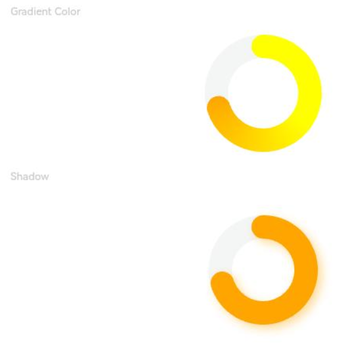
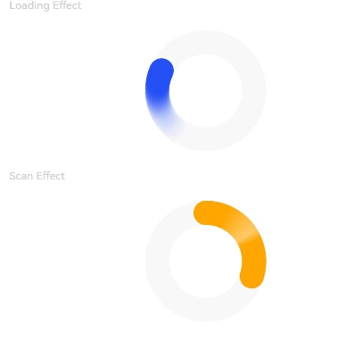
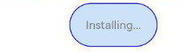
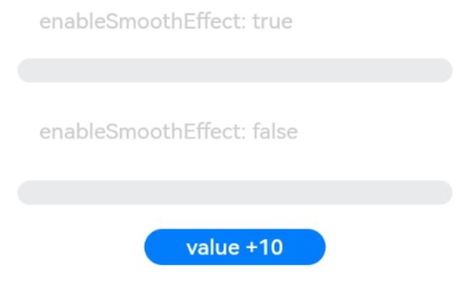
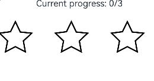

# Progress

The **Progress** component represents a progress indicator that displays the progress of content loading or an operation.

>  **NOTE**
>
>  This component is supported since API version 7. Updates will be marked with a superscript to indicate their earliest API version.


## Child Components

Not supported

## APIs

Progress(options: ProgressOptions)

Creates a progress indicator.

**Widget capability**: This API can be used in ArkTS widgets since API version 9.

**Atomic service API**: This API can be used in atomic services since API version 11.

**System capability**: SystemCapability.ArkUI.ArkUI.Full

**Parameters**

| Name| Type| Mandatory| Description|
| -------- | -------- | -------- | -------- |
| options |  [ProgressOptions](#progressoptionstype)| Yes| Options of the progress indicator, which vary by progress indicator type.|

## ProgressOptions\<Type\>

**Atomic service API**: This API can be used in atomic services since API version 11.

**System capability**: SystemCapability.ArkUI.ArkUI.Full

| Name                       | Type                               | Mandatory  | Description                                    |
| -------------------------- | ----------------------------------- | ---- | ---------------------------------------- |
| value                      | number                              | Yes   | Current progress. If the value is less than 0, the value **0** is used. If the value is greater than that of **total**, the value of **total** is used.<br>Default value: **0**<br>**Widget capability**: This API can be used in ArkTS widgets since API version 9.|
| total                      | number                              | No   | Total progress. If this parameter is set to a value less than or equal to 0, the value **100** is used.<br>Default value: **100**<br>**Widget capability**: This API can be used in ArkTS widgets since API version 9.|
| type<sup>8+</sup>          | [ProgressType](#progresstype8)   | No   | Style of the progress indicator.<br>Default value: **ProgressType.Linear**<br>**Widget capability**: This API can be used in ArkTS widgets since API version 9.|
| style<sup>(deprecated)</sup> | [ProgressStyle](#progressstyle) | No   | Style of the progress indicator.<br>This parameter is deprecated since API version 8. You are advised to use **type** instead.<br>Default value: **ProgressStyle.Linear**|

## ProgressType<sup>8+</sup>

**Widget capability**: This API can be used in ArkTS widgets since API version 9.

**Atomic service API**: This API can be used in atomic services since API version 11.

**System capability**: SystemCapability.ArkUI.ArkUI.Full

| Name                    | Description                                    |
| ---------------------- | ---------------------------------------- |
| Linear                 | Linear style. Since API version 9, the progress indicator adaptively switches to vertical layout if the height is greater than the width.  |
| Ring      | Indeterminate ring style. The ring fills up as the progress increases.                |
| Eclipse  | Eclipse style, which visualizes the progress in a way similar to the moon waxing from new to full.        |
| ScaleRing | Determinate ring style, which is similar to the clock scale. Since API version 9, when the outer circles of scales overlap, the progress indicator is automatically converted to the **Ring** style.|
| Capsule   | Capsule style. At both ends, the progress indicator works in a same manner as the eclipse style. In the middle part of the capsule, the progress indicator works in a same manner as the linear style. If the height is greater than the width, the progress indicator adaptively switches to vertical layout.|

##  ProgressStyle

**Widget capability**: This API can be used in ArkTS widgets since API version 9.

**Atomic service API**: This API can be used in atomic services since API version 11.

**System capability**: SystemCapability.ArkUI.ArkUI.Full

| Name       | Description                                    |
| --------- | ---------------------------------------- |
| Linear    | Linear style.                                   |
| Ring<sup>8+</sup>      | Indeterminate ring style. The ring fills up as the progress increases.                |
| Eclipse   | Eclipse style, which visualizes the progress in a way similar to the moon waxing from new to full.        |
| ScaleRing<sup>8+</sup> | Determinate ring style, which is similar to the clock scale.              |
| Capsule<sup>8+</sup>   | Capsule style. At both ends, the progress indicator works in a same manner as the eclipse style. In the middle part of the capsule, the progress indicator works in a same manner as the linear style. If the height is greater than the width, the progress indicator adaptively switches to vertical layout.|

##  ProgressStyleMap

**Atomic service API**: This API can be used in atomic services since API version 11.

**System capability**: SystemCapability.ArkUI.ArkUI.Full

| Name       | Type                                     |
| --------- | ---------------------------------------- |
| ProgressType.Linear | [LinearStyleOptions<sup>10+</sup>](#linearstyleoptions10)  \|  [ProgressStyleOptions<sup>8+</sup>](#progressstyleoptions8)  |
ProgressType.Ring | [RingStyleOptions<sup>10+</sup>](#ringstyleoptions10)  \|  [ProgressStyleOptions<sup>8+</sup>](#progressstyleoptions8)  |
ProgressType.Eclipse | [EclipseStyleOptions<sup>10+</sup>](#eclipsestyleoptions10)   \|  [ProgressStyleOptions<sup>8+</sup>](#progressstyleoptions8)  |
ProgressType.ScaleRing| [ScaleRingStyleOptions<sup>10+</sup>](#scaleringstyleoptions10)  \|  [ProgressStyleOptions<sup>8+</sup>](#progressstyleoptions8)  |
ProgressType.Capsule | [CapsuleStyleOptions<sup>10+</sup>](#capsulestyleoptions10)  \|  [ProgressStyleOptions<sup>8+</sup>](#progressstyleoptions8) 

## Attributes

In addition to the [universal attributes](ts-universal-attributes-size.md), the following attributes are supported.

> **NOTE**
>
> This component overrides the universal attribute [backgroundColor](ts-universal-attributes-background.md). If the attribute is directly applied to the **Progress** component, it changes the background color of the progress indicator itself. To set the background color for the entire **Progress** component area, you'll need to apply **backgroundColor** to the outer container that wraps the **Progress** component.

### value

value(value: number)

Current progress. If the value is less than 0, the value **0** is used. If the value is greater than that of **total**, the value of **total** is used. Invalid values do not take effect.

**Widget capability**: This API can be used in ArkTS widgets since API version 9.

**Atomic service API**: This API can be used in atomic services since API version 11.

**System capability**: SystemCapability.ArkUI.ArkUI.Full

**Parameters**

| Name| Type  | Mandatory| Description        |
| ------ | ------ | ---- | ------------ |
| value  | number | Yes  | Current progress.<br> Default value: **0**|

### color

color(value: ResourceColor | LinearGradient)

Sets the foreground color of the progress indicator.

**LinearGradient** is supported for the **Ring** type since API version 10.

**Widget capability**: This API can be used in ArkTS widgets since API version 9, except that **LinearGradient** is not supported.

**Atomic service API**: This API can be used in atomic services since API version 11.

**System capability**: SystemCapability.ArkUI.ArkUI.Full

**Parameters**

| Name| Type                                                        | Mandatory| Description                                                        |
| ------ | ------------------------------------------------------------ | ---- | ------------------------------------------------------------ |
| value  | [ResourceColor](ts-types.md#resourcecolor) \| [LinearGradient<sup>10+</sup>](ts-basic-components-datapanel.md#lineargradient10) | Yes  | Foreground color of the progress indicator.<br>Default value:<br>- Capsule:<br>   API version 9 or earlier: **'\#ff007dff'**<br>   API version 10: **'\#33006cde'**<br>   API version 11 or later: **'\#33007dff'**<br>- Ring:<br>   API version 9 or earlier: **'\#ff007dff'**<br>   API version 10 or later: start: **'\#ff86c1ff'**, end: **'\#ff254ff7'**<br>- Other styles: **'\#ff007dff'**|

### style<sup>8+</sup>

style(value: ProgressStyleOptions \| CapsuleStyleOptions \| RingStyleOptions \| LinearStyleOptions \| ScaleRingStyleOptions \| EclipseStyleOptions)

Sets the component style.

**System capability**: SystemCapability.ArkUI.ArkUI.Full

**Parameters**

| Name| Type                                                        | Mandatory| Description                                                        |
| ------ | ------------------------------------------------------------ | ---- | ------------------------------------------------------------ |
| value  | [ProgressStyleOptions<sup>8+</sup>](#progressstyleoptions8) \| [CapsuleStyleOptions<sup>10+</sup>](#capsulestyleoptions10) \| <br>[RingStyleOptions<sup>10+</sup>](#ringstyleoptions10) \| [LinearStyleOptions<sup>10+</sup>](#linearstyleoptions10) \| <br>[ScaleRingStyleOptions<sup>10+</sup>](#scaleringstyleoptions10) \| [EclipseStyleOptions<sup>10+</sup>](#eclipsestyleoptions10) | Yes  | Component style.<br>- **CapsuleStyleOptions**: capsule style.<br>- **RingStyleOptions**: ring style.<br>- **LinearStyleOptions**: linear style.<br>- **ScaleRingStyleOptions**: determinate ring style.<br>- **EclipseStyleOptions**: eclipse style.<br>- **ProgressStyleOptions**: basic style.<br>**ProgressStyleOptions** does not support other parameter types currently.|

### contentModifier<sup>12+</sup>
contentModifier(modifier:ContentModifier\<ProgressConfiguration\>)

Creates a content modifier.

**Atomic service API**: This API can be used in atomic services since API version 12.

**System capability**: SystemCapability.ArkUI.ArkUI.Full

**Parameters**
| Name| Type  | Mandatory| Description        |
| ------ | ------ | ---- | ------------ |
| modifier | [ContentModifier\<ProgressConfiguration\>](#progressconfiguration12) | Yes  | Content modifier to apply to the current component.<br>**modifier**: content modifier. You need a custom class to implement the **ContentModifier** API.|

### privacySensitive<sup>12+</sup>

privacySensitive(isPrivacySensitiveMode: Optional\<boolean\>)

Sets whether to enable privacy mode.

**Widget capability**: This API can be used in ArkTS widgets since API version 12.

**Atomic service API**: This API can be used in atomic services since API version 12.

**System capability**: SystemCapability.ArkUI.ArkUI.Full

**Parameters**

| Name| Type                                                     | Mandatory| Description                                                 |
| ------ | --------------------------------------------------------- | ---- | ----------------------------------------------------- |
| isPrivacySensitiveMode  | [Optional\<boolean\>] | Yes  | Whether to enable privacy mode, in which the progress is cleared and the text is obscured.<br>**NOTE**<br>If this parameter is set to **null**, privacy mode is disabled.<br>[Enabling privacy mode requires widget framework support.](./ts-universal-attributes-obscured.md) |

## ProgressConfiguration<sup>12+</sup>

**Atomic service API**: This API can be used in atomic services since API version 12.

**System capability**: SystemCapability.ArkUI.ArkUI.Full

| Name| Type | Mandatory|Description        |
| ------ | ------ | ------- |------------|
| value  | number | Yes| Current progress.|
| total  | number | Yes| Indicates the total progress.  |

## CommonProgressStyleOptions<sup>10+</sup>

**Atomic service API**: This API can be used in atomic services since API version 11.

**System capability**: SystemCapability.ArkUI.ArkUI.Full

| Name         | Type                     | Mandatory| Description                                                                                       |
| ------------ | ---------------------------- | ---- | ------------------------------------------------------------------------------------------ |
| enableSmoothEffect | boolean | No| Whether to enable the smooth effect. When this effect is enabled, the progress changes smoothly from the current value to the target value. When this effect is disabled, the progress changes abruptly to the target value.<br>Default value: **true**|

## ScanEffectOptions<sup>10+</sup>

**Atomic service API**: This API can be used in atomic services since API version 11.

**System capability**: SystemCapability.ArkUI.ArkUI.Full

| Name         | Type| Mandatory| Description|
| ------------- | ------- | ---- | -------- |
| enableScanEffect | boolean | No| Whether to enable the scan effect.<br>Default value: **false**|

## ProgressStyleOptions<sup>8+</sup>

Inherits [CommonProgressStyleOptions](#commonprogressstyleoptions10).

**Widget capability**: This API can be used in ArkTS widgets since API version 9.

**Atomic service API**: This API can be used in atomic services since API version 11.

**System capability**: SystemCapability.ArkUI.ArkUI.Full

| Name         | Type                     | Mandatory| Description                                                                                       |
| ------------ | ---------------------------- | ---- | ------------------------------------------------------------------------------------------ |
| strokeWidth  | [Length](ts-types.md#length) | No  | Stroke width of the progress indicator. It cannot be set in percentage.<br>Default value: **4.0vp**                                           |
| scaleCount   | number                       | No  | Number of divisions on the ring-style process indicator.<br>Default value: **120**                                                       |
| scaleWidth   | [Length](ts-types.md#length) | No  | Scale width of the ring-style progress bar. It cannot be set in percentage. If it is greater than the value of **strokeWidth**, the default scale width is used.<br>Default value: **2.0vp**|

## CapsuleStyleOptions<sup>10+</sup>

Inherits [ScanEffectOptions](#scaneffectoptions10) and [CommonProgressStyleOptions](#commonprogressstyleoptions10).

**Atomic service API**: This API can be used in atomic services since API version 11.

**System capability**: SystemCapability.ArkUI.ArkUI.Full

| Name         | Type| Mandatory| Description|
| ------------- | ------- | ---- | -------- |
| borderColor | [ResourceColor](ts-types.md#resourcecolor) | No| Border color.<br>Default value:<br>API version 10: **'\#33006cde'**<br>API version 11 or later: **'\#33007dff'**|
| borderWidth | [Length](ts-types.md#length) | No| Border width. It cannot be set in percentage.<br>Default value: **1vp**|
| content | string | No| Text content, which can be customized .|
| font | [Font](ts-types.md#font) | No| Text style.<br>Default value:<br>- Font size (cannot be set in percentage): **12fp**<br>- Other attributes: following the settings of the **Text** component.|
| fontColor | [ResourceColor](ts-types.md#resourcecolor) | No| Font color.<br>Default value: **'\#ff182431'**|
| showDefaultPercentage | boolean | No| Whether to show the percentage of the current progress. This attribute does not take effect when the **content** attribute is set.<br>Default value: **false**|
| borderRadius<sup>18+</sup> |  [LengthMetrics](../js-apis-arkui-graphics.md#lengthmetrics12) | No| Corner radius. The value cannot be set in percentage.<br>Value range: [0, height/2]<br> Default value: height/2<br>If an invalid value is set, the default value is used.|

## RingStyleOptions<sup>10+</sup>

Inherits [ScanEffectOptions](#scaneffectoptions10) and [CommonProgressStyleOptions](#commonprogressstyleoptions10).

**Atomic service API**: This API can be used in atomic services since API version 11.

**System capability**: SystemCapability.ArkUI.ArkUI.Full

| Name          | Type                     | Mandatory| Description                                                                                       |
| ------------- | ---------------------------- | ---- | ------------------------------------------------------------------------------------------ |
| strokeWidth   | [Length](ts-types.md#length) | No  | Stroke width of the progress indicator. It cannot be set in percentage. A value greater than or equal to the radius evaluates to half of the radius.<br>Default value: **4.0vp**|
| shadow        | boolean                      | No  | Whether to enable the shadow effect.<br>Default value: **false**                                                            |
| status        | [ProgressStatus<sup>10+</sup>](#progressstatus10) | No| Status of the progress indicator. When this parameter is set to **LOADING**, the check update animation is played, and the **value** settings do not take effect. When the value changes from **LOADING** to **PROGRESSING**, the check update animation stops when it has reached the end state.<br>Default value: **ProgressStatus.PROGRESSING**|

## LinearStyleOptions<sup>10+</sup>

Inherits [ScanEffectOptions](#scaneffectoptions10) and [CommonProgressStyleOptions](#commonprogressstyleoptions10).

**Atomic service API**: This API can be used in atomic services since API version 11.

**System capability**: SystemCapability.ArkUI.ArkUI.Full

| Name          | Type                     | Mandatory| Description                                                                                       |
| ------------- | ---------------------------- | ---- | ------------------------------------------------------------------------------------------ |
| strokeWidth   | [Length](ts-types.md#length) | No  | Stroke width of the progress indicator. It cannot be set in percentage.<br>Default value: **4.0vp**|
| strokeRadius   | [PX](ts-types.md#px10)    \| [VP](ts-types.md#vp10)    \| [LPX](ts-types.md#lpx10)    \| [Resource](ts-types.md#resource)| No  | Corner radius of the progress indicator.<br>Value range: [0, strokeWidth/2] Default value: **strokeWidth/2**|

## ScaleRingStyleOptions<sup>10+</sup>

Inherits [CommonProgressStyleOptions](#commonprogressstyleoptions10).

**Atomic service API**: This API can be used in atomic services since API version 11.

**System capability**: SystemCapability.ArkUI.ArkUI.Full

| Name         | Type                     | Mandatory| Description                                                                                       |
| ------------ | ---------------------------- | ---- | ------------------------------------------------------------------------------------------ |
| strokeWidth  | [Length](ts-types.md#length) | No  | Stroke width of the progress indicator. It cannot be set in percentage.<br>Default value: **4.0vp**                                           |
| scaleCount   | number                       | No  | Number of divisions on the ring-style process indicator.<br>Default value: **120**                                                       |
| scaleWidth   | [Length](ts-types.md#length) | No  | Scale width of the ring-style progress bar. It cannot be set in percentage. If it is greater than the value of **strokeWidth**, the default scale width is used.<br>Default value: **2.0vp**|

## EclipseStyleOptions<sup>10+</sup>

Inherits [CommonProgressStyleOptions](#commonprogressstyleoptions10).

**Atomic service API**: This API can be used in atomic services since API version 11.

**System capability**: SystemCapability.ArkUI.ArkUI.Full

## ProgressStatus<sup>10+</sup>

**Atomic service API**: This API can be used in atomic services since API version 11.

**System capability**: SystemCapability.ArkUI.ArkUI.Full

| Name                   | Description     |
| ----------------------- | ---------------- |
| LOADING  | Loading.|
| PROGRESSING | The progress is being updated.|

## Events

The [universal events](ts-universal-events-click.md) are supported.

## Example

### Example 1: Setting Progress Indicator Types

This example demonstrates how to set different types of progress indicators using the **type** attribute.

```ts
// xxx.ets
@Entry
@Component
struct ProgressExample {
  build() {
    Column({ space: 15 }) {
      Text('Linear Progress').fontSize(9).fontColor(0xCCCCCC).width('90%')
      Progress({ value: 10, type: ProgressType.Linear }).width(200)
      Progress({ value: 20, total: 150, type: ProgressType.Linear }).color(Color.Grey).value(50).width(200)


      Text('Eclipse Progress').fontSize(9).fontColor(0xCCCCCC).width('90%')
      Row({ space: 40 }) {
        Progress({ value: 10, type: ProgressType.Eclipse }).width(100)
        Progress({ value: 20, total: 150, type: ProgressType.Eclipse }).color(Color.Grey).value(50).width(100)
      }

      Text('ScaleRing Progress').fontSize(9).fontColor(0xCCCCCC).width('90%')
      Row({ space: 40 }) {
        Progress({ value: 10, type: ProgressType.ScaleRing }).width(100)
        Progress({ value: 20, total: 150, type: ProgressType.ScaleRing })
          .color(Color.Grey).value(50).width(100)
          .style({ strokeWidth: 15, scaleCount: 15, scaleWidth: 5 })
      }

      // scaleCount vs. scaleWidth
      Row({ space: 40 }) {
        Progress({ value: 20, total: 150, type: ProgressType.ScaleRing })
          .color(Color.Grey).value(50).width(100)
          .style({ strokeWidth: 20, scaleCount: 20, scaleWidth: 5 })
        Progress({ value: 20, total: 150, type: ProgressType.ScaleRing })
          .color(Color.Grey).value(50).width(100)
          .style({ strokeWidth: 20, scaleCount: 30, scaleWidth: 3 })
      }

      Text('Ring Progress').fontSize(9).fontColor(0xCCCCCC).width('90%')
      Row({ space: 40 }) {
        Progress({ value: 10, type: ProgressType.Ring }).width(100)
        Progress({ value: 20, total: 150, type: ProgressType.Ring })
          .color(Color.Grey).value(50).width(100)
          .style({ strokeWidth: 20 })
      }

      Text('Capsule Progress').fontSize(9).fontColor(0xCCCCCC).width('90%')
      Row({ space: 40 }) {
        Progress({ value: 10, type: ProgressType.Capsule }).width(100).height(50)
        Progress({ value: 20, total: 150, type: ProgressType.Capsule })
          .color(Color.Grey)
          .value(50)
          .width(100)
          .height(50)
      }
    }.width('100%').margin({ top: 30 })
  }
}
```


### Example 2: Setting Ring Progress Indicator Attributes

This example demonstrates how to set attributes of a ring progress indicator using the **strokeWidth** and **shadow** properties in the **style** API.

```ts
// xxx.ets
@Entry
@Component
struct ProgressExample {
  private gradientColor: LinearGradient = new LinearGradient([{ color: Color.Yellow, offset: 0.5 },
    { color: Color.Orange, offset: 1.0 }])

  build() {
    Column({ space: 15 }) {
      Text('Gradient Color').fontSize(9).fontColor(0xCCCCCC).width('90%')
      Progress({ value: 70, total: 100, type: ProgressType.Ring })
        .width(100).style({ strokeWidth: 20 })
        .color(this.gradientColor)

      Text('Shadow').fontSize(9).fontColor(0xCCCCCC).width('90%')
      Progress({ value: 70, total: 100, type: ProgressType.Ring })
        .width(120).color(Color.Orange)
        .style({ strokeWidth: 20, shadow: true })
    }.width('100%').padding({ top: 5 })
  }
}
```


### Example 3: Setting the Animation for the Ring Progress Indicator

This example demonstrates how to enable or disable animations for a ring progress indicator using the **status** and **enableScanEffect** properties in the **style** API.

```ts
// xxx.ets
@Entry
@Component
struct ProgressExample {
  build() {
    Column({ space: 15 }) {
      Text('Loading Effect').fontSize(9).fontColor(0xCCCCCC).width('90%')
      Progress({ value: 0, total: 100, type: ProgressType.Ring })
        .width(100).color(Color.Blue)
        .style({ strokeWidth: 20, status: ProgressStatus.LOADING })

      Text('Scan Effect').fontSize(9).fontColor(0xCCCCCC).width('90%')
      Progress({ value: 30, total: 100, type: ProgressType.Ring })
        .width(100).color(Color.Orange)
        .style({ strokeWidth: 20, enableScanEffect: true })
    }.width('100%').padding({ top: 5 })
  }
}
```


### Example 4: Setting Capsule Progress Indicator Attributes

This example demonstrates how to set attributes for a capsule progress indicator using properties such as **borderColor**, **borderWidth**, and **content** in the **style** API.

```ts
// xxx.ets
@Entry
@Component
struct ProgressExample {
  build() {
    Column({ space: 15 }) {
      Row({ space: 40 }) {
        Progress({ value: 100, total: 100, type: ProgressType.Capsule }).width(100).height(50)
          .style({
            borderColor: Color.Blue,
            borderWidth: 1,
            content: 'Installing...',
            font: { size: 13, style: FontStyle.Normal },
            fontColor: Color.Gray,
            enableScanEffect: false,
            showDefaultPercentage: false
          })
      }
    }.width('100%').padding({ top: 5 })
  }
}
```


### Example 5: Setting the Smooth Effect

This example demonstrates how to enable or disable the smooth effect for the progress animation using the **enableSmoothEffect** property in the **style** API.

```ts
// xxx.ets
@Entry
@Component
struct Index {
  @State value: number = 0

  build() {
    Column({ space: 10 }) {
      Text('enableSmoothEffect: true')
        .fontSize(9)
        .fontColor(0xCCCCCC)
        .width('90%')
        .margin(5)
        .margin({ top: 20 })
      Progress({ value: this.value, total: 100, type: ProgressType.Linear })
        .style({ strokeWidth: 10, enableSmoothEffect: true })

      Text('enableSmoothEffect: false').fontSize(9).fontColor(0xCCCCCC).width('90%').margin(5)
      Progress({ value: this.value, total: 100, type: ProgressType.Linear })
        .style({ strokeWidth: 10, enableSmoothEffect: false })

      Button('value +10').onClick(() => {
        this.value += 10
      })
        .width(75)
        .height(15)
        .fontSize(9)
    }
    .width('50%')
    .height('100%')
    .margin({ left: 20 })
  }
}

```


### Example 6: Setting the Custom Content Area

This example implements a custom progress indicator using the **contentModifier** API. This progress indicator displays a star shape with a total progress of **3**, and the current value can be incremented or decremented through buttons. The achieved progress is filled with a custom color.

```ts
// xxx.ets
class MyProgressModifier implements ContentModifier<ProgressConfiguration> {
  color: Color = Color.White

  constructor(color: Color) {
    this.color = color
  }

  applyContent(): WrappedBuilder<[ProgressConfiguration]> {
    return wrapBuilder(myProgress)
  }
}

@Builder
function myProgress(config: ProgressConfiguration) {

  Column({ space: 30 }) {
    Text("Current progress: " + config.value + "/" + config.total).fontSize(20)
    Row() {
      Flex({ justifyContent: FlexAlign.SpaceBetween }) {
        Path()
          .width('30%')
          .height('30%')
          .commands('M108 0 L141 70 L218 78.3 L162 131 L175 205 L108 170 L41.2 205 L55 131 L1 78 L75 68 L108 0 Z')
          .fill(config.enabled && config.value >= 1 ? (config.contentModifier as MyProgressModifier).color :
          Color.White)
          .stroke(Color.Black)
          .strokeWidth(3)
        Path()
          .width('30%')
          .height('30%')
          .commands('M108 0 L141 70 L218 78.3 L162 131 L175 205 L108 170 L41.2 205 L55 131 L1 78 L75 68 L108 0 Z')
          .fill(config.enabled && config.value >= 2 ? (config.contentModifier as MyProgressModifier).color :
          Color.White)
          .stroke(Color.Black)
          .strokeWidth(3)
        Path()
          .width('30%')
          .height('30%')
          .commands('M108 0 L141 70 L218 78.3 L162 131 L175 205 L108 170 L41.2 205 L55 131 L1 78 L75 68 L108 0 Z')
          .fill(config.enabled && config.value >= 3 ? (config.contentModifier as MyProgressModifier).color :
          Color.White)
          .stroke(Color.Black)
          .strokeWidth(3)
      }.width('100%')
    }
  }.margin({ bottom: 100 })
}

@Entry
@Component
struct Index {
  @State currentValue: number = 0
  modifier = new MyProgressModifier(Color.Red)
  @State myModifier: (MyProgressModifier | undefined) = this.modifier

  build() {
    Column() {
      Progress({ value: this.currentValue, total: 3, type: ProgressType.Ring }).contentModifier(this.modifier)
      Button('Progress++').onClick(() => {
        if (this.currentValue < 3) {
          this.currentValue += 1
        }
      }).width('30%')
      Button('addProgress--').onClick(() => {
        if (this.currentValue > 0) {
          this.currentValue -= 1
        }
      }).width('30%')
    }.width('100%').height('100%')
  }
}

```


### Example 7: Securing Sensitive Information

This example illustrates how to secure sensitive information using the **privacySensitive** attribute. Note that the display requires widget framework support.

```ts
@Entry
@Component
struct ProgressExample {
  build() {
    Scroll() {
      Column({ space: 15 }) {
        Row() {
          Progress({ value: 50, total: 100, type: ProgressType.Capsule }).width(100).height(50)
            .style({
              borderColor: Color.Blue,
              borderWidth: 1,
              content: 'Installing...',
              font: { size: 13, style: FontStyle.Normal },
              fontColor: Color.Gray,
              enableScanEffect: false,
              showDefaultPercentage: true
            })
            .privacySensitive(true)
        }
      }
    }
  }
}
```


### Example 8: Setting Capsule Progress Indicator Border Radius

This example demonstrates how to set the border corner radius of a capsule progress indicator using the **borderRadius** property.

```ts
import { LengthMetrics } from '@kit.ArkUI';

@Entry
@Component
struct ProgressExample {
  build() {
    Column({ space: 15 }) {
      Text('Capsule Progress').fontSize(9).width('90%')
      Row({ space: 15 }) {
        Progress({ value: 30, total: 100, type: ProgressType.Capsule })
          .style({ content: "Default radius", borderWidth: 5 })
          .width(100)
          .height(60)
      }

      Row({ space: 15 }) {
        Progress({ value: 30, total: 100, type: ProgressType.Capsule })
          .style({ content: "Radius 20 vp", borderWidth: 5, borderRadius: LengthMetrics.vp(20) })
          .width(100)
          .height(60)
      }
    }
    .width('100%')
    .margin({ top: 30 })
  }
}

```

