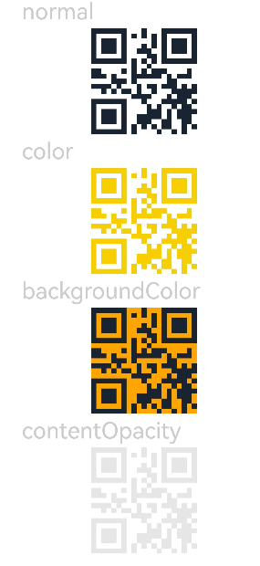

# QRCode

The **QRCode** component is used to display a QR code.

>  **NOTE**
>
> This component is supported since API version 7. Updates will be marked with a superscript to indicate their earliest API version.
> 
> The pixel count of the **QRCode** component is subject to the content. If the component size is not large enough, the content may fail to be displayed. In this case, you need to resize the component.


## Child Components

Not supported


## APIs

QRCode(value: string)

**Widget capability**: This API can be used in ArkTS widgets since API version 9.

**Atomic service API**: This API can be used in atomic services since API version 11.

**System capability**: SystemCapability.ArkUI.ArkUI.Full

**Parameters**

| Name| Type| Mandatory| Description|
| -------- | -------- | -------- | -------- |
| value | string | Yes| Content of the QR code. A maximum of 512 characters are supported. If this limit is exceeded, the first 512 characters are used.<br>**NOTE**<br>The value must be valid. It cannot be **null**, **undefined**, or empty content, as otherwise the QR code generated will be invalid.|

## Attributes

In addition to the [universal attributes](ts-component-general-attributes.md), the following attributes are supported.

### color

color(value: ResourceColor)

Sets the color of the QR code.

**Widget capability**: This API can be used in ArkTS widgets since API version 9.

**Atomic service API**: This API can be used in atomic services since API version 11.

**System capability**: SystemCapability.ArkUI.ArkUI.Full

**Parameters**

| Name| Type                                      | Mandatory| Description        |
| ------ | ------------------------------------------ | ---- | ------------ |
| value  | [ResourceColor](ts-types.md#resourcecolor) | Yes  | QR code color. The default value is **'#ff000000'** and does not change with the system color mode.<br>|

### backgroundColor

backgroundColor(value: ResourceColor)

Sets the background color of the QR code.

**Widget capability**: This API can be used in ArkTS widgets since API version 9.

**Atomic service API**: This API can be used in atomic services since API version 11.

**System capability**: SystemCapability.ArkUI.ArkUI.Full

**Parameters**

| Name| Type                                      | Mandatory| Description                                                        |
| ------ | ------------------------------------------ | ---- | ------------------------------------------------------------ |
| value  | [ResourceColor](ts-types.md#resourcecolor) | Yes  | Background color of the QR code.<br>Default value: **Color.White**<br>Since API version 11, the default value is **'#ffffffff'** and does not change with the system color mode.|

### contentOpacity<sup>11+</sup>

contentOpacity(value: number | Resource)

Sets the opacity of the QR code content. The minimum value is 0, and the maximum value is 1.

**Atomic service API**: This API can be used in atomic services since API version 12.

**System capability**: SystemCapability.ArkUI.ArkUI.Full

**Parameters**

| Name| Type                                                | Mandatory| Description                                    |
| ------ | ---------------------------------------------------- | ---- | ---------------------------------------- |
| value  | number \| [Resource](ts-types.md#resource) | Yes  | Opacity of the QR code content.<br>Default value: **1**<br>Value range: [0, 1]. If the value is out of the range, the default value is used.|


## Events

Among the universal events, the [click event](ts-universal-events-click.md), [touch event](ts-universal-events-touch.md), and [show/hide event](ts-universal-events-show-hide.md) are supported.


## Example

This example demonstrates the basic usage of the **QRCode** component. It shows how to set the QR code color using the **color** attribute, the background color using the **backgroundColor** attribute, and the opacity using the **contentOpacity** attribute.

```ts
// xxx.ets
@Entry
@Component
struct QRCodeExample {
  private value: string = 'hello world'

  build() {
    Column({ space: 5 }) {
      Text('normal').fontSize(9).width('90%').fontColor(0xCCCCCC).fontSize(30)
      QRCode(this.value).width(140).height(140)

      // Set the color of the QR code.
      Text('color').fontSize(9).width('90%').fontColor(0xCCCCCC).fontSize(30)
      QRCode(this.value).color(0xF7CE00).width(140).height(140)

      // Set the background color of the QR code.
      Text('backgroundColor').fontSize(9).width('90%').fontColor(0xCCCCCC).fontSize(30)
      QRCode(this.value).width(140).height(140).backgroundColor(Color.Orange)

      // Set the opacity of QR code content.
      Text('contentOpacity').fontSize(9).width('90%').fontColor(0xCCCCCC).fontSize(30)
      QRCode(this.value).width(140).height(140).color(Color.Black).contentOpacity(0.1)
    }.width('100%').margin({ top: 5 })
  }
}
```


