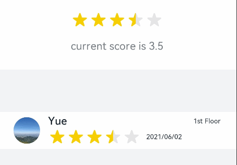
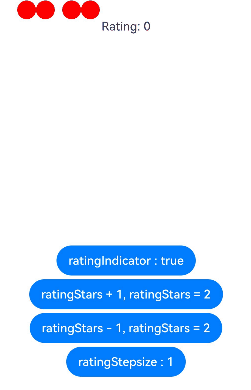

# Rating

The **Rating** component provides a rating bar.

>  **NOTE**
>
>  This component is supported since API version 7. Updates will be marked with a superscript to indicate their earliest API version.


## Child Components

Not supported


## APIs

Rating(options?: RatingOptions)

**Widget capability**: This API can be used in ArkTS widgets since API version 9.

**Atomic service API**: This API can be used in atomic services since API version 11.

**System capability**: SystemCapability.ArkUI.ArkUI.Full

**Parameters**

| Name | Type                                     | Mandatory| Description          |
| ------- | ----------------------------------------- | ---- | -------------- |
| options | [RatingOptions](#ratingoptions18) | No  | Rating bar options.|

## Attributes

### stars

stars(value: number)

Sets the total number of ratings (stars). If the value set is less than or equal to 0, the default value is used.

**Widget capability**: This API can be used in ArkTS widgets since API version 9.

**Atomic service API**: This API can be used in atomic services since API version 11.

**System capability**: SystemCapability.ArkUI.ArkUI.Full

**Parameters**

| Name| Type  | Mandatory| Description                        |
| ------ | ------ | ---- | ---------------------------- |
| value  | number | Yes  | Total number of ratings.<br>Default value: **5**|

### stars<sup>18+</sup>

stars(starCount: Optional\<number>)

Sets the total number of ratings (stars). If the value set is less than or equal to 0, the default value is used. Compared with [stars](#stars), this API supports the **undefined** type for the **starCount** parameter.

**Widget capability**: This API can be used in ArkTS widgets since API version 18.

**Atomic service API**: This API can be used in atomic services since API version 18.

**System capability**: SystemCapability.ArkUI.ArkUI.Full

**Parameters**

| Name   | Type                                                        | Mandatory| Description                                                      |
| --------- | ------------------------------------------------------------ | ---- | ---------------------------------------------------------- |
| starCount | [Optional](ts-universal-attributes-custom-property.md#optional12)\<number> | Yes  | Total number of ratings.<br>If **starCount** is set to **undefined**, the default value **5** is used.|

### stepSize

stepSize(value: number)

Sets the step for rating. A value less than 0.1 evaluates to the default value.

**Widget capability**: This API can be used in ArkTS widgets since API version 9.

**Atomic service API**: This API can be used in atomic services since API version 11.

**System capability**: SystemCapability.ArkUI.ArkUI.Full

**Parameters**

| Name| Type  | Mandatory| Description                                                       |
| ------ | ------ | ---- | ----------------------------------------------------------- |
| value  | number | Yes  | Step for rating.<br>Default value: **0.5**<br>Value range: [0.1, stars]|

### stepSize<sup>18+</sup>

stepSize(size: Optional\<number>)

Sets the step for rating. A value less than 0.1 evaluates to the default value. Compared with [stepSize](#stepsize), this API supports the **undefined** type for the **size** parameter.

**Widget capability**: This API can be used in ArkTS widgets since API version 18.

**Atomic service API**: This API can be used in atomic services since API version 18.

**System capability**: SystemCapability.ArkUI.ArkUI.Full

**Parameters**

| Name| Type                                                        | Mandatory| Description                                                        |
| ------ | ------------------------------------------------------------ | ---- | ------------------------------------------------------------ |
| size   | [Optional](ts-universal-attributes-custom-property.md#optional12)\<number> | Yes  | Step for rating.<br>If **size** is set to **undefined**, the default value **0.5** is used.<br>Value range: [0.1, stars]|

### starStyle

starStyle(options: StarStyleOptions)

Sets the star style. For details about the supported image types, see [Image](ts-basic-components-image.md).

Local and online images are supported, but not **PixelMap** and **Resource** objects.

By default, the image is loaded in asynchronous mode. Synchronous loading is not supported.

**Widget capability**: This API can be used in ArkTS widgets since API version 9.

**Atomic service API**: This API can be used in atomic services since API version 11.

**System capability**: SystemCapability.ArkUI.ArkUI.Full

**Parameters**

| Name | Type                                           | Mandatory| Description                                                        |
| ------- | ----------------------------------------------- | ---- | ------------------------------------------------------------ |
| options | [StarStyleOptions](#starstyleoptions18) | Yes  | Star style.<br>**NOTE**<br>If the path specified for **backgroundUri**, **foregroundUri**, or **secondaryUri** is incorrect, no image is displayed.<br>If **backgroundUri** or **foregroundUri** is set to **undefined** or an empty string, the **Rating** component loads the default star image source.<br>If **secondaryUri** is set to **undefined** or an empty string or is not set, **backgroundUri** is prioritized, which is equivalent to where only **foregroundUri** and **backgroundUri** are set.|

### starStyle<sup>18+</sup>

starStyle(options: Optional\<StarStyleOptions>)

Sets the star style. For details about the supported image types, see [Image](ts-basic-components-image.md).

Local and online images are supported, but not **PixelMap** and **Resource** objects.

By default, the image is loaded in asynchronous mode. Synchronous loading is not supported.

Compared with [starStyle](#starstyle), this API supports the **undefined** type for the **options** parameter.

**Widget capability**: This API can be used in ArkTS widgets since API version 18.

**Atomic service API**: This API can be used in atomic services since API version 18.

**System capability**: SystemCapability.ArkUI.ArkUI.Full

**Parameters**

| Name | Type                                                        | Mandatory| Description                                                        |
| ------- | ------------------------------------------------------------ | ---- | ------------------------------------------------------------ |
| options | [Optional](ts-universal-attributes-custom-property.md#optional12)\<[StarStyleOptions](#starstyleoptions18)> | Yes  | Star style.<br>**NOTE**<br>If the path specified for **backgroundUri**, **foregroundUri**, or **secondaryUri** is incorrect, no image is displayed.<br>If **backgroundUri** or **foregroundUri** is set to **undefined** or an empty string, the **Rating** component loads the default star image source.<br>If **secondaryUri** is set to **undefined** or an empty string or is not set, **backgroundUri** is prioritized, which is equivalent to where only **foregroundUri** and **backgroundUri** are set.|

>  **NOTE**
>
>  The drawing area of each rating image is [width/stars, height], wherein **width** and **height** indicate the width and height of the **Rating** component, respectively.
>
>  To specify the drawing area as a square, you are advised to customize the width and height in this format: [height * stars, height], width = height * stars.

### contentModifier<sup>12+</sup>

contentModifier(modifier: ContentModifier\<RatingConfiguration>)

Creates a content modifier.

**Atomic service API**: This API can be used in atomic services since API version 12.

**System capability**: SystemCapability.ArkUI.ArkUI.Full

**Parameters**

| Name| Type                                         | Mandatory| Description                                            |
| ------ | --------------------------------------------- | ---- | ------------------------------------------------ |
| modifier  | [ContentModifier\<RatingConfiguration>](#ratingconfiguration12) | Yes  | Content modifier to apply to the current component.<br>**modifier**: content modifier. You need a custom class to implement the **ContentModifier** API.|

### contentModifier<sup>18+</sup>

contentModifier(modifier: Optional<ContentModifier\<RatingConfiguration>>)

Creates a content modifier. Compared with [contentModifier](#contentmodifier12), this API supports the **undefined** type for the **modifier** parameter.

**Atomic service API**: This API can be used in atomic services since API version 18.

**System capability**: SystemCapability.ArkUI.ArkUI.Full

**Parameters**

| Name  | Type                                                        | Mandatory| Description                                                        |
| -------- | ------------------------------------------------------------ | ---- | ------------------------------------------------------------ |
| modifier | [Optional](ts-universal-attributes-custom-property.md#optional12)\<[ContentModifier\<RatingConfiguration>](#ratingconfiguration12)> | Yes  | Content modifier to apply to the current component.<br>**modifier**: content modifier. You need a custom class to implement the **ContentModifier** API.<br>If **modifier** is set to **undefined**, no content modifier is used.|

## Events

### onChange

onChange(callback:(value: number) =&gt; void)

Triggered when the rating value changes.

**Widget capability**: This API can be used in ArkTS widgets since API version 9.

**Atomic service API**: This API can be used in atomic services since API version 11.

**System capability**: SystemCapability.ArkUI.ArkUI.Full

**Parameters**

| Name| Type  | Mandatory| Description          |
| ------ | ------ | ---- | -------------- |
| value  | number | Yes  | Rating value.|

### onChange<sup>18+</sup>

onChange(callback:Optional\<OnRatingChangeCallback>)

Triggered when the rating value changes. Compared with [onChange](#onchange), this API supports the **undefined** type for the **callback** parameter.

**Widget capability**: This API can be used in ArkTS widgets since API version 18.

**Atomic service API**: This API can be used in atomic services since API version 18.

**System capability**: SystemCapability.ArkUI.ArkUI.Full

**Parameters**

| Name  | Type                                                        | Mandatory| Description                                                        |
| -------- | ------------------------------------------------------------ | ---- | ------------------------------------------------------------ |
| callback | [Optional](ts-universal-attributes-custom-property.md#optional12)\<[OnRatingChangeCallback](#onratingchangecallback18)> | Yes  | Triggered when the rating value changes.<br>If **callback** is set to **undefined**, the callback function is not used.|

## OnRatingChangeCallback<sup>18+</sup>

type OnRatingChangeCallback = (rating: number) => void

Triggered when the rating value changes.

**Atomic service API**: This API can be used in atomic services since API version 18.

**System capability**: SystemCapability.ArkUI.ArkUI.Full

**Parameters**

| Name| Type  | Mandatory| Description          |
| ------ | ------ | ---- | -------------- |
| rating | number | Yes  | Rating value.|

## Sequential Keyboard Navigation Specifications                                   
| Key        | Description                       |
|------------|-----------------------------|
| Tab        | Switch the focus between components.                   |
| Left and right arrow keys  | Increase or decrease the rating on preview at the specified step, without changing the actual rating.|
| Home       | Move the focus to the first star, without changing the actual rating.         |
| End        | Move the focus to the last star, without changing the actual rating.        |
| Space/Enter | Submit the rating result based on the current rating.              |

## RatingConfiguration<sup>12+</sup>

You need a custom class to implement the **ContentModifier** API.

**Atomic service API**: This API can be used in atomic services since API version 12.

**System capability**: SystemCapability.ArkUI.ArkUI.Full

| Name | Type   |    Read Only   |    Optional     |  Description             |
| ------ | ------ | ------ |-------------------------------- |-------------------------------- |
| rating    | number  | No| No| Value to rate.<br>Default value: **0**<br>Value range: [0, stars]<br>Values less than 0 are treated as **0**, and values greater than the value of [stars](#stars) are treated as the value of **stars**.<br>This parameter supports two-way binding through [$$](../../../ui/state-management/arkts-two-way-sync.md).<br>This parameter supports two-way binding through [!!](../../../ui/state-management/arkts-new-binding.md).|
| indicator | boolean | No| No| Whether the rating bar is used as an indicator.<br>**true**: The rating bar is used as an indicator.<br>**false**: The rating bar is not used as an indicator.<br>Default value: **false**|
| stars | number | No| No|Total number of ratings.<br>Default value: **5**|
| stepSize | number | No| No|Step of an operation.<br>Default value: **0.5**|
| triggerChange | Callback\<number> | No| No|Callback triggered when the rating value changes.|

## RatingOptions<sup>18+</sup>

**Widget capability**: This API can be used in ArkTS widgets since API version 18.

**Atomic service API**: This API can be used in atomic services since API version 18.

**System capability**: SystemCapability.ArkUI.ArkUI.Full

| Name                  | Type   | Mandatory| Description                                                        |
| ---------------------- | ------- | ---- | ------------------------------------------------------------ |
| rating<sup>7+</sup>    | number  | Yes  | Value to rate.<br>Default value: **0**<br>Value range: [0, stars]<br>Values less than 0 are treated as **0**, and values greater than the value of [stars](#stars) are treated as the value of **stars**.<br>This parameter supports two-way binding through [$$](../../../ui/state-management/arkts-two-way-sync.md).<br>**Widget capability**: This API can be used in ArkTS widgets since API version 9.<br>**Atomic service API**: This API can be used in atomic services since API version 11.|
| indicator<sup>7+</sup> | boolean | No  | Whether the component is used only as an indicator.<br>Default value: **false**<br>**NOTE**<br>When **indicator** is set to **true**, the default component height is 12.0 vp, and the component width is calculated as follows: Height x Value of **stars**.<br>When **indicator** is set to **false**, the default component height is 28.0 vp, and the component width is calculated as follows: Height x Value of **stars**.<br>**Widget capability**: This API can be used in ArkTS widgets since API version 9.<br>**Atomic service API**: This API can be used in atomic services since API version 11.|

## StarStyleOptions<sup>18+</sup>

**Widget capability**: This API can be used in ArkTS widgets since API version 18.

**Atomic service API**: This API can be used in atomic services since API version 18.

**System capability**: SystemCapability.ArkUI.ArkUI.Full

| Name                      | Type  | Mandatory| Description                                                        |
| -------------------------- | ------ | ---- | ------------------------------------------------------------ |
| backgroundUri<sup>7+</sup> | string | Yes  | Image path for the unselected star. You can use the default system image or a custom image.<br>**Widget capability**: This API can be used in ArkTS widgets since API version 9.<br>**Atomic service API**: This API can be used in atomic services since API version 11.|
| foregroundUri<sup>7+</sup> | string | Yes  | Image path for the selected star. You can use the default system image or a custom image.<br>**Widget capability**: This API can be used in ArkTS widgets since API version 9.<br>**Atomic service API**: This API can be used in atomic services since API version 11.|
| secondaryUri<sup>7+</sup>  | string | No  | Image path for the partially selected star. You can use the default system image or a custom image.<br>**Widget capability**: This API can be used in ArkTS widgets since API version 9.<br>**Atomic service API**: This API can be used in atomic services since API version 11.|

## Example

### Example 1: Setting the Default Rating Style

This example demonstrates how to set the default star rating style.

```ts
// xxx.ets
@Entry
@Component
struct RatingExample {
  @State rating: number = 3.5

  build() {
    Column() {
      Column() {
        Rating({ rating: this.rating, indicator: false })
          .stars(5)
          .stepSize(0.5)
          .margin({ top: 24 })
          .onChange((value: number) => {
            this.rating = value
          })
        Text('current score is ' + this.rating)
          .fontSize(16)
          .fontColor('rgba(24,36,49,0.60)')
          .margin({ top: 16 })
      }.width(360).height(113).backgroundColor('#FFFFFF').margin({ top: 68 })

      Row() {
        Image('common/testImage.jpg')
          .width(40)
          .height(40)
          .borderRadius(20)
          .margin({ left: 24 })
        Column() {
          Text('Yue')
            .fontSize(16)
            .fontColor('#182431')
            .fontWeight(500)
          Row() {
            Rating({ rating: 3.5, indicator: false }).margin({ top: 1, right: 8 })
            Text('2021/06/02')
              .fontSize(10)
              .fontColor('#182431')
          }
        }.margin({ left: 12 }).alignItems(HorizontalAlign.Start)

        Text('1st Floor')
          .fontSize(10)
          .fontColor('#182431')
          .position({ x: 295, y: 8 })
      }.width(360).height(56).backgroundColor('#FFFFFF').margin({ top: 64 })
    }.width('100%').height('100%').backgroundColor('#F1F3F5')
  }
}
```



### Example 2: Customizing the Rating Style

This example demonstrates how to configure **starStyle** to use custom image links for stars.

```ts
// xxx.ets
@Entry
@Component
struct RatingExample {
  @State rating: number = 3.5

  build() {
    Column() {
      Rating({ rating: this.rating, indicator: false })
        .stars(5)
        .stepSize(0.5)
        .starStyle({
          backgroundUri: '/common/imag1.png', // The common folder is at the same level as pages.
          foregroundUri: '/common/imag2.png',
          secondaryUri: '/common/imag3.png'
        })
        .margin({ top: 24 })
        .onChange((value: number) => {
          this.rating = value
        })
      Text('current score is ' + this.rating)
        .fontSize(16)
        .fontColor('rgba(24,36,49,0.60)')
        .margin({ top: 16 })
    }.width('100%').height('100%').backgroundColor('#F1F3F5')
  }
}
```


### Example 3: Implementing a Custom Rating Bar
This example implements a custom rating bar, with each circle representing 0.5 point. If **ratingIndicator** is set to **true**, the rating bar is used only as an indicator, and the rating cannot be changed.
if it is set to **false**, the rating can be changed. **ratingStars** sets the rating value. **ratingStepsize** sets the step for rating.

```ts
// xxx.ets
class MyRatingStyle implements ContentModifier<RatingConfiguration> {
  name: string = ""
  style: number = 0
  constructor(value1: string, value2: number) {
    this.name = value1
    this.style = value2
  }
  applyContent() : WrappedBuilder<[RatingConfiguration]> {
    return wrapBuilder(buildRating)
  }
}

@Builder function buildRating(config: RatingConfiguration) {
  Column() {
    Row() {
      Circle({ width: 25, height: 25 })
        .fill(config.rating >= 0.4 ? Color.Black : Color.Red)
        .onClick((event: ClickEvent) => {
          if (!config.indicator) {
            if (config.stepSize = 0.5) {
              config.triggerChange(0.5);
              return
            }
            if (config.stepSize = 1) {
              config.triggerChange(1);
              return
            }
          }
        }).visibility(config.stars >= 1 ? Visibility.Visible : Visibility.Hidden)
      Circle({ width: 25, height: 25 })
        .fill(config.rating >= 0.9 ? Color.Black : Color.Red)
        .onClick((event: ClickEvent) => {
          if (!config.indicator) {
            config.triggerChange(1);
          }
        }).visibility(config.stars >= 1 ? Visibility.Visible : Visibility.Hidden)
      Circle({ width: 25, height: 25 })
        .fill(config.rating >= 1.4 ? Color.Black : Color.Red)
        .onClick((event: ClickEvent) => {
          if (!config.indicator) {
            if (config.stepSize = 0.5) {
              config.triggerChange(1.5);
              return
            }
            if (config.stepSize = 1) {
              config.triggerChange(2);
              return
            }
          }
        }).visibility(config.stars >= 2 ? Visibility.Visible : Visibility.Hidden).margin({left:10})
      Circle({ width: 25, height: 25 })
        .fill(config.rating >= 1.9 ? Color.Black : Color.Red)
        .onClick((event: ClickEvent) => {
          if (!config.indicator) {
            config.triggerChange(2);
          }
        }).visibility(config.stars >= 2 ? Visibility.Visible : Visibility.Hidden)
      Circle({ width: 25, height: 25 })
        .fill(config.rating >= 2.4 ? Color.Black : Color.Red)
        .onClick((event: ClickEvent) => {
          if (!config.indicator) {
            if (config.stepSize = 0.5) {
              config.triggerChange(2.5);
              return
            }
            if (config.stepSize = 1) {
              config.triggerChange(3);
              return
            }
          }
        }).visibility(config.stars >= 3 ? Visibility.Visible : Visibility.Hidden).margin({left:10})
      Circle({ width: 25, height: 25 })
        .fill(config.rating >= 2.9 ? Color.Black : Color.Red)
        .onClick((event: ClickEvent) => {
          if (!config.indicator) {
            config.triggerChange(3);
          }
        }).visibility(config.stars >= 3 ? Visibility.Visible : Visibility.Hidden)
      Circle({ width: 25, height: 25 })
        .fill(config.rating >= 3.4 ? Color.Black : Color.Red)
        .onClick((event: ClickEvent) => {
          if (!config.indicator) {
            if (config.stepSize = 0.5) {
              config.triggerChange(3.5);
              return
            }
            if (config.stepSize = 1) {
              config.triggerChange(4);
              return
            }
          }
        }).visibility(config.stars >= 4 ? Visibility.Visible : Visibility.Hidden).margin({left:10})
      Circle({ width: 25, height: 25 })
        .fill(config.rating >= 3.9 ? Color.Black : Color.Red)
        .onClick((event: ClickEvent) => {
          if (!config.indicator) {
            config.triggerChange(4);
          }
        }).visibility(config.stars >= 4 ? Visibility.Visible : Visibility.Hidden)
      Circle({ width: 25, height: 25 })
        .fill(config.rating >= 4.4 ? Color.Black : Color.Red)
        .onClick((event: ClickEvent) => {
          if (!config.indicator) {
            if (config.stepSize = 0.5) {
              config.triggerChange(4.5);
              return
            }
            if (config.stepSize = 1) {
              config.triggerChange(5);
              return
            }
          }
        }).visibility(config.stars >= 5 ? Visibility.Visible : Visibility.Hidden).margin({left:10})
      Circle({ width: 25, height: 25 })
        .fill(config.rating >= 4.9 ? Color.Black : Color.Red)
        .onClick((event: ClickEvent) => {
          if (!config.indicator) {
            config.triggerChange(5);
          }
        }).visibility(config.stars >= 5 ? Visibility.Visible : Visibility.Hidden)
    }
    Text("Rating: "+ config.rating)
  }
}

@Entry
@Component
struct ratingExample {
  @State rating: number = 0;
  @State ratingIndicator: boolean = true;
  @State ratingStars: number = 0;
  @State ratingStepsize: number = 0.5;
  @State ratingEnabled: boolean = true;
  build() {
    Row() {
      Column() {
        Rating({
          rating: 0,
          indicator: this.ratingIndicator
        })
          .stepSize(this.ratingStepsize)
          .stars(this.ratingStars)
          .backgroundColor(Color.Transparent)
          .width('100%')
          .height(50)
          .onChange((value: number) => {
            console.info('Rating change is'+ value);
            this.rating = value
          })
          .contentModifier(new MyRatingStyle("hello", 3))
        Button(this.ratingIndicator ? "ratingIndicator : true" : "ratingIndicator : false")
          .onClick((event) => {
            if (this.ratingIndicator) {
              this.ratingIndicator = false
            } else {
              this.ratingIndicator = true
            }
          }).margin({top : 5})

        Button(this.ratingStars < 5 ? "ratingStars + 1, ratingStars = " + this.ratingStars : "Maximum value of ratingStars: 5")
          .onClick((event) => {
            if (this.ratingStars < 5) {
              this.ratingStars += 1
            }
          }).margin({top : 5})

        Button(this.ratingStars > 0 ? "ratingStars - 1, ratingStars = " + this.ratingStars : "Values less than or equal to 0 are handled as 5")
          .onClick((event) => {
            if (this.ratingStars > 0) {
              this.ratingStars -= 1
            }
          }).margin({top : 5})

        Button(this.ratingStepsize == 0.5 ? "ratingStepsize : 0.5" : "ratingStepsize : 1")
          .onClick((event) => {
            if (this.ratingStepsize == 0.5) {
              this.ratingStepsize = 1
            } else {
              this.ratingStepsize = 0.5
            }
          }).margin({top : 5})
      }
      .width('100%')
      .height('100%')
      .justifyContent(FlexAlign.Center)
    }
    .height('100%')
  }
}
```


